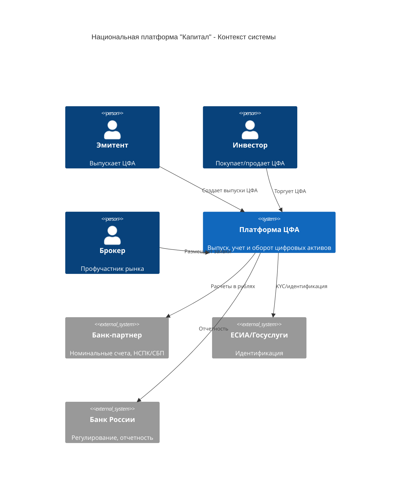
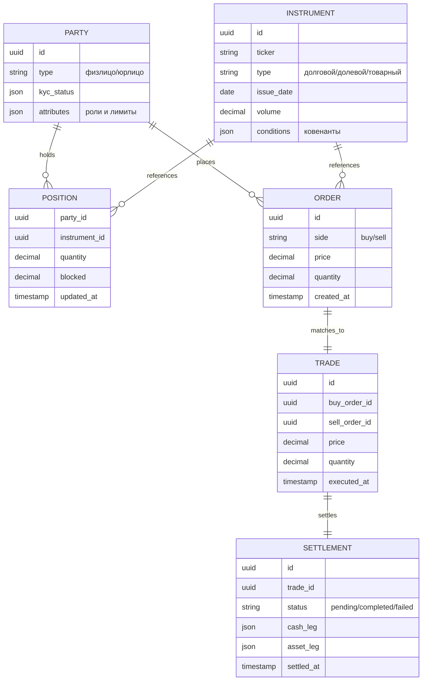
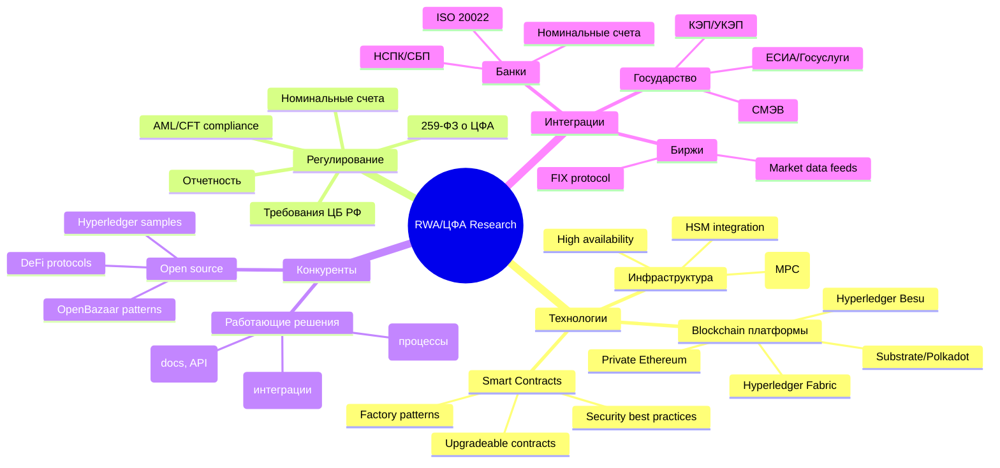

# 🎯 Комплексный анализ и стратегия: Проект Cifra-RWA-Exchange-Assets

## 📋 Executive Summary

### TL;DR
1. **Проект:** Платформа для выпуска и оборота цифровых финансовых активов (ЦФА/RWA) в России
2. **Заказчик:** Юрий Мышинский - визионер с хаотичным управлением, требует структурирования
3. **MVP:** Реалистично 3.5 месяца (560ч), не 1 месяц как ожидает заказчик
4. **Бюджет:** 40$/час (продавлен с 50$), требуется 100% предоплата блоками

## 🧠 Анализ заказчика: Юрий Мышинский

### Психологический профиль
- **Архетип:** "Визионер-Хаотик"
- **Паттерны:** Генерирует амбициозные идеи → хаотичное управление → смена приоритетов → авралы
- **Финансовая дисциплина:** Цикл "энтузиазм → задержки оплат → напоминания → выплата"

### Выученные уроки из прошлого сотрудничества

| Проблема | Проявление | Решение |
|----------|------------|---------|
| Смена приоритетов | Резко переключается между проектами | SDD + письменные спецификации |
| Авральный режим | "Срочно нужно поговорить!" | Асинхронная коммуникация по умолчанию |
| Невнимание к деталям | Ожидает, что команда "додумает" | Детальные чек-листы и подтверждения |
| Финансовые задержки | "Крипта болезненно дается" | 100% предоплата, никаких исключений |
| Торг по цене | Всегда пытается снизить ставку | Высокий якорь + кредитный баланс как рычаг |

### Финансовая история
- **Прошлая ставка:** 50$/час (проект "Нивелир", 2023)
- **Текущее предложение:** 40$/час (-20% или -43% от желаемых 70$)
- **Кредитный баланс:** +$707.68 (переплата с "Нивелира")
- **Оплачено за последний раз:** 50k рублей (~627$ за 15.7 часов)

## 🏗️ Техническая архитектура платформы

### Высокоуровневый контекст (C4 Level 1)



### Доменная модель (основные сущности)



### Микросервисная архитектура

| Сервис | Функции | Технологии | Приоритет MVP |
|--------|---------|------------|---------------|
| **identity-service** | KYC/KYB, ЕСИА, роли | Node.js, PostgreSQL | ⭐⭐⭐ |
| **tokenization-service** | Выпуск ЦФА, условия | Node.js, Smart Contracts | ⭐⭐⭐ |
| **ledger-service** | Неизменяемый реестр | Hyperledger/Ethereum | ⭐⭐⭐ |
| **trading-service** | Order matching, книга заявок | Go, Redis | ⭐⭐ |
| **settlement-service** | DvP, клиринг T+0 | Node.js, PostgreSQL | ⭐⭐ |
| **custody-service** | Хранение ключей | HSM integration | ⭐⭐⭐ |
| **compliance-service** | AML/CFT, санкции | Python, ML models | ⭐⭐ |
| **reporting-service** | Отчетность ЦБ | Node.js, PostgreSQL | ⭐ |
| **notification-service** | Email/SMS/Push | Node.js, RabbitMQ | ⭐ |
| **payment-service** | Интеграция с банками | Node.js, PostgreSQL | ⭐⭐⭐ |

## 📊 Анализ конкурентов

### Работающие платформы (12 из 20)

| Платформа | Тип | Особенности | Что изучить |
|-----------|-----|-------------|-------------|
| **Сбербанк** | Банк | Масштаб, compliance | Процессы KYC/AML |
| **Атомайз** | Tech | Hyperledger Fabric, книги | Архитектура blockchain |
| **НРД** | Депозитарий | Интеграция с ЦБ | Регуляторная отчетность |
| **Токеон** | Tech | Ethereum fork | Smart contracts patterns |
| **ВТБ Капитал** | Инвест | Профучастники | Брокерские функции |
| **СПБ Биржа** | Биржа | Торговая система | Order matching engine |

### Неработающие/ожидающие (8 из 20)

- **БКС** - Илья Хабаров перешел из Банка Синара, возможен запуск
- **Газпромбанк** - есть лицензия, но не запущен
- **ТБанк** - статус неясен
- **МАДРИГАЛ ОИС** - заявлен скорый запуск

## 🚀 MVP Roadmap

### Phase 1: Research & Architecture (2 недели, 80ч)

```markdown
## Неделя 1-2: Исследование и проектирование
- [ ] Deep research конкурентов и технологий
  - [ ] Анализ 12 работающих платформ
  - [ ] Изучение Hyperledger vs Ethereum для enterprise
  - [ ] Best practices токенизации RWA
- [ ] C4 архитектура (Context, Containers, Components)
- [ ] Выбор технологического стека
- [ ] API спецификации (OpenAPI 3.0)
- [ ] Модель данных и event-driven architecture
- [ ] Security threat model
```

### Phase 2: Core MVP (6 недель, 240ч)

```markdown
## Неделя 3-8: Базовая функциональность
- [ ] Базовая инфраструктура
  - [ ] Kubernetes cluster setup
  - [ ] CI/CD pipelines
  - [ ] Monitoring (Prometheus/Grafana)
- [ ] Identity & KYC сервис
  - [ ] Регистрация пользователей
  - [ ] Базовая верификация документов
  - [ ] Интеграция с ЕСИА (mock для MVP)
- [ ] Tokenization сервис
  - [ ] Smart contract factory
  - [ ] Выпуск простых ЦФА
  - [ ] Базовые условия (объем, дата погашения)
- [ ] Ledger сервис
  - [ ] 3 ноды Ethereum/Hyperledger
  - [ ] Запись транзакций
  - [ ] REST API для чтения
- [ ] Admin panel
  - [ ] Управление пользователями
  - [ ] Одобрение выпусков
  - [ ] Мониторинг транзакций
```

### Phase 3: Integration (4 недели, 160ч)

```markdown
## Неделя 9-12: Интеграции и расчеты
- [ ] Банковская интеграция
  - [ ] Номинальные счета
  - [ ] Webhook для поступлений
  - [ ] Вывод средств (ручное одобрение)
- [ ] Settlement сервис
  - [ ] Простой DvP механизм
  - [ ] Блокировка средств
  - [ ] Атомарные транзакции
- [ ] Базовый compliance
  - [ ] Проверка по спискам санкций
  - [ ] Лимиты операций
  - [ ] Audit trail
- [ ] Reporting
  - [ ] Экспорт транзакций
  - [ ] Базовая отчетность
```

### Phase 4: Testing & Deployment (2 недели, 80ч)

```markdown
## Неделя 13-14: Тестирование и запуск
- [ ] Security audit
- [ ] Load testing
- [ ] UAT с пилотными пользователями
- [ ] Production deployment
- [ ] Документация
- [ ] Обучение команды заказчика
```

## 💰 Финансовая стратегия

### Переговоры по ставке

```markdown
1. **Использовать кредитный баланс $707.68 как рычаг**
   - "Юрий, у нас есть кредит с прошлого проекта"
   - "Давайте сначала синхронизируем условия"

2. **Вернуть якорь на $50-70/час**
   - Ссылка на инфляцию и сложность
   - Упоминание ставок на рынке
   - Альтернатива: fixed price за фазы

3. **100% предоплата - не обсуждается**
   - Блоки по 40 часов
   - Остановка работы при исчерпании
   - Уведомление за 10 часов до конца
```

### Бюджет MVP

| Фаза | Часы | Ставка | Сумма |
|------|------|--------|-------|
| Research & Architecture | 80ч | $50/ч | $4,000 |
| Core MVP | 240ч | $50/ч | $12,000 |
| Integration | 160ч | $50/ч | $8,000 |
| Testing & Deploy | 80ч | $50/ч | $4,000 |
| **ИТОГО** | **560ч** | | **$28,000** |

*При ставке $40/час: $22,400*

## 🔬 Research План

### Приоритетные направления исследования



### Источники для изучения

1. **Официальные документы:**
   - Закон 259-ФЗ и подзаконные акты
   - Положения Банка России по ЦФА
   - Стандарты SWIFT/ISO 20022

2. **Технические ресурсы:**
   - Hyperledger documentation
   - Ethereum Enterprise Alliance
   - OpenZeppelin contracts library

3. **Конкуренты (публичная информация):**
   - Атомайз - книга "Цифровые финансовые активы"
   - Токеон - руководство по платформе
   - Cbonds.ru - бюллетени по ЦФА

4. **Сообщества:**
   - Telegram: @CFA_RF
   - GitHub: hyperledger/fabric-samples
   - Reddit: r/tokenization, r/RWA

## ⚠️ Риски и митигация

| Риск | Вероятность | Влияние | Митигация |
|------|-------------|---------|-----------|
| Смена требований от Юрия | Высокая | Высокое | SDD, письменные подтверждения |
| Задержка платежей | Высокая | Среднее | 100% предоплата, остановка работ |
| Регуляторные изменения | Средняя | Высокое | Модульная архитектура |
| Технологическая сложность blockchain | Средняя | Высокое | Начать с mock, итеративное внедрение |
| Конкуренция с существующими платформами | Низкая | Среднее | Фокус на нише/особенностях |

## 📝 Next Actions

### Немедленные действия (эта неделя):

1. **Финансы:**
   - [ ] Отправить Юрию письмо о пересмотре ставки
   - [ ] Запросить первый платеж 40ч × $50 = $2000
   - [ ] Настроить time tracking в отдельной таблице

2. **Research:**
   - [ ] Изучить публичные API Атомайз и Токеон
   - [ ] Скачать и проанализировать Hyperledger Fabric samples
   - [ ] Составить сравнительную таблицу blockchain платформ

3. **Коммуникация:**
   - [ ] Создать shared Notion/Confluence для документации
   - [ ] Запланировать еженедельный sync call
   - [ ] Отправить Юрию реалистичный timeline

4. **Архитектура:**
   - [ ] Нарисовать C4 Context diagram
   - [ ] Создать первый draft API specification
   - [ ] Определить core entities и workflows

### Долгосрочные задачи:

- Найти blockchain разработчика для консультаций
- Изучить возможность переиспользования open source компонентов
- Подготовить demo стенд для показа инвесторам

## 🎯 Критерии успеха MVP

1. **Функциональные:**
   - ✅ Регистрация и KYC для 3 типов участников
   - ✅ Выпуск простых ЦФА (долговые обязательства)
   - ✅ Базовый ledger с 3 нодами
   - ✅ Интеграция с одним банком-партнером
   - ✅ Admin panel для оператора

2. **Нефункциональные:**
   - ⚡ Производительность: 100 TPS
   - 🔒 Security: базовый compliance
   - 📊 Uptime: 99.5% (для MVP)
   - 📱 Responsive UI (desktop + mobile)

3. **Бизнес-метрики:**
   - 1 пилотный эмитент
   - 10 тестовых инвесторов
   - 1 успешный выпуск и погашение ЦФА
   - Готовность к масштабированию

---

*Документ подготовлен: 2025-10-30*
*Автор: Alex (AgentID: bb7de756-171f-4fce-ae45-534e017ebaa7)*
*Версия: 1.0*