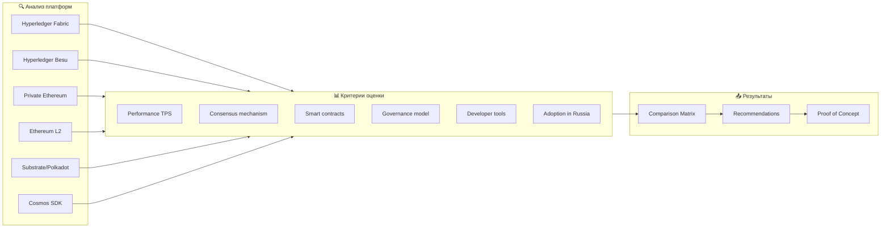
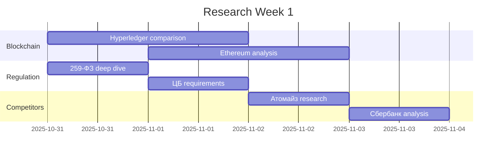
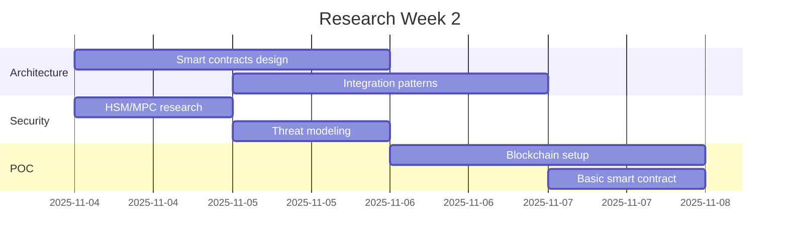

# 🔬 Deep Research Plan: RWA/ЦФА Tokenization Platform

## 📋 Research Objectives

### Primary Goals
1. **Technology Stack Selection:** Определить оптимальную blockchain платформу
2. **Competitor Analysis:** Reverse-engineering работающих решений
3. **Regulatory Compliance:** Полное понимание 259-ФЗ и требований ЦБ
4. **Integration Points:** Банки, госуслуги, биржевые протоколы
5. **Security Architecture:** HSM, MPC, key management best practices

## 🎯 Research Tracks

### Track 1: Blockchain Technology Deep Dive



#### Research Questions - Blockchain

| Вопрос | Источники | Deliverable |
|--------|-----------|-------------|
| Какой consensus лучше для 3-нод сети? | Hyperledger docs, академические papers | Таблица сравнения |
| Как организовать multi-tenancy? | GitHub examples, Stack Overflow | Architecture diagram |
| Smart contracts upgradeability? | OpenZeppelin, best practices | Code patterns |
| Gas optimization для enterprise? | Ethereum research, L2 solutions | Cost model |
| Interoperability между chains? | Polkadot docs, Cosmos IBC | Integration patterns |

### Track 2: Competitor Intelligence

#### Платформы для анализа (приоритет)

```markdown
## Tier 1 - Детальный анализ
1. **Атомайз**
   - [ ] Скачать книгу "Цифровые финансовые активы"
   - [ ] Изучить публичное API (если есть)
   - [ ] Проанализировать UI/UX через screenshots
   - [ ] Найти технические статьи/презентации

2. **Сбербанк**
   - [ ] Изучить публичную документацию
   - [ ] Анализ новостей о запуске
   - [ ] Поиск вакансий (технологии в требованиях)

3. **НРД**
   - [ ] Документация по интеграции
   - [ ] Регуляторные отчеты
   - [ ] Технические регламенты

## Tier 2 - Базовый анализ
4. **Токеон** - изучить руководство платформы
5. **ВТБ Капитал** - профучастник функционал
6. **СПБ Биржа** - торговые механизмы
7. **Лайтхаус** - blockchain решения
8. **МРЦ** - расчетная инфраструктура

## Tier 3 - Мониторинг
9-12. Остальные работающие платформы
```

#### Intelligence Matrix

| Платформа | Технологии | Функции | Бизнес-модель | Insights |
|-----------|------------|---------|---------------|----------|
| Атомайз | ? | ? | ? | Заполнить после research |
| Сбербанк | ? | ? | ? | Заполнить после research |
| НРД | ? | ? | ? | Заполнить после research |

### Track 3: Regulatory Deep Dive

#### Документы для изучения

```markdown
## Первичные источники
1. **Федеральный закон № 259-ФЗ** "О цифровых финансовых активах"
   - [ ] Полный текст с комментариями
   - [ ] Изменения и дополнения
   - [ ] Сравнение с международными аналогами

2. **Положения Банка России**
   - [ ] Положение № 746-П (правила ОИС)
   - [ ] Указание № 5635-У (отчетность)
   - [ ] Инструкция № 220-И (лицензирование)

3. **Стандарты и регламенты**
   - [ ] ГОСТ Р 34.10-2018 (электронная подпись)
   - [ ] ISO 20022 (финансовые сообщения)
   - [ ] FATF рекомендации (AML/CFT)

## Вторичные источники
4. **Аналитика и комментарии**
   - [ ] Обзоры юридических фирм
   - [ ] Статьи на Habr/VC.ru
   - [ ] Презентации с конференций
```

#### Compliance Checklist

| Требование | Источник | Реализация | Критичность |
|------------|----------|------------|-------------|
| 3+ ноды blockchain | ЦБ РФ | Hyperledger/Ethereum cluster | ⭐⭐⭐ |
| КЭП/УКЭП подписи | 63-ФЗ | Интеграция с УЦ | ⭐⭐⭐ |
| Идентификация через ЕСИА | Регламент | OAuth2 integration | ⭐⭐ |
| Номинальные счета | ГК РФ | Банк-партнер | ⭐⭐⭐ |
| AML проверки | 115-ФЗ | Sanctions screening | ⭐⭐⭐ |
| Хранение данных 5 лет | 259-ФЗ | Archive strategy | ⭐⭐ |

### Track 4: Technical Research

#### Smart Contracts Architecture

```solidity
// Research areas for smart contracts

interface ITokenFactory {
    // Factory pattern для создания ЦФА
    function createToken(
        string memory name,
        string memory symbol,
        uint256 totalSupply,
        TokenType tokenType
    ) external returns (address);
}

interface ICompliance {
    // Compliance rules engine
    function checkTransferRestrictions(
        address from,
        address to,
        uint256 amount
    ) external view returns (bool);
}

interface ISettlement {
    // DvP mechanism
    function atomicSwap(
        address token,
        uint256 amount,
        address buyer,
        address seller
    ) external;
}
```

#### Integration Research

```markdown
## Банковские интеграции
1. **НСПК/СБП**
   - [ ] API документация
   - [ ] Webhook specifications
   - [ ] Security requirements
   - [ ] Testing environment

2. **Номинальные счета**
   - [ ] Юридическая схема
   - [ ] Банки-партнеры (кто работает)
   - [ ] Reconciliation процессы
   - [ ] Комиссии и тарифы

## Государственные сервисы
3. **ЕСИА/Госуслуги**
   - [ ] OAuth2 flow
   - [ ] Scope permissions
   - [ ] Test stand access
   - [ ] Mobile ID integration

4. **СМЭВ**
   - [ ] Виды сведений
   - [ ] Адаптеры и форматы
   - [ ] Сроки ответов
```

### Track 5: Open Source Solutions

#### Repositories для изучения

```markdown
## Blockchain platforms
- hyperledger/fabric-samples
- hyperledger/besu
- ethereum/go-ethereum
- paritytech/substrate

## Smart contracts
- OpenZeppelin/openzeppelin-contracts
- ConsenSys/smart-contract-best-practices
- centrifuge/centrifuge-chain (RWA focused)

## Trading engines
- apache/kafka (event streaming)
- lmax-exchange/disruptor (low latency)
- bisq-network/bisq (DEX example)

## Compliance
- chainalysis/reactor-api-docs
- elliptic/elliptic-api-docs
```

## 🗓️ Research Timeline

### Week 1: Foundation Research


### Week 2: Technical Deep Dive


## 📊 Research Deliverables

### 1. Technology Comparison Matrix
| Критерий | Hyperledger Fabric | Hyperledger Besu | Private Ethereum | Substrate |
|----------|-------------------|------------------|------------------|-----------|
| TPS | ? | ? | ? | ? |
| Consensus | ? | ? | ? | ? |
| Smart Contracts | ? | ? | ? | ? |
| Tools | ? | ? | ? | ? |
| Russian adoption | ? | ? | ? | ? |
| **Score** | **/100** | **/100** | **/100** | **/100** |

### 2. Competitor Feature Matrix
| Функция | Атомайз | Сбербанк | НРД | Токеон | Our MVP |
|---------|---------|----------|-----|--------|---------|
| KYC/ЕСИА | ? | ? | ? | ? | ✓ |
| Выпуск долговых ЦФА | ? | ? | ? | ? | ✓ |
| Вторичный рынок | ? | ? | ? | ? | ⚠️ |
| DvP settlement | ? | ? | ? | ? | ✓ |
| Банковская интеграция | ? | ? | ? | ? | ✓ |

### 3. Architecture Decision Records (ADR)

```markdown
## ADR-001: Blockchain Platform Selection
**Status:** Proposed
**Context:** Need enterprise blockchain for 3+ nodes
**Decision:** [To be filled after research]
**Consequences:** [To be analyzed]

## ADR-002: Smart Contract Architecture
**Status:** Proposed
**Context:** Need upgradeable, secure contracts
**Decision:** [To be filled after research]
**Consequences:** [To be analyzed]

## ADR-003: Integration Strategy
**Status:** Proposed
**Context:** Multiple external systems
**Decision:** [To be filled after research]
**Consequences:** [To be analyzed]
```

## 🔎 Research Sources

### Primary Sources
1. **Official Documentation**
   - government.ru - законы и постановления
   - cbr.ru - положения и указания
   - gosuslugi.ru - техническая документация

2. **Technical Resources**
   - hyperledger.org
   - ethereum.org/enterprise
   - substrate.io

3. **Industry Reports**
   - McKinsey - "ЦФА как инфраструктура"
   - Cbonds - бюллетени по ЦФА
   - Атомайз - книги и руководства

### Community Sources
1. **Telegram Channels**
   - @CFA_RF - новости рынка
   - @blockchain_russia - техническое сообщество
   - @fintech_russia - финтех инновации

2. **Forums & Platforms**
   - Habr.com - технические статьи
   - VC.ru - бизнес-кейсы
   - GitHub - open source примеры

3. **Conferences & Webinars**
   - Blockchain Life
   - Finopolis
   - ЦФА Summit recordings

## ✅ Research Success Criteria

1. **Technology Stack:** Обоснованный выбор из 3+ вариантов
2. **Competitor Intel:** Понимание архитектуры топ-3 платформ
3. **Compliance Map:** Чек-лист из 20+ требований
4. **Integration Specs:** Документация по 5+ системам
5. **Security Model:** Threat model + mitigation strategies
6. **POC Code:** Работающий прототип на выбранной платформе

## 🚀 Next Research Actions

### Immediate (Today):
- [ ] Скачать и изучить книгу Атомайз
- [ ] Зарегистрироваться в Hyperledger Slack
- [ ] Найти GitHub repos российских ЦФА платформ

### This Week:
- [ ] Провести 5+ экспериментов с Hyperledger Fabric
- [ ] Создать сравнительную таблицу 10+ платформ
- [ ] Написать базовый smart contract для ЦФА

### Next Week:
- [ ] Интервью с экспертами (если возможно)
- [ ] Создать POC с 3 нодами
- [ ] Финализировать technology stack

---

*Research Plan Version: 1.0*
*Created: 2025-10-30*
*Author: Alex (AgentID: bb7de756-171f-4fce-ae45-534e017ebaa7)*