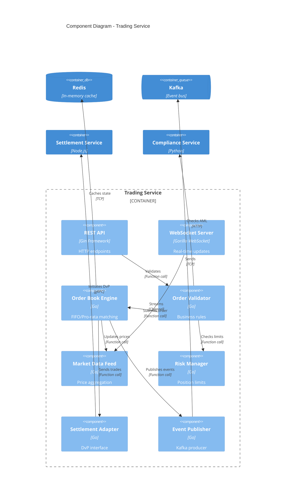
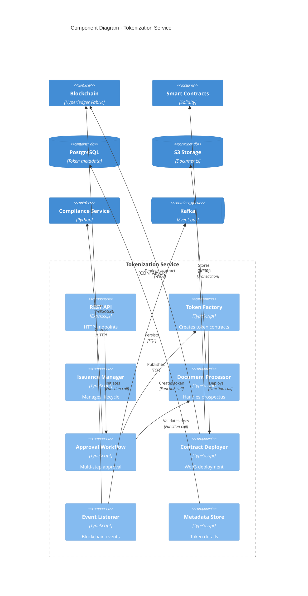
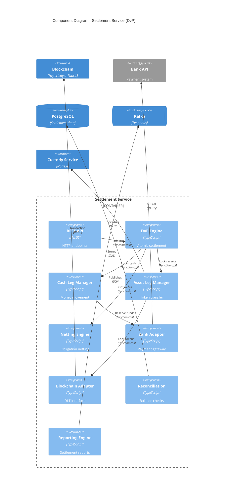
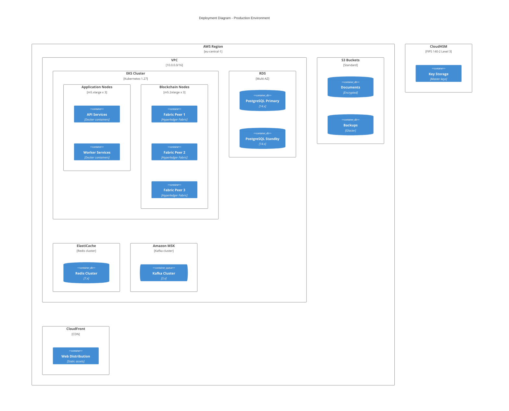

# 🏗️ C4 Architecture: Cifra-RWA Platform

## Level 1: System Context

```mermaid
C4Context
    title System Context - Национальная платформа "Капитал" ЦФА

    Person(emitent, "Эмитент", "Компания выпускающая<br/>цифровые активы")
    Person(investor, "Инвестор", "Физлицо/Юрлицо<br/>покупающее ЦФА")
    Person(broker, "Брокер/Дилер", "Профессиональный<br/>участник рынка")
    Person(operator, "Оператор ОИС", "Администратор<br/>платформы")
    Person(regulator, "Регулятор", "Банк России<br/>Росфинмониторинг")

    System(platform, "Платформа ЦФА<br/>Капитал", "Выпуск, учет и оборот<br/>цифровых финансовых активов")

    System_Ext(bank, "Банк-партнер", "Номинальные счета<br/>НСПК/СБП интеграция")
    System_Ext(gosuslugi, "ЕСИА/Госуслуги", "Идентификация<br/>граждан РФ")
    System_Ext(cbr, "Банк России", "Регуляторная<br/>отчетность")
    System_Ext(kep, "Удостоверяющий<br/>центр", "Выпуск КЭП/УКЭП<br/>сертификатов")
    System_Ext(sanctions, "Санкционные<br/>списки", "Росфинмониторинг<br/>UN/OFAC списки")

    Rel(emitent, platform, "Создает выпуски ЦФА", "HTTPS/REST")
    Rel(investor, platform, "Торгует ЦФА", "HTTPS/WebSocket")
    Rel(broker, platform, "Размещает заявки", "FIX/REST")
    Rel(operator, platform, "Администрирует", "HTTPS")
    Rel(regulator, platform, "Запрашивает отчеты", "HTTPS/SFTP")

    Rel(platform, bank, "Расчеты в рублях", "API/Webhook")
    Rel(platform, gosuslugi, "Проверка личности", "OAuth2/SAML")
    Rel(platform, cbr, "Отчетность", "ISO 20022")
    Rel(platform, kep, "Проверка подписей", "OCSP/CRL")
    Rel(platform, sanctions, "Проверка контрагентов", "REST API")
```

## Level 2: Container Diagram

```mermaid
C4Container
    title Container Diagram - Платформа ЦФА

    Person(user, "Пользователь", "Эмитент/Инвестор/Брокер")
    Person(admin, "Администратор", "Оператор ОИС")

    Container_Boundary(platform, "Платформа ЦФА") {
        Container(web_app, "Web Application", "React/TypeScript", "SPA для пользователей")
        Container(admin_panel, "Admin Panel", "React/TypeScript", "Панель администратора")
        Container(mobile_app, "Mobile App", "React Native", "Мобильное приложение")

        Container(api_gateway, "API Gateway", "Kong/Nginx", "Rate limiting, auth, routing")
        Container(auth_service, "Auth Service", "Node.js/NestJS", "OAuth2, JWT, RBAC")

        Container_Boundary(core_services, "Core Services") {
            Container(identity_service, "Identity Service", "Node.js", "KYC/KYB, ЕСИА")
            Container(tokenization_service, "Tokenization Service", "Node.js", "Выпуск ЦФА")
            Container(trading_service, "Trading Service", "Go", "Order matching")
            Container(settlement_service, "Settlement Service", "Node.js", "DvP, clearing")
            Container(custody_service, "Custody Service", "Node.js", "Key management")
            Container(compliance_service, "Compliance Service", "Python", "AML/CFT checks")
        }

        Container(blockchain, "Blockchain Layer", "Hyperledger Fabric", "3+ nodes DLT")
        Container(smart_contracts, "Smart Contracts", "Solidity/Go", "ЦФА logic")

        ContainerDb(postgres, "PostgreSQL", "PostgreSQL 14", "Operational data")
        ContainerDb(redis, "Redis", "Redis 7", "Cache, sessions")
        ContainerQueue(kafka, "Kafka", "Apache Kafka", "Event streaming")
        ContainerDb(s3, "Object Storage", "MinIO/S3", "Documents, files")
    }

    System_Ext(bank_api, "Bank API", "Payment gateway")
    System_Ext(esia, "ЕСИА", "Identity provider")

    Rel(user, web_app, "Uses", "HTTPS")
    Rel(user, mobile_app, "Uses", "HTTPS")
    Rel(admin, admin_panel, "Uses", "HTTPS")

    Rel(web_app, api_gateway, "API calls", "HTTPS/WSS")
    Rel(admin_panel, api_gateway, "API calls", "HTTPS")
    Rel(mobile_app, api_gateway, "API calls", "HTTPS")

    Rel(api_gateway, auth_service, "Authenticates", "gRPC")
    Rel(api_gateway, identity_service, "Routes", "HTTP")
    Rel(api_gateway, tokenization_service, "Routes", "HTTP")
    Rel(api_gateway, trading_service, "Routes", "HTTP/WebSocket")
    Rel(api_gateway, settlement_service, "Routes", "HTTP")
    Rel(api_gateway, custody_service, "Routes", "HTTP")
    Rel(api_gateway, compliance_service, "Routes", "HTTP")

    Rel(tokenization_service, smart_contracts, "Deploys", "Web3")
    Rel(settlement_service, blockchain, "Writes", "gRPC")
    Rel(trading_service, redis, "Caches", "TCP")
    Rel_Back(kafka, settlement_service, "Events")

    Rel(identity_service, esia, "Verifies", "OAuth2")
    Rel(settlement_service, bank_api, "Payments", "REST")
```

## Level 3: Component Diagram - Trading Service

## Level 3: Component Diagram - Tokenization Service

## Level 3: Component Diagram - Settlement Service

## Deployment Diagram

## Security Architecture

```mermaid
flowchart TB
    subgraph Internet["🌐 Internet"]
        Users["Users"]
        Attackers["Potential Attackers"]
    end

    subgraph DMZ["🛡️ DMZ"]
        WAF["WAF<br/>(ModSecurity)"]
        DDoS["DDoS Protection<br/>(CloudFlare)"]
        CDN["CDN<br/>(CloudFront)"]
    end

    subgraph AppLayer["🔐 Application Layer"]
        ALB["Application Load Balancer"]
        APIGateway["API Gateway<br/>(Rate limiting, auth)"]
        OAuth["OAuth2/OIDC<br/>(Keycloak)"]
    end

    subgraph ServiceMesh["🔗 Service Mesh"]
        Istio["Istio<br/>(mTLS, policies)"]
        Services["Microservices"]
    end

    subgraph DataLayer["💾 Data Layer"]
        Encryption["Encryption at Rest<br/>(AES-256)"]
        Vault["HashiCorp Vault<br/>(Secrets)"]
        HSM["CloudHSM<br/>(Keys)"]
    end

    subgraph Monitoring["📊 Security Monitoring"]
        SIEM["SIEM<br/>(Elastic)"]
        IDS["IDS/IPS<br/>(Suricata)"]
        Audit["Audit Logs"]
    end

    Users --> WAF
    Attackers -.-> WAF
    WAF --> DDoS
    DDoS --> CDN
    CDN --> ALB
    ALB --> APIGateway
    APIGateway --> OAuth
    OAuth --> Istio
    Istio --> Services
    Services --> Encryption
    Services --> Vault
    Services --> HSM

    Services --> SIEM
    APIGateway --> IDS
    Services --> Audit

    style Attackers fill:#ff6b6b
    style WAF fill:#4ecdc4
    style OAuth fill:#95e77e
    style HSM fill:#ffe66d
    style SIEM fill:#a8e6cf
```

## Data Flow - Token Issuance

```mermaid
sequenceDiagram
    participant E as Эмитент
    participant W as Web App
    participant API as API Gateway
    participant Auth as Auth Service
    participant T as Tokenization Service
    participant C as Compliance Service
    participant B as Blockchain
    participant S as Smart Contract
    participant N as Notification Service

    E->>W: Создать выпуск ЦФА
    W->>API: POST /api/tokens/issue
    API->>Auth: Verify JWT
    Auth-->>API: User context
    API->>T: Create token request

    T->>C: Compliance check
    C->>C: AML/KYC verification
    C->>C: Document validation
    C-->>T: Approved

    T->>T: Generate token params
    T->>B: Deploy contract
    B->>S: Create token contract
    S-->>B: Contract address
    B-->>T: Deployment confirmed

    T->>T: Store metadata
    T->>N: Send notifications
    N->>E: Email confirmation
    T-->>API: Token created
    API-->>W: Success response
    W-->>E: Show token details
```

## Data Flow - DvP Settlement

```mermaid
sequenceDiagram
    participant I as Инвестор
    participant T as Trading Service
    participant S as Settlement Service
    participant Cu as Custody Service
    participant B as Bank API
    participant BC as Blockchain
    participant N as Notification

    I->>T: Buy order
    T->>T: Match order
    T->>S: Initiate settlement

    par Cash Leg
        S->>B: Reserve funds
        B->>B: Block amount
        B-->>S: Funds blocked
    and Asset Leg
        S->>Cu: Reserve tokens
        Cu->>BC: Lock tokens
        BC-->>Cu: Tokens locked
        Cu-->>S: Assets blocked
    end

    S->>S: Verify both legs

    alt Success
        S->>B: Transfer funds
        S->>BC: Transfer tokens
        S->>N: Settlement complete
        N->>I: Confirmation
    else Failure
        S->>B: Release funds
        S->>BC: Unlock tokens
        S->>N: Settlement failed
        N->>I: Failure notice
    end
```

## Technology Stack Summary

| Layer | Technology | Justification |
|-------|------------|---------------|
| **Frontend** | React 18, TypeScript, MobX | Modern, type-safe, enterprise-ready |
| **Mobile** | React Native | Cross-platform, code reuse |
| **API Gateway** | Kong | Rate limiting, auth, analytics |
| **Backend** | Node.js/NestJS (main), Go (performance-critical) | Balance of productivity and performance |
| **Blockchain** | Hyperledger Fabric 2.5 | Enterprise features, private network |
| **Smart Contracts** | Go (Fabric chaincode) | Native Fabric support |
| **Message Queue** | Apache Kafka | High throughput, durability |
| **Cache** | Redis 7 | Performance, pub/sub |
| **Database** | PostgreSQL 14 | ACID, JSON support |
| **Object Storage** | MinIO/S3 | Documents, scalability |
| **Container** | Docker, Kubernetes (EKS) | Orchestration, scaling |
| **CI/CD** | GitLab CI, ArgoCD | GitOps, automation |
| **Monitoring** | Prometheus, Grafana, ELK | Observability stack |
| **Security** | Keycloak, HashiCorp Vault, CloudHSM | Enterprise security |

## Architecture Decisions Records (ADRs)

### ADR-001: Blockchain Platform
**Decision:** Hyperledger Fabric over Ethereum
**Rationale:**
- Private permissioned network required by regulation
- No gas fees for transactions
- Better privacy controls
- Enterprise support

### ADR-002: Microservices vs Monolith
**Decision:** Microservices architecture
**Rationale:**
- Independent scaling of components
- Technology diversity (Node.js + Go + Python)
- Team autonomy
- Fault isolation

### ADR-003: Event-Driven Architecture
**Decision:** Kafka for event streaming
**Rationale:**
- Decoupling of services
- Event sourcing capabilities
- High throughput for market data
- Durability and replay

### ADR-004: Database per Service
**Decision:** Each service owns its data
**Rationale:**
- Service autonomy
- Independent scaling
- Technology flexibility
- Avoid distributed transactions

### ADR-005: API Gateway Pattern
**Decision:** Kong as single entry point
**Rationale:**
- Centralized authentication
- Rate limiting
- API versioning
- Analytics and monitoring

