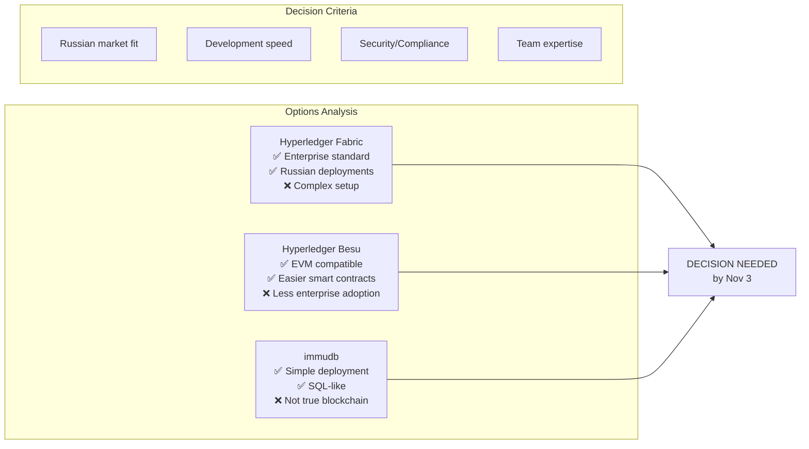
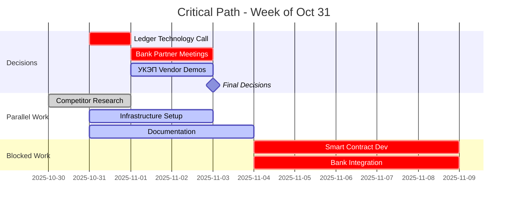

# 🚨 CRITICAL ACTIONS & BLOCKER RESOLUTION

## 🔴 PROJECT IS BLOCKED - 3 Critical Decisions Required

### ⚡ BLOCKER #1: Ledger Technology Choice
**Status**: 🔴 BLOCKING ALL DEVELOPMENT



**Action Required**:
1. Schedule 1-hour decision call with Юрий
2. Present comparison matrix
3. Make final choice
4. Document decision rationale

---

### ⚡ BLOCKER #2: Bank Partner Selection
**Status**: 🔴 BLOCKING PAYMENT INTEGRATION

| Bank Option | DvP Ready? | Nominal Accounts | API Access | Risk |
|-------------|------------|------------------|------------|------|
| **Сбербанк** | Unknown | ✅ Yes | ✅ Yes | Low |
| **ВТБ** | Unknown | ✅ Yes | Limited | Medium |
| **Тинькофф** | ❌ No | ✅ Yes | ✅ Yes | High |
| **Альфа-Банк** | Unknown | ✅ Yes | ✅ Yes | Medium |

**Immediate Actions**:
- [ ] Юрий to call bank representatives
- [ ] Request DvP capability confirmation
- [ ] Get API documentation
- [ ] Negotiate nominal account terms

---

### ⚡ BLOCKER #3: УКЭП Vendor Decision
**Status**: 🟡 BLOCKING COMPLIANCE

| Vendor | Integration | Cost | Support | Compliance |
|--------|------------|------|---------|------------|
| **КриптоПро** | Complex | High | Good | ✅ Full |
| **ViPNet** | Medium | Medium | Good | ✅ Full |
| **Signal-COM** | Simple | Low | Limited | ⚠️ Basic |

**Required Steps**:
1. Get vendor demos (this week)
2. Review integration docs
3. Estimate implementation effort
4. Select by Nov 3

---

## 📋 UNBLOCKED Actions (Can Start Now)

### 1. Research & Documentation (Alex can do NOW)
```bash
# These don't require decisions:
- [ ] Complete competitor API analysis
- [ ] Document regulatory requirements
- [ ] Create development environment setup guide
- [ ] Prepare project wiki structure
```

### 2. Infrastructure Preparation
```yaml
# Can be done regardless of blockchain choice:
tasks:
  - Setup Git repository structure
  - Configure CI/CD pipeline skeleton
  - Prepare Docker Compose templates
  - Create monitoring dashboards
```

### 3. Business Process Mapping
- [ ] Document CFA issuance workflow
- [ ] Map KYC/KYB requirements
- [ ] Define user roles and permissions
- [ ] Create state diagrams for transactions

---

## 🎯 This Week's Priority Matrix



---

## 💬 Communication Templates

### For Юрий - Decision Request Email
```
Subject: 🚨 3 Critical Decisions Needed by Nov 3

Юрий,

Project is blocked on 3 decisions:

1. BLOCKCHAIN: Fabric vs Besu vs immudb
   - Need: Architecture determines everything
   - Impact: 2-week delay if changed later

2. BANK: Which partner for DvP?
   - Need: API access and nominal accounts
   - Impact: Payment flow blocked

3. УКЭП: Which vendor?
   - Need: Digital signature compliance
   - Impact: Legal requirements

Can we schedule 1 hour tomorrow to decide?

Timeline impact if delayed:
- Each day = 3-day cascade delay
- Nov 6+ decision = December MVP slip

Ready with comparison matrices.

-Alex
```

### For Bank Partners - Capability Check
```
Subject: ЦФА Platform Integration Requirements

Need to confirm your capabilities for:
1. DvP (Delivery vs Payment) atomic settlement
2. Nominal account management API
3. Real-time transaction notifications
4. ISO 20022 message support

Timeline: POC in 2 weeks
Volume: 1000 transactions/day initially

Please confirm by Nov 2.
```

---

## 📊 Decision Support Matrix

### Blockchain Technology Scorecard

| Criteria (Weight) | Fabric | Besu | immudb |
|-------------------|--------|------|--------|
| **Russian Adoption (30%)** | 9/10 | 6/10 | 4/10 |
| **Dev Speed (25%)** | 5/10 | 8/10 | 9/10 |
| **Security (20%)** | 10/10 | 9/10 | 7/10 |
| **Scalability (15%)** | 9/10 | 8/10 | 6/10 |
| **Cost (10%)** | 6/10 | 8/10 | 9/10 |
| **TOTAL** | **7.85** | **7.75** | **6.95** |

**Recommendation**: Hyperledger Fabric (marginal lead, better for enterprise)

---

## 🔄 Daily Standup Template

### Until Decisions Made (Nov 1-3)
```markdown
## Daily Update to Юрий

**Blocked on**:
- [ ] Ledger choice
- [ ] Bank selection
- [ ] УКЭП vendor

**Completed today**:
- {parallel work items}

**Risk**: Each day of delay = 3 days MVP slip

**Need from you**: {specific action}
```

---

## 📈 Unblocking Metrics

| Metric | Current | Target | Date |
|--------|---------|--------|------|
| **Decisions Made** | 0/3 | 3/3 | Nov 3 |
| **Parallel Tasks** | 2/8 | 8/8 | Nov 3 |
| **Team Ready** | 60% | 100% | Nov 4 |
| **Dev Environment** | 0% | 100% | Nov 4 |

---

## 🚀 Post-Decision Sprint Plan

### Once Unblocked (Nov 4+):
1. **Hour 0-8**: Deploy chosen blockchain (3 nodes)
2. **Hour 8-16**: Smart contract "Hello World"
3. **Hour 16-24**: Bank API integration test
4. **Hour 24-32**: KYC service skeleton
5. **Hour 32-40**: First demo preparation

### Success Criteria Week 1:
- [ ] Blockchain running
- [ ] Can mint test token
- [ ] Bank API connected
- [ ] Basic auth working
- [ ] Demo to Юрий

---

## ⏰ Escalation Timeline

```
Oct 31 (Today): Send decision request
Nov 1: Follow-up call if no response
Nov 2: Escalation email with timeline impact
Nov 3: Go/No-go decision point
Nov 4: Start development OR pause project
```

---

*Critical actions identified by cc-03-0f8f | Project unblocking focus*