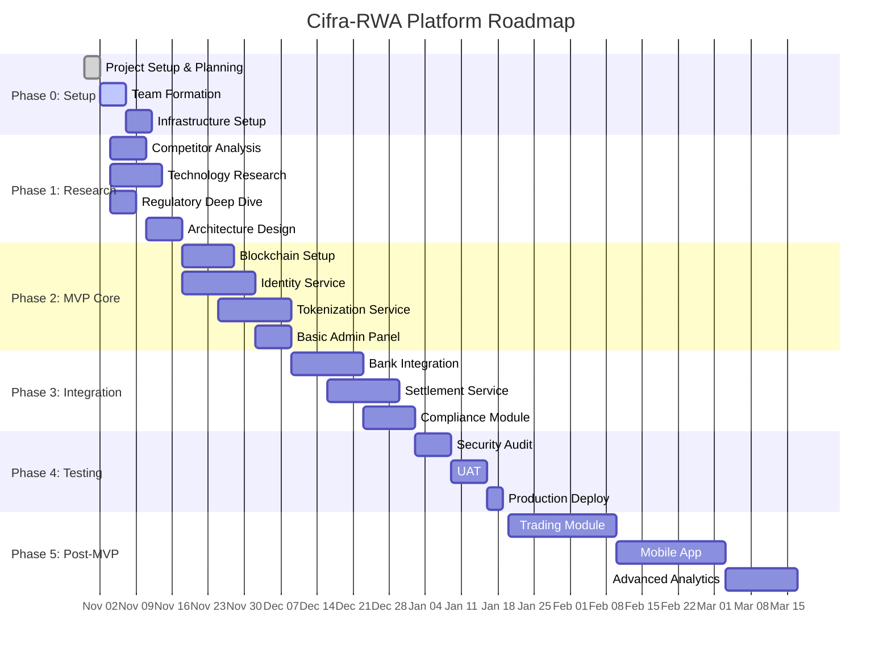
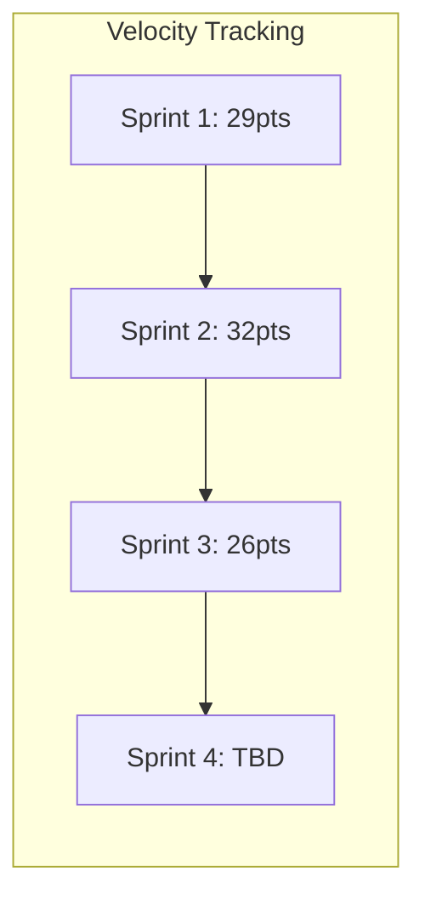

# 📅 Roadmap & Backlog: Cifra-RWA Platform

## 🎯 Project Vision

**Создать платформу для выпуска и оборота цифровых финансовых активов (ЦФА), соответствующую требованиям 259-ФЗ и положениям Банка России.**

## 🚀 High-Level Roadmap



## 📊 Release Plan

| Release | Target Date | Key Features | Success Criteria |
|---------|------------|--------------|------------------|
| **v0.1 Alpha** | 2025-11-30 | • Basic infrastructure<br/>• 3-node blockchain<br/>• Simple smart contract | Blockchain operational |
| **v0.5 MVP** | 2025-12-31 | • KYC/Identity<br/>• Token issuance<br/>• Admin panel<br/>• Bank integration (mock) | Can issue test token |
| **v1.0 Beta** | 2026-01-31 | • Full compliance<br/>• Real bank integration<br/>• Settlement T+0<br/>• Production-ready | Pass security audit |
| **v1.5 GA** | 2026-02-28 | • Trading module<br/>• Mobile app<br/>• Analytics dashboard | 10 live transactions |
| **v2.0** | 2026-03-31 | • Secondary market<br/>• Advanced features<br/>• Multi-bank support | 100+ users |

## 📋 Product Backlog

### Epic 1: Infrastructure & DevOps

```markdown
## User Stories

### INFRA-001: Kubernetes Cluster Setup
**As a** DevOps engineer
**I want** to set up EKS cluster with auto-scaling
**So that** we have reliable container orchestration
**Acceptance Criteria:**
- [ ] 3 worker nodes minimum
- [ ] Auto-scaling configured 3-10 nodes
- [ ] Monitoring with Prometheus/Grafana
- [ ] GitOps with ArgoCD
**Story Points:** 8
**Priority:** P0

### INFRA-002: CI/CD Pipeline
**As a** developer
**I want** automated build and deployment pipeline
**So that** we can deploy safely and quickly
**Acceptance Criteria:**
- [ ] GitLab CI configured
- [ ] Docker image building
- [ ] Automated tests on PR
- [ ] Deployment to dev/staging/prod
**Story Points:** 5
**Priority:** P0

### INFRA-003: Monitoring Stack
**As a** SRE
**I want** comprehensive monitoring and alerting
**So that** we can detect and fix issues quickly
**Acceptance Criteria:**
- [ ] Prometheus metrics collection
- [ ] Grafana dashboards
- [ ] Alert manager with PagerDuty
- [ ] ELK stack for logs
**Story Points:** 8
**Priority:** P1
```

### Epic 2: Blockchain Layer

```markdown
## User Stories

### BLOCK-001: Hyperledger Fabric Setup
**As a** platform operator
**I want** private blockchain network with 3+ nodes
**So that** we comply with regulatory requirements
**Acceptance Criteria:**
- [ ] 3 peer nodes running
- [ ] 1 orderer node
- [ ] Channel configured
- [ ] Chaincode deployment working
**Story Points:** 13
**Priority:** P0

### BLOCK-002: Smart Contract Factory
**As a** token issuer
**I want** to deploy token contracts programmatically
**So that** I can create new ЦФА types
**Acceptance Criteria:**
- [ ] Token template contract
- [ ] Factory pattern implementation
- [ ] Upgradeable contracts
- [ ] Event emission
**Story Points:** 8
**Priority:** P0

### BLOCK-003: Blockchain Explorer
**As an** administrator
**I want** to view blockchain transactions
**So that** I can audit the system
**Acceptance Criteria:**
- [ ] Web interface for blocks/transactions
- [ ] Search by hash/address
- [ ] Export capabilities
**Story Points:** 5
**Priority:** P2
```

### Epic 3: Identity & KYC

```markdown
## User Stories

### KYC-001: User Registration
**As a** new user
**I want** to register on the platform
**So that** I can access ЦФА services
**Acceptance Criteria:**
- [ ] Email/phone registration
- [ ] Email verification
- [ ] Password requirements (NIST)
- [ ] Terms acceptance
**Story Points:** 3
**Priority:** P0

### KYC-002: ЕСИА Integration
**As a** Russian citizen
**I want** to login via Gosuslugi
**So that** I can use verified identity
**Acceptance Criteria:**
- [ ] OAuth2 flow with ЕСИА
- [ ] Profile data import
- [ ] Automatic verification
- [ ] Fallback to manual KYC
**Story Points:** 8
**Priority:** P0

### KYC-003: Document Verification
**As a** compliance officer
**I want** to verify user documents
**So that** we comply with AML requirements
**Acceptance Criteria:**
- [ ] Document upload (passport, SNILS)
- [ ] OCR extraction
- [ ] Manual review queue
- [ ] Approval/rejection workflow
**Story Points:** 5
**Priority:** P0

### KYC-004: Sanctions Screening
**As a** platform
**I want** to check users against sanctions lists
**So that** we comply with regulations
**Acceptance Criteria:**
- [ ] Rosfinmonitoring list check
- [ ] UN/OFAC lists check
- [ ] Daily re-screening
- [ ] Alert on matches
**Story Points:** 5
**Priority:** P0
```

### Epic 4: Token Issuance

```markdown
## User Stories

### TOKEN-001: Create Token Issuance
**As an** emitent
**I want** to create new ЦФА issue
**So that** I can raise capital
**Acceptance Criteria:**
- [ ] Token parameters form
- [ ] Document upload (prospectus)
- [ ] Terms configuration
- [ ] Preview before submission
**Story Points:** 8
**Priority:** P0

### TOKEN-002: Approval Workflow
**As an** administrator
**I want** to review and approve token issuances
**So that** only compliant tokens are issued
**Acceptance Criteria:**
- [ ] Review queue
- [ ] Document verification
- [ ] Compliance checklist
- [ ] Approve/reject with comments
**Story Points:** 5
**Priority:** P0

### TOKEN-003: Token Deployment
**As a** system
**I want** to deploy approved tokens to blockchain
**So that** they become tradeable
**Acceptance Criteria:**
- [ ] Automatic deployment on approval
- [ ] Contract verification
- [ ] Initial supply minting
- [ ] Event notifications
**Story Points:** 8
**Priority:** P0

### TOKEN-004: Token Lifecycle Management
**As a** token issuer
**I want** to manage token lifecycle events
**So that** I can pay coupons and redeem
**Acceptance Criteria:**
- [ ] Coupon payment scheduling
- [ ] Corporate actions
- [ ] Redemption at maturity
- [ ] Burn mechanism
**Story Points:** 13
**Priority:** P1
```

### Epic 5: Settlement & Payments

```markdown
## User Stories

### SETTLE-001: Bank Account Integration
**As a** user
**I want** to deposit RUB to my account
**So that** I can buy ЦФА
**Acceptance Criteria:**
- [ ] Nominal account at partner bank
- [ ] Deposit instructions generation
- [ ] Webhook for confirmations
- [ ] Balance updates
**Story Points:** 8
**Priority:** P0

### SETTLE-002: DvP Settlement
**As a** platform
**I want** atomic delivery-versus-payment
**So that** trades settle safely
**Acceptance Criteria:**
- [ ] Cash leg reservation
- [ ] Asset leg reservation
- [ ] Atomic swap execution
- [ ] Rollback on failure
**Story Points:** 13
**Priority:** P0

### SETTLE-003: Withdrawal Process
**As a** user
**I want** to withdraw RUB from platform
**So that** I can access my funds
**Acceptance Criteria:**
- [ ] Withdrawal request form
- [ ] AML checks
- [ ] Manual approval for large amounts
- [ ] Bank transfer initiation
**Story Points:** 5
**Priority:** P0

### SETTLE-004: Settlement Reporting
**As a** compliance officer
**I want** daily settlement reports
**So that** I can reconcile accounts
**Acceptance Criteria:**
- [ ] Daily settlement summary
- [ ] Transaction details
- [ ] Failed settlements log
- [ ] Export to Excel/PDF
**Story Points:** 3
**Priority:** P1
```

### Epic 6: Trading (Post-MVP)

```markdown
## User Stories

### TRADE-001: Order Book
**As a** trader
**I want** to see current orders
**So that** I can make trading decisions
**Acceptance Criteria:**
- [ ] Real-time bid/ask display
- [ ] Depth chart
- [ ] Order history
- [ ] Price/volume indicators
**Story Points:** 8
**Priority:** P2

### TRADE-002: Place Orders
**As a** trader
**I want** to place buy/sell orders
**So that** I can trade ЦФА
**Acceptance Criteria:**
- [ ] Market orders
- [ ] Limit orders
- [ ] Order validation
- [ ] Confirmation screen
**Story Points:** 5
**Priority:** P2

### TRADE-003: Order Matching Engine
**As a** system
**I want** to match orders automatically
**So that** trades execute efficiently
**Acceptance Criteria:**
- [ ] FIFO matching algorithm
- [ ] Price-time priority
- [ ] Partial fills
- [ ] Trade execution events
**Story Points:** 13
**Priority:** P2
```

### Epic 7: Compliance & Reporting

```markdown
## User Stories

### COMPL-001: AML Transaction Monitoring
**As a** compliance officer
**I want** to monitor suspicious transactions
**So that** we detect money laundering
**Acceptance Criteria:**
- [ ] Rule-based alerts
- [ ] ML anomaly detection
- [ ] Investigation workflow
- [ ] SAR filing
**Story Points:** 13
**Priority:** P1

### COMPL-002: Regulatory Reporting
**As a** platform
**I want** to generate regulatory reports
**So that** we comply with CBR requirements
**Acceptance Criteria:**
- [ ] Daily transaction reports
- [ ] Monthly summaries
- [ ] XML format per CBR spec
- [ ] Automatic submission
**Story Points:** 8
**Priority:** P1

### COMPL-003: Audit Trail
**As an** auditor
**I want** complete audit trail
**So that** I can verify compliance
**Acceptance Criteria:**
- [ ] All actions logged
- [ ] Immutable log storage
- [ ] Search and filter
- [ ] Export capabilities
**Story Points:** 5
**Priority:** P1
```

## 🎲 Sprint Planning

### Sprint 1 (Nov 4-17, 2025)
**Sprint Goal:** Set up development infrastructure and begin research

| Story ID | Story | Points | Assignee |
|----------|-------|--------|----------|
| INFRA-001 | Kubernetes Setup | 8 | DevOps |
| INFRA-002 | CI/CD Pipeline | 5 | DevOps |
| Research | Competitor Analysis | 8 | Alex |
| Research | Blockchain Evaluation | 8 | Alex |
| **Total** | | **29** | |

### Sprint 2 (Nov 18 - Dec 1, 2025)
**Sprint Goal:** Implement blockchain layer foundation

| Story ID | Story | Points | Assignee |
|----------|-------|--------|----------|
| BLOCK-001 | Fabric Setup | 13 | Blockchain Dev |
| BLOCK-002 | Smart Contracts | 8 | Blockchain Dev |
| KYC-001 | User Registration | 3 | Backend Dev |
| INFRA-003 | Monitoring | 8 | DevOps |
| **Total** | | **32** | |

### Sprint 3 (Dec 2-15, 2025)
**Sprint Goal:** Complete identity service and start tokenization

| Story ID | Story | Points | Assignee |
|----------|-------|--------|----------|
| KYC-002 | ЕСИА Integration | 8 | Backend Dev |
| KYC-003 | Document Verification | 5 | Backend Dev |
| TOKEN-001 | Create Issuance | 8 | Backend Dev |
| TOKEN-002 | Approval Workflow | 5 | Backend Dev |
| **Total** | | **26** | |

## 📈 Velocity & Burndown



**Average Velocity:** ~29 points/sprint
**Total Backlog:** ~250 points
**Estimated Sprints:** 9 sprints
**Estimated Completion:** March 2026

## 🎯 Definition of Ready

- [ ] User story has clear acceptance criteria
- [ ] Story is estimated in points
- [ ] Dependencies identified
- [ ] Technical approach discussed
- [ ] Test scenarios defined

## ✅ Definition of Done

- [ ] Code complete and peer reviewed
- [ ] Unit tests written (>80% coverage)
- [ ] Integration tests passing
- [ ] Documentation updated
- [ ] Deployed to staging
- [ ] Product owner acceptance

## 🚦 Risk Register

| Risk | Probability | Impact | Mitigation |
|------|------------|--------|------------|
| Regulatory changes | Medium | High | Weekly monitoring of laws |
| Blockchain scalability | Low | High | Load testing early |
| Bank integration delays | High | Medium | Start early, have backup |
| Team scaling | Medium | Medium | Start hiring now |
| Security vulnerabilities | Medium | Critical | Regular audits |

## 📊 Success Metrics (KPIs)

### Technical KPIs
- System uptime: >99.5%
- Transaction success rate: >99%
- API response time: <200ms p95
- Blockchain finality: <5 seconds

### Business KPIs
- Time to issue token: <24 hours
- User onboarding: <1 hour
- Daily active users: 100+ by Q2 2026
- Total value locked: 100M RUB by Q2 2026

### Compliance KPIs
- KYC completion rate: >95%
- False positive rate (AML): <5%
- Regulatory reports on time: 100%
- Audit findings: 0 critical

## 🔄 Iteration Planning

### PI 1: Foundation (Nov 2025 - Jan 2026)
**Theme:** Build core platform
- Infrastructure setup
- Blockchain implementation
- Basic services (KYC, Tokenization)
- Compliance framework

### PI 2: Enhancement (Feb - Apr 2026)
**Theme:** Add trading and mobile
- Trading module
- Mobile applications
- Advanced analytics
- Performance optimization

### PI 3: Scale (May - Jul 2026)
**Theme:** Growth and optimization
- Multi-bank support
- Advanced trading features
- International expansion prep
- Enterprise features

