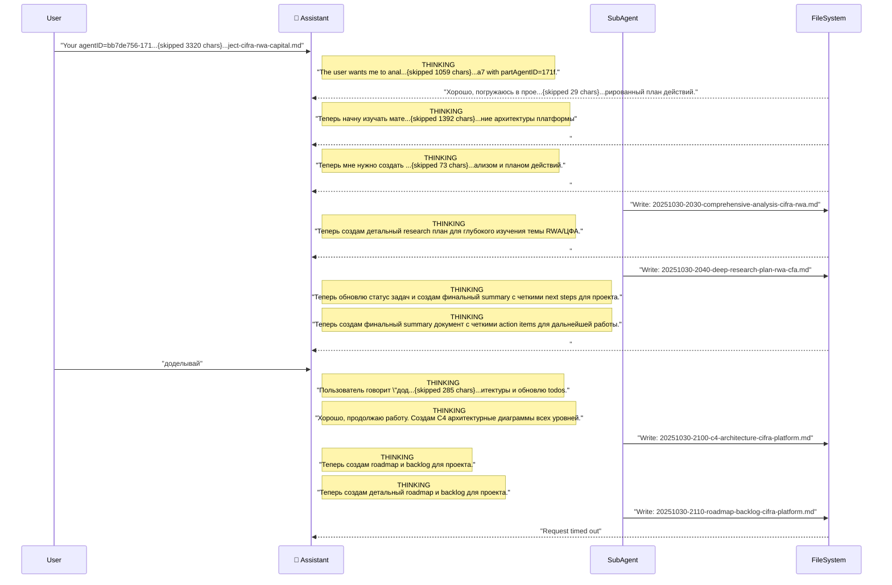

==================================================
Session ID: 044a0f7b-4e82-4f92-a6f3-82e846fbc64f
Total Messages: 22
Timeline: 10/30/2025, 08:33:10 PM - 10/30/2025, 11:13:13 PM. Duration is 02:40(hh:mm)
Total subagents: 0
Total files: 0 / 4
Total commands run: 0
Total thinkings: 10
Total insights: 0
==================================================

# Sequence Diagram



# Thinking and Insights

## 1 The user wants me to anal...{skipped 1113}...a7 with partAgentID=171f.
```markdown
The user wants me to analyze a large amount of context about a project called Cifra-RWA-Exchange-Assets. Let me break down what I need to do:

1. First, I'll read all the provided files to understand:
   - Yury Myshinskiy (the founder/client) and his working patterns
   - The intro call transcript
   - Telegram conversation history 
   - User's thoughts and plans for the project
   - External estimation from another team
   - Various artifacts and documents about the platform

2. Based on the user's thoughts file, the main goals are:
   - Create a digital exchange for tokenized assets (RWA - Real World Assets)
   - This is for the Russian market, dealing with ЦФА (Digital Financial Assets)
   - Need to do deep research on existing solutions, competitors, technologies
   - Create architecture documentation (C4 diagrams, etc.)
   - Break down into manageable pieces for implementation

Let me start by reading the files in order to build a comprehensive understanding.

The user has given me specific files to read and indicated this is about jumping into the Cifra-RWA project. The agentID is bb7de756-171f-4fce-ae45-534e017ebaa7 with partAgentID=171f.
```

## 2 Теперь начну изучать мате...{skipped 1447}...ние архитектуры платформы
```markdown
Теперь начну изучать материалы последовательно. Прочитал файлы и понял ключевые моменты. Теперь нужно создать структурированный анализ и план действий по проекту.

Основные выводы из прочитанных материалов:

1. **О Юрии Мышинском:**
   - Визионер-хаотик, генерирует амбициозные идеи но склонен к хаотичному управлению
   - Финансовый паттерн: энтузиазм → задержки оплат → необходимость напоминаний
   - Единственная рабочая модель - 100% предоплата за блоки часов
   - Ставка была $hourly_rate/час, сейчас продавлен до 40$/час
   - Есть кредитный баланс в $707.68 с прошлого проекта

2. **О проекте Cifra-RWA:**
   - Цифровая биржа токенизированных активов (ЦФА)
   - Для российского рынка
   - Нужна платформа с KYC, выпуском токенов, торгами, расчетами
   - MVP за 3-4 месяца согласно внешней оценке
   - Оценка от внешней команды - 6000 часов

3. **Технические требования:**
   - Микросервисная архитектура
   - Blockchain (Hyperledger Fabric/Besu или локальный Ethereum)
   - Интеграции с банками, НСПК, госуслугами
   - HSM/MPC для ключей
   - Необходимость строгого соблюдения нормативных требований и противодействия отмыванию денег
   - Разработка комплексной системы проверки и мониторинга транзакций
   - Интеграция с государственными системами контроля финансовых операций

4. **Текущее состояние:**
   - Есть анализ конкурентов (12 работающих платформ в РФ)
   - Есть документация и примеры функционала
   - Требуется глубокое исследование рынка и детальное проектирование архитектуры платформы
```

## 3 Теперь мне нужно создать ...{skipped 123}...ализом и планом действий.
```markdown
Теперь мне нужно создать комплексный контекст и стратегию на основе всей изученной информации. Давайте создам структурированный документ с полным анализом и планом действий.
```

## 4 Теперь создам детальный r...{skipped 24}...го изучения темы RWA/ЦФА.
```markdown
Теперь создам детальный research план для глубокого изучения темы RWA/ЦФА.
```

## 5 Теперь обновлю статус зад...{skipped 38}...и next steps для проекта.
```markdown
Теперь обновлю статус задач и создам финальный summary с четкими next steps для проекта.
```

## 6 Теперь создам финальный s...{skipped 36}...ms для дальнейшей работы.
```markdown
Теперь создам финальный summary документ с четкими action items для дальнейшей работы.
```

## 7 Пользователь говорит "дод...{skipped 337}...итектуры и обновлю todos.
```markdown
Пользователь говорит "доделывай", значит нужно продолжить работу по проекту. Вижу, что в CLAUDE.md добавились новые правила для Codex агента. Мне нужно:

1. Создать C4 архитектуру платформы (pending в todo)
2. Разработать roadmap и backlog (pending в todo)
3. Создать project.manifest.json в корне репозитория
4. Подготовить deep research prompts

Начну с C4 архитектуры и обновлю todos.
```

## 8 Хорошо, продолжаю работу....{skipped 23}...е диаграммы всех уровней.
```markdown
Хорошо, продолжаю работу. Создам C4 архитектурные диаграммы всех уровней.
```

## 9 Теперь создам roadmap и backlog для проекта.
```markdown
Теперь создам roadmap и backlog для проекта.
```

## 10 Теперь создам детальный roadmap и backlog для проекта.
```markdown
Теперь создам детальный roadmap и backlog для проекта.
```

# Files

## WRITE
1. 412 lines - /Users/user/__Repositories/prj_Cifra-rwa-exachange-assets/memory-bank/Scrum/20251030-jump-into-project/171f/20251030-2030-comprehensive-analysis-cifra-rwa.md
2. 387 lines - /Users/user/__Repositories/prj_Cifra-rwa-exachange-assets/memory-bank/Scrum/20251030-jump-into-project/171f/20251030-2040-deep-research-plan-rwa-cfa.md
3. 476 lines - /Users/user/__Repositories/prj_Cifra-rwa-exachange-assets/memory-bank/Scrum/20251030-jump-into-project/171f/20251030-2100-c4-architecture-cifra-platform.md
4. 529 lines - /Users/user/__Repositories/prj_Cifra-rwa-exachange-assets/memory-bank/Scrum/20251030-jump-into-project/171f/20251030-2110-roadmap-backlog-cifra-platform.md

