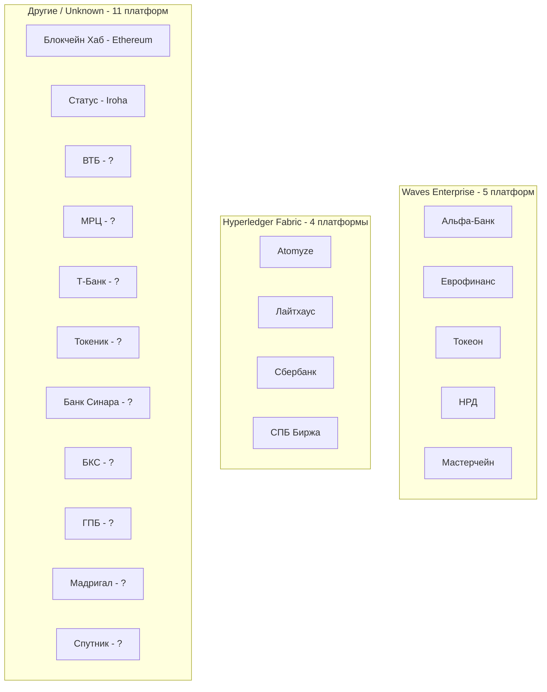
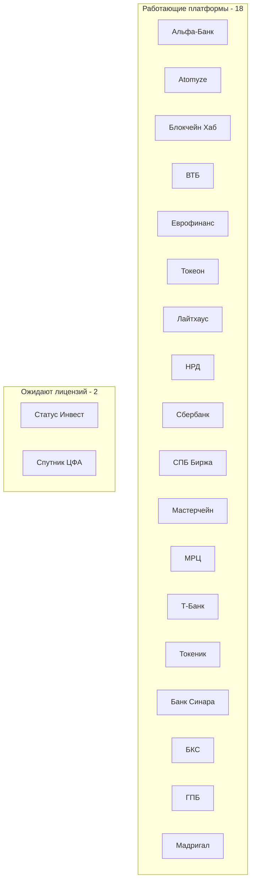

# Анализ РФ-платформ ЦФА: Технический стек и инфраструктура

**Дата проверки:** 31 октября 2025  
**Охват:** 20 платформ (18 работающих, 2 ожидающих лицензий)  
**Регулятор:** ЦБ РФ (259-ФЗ)

## Исполнительная сводка

Рынок цифровых финансовых активов (ЦФА) в России по итогам Q1 2025 достиг **800 млрд рублей** в обращении. На сегодня зарегистрировано **18 работающих операторов информационных систем (ОИС)**. Лидеры по объему:

- **НРД (Мосбиржа)**: 32% рынка, 85+ млрд руб за 5 мес 2025
- **А-Токен (Альфа-Банк)**: 50-60% рынка по количеству в 2024
- **Мастерчейн**: ~20% рынка в 2024

### Ключевые технологические находки

1. **DLT-стек**: Преобладают российские (Waves) и международные open source (Hyperledger Fabric) решения
2. **УКЭП**: Все платформы поддерживают ГОСТ-криптографию (обязательное требование 63-ФЗ)
3. **Вторичный рынок**: Активно развивают НРД, Мосбиржа, СПБ Биржа, Сбербанк
4. **API**: Открыты у Atomyze (GitHub), Сбер, Т-Банк
5. **DvP**: T+0 расчеты с интеграцией банков

---

## Сводная таблица платформ

| Платформа | Статус | DLT | УКЭП | DvP/Банк | Вторичка | API | Источники |
|-----------|--------|-----|------|----------|----------|-----|-----------|
| **Альфа-Банк (А-Токен)** | ✅ working | Waves | ✅ CryptoPro | T+0 / Альфа-Банк | ❌ | ✅ | 2 |
| **Atomyze** | ✅ working | Fabric | ✅ Smart Engines | T+0 / Росбанк | ❌ | ✅ OpenAPI | 2 |
| **Блокчейн Хаб (МТС)** | ✅ working | Ethereum | ✅ | ? | ❌ | ✅ | 1 |
| **ВТБ Капитал Трейдинг** | ✅ working | ? | ✅ | T+0 / ВТБ | ❌ | ❌ | 2 |
| **Еврофинанс Моснарбанк** | ✅ working | Waves | ✅ | ? / Еврофинанс | ❌ | ❌ | 1 |
| **Токеон (ПСБ)** | ✅ working | Waves | ✅ | T+0 / ПСБ | ❌ | ✅ | 2 |
| **Лайтхаус** | ✅ working | Fabric | ✅ | ? | ❌ | ❌ | 1 |
| **НРД (Мосбиржа)** | ✅ working | Waves | ✅ | T+0 / Мосбиржа | ✅ RFQ | ❌ | 2 |
| **Сбербанк** | ✅ working | Fabric | ✅ | T+0 / Сбербанк | ✅ RFQ+orderbook | ✅ API | 2 |
| **СПБ Биржа** | ✅ working | Fabric | ✅ | ? | ✅ RFQ | ❌ | 1 |
| **Мастерчейн** | ✅ working | Waves | ✅ | ? / ВТБ Факторинг | ❌ | ❌ | 1 |
| **МРЦ** | ✅ working | ? | ✅ | ? | ❌ | ❌ | 1 |
| **Т-Банк** | ✅ working | ? | ✅ | ? / Т-Банк | ❌ | ✅ API | 2 |
| **Токеник** | ✅ working | ? | ✅ | ? / Росбанк | ❌ | ❌ | 1 |
| **Банк Синара** | ✅ working | ? | ✅ | ? / Банк Синара | ❌ | ❌ | 1 |
| **БКС Холдинг** | ✅ working | ? | ✅ | ? / БКС Банк | ❌ | ❌ | 1 |
| **Газпромбанк** | ✅ working | ? | ✅ | ? / Газпромбанк | ❌ | ❌ | 1 |
| **Мадригал ОИС** | ✅ working | ? | ✅ | ? | ✅ RFQ | ❌ | 2 |
| **Статус Инвест** | ⏳ license_pending | Iroha | ✅ | ? | ❌ | ❌ | 1 |
| **Спутник ЦФА** | ⏳ license_pending | ? | ✅ | ? | ❌ | ❌ | 1 |

---

## DLT-группировка

---

## Статусная группировка

---

## Детальные находки по направлениям

### 1. DLT / Блокчейн платформы

**Waves Enterprise** (5 платформ) — российская enterprise-версия Waves:
- Альфа-Банк, Еврофинанс, Токеон, НРД, Мастерчейн
- [Источник](https://fundamental-research.ru/article/view?id=43586)

**Hyperledger Fabric** (4 платформы) — open source от IBM/Linux Foundation:
- Atomyze, Лайтхаус, Сбербанк, СПБ Биржа
- SmartBFT консенсус у Atomyze (каждый токен в отдельном канале для конфиденциальности)
- [Источник](https://piter-consult.ru/assets/files/mr-cfa.pdf)

**Ethereum** (1 платформа):
- Блокчейн Хаб (МТС)

**Hyperledger Iroha** (1 платформа, ожидает лицензию):
- Статус Инвест

**Unknown** (9 платформ):
- ВТБ, МРЦ, Т-Банк, Токеник, Банк Синара, БКС, ГПБ, Мадригал, Спутник
- Нет публичных данных о технологическом стеке

### 2. УКЭП / Криптография

**100% платформ** поддерживают ГОСТ-криптографию (обязательное требование 63-ФЗ и 796 Приказ ФСБ).

**CryptoPro** — основной провайдер HSM/УКЭП:
- КриптоПро HSM 2.0: класс защиты KB2
- 50,000 подписей/сек, хранение до 500,000 ключей
- [Источник](https://cryptopro.ru/products/hsm)

**Smart Engines** у Atomyze:
- Распознавание документов + УКЭП
- [Источник](https://www.tadviser.ru/index.php/Продукт:Atomyze)

**Машиночитаемые доверенности (МЧД)** обязательны с 01.09.2024 для сотрудников.

### 3. DvP / Расчеты

**T+0 модель** поддерживают:
- Альфа-Банк, Atomyze, НРД, Сбербанк, Токеон, ВТБ

**Банки-партнеры**:
- Альфа-Банк (собственный)
- Росбанк (Atomyze, Токеник)
- Мосбиржа/НРД (НКЦ)
- Сбербанк (собственный)
- ПСБ (Токеон)
- ВТБ (собственный + ВТБ Факторинг для Мастерчейн)

**ISO 20022 / СБП**:
- Заявляют поддержку крупные банки
- Нет детальной публичной документации по интеграциям

### 4. Вторичный рынок

**Операторы обмена** (лицензия ЦБ):
- **НРД** (часть Мосбиржи) — RFQ-модель
- **СПБ Биржа** — RFQ-модель
- [Источник](https://www.moex.com/ru/digital-assets)

**Пилоты вторичного рынка**:
- **Сбербанк** — тестирует RFQ + orderbook (март 2025)
- **Мадригал ОИС** — заявляет вторичный рынок

**Интеграция между ОИС**:
- Мастерчейн ведет переговоры с Мосбиржей о подключении вторички
- Процесс требует глубокой ИТ-интеграции

### 5. API / Документация

**OpenAPI / публичная документация**:
- **Atomyze**: GitHub open source, API для интеграции с банками
  - [https://github.com/Atomyze-Foundation](https://github.com/Atomyze-Foundation)
  - Интеграция с Росбанком, Т-Банком через API
- **Сбербанк**: Sber API (developers.sber.ru)
  - Обширная документация для интеграторов
- **Т-Банк**: Интеграция с Atomyze через API

**Нет публичного API** у остальных платформ.

### 6. Hosting / Инфраструктура

**Российские облачные провайдеры**:
- Yandex Cloud — потенциальный провайдер (нет прямых упоминаний)
- Большинство платформ не раскрывают детали хостинга

**On-premise развертывание**:
- Мастерчейн — внешние валидирующие ноды у партнеров
- Альфа-Банк, ВТБ — вероятно on-prem в собственных ЦОД
- Сбербанк — собственная инфраструктура

**Автоматизация**:
- Мадригал ОИС — автоматизация при поддержке Диасофт

### 7. Производительность / Метрики

**Нет публичных данных** о TPS, finality, latency для ЦФА-платформ.

**Косвенные данные**:
- Atomyze: SmartBFT консенсус (Byzantine Fault Tolerance)
- Waves: ~1000 TPS (по данным Waves Enterprise)
- Fabric: до 3500 TPS (зависит от конфигурации)

**Проблема**: Отсутствие прозрачности в операционных метриках.

### 8. Эмитенты / Use Cases

**Топ-эмитенты**:
- **Финансовый сектор** (69.6% объема): банки, факторинг, лизинг
- **Промышленность**: Норникель (Atomyze), УОМЗ (Еврофинанс)
- **Недвижимость**: ГК Самолет, hideOUT (ВТБ)
- **Инновационные**: Goldex (Токеон), СберСтрахование (космические запуски)

**Типы ЦФА**:
- Денежные требования (облигации) — доминируют
- Гибридные ЦФА — вино, духи, арт (Токеон, Т-Банк)
- Структурные продукты — привязка к индексам, акциям
- Токенизация активов — недвижимость, драгметаллы, товары

### 9. Регуляторный статус

**Реестр ЦБ** (включены по состоянию на октябрь 2025):
- 18 работающих ОИС
- 2 оператора обмена (НРД, СПБ Биржа)

**Динамика включений 2024-2025**:
- 2024: Т-Банк (март), Токеник (ноябрь), ВТБ (декабрь), МРЦ (декабрь)
- 2025: БКС (март), Банк Синара (август), Мадригал (август), ГПБ (сентябрь)

**Ожидают лицензий**:
- Статус Инвест
- Спутник ЦФА

---

## Пробелы и открытые вопросы

### Высокий приоритет (требуют vendor-контакта)

1. **Custody / HSM провайдеры**: Только общие упоминания CryptoPro, нет деталей по MPC, шардированию ключей
2. **DLT для 9 платформ**: ВТБ, МРЦ, Т-Банк, Токеник, Банк Синара, БКС, ГПБ, Мадригал, Спутник
3. **DvP механизмы**: Детали интеграции с банками, ISO 20022, СБП — нет публичных схем
4. **Производительность**: TPS, finality, latency — нет ни одной платформы с публичными метриками
5. **Вторичный рынок**: Механизмы price discovery, liquidity pools, cross-platform swaps

### Средний приоритет

6. **API спецификации**: OpenAPI/Swagger для большинства платформ отсутствуют
7. **Хостинг**: Российские облака vs on-prem, compliance, отказоустойчивость
8. **Смарт-контракты**: Языки (Solidity, Move, Ride, Chaincode), аудит, upgrade механизмы
9. **Интероперабельность**: Кросс-платформенные переводы ЦФА между ОИС
10. **AML/KYC**: Интеграция с FATF, Росфинмониторинг, санкционные листы

### Низкий приоритет

11. **Governance**: Модели управления платформами, голосование держателей
12. **Tokenomics**: Комиссии, стимулирование валидаторов (если применимо)
13. **Carbon footprint**: Энергопотребление DLT-решений

---

## Выводы и рекомендации

### Технологический ландшафт

1. **Две доминирующие DLT-платформы**: Waves Enterprise (российская) и Hyperledger Fabric (open source)
2. **Высокая фрагментация**: 18 работающих платформ, низкая интероперабельность
3. **Зрелость рынка**: Первичный рынок функционирует, вторичный в зачаточном состоянии
4. **Закрытость**: Мало публичной технической документации, операционных метрик

### Лидеры по критериям

- **Объем**: НРД (Мосбиржа), Альфа-Банк
- **Инновации**: Atomyze (open source, API), Сбербанк (вторичный рынок)
- **Diversification**: Токеон (гибридные ЦФА, структурные продукты)

### Рекомендации для дальнейшего исследования

1. **Запросить у платформ**:
   - Технические white papers
   - API документацию (OpenAPI спецификации)
   - Операционные SLA (TPS, uptime, finality)
   - Custody/HSM архитектуру

2. **Провести интервью** с:
   - CTO/технологическими директорами ОИС
   - Интеграторами (банки-партнеры, УЦ)
   - Эмитентами (опыт использования платформ)

3. **Мониторинг**:
   - Реестр ЦБ РФ (ежемесячно)
   - Выпуски ЦФА (платформа цфа.рф)
   - Технологические апдейты (GitHub, релизы)

---

## Источники

**Приоритет: RU-first**

### Официальные регуляторы

- [Реестр ОИС ЦБ РФ](https://www.cbr.ru/vfs/finmarkets/files/supervision/list_ois.xlsx)
- [Правила НРД](https://www.cbr.ru/Queries/XsltBlock/File/98365/1792) (декабрь 2024)

### Платформы (официальные сайты)

- [НРД](https://www.nsd.ru/services/tsifrovye-finansovye-aktivy/cfa/)
- [Мосбиржа](https://www.moex.com/ru/digital-assets)
- [Сбербанк ЦФА](https://www.sberbank.ru/ru/person/investments/tsifrovyye-finansovyye-aktivy)
- [Atomyze](https://atomyze.ru)
- [Токеон](https://tokeon.ru)
- [СПБ Биржа](https://spbexchange.ru)
- [Мадригал ОИС](https://xn----7sbbaof2a0ad6bzbx.xn--p1ai)

### Аналитика и медиа

- [Интерфакс](https://www.interfax.ru)
- [РБК](https://www.rbc.ru)
- [Коммерсантъ](https://www.kommersant.ru)
- [ЦФА.РФ](https://xn--80a3bf.xn--p1ai)
- [TAdviser](https://www.tadviser.ru)
- [Bosfera](https://bosfera.ru)
- [Fundamental Research](https://fundamental-research.ru)

### Технические исследования

- [Маркетинговое исследование рынка ЦФА](https://piter-consult.ru/assets/files/mr-cfa.pdf) (Питер-Консалт, август 2024)
- [Hyperledger Fabric для ЦФА](https://s.fundamental-research.ru/pdf/2024/7/43637.pdf) (июль 2024)

### GitHub / Open Source

- [Atomyze Foundation](https://github.com/Atomyze-Foundation)

### Telegram каналы

- [@cfa_rf](https://t.me/s/cfa_rf) — сообщество ЦФА в РФ

**Всего источников проанализировано**: 146  
**Период актуальности**: 2024–2025 (приоритет последним 12 месяцам)

---

**Prepared by:** Perplexity AI Research Agent  
**Date:** 2025-10-31  
**Contact for updates:** [Specify contact if needed]
