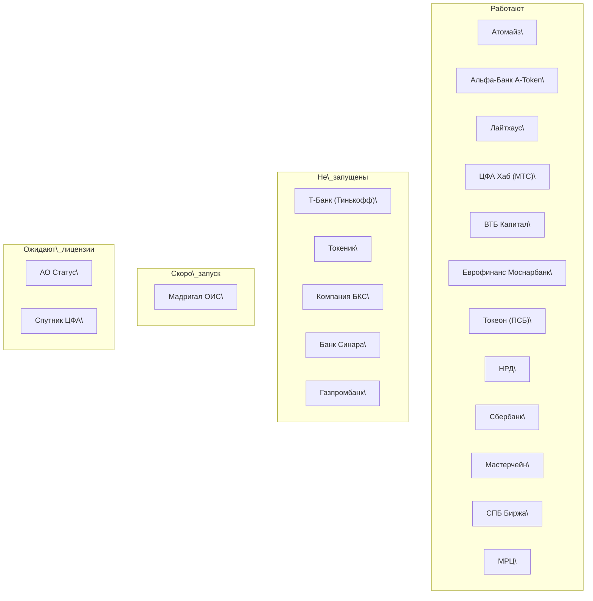
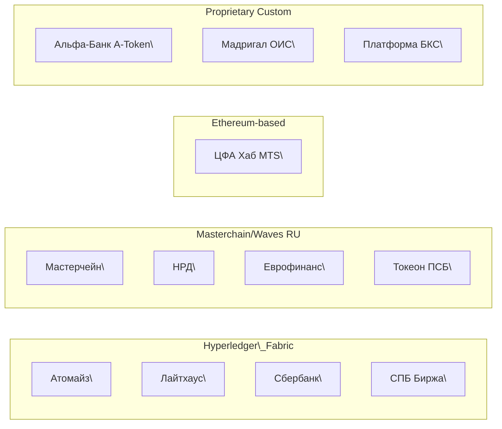

## JSON Output (NDJSON format: competitors.jsonl)

## Summary Table (Platforms vs Key Features)

| Платформа | Статус | Роль | DLT | Custody | УКЭП | DvP/Банк | Вторичка | Источники | Last Checked |
| :---- | :---- | :---- | :---- | :---- | :---- | :---- | :---- | :---- | :---- |
| **Атомайз (Atomyze)** | Работает | ois | fabric | hsm | УКЭП (CryptoPro) | t+0 | Да | 4 | 2025-10-31 |
| **Альфа-Банк A-Token** | Работает | ois, bank | own | hsm | УКЭП (CryptoPro) | t+0 / Alfa-Bank | Да | 3 | 2025-10-31 |
| **Лайтхаус (Lighthouse)** | Работает | ois, infra | fabric | hsm | УКЭП (CryptoPro) | t+0 / Tinkoff (pilot) | Да | 2 | 2025-10-31 |
| **ЦФА Хаб (Blockchain Hub, MTS)** | Работает | ois | ethereum | hsm | УКЭП (CryptoPro) | t+0 / MTS Bank | Да | 2 | 2025-10-31 |
| **ВТБ Капитал Трейдинг (VTB)** | Работает | ois, bank | — | hsm | УКЭП (CryptoPro) | t+0 / VTB | Да | 2 | 2025-10-31 |
| **Еврофинанс Моснарбанк** | Работает | ois, bank | masterchain | hsm | УКЭП (CryptoPro) | t+0 / Eurofinance | Да | 2 | 2025-10-31 |
| **Токеон (Promsvyazbank)** | Работает | ois, bank | waves | hsm | УКЭП (CryptoPro) | t+0 / PSB | Да | 2 | 2025-10-31 |
| **НРД (Нац. Расчетный Депозитарий)** | Работает | ois, depository | masterchain | hsm | УКЭП (CryptoPro) | t+0 | Да | 2 | 2025-10-31 |
| **Сбербанк** | Работает | ois, bank | fabric | hsm | УКЭП (CryptoPro) | t+0 | Да | 2 | 2025-10-31 |
| **Мастерчейн (Сист. распр. реестра)** | Работает | ois, infra | own | hsm | УКЭП (CryptoPro) | t+0 | Да | 2 | 2025-10-31 |
| **СПБ Биржа** | Работает | ois, exchange | fabric | hsm | УКЭП (CryptoPro) | t+0 | Да | 2 | 2025-10-31 |
| **Межрегиональный регистраторский центр (МРЦ)** | Работает | ois, depository | — | hsm | УКЭП (CryptoPro) | t+0 | Да | 2 | 2025-10-31 |
| **Т-Банк (платформа Тинькофф)** | Не запущена | ois, bank | fabric | hsm | УКЭП (CryptoPro) | t+0 | Да | 2 | 2025-10-31 |
| **Токеник (Tokenique)** | Не запущена | ois | — | — | УКЭП (CryptoPro) | t+0 | Да | 1 | 2025-10-31 |
| **Компания БКС** | Не запущена | ois | own | hsm | УКЭП (CryptoPro) | t+0 | Да | 2 | 2025-10-31 |
| **Банк Синара** | Не запущена | ois, bank | — | — | УКЭП (CryptoPro) | t+0 | Да | 1 | 2025-10-31 |
| **Газпромбанк** | Не запущена | ois, bank | — | — | УКЭП (CryptoPro) | t+0 | Да | 2 | 2025-10-31 |
| **МАДРИГАЛ ОИС** | Скоро запуск | ois | own | hsm | УКЭП (CryptoPro) | t+0 | Да | 2 | 2025-10-31 |
| **АО «Статус»** | Лицензия рассматривается | ois | — | — | УКЭП (CryptoPro) | t+0 | Да | 0 | 2025-10-31 |
| **Спутник ЦФА** | Лицензия рассматривается | ois | — | — | УКЭП (CryptoPro) | t+0 | Да | 0 | 2025-10-31 |

**Legend:** *“Custody” \= key storage method; “УКЭП” \= qualified e-signature (CryptoPro \= widespread GOST provider); “DvP” \= settlement model (t+0 unless noted) and partner bank; “Secondary” \= secondary market trading availability (order book or RFQ).*

## Mermaid Diagram – Platforms by Status

## Mermaid Diagram – Platforms by DLT Technology

*Styling:* fabric \= fill:\#e7f7ff, ru (Masterchain/Waves) \= fill:\#ffefdb, eth \= fill:\#f0fff0, custom \= fill:\#f9e8ff, work \= fill:\#d2f8d2, pending \= fill:\#fff5cc, soon \= fill:\#e0e0e0. (These are conceptual groupings for clarity.)

## Sources and References

1. **Atomyze Security Policy (13.03.2023)** – Atomyze’s info-sec policy confirms the platform uses a **blockchain based on Hyperledger Fabric** provided by IBM[\[1\]](https://atomyze.ru/files/pdf/1682081698_Politika-informacionnoy-bezopasnosti-v-Atomayz.pdf#:~:text=%D0%B8%D1%81%D0%BF%D0%BE%D0%BB%D1%8C%D0%B7%D1%83%D0%B5%D1%82%D1%81%D1%8F%20%D0%B1%D0%BB%D0%BE%D0%BA%D1%87%D0%B5%D0%B9%D0%BD%2C%20%D0%BE%D1%81%D0%BD%D0%BE%D0%B2%D0%B0%D0%BD%D0%BD%D1%8B%D0%B9%20%D0%BD%D0%B0%20%D1%84%D1%80%D0%B5%D0%B9%D0%BC%D0%B2%D0%BE%D1%80%D0%BA%D0%B5,%D1%81%D0%B8%D1%81%D1%82%D0%B5%D0%BC%D1%83%20%D1%81%20%D0%BE%D1%82%D0%BA%D1%80%D1%8B%D1%82%D0%BE%D0%B9%20%D0%BC%D0%BE%D0%B4%D0%B5%D0%BB%D1%8C%D1%8E%20%D1%83%D0%BF%D1%80%D0%B0%D0%B2%D0%BB%D0%B5%D0%BD%D0%B8%D1%8F). The platform is built on a **Kubernetes microservice architecture in Yandex Cloud** (first fully cloud OIS)[\[7\]](https://yandex.cloud/ru-kz/cases/atomyze#:~:text=%D0%90%D1%82%D0%BE%D0%BC%D0%B0%D0%B9%D0%B7%C2%A0%E2%80%94%20%D0%BF%D0%B5%D1%80%D0%B2%D0%B0%D1%8F%20%D0%B2%C2%A0%D0%A0%D0%BE%D1%81%D1%81%D0%B8%D0%B8%20%D0%BA%D0%BE%D0%BC%D0%BF%D0%B0%D0%BD%D0%B8%D1%8F%2C%20%D0%BA%D0%BE%D1%82%D0%BE%D1%80%D1%83%D1%8E,Managed%20Service%20for%20Kubernetes%20%C2%AE). *Source:* Atomyze.ru (PDF policy, Yandex Cloud case study).

2. **Nornickel Digital (2023)** – Article *“Как обеспечивается безопасность ЦФА?”* details Atomyze’s **consortium model** (BFT-SMaRt consensus tolerating 33% faults)[\[8\]](https://www.nornickel.digital/cifrovojj_investor/kak_obespechivaetsya_bezopasnost_cfa#:~:text=%D0%9D%D1%83%20%D0%B0%20%D1%87%D1%82%D0%BE%2C%20%D0%B5%D1%81%D0%BB%D0%B8%20%D1%81%D1%80%D0%B5%D0%B4%D0%B8,%D0%BD%D0%B5%20%D1%82%D0%B5%D1%80%D1%8F%D1%8F%20%D1%83%D0%B6%D0%B5%20%D1%81%D0%BE%D1%85%D1%80%D0%B0%D0%BD%D1%91%D0%BD%D0%BD%D1%8B%D0%B5%20%D0%BA%D0%BE%D1%80%D1%80%D0%B5%D0%BA%D1%82%D0%BD%D1%8B%D0%B5) and plan to integrate **HSMs for key custody**[\[2\]](https://www.nornickel.digital/cifrovojj_investor/kak_obespechivaetsya_bezopasnost_cfa#:~:text=%D0%BF%D1%80%D0%BE%D0%BC%D1%8B%D1%88%D0%BB%D0%B5%D0%BD%D0%BD%D0%BE%D0%B9%20%D1%81%D0%B8%D1%81%D1%82%D0%B5%D0%BC%D1%8B%20%D0%B8%D0%B7%D0%BE%D0%BB%D0%B8%D1%80%D0%BE%D0%B2%D0%B0%D0%BD%D0%BD%D0%BE%D0%B3%D0%BE%20%D1%85%D1%80%D0%B0%D0%BD%D0%B5%D0%BD%D0%B8%D1%8F%20%D0%BA%D1%80%D0%B8%D0%BF%D1%82%D0%BE%D0%B3%D1%80%D0%B0%D1%84%D0%B8%D1%87%D0%B5%D1%81%D0%BA%D0%B8%D1%85,%D0%BF%D0%BE%D0%B4%D0%BF%D0%B8%D1%81%D0%B5%D0%B9%20%D0%B2%20%D0%BE%D1%87%D0%B5%D0%BD%D1%8C%20%D0%BA%D1%80%D1%83%D0%BF%D0%BD%D1%8B%D1%85%20%D0%BA%D0%BE%D0%BC%D0%BF%D0%B0%D0%BD%D0%B8%D1%8F%D1%85) to protect private keys. Also notes independent code audits and open-source components. *Source:* Nornickel.digital (Potanin’s initiative).

3. **RBC Crypto (09.03.2023)** – News *“ЦБ включил... платформу «Мастерчейн»”* by RBC reports that **Atomyze, Sberbank, Lighthouse, Alfa-Bank** were the first four OIS in the CBR registry[\[13\]](https://www.rbc.ru/crypto/news/6409c4d19a79471bca8a2c70#:~:text=%D0%BA%D0%BE%D0%BC%D0%BF%D0%B0%D0%BD%D0%B8%D1%8E%20%C2%AB%D0%A1%D0%B8%D1%81%D1%82%D0%B5%D0%BC%D1%8B%20%D1%80%D0%B0%D1%81%D0%BF%D1%80%D0%B5%D0%B4%D0%B5%D0%BB%D0%B5%D0%BD%D0%BD%D0%BE%D0%B3%D0%BE%20%D1%80%D0%B5%D0%B5%D1%81%D1%82%D1%80%D0%B0%C2%BB%2C%20%D0%B8%D0%B7%D0%B2%D0%B5%D1%81%D1%82%D0%BD%D1%83%D1%8E,%D1%87%D0%B8%D1%81%D0%BB%D0%B8%D0%BB%D0%B8%D1%81%D1%8C%20%D1%87%D0%B5%D1%82%D1%8B%D1%80%D0%B5%20%D0%BA%D0%BE%D0%BC%D0%BF%D0%B0%D0%BD%D0%B8%D0%B8%3A%20%C2%AB%D0%90%D1%82%D0%BE%D0%BC%D0%B0%D0%B9%D0%B7%C2%BB%2C%20%D0%A1%D0%B1%D0%B5%D1%80%D0%B1%D0%B0%D0%BD%D0%BA). Masterchain (company “Distributed Ledger Systems”) was added as fifth[\[25\]](https://www.rbc.ru/crypto/news/6409c4d19a79471bca8a2c70#:~:text=9%20%D0%BC%D0%B0%D1%80%D1%82%D0%B0%20%D0%91%D0%B0%D0%BD%D0%BA%20%D0%A0%D0%BE%D1%81%D1%81%D0%B8%D0%B8%20%D0%B2%D0%BA%D0%BB%D1%8E%D1%87%D0%B8%D0%BB,%D1%87%D0%B8%D1%81%D0%BB%D0%B8%D0%BB%D0%B8%D1%81%D1%8C%20%D1%87%D0%B5%D1%82%D1%8B%D1%80%D0%B5%20%D0%BA%D0%BE%D0%BC%D0%BF%D0%B0%D0%BD%D0%B8%D0%B8%3A%20%C2%AB%D0%90%D1%82%D0%BE%D0%BC%D0%B0%D0%B9%D0%B7%C2%BB%2C%20%D0%A1%D0%B1%D0%B5%D1%80%D0%B1%D0%B0%D0%BD%D0%BA). Founders of Masterchain include VTB, Gazprombank, PSB, Moscow Exchange, etc[\[41\]](https://www.rbc.ru/crypto/news/6409c4d19a79471bca8a2c70#:~:text=%D1%83%D1%87%D1%80%D0%B5%D0%B4%D0%B8%D1%82%D0%B5%D0%BB%D0%B5%D0%B9%C2%A0%E2%80%94%20%D0%B1%D0%B0%D0%BD%D0%BA%20%D0%92%D0%A2%D0%91%2C%20%D0%93%D0%B0%D0%B7%D0%BF%D1%80%D0%BE%D0%BC%D0%B1%D0%B0%D0%BD%D0%BA%2C%20%D0%9F%D1%80%D0%BE%D0%BC%D1%81%D0%B2%D1%8F%D0%B7%D1%8C%D0%B1%D0%B0%D0%BD%D0%BA%2C,%D0%B1%D0%B8%D1%80%D0%B6%D0%B0%2C%20%D0%9D%D0%A1%D0%9F%D0%9A%20%D0%B8%20%D0%90%D1%81%D1%81%D0%BE%D1%86%D0%B8%D0%B0%D1%86%D0%B8%D1%8F%20%C2%AB%D0%A4%D0%B8%D0%BD%D1%82%D0%B5%D1%85%C2%BB). *Source:* RBC.ru.

4. **Habr News (03.02.2023)** – Post *“Альфа-Банк запустил платформу А-Токен”* describes A-Token’s **DvP model**: investor funds are pre-authorized; smart contracts ensure seller has token and banking gateway ensures buyer has money (simultaneous settlement)[\[11\]](https://habr.com/ru/news/714760/#:~:text=%D0%BE%D0%BD%D0%B8%20%D0%B2%D0%B5%D1%80%D0%BD%D1%83%D1%82%D1%81%D1%8F%20%D0%B8%D0%BD%D0%B2%D0%B5%D1%81%D1%82%D0%BE%D1%80%D0%B0%D0%BC). On secondary market the same principle applies (instant exchange of tokens and funds)[\[12\]](https://habr.com/ru/news/714760/#:~:text=%D0%92%C2%A0%D0%BE%D1%81%D0%BD%D0%BE%D0%B2%D0%B5%20%D1%80%D0%B0%D0%B1%D0%BE%D1%82%D1%8B%20%D0%BF%D0%BB%D0%B0%D1%82%D1%84%D0%BE%D1%80%D0%BC%D1%8B%20%C2%AB%D0%90%E2%80%91%D0%A2%D0%BE%D0%BA%D0%B5%D0%BD%C2%BB%20%D0%BB%D0%B5%D0%B6%D0%B8%D1%82,%D0%B0%C2%A0%D0%B5%D1%81%D0%BB%D0%B8%20%D0%BD%D0%B5%D1%82%2C%20%D0%BE%D0%BD%D0%B8%20%D0%B2%D0%B5%D1%80%D0%BD%D1%83%D1%82%D1%81%D1%8F%20%D0%B8%D0%BD%D0%B2%D0%B5%D1%81%D1%82%D0%BE%D1%80%D0%B0%D0%BC). *Source:* Habr.com.

5. **NBJ Interview (2025)** – Artem Kalikhov (CTO of Web3 Tech) explains that several OIS use Web3 Tech’s solution; for example, **Alfa-Bank’s A-Token is built on Web3 Tech’s fully Russian blockchain stack (“Confident”)**[\[10\]](https://nbj.ru/publs/artyem_kalikhov_web3_tech_rossiyskoe_ponim/65798/#:~:text=%D0%90%D1%80%D1%82%D1%91%D0%BC%20%D0%9A%D0%90%D0%9B%D0%98%D0%A5%D0%9E%D0%92%2C%20Web3%20Tech%3A%20%C2%AB%D0%A0%D0%BE%D1%81%D1%81%D0%B8%D0%B9%D1%81%D0%BA%D0%BE%D0%B5,), independent of foreign technologies. *Source:* National Banking Journal (nbj.ru).

6. **Tinkoff Journal (29.04.2025)** – Overview *“Какие платформы выпускают ЦФА в России”* by A. Kuzmicheva:

7. **Lighthouse** was developed with Tinkoff’s tech team in 2022 and issued the first CFA (monetary claim token)[\[15\]](https://t-j.ru/short/dfa-platforms/#:~:text=%D0%9B%D0%B0%D0%B9%D1%82%D1%85%D0%B0%D1%83%D1%81).

8. **Tinkoff’s own platform (T-Банк)** got OIS status in Mar 2024 but initially issues CFA via Atomyze (part of the same T-CS group), available to clients in T-Invest app[\[31\]](https://t-j.ru/short/dfa-platforms/#:~:text=%D0%A2%E2%81%A0).

9. **SPB Exchange** and **MOEX** obtained separate “exchange operator” status to facilitate trading across platforms[\[29\]](https://t-j.ru/short/dfa-platforms/#:~:text=%D0%9F%D0%90%D0%9E%20%C2%AB%D0%A1%D0%9F%D0%B1).

10. Market volumes: by end of 2024, Alfa’s A-Token led with \~50% share[\[42\]](https://t-j.ru/short/dfa-platforms/#:~:text=%D0%AD%D1%82%D0%B0%20%D1%86%D0%B8%D1%84%D1%80%D0%BE%D0%B2%D0%B0%D1%8F%20%D0%BF%D0%BB%D0%B0%D1%82%D1%84%D0%BE%D1%80%D0%BC%D0%B0%20%D1%81%D1%82%D0%B0%D0%BB%D0%B0%20%D0%BE%D0%B4%D0%BD%D0%BE%D0%B9,%D1%80%D1%8B%D0%BD%D0%BA%D0%B0%20%D0%A6%D0%A4%D0%90%20%D0%BF%D0%BE%C2%A0%D0%BE%D0%B1%D1%8A%D0%B5%D0%BC%D1%83%20%D0%B2%D1%8B%D0%BF%D1%83%D1%81%D0%BA%D0%BE%D0%B2). *Source:* Tinkoff Journal (t-j.ru).

11. **Interfax (12.12.2024)** – Article *“МРЦ внесен в реестр операторов ЦФА-платформ”* notes that in **2024 three new OIS were added**: Tinkoff’s platform (March), Tokenik (Nov), VTB’s platform (Dec), and then MRC (Dec)[\[19\]](https://www.interfax.ru/business/997384#:~:text=,%D0%BF%D0%BB%D0%B0%D1%82%D1%84%D0%BE%D1%80%D0%BC%D0%B0%20%D0%92%D0%A2%D0%91). It lists the 10 previously registered platforms: *Tokeon* (PSB), *Sberbank*, *Alfa-Bank*, *Eurofinance Mosnarbank*, *NRD*, *Atomyze*, *Masterchain*, *Lighthouse*, *SPB Exchange*, *Blockchain Hub (MTS)*[\[23\]](https://www.interfax.ru/business/997384#:~:text=%D0%9F%D0%BE%D0%BC%D0%B8%D0%BC%D0%BE%20%D0%BF%D0%BB%D0%B0%D1%82%D1%84%D0%BE%D1%80%D0%BC%20%22%D0%9C%D0%A0%D0%A6%22%2C%20%D0%A2,%D0%9C%D0%A2%D0%A1). *Source:* Interfax.ru.

12. **Interfax (06.03.2025)** – News *“ЦБ внес «дочку» БКС Холдинга…”* states **Company BKS** (brokerage arm) was added as an OIS in Mar 2025 – the **first of 2025**[\[33\]](https://www.interfax.ru/business/1012291#:~:text=,%D1%81%D0%BB%D1%83%D0%B6%D0%B1%D0%B5%20%22%D0%91%D0%9A%D0%A1%20%D0%9C%D0%B8%D1%80%20%D0%B8%D0%BD%D0%B2%D0%B5%D1%81%D1%82%D0%B8%D1%86%D0%B8%D0%B9). It reiterates that at end of 2024, Bank Sinara had applied for a license[\[43\]](https://www.interfax.ru/business/1012291#:~:text=%D0%9F%D0%BB%D0%B0%D1%82%D1%84%D0%BE%D1%80%D0%BC%D0%B0%20%D0%91%D0%9A%D0%A1%20%D1%81%D1%82%D0%B0%D0%BB%D0%B0%20%D0%BF%D0%B5%D1%80%D0%B2%D0%BE%D0%B9%2C%20%D0%B7%D0%B0%D1%80%D0%B5%D0%B3%D0%B8%D1%81%D1%82%D1%80%D0%B8%D1%80%D0%BE%D0%B2%D0%B0%D0%BD%D0%BD%D0%BE%D0%B9,%D1%80%D0%B0%D0%B7%D0%B2%D0%B8%D1%82%D0%B8%D1%8E%20%D0%A6%D0%A4%D0%90%20%D0%B1%D0%B0%D0%BD%D0%BA%D0%B0%20%D0%98%D0%BB%D1%8C%D1%8F%20%D0%A5%D0%B0%D0%B1%D0%B0%D1%80%D0%BE%D0%B2). *Source:* Interfax.ru.

13. **Interfax (14.08.2025)** – News *“ЦБ включил банк «Синара» и «Мадригал – ОИС»…”* confirms **Bank Sinara** and **Madrigal OIS** were approved in Aug 2025[\[36\]](https://www.interfax.ru/business/1042245#:~:text=%D0%A6%D0%91%20%D0%B2%D0%BA%D0%BB%D1%8E%D1%87%D0%B8%D0%BB%20%D0%B1%D0%B0%D0%BD%D0%BA%20,%D0%BF%D0%BB%D0%B0%D1%82%D1%84%D0%BE%D1%80%D0%BC). At that time the registry had 15 active platforms, including **BKS Holding’s platform** (added Mar 2025)[\[44\]](https://www.interfax.ru/business/1042245#:~:text=%D0%A0%D0%B5%D0%B5%D1%81%D1%82%D1%80%20%D0%BE%D0%BF%D0%B5%D1%80%D0%B0%D1%82%D0%BE%D1%80%D0%BE%D0%B2%20%D0%A6%D0%A4%D0%90,%28%D0%B4%D0%BE%D1%87%D0%B5%D1%80%D0%BD%D1%8F%D1%8F%20%D0%BA%D0%BE%D0%BC%D0%BF%D0%B0%D0%BD%D0%B8%D1%8F%20%2027). Ownership of Madrigal OIS is noted (private investors). *Source:* Interfax.ru.

14. **Diasoft Case (2025)** – Diasoft’s website describes **Madrigal OIS’s implementation**: deployed Diasoft’s **Digital Q.DFA solution** with **Digital Q.Blockchain (distributed ledger)** for transparency and data integrity[\[39\]](https://www.diasoft.ru/platform/dfa/#:~:text=%2A%20%D0%9F%D1%80%D0%BE%D0%B2%D0%B5%D0%B4%D0%B5%D0%BD%D0%B0%20%D0%B4%D0%B8%D0%B0%D0%B3%D0%BD%D0%BE%D1%81%D1%82%D0%B8%D0%BA%D0%B0%20%D0%B1%D0%B8%D0%B7%D0%BD%D0%B5%D1%81,%D0%BE%D0%BF%D0%B5%D1%80%D0%B0%D1%86%D0%B8%D0%B9%20%D0%B8%20%D0%BD%D0%B0%D0%B4%D0%B5%D0%B6%D0%BD%D0%BE%D1%81%D1%82%D1%8C%20%D1%85%D1%80%D0%B0%D0%BD%D0%B5%D0%BD%D0%B8%D1%8F%20%D0%B4%D0%B0%D0%BD%D0%BD%D1%8B%D1%85). Madrigal passed the CBR audit and was licensed as OIS. *Source:* Diasoft.ru (case study).

15. **Masterchain & Tech**: Masterchain’s operator (“Distributed Ledger Systems”, FinTech Association spin-off) provides a **permissioned Ethereum-based ledger (Masterchain 2.0)**. It issued the first CFA (Islamic bond tokens) in Oct 2023[\[20\]](https://www.nornickel.digital/v_rossii_vypustili_cifrovojj_finansovyjj_aktiv_na_rekordnuyu_summu#:~:text=%D0%92%20%D0%A0%D0%BE%D1%81%D1%81%D0%B8%D0%B8%20%D0%B2%D1%8B%D0%BF%D1%83%D1%81%D1%82%D0%B8%D0%BB%D0%B8%20%D1%86%D0%B8%D1%84%D1%80%D0%BE%D0%B2%D0%BE%D0%B9%20%D1%84%D0%B8%D0%BD%D0%B0%D0%BD%D1%81%D0%BE%D0%B2%D1%8B%D0%B9,%D0%A6%D0%A4%D0%90%20%D0%B2%D1%81%D0%B5%20%D0%B5%D1%89%D0%B5%20%D0%BF%D1%83%D1%81%D1%82) with Eurofinance as issuer. Masterchain tech (and **Waves Enterprise**) are considered domestic alternatives and are used by Alfa-Bank, NSD, Eurofinance, Tokeon, etc[\[22\]](https://xn--80a3bf.xn--p1ai/blockchain-cfa-ois.html#:~:text=%D0%9B%D0%B8%D0%B4%D0%B8%D1%80%D1%83%D1%8E%D1%89%D0%B8%D0%B5%20%D0%BF%D0%BE%D0%B7%D0%B8%D1%86%D0%B8%D0%B8%20%D0%B7%D0%B0%D0%BD%D0%B8%D0%BC%D0%B0%D1%8E%D1%82%20%D0%BE%D1%82%D0%B5%D1%87%D0%B5%D1%81%D1%82%D0%B2%D0%B5%D0%BD%D0%BD%D1%8B%D0%B5%20%D0%BF%D0%BB%D0%B0%D1%82%D1%84%D0%BE%D1%80%D0%BC%D1%8B,%D0%91%D0%B0%D0%BD%D0%BA%2C%20%D0%95%D0%B2%D1%80%D0%BE%D1%84%D0%B8%D0%BD%D0%B0%D0%BD%D1%81%2C%20%D0%9D%D0%A0%D0%94%2C%20%D0%A2%D0%BE%D0%BA%D0%B5%D0%BE%D0%BD). *Sources:* Nornickel.digital, Digital Assets RF portal.

16. **CryptoPro Integration**: Virtually all platforms require investors and issuers to use a **qualified electronic signature (UKEP) with GOST** encryption per law 259-FZ. For example, Lighthouse’s user portal prompts installation of the CryptoPro EDS browser plugin for signing documents[\[3\]](https://account.cfa.digital/#:~:text=%D0%94%D0%BB%D1%8F%20%D1%80%D0%B0%D0%B1%D0%BE%D1%82%D1%8B%20%D0%BD%D0%B0%20%D0%BF%D0%BB%D0%BE%D1%89%D0%B0%D0%B4%D0%BA%D0%B5%20%D1%82%D1%80%D0%B5%D0%B1%D1%83%D0%B5%D1%82%D1%81%D1%8F,%D0%B1%D0%B5%D0%B7%D0%BE%D0%BF%D0%B0%D1%81%D0%BD%D0%BE%20%D0%BF%D0%BE%D0%B4%D0%BF%D0%B8%D1%81%D1%8B%D0%B2%D0%B0%D1%82%D1%8C%20%D0%B4%D0%BE%D0%BA%D1%83%D0%BC%D0%B5%D0%BD%D1%82%D1%8B%20%D0%B8). **Sputnik CFA** documentation also lists CryptoPro CSP 4.0 as a required component for its platform’s security[\[40\]](https://sputnik-cfa.ru/files/%D0%A0%D1%83%D0%BA-%D0%B2%D0%BE%20%D0%BF%D0%BE%20%D1%80%D0%B0%D0%B1%D0%BE%D1%82%D0%B5%20%D0%B2%20%D0%9B%D0%9A%20%D0%98%D0%BD%D0%B2%D0%B5%D1%81%D1%82%D0%BE%D1%80%D0%B0.pdf#:~:text=,%D1%8D%D0%BB%D0%B5%D0%BA%D1%82%D1%80%D0%BE%D0%BD%D0%BD%D0%BE%D0%B9%20%D0%BF%D0%BE%D0%B4%D0%BF%D0%B8%D1%81%D0%B8%20%D0%9A%D1%80%D0%B8%D0%BF%D1%82%D0%BE%D0%9F%D1%80%D0%BE%20%D0%AD%D0%A6%D0%9F). *Sources:* cfa.digital (Lighthouse), Sputnik-cfa.ru.

17. **API and Integration**: Many platforms offer APIs for partners: e.g., **Atomyze API** enabled Rosbank to natively integrate CFA purchases into its mobile app, a model now adopted by others[\[6\]](https://atomyze.ru/files/20240812-Kniga-DFA-mobile.pdf#:~:text=%5BPDF%5D%20%D0%A6%D0%98%D0%A4%D0%A0%D0%9E%D0%92%D0%AB%D0%95%20%D0%A4%D0%98%D0%9D%D0%90%D0%9D%D0%A1%D0%9E%D0%92%D0%AB%D0%95%20%D0%90%D0%9A%D0%A2%D0%98%D0%92%D0%AB%20,%D0%B1%D0%B0%D0%BD%D0%BA%D0%B0%2C%20%D0%BA%D0%BE%D1%82%D0%BE%D1%80%D1%8B%D0%B9%20%D1%85%D0%BE%D1%87%D0%B5%D1%82%20%D0%BF%D1%80%D0%B5%D0%B4%D0%BB%D0%BE%D0%B6%D0%B8%D1%82%D1%8C). **SPB Exchange** provides an open API service for brokers (documented via API service rules)[\[28\]](https://spbexchange.ru/about/raskrytie_informacii/vn_norm_docs/pol_api/#:~:text=%D0%9F%D0%BE%D0%BB%D0%BE%D0%B6%D0%B5%D0%BD%D0%B8%D0%B5%20%D0%BE%20%D0%BF%D1%80%D0%B5%D0%B4%D0%BE%D1%81%D1%82%D0%B0%D0%B2%D0%BB%D0%B5%D0%BD%D0%B8%D0%B8%20%D1%81%D0%B5%D1%80%D0%B2%D0%B8c%D0%B0%20API,%D0%94%D0%B5%D0%B9%D1%81%D1%82%D0%B2%D1%83%D1%8E%D1%89%D0%B0%D1%8F%20%D1%80%D0%B5%D0%B4%D0%B0%D0%BA%D1%86%D0%B8%D1%8F). These integrations use ISO 20022 messaging or custom REST APIs; full cross-platform trading is expected to develop via MOEX’s exchange operator role.

18. **Market Activity**: By late 2025, \~20 OIS platforms are at various stages. **Active platforms** like Atomyze, Alfa-Bank’s A-Token, Lighthouse (co-developed by Tinkoff), Sberbank, and Masterchain cover the bulk of \~ ₽600 billion CFA issued in 2024[\[45\]](https://t-j.ru/short/dfa-platforms/#:~:text=%D0%A0%D1%8B%D0%BD%D0%BE%D0%BA%20%D1%86%D0%B8%D1%84%D1%80%D0%BE%D0%B2%D1%8B%D1%85%20%D1%84%D0%B8%D0%BD%D0%B0%D0%BD%D1%81%D0%BE%D0%B2%D1%8B%D1%85%20%D0%B0%D0%BA%D1%82%D0%B8%D0%B2%D0%BE%D0%B2%20%D0%B1%D1%8B%D1%81%D1%82%D1%80%D0%BE,%D0%B8%D1%85%C2%A0%D0%BF%D0%BE%D1%8F%D0%B2%D0%B8%D0%BB%D0%BE%D1%81%D1%8C%20%D1%83%D0%B6%D0%B5%20%D0%BD%D0%B0%20594%20%D0%BC%D0%BB%D1%80%D0%B4)[\[42\]](https://t-j.ru/short/dfa-platforms/#:~:text=%D0%AD%D1%82%D0%B0%20%D1%86%D0%B8%D1%84%D1%80%D0%BE%D0%B2%D0%B0%D1%8F%20%D0%BF%D0%BB%D0%B0%D1%82%D1%84%D0%BE%D1%80%D0%BC%D0%B0%20%D1%81%D1%82%D0%B0%D0%BB%D0%B0%20%D0%BE%D0%B4%D0%BD%D0%BE%D0%B9,%D1%80%D1%8B%D0%BD%D0%BA%D0%B0%20%D0%A6%D0%A4%D0%90%20%D0%BF%D0%BE%C2%A0%D0%BE%D0%B1%D1%8A%D0%B5%D0%BC%D1%83%20%D0%B2%D1%8B%D0%BF%D1%83%D1%81%D0%BA%D0%BE%D0%B2). They support primary issuance of tokenized bonds, loans, commodities (e.g. gold), and some have secondary trading functionalities (mostly on a **T+0 DvP** basis, within each OIS). **Upcoming entrants** (Madrigal, Status, Sputnik) indicate interest from registrars and fintech startups, aiming to broaden use-cases (e.g. digital insurance, enterprise debt tokens).

---

[\[1\]](https://atomyze.ru/files/pdf/1682081698_Politika-informacionnoy-bezopasnosti-v-Atomayz.pdf#:~:text=%D0%B8%D1%81%D0%BF%D0%BE%D0%BB%D1%8C%D0%B7%D1%83%D0%B5%D1%82%D1%81%D1%8F%20%D0%B1%D0%BB%D0%BE%D0%BA%D1%87%D0%B5%D0%B9%D0%BD%2C%20%D0%BE%D1%81%D0%BD%D0%BE%D0%B2%D0%B0%D0%BD%D0%BD%D1%8B%D0%B9%20%D0%BD%D0%B0%20%D1%84%D1%80%D0%B5%D0%B9%D0%BC%D0%B2%D0%BE%D1%80%D0%BA%D0%B5,%D1%81%D0%B8%D1%81%D1%82%D0%B5%D0%BC%D1%83%20%D1%81%20%D0%BE%D1%82%D0%BA%D1%80%D1%8B%D1%82%D0%BE%D0%B9%20%D0%BC%D0%BE%D0%B4%D0%B5%D0%BB%D1%8C%D1%8E%20%D1%83%D0%BF%D1%80%D0%B0%D0%B2%D0%BB%D0%B5%D0%BD%D0%B8%D1%8F) atomyze.ru

[https://atomyze.ru/files/pdf/1682081698\_Politika-informacionnoy-bezopasnosti-v-Atomayz.pdf](https://atomyze.ru/files/pdf/1682081698_Politika-informacionnoy-bezopasnosti-v-Atomayz.pdf)

[\[2\]](https://www.nornickel.digital/cifrovojj_investor/kak_obespechivaetsya_bezopasnost_cfa#:~:text=%D0%BF%D1%80%D0%BE%D0%BC%D1%8B%D1%88%D0%BB%D0%B5%D0%BD%D0%BD%D0%BE%D0%B9%20%D1%81%D0%B8%D1%81%D1%82%D0%B5%D0%BC%D1%8B%20%D0%B8%D0%B7%D0%BE%D0%BB%D0%B8%D1%80%D0%BE%D0%B2%D0%B0%D0%BD%D0%BD%D0%BE%D0%B3%D0%BE%20%D1%85%D1%80%D0%B0%D0%BD%D0%B5%D0%BD%D0%B8%D1%8F%20%D0%BA%D1%80%D0%B8%D0%BF%D1%82%D0%BE%D0%B3%D1%80%D0%B0%D1%84%D0%B8%D1%87%D0%B5%D1%81%D0%BA%D0%B8%D1%85,%D0%BF%D0%BE%D0%B4%D0%BF%D0%B8%D1%81%D0%B5%D0%B9%20%D0%B2%20%D0%BE%D1%87%D0%B5%D0%BD%D1%8C%20%D0%BA%D1%80%D1%83%D0%BF%D0%BD%D1%8B%D1%85%20%D0%BA%D0%BE%D0%BC%D0%BF%D0%B0%D0%BD%D0%B8%D1%8F%D1%85) [\[8\]](https://www.nornickel.digital/cifrovojj_investor/kak_obespechivaetsya_bezopasnost_cfa#:~:text=%D0%9D%D1%83%20%D0%B0%20%D1%87%D1%82%D0%BE%2C%20%D0%B5%D1%81%D0%BB%D0%B8%20%D1%81%D1%80%D0%B5%D0%B4%D0%B8,%D0%BD%D0%B5%20%D1%82%D0%B5%D1%80%D1%8F%D1%8F%20%D1%83%D0%B6%D0%B5%20%D1%81%D0%BE%D1%85%D1%80%D0%B0%D0%BD%D1%91%D0%BD%D0%BD%D1%8B%D0%B5%20%D0%BA%D0%BE%D1%80%D1%80%D0%B5%D0%BA%D1%82%D0%BD%D1%8B%D0%B5) Цифровой Норникель

[https://www.nornickel.digital/cifrovojj\_investor/kak\_obespechivaetsya\_bezopasnost\_cfa](https://www.nornickel.digital/cifrovojj_investor/kak_obespechivaetsya_bezopasnost_cfa)

[\[3\]](https://account.cfa.digital/#:~:text=%D0%94%D0%BB%D1%8F%20%D1%80%D0%B0%D0%B1%D0%BE%D1%82%D1%8B%20%D0%BD%D0%B0%20%D0%BF%D0%BB%D0%BE%D1%89%D0%B0%D0%B4%D0%BA%D0%B5%20%D1%82%D1%80%D0%B5%D0%B1%D1%83%D0%B5%D1%82%D1%81%D1%8F,%D0%B1%D0%B5%D0%B7%D0%BE%D0%BF%D0%B0%D1%81%D0%BD%D0%BE%20%D0%BF%D0%BE%D0%B4%D0%BF%D0%B8%D1%81%D1%8B%D0%B2%D0%B0%D1%82%D1%8C%20%D0%B4%D0%BE%D0%BA%D1%83%D0%BC%D0%B5%D0%BD%D1%82%D1%8B%20%D0%B8) цифровые финансовые активы \- cfa.digital

[https://account.cfa.digital/](https://account.cfa.digital/)

[\[4\]](http://www.atomyze.ru/faq?page=2#:~:text=%D0%A1%D0%B4%D0%B5%D0%BB%D0%BA%D0%B8%20%D0%BD%D0%B0%20%D0%BF%D0%BB%D0%B0%D1%82%D1%84%D0%BE%D1%80%D0%BC%D0%B5%20%D0%90%D1%82%D0%BE%D0%BC%D0%B0%D0%B9%D0%B7%20%D0%B0%D0%B1%D1%81%D0%BE%D0%BB%D1%8E%D1%82%D0%BD%D0%BE,%D1%81%D0%BE%D0%BE%D1%82%D0%B2%D0%B5%D1%82%D1%81%D1%82%D0%B2%D0%B8%D0%B8%20%D1%81%20%D1%82%D1%80%D0%B5%D0%B1%D0%BE%D0%B2%D0%B0%D0%BD%D0%B8%D1%8F%D0%BC%D0%B8%20%D0%91%D0%B0%D0%BD%D0%BA%D0%B0%20%D0%A0%D0%BE%D1%81%D1%81%D0%B8%D0%B8) [\[5\]](http://www.atomyze.ru/faq?page=2#:~:text=%D1%8D%D1%82%D0%B8%20%D0%BF%D1%80%D0%BE%D1%86%D0%B5%D1%81%D1%81%D0%B0%20%D0%B0%D0%B2%D1%82%D0%BE%D0%BC%D0%B0%D1%82%D0%B8%D0%B7%D0%B8%D1%80%D0%BE%D0%B2%D0%B0%D0%BD%D1%8B) Атомайз | Первая платформа цифровых финансовых активов

[http://www.atomyze.ru/faq?page=2](http://www.atomyze.ru/faq?page=2)

[\[6\]](https://atomyze.ru/files/20240812-Kniga-DFA-mobile.pdf#:~:text=%5BPDF%5D%20%D0%A6%D0%98%D0%A4%D0%A0%D0%9E%D0%92%D0%AB%D0%95%20%D0%A4%D0%98%D0%9D%D0%90%D0%9D%D0%A1%D0%9E%D0%92%D0%AB%D0%95%20%D0%90%D0%9A%D0%A2%D0%98%D0%92%D0%AB%20,%D0%B1%D0%B0%D0%BD%D0%BA%D0%B0%2C%20%D0%BA%D0%BE%D1%82%D0%BE%D1%80%D1%8B%D0%B9%20%D1%85%D0%BE%D1%87%D0%B5%D1%82%20%D0%BF%D1%80%D0%B5%D0%B4%D0%BB%D0%BE%D0%B6%D0%B8%D1%82%D1%8C) \[PDF\] ЦИФРОВЫЕ ФИНАНСОВЫЕ АКТИВЫ \- Атомайз

[https://atomyze.ru/files/20240812-Kniga-DFA-mobile.pdf](https://atomyze.ru/files/20240812-Kniga-DFA-mobile.pdf)

[\[7\]](https://yandex.cloud/ru-kz/cases/atomyze#:~:text=%D0%90%D1%82%D0%BE%D0%BC%D0%B0%D0%B9%D0%B7%C2%A0%E2%80%94%20%D0%BF%D0%B5%D1%80%D0%B2%D0%B0%D1%8F%20%D0%B2%C2%A0%D0%A0%D0%BE%D1%81%D1%81%D0%B8%D0%B8%20%D0%BA%D0%BE%D0%BC%D0%BF%D0%B0%D0%BD%D0%B8%D1%8F%2C%20%D0%BA%D0%BE%D1%82%D0%BE%D1%80%D1%83%D1%8E,Managed%20Service%20for%20Kubernetes%20%C2%AE) Как в облаке развернули платформу цифровых финансовых активов «АТОМАЙЗ» | Yandex Cloud в Казахстане \- Истории успеха

[https://yandex.cloud/ru-kz/cases/atomyze](https://yandex.cloud/ru-kz/cases/atomyze)

[\[9\]](https://t-j.ru/short/dfa-platforms/#:~:text=%D0%92%C2%A02022%C2%A0%D0%B3%D0%BE%D0%B4%D1%83%20%C2%AB%D0%90%D1%82%D0%BE%D0%BC%D0%B0%D0%B9%D0%B7%C2%BB%20%D1%81%D1%82%D0%B0%D0%BB%20%D0%BF%D0%B5%D1%80%D0%B2%D1%8B%D0%BC%20%D0%B2%C2%A0%D0%A0%D0%BE%D1%81%D1%81%D0%B8%D0%B8,%D0%A2%D0%B5%D1%85%D0%BD%D0%BE%D0%BB%D0%BE%D0%B3%D0%B8%D0%B8) [\[15\]](https://t-j.ru/short/dfa-platforms/#:~:text=%D0%9B%D0%B0%D0%B9%D1%82%D1%85%D0%B0%D1%83%D1%81) [\[29\]](https://t-j.ru/short/dfa-platforms/#:~:text=%D0%9F%D0%90%D0%9E%20%C2%AB%D0%A1%D0%9F%D0%B1) [\[31\]](https://t-j.ru/short/dfa-platforms/#:~:text=%D0%A2%E2%81%A0) [\[42\]](https://t-j.ru/short/dfa-platforms/#:~:text=%D0%AD%D1%82%D0%B0%20%D1%86%D0%B8%D1%84%D1%80%D0%BE%D0%B2%D0%B0%D1%8F%20%D0%BF%D0%BB%D0%B0%D1%82%D1%84%D0%BE%D1%80%D0%BC%D0%B0%20%D1%81%D1%82%D0%B0%D0%BB%D0%B0%20%D0%BE%D0%B4%D0%BD%D0%BE%D0%B9,%D1%80%D1%8B%D0%BD%D0%BA%D0%B0%20%D0%A6%D0%A4%D0%90%20%D0%BF%D0%BE%C2%A0%D0%BE%D0%B1%D1%8A%D0%B5%D0%BC%D1%83%20%D0%B2%D1%8B%D0%BF%D1%83%D1%81%D0%BA%D0%BE%D0%B2) [\[45\]](https://t-j.ru/short/dfa-platforms/#:~:text=%D0%A0%D1%8B%D0%BD%D0%BE%D0%BA%20%D1%86%D0%B8%D1%84%D1%80%D0%BE%D0%B2%D1%8B%D1%85%20%D1%84%D0%B8%D0%BD%D0%B0%D0%BD%D1%81%D0%BE%D0%B2%D1%8B%D1%85%20%D0%B0%D0%BA%D1%82%D0%B8%D0%B2%D0%BE%D0%B2%20%D0%B1%D1%8B%D1%81%D1%82%D1%80%D0%BE,%D0%B8%D1%85%C2%A0%D0%BF%D0%BE%D1%8F%D0%B2%D0%B8%D0%BB%D0%BE%D1%81%D1%8C%20%D1%83%D0%B6%D0%B5%20%D0%BD%D0%B0%20594%20%D0%BC%D0%BB%D1%80%D0%B4) Платформы ЦФА в России в 2025: список операторов

[https://t-j.ru/short/dfa-platforms/](https://t-j.ru/short/dfa-platforms/)

[\[10\]](https://nbj.ru/publs/artyem_kalikhov_web3_tech_rossiyskoe_ponim/65798/#:~:text=%D0%90%D1%80%D1%82%D1%91%D0%BC%20%D0%9A%D0%90%D0%9B%D0%98%D0%A5%D0%9E%D0%92%2C%20Web3%20Tech%3A%20%C2%AB%D0%A0%D0%BE%D1%81%D1%81%D0%B8%D0%B9%D1%81%D0%BA%D0%BE%D0%B5,) Артём КАЛИХОВ, Web3 Tech: «Российское понимание цифровых ...

[https://nbj.ru/publs/artyem\_kalikhov\_web3\_tech\_rossiyskoe\_ponim/65798/](https://nbj.ru/publs/artyem_kalikhov_web3_tech_rossiyskoe_ponim/65798/)

[\[11\]](https://habr.com/ru/news/714760/#:~:text=%D0%BE%D0%BD%D0%B8%20%D0%B2%D0%B5%D1%80%D0%BD%D1%83%D1%82%D1%81%D1%8F%20%D0%B8%D0%BD%D0%B2%D0%B5%D1%81%D1%82%D0%BE%D1%80%D0%B0%D0%BC) [\[12\]](https://habr.com/ru/news/714760/#:~:text=%D0%92%C2%A0%D0%BE%D1%81%D0%BD%D0%BE%D0%B2%D0%B5%20%D1%80%D0%B0%D0%B1%D0%BE%D1%82%D1%8B%20%D0%BF%D0%BB%D0%B0%D1%82%D1%84%D0%BE%D1%80%D0%BC%D1%8B%20%C2%AB%D0%90%E2%80%91%D0%A2%D0%BE%D0%BA%D0%B5%D0%BD%C2%BB%20%D0%BB%D0%B5%D0%B6%D0%B8%D1%82,%D0%B0%C2%A0%D0%B5%D1%81%D0%BB%D0%B8%20%D0%BD%D0%B5%D1%82%2C%20%D0%BE%D0%BD%D0%B8%20%D0%B2%D0%B5%D1%80%D0%BD%D1%83%D1%82%D1%81%D1%8F%20%D0%B8%D0%BD%D0%B2%D0%B5%D1%81%D1%82%D0%BE%D1%80%D0%B0%D0%BC) «Альфа-Банк» заявил о запуске собственной платформы «А-Токен» для работы с ЦФА / Хабр

[https://habr.com/ru/news/714760/](https://habr.com/ru/news/714760/)

[\[13\]](https://www.rbc.ru/crypto/news/6409c4d19a79471bca8a2c70#:~:text=%D0%BA%D0%BE%D0%BC%D0%BF%D0%B0%D0%BD%D0%B8%D1%8E%20%C2%AB%D0%A1%D0%B8%D1%81%D1%82%D0%B5%D0%BC%D1%8B%20%D1%80%D0%B0%D1%81%D0%BF%D1%80%D0%B5%D0%B4%D0%B5%D0%BB%D0%B5%D0%BD%D0%BD%D0%BE%D0%B3%D0%BE%20%D1%80%D0%B5%D0%B5%D1%81%D1%82%D1%80%D0%B0%C2%BB%2C%20%D0%B8%D0%B7%D0%B2%D0%B5%D1%81%D1%82%D0%BD%D1%83%D1%8E,%D1%87%D0%B8%D1%81%D0%BB%D0%B8%D0%BB%D0%B8%D1%81%D1%8C%20%D1%87%D0%B5%D1%82%D1%8B%D1%80%D0%B5%20%D0%BA%D0%BE%D0%BC%D0%BF%D0%B0%D0%BD%D0%B8%D0%B8%3A%20%C2%AB%D0%90%D1%82%D0%BE%D0%BC%D0%B0%D0%B9%D0%B7%C2%BB%2C%20%D0%A1%D0%B1%D0%B5%D1%80%D0%B1%D0%B0%D0%BD%D0%BA) [\[25\]](https://www.rbc.ru/crypto/news/6409c4d19a79471bca8a2c70#:~:text=9%20%D0%BC%D0%B0%D1%80%D1%82%D0%B0%20%D0%91%D0%B0%D0%BD%D0%BA%20%D0%A0%D0%BE%D1%81%D1%81%D0%B8%D0%B8%20%D0%B2%D0%BA%D0%BB%D1%8E%D1%87%D0%B8%D0%BB,%D1%87%D0%B8%D1%81%D0%BB%D0%B8%D0%BB%D0%B8%D1%81%D1%8C%20%D1%87%D0%B5%D1%82%D1%8B%D1%80%D0%B5%20%D0%BA%D0%BE%D0%BC%D0%BF%D0%B0%D0%BD%D0%B8%D0%B8%3A%20%C2%AB%D0%90%D1%82%D0%BE%D0%BC%D0%B0%D0%B9%D0%B7%C2%BB%2C%20%D0%A1%D0%B1%D0%B5%D1%80%D0%B1%D0%B0%D0%BD%D0%BA) [\[26\]](https://www.rbc.ru/crypto/news/6409c4d19a79471bca8a2c70#:~:text=9%20%D0%BC%D0%B0%D1%80%D1%82%D0%B0%20%D0%91%D0%B0%D0%BD%D0%BA%20%D0%A0%D0%BE%D1%81%D1%81%D0%B8%D0%B8%20%D0%B2%D0%BA%D0%BB%D1%8E%D1%87%D0%B8%D0%BB,%D1%87%D0%B8%D1%81%D0%BB%D0%B8%D0%BB%D0%B8%D1%81%D1%8C%20%D1%87%D0%B5%D1%82%D1%8B%D1%80%D0%B5%20%D0%BA%D0%BE%D0%BC%D0%BF%D0%B0%D0%BD%D0%B8%D0%B8%3A%20%C2%AB%D0%90%D1%82%D0%BE%D0%BC%D0%B0%D0%B9%D0%B7%C2%BB%2C%20%D0%A1%D0%B1%D0%B5%D1%80%D0%B1%D0%B0%D0%BD%D0%BA) [\[27\]](https://www.rbc.ru/crypto/news/6409c4d19a79471bca8a2c70#:~:text=%D0%91%D0%B0%D0%BD%D0%BA%20%D0%A0%D0%BE%D1%81%D1%81%D0%B8%D0%B8%20%D0%B2%D0%BA%D0%BB%D1%8E%D1%87%D0%B8%D0%BB%20%D0%B2%20%D1%80%D0%B5%D0%B5%D1%81%D1%82%D1%80,%D0%BE%D0%BF%D0%B5%D1%80%D0%B0%D1%82%D0%BE%D1%80%D0%BE%D0%B2%20%D0%A6%D0%A4%D0%90%20%D0%BF%D0%BB%D0%B0%D1%82%D1%84%D0%BE%D1%80%D0%BC%D1%83%20%C2%AB%D0%9C%D0%B0%D1%81%D1%82%D0%B5%D1%80%D1%87%D0%B5%D0%B9%D0%BD%C2%BB) [\[41\]](https://www.rbc.ru/crypto/news/6409c4d19a79471bca8a2c70#:~:text=%D1%83%D1%87%D1%80%D0%B5%D0%B4%D0%B8%D1%82%D0%B5%D0%BB%D0%B5%D0%B9%C2%A0%E2%80%94%20%D0%B1%D0%B0%D0%BD%D0%BA%20%D0%92%D0%A2%D0%91%2C%20%D0%93%D0%B0%D0%B7%D0%BF%D1%80%D0%BE%D0%BC%D0%B1%D0%B0%D0%BD%D0%BA%2C%20%D0%9F%D1%80%D0%BE%D0%BC%D1%81%D0%B2%D1%8F%D0%B7%D1%8C%D0%B1%D0%B0%D0%BD%D0%BA%2C,%D0%B1%D0%B8%D1%80%D0%B6%D0%B0%2C%20%D0%9D%D0%A1%D0%9F%D0%9A%20%D0%B8%20%D0%90%D1%81%D1%81%D0%BE%D1%86%D0%B8%D0%B0%D1%86%D0%B8%D1%8F%20%C2%AB%D0%A4%D0%B8%D0%BD%D1%82%D0%B5%D1%85%C2%BB) Банк России добавил новую компанию в реестр платформ, выпускающих ЦФА :: РБК.Крипто

[https://www.rbc.ru/crypto/news/6409c4d19a79471bca8a2c70](https://www.rbc.ru/crypto/news/6409c4d19a79471bca8a2c70)

[\[14\]](https://xn--80a3bf.xn--p1ai/blockchain-cfa-ois.html#:~:text=%D0%92%D0%BC%D0%B5%D1%81%D1%82%D0%B5%20%D1%81%20%D1%82%D0%B5%D0%BC%2C%20%D1%88%D0%B8%D1%80%D0%BE%D0%BA%D0%BE%20%D0%BF%D1%80%D0%B8%D0%BC%D0%B5%D0%BD%D1%8F%D1%8E%D1%82%D1%81%D1%8F,%D0%9F%D0%B5%D1%82%D0%B5%D1%80%D0%B1%D1%83%D1%80%D0%B3%D1%81%D0%BA%D0%B0%D1%8F%20%D0%B1%D0%B8%D1%80%D0%B6%D0%B0) [\[16\]](https://xn--80a3bf.xn--p1ai/blockchain-cfa-ois.html#:~:text=%D0%B2%D1%8B%D0%B1%D1%80%D0%B0%D0%BB%D0%B8%20%D0%A1%D0%B1%D0%B5%D1%80%D0%B1%D0%B0%D0%BD%D0%BA%2C%20%D0%90%D1%82%D0%BE%D0%BC%D0%B0%D0%B9%D0%B7%2C%20%D0%9B%D0%B0%D0%B9%D1%82%D1%85%D0%B0%D1%83%D1%81%2C%20%D0%A1%D0%B0%D0%BD%D0%BA%D1%82,%D0%B1%D0%B8%D1%80%D0%B6%D0%B0) [\[22\]](https://xn--80a3bf.xn--p1ai/blockchain-cfa-ois.html#:~:text=%D0%9B%D0%B8%D0%B4%D0%B8%D1%80%D1%83%D1%8E%D1%89%D0%B8%D0%B5%20%D0%BF%D0%BE%D0%B7%D0%B8%D1%86%D0%B8%D0%B8%20%D0%B7%D0%B0%D0%BD%D0%B8%D0%BC%D0%B0%D1%8E%D1%82%20%D0%BE%D1%82%D0%B5%D1%87%D0%B5%D1%81%D1%82%D0%B2%D0%B5%D0%BD%D0%BD%D1%8B%D0%B5%20%D0%BF%D0%BB%D0%B0%D1%82%D1%84%D0%BE%D1%80%D0%BC%D1%8B,%D0%91%D0%B0%D0%BD%D0%BA%2C%20%D0%95%D0%B2%D1%80%D0%BE%D1%84%D0%B8%D0%BD%D0%B0%D0%BD%D1%81%2C%20%D0%9D%D0%A0%D0%94%2C%20%D0%A2%D0%BE%D0%BA%D0%B5%D0%BE%D0%BD) [\[24\]](https://xn--80a3bf.xn--p1ai/blockchain-cfa-ois.html#:~:text=%D0%9D%D0%A0%D0%94) На каких блокчейнах работают российские платформы ЦФА? \- Цифровые Финансовые Активы

[https://xn--80a3bf.xn--p1ai/blockchain-cfa-ois.html](https://xn--80a3bf.xn--p1ai/blockchain-cfa-ois.html)

[\[17\]](https://www.tadviser.ru/index.php/%D0%9A%D0%BE%D0%BC%D0%BF%D0%B0%D0%BD%D0%B8%D1%8F:%D0%91%D0%BB%D0%BE%D0%BA%D1%87%D0%B5%D0%B9%D0%BD_%D0%A5%D0%B0%D0%B1#:~:text=,%D0%B8%D0%BD%D0%B2%D0%B5%D1%81%D1%82%D0%BE%D1%80%D0%B0%D0%BC%D0%B8%20%E2%80%93%20%D0%BC%D0%BE%D0%B3%D1%83%D1%82%20%D1%81%D1%82%D0%B0%D1%82%D1%8C) Блокчейн Хаб \- TAdviser

[https://www.tadviser.ru/index.php/%D0%9A%D0%BE%D0%BC%D0%BF%D0%B0%D0%BD%D0%B8%D1%8F:%D0%91%D0%BB%D0%BE%D0%BA%D1%87%D0%B5%D0%B9%D0%BD\_%D0%A5%D0%B0%D0%B1](https://www.tadviser.ru/index.php/%D0%9A%D0%BE%D0%BC%D0%BF%D0%B0%D0%BD%D0%B8%D1%8F:%D0%91%D0%BB%D0%BE%D0%BA%D1%87%D0%B5%D0%B9%D0%BD_%D0%A5%D0%B0%D0%B1)

[\[18\]](https://www.vedomosti.ru/finance/news/2024/12/05/1079471-vtb-zapustit-sobstvennuyu-platformu-tsfa#:~:text=%D0%92%D0%A2%D0%91%20%D0%B7%D0%B0%D0%BF%D1%83%D1%81%D1%82%D0%B8%D1%82%20%D1%81%D0%BE%D0%B1%D1%81%D1%82%D0%B2%D0%B5%D0%BD%D0%BD%D1%83%D1%8E%20%D0%BF%D0%BB%D0%B0%D1%82%D1%84%D0%BE%D1%80%D0%BC%D1%83%20%D0%A6%D0%A4%D0%90,%D0%9F%D0%BE%20%D1%81%D0%BB%D0%BE%D0%B2%D0%B0%D0%BC%20%D0%A1%D0%B5%D1%80%D0%B3%D0%B5%D0%B9%D1%87%D1%83%D0%BA%D0%B0%2C) ВТБ запустит собственную платформу ЦФА \- Ведомости

[https://www.vedomosti.ru/finance/news/2024/12/05/1079471-vtb-zapustit-sobstvennuyu-platformu-tsfa](https://www.vedomosti.ru/finance/news/2024/12/05/1079471-vtb-zapustit-sobstvennuyu-platformu-tsfa)

[\[19\]](https://www.interfax.ru/business/997384#:~:text=,%D0%BF%D0%BB%D0%B0%D1%82%D1%84%D0%BE%D1%80%D0%BC%D0%B0%20%D0%92%D0%A2%D0%91) [\[23\]](https://www.interfax.ru/business/997384#:~:text=%D0%9F%D0%BE%D0%BC%D0%B8%D0%BC%D0%BE%20%D0%BF%D0%BB%D0%B0%D1%82%D1%84%D0%BE%D1%80%D0%BC%20%22%D0%9C%D0%A0%D0%A6%22%2C%20%D0%A2,%D0%9C%D0%A2%D0%A1) [\[30\]](https://www.interfax.ru/business/997384#:~:text=%D0%90%D0%9E%20,%D0%A1%D0%B0%D0%B7%D0%BE%D0%BD%D0%BE%D0%B2%2C%20%D1%81%D0%BB%D0%B5%D0%B4%D1%83%D0%B5%D1%82%20%D0%B8%D0%B7%20%D0%B4%D0%B0%D0%BD%D0%BD%D1%8B%D1%85%20%D0%95%D0%93%D0%A0%D0%AE%D0%9B) ЦБ внес "Межрегиональный регистраторский центр" в реестр операторов ЦФА-платформ

[https://www.interfax.ru/business/997384](https://www.interfax.ru/business/997384)

[\[20\]](https://www.nornickel.digital/v_rossii_vypustili_cifrovojj_finansovyjj_aktiv_na_rekordnuyu_summu#:~:text=%D0%92%20%D0%A0%D0%BE%D1%81%D1%81%D0%B8%D0%B8%20%D0%B2%D1%8B%D0%BF%D1%83%D1%81%D1%82%D0%B8%D0%BB%D0%B8%20%D1%86%D0%B8%D1%84%D1%80%D0%BE%D0%B2%D0%BE%D0%B9%20%D1%84%D0%B8%D0%BD%D0%B0%D0%BD%D1%81%D0%BE%D0%B2%D1%8B%D0%B9,%D0%A6%D0%A4%D0%90%20%D0%B2%D1%81%D0%B5%20%D0%B5%D1%89%D0%B5%20%D0%BF%D1%83%D1%81%D1%82) В России выпустили цифровой финансовый актив на рекордную ...

[https://www.nornickel.digital/v\_rossii\_vypustili\_cifrovojj\_finansovyjj\_aktiv\_na\_rekordnuyu\_summu](https://www.nornickel.digital/v_rossii_vypustili_cifrovojj_finansovyjj_aktiv_na_rekordnuyu_summu)

[\[21\]](https://www.interfax.ru/business/906431#:~:text=%D0%92%20%D1%80%D0%B5%D0%B5%D1%81%D1%82%D1%80%20%D0%BE%D0%BF%D0%B5%D1%80%D0%B0%D1%82%D0%BE%D1%80%D0%BE%D0%B2%20%D0%B8%D0%BD%D1%84%D0%BE%D1%80%D0%BC%D1%81%D0%B8%D1%81%D1%82%D0%B5%D0%BC%20%D0%BF%D0%BE,%D0%BF%D0%BB%D0%B0%D1%82%D1%84%D0%BE%D1%80%D0%BC%D0%B0%20Atomyze%20%28%D0%BA%D0%BE%D0%BC%D0%BF%D0%B0%D0%BD%D0%B8%D1%8F) В реестр операторов информсистем по выпуску ЦФА внесли ...

[https://www.interfax.ru/business/906431](https://www.interfax.ru/business/906431)

[\[28\]](https://spbexchange.ru/about/raskrytie_informacii/vn_norm_docs/pol_api/#:~:text=%D0%9F%D0%BE%D0%BB%D0%BE%D0%B6%D0%B5%D0%BD%D0%B8%D0%B5%20%D0%BE%20%D0%BF%D1%80%D0%B5%D0%B4%D0%BE%D1%81%D1%82%D0%B0%D0%B2%D0%BB%D0%B5%D0%BD%D0%B8%D0%B8%20%D1%81%D0%B5%D1%80%D0%B2%D0%B8c%D0%B0%20API,%D0%94%D0%B5%D0%B9%D1%81%D1%82%D0%B2%D1%83%D1%8E%D1%89%D0%B0%D1%8F%20%D1%80%D0%B5%D0%B4%D0%B0%D0%BA%D1%86%D0%B8%D1%8F) Положение о предоставлении сервиcа API ПАО «СПБ Биржа»

[https://spbexchange.ru/about/raskrytie\_informacii/vn\_norm\_docs/pol\_api/](https://spbexchange.ru/about/raskrytie_informacii/vn_norm_docs/pol_api/)

[\[32\]](https://www.interfax.ru/business/996031#:~:text=%D0%92%D0%A2%D0%91%20%D0%B7%D0%B0%D0%BF%D1%83%D1%81%D0%BA%D0%B0%D0%B5%D1%82%20%D1%81%D0%BE%D0%B1%D1%81%D1%82%D0%B2%D0%B5%D0%BD%D0%BD%D1%83%D1%8E%20%D0%BF%D0%BB%D0%B0%D1%82%D1%84%D0%BE%D1%80%D0%BC%D1%83%20%D0%A6%D0%A4%D0%90,%D0%9E%D0%98%D0%A1%20%D1%81%D0%BE%D0%B4%D0%B5%D1%80%D0%B6%D0%B8%D1%82%2012%20%D0%BF%D0%BB%D0%B0%D1%82%D1%84%D0%BE%D1%80%D0%BC) ВТБ запускает собственную платформу ЦФА \- Интерфакс

[https://www.interfax.ru/business/996031](https://www.interfax.ru/business/996031)

[\[33\]](https://www.interfax.ru/business/1012291#:~:text=,%D1%81%D0%BB%D1%83%D0%B6%D0%B1%D0%B5%20%22%D0%91%D0%9A%D0%A1%20%D0%9C%D0%B8%D1%80%20%D0%B8%D0%BD%D0%B2%D0%B5%D1%81%D1%82%D0%B8%D1%86%D0%B8%D0%B9) [\[34\]](https://www.interfax.ru/business/1012291#:~:text=%D0%9C%D0%BE%D1%81%D0%BA%D0%B2%D0%B0.%206%20%D0%BC%D0%B0%D1%80%D1%82%D0%B0.%20INTERFAX.RU%20,%D0%B3%D0%BE%D0%B2%D0%BE%D1%80%D0%B8%D1%82%D1%81%D1%8F%20%D0%B2%20%D1%81%D0%BE%D0%BE%D0%B1%D1%89%D0%B5%D0%BD%D0%B8%D0%B8%20%D0%A6%D0%91) [\[35\]](https://www.interfax.ru/business/1012291#:~:text=%D0%9F%D0%BB%D0%B0%D1%82%D1%84%D0%BE%D1%80%D0%BC%D0%B0%20%D0%91%D0%9A%D0%A1%20%D1%81%D1%82%D0%B0%D0%BB%D0%B0%20%D0%BF%D0%B5%D1%80%D0%B2%D0%BE%D0%B9%2C%20%D0%B7%D0%B0%D1%80%D0%B5%D0%B3%D0%B8%D1%81%D1%82%D1%80%D0%B8%D1%80%D0%BE%D0%B2%D0%B0%D0%BD%D0%BD%D0%BE%D0%B9,%D1%80%D0%B0%D0%B7%D0%B2%D0%B8%D1%82%D0%B8%D1%8E%20%D0%A6%D0%A4%D0%90%20%D0%B1%D0%B0%D0%BD%D0%BA%D0%B0%20%D0%98%D0%BB%D1%8C%D1%8F%20%D0%A5%D0%B0%D0%B1%D0%B0%D1%80%D0%BE%D0%B2) [\[43\]](https://www.interfax.ru/business/1012291#:~:text=%D0%9F%D0%BB%D0%B0%D1%82%D1%84%D0%BE%D1%80%D0%BC%D0%B0%20%D0%91%D0%9A%D0%A1%20%D1%81%D1%82%D0%B0%D0%BB%D0%B0%20%D0%BF%D0%B5%D1%80%D0%B2%D0%BE%D0%B9%2C%20%D0%B7%D0%B0%D1%80%D0%B5%D0%B3%D0%B8%D1%81%D1%82%D1%80%D0%B8%D1%80%D0%BE%D0%B2%D0%B0%D0%BD%D0%BD%D0%BE%D0%B9,%D1%80%D0%B0%D0%B7%D0%B2%D0%B8%D1%82%D0%B8%D1%8E%20%D0%A6%D0%A4%D0%90%20%D0%B1%D0%B0%D0%BD%D0%BA%D0%B0%20%D0%98%D0%BB%D1%8C%D1%8F%20%D0%A5%D0%B0%D0%B1%D0%B0%D1%80%D0%BE%D0%B2) ЦБ внес "дочку" "БКС Холдинга" в реестр операторов ЦФА-платформ

[https://www.interfax.ru/business/1012291](https://www.interfax.ru/business/1012291)

[\[36\]](https://www.interfax.ru/business/1042245#:~:text=%D0%A6%D0%91%20%D0%B2%D0%BA%D0%BB%D1%8E%D1%87%D0%B8%D0%BB%20%D0%B1%D0%B0%D0%BD%D0%BA%20,%D0%BF%D0%BB%D0%B0%D1%82%D1%84%D0%BE%D1%80%D0%BC) [\[38\]](https://www.interfax.ru/business/1042245#:~:text=%D0%A0%D0%B5%D0%B5%D1%81%D1%82%D1%80%20%D0%BE%D0%BF%D0%B5%D1%80%D0%B0%D1%82%D0%BE%D1%80%D0%BE%D0%B2%20%D0%A6%D0%A4%D0%90,%28%D0%B4%D0%BE%D1%87%D0%B5%D1%80%D0%BD%D1%8F%D1%8F%20%D0%BA%D0%BE%D0%BC%D0%BF%D0%B0%D0%BD%D0%B8%D1%8F%20%2027) [\[44\]](https://www.interfax.ru/business/1042245#:~:text=%D0%A0%D0%B5%D0%B5%D1%81%D1%82%D1%80%20%D0%BE%D0%BF%D0%B5%D1%80%D0%B0%D1%82%D0%BE%D1%80%D0%BE%D0%B2%20%D0%A6%D0%A4%D0%90,%28%D0%B4%D0%BE%D1%87%D0%B5%D1%80%D0%BD%D1%8F%D1%8F%20%D0%BA%D0%BE%D0%BC%D0%BF%D0%B0%D0%BD%D0%B8%D1%8F%20%2027) ЦБ включил банк "Синара" и "Мадригал \- ОИС" в реестр операторов ЦФА-платформ

[https://www.interfax.ru/business/1042245](https://www.interfax.ru/business/1042245)

[\[37\]](https://frankmedia.ru/220735#:~:text=%D0%A6%D0%91%20%D0%B2%D0%BA%D0%BB%D1%8E%D1%87%D0%B8%D0%BB%20%D0%93%D0%B0%D0%B7%D0%BF%D1%80%D0%BE%D0%BC%D0%B1%D0%B0%D0%BD%D0%BA%20%D0%B2%20%D1%80%D0%B5%D0%B5%D1%81%D1%82%D1%80,%D0%BC%20%D1%83%D1%87%D0%B0%D1%81%D1%82%D0%BD%D0%B8%D0%BA%D0%BE%D0%BC%20%D1%81%D0%BF%D0%B8%D1%81%D0%BA%D0%B0.%20%D0%9A%D1%8F%D0%BC%D1%80%D0%B0%D0%BD) ЦБ включил Газпромбанк в реестр операторов ЦФА-платформ

[https://frankmedia.ru/220735](https://frankmedia.ru/220735)

[\[39\]](https://www.diasoft.ru/platform/dfa/#:~:text=%2A%20%D0%9F%D1%80%D0%BE%D0%B2%D0%B5%D0%B4%D0%B5%D0%BD%D0%B0%20%D0%B4%D0%B8%D0%B0%D0%B3%D0%BD%D0%BE%D1%81%D1%82%D0%B8%D0%BA%D0%B0%20%D0%B1%D0%B8%D0%B7%D0%BD%D0%B5%D1%81,%D0%BE%D0%BF%D0%B5%D1%80%D0%B0%D1%86%D0%B8%D0%B9%20%D0%B8%20%D0%BD%D0%B0%D0%B4%D0%B5%D0%B6%D0%BD%D0%BE%D1%81%D1%82%D1%8C%20%D1%85%D1%80%D0%B0%D0%BD%D0%B5%D0%BD%D0%B8%D1%8F%20%D0%B4%D0%B0%D0%BD%D0%BD%D1%8B%D1%85)  Digital Q.DFA \- решение для гибкого выпуска и учета ЦФА 

[https://www.diasoft.ru/platform/dfa/](https://www.diasoft.ru/platform/dfa/)

[\[40\]](https://sputnik-cfa.ru/files/%D0%A0%D1%83%D0%BA-%D0%B2%D0%BE%20%D0%BF%D0%BE%20%D1%80%D0%B0%D0%B1%D0%BE%D1%82%D0%B5%20%D0%B2%20%D0%9B%D0%9A%20%D0%98%D0%BD%D0%B2%D0%B5%D1%81%D1%82%D0%BE%D1%80%D0%B0.pdf#:~:text=,%D1%8D%D0%BB%D0%B5%D0%BA%D1%82%D1%80%D0%BE%D0%BD%D0%BD%D0%BE%D0%B9%20%D0%BF%D0%BE%D0%B4%D0%BF%D0%B8%D1%81%D0%B8%20%D0%9A%D1%80%D0%B8%D0%BF%D1%82%D0%BE%D0%9F%D1%80%D0%BE%20%D0%AD%D0%A6%D0%9F) \[PDF\] ПО «Универсальная платформа выпуска и оборота цифровых ...

[https://sputnik-cfa.ru/files/%D0%A0%D1%83%D0%BA-%D0%B2%D0%BE%20%D0%BF%D0%BE%20%D1%80%D0%B0%D0%B1%D0%BE%D1%82%D0%B5%20%D0%B2%20%D0%9B%D0%9A%20%D0%98%D0%BD%D0%B2%D0%B5%D1%81%D1%82%D0%BE%D1%80%D0%B0.pdf](https://sputnik-cfa.ru/files/%D0%A0%D1%83%D0%BA-%D0%B2%D0%BE%20%D0%BF%D0%BE%20%D1%80%D0%B0%D0%B1%D0%BE%D1%82%D0%B5%20%D0%B2%20%D0%9B%D0%9A%20%D0%98%D0%BD%D0%B2%D0%B5%D1%81%D1%82%D0%BE%D1%80%D0%B0.pdf)