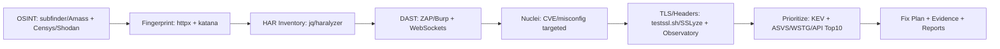

# Prompt 1
````prompt
Я прикрепил тебе контекст где я Alex AI Engineer and ARchitect Context Engineer!


Как правильно составить промпт для LLM на анализ наших сайтов для безопасности и полного прояснения документации как внутренней для безопасников и архитекторов так и внешней подготовки лицензии

У меня есть HAR файл нашей платформы - я прокликал все страницы которые мы разработали уже ее я прокликал все страницы там вот они 
там есть wss, xhr endpoint
```
├── 01-1-qualification.png
├── 01-2-2-operations-report.png
├── 01-2-asset-type=history.png
├── 01-3-1-2-asset-make-deposit.png
├── 01-3-1-asset-make-deposit.png
├── 01-3-2-asset-make-deposit.png.png
├── 01-4-asset-withdraw.png
├── 01-5-asset-emission-cfa.png
├── 01-6-1-market-filter.png
├── 01-6-2-2-market-trade-glass-TRNS1.png
├── 01-6-2-market-trade-glass-PSB23.png
├── 01-6-market.png
├── 01-wallet.png
├── applications.png
├── asset:withdraw:new-rekviziti.png
├── key-pair:import.png
├── market:order:create:LMD-1-operation-type=purchase.png
├── market:order:create:LMD-1-operation-type=purchase2.png
├── market:order.png
├── payment-calendar.png
├── placements:placements-detail:d2f29942-3ee0-4bc5-8e2d-834483890541-page-part-down.png
├── placements:placements-detail:d2f29942-3ee0-4bc5-8e2d-834483890541.png
├── placements.png
├── profile:type=data.png
├── profile:type=data2.png
├── profile:type=documents.png
├── profile:type=keyPair.png
├── qualification-3.png
└── support.png
```
типо сделать анализ и все сделать transparent and make audit few external and few internal by different LLMs
````
# Output 1.1
**TL;DR**

* Дал готовый **Prompt Pack**: один системный промпт + входной JSON + выходной JSON-schema + чек-листы → покрывают security, STRIDE, регуляторку (259-ФЗ/746-П/5625-У/ГОСТ/СТО БР) и выдачу «internal»/«external» артефактов. 
* Вшил pipeline: `HAR → инвентарь эндпоинтов → security posture (OWASP/ASVS) → STRIDE → мэппинг на ваши doc-пакеты → лицензирование (внешний пакет) → evidence`.  
* Есть **мульти-LLM** режим: как прогнать **несколько внешних и внутренних моделей**, сравнивая покрытие/точность/экшены по единой метрике.

---

## Шаги (что делать)

1. **Подготовить вход**

   * `app.har` + список PNG (ты уже дал) + короткий README: где dev/prod, домены, known headers/policies.
   * Приложить ключевые артефакты из ваших docs: High-Level Architecture, STRIDE и Mitigations, Non-Functional Targets, Матрица соответствия/правила/описание ИС. 
   * (Опц.) C4/диаграммы из артефактов «W44» — как «истина по UX/функциям». 

2. **Запустить Prompt Pack (ниже)** на 3 прохода

   * Pass-A: **Инвентарь** (парсим HAR → endpoints/wss/xhr/headers/cookies/CSP/CORS/TLS).
   * Pass-B: **Безопасность** (OWASP/ASVS, headers, cookies, CSP, CORS, HSTS, referrer-policy, wss-handshake, rate-limits, auth/session).
   * Pass-C: **STRIDE→Контроли→Регуляторка→Артефакты**: мэппинг на ваши документы и чек-листы (ГОСТ 57580.x, СТО БР ИББС), плюс «external» пакет для лицензии. 

3. **Сравнить модели** (внутренние/внешние) по общей метрике (см. таблицу): выбрать best-of, сделать финальную сводку.

---

## Компактная таблица (deliverables)

| Deliverable              | For              | Format        | Scope источников                               | Авто-проверки            |
| ------------------------ | ---------------- | ------------- | ---------------------------------------------- | ------------------------ |
| Endpoint Inventory       | Sec/Arch         | JSON+CSV      | HAR+wss/xhr+headers                            | Дубли/404/CSP/CORS       |
| Security Findings        | Sec              | JSON+Markdown | OWASP/ASVS + headers                           | Severity/duplicates      |
| STRIDE & Controls        | Arch/Sec         | Mermaid+JSON  | Потоки + Mitigations                           | Gap-map по контролям     |
| Compliance Map           | Legal/Compliance | Matrix+MD     | 259-ФЗ/746-П/5625-У↔Rules/Description/Policies | Traceability IDs         |
| External Licensing Brief | Regulator        | PDF/MD        | HLA/NFR/Controls/Process                       | PII scrub, no secrets    |
| Evidence Pack            | Auditors         | ZIP           | cURL headers, screenshots                      | Hash/TS/chain-of-custody |

---

## Mermaid — процесс аудита

```mermaid
flowchart TB
  A[HAR+Screens] --> B[Endpoint Inventory]
  B --> C[Security Posture (OWASP/ASVS)]
  C --> D[STRIDE & Mitigations]
  D --> E[Compliance Mapping 259-FZ/746-P/5625-U/GOST/BR]
  E --> F[Internal Pack: Sec+Arch Docs]
  E --> G[External Pack: Licensing Brief]
  B --> H[Evidence: headers/cookies/CSP]
```

---

## PROMPT PACK

### 1) System Prompt (вставлять как «system» для любой LLM)

```
You are a Senior Security+Architecture+Compliance auditor for a regulated DFA (ЦФА) platform.
Goal: produce a transparent, reproducible audit from a provided HAR + screenshots + internal docs.
You MUST:
- Work in 4 layers: (1) Inventory (HAR) → (2) Security posture (OWASP/ASVS) → (3) STRIDE+Mitigations → (4) Compliance mapping (RU: 259-FZ, 746-P, 5625-U; GOST 57580.x; BR IBBS) → produce INTERNAL and EXTERNAL artifacts.
- Never guess silently. If data missing, state explicit assumptions and mark “confidence”.
- Output MUST follow the JSON schema given below and include short human-readable MD sections.
- Produce Mermaid diagrams for data flows/STRIDE and keep labels without parentheses.
- Respect privacy: do not emit secrets, tokens, or exact PII. Summarize sensitive values.
- Rate each finding: severity (critical/high/medium/low), exploitability, fix effort, owner, ETA.
- Map every finding/control to evidence (headers, endpoints, screenshots) with pointers.
- Cross-link gaps to the client’s docs: High-Level Architecture, STRIDE/Mitigations, NFR/SLA/SLO, Policies, Rules/Description IS, Compliance Matrix.
- Provide an “External Licensing Brief” (sanitized) suitable for regulator submission.
```

> Ссылочные артефакты, на которые должен ссылаться аудит (добавьте в `docs_index`): High-Level Architecture, STRIDE/Mitigations, Non-Functional Targets, Матрица соответствия, Правила ИС и Описание ИС — это уже у вас есть в `docs/` и покрывают архитектуру, угрозы/контроли, NFR и регуляторку. 
> При наличии ваших C4/диаграмм «W44» используйте их как контекст по модулям/UX. 
> Если нужно учитывать договоренности и ожидания из рабочих созвонов — подсуньте лог-файлы/конспекты из `current-context/communication-log` как источник бизнес-контекста. 

---

### 2) Input JSON (вставлять как «user» → объект данных)

```json
{
  "har_file": "app.har",
  "screenshots": [
    "01-1-qualification.png",
    "01-2-2-operations-report.png",
    "01-2-asset-type=history.png",
    "01-3-1-2-asset-make-deposit.png",
    "01-3-1-asset-make-deposit.png",
    "01-3-2-asset-make-deposit.png.png",
    "01-4-asset-withdraw.png",
    "01-5-asset-emission-cfa.png",
    "01-6-1-market-filter.png",
    "01-6-2-2-market-trade-glass-TRNS1.png",
    "01-6-2-market-trade-glass-PSB23.png",
    "01-6-market.png",
    "01-wallet.png",
    "applications.png",
    "asset:withdraw:new-rekviziti.png",
    "key-pair:import.png",
    "market:order:create:LMD-1-operation-type=purchase.png",
    "market:order:create:LMD-1-operation-type=purchase2.png",
    "market:order.png",
    "payment-calendar.png",
    "placements:placements-detail:d2f29942-3ee0-4bc5-8e2d-834483890541-page-part-down.png",
    "placements:placements-detail:d2f29942-3ee0-4bc5-8e2d-834483890541.png",
    "placements.png",
    "profile:type=data.png",
    "profile:type=data2.png",
    "profile:type=documents.png",
    "profile:type=keyPair.png",
    "qualification-3.png",
    "support.png"
  ],
  "docs_index": {
    "architecture_hla": "docs/architecture/10-HighLevel-Architecture.md",
    "stride": ["docs/architecture/threat/STRIDE-Context.md", "docs/architecture/threat/Mitigations-Map.md"],
    "nfr": "docs/architecture/14-NonFunctional-Targets.md",
    "rules": "docs/legal/01-ПравилаИС-template.md",
    "description": "docs/legal/02-ОписаниеИС-template.md",
    "compliance_matrix": "docs/legal/03-Матрица-соответствия_259ФЗ-746П.md"
  },
  "context_notes": "environment=preprod, hostname=..., tls=..., known_policies={...}",
  "expected_outputs": ["inventory", "security_findings", "stride", "compliance", "internal_pack", "external_brief", "evidence_pack"],
  "regulatory_scope": ["259-FZ","746-P","5625-U","GOST-57580.x","BR-IBBS"],
  "model_role": "AUDITOR"
}
```

---

### 3) Output JSON Schema (жестко просите эту форму)

````json
{
  "inventory": {
    "endpoints": [
      {
        "url": "https://api.example.com/auth/login",
        "method": "POST",
        "type": "xhr|wss|fetch|img|script",
        "authz": "public|user|admin",
        "cookies": ["session_id"],
        "headers_sample": { "set-cookie": "...", "content-security-policy": "..." },
        "security_flags": { "secure": true, "httponly": true, "samesite": "Lax" },
        "cors": { "origin": "...", "allow_credentials": false, "risk": "..." }
      }
    ],
    "headers_summary": {
      "hsts": true,
      "csp": "present|missing|weak",
      "x_frame_options": "...",
      "referrer_policy": "...",
      "permissions_policy": "..."
    }
  },
  "security_findings": [
    {
      "id": "SEC-001",
      "area": "CSP|CORS|Cookies|TLS|Auth|WSS|RateLimit|Logging|PII",
      "endpoint_refs": ["..."],
      "severity": "critical|high|medium|low",
      "description": "...",
      "evidence": ["header:csp", "curl:https://..."],
      "recommendation": "actionable steps",
      "owner": "frontend|backend|devops|secops",
      "eta_days": 7,
      "standards": ["OWASP-ASVS-..."],
      "confidence": 0.85
    }
  ],
  "stride": {
    "diagram_mermaid": "```mermaid\nsequenceDiagram\n...\n```",
    "threats": [
      { "id":"STRIDE-S1", "category":"Spoofing", "vector":"OIDC flow", "mitigation":"mTLS, state/nonce", "gap":false }
    ]
  },
  "compliance": {
    "matrix": [
      { "req":"746-P §3", "doc_ref":"rules §...", "status":"ok|gap", "evidence":"link/id", "notes":"..." }
    ],
    "gost_controls": [
      { "control":"GOST 57580.1 4.3 Access control", "status":"ok|gap", "doc":"Политика ИБ", "evidence":"..." }
    ]
  },
  "internal_pack": { "md": "### Summary...\n", "attachments": ["mermaid.md","inventory.csv"] },
  "external_brief": { "md": "### Licensing Readiness...\nNo secrets, sanitized." },
  "evidence_pack": { "files": ["curl-headers.txt","screenshots-index.json"], "hashes": [{"file":"...","sha256":"..."}] },
  "metrics": {
    "coverage": { "endpoints_total": 123, "tested": 118 },
    "risk_score": 72,
    "top_gaps": ["CSP missing on X", "Weak CORS on Y"]
  }
}
````

---

### 4) Checklist (внутри промпта — чтобы LLM точно проверил важное)

* **Headers**: HSTS, CSP, X-Frame-Options, X-Content-Type-Options, Referrer-Policy, Permissions-Policy.
* **Cookies**: `Secure`, `HttpOnly`, `SameSite`, scope, rotation.
* **CORS**: wildcard, credentials, preflight anomalies.
* **WSS**: handshake (Sec-WebSocket-Accept), `wss://` only, permessage-deflate risks, auth context.
* **AuthN/Z**: session fixation, CSRF, OIDC state/nonce, MFA, RBAC/ABAC (см. HLA). 
* **Logging/Audit**: неизменяемость, корреляция, PII-mask (журналы/аудит — см. Описание ИС/Правила ИС). 
* **NFR/SLO**: latency p95, RTO/RPO (см. Non-Functional Targets). 
* **STRIDE→Mitigations**: мэп на вашу карту мер. 
* **Regulatory Map**: 259-ФЗ/746-П/5625-У ↔ Матрица соответствия. 

---

### 5) Scoring (для мульти-LLM сравнения)

* **Coverage (0–10)**: % покрытых эндпоинтов, полнота headers/cookies/WSS.
* **Accuracy (0–10)**: минимум false-positives (по ручной верификации 5 рандом находок).
* **Actionability (0–10)**: ясные шаги fix, владелец, ETA.
* **Compliance traceability (0–10)**: правильные привязки к требованиям и вашим документам.
  Итог = среднее (с весами 2× для Accuracy/Actionability).

---

## Мини-подсказки для подготовки входа (до запуска)

* Извлечь инвентарь из HAR (локально), чтобы потом сравнить с LLM-выходом:

  ```bash
  cat app.har | jq -r '.log.entries[] | [.request.method, .request.url] | @tsv' | sort -u > endpoints.tsv
  ```
* Снимки заголовков (evidence):

  ```bash
  curl -sI https://YOUR_HOST/ | tee headers.txt
  ```
* Соберите `docs_index.json` с путями к вашим md (архитектура/правила/описание/матрица/NFR/STRIDE). 

---

## Next actions (коротко)

1. Заархивируй `app.har + screenshots + docs_index.json` и прогоняй **Pass-A/B/C** этим Prompt Pack.
2. Прогони **2–3 модели** (внешние/внутренние) с **одинаковым входом**, сведи метрики и выбери best-of.
3. Дополни **gaps** вручную, актуализируй «Матрица соответствия»/«Правила ИС/Описание ИС» по выявленным пробелам и сформируй **External Licensing Brief** для пакета в регулятор. 

---

**Примечание:**

* Внутренние артефакты, на которые опирается промпт: High-Level Architecture, STRIDE/Mitigations, NFR и Матрица соответствия/Правила/Описание — уже в `docs/` (архитектура, угрозы/меры, NFR, юр.доки). 
* C4/UX и тех. контекст из артефактов недели W44 — как референс к интерфейсам/модулям. 
* Рабочие созвоны/контекст (ожидания, сроки, роли) можете приложить как `context_notes` — берите из `current-context/communication-log/*`. 

Готов вложить это в твой агентный пайплайн — структура уже заточена под Spec-Driven Dev и «Why→What→How→Result».

# Output 1.2
**TL;DR**

* Дал готовый **prompt‑pack** (5 шаблонов) для: внутреннего Sec‑аудита HAR+скринов, прояснения документации, лицензирования (ОИС ЦФА/259‑ФЗ), внешнего redacted‑аудита и red‑team проверки. Все с **JSON‑схемами** и чек‑листами OWASP/ASVS.  
* Поток: **HAR+скрины → санобработка → 2+ LLMs (internal/external) → diff/merge → отчёты** (Internal, External, License‑ready). Подключены ваши домены/сервисы KYC, Custody, Settlement, Tokenization, Compliance и слои DMZ/WAF/Keycloak/HSM из архитектуры.  
* Вывод: воспроизводимые артефакты (JSON Findings, Evidence, GAP‑List, License‑Checklist) с привязкой к **HAR‑запросам/WS кадрам** и страницам из списка (wss/xhr/endpoints).

---

## Steps

1. **Соберите входные артефакты**

   * HAR полного клика по продукту, экспорт cookies/storage (Local/Session), список third‑party доменов.
   * Папка скринов (ваши: `qualification.png`, `market:order*.png`, `wss/xhr` и т.д.) с именами‑якорями.
   * Короткий **ARCH_CONTEXT.md** (копипастой из ваших C4/диаграмм: роли, сервисы, периметры DMZ/HSM/Keycloak).  

2. **Санобработка/редакция (policy)**

   * Замаскировать токены/ключи/PII, реальные IP/домены → `[REDACTED]`.
   * Оставить **структуру**: метод/URL/статус/заголовки/тайминги, тела ответов без секретов (hash/sample).
   * Сформировать `screens_index.json` (имя файла → страница/ролевая зона).

3. **Разметка HAR (автоматизируйте минимум)**

   * Сгруппировать: `first_party` vs `third_party`, **WSS** (субпротоколы, auth в query?), **XHR/fetch** (sensitive GET?).
   * Выделить security‑headers (CSP/HSTS/X‑Frame‑Options/CORS), cookies флаги (Secure/HttpOnly/SameSite).
   * Пометить **ошибки** (5xx/4xx), **verbose stacktraces**, **PII в URL/логах**, **JWT в URL/LocalStorage**.

4. **Запуск проходов (2+ моделей)**

   * Internal pass: *Security & Docs* (модели A,B).
   * External pass: *Redacted Public* (модели C,D).
   * Red‑team pass: *Prompt‑injection / client‑side abuse* (sandboxed).
   * Для каждого: **mode=json** → валидировать схемы → затем короткий MD‑summary.

5. **Diff/Merge и верификация**

   * Свести Findings по ключу: `endpoint_id + issue_code`.
   * Дедуп, консолидация severity/likelihood, ручная проверка top‑risks.
   * Приложить **evidence**: `har.requestId`, `screenshot`, `header snippet`.

6. **Матч на архитектуру/периметры**

   * Сопоставить issues с контекстом C4: KYC→Registry, Custody(MPC/HSM), Settlement(DvP), Tokenization, Compliance/AML; а также DMZ/WAF/Keycloak/ISTIO/Ваult/SIEM.  

7. **Docs‑clarity/GAP‑лист**

   * Выявить недостающие разделы внутренней/внешней доки: API, IAM/RBAC/ABAC, key/crypto policies, audit/ledger, incident runbooks. 

8. **Лицензирование (draft readiness)**

   * Чек‑лист соответствия проекту ОИС ЦФА (259‑ФЗ; требования к оператору; 63‑ФЗ подпись/УКЭП; 152‑ФЗ ПДн; процессы AML/отчетность ISO 20022). Вывести **Non‑Legal Disclaimer** и поле `needs_legal_review=true`. 

9. **Сборка отчётов**

   * `internal_security.json`, `docs_gaps.json`, `license_readiness.json` + короткие MD/PDF.
   * Export в backlog (issues/tickets) по `issue_code`.

10. **Повторный прогон после фиксов**

* Те же промпты в режиме **regression** (сравнение до/после). SLA: блокеры устранены, риск‑карта обновлена.

---

### Process (Mermaid)

```mermaid
flowchart LR
  A[HAR + Screens + ARCH_CONTEXT] --> B[Sanitize/Redact]
  B --> C{LLM Passes}
  C --> C1[Internal Sec+Docs (A,B)]
  C --> C2[External Redacted (C,D)]
  C --> C3[Red‑Team Checks]
  C1 --> D[JSON Findings/Evidence]
  C2 --> D
  C3 --> D
  D --> E[Diff/Merge + Manual Verify]
  E --> F[Reports: Internal/External/License]
  F --> G[Backlog Tickets]
  G --> H[Fix]
  H --> I[Regression Pass]
```

---

## Table — Passes/Scope/Artifacts (≤6)

| Pass           | Scope                                            | Models (пример) | Input                      | Output                   |
| -------------- | ------------------------------------------------ | --------------- | -------------------------- | ------------------------ |
| Internal Sec   | OWASP/ASVS, headers, auth, WSS/XHR, data‑leaks   | 2 разных LLM    | HAR, screens, ARCH_CONTEXT | `internal_security.json` |
| Docs Clarity   | Архитектура/процессы/политики                    | 2 LLM           | ARCH_CONTEXT, текущие DOCS | `docs_gaps.json`         |
| License Ready  | ОИС ЦФА/259‑ФЗ, 63‑ФЗ УКЭП, 152‑ФЗ, AML/ISO20022 | 1–2 LLM         | ARCH_CONTEXT, policies     | `license_readiness.json` |
| External Sec   | Публичные страницы (redacted)                    | 1–2 LLM         | redacted HAR/screens       | `external_findings.json` |
| Red‑Team Lite  | Prompt‑inj, client‑abuse, UX‑misuse              | 1 LLM           | публичная часть            | `redteam.json`           |
| Merge & Report | Консолидация, дубликаты, топ‑риски               | —               | все JSON                   | MD/PDF отчёты            |

---

## Next actions

1. Скинь **HAR + zip скринов + ARCH_CONTEXT.md** (1–2 страницы, выдержка из C4/диаграмм). 
2. Запусти **Internal Sec** и **Docs Clarity** промпты (ниже) на 2 разных LLM; верни JSON и MD‑summary.
3. Запусти **License Ready** промпт (режим `mode=json`), приложив действующие политики/процедуры. 
4. Прогони **External Sec** (redacted) + **Red‑Team Lite**.
5. Я сведу результаты, расставлю приоритеты и подготовлю дорожную карту фиксов.

---

# Prompt‑Pack (готово к копипасте)

> Общие требования (добавляй в каждый промпт):
> • **Никаких догадок без `uncertainty`**. • Не выводи приватные данные в cleartext. • Не раскрывай цепочки эксплуатации. • Сначала JSON по схеме → затем краткий MD‑summary (≤200 слов). • Русский+EN терминология (B2).

---

## 1) **Internal Security Audit (HAR + Screens)**

**SYSTEM**

Вы — Senior Web App Security & Architecture Auditor. Анализируете статические артефакты (HAR, скриншоты, краткий ARCH_CONTEXT) и даёте **оборонительный** отчёт: уязвимости, нарушения best‑practices, риск‑оценку и чёткие remediation шаги. Ориентиры: **OWASP ASVS, OWASP Top‑10, WSTG**. Не выполняете активный скан. Не раскрываете payload’ы эксплуатации.

**TASKS (кратко)**

1. Разобрать HAR: first/third‑party домены, **WSS** (auth/subprotocol/origin), **XHR/fetch**, кэш/TTL, CORS, CSP/HSTS, cookies flags, PII/JWT в URL/Storage.
2. Сопоставить находки с **ARCH_CONTEXT** (KYC/KYB, Custody(HSM/MPC), Settlement(DvP), Tokenization, Compliance/AML; DMZ/WAF/Keycloak/Vault/SIEM).
3. Для каждой находки: evidence (requestId/headers/response‑snippet), severity, likelihood, affected_endpoints, стандарт (OWASP/ASVS), **remediation**.
4. Вывести сводку топ‑рисков и быстрых фиксов (Quick Wins).

**INPUT**

```
MODE: json
HAR: <<PASTE or PATH>>
SCREENS_INDEX: <<JSON mapping filename -> page/role>>
ARCH_CONTEXT: <<short text from your C4 & security diagrams>>
```

**OUTPUT.JSON.SCHEMA**

```json
{
  "app_metadata": {
    "generated_at": "iso-datetime",
    "scope": ["web","api","wss"],
    "assumptions": ["string"]
  },
  "findings": [
    {
      "issue_code": "SEC-HDR-CSP-001",
      "title": "Missing/weak CSP",
      "severity": "high|medium|low",
      "likelihood": "high|medium|low",
      "affected_endpoints": ["GET https://app.example.com/*"],
      "evidence": {
        "har_request_id": "string",
        "headers": {"Content-Security-Policy": "…"},
        "screenshot": "market:order.png"
      },
      "owasp_ref": ["ASVS-14.1.1","WSTG-CLNT-01"],
      "recommendation": "Enable CSP with default-src 'none' …",
      "uncertainty": "0..1"
    }
  ],
  "summary": {
    "risk_heatmap": [{"category":"auth","high":1,"med":2,"low":0}],
    "quick_wins": ["Enable HSTS","HttpOnly+Secure on all cookies"],
    "blocked_by": []
  }
}
```

**NOTES**

* Старайся ссылаться на **конкретный** `har_request_id`/screenshot.
* Не выводи чувствительные значения; указывай «present/absent/masked».
* Если данных не хватает — дай `uncertainty>0.5` + что проверить вручную.

*(Контекст доменных сервисов и security периметров см. ваши C4/диаграммы/секьюрити‑архитектуру — KYC/Custody/Settlement/Tokenization/Compliance; DMZ/WAF/Keycloak/HSM/SIEM).  *

---

## 2) **Docs Clarity & GAP‑List (Internal)**

**SYSTEM**

Вы — Tech Writer & Platform Architect. Цель — выявить **пробелы** в внутренней/внешней документации для безопасников, архитекторов и интеграторов.

**TASKS**

* Сверить текущие документы/ARCH_CONTEXT с целевыми артефактами: **C4 L1‑L3**, ADR, API (OpenAPI), IAM/RBAC/ABAC, **Crypto/HSM/MPC**, **Audit/immutable ledger**, **Incident Response/Runbooks**, **Data classification & PII handling**, **DevSecOps (SAST/DAST/IAST)**.  
* Составить GAP‑лист с приоритетом и «как закрыть».

**INPUT**

```
MODE: json
ARCH_CONTEXT: <<paste>>
DOCS_LIST: <<titles/links or placeholders>>
```

**OUTPUT.JSON.SCHEMA**

```json
{
  "gaps": [
    {
      "doc_title": "Key Management Policy",
      "required_by": ["internal_security","audit","HSM operations"],
      "current_state": "absent|draft|outdated",
      "impact": "high|medium|low",
      "how_to_close": ["Adopt CloudHSM runbook","Define key rotation M-of-N"],
      "owner": "SecOps",
      "eta_days": 7
    }
  ],
  "summary": {"high_impact_gaps": 3, "quick_docs": 2}
}
```

---

## 3) **License‑Readiness (ОИС ЦФА / RU)**

**SYSTEM**

Вы — Compliance Analyst (non‑legal). Проверь **готовность документации и процессов** к получению лицензии оператора информационной системы ЦФА. Рамки: **259‑ФЗ (ЦФА), 63‑ФЗ (электронная подпись/УКЭП), 152‑ФЗ (ПДн), AML/CFT, отчётность (ISO 20022/XBRL)**. Отвечайте оборонительно, **без юридических заключений** — только чек‑лист и недостающие артефакты для подготовки к юр‑аудиту.  

**INPUT**

```
MODE: json
ARCH_CONTEXT: <<paste>>
POLICIES: <<list of available policies/controls>>
```

**OUTPUT.JSON.SCHEMA**

```json
{
  "license_checklist": [
    {
      "area": "Governance & Policies",
      "control": "Information Security Policy",
      "status": "present|partial|absent",
      "evidence": "policy_ref or 'n/a'",
      "gap": "What is missing",
      "priority": "P1|P2|P3"
    }
  ],
  "aml_cft": [{"control":"Sanctions screening","status":"partial","gap":"No audit trail export"}],
  "ukep_gost": [{"control":"UKEP signatures for legal actions","status":"partial"}],
  "personal_data_152fz": [{"control":"Data localization","status":"present"}],
  "reporting_iso20022": [{"control":"Outbound reporting messages","status":"absent"}],
  "needs_legal_review": true,
  "summary": {"p1": 5, "p2": 8, "p3": 3}
}
```

---

## 4) **External (Redacted) Security Review**

**SYSTEM**

Вы — External Reviewer. Анализируете **только публичные** артефакты (редактированные HAR+скрины). Запрещено делать предположения о внутренних компонентах.

**INPUT**: `HAR_REDACTED`, `SCREENS_PUBLIC`, `PUBLIC_SCOPE`.

**OUTPUT**: как в Internal Security, но **без внутренних ссылок и любых секретов**. Добавить поле `redaction_ok: true/false`.

---

## 5) **Red‑Team Lite (Safe)**

**SYSTEM**

Вы — Red‑Team Advisor (без эксплуатации). Цель — смоделировать **safe‑тест‑кейсы** против публичной части: prompt‑injection на формах/чатах/LLM‑фичах (если есть), client‑side misuse (переполнения форм, копирование токенов из DOM, реюз рефереров), кликджекинг и др.
**OUTPUT**: `test_cases[]` с описанием шага, ожидаемым результатом, метриками «безопасно ли проводить» и требуемыми safeguards (стенды/флаги/ограничения).

---

# Чек‑лист проверок (коротко)

* **Headers**: CSP, HSTS (includeSubDomains, preload), X‑Frame‑Options/Frame‑ancestors, Referrer‑Policy, Permissions‑Policy, X‑Content‑Type‑Options.
* **Cookies/Session**: Secure/HttpOnly/SameSite, rotation, CSRF tokens, JWT не в LocalStorage/URL.
* **CORS**: `Access-Control-Allow-Origin` не `*` для auth, строгий `Vary`, preflight.
* **WSS**: аутентика не в query, проверка Origin/Subprotocol, heartbeat, message‑schema валидация.
* **PII/Secrets**: нет PII/токенов в URL, заголовках «referer», логах, source‑maps.
* **Error/Debug**: нет stacktrace/версионности; source‑map disabled; robust 4xx/5xx UX.
* **AuthZ**: RBAC/ABAC матрица ролей; принципы least‑privilege; admin endpoints не торчат.
* **Supply/3rd‑party**: список SDK/аналитики, CSP allow‑list, SRI.
* **Crypto/Keys**: BYOK/HSM/MPC политики, rotation, dual‑control; подписи УКЭП на значимых действиях. 
* **Audit/Immutable**: неизменяемый журнал событий (DLT/immudb), целостность/якоря. 

---

## Мини‑команды (опционально)

```bash
# Быстро собрать домены из HAR
jq -r '.log.entries[].request.url' app.har | awk -F/ '{print $3}' | sort -u

# Вытащить security-headers ответов
jq -r '.log.entries[] | .response.headers[] | select(.name|test("(?i)content-security-policy|strict-transport-security|x-frame-options|referrer-policy|permissions-policy|x-content-type-options")) | "\(.name): \(.value)"' app.har
```

---

### Примечания к контексту проекта

* Доменные сервисы и контейнеры (KYC/KYB, Custody(HSM/MPC), Settlement(DvP), Tokenization, Compliance/AML; Kafka, Redis, Fabric, Keycloak и пр.) — в ваших C4/диаграммах и анализа RWA/ЦФА. Используйте их как **ARCH_CONTEXT**. 
* Security‑периметры DMZ/WAF/DDoS, IAM/Keycloak/SSO, Service Mesh/mTLS, Vault/HSM, SIEM/IDS, неизменяемый реестр (DLT/immudb) — учитывать в проверках и документации. 

---

**Готово.** После того как запустишь первые три промпта (Internal Sec, Docs Clarity, License‑Ready) — скидывай JSONы, я сведу, приоритезирую и дам план фиксов/доков.


# Prompt 2
а нужен какой-то вспомогательный софт и прочее? какими сейчас best practices osint, secops пользуются ведь не только по старинке софты? но может и посторинке плюс так комбинированный подход?

Посмотри в интернете выстрои pipeline,workflow, checklist действий структурно и список инструментов вначале что и как делать и как прогонять и прочие рекомендации (HAR файл 5.5мб понятно потом еще gemini дам, может еще cleaning делать на urls, запросы)
# Output 2. 
**TL;DR**

* Дал **pipeline OSINT→DAST→WSS→TLS/Headers→Compliance** с командами, чек‑листами и точками принятия решений. Опираемся на **OWASP WSTG/ASVS**, **OWASP API Top‑10 (2023)**, **MITRE ATT&CK**, **CIS Controls v8.1**, **NIST SP 800‑61r3**. ([OWASP Foundation][1])
* Инструменты по фазам: **ProjectDiscovery (subfinder, httpx, katana, nuclei)** → **ZAP/Burp** (в т.ч. WebSockets) → **testssl.sh/SSLyze** → **Mozilla Observatory** → **Censys/Shodan/Amass** → **Gitleaks/TruffleHog/Trivy/Checkov**. ([ProjectDiscovery Documentation][2])
* Приоритизация фикс‑плана: **KEV‑каталог CISA** + **OWASP ASVS/WSTG** + **API Top‑10 2023** + **CSP3/HSTS preload**. Сначала закрываем KEV/критичное, затем high‑risk misconfigs. ([CISA][3])

---

## Шаги (workflow)

1. **Scope & Legal (0‑й шаг)**

   * Зафиксируй домены/сабдомены, время и разрешённый стек активностей.
   * Фреймворки для методики/отчётности: **WSTG** для тест‑кейсов, **ASVS** для требований, **MITRE ATT&CK** для TTP‑мэппинга, **CIS Controls v8.1** для базовой гигиены, **NIST SP 800‑61r3** для IR‑готовности. ([OWASP Foundation][1])

2. **Recon/OSINT → Attack Surface (внешка)**

   * Passive enum: `subfinder -d your.tld -all -o subs.txt`; `amass enum -d your.tld -o amass.txt`.
   * Fingerprint + crawl: `cat subs.txt | httpx -title -tech-detect -status-code -o httpx.txt`; `katana -u https://app.your.tld -o urls.txt`.
   * Exposure & certs: **Censys/Shodan** (ручные запросы/SDK) для сервисов/сертификатов. ([ProjectDiscovery Documentation][4])

3. **HAR → инвентарь эндпоинтов**

   * Нормализуй и дедуплируй URL’ы; выдели `xhr/fetch`, `wss`, статику.
   * Быстрый парс: `cat app.har | jq -r '.log.entries[].request.url' | sort -u > endpoints.txt`.
   * Для продвинутого анализа — **haralyzer** (Python). Убери токены/PII из query/headers. ([softwareishard.com][5])

4. **DAST/API/WebSockets (ручное+авто)**

   * **OWASP ZAP**: проксируй трафик, активное тестирование по WSTG; вкладка **WebSockets** → replay/fuzz;
   * **Burp**: Repeater для WebSocket‑handshake/messages, targeted Scanner.
   * **nuclei** на целевые `urls.txt/endpoints.txt` (шаблоны: misconfig/cves/http/headers).
   * Для API ориентируйся на **OWASP API Top‑10 2023** (BOLA/BOPLA/Auth и т.д.). ([ZAP][6])

5. **TLS/Headers/Policies (конфигурация)**

   * **testssl.sh/SSLyze** — протоколы/шифры/уязвимости; **Mozilla Observatory** — headers (CSP/HSTS/XFO/XCTO/Referrer/Permissions).
   * Валидация **CSP3** (минимум `default-src 'none'` + allow‑lists, `strict-dynamic` где уместно). Для HSTS — preloading‑критерии. ([TestSSL ][7])

6. **Приоритизация и SecOps‑контур**

   * Мэппинг находок на **ASVS/WSTG/API‑Top10**; срочность через **CISA KEV** (если CVE в каталоге — приоритет 1).
   * Инцидентная готовность и runbooks по **NIST SP 800‑61r3** (заменяет r2). ([OWASP Foundation][8])

7. **Supply‑chain/Code posture (быстрые сканы)**

   * Secrets: **Gitleaks/TruffleHog**; контейнеры/артефакты: **Trivy**; IaC: **Checkov**. Включи в CI как gate. ([GitHub][9])

8. **Отчётность и evidence**

   * Выход: инвентарь, список находок с ASVS/API‑Top10 ссылками, PCAP/HAR/скриншоты, cURL‑пробы, TLS/headers отчёты, трекинг фиксов.
   * Сопровождай диаграммой потоков/угроз (Mermaid) и мэппингом на контролы.

---

## Инструменты (короткий список, чем и когда)

| Фаза          | Цель                      | Инструменты                                               | Что даёт                                                                           |
| ------------- | ------------------------- | --------------------------------------------------------- | ---------------------------------------------------------------------------------- |
| Recon/OSINT   | Поверхность атаки         | subfinder, Amass, Censys, Shodan, httpx, katana           | Сабдомены, сервисы, tech‑фингерпринт, роуты. ([ProjectDiscovery Documentation][4]) |
| HAR Inventory | Полный список endpoint’ов | jq, haralyzer                                             | Дедуп/классификация xhr/fetch/wss, очистка PII. ([PyPI][10])                       |
| DAST/API      | Уязвимости/логика         | ZAP, Burp, nuclei                                         | Авто+ручные тесты, WebSockets, быстрый CVE/misconfig. ([ZAP][6])                   |
| TLS/Headers   | Конфиг‑гигиена            | testssl.sh, SSLyze, Mozilla Observatory                   | Протоколы/шифры, строгие заголовки, рекомендации. ([TestSSL ][7])                  |
| Методики      | Нормы/чек‑листы           | OWASP WSTG/ASVS, OWASP API Top‑10, MITRE ATT&CK, CIS v8.1 | Тест‑кейсы, требования, TTP‑мэппинг, базовые контролы. ([OWASP Foundation][1])     |
| SecOps/IR     | Приоритизация/реакция     | CISA KEV, NIST SP 800‑61r3                                | Что чинить первым, runbooks и коммуникация. ([CISA][3])                            |

---

## Чек‑лист (основной)

* **OSINT/ASM:** субдомены, живые хосты, fingerprint (title, tech, status), индекс скрытых URL (SPA) — `subfinder → httpx → katana`. ([ProjectDiscovery Documentation][4])
* **HAR:** удалить токены/PII, нормализовать URL, выделить `wss://` и long‑poll, связать с UI‑скриншотами. ([softwareishard.com][5])
* **WebSockets:** перехват/повтор/фаззинг сообщений и **handshake** (Origin/Auth), проверка авторизации вне HTTP‑cookies. ([OWASP Foundation][11])
* **API:** BOLA/BOPLA/Auth/Excessive Data Exposure, mass‑assignment — по **API Top‑10 2023**. ([OWASP Foundation][12])
* **TLS/Headers:** **HSTS (включая preload)**, **CSP3** (`default-src 'none'`, allow‑lists, `strict-dynamic` при CSP‑nonce), XFO, XCTO, Referrer‑Policy, Permissions‑Policy. ([hstspreload.org][13])
* **Приоритизация:** CVE ∈ **CISA KEV** → срочно; прочее — по ASVS/WSTG и воздействию на бизнес‑потоки. ([CISA][3])
* **Supply‑chain:** secrets, контейнеры, IaC — в CI (fail on high). ([GitHub][9])
* **IR:** playbooks, контакт‑листы, evidence‑схема (hash, timestamps) — **NIST 800‑61r3**. ([NIST Publications][14])

---

## Команды (минимум, чтобы стартовать)

```bash
# 1) OSINT
subfinder -d your.tld -all -o subs.txt                                  # pass recon
cat subs.txt | httpx -silent -title -tech-detect -status-code -o httpx.txt
katana -u https://app.your.tld -headless -d 5 -o urls.txt                # SPA crawl

# 2) HAR → endpoints
jq -r '.log.entries[].request.url' app.har | sort -u > endpoints.txt     # быстрый инвентарь

# 3) Nuclei
cat endpoints.txt | nuclei -severity medium,high,critical -o nuclei.txt  # misconfig/CVE авто-проверки

# 4) TLS/Headers
testssl.sh app.your.tld | tee tls.txt                                    # протоколы/шифры
sslyze --regular app.your.tld | tee sslyze.txt

# 5) Secrets / Containers / IaC (в CI)
gitleaks detect -v --no-git --source .                                   # secrets
trufflehog filesystem .                                                  # расширенная проверка секретов
trivy fs . && trivy image your-image:tag
checkov -d iac/                                                          # Terraform/Helm/K8s
```

---

## Рекомендации по **HAR‑cleaning** (перед LLM/шарингом)

* Убрать `Authorization`, `Cookie`, `X-*Token`, токены в query (`access_token`, `code`, `ticket`).
* Нормализовать URL: `scheme://host/path?sorted(params)`; обрезать UUID/PII → `<redacted>`.
* Разнести по типам: `xhr/fetch`, `wss`, `document`, `script`, `img`.
* Инструменты: **haralyzer** (Python) для выборки/маскировки; спеку см. HAR 1.2. ([PyPI][10])

---

## Mermaid (общая схема)



---

## Next actions

1. **Собери вход**: `app.har` (5.5 MB), `endpoints.txt`, `subs.txt/httpx.txt/urls.txt`, итог TLS/headers репорты.
2. **Прогони DAST**: ZAP/Burp (особенно `wss://`), затем `nuclei` по целевым URL.
3. **Приоритизируй** по **CISA KEV** и **ASVS/API Top‑10**, встрой **Gitleaks/TruffleHog/Trivy/Checkov** в CI.
4. **Оформи отчёт**: inventory + находки + мэппинг на **WSTG/ASVS**, план фиксов, evidence‑пак.

> Если нужно — дам готовые jq/haralyzer‑скрипты для маскировки HAR и генерации CSV‑инвентаря.

**Ссылки‑опоры:** WSTG/ASVS/API‑Top10/MITRE/CIS/NIST (методики), PD‑suite/ZAP/Burp (DAST/WSS), testssl/SSLyze/Observatory (TLS/headers), KEV (приоритизация). ([OWASP Foundation][1])

Если хочешь — адаптирую это в твой мульти‑LLM агент‑pipeline (Pass‑A/B/C) и дам строгие JSON‑схемы для логгинга результатов.

[1]: https://owasp.org/www-project-web-security-testing-guide/?utm_source=chatgpt.com "OWASP Web Security Testing Guide"
[2]: https://docs.projectdiscovery.io/opensource/subfinder/overview?utm_source=chatgpt.com "Subfinder Overview - ProjectDiscovery Documentation"
[3]: https://www.cisa.gov/known-exploited-vulnerabilities-catalog?utm_source=chatgpt.com "Known Exploited Vulnerabilities Catalog"
[4]: https://docs.projectdiscovery.io/opensource/subfinder/install?utm_source=chatgpt.com "Installing Subfinder"
[5]: https://www.softwareishard.com/blog/har-12-spec/?utm_source=chatgpt.com "HAR 1.2 Spec"
[6]: https://www.zaproxy.org/docs/desktop/addons/websockets/?utm_source=chatgpt.com "WebSockets - ZAP"
[7]: https://testssl.sh/doc/testssl.1.html?utm_source=chatgpt.com "testssl(1)"
[8]: https://owasp.org/www-project-application-security-verification-standard/?utm_source=chatgpt.com "OWASP Application Security Verification Standard (ASVS)"
[9]: https://github.com/gitleaks/gitleaks?utm_source=chatgpt.com "Find secrets with Gitleaks"
[10]: https://pypi.org/project/haralyzer/?utm_source=chatgpt.com "haralyzer"
[11]: https://owasp.org/www-project-web-security-testing-guide/latest/4-Web_Application_Security_Testing/11-Client-side_Testing/10-Testing_WebSockets?utm_source=chatgpt.com "WSTG - Latest | OWASP Foundation"
[12]: https://owasp.org/API-Security/editions/2023/en/0x00-header/?utm_source=chatgpt.com "2023 OWASP API Security Top-10"
[13]: https://hstspreload.org/?utm_source=chatgpt.com "HSTS Preload List Submission"
[14]: https://nvlpubs.nist.gov/nistpubs/SpecialPublications/NIST.SP.800-61r3.pdf?utm_source=chatgpt.com "NIST.SP.800-61r3.pdf"
