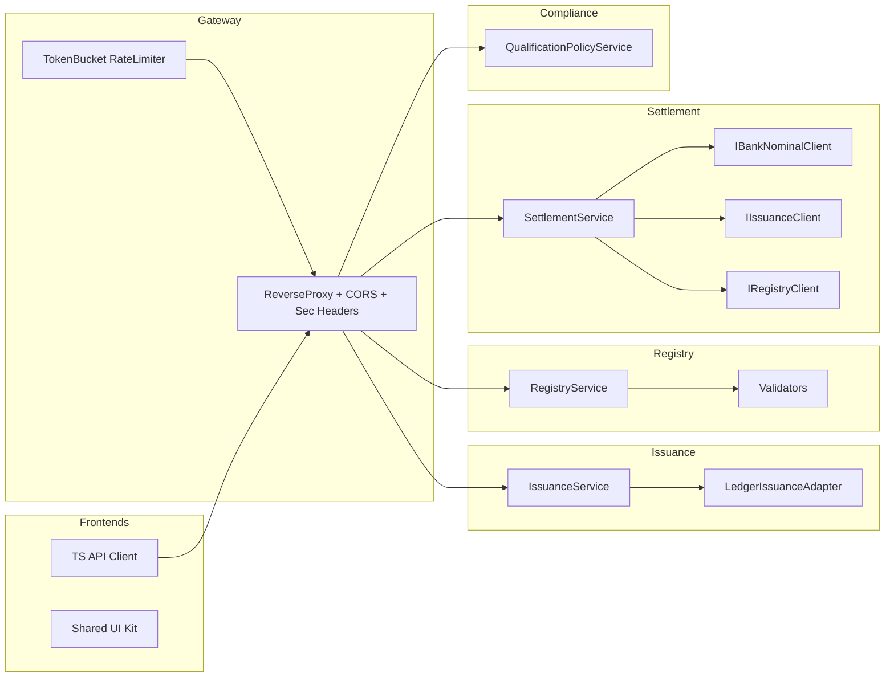

## TL;DR

* Готов JSON-репорт `ois-cfa.shtgn.reposcan.json` + полный набор C4-диаграмм (C1/C2/C3/C4) ниже. [Скачать JSON](sandbox:/mnt/data/ois-cfa.shtgn.reposcan.json)
* Структура и поля следуют шаблону Shotgun-Pro; классификация и C4-уровни — по mapping-rules.   
* Источники: README (MVP: Issue/Buy/Payout/Redeem) + docker-compose (Postgres/Kafka/Keycloak/MinIO) + YARP-маршруты + AsyncAPI + DTO/Chaincode.        

## Steps

1. Принял «Shotgun-Pro» как целевую схему (meta/context/containers/components/…); использовал intake-правила и C4-инференс.   
2. Собрал факты из репо: MVP-функции, стек и сервисы из `docker-compose.yml`, прокси-маршруты из YARP, события из AsyncAPI, DTO/Chaincode.       
3. Сформировал JSON (`shtgn-1.0`), свёл C4: Context→Containers→Components→Code и сохранил артефакт. [Download JSON](sandbox:/mnt/data/ois-cfa.shtgn.reposcan.json)

## Table

| Deliverable   | Path / Section                          | Notes                                                                                                                       |
| ------------- | --------------------------------------- | --------------------------------------------------------------------------------------------------------------------------- |
| Shotgun JSON  | `/mnt/data/ois-cfa.shtgn.reposcan.json` | Полный свод (contexts/containers/components/deployment/data_schema/api/external/sources). Шаблон и intake-правила учтены.   |
| C1 Context    | «C1 (ниже)»                             | ОИС и внешние акторы (Issuer/Investor/Bank/ESIA/EDO/Regulator). MVP-функции из README.                                      |
| C2 Containers | «C2 (ниже)»                             | Portals, API-Gateway(YARP), Identity, Issuance/Registry/Settlement/Compliance, Kafka, Postgres, Keycloak, MinIO, DLT.       |
| C3 Components | «C3 (ниже)»                             | Gateway RateLimiter/ReverseProxy; Issuance/Registry/Settlement компоненты; TS API-клиент; UI-kit.                           |
| C4 Code       | «C4 (ниже)»                             | DTO (Order/Redeem/Wallet), Chaincode Issuance/Registry, Domain.                                                             |

---

### C1 — Context (mermaid)

```mermaid
flowchart LR
  userIssuer[Issuer] --> OIS[(OIS-CFA System)]
  userInvestor[Investor] --> OIS
  OIS --> Bank[Bank / Nominal]
  OIS --> ESIA[ESIA OIDC]
  OIS --> EDO[EDO (UKEP)]
  Reg[Regulator] --> OIS
```

### C2 — Containers (mermaid)

```mermaid
flowchart TB
  subgraph Portals
    PI[Portal Issuer (Next.js)]
    PV[Portal Investor (Next.js)]
    BO[Backoffice (Next.js)]
  end

  GW[API Gateway (YARP, .NET)]:::svc
  ID[Identity Service (.NET)]:::svc
  IS[Issuance Service (.NET)]:::svc
  RG[Registry Service (.NET)]:::svc
  ST[Settlement Service (.NET)]:::svc
  CM[Compliance Service (.NET)]:::svc
  EA[ESIA Adapter (.NET)]:::svc
  BN[Bank Nominal Adapter (.NET)]:::svc
  ED[EDO Connector (.NET)]:::svc

  PG[(PostgreSQL 16)]:::dep
  KF[(Kafka 3.6)]:::dep
  KC[(Keycloak 25)]:::dep
  MN[(MinIO)]:::dep
  DLT[(HLF Chaincode: issuance, registry)]:::dep

  PI --> GW
  PV --> GW
  BO --> GW

  GW --> IS
  GW --> RG
  GW --> ST
  GW --> CM
  GW --> ID

  ID --> KC
  IS --> DLT
  RG --> DLT
  ST --> BN
  IS --> PG
  RG --> PG
  ST --> PG
  CM --> PG
  IS --> KF
  RG --> KF

  classDef svc fill:#e6f0ff,stroke:#6a94ff;
  classDef dep fill:#fff2cc,stroke:#d6b656;
```

*Маршруты прокси и сервисы подтверждены `appsettings.json` и docker-compose.*   

### C3 — Components (mermaid)



*RateLimiter/ReverseProxy — Program.cs; TS API-клиент и UI-kit — `apps/*/src`.* 

### C4 — Code (mermaid)

```mermaid
flowchart LR
  subgraph Chaincode (Go)
    CC1[issuance.go: Issue/Close/Get]
    CC2[registry.go: Transfer/Redeem/GetHistory]
  end
  subgraph Registry.DTOs (C#)
    DTO1[OrderResponse]
    DTO2[RedeemRequest]
    DTO3[WalletResponse]
  end
  subgraph Contracts
    SCH1[CFA.json]
    SCH2[Issuance.json]
    SCH3[Order.json]
    SCH4[Payout.json]
    SCH5[AuditEvent.json]
    ASYNC[asyncapi.yaml (ois.audit.logged,...)]
  end
```

*DTO и Chaincode отражены из исходников; список схем — из `packages/contracts`.*   

---

## Next actions

1. **Уточнить API**: из OpenAPI (`packages/contracts/openapi-*.yaml`) поднять конкретные эндпойнты/модели → расширить `api_endpoints` в JSON. 
2. **Схема БД**: зафиксировать из EF-миграций по сервисам (таблицы/индексы) → актуализировать `data_schema`. 
3. **DLT**: привязать AsyncAPI события к бизнес-потокам и топикам Kafka (audit/issuance/order/payout) → добавить в `external_services` и `deployment_topology`. 
4. **Провести ревью путей/мэппинга**: сверить source-root `./repositories/customer-gitlab/ois-cfa` и субмодули в `project.manifest.json`, чтобы агенты читали SSOT. 

---

### Примечания по источникам

* Шаблон и intake-процедура (Shotgun-Pro):  
* README (MVP функции): 
* Docker-compose (Postgres/Kafka/Keycloak/MinIO):    
* ReverseProxy маршруты (YARP): 
* Контракты/схемы/AsyncAPI:  
* DTO/Миграции примеры:  

**Готово.** Если нужно — расширю JSON (детализация API по OpenAPI, ERD/индексы из миграций, события Kafka с payload-ами).
