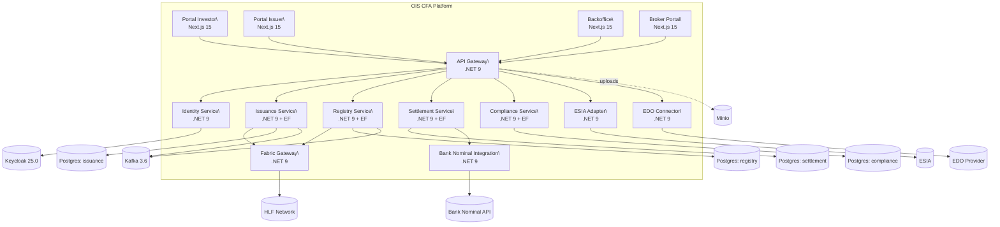
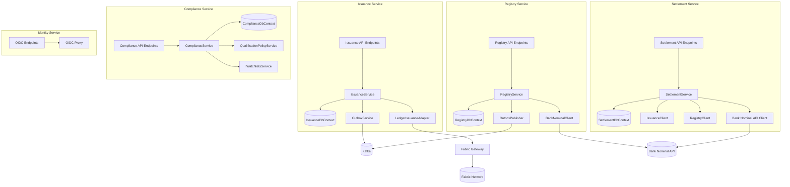
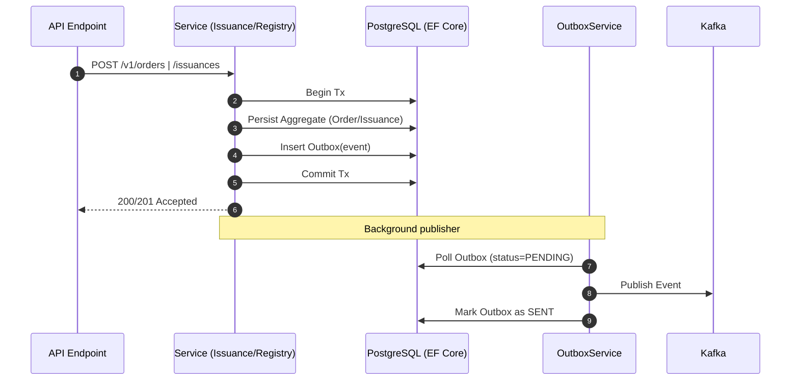

# OIS-CFA · C4 Diagrams (Combined)

## C1 — Context

```mermaid
%% OIS-CFA · C1 Context Diagram (Mermaid)
graph TB
  %% Actors
  Investor((Investor))
  Issuer((Issuer))
  Broker((Broker))
  Admin((Compliance/Admin))

  %% Boundary
  subgraph OIS[OIS CFA Platform]
    API[API Gateway (.NET)]
    ID[Identity Service]
    ISS[Issuance]
    REG[Registry]
    SET[Settlement]
    CMP[Compliance]
    FGW[Fabric Gateway]
  end

  %% UIs
  subgraph UIs[UIs]
    UI_INV[Portal Investor (Next.js)]
    UI_ISR[Portal Issuer (Next.js)]
    UI_BO[Backoffice (Next.js)]
    UI_BRK[Broker Portal (Next.js)]
  end

  %% External Systems
  KC[(Keycloak OIDC)]
  ESIA[(ESIA eID)]
  EDO[(EDO Provider)]
  BNK[(Bank Nominal API)]
  HLF[(Hyperledger Fabric Network)]
  PG[(PostgreSQL)]
  KAFKA[(Kafka)]
  MINIO[(Minio S3)]

  %% Flows
  Investor --> UI_INV --> API
  Issuer --> UI_ISR --> API
  Broker --> UI_BRK --> API
  Admin --> UI_BO --> API

  API --> ID
  API --> ISS
  API --> REG
  API --> SET
  API --> CMP

  ID --> KC
  API --> ESIA
  API --> EDO

  ISS --> FGW --> HLF
  REG --> FGW

  ISS --> KAFKA
  REG --> KAFKA

  ISS --> PG
  REG --> PG
  SET --> PG
  CMP --> PG

  SET --> BNK
  API -. optional .-> MINIO
```

## C2 — Containers



## C3 — Components



## C4 — Code View (Outbox)



