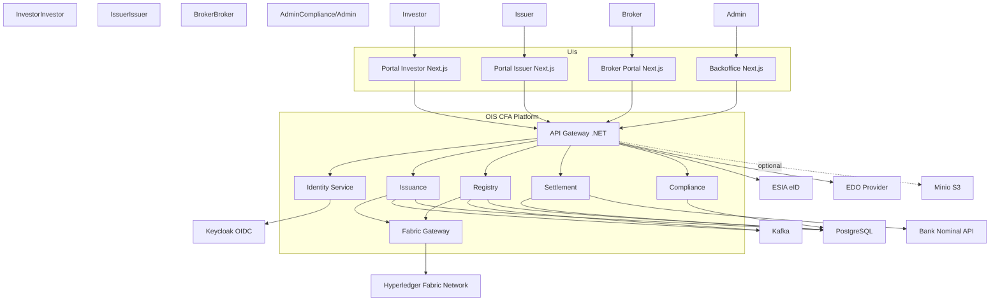

# C1 — Context

```mermaid
%% OIS-CFA · C1 Context Diagram Mermaid
graph TB
  %% Actors
  InvestorInvestor
  IssuerIssuer
  BrokerBroker
  AdminCompliance/Admin

  %% Boundary
  subgraph OIS[OIS CFA Platform]
    API[API Gateway .NET]
    ID[Identity Service]
    ISS[Issuance]
    REG[Registry]
    SET[Settlement]
    CMP[Compliance]
    FGW[Fabric Gateway]
  end

  %% UIs
  subgraph UIs[UIs]
    UI_INV[Portal Investor Next.js]
    UI_ISR[Portal Issuer Next.js]
    UI_BO[Backoffice Next.js]
    UI_BRK[Broker Portal Next.js]
  end

  %% External Systems
  KC[Keycloak OIDC]
  ESIA[ESIA eID]
  EDO[EDO Provider]
  BNK[Bank Nominal API]
  HLF[Hyperledger Fabric Network]
  PG[PostgreSQL]
  KAFKA[Kafka]
  MINIO[Minio S3]

  %% Flows
  Investor --> UI_INV --> API
  Issuer --> UI_ISR --> API
  Broker --> UI_BRK --> API
  Admin --> UI_BO --> API

  API --> ID
  API --> ISS
  API --> REG
  API --> SET
  API --> CMP

  ID --> KC
  API --> ESIA
  API --> EDO

  ISS --> FGW --> HLF
  REG --> FGW

  ISS --> KAFKA
  REG --> KAFKA

  ISS --> PG
  REG --> PG
  SET --> PG
  CMP --> PG

  SET --> BNK
  API -. optional .-> MINIO
```
