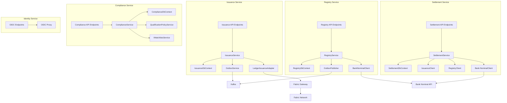

# C3 — Components

```mermaid
%% OIS-CFA · C3 Component Diagram Mermaid
graph TB
  subgraph ISS[Issuance Service]
    ISS_API[Issuance API Endpoints]
    ISS_SVC[IssuanceService]
    ISS_DB[IssuanceDbContext]
    ISS_OUTBOX[OutboxService]
    ISS_LEDGER[LedgerIssuanceAdapter]
  end

  subgraph REG[Registry Service]
    REG_API[Registry API Endpoints]
    REG_SVC[RegistryService]
    REG_DB[RegistryDbContext]
    REG_OUTBOX[OutboxPublisher]
    REG_BANK[BankNominalClient]
  end

  subgraph SET[Settlement Service]
    SET_API[Settlement API Endpoints]
    SET_SVC[SettlementService]
    SET_DB[SettlementDbContext]
    SET_ISS[IssuanceClient]
    SET_REG[RegistryClient]
    SET_BANK[Bank NominalClient]
  end

  subgraph CMP[Compliance Service]
    CMP_API[Compliance API Endpoints]
    CMP_SVC[ComplianceService]
    CMP_DB[ComplianceDbContext]
    CMP_QP[QualificationPolicyService]
    CMP_WL[IWatchlistsService]
  end

  subgraph ID[Identity Service]
    ID_OIDC[OIDC Endpoints]
    ID_PROXY[OIDC Proxy]
  end

  KAFKA[Kafka]
  FGW[Fabric Gateway]
  HLF[Fabric Network]
  BNK[Bank Nominal API]

  ISS_API --> ISS_SVC --> ISS_DB
  ISS_SVC --> ISS_OUTBOX --> KAFKA
  ISS_SVC --> ISS_LEDGER --> FGW --> HLF

  REG_API --> REG_SVC --> REG_DB
  REG_SVC --> REG_OUTBOX --> KAFKA
  REG_SVC --> REG_BANK --> BNK

  SET_API --> SET_SVC --> SET_DB
  SET_SVC --> SET_BANK --> BNK
  SET_SVC --> SET_ISS
  SET_SVC --> SET_REG

  CMP_API --> CMP_SVC --> CMP_DB
  CMP_SVC --> CMP_QP
  CMP_SVC --> CMP_WL

  ID_OIDC --> ID_PROXY
```
