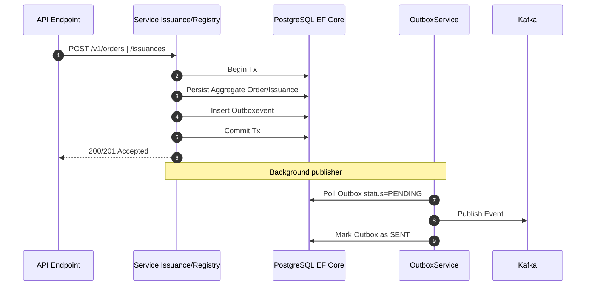

# C4 — Code View Outbox

```mermaid
%% OIS-CFA · C4 Code View Outbox Pattern Mermaid
sequenceDiagram
  autonumber
  participant API as API Endpoint
  participant SVC as Service Issuance/Registry
  participant DB as PostgreSQL EF Core
  participant OB as OutboxService
  participant BUS as Kafka

  API->>SVC: POST /v1/orders | /issuances
  SVC->>DB: Begin Tx
  SVC->>DB: Persist Aggregate Order/Issuance
  SVC->>DB: Insert Outboxevent
  SVC->>DB: Commit Tx
  SVC-->>API: 200/201 Accepted
  Note over SVC,OB: Background publisher
  OB->>DB: Poll Outbox status=PENDING
  OB->>BUS: Publish Event
  OB->>DB: Mark Outbox as SENT
```
