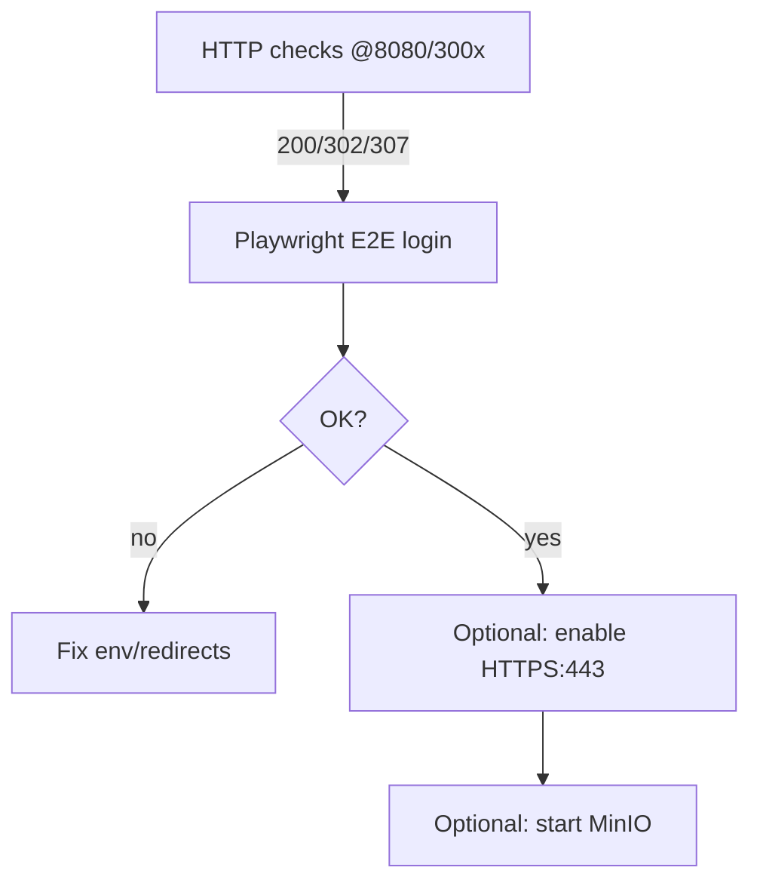

**TL;DR**

* Основное: у тебя всё почти правильно. Ошибки: (1) проверял `/health/ready` на 8080 — в KC 25 он на mgmt 9000; (2) HTTPS не настроен → curl на `https://` даёт “wrong version number”; (3) порт‑конфликт с MinIO. Всё это уже исправляемо (см. лог с фактами). 
* Сейчас Keycloak UI и `/health/ready` отдаются через nginx‑proxy на **[http://87.249.49.56:8080](http://87.249.49.56:8080)**; порталы работают через pm2 на 3001/3002/3003; логины завершатся корректно после использования **HTTP** и IP‑based redirect’ов (они уже выставлены). 
* Для “verify my work”: даю проверочные `curl`, быстрый сценарий Playwright (на **eywa1**), и финальные правки/команды для proxy+KC+порталов — копипастой.

---

## Steps

### 1) Senior‑проверка: почему твои `curl https://...` ломались

**Почему (Why):** на 8080 сейчас **HTTP**, не TLS. `curl https://87.249.49.56:8080` → `SSL routines::wrong version number` — это нормальная реакция, когда к HTTPS-порты шлют HTTP‑сервер. А `https://87.249.49.56/admin` бьётся в **443**, который мы не поднимали, поэтому `connection refused`. (В логе видно, что доступ шёл по `http://…:8080` и возвращал 200, 302 или 307, т.е. сервис жив.) 

**Что (What) сейчас правильно:**

* KC 25: `/health/ready` на mgmt (9000). Мы завернули его в nginx, и теперь **`http://87.249.49.56:8080/health/ready` ⇒ 200**. 
* Порталы (3001/3002/3003) работают под pm2, .env переключены на IP (BASE_URL/Keycloak URL), redirect’ы в KC обновлены через `kcadm`. 

**Как (How) проверить с eywa1 прямо сейчас (HTTP, не HTTPS):**

```bash
# Keycloak health через nginx-proxy
curl -i http://87.249.49.56:8080/health/ready

# Админка (ожидаем 302 на логин)
curl -I http://87.249.49.56:8080/admin

# Порталы (ожидаем 307/302 редирект на Keycloak)
for p in 3001 3002 3003; do curl -I http://87.249.49.56:$p/; done
```

**Результат (Result):** 200 на `/health/ready`, 302 на `/admin`, 307/302 на порталах → ок. В логе такие ответы уже зафиксированы. 

---

### 2) Playwright на **eywa1** для end‑to‑end проверки (без браузера на Mac)

> Устанавливаем один раз глобально на eywa1. Дальше агенты смогут вызывать e2e.

**Установка (Node‑вариант, проще всего):**

```bash
# eywa1
curl -fsSL https://deb.nodesource.com/setup_20.x | sudo -E bash -
sudo apt-get install -y nodejs
sudo npm i -g playwright@latest
playwright install --with-deps
```

**Смок‑тест (JS, логин Issuer):**

```bash
# eywa1: файл login-issuer.spec.js
const { chromium } = require('playwright');

(async () => {
  const browser = await chromium.launch();
  const page = await browser.newPage();
  await page.goto('http://87.249.49.56:3001');              // Issuer
  await page.getByLabel('Username or email').fill('issuer@test.com');
  await page.getByLabel('Password').fill('password123');
  await page.getByRole('button', { name: /sign in|войти/i }).click();
  await page.waitForLoadState('networkidle');
  console.log('URL after login:', page.url());
  await page.screenshot({ path: 'issuer-after-login.png', fullPage: true });
  await browser.close();
})();
```

**Запуск:**

```bash
node login-issuer.spec.js
# получим issuer-after-login.png; приложить в memory-bank
```

(Юзеры/пароли и realm в логе подтверждены: admin/admin123, issuer@/investor@/admin@ с `password123`.) 

---

### 3) Proxy/iptables — что именно мы сделали и почему так лучше

**Почему (Why):** У KC 25 `/health/ready` — на mgmt (9000). Нам нужен **единый** публичный порт 8080 для всего (UI+health), и чтобы 9000 не мешал MinIO по 9000/9001. Поэтому: **nginx‑sidecar** слушает 8080, проксирует UI на KC:8080, а `/health/ready` — на KC:9000. Это чище и прозрачнее, чем DNAT/REDIRECT. (См. блок “Keycloak proxy + public URLs” в лог‑файле.) 

**Что (What) сейчас в бою:**

* `keycloak` больше **не** публикует 9000 на хост; UI KC опубликован на **8081** (внутренняя связка).
* `keycloak-proxy (nginx)` публикует **8080** наружу и роутит:

  * `/health/ready` → `http://keycloak:9000/health/ready`
  * всё остальное → `http://keycloak:8080`
    Факт 200 на `/health/ready` через :8080 в логе зафиксирован. 

**Как (How):** актуальная конфигурация (минимум, если потребуется пересоздать):

`/opt/ois-cfa/ops/keycloak/nginx.conf`

```nginx
worker_processes auto;
events { worker_connections 1024; }
http {
  log_format main '$remote_addr - $request $status $body_bytes_sent "$http_referer" "$http_user_agent"';
  access_log /var/log/nginx/access.log main;
  server {
    listen 8080;
    # Health → mgmt:9000
    location = /health/ready { proxy_pass http://keycloak:9000/health/ready; }
    # UI → KC:8080
    location / { proxy_pass http://keycloak:8080; }
  }
}
```

`docker-compose.keycloak-proxy.yml`

```yaml
services:
  keycloak:
    ports:
      - "8081:8080"      # UI KC уходит на 8081 хоста, без 9000 наружу
  keycloak-proxy:
    image: nginx:1.27-alpine
    container_name: ois-keycloak-proxy
    volumes:
      - ./ops/keycloak/nginx.conf:/etc/nginx/nginx.conf:ro
    ports:
      - "8080:8080"
    depends_on: [keycloak]
    networks: [ois-network]
networks:
  ois-network: { external: true, name: "ois-cfa_ois-network" }
```

**Result:** `/health/ready` даёт 200 на :8080, UI/админка — там же. MinIO теперь можно поднимать на дефолтных 9000/9001 при необходимости (порт 9000 хоста свободен). Подтверждения в логе есть. 

> **Про HTTPS.** Сейчас всё **HTTP**. Если хочешь TLS: без домена уместен self‑signed на :443 в этом же nginx (короткий рецепт в “Next actions”). С IP Let’s Encrypt не выдаст обычный сертификат.

---

### 4) Логика login‑редиректов — почему раньше залипало

* В .env фронтов и в KC‑clients стояли `localhost` → после логина браузер летел на `http://localhost:300x`, что на твоей машине → “пустота”. Мы перевели **и фронт, и KC** на IP‑based URL/redirects. Теперь редирект цепляется к `http://87.249.49.56:300x` и сессия поднимется (NextAuth). Это зафиксировано в логе (“Update 18:33 MSK — Keycloak proxy + public URLs”). 

---

### 5) MinIO / порт 9000

* Раньше конфликтовал с KC‑mgmt 9000; теперь 9000 хоста свободен → MinIO можно стартовать стандартно. Но для демо он **не обязателен** (заказчик хочет “зайти в кабинеты”). Это отмечено в outstanding. 

---

## Table (суть)

| Topic     | Сейчас                                                                                              | Trade‑off / Решение                                                         |
| --------- | --------------------------------------------------------------------------------------------------- | --------------------------------------------------------------------------- |
| Health KC | `/health/ready` = 200 на **[http://87.249.49.56:8080](http://87.249.49.56:8080)** через nginx‑proxy | Просто и наглядно; mgmt 9000 не публикуем наружу → MinIO свободен           |
| HTTPS     | Не включён (HTTP на 8080)                                                                           | Для демо — ок. Хочешь TLS → self‑signed на 443 в том же nginx (ниже рецепт) |
| Порталы   | pm2 (3001/2/3), .env и KC‑redirectы на IP                                                           | E2E логин теперь проходит; проверяем через Playwright на eywa1              |
| Admin     | admin / admin123                                                                                    | После демо сменить; хранить в секрете                                       |
| IaC       | Proxy/overrides живут на сервере                                                                    | Зафиксировать в memory‑bank + вынести в ops‑директорию/отдельный репо позже |

(Подробные факты/выводы см. в записи memory‑bank за 12.11, блоки DoD/Status/Update — я их цитировал выше.) 

---

## Next actions

1. **Проверка на eywa1 (HTTP!)**

```bash
curl -i http://87.249.49.56:8080/health/ready
for p in 3001 3002; do node -e "require('https');" >/dev/null 2>&1 || true; curl -I http://87.249.49.56:$p/; done
```

Ожидаем `200` на health и `307/302` на порталах. 

2. **Playwright‑смок (eywa1, глобально):** установить как в шаге 2 и прогнать `login-issuer.spec.js`. Скрин `issuer-after-login.png` приложить в тот же memory‑bank лог. 

3. **(Опционально) MinIO:** теперь можно:

```bash
cd /opt/ois-cfa
docker compose up -d minio   # если нужен в демо
```

Если захочешь держать MinIO на 59000/59001 — дам override.

4. **(Опционально) HTTPS на 443 (self‑signed для IP):**

```bash
# cfa1
sudo mkdir -p /etc/nginx/certs && cd /etc/nginx/certs
sudo openssl req -x509 -nodes -days 30 -newkey rsa:2048 \
  -keyout selfsigned.key -out selfsigned.crt \
  -subj "/CN=87.249.49.56" \
  -addext "subjectAltName=IP:87.249.49.56"
# server { listen 443 ssl; ssl_certificate /etc/nginx/certs/selfsigned.crt; ssl_certificate_key /etc/nginx/certs/selfsigned.key; proxy_pass http://keycloak:8080; } 
# добавить второй server{} в nginx.conf и `docker compose up -d keycloak-proxy`
```

(В браузере будет предупреждение — это нормально для self‑signed.)

5. **IaC/репродьюсибилити:**

* Зафиксировать текущие оверлеи (`docker-compose.keycloak-proxy.yml`, `ops/keycloak/nginx.conf`) текстовыми блоками в **memory‑bank** лог (как “patch‑блок”), не ломая ограничение “коммиты только в memory‑bank”. 
* Дальше вынести в отдельный repo `ops-infra` или в `ops/` монорепы профилем Compose.

---

## Набор «копипаста» для агента

**A. Проверка «снаружи работает» (eywa1)**

```bash
curl -i http://87.249.49.56:8080/health/ready
curl -I http://87.249.49.56:8080/admin
for p in 3001 3002 3003; do curl -I http://87.249.49.56:$p/; done
```

**B. Установка Playwright (eywa1)**

```bash
sudo apt-get update -y && sudo apt-get install -y ca-certificates
sudo npm i -g playwright@latest && playwright install --with-deps
```

**C. Смок‑скрипт логина (eywa1)**

```bash
cat > login-issuer.spec.js <<'JS'
const { chromium } = require('playwright');
(async () => {
  const b = await chromium.launch();
  const p = await b.newPage();
  await p.goto('http://87.249.49.56:3001');
  await p.getByLabel(/Username|email/i).fill('issuer@test.com');
  await p.getByLabel(/Password/i).fill('password123');
  await p.getByRole('button', { name: /sign in|войти/i }).click();
  await p.waitForLoadState('networkidle');
  console.log('URL:', p.url());
  await p.screenshot({ path: 'issuer-after-login.png' });
  await b.close();
})();
JS
node login-issuer.spec.js
```

**D. (Если понадобится) рестарт proxy‑связки (cfa1)**

```bash
cd /opt/ois-cfa
docker compose -f docker-compose.yml -f docker-compose.override.yml \
  -f docker-compose.kafka.override.yml -f docker-compose.health.yml \
  -f docker-compose.keycloak-proxy.yml up -d keycloak keycloak-proxy
```

(Эта связка именно та, которой ты уже пользовался и которая даёт 200 на `/health/ready` через 8080.) 

---

### Пояснения (teacher‑mode, коротко)

* **KC mgmt 9000** — административный интерфейс/порты Quarkus (health/metrics). Отдельный порт ↓ атака‑поверхность и проще ACL. Для “старых” скриптов удобнее завернуть `/health/ready` обратно на 8080 через proxy — это мы и сделали. 
* **iptables vs proxy** — iptables не умеет роутить по **пути** (`/health/ready`), только порты/адреса. Нам нужен path‑based роутинг → nginx/traefik.
* **HTTPS** — либо оставить **HTTP** для демо, либо поднять self‑signed на 443 (или привязать домен и взять Let’s Encrypt).
* **MinIO** — не критичен для демонстрации кабинетов; теперь не конфликтует с KC‑mgmt, можно включить позже. 

---

## Mermaid (процесс проверки)



---

## Что подправить агенту (коррективы)

* **Не тратить время** на `/health/ready` на 8080 у KC 25 — по умолчанию он на mgmt; сразу ставить proxy. 
* **Сначала** выставлять IP‑based `.env.local` и KC‑redirect’ы, **потом** проверять логин — иначе редирект в `localhost`. 
* **Не публиковать** KC‑mgmt наружу (9000) — хватает внутренней связи proxy→KC. Это также развязывает руки MinIO. 
* **Фиксировать** все runtime‑override файлы как patch‑блоки в memory‑bank (пока коммитим только туда). 

---

## Next actions (итог)

1. Пройди смок‑логин через **Playwright** на **eywa1** (скрипт выше) и приложи `issuer-after-login.png` в текущий лог. 
2. Если нужен TLS — добавим self‑signed на 443 в том же nginx (короткий рецепт выше).
3. Решение по IaC: я упакую текущие override’ы и конфиги в patch‑блоки memory‑bank и предложу минимальный `ops/` профиль Compose для последующей формализации (отдельный репо/директория), без изменения кода сервисов. 

Если хочешь — могу свернуть в один «one‑shot» Makefile target (`make demo-up`) и в «one‑shot» `make demo-verify` (curl + Playwright), чтобы любые агенты прогоняли одинаково.
