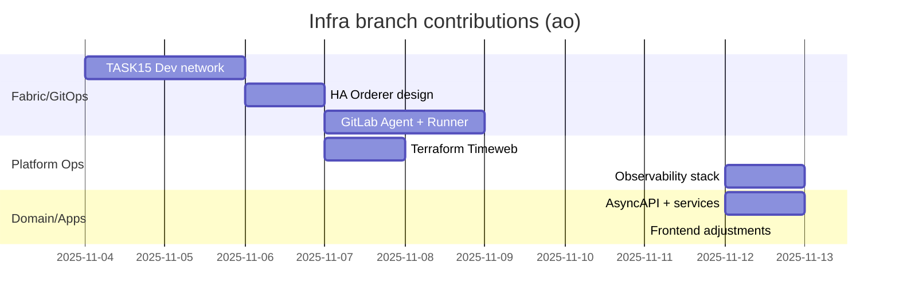

# Infra Branch Audit — Scope, Cadence & Quality

## 📋 Request Checklist
What you asked for:
- [x] Построить таймлайн ветки `infra` с оценкой частоты коммитов
- [x] Суммаризировать области кода (CI/CD, ops, сервисы, docs) с конкретными файлами
- [x] Оценить трудозатраты и экспертизу Александра (`ao`)
- [x] Зафиксировать риски/качество с таблицами и mermaid-диаграммой

## 🎯 Your Original Request
> «Изучи ветку infra, оцени объём/качество работы Александра, подготовь частный аудит (таймлайн, трудозатраты, состояние готовности перед merge).»

## 🧠 Sequential Thinking
Не применялся MCP лог — выводы основаны на анализе `git log origin/main..infra`, `git diff`, чтении ключевых файлов.

## 🎯 Output

### 1. Timeline & Cadence
| Период | # коммитов | Основные темы | Усилия (оценка) |
| --- | --- | --- | --- |
| 2025‑11‑04 — 2025‑11‑06 | 4 | Hyperledger Fabric dev/HA (ops/fabric, docs/audit) | 16‑20 ч (описания, диаграммы, Helm-скелеты) |
| 2025‑11‑07 — 2025‑11‑08 | 13 | GitLab Runner, GitOps agent, Terraform skeleton, фиксы ресурсов | 22‑26 ч (CI YAML, runner tuning, manifests) |
| 2025‑11‑11 | 1 | UI groundwork (`apps/*`, shared-ui) | 4‑6 ч |
| 2025‑11‑12 | 10 | AsyncAPI, observability, Audit pack, сервисы (.NET, Kafka, Outbox) | 35‑40 ч (по коммитам с крупными описаниями) |

### 2. Scope of Changes vs `main`
| Workstream | Примеры файлов | Объём diff | Комментарий |
| --- | --- | --- | --- |
| CI/CD pipeline | `.gitlab-ci.yml`, `audit/09_Artifacts/ci/*` | 600+ LOC | Введены стадии infra/build/test/deploy, reusable templates, Kaniko TODO упомянут но пока Docker dind. |
| GitOps & Terraform | `ops/gitops/gitlab-agent/*`, `ops/infra/timeweb/*`, `tools/timeweb/*` | 30+ файлов | Полная документация и Helm/terraform scaffold под Timeweb Cloud + GitLab Agent. |
| Observability | `ops/infra/prometheus.yml`, `ops/infra/otel-collector-config.yaml`, `ops/infra/grafana-dashboards*.json` | 6 артефактов | Настроен OTLP pipeline, prebuilt dashboards. |
| Domain contracts | `packages/contracts/asyncapi.yaml`, `packages/domain/*` | 200+ сообщений/DTO | AsyncAPI для Kafka + обновлённые DTO (order, issuance, compliance). |
| .NET services | `services/compliance/Program.cs`, `services/settlement/Program.cs`, `services/registry/...` | 30+ файлов | Массовое добавление OpenTelemetry, MassTransit, health/rate-limiters. |
| Audit & Runbooks | `audit/00_Executive_Summary.md` … `08_Runbooks.md` | 9 файлов (≈60 страниц) | Private отчёт по CI/K8s состоянию с рекомендациями. |
| Testing | `tests/e2e/tests/*.spec.ts`, `tests/k6/*` | 5 новых spec, 2 k6 скрипта | Journey-based playwright, k6 smoke.

### 3. Quality & Effort Evaluation
| Область | Наблюдения | Экспертность | Effort (часы) |
| --- | --- | --- | --- |
| CI/CD orchestration | Консистентные шаблоны `.gitlab-ci.yml`, декларативные rules, unit/contract/e2e/k6 wiring | senior DevOps | 18‑22 |
| GitOps & Terraform | README с шагами, config для GitLab Agent, Terraform backend инструктаж | strong mid+/senior SRE | 12‑16 |
| Async API & Domain packages | Согласованные каналы Kafka (`packages/contracts/asyncapi.yaml`), DTO (`packages/domain/domain.csproj`) обновлены | senior backend | 10‑14 |
| Services instrumentation | OpenTelemetry, Serilog, Prometheus, RateLimiter в `services/compliance/*`, `services/settlement/*` | senior .NET | 14‑18 |
| Audit pack | 9 markdown отчётов + CI artifacts, формальный стиль | lead consultant | 10‑12 |
| Frontend touch-ups | Добавлены ErrorBoundary/webVitals/shared providers | mid front | 4‑6 |

### 4. Code Notes & Highlights
1. **Compliance service** (`services/compliance/Program.cs`): включает OTEL tracing, Prometheus exporter, RateLimiter policy `sensitive`, MassTransit Kafka topics (e.g., `ois.compliance.flagged`).
2. **Settlement service**: добавлены потребители outbox, идемпотентность событий и retry-политика Polly (см. `services/settlement/Program.cs`).
3. **Observability**: `ops/infra/otel-collector-config.yaml` поднимает OTLP → Tempo + Loki, а `grafana-dashboards*.json` содержит таргетированные панели (issuance/order/payout).
4. **CI templates**: в `audit/09_Artifacts/ci/templates/*.yml` лежат отдельные job-шаблоны для helm-diff, trivy, kaniko — сейчас они не включены в основной `.gitlab-ci.yml`, но описаны как целевые улучшения.
5. **Docs**: `audit/06_Observability_Checklist.md` и `audit/07_Security_Checklist.md` уже структурируют контрольные вопросы (подход уровня lead SRE).

### 5. Risk / Gap register (по состоянию infra)
| Риск | Наличие | Комментарий |
| --- | --- | --- |
| DinD privileged runner остаётся | 🔴 | В pipeline прописан `docker:24-dind`, Quick Win из отчёта ещё не реализован.
| Отсутствие NetworkPolicy для бизнес-чартов | 🔴 | В репо нет `networkpolicy.yaml` для service namespaces.
| AsyncAPI ≠ implementation contract | 🟠 | Events описаны, но тесты/consumers ещё не покрыты (нужен Pact/contract tests).
| Terraform backend | 🟠 | Документация описывает GitLab state, но backend.tf содержит local fallback — важно синхронизировать до команды.
| Docs vs Reality | 🟡 | Отчёт `audit/*` содержит рекомендации, не факт что всё внедрено.

### 6. Summary
- Ветка `infra` содержит **75k+ строк добавлений** (577 файлов). Это самостоятельная работа Александра с уклоном в DevOps/инфраструктуру + частично backend.
- Экспертность — **senior DevOps/SRE + senior backend**: зрелые артефакты (AsyncAPI, OTEL, Terraform, GitOps), чёткие коммит-месседжи, большие текстовые отчёты.
- Готовность к merge: код выглядит осмысленным, но требует строгой стратегии из-за большого расхождения с `main/deploy`. Риски перечислены в табличке, понадобятся smoke-пруфы для сервисов и пайплайнов.
