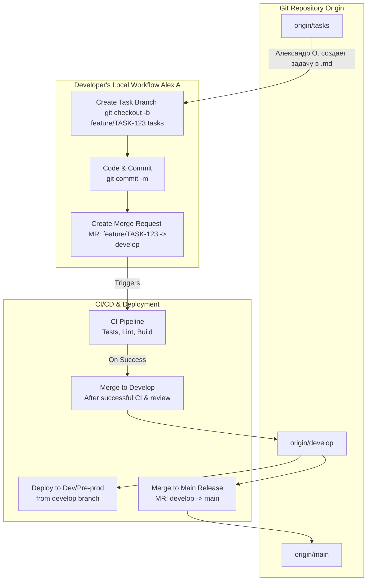

### 4. Анализ и Визуализация Git Workflow от Александра О.

Предложение Александра — это хороший, классический подход, вариация на тему **GitFlow**. Он вводит четкое разделение на ветки для задач, разработки и продакшена, что абсолютно правильно для командной работы.

#### Визуализация процесса (Mermaid.js)

#### Процесс по шагам (Markdown Checklist)

**Этап 1: Постановка задачи**
- [ ] **Александр О.:** Создает новую задачу в виде `.md` файла в ветке `tasks`. В файле содержится полное описание, контекст и DoD.
- [ ] **Александр О.:** Может указать, какую ветку нужно подлить (`git pull`) для начала работы.

**Этап 2: Разработка (Твоя зона ответственности)**
- [ ] **Ты:** Создаешь новую ветку для задачи от ветки `tasks` (или `develop`, см. рекомендации). Например: `feature/OIS-123-kyc-form`.
- [ ] **Ты:** Реализуешь функционал, пишешь инкрементальные коммиты.
- [ ] **Ты:** Покрываешь новый код тестами.
- [ ] **Ты:** Убеждаешься, что ничего не сломано локально (`dotnet test`, `npm test`).
- [ ] **Ты:** Создаешь Merge Request (MR) из своей ветки `feature/OIS-123-kyc-form` в ветку `develop`.

**Этап 3: Ревью и Слияние**
- [ ] **CI/CD:** Автоматически запускаются тесты, сборка и линтеры в рамках MR.
- [ ] **Ревьюер (Александр О. / др.):** Проводит код-ревью.
- [ ] **Мейнтейнер:** После успешного CI и аппрува вливает MR в `develop`.

**Этап 4: Деплой и Релиз**
- [ ] **CI/CD:** Ветка `develop` автоматически деплоится на Dev-контур (pre-prod).
- [ ] **Релиз-менеджер:** По готовности к релизу создает MR из `develop` в `main` и вливает его.

#### Рекомендации и Уточнения (Критика)

Это отличная база, но ее можно улучшить, чтобы избежать проблем в будущем.

1.  **Источник для feature-веток:** Вместо того чтобы ветвиться от `tasks`, лучше всегда ветвиться от `develop`. Ветка `tasks` — это просто хранилище `.md` файлов, а не кодовая база.
    *   **Правильный флоу:** `git checkout develop` → `git pull` → `git checkout -b feature/TASK-123`.
2.  **Синхронизация с `develop`:** Длительные задачи в `feature`-ветках могут отстать от `develop`. Нужно регулярно делать `git rebase develop` в своей ветке, чтобы избежать "merge hell" в конце.
3.  **Ветка `tasks` — это антипаттерн:** Хранить задачи в Git — плохая идея. Это смешивает код и управление проектом.
    *   **Рекомендация:** Продолжать использовать YouGile или Jira как **единственный источник правды (SSOT)** для задач. В коммитах и MR просто ссылаться на ID задачи (например, `[02A-65] Implement KYC form`). Ветка `tasks` не нужна.
4.  **Hotfix-процесс:** В предложенной схеме нет процесса для срочных исправлений в `main` (production). Классический GitFlow предлагает для этого создавать ветки `hotfix/` от `main`, а после исправления вливать их и в `main`, и в `develop`. Это стоит обсудить.
5.  **Именование веток:** Предложить стандарт: `feature/TICKET-ID-short-description` (e.g., `feature/OIS-77-add-kyc-form`). Это улучшает читаемость.

В целом, ты можешь поддержать предложение Александра, но предложить эти улучшения как способ сделать процесс еще более надежным и стандартным.