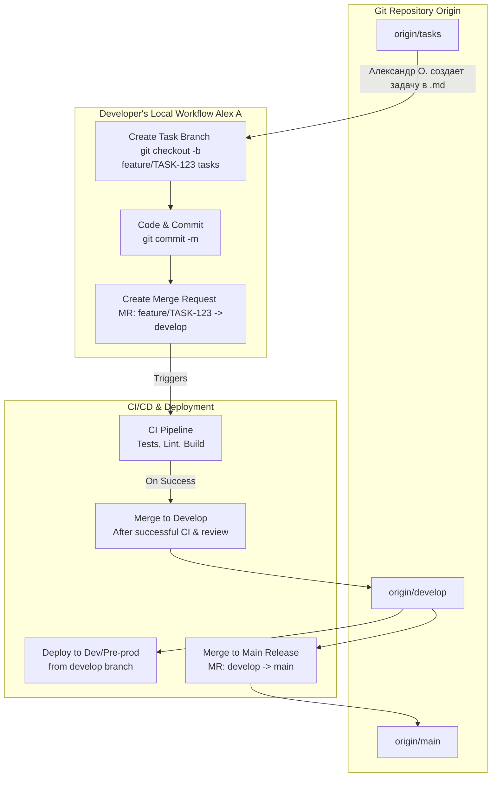

# Разбор Задач: SMTP, Отчетность и Новый Git Workflow

## Prompt 
````prompt
Комментарии по Решениям
1) ага
1.1. проверил, smtp работает 
1.2. - только непонял как smtp работает от keycloak? 
1.2.2. если да то обычно для этого почта нужна прокладка а я почту неуказывал или у keycloak просто встроенный сервер какой-то и мы ставили postfix и подключали и он дает smtp но если без почты это разве smtp тут пробелы понял мои надо подучить меня 
2) скинь ссылки сразу на runbook,playwrigh прямо под копипаст нужно финальное сообщение Юрию сделать и относительные пути будут и дам ему gitlab ссылку на ветку 
3) это тоже будет
4) ага

По next Actions: 
1) ну да описал выше сделай презентацию копипаст
2) в сообщении тоже будет учитываться тобой
3) вот он что написал - сделай mermaidjs схему процесса и я копипаст визуализации ему скину и может четче чем он "все одном" по пунктам чекбоксами маркдаун продублируй чтобы следовать чеклисту. Если есть критика или коррективы дай - в целом я не против

```
Александр Ожерельев Tech Lead MTC и Техдир ЦФА CFA.Capital, [15/11/2025 10:36]
@herewegohereiam в общем сделаем по классике ветку develop, туда будем сливать код по готовности,  ветка соответственно деплоится в Dev контур, это pre-prod. Я сделаю ветку tasks, туда буду заливать задачи описанные полностью с контекстом в виде md, для агентов разработки. Ты делаешь ветку под каждую задачу отдельно, покрываешь тестами, чекаешь, что ничего не сломано и уже сливаешь это в develop через mr

Александр Ожерельев Tech Lead MTC и Техдир ЦФА CFA.Capital, [15/11/2025 10:37]
Остальные подробности позже расскажу. В задачах может быть так же информация, какую ветку от меня надо подлить себе

Александр Ожерельев Tech Lead MTC и Техдир ЦФА CFA.Capital, [15/11/2025 10:38]
В общем gitflow какой то примерно есть
```

````

## 📋 Request Checklist
Вот развернутый ответ, который включает объяснение по SMTP, готовое сообщение для Юрия и полный разбор предложенного процесса разработки с диаграммой и рекомендациями.

What you asked for:
- [x] Объяснить, как работает SMTP-связка Keycloak и Postfix.
- [x] Подготовить копипаст-ссылки на артефакты (runbook, Playwright-тесты).
- [x] Составить финальное сообщение для Юрия.
- [x] Проанализировать, визуализировать и дать рекомендации по Git workflow от Александра О.

## 🎯 Your Original Request
> Ты просил меня объяснить технические детали по SMTP, подготовить материалы для отчета Юрию и детально разобрать предложенный Александром О. новый процесс работы с Git, включая критику и предложения по улучшению.

## Executive Summary (TL;DR)

*   **SMTP-ликбез:** Keycloak использует Postfix как локальный почтовый сервер (MTA) для отправки писем. Ему не нужна "почта-прокладка" (как Gmail), потому что Postfix сам является этой "прокладкой", отправляя письма напрямую в интернет.
*   **Материалы для Юрия:** Подготовлено краткое, но емкое сообщение для Юрия, включающее ссылки на ключевые артефакты в ветке `infra.defis.deploy`. Все готово для копипаста.
*   **Git Workflow:** Предложение Александра О. — это классический GitFlow, который является стандартом индустрии. Я визуализировал его в Mermaid-схеме, разложил по шагам и добавил несколько важных улучшений для надежности (hotfixes, rebase-политика, роль CI).

---

### 1. Как работает SMTP в нашем сетапе (Обучение)

Ты задал отличный вопрос про "почту-прокладку". Здесь есть фундаментальное различие между **протоколом отправки** и **почтовым ящиком**.

*   **SMTP (Simple Mail Transfer Protocol)** — это просто *протокол*, язык, на котором почтовые серверы общаются друг с другом для **отправки** и **пересылки** писем. Это как почтальон, который забирает письмо и несет его дальше.
*   **Почтовый ящик (Mailbox)** — это место для **хранения** писем (IMAP/POP3). Это как твой физический почтовый ящик дома.

**Аналогия:**
1.  **Keycloak** — это ты, написавший письмо. Тебе нужно его отправить.
2.  **Postfix на `uk1`** — это твое локальное почтовое отделение. Ты просто отдаешь ему письмо (Keycloak подключается к `172.18.0.1:25` и говорит: "Отправь вот это"). Postfix не хранит почту для внешнего мира, он только отправляет.
3.  **Интернет** — это глобальная почтовая система. Postfix (почтальон) выходит в интернет и ищет почтовое отделение получателя (например, `gmail.com` или `2200freefonts.com`).
4.  **Сервер `mail.tm` или `gmail.com`** — это почтовое отделение в городе получателя. Оно принимает письмо от нашего Postfix.
5.  **Временный ящик на `mail.tm`** — это конечный почтовый ящик, куда письмо падает.

**Вывод:** Нам не нужна "почта-прокладка" типа Gmail или Mailgun, потому что мы сами развернули свой собственный мини-почтовый сервер (Postfix), который умеет отправлять письма. DKIM и SPF, которые мы настроили, — это как "печать" и "официальный бланк" нашего почтового отделения, чтобы другие сервера нам доверяли.

### 2. Ссылки на артефакты для Юрия

Вот ссылки на ключевые артефакты в новой ветке `infra.defis.deploy`. Они ведут прямо на GitLab.

```markdown
- **Основной Runbook по развертыванию (Cloudflare, Nginx, SMTP):**
  https://git.telex.global/npk/ois-cfa/-/blob/infra.defis.deploy/docs/deploy/20251113-cloudflare-ingress.md

- **E2E-тесты (Playwright):**
  https://git.telex.global/npk/ois-cfa/-/tree/infra.defis.deploy/tests/e2e-playwright
```

### 3. Финальное сообщение для Юрия (копипаст-версия)

Юрий, привет!

Завершили очередной этап работ по стабилизации и развитию платформы. Ключевые результаты:

*   **Полностью рабочее демо на `uk1`:** Развернута вся экосистема с использованием публичных доменов и полноценного HTTPS. Все сервисы доступны по ссылкам:
    *   **Keycloak:** `https://auth.cfa.llmneighbors.com`
    *   **Портал Эмитента:** `https://issuer.cfa.llmneighbors.com`
    *   **Портал Инвестора:** `https://investor.cfa.llmneighbors.com`
    *   **Бэкофис:** `https://backoffice.cfa.llmneighbors.com`
    *   **API Gateway:** `https://api.cfa.llmneighbors.com`
*   **Работает полный цикл регистрации и входа:** Настроен почтовый сервер (SMTP/DKIM/SPF), и теперь работает саморегистрация с верификацией по email. Это было проверено автоматическими E2E-тестами.
*   **Создана база для дальнейшей разработки (IaC):** Все конфигурации (Nginx, Docker Compose, DNS) и тесты задокументированы и закоммичены в репозиторий. Это позволяет быстро и предсказуемо разворачивать окружение на любом другом сервере.

**Доказательства и артефакты:**
- **Runbook по развертыванию:** [docs/deploy/20251113-cloudflare-ingress.md](https://git.telex.global/npk/ois-cfa/-/blob/infra.defis.deploy/docs/deploy/20251113-cloudflare-ingress.md)
- **Автоматические тесты (Playwright):** [tests/e2e-playwright](https://git.telex.global/npk/ois-cfa/-/tree/infra.defis.deploy/tests/e2e-playwright)

Считаю, что текущие задачи по стабилизации демо выполнены. Предлагаю обсудить оплату за проделанную работу и спланировать следующие шаги по развитию функционала на базе созданного фундамента.

### 4. Анализ и Визуализация Git Workflow от Александра О.

Предложение Александра — это хороший, классический подход, вариация на тему **GitFlow**. Он вводит четкое разделение на ветки для задач, разработки и продакшена, что абсолютно правильно для командной работы.

#### Визуализация процесса (Mermaid.js)



#### Процесс по шагам (Markdown Checklist)

**Этап 1: Постановка задачи**
- [ ] **Александр О.:** Создает новую задачу в виде `.md` файла в ветке `tasks`. В файле содержится полное описание, контекст и DoD.
- [ ] **Александр О.:** Может указать, какую ветку нужно подлить (`git pull`) для начала работы.

**Этап 2: Разработка (Твоя зона ответственности)**
- [ ] **Ты:** Создаешь новую ветку для задачи от ветки `tasks` (или `develop`, см. рекомендации). Например: `feature/OIS-123-kyc-form`.
- [ ] **Ты:** Реализуешь функционал, пишешь инкрементальные коммиты.
- [ ] **Ты:** Покрываешь новый код тестами.
- [ ] **Ты:** Убеждаешься, что ничего не сломано локально (`dotnet test`, `npm test`).
- [ ] **Ты:** Создаешь Merge Request (MR) из своей ветки `feature/OIS-123-kyc-form` в ветку `develop`.

**Этап 3: Ревью и Слияние**
- [ ] **CI/CD:** Автоматически запускаются тесты, сборка и линтеры в рамках MR.
- [ ] **Ревьюер (Александр О. / др.):** Проводит код-ревью.
- [ ] **Мейнтейнер:** После успешного CI и аппрува вливает MR в `develop`.

**Этап 4: Деплой и Релиз**
- [ ] **CI/CD:** Ветка `develop` автоматически деплоится на Dev-контур (pre-prod).
- [ ] **Релиз-менеджер:** По готовности к релизу создает MR из `develop` в `main` и вливает его.

#### Рекомендации и Уточнения (Критика)

Это отличная база, но ее можно улучшить, чтобы избежать проблем в будущем.

1.  **Источник для feature-веток:** Вместо того чтобы ветвиться от `tasks`, лучше всегда ветвиться от `develop`. Ветка `tasks` — это просто хранилище `.md` файлов, а не кодовая база.
    *   **Правильный флоу:** `git checkout develop` → `git pull` → `git checkout -b feature/TASK-123`.
2.  **Синхронизация с `develop`:** Длительные задачи в `feature`-ветках могут отстать от `develop`. Нужно регулярно делать `git rebase develop` в своей ветке, чтобы избежать "merge hell" в конце.
3.  **Ветка `tasks` — это антипаттерн:** Хранить задачи в Git — плохая идея. Это смешивает код и управление проектом.
    *   **Рекомендация:** Продолжать использовать YouGile или Jira как **единственный источник правды (SSOT)** для задач. В коммитах и MR просто ссылаться на ID задачи (например, `[02A-65] Implement KYC form`). Ветка `tasks` не нужна.
4.  **Hotfix-процесс:** В предложенной схеме нет процесса для срочных исправлений в `main` (production). Классический GitFlow предлагает для этого создавать ветки `hotfix/` от `main`, а после исправления вливать их и в `main`, и в `develop`. Это стоит обсудить.
5.  **Именование веток:** Предложить стандарт: `feature/TICKET-ID-short-description` (e.g., `feature/OIS-77-add-kyc-form`). Это улучшает читаемость.

В целом, ты можешь поддержать предложение Александра, но предложить эти улучшения как способ сделать процесс еще более надежным и стандартным.