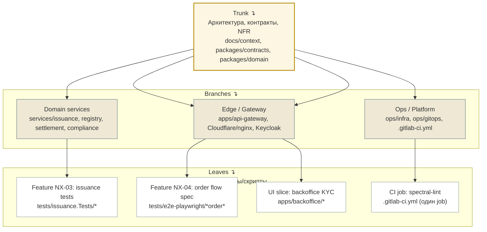
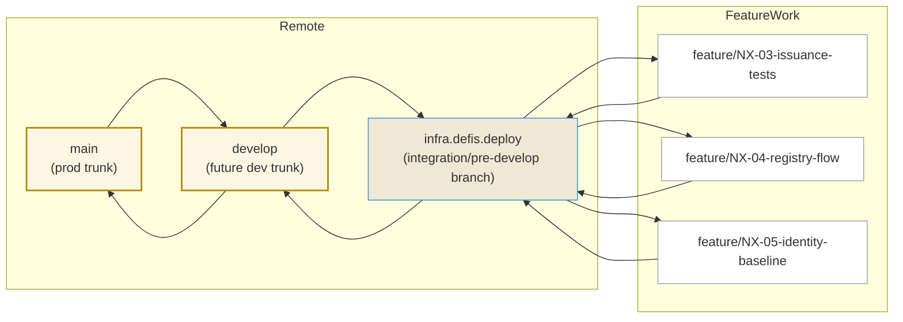

# Prompt 1
You are Oracle, a focused one-shot problem solver. Emphasize direct answers, cite any files referenced, and clearly note when the search tool was used.  You are GPT‑5 Pro acting as the final "Oracle" reviewer for the `ois-cfa` codebase and its infra branch.  I have attached: - `c2p_ois-cfa.txt`: ~4MB code2prompt snapshot of the `ois-cfa` repo on branch `infra.defis.deploy` (structure + key files); - `20251116-1603-gpt5pro-audit-feedback-review.gpt5p.md`: your earlier deep V1‑audit of this repo (architecture + recommendations); - `20251117-1747-gpt5pro-next-steps-after-audit-feedback.gpt5p.md`: first follow-up "next steps" report based on V1‑audit; - `20251117-1748-gpt5pro-next-steps-after-audit-feedback.gpt5p.md`: second follow-up "next steps" report (another angle on priorities); - `20251117-1537-eywa1-co-3dd7.session.md`: detailed infra/devops log from AVA1/eywa1 (CFA1→UK1, Cloudflare, Postfix, Playwright, etc.); - `20251117-1713-feedback-to-co-3c63-from-eywa1-co-3dd7.md`: explicit feedback about what V1‑audit did not know and what changed after UK1 was brought up; - `20251114-agreements-gitflow-AlexA-and-AleksandrO.md`: agreements between Alex A. and Aleksandr O. about gitflow and branches (develop, tasks, infra.defis.deploy, etc.); - `20251117-1518-conversation-AlexA-AleksandrO.md`: conversation about NX-tasks and expectations for how to drive work from `tasks/` and `docs/context/`; - two architecture context files about Trees/Leaves/Agents ("vibe coding" doc and its transcript) — how we want to organize future AI-agent work.  High-level reality: - Repo `ois-cfa` on branch `infra.defis.deploy` now combines:   - Aleksandr's `infra` work (GitOps, observability, audit, AsyncAPI/contracts);   - Alex's `deploy`/UK1 work (docker-compose, Nginx, Cloudflare, Keycloak/SMTP, Playwright smoke, real working demo on UK1). - There are multiple GPT‑5 Pro reports already:   - V1‑audit (big architecture review);   - follow-up "next steps" drafts (1747/1748);   - plus live context from eywa1 sessions and agreements on gitflow. - The `tasks/` folder in `ois-cfa` (NX-01..NX-08) and `docs/context/*` are meant to be the driving interface for future work, including AI agents (Claude/Codex/GPT‑5).  Your job now is to produce a **single, coherent MASTER REPORT (V3)** that other agents (e.g. Codex CLI) can use as a zero-shot starting point.  What I need from you:  1) Consolidated picture from all GPT‑5 reports + logs    - Read your own V1‑audit, the two "next steps" reports, and the eywa1/feedback logs.    - In Russian (with B2-level English terms), summarise in 5–8 bullets the **consensus** across all these documents:      - how you see the architecture and infra (infra.defis.deploy + UK1);      - what are the key strengths/assets already in place;      - what are the main risks/gaps that remain.    - Explicitly call out any major contradictions between the reports and resolve them (which view you consider canonical now, and why).  2) Canonical "Current State" snapshot (for docs)    - Produce a section that can be almost copy-pasted into `docs/context/PROJECT-CONTEXT.md` as "Текущее состояние (infra.defis.deploy + UK1)".    - Structure: 6–10 bullets covering:      - domains/services (identity/issuance/registry/settlement/compliance);      - frontends (apps/*) + gateway;      - packages (contracts/sdks/dotnet-clients) and how they relate to services;      - infra/ops (ops/, audit/, docker-compose, observability) and the UK1 environment (DNS/Cloudflare, Nginx, SMTP, Playwright smoke);      - gitflow and main branches (main, develop, tasks, infra.defis.deploy) per the 20251114 agreements.  3) Unified 2–3 week roadmap (driven by `tasks/` and `docs/context/`)    - Using everything you know (NX-01..NX-08, docs/context/*, infra/UK1 status), design a **single 2–3 week roadmap** for ~40–60h of Alex's time + some AI-agent help.    - Output as a table with columns:      - `Task ID` (you can refer to NX-01..NX-08 or define sub-tasks like NX-03.a, NX-07.b, etc.);      - `Area` (frontend/backend/contracts/tests/ops/docs);      - `Goal` (1–2 lines);      - `Prereqs` (docs/specs/tests to read or update first);      - `Done-when` (4–6 bullet DoD);      - `Agent-friendly?` (yes/no/partial + 1-line why).    - The roadmap should be realistic and executable, not abstract. Assume UK1 is already up and running.  4) Structural refactor & hygiene plan (1–2 day budget)    - Based on all your audits + the gitflow agreements, propose a **minimal structural refactor plan** for `ois-cfa` root and key folders:      - ARCHIVE/audit/docs/memory-bank/chaincode/apps/ops/packages/services/tests/tools.    - Aim for 5–10 concrete steps of the form:      - "Move X to Y", "Rename folder Z", "Add README in folder K with these headings", "Index docs A/B/C in one central TOC".    - Focus on:      - easier onboarding for new devs,      - clearer separation of live infra vs historical artefacts,      - better ergonomics for AI agents (less noise, clearer contract/impl split).  5) Agentification playbook for Codex/Claude/GPT‑5    - Using the Trees/Leaves/Agents docs and all previous audits, design a short **Agentification playbook** for this repo:      - 5–10 typical "leaf" task patterns that can be safely delegated to AI agents (with human review);      - 3–5 "trunk/tree" patterns that should stay under manual control (or agents only as advisors).    - For each pattern, give:      - short name,      - 1–2 sentence description,      - example in `ois-cfa` (e.g. "add new Playwright spec for investor registration", "refine NX-03 issuance coverage tests", "refactor gateway routing config").    - This playbook should be something I can paste into AGENTS.md / internal docs so that future agents know what is safe/unsafe to do.  Output format & style: - Answer in Russian, with senior-engineer tone; English technical terms/slang OK. - Structure the answer as:   - TL;DR (3–5 bullets),   - Section 1: Consolidated picture,   - Section 2: Current State snapshot,   - Section 3: 2–3 week roadmap (table),   - Section 4: Structural refactor plan,   - Section 5: Agentification playbook,   - Final compact table: `Area` / `Key decision or issue` / `Your V3 recommendation`. - Do NOT restate the full contents of attached files; focus on synthesis, decisions, and concrete next steps that other agents can execute.¸

# Output 1 TL;DR


* Канон сейчас: **ветка `infra.defis.deploy` + стенд UK1** с docker‑compose, Cloudflare/nginx, Keycloak, Postfix/OpenDKIM и Playwright‑smoke (4 спека) — это рабочий reference‑env, а не план на будущее.
* Архитектура ровная: .NET‑сервисы по доменам (issuance/registry/settlement/compliance/identity), фронты (issuer/investor/backoffice), API‑gateway, spec‑first контракты в `packages/contracts`, GitOps/Timeweb/K8s‑infra и audit‑пак.
* Основные дырки: частично добитые NX‑02/03/04/05/06, нет минимальных CI‑гейтов, путаница в слоях `docs/audit/ARCHIVE/memory-bank`, неформализован UK1 как v1.0 runbook, EF/issuance и часть registry/settlement ещё не доведены до зелёного happy‑path.
* На ближайшие 2–3 недели: **забетонировать спеки+gateway+issuance (NX‑01..03) → протащить registry‑flow (NX‑04) → формализовать identity+CI (NX‑05/06)**, в фоне сделать маленький вертикальный срез по backoffice (NX‑07/08).
* Всё ниже основано на анализе через внутренний поиск по загруженным файлам (`file_search`: V1‑аудит, оба V2‑отчёта, логи eywa1/UK1, WBS/NX‑таски, TLA‑слайды, gitflow‑агримент, c2p‑snapshot).

---

## 1. Consolidated picture (V3)

### 1.1. Архитектура и infra (infra.defis.deploy + UK1)

**Архитектура репо**

* **Сервисы (`services/*`)** — доменные bounded contexts:
  `issuance`, `registry`, `settlement`, `compliance`, `identity`, плюс интеграции и `fabric-gateway`. Общий паттерн: `Program.cs` с OTEL/Prometheus, Auth/Z, RateLimiter, MassTransit, Hosted Outbox, EF‑контекст + миграции.
* **Фронты и edge (`apps/*`)** — Next.js порталы `portal-issuer`, `portal-investor`, `backoffice` + `shared-ui`; edge‑proxy `api-gateway` на ASP.NET Core/YARP.
* **Спеки и клиенты (`packages/*`)** —

  * `contracts`: OpenAPI/AsyncAPI/JSON Schema → истина по REST/events.
  * `domain`: общая доменная модель.
  * `dotnet-clients`, `sdks/ts`, `typescript-gateway`: сгенерированные клиенты и shared‑типы.
* **Chaincode/ops/audit** —

  * `chaincode/*`: Fabric‑контракты и K8s‑ориентированный DLT‑слой.
  * `ops/*`: Terraform/Timeweb, Helm‑чарты, GitOps через GitLab Agent, TwC CLI, K8s‑runbooks.
  * `audit/*`: CI/K8s‑аудит с рекомендациями (Kaniko вместо DinD, observability, security‑хардениг).
* **Docs/context/Tasks** —

  * `docs/context/PROJECT-CONTEXT.md`: общий контекст, bounded contexts, техстек.
  * `docs/context/WBS-OIS.md`: треки и milestones M1..M5, привязка NX‑01..06 к WBS.
  * `tasks/NX-0x-*.md`: тактические срезы работы (spec‑matrix, gateway, issuance, registry, identity, CI, backoffice KYC/audit).

**Ветка `infra.defis.deploy`**

* Собрана от **`deploy` + `infra`** по стратегии “база infra + поверх deploy”:

  * взяли infra‑реализации `Program.cs`/`*.csproj` (Auth, RateLimiter, Kafka, OTEL, Hosted Outbox),
  * поверх вернули runtime‑фиксы из deploy (динамический `MigrationsAssembly`, `MIGRATE_ON_STARTUP`, рабочие Dockerfile/compose, Keycloak bootstrap, gateway/порталы).
* Коммит `ed44ee6` фиксирует merge, ветка запушена в origin как рабочий стэк infra+deploy.

**UK1**

* UK1 — VPS с `/opt/ois-cfa`, docker‑compose стеком (.NET‑сервисы, gateway, Keycloak, PostgreSQL/Kafka/MinIO).
* Edge‑слой: **Cloudflare DNS+TLS → системный nginx → api‑gateway + порталы**, оформлен как runbook `docs/deploy/20251113-cloudflare-ingress.md` с чек‑листом DNS/SSL/nginx/Keycloak.
* SMTP: Postfix+OpenDKIM, забинден только на `127.0.0.1` и `172.18.0.1`, внешний 25 закрыт, проверка через mail.tm.
* Playwright‑smoke: 4 спека — issuer login, investor login/self‑registration (через mail.tm), backoffice admin login — проходят `npm test`, артефакты в `tests/e2e-playwright/test-results`.

### 1.2. Ключевые сильные стороны / assets

1. **Хорошо декомпозированная доменная модель** — отдельные bounded contexts, shared `packages/domain`, AsyncAPI/OpenAPI, UML/C4‑диаграммы и data‑model доки.
2. **Spec‑first подход зафиксирован в docs/context и WBS** — WBS‑OIS привязывает NX‑таски к milestones, в RULES‑SUMMARY/PROJECT‑CONTEXT прописано “сначала спека → потом реализация → потом верификация”.
3. **Продвинутый DevOps/infra слой** — Terraform/Timeweb, GitLab Agent GitOps, otel‑collector, Prometheus, сложный `.gitlab-ci.yml` с многостадийным pipeline и Terraform jobs.
4. **UK1 как реальный demo/reference** — не нужно “поднимать окружение с нуля”: Cloudflare, nginx, Keycloak, SMTP, Playwright уже отработаны и задокументированы.
5. **Плотный knowledge‑layer** — `docs/*`, `audit/*`, `memory-bank/Scrum/*` с таймлайнами, DoD, merge‑стратегиями, биллинг‑отчётами и т.п.
6. **Явная модель делегирования (Trees/Leaves/Agents)** — есть слайды/транскрипт и уже адаптированная под репо agentification‑V2 в предыдущих отчётах.

### 1.3. Основные риски и дыры

1. **NX‑02/03/04/05/06 не доведены до “зелёного”**

   * NX‑01 в основном сделан (матрица и lint есть), но поддерживается ad‑hoc.
   * NX‑02: gateway‑маршруты и health/metrics не полностью выровнены со спеками и не зафиксированы в одном markdown‑репорте.
   * NX‑03: есть `issuance.Tests`, но падение из‑за конфликта EF‑провайдеров (PostgreSQL+InMemory) и mock‑ledger; это ломает доверие к issuance‑API.
   * NX‑04: registry/settlement order‑flow и события Kafka (AsyncAPI) не замкнуты тестами и e2e до конца.
   * NX‑05/06: Identity baseline и CI‑quality gates прописаны в планах, но реализованы частично (SMTP/Keycloak есть, формализация и CI — нет).
2. **CI/CD ещё не даёт минимальных гарантий** — `.gitlab-ci.yml` сложный, но нет стабильного набора обязательных стадий (lint/spec‑lint/tests/coverage/Playwright) и нормальных артефактов; DinD ещё не заменён на Kaniko/аналог.
3. **Документы и артефакты расползлись по слоям** — новичку и агенту трудно отличить актуальное (`docs/deploy/20251113-cloudflare-ingress.md`, NX‑таски, PROJECT/FRONTEND‑CONTEXT) от исторического (`ARCHIVE`, старые логи, часть audit‑паков).
4. **Бранч‑модель ещё не доведена до steady‑state** — есть договорённость по `main/develop/tasks`, но фактически работа ведётся в `infra.defis.deploy`, MR в `develop/main` пока не сделан; ветка `tasks` используется как storage для md‑тасков, что частично противоречит изначальной критике этого подхода.
5. **DLT/Fabric и ops‑часть — “тяжёлый ствол” без полноценной v1‑включённости** — есть документация и Helm/Terraform, но нет зафиксированного, полностью прогнанного сценария с Fabric в прод‑подобном окружении; пока это больше “задел”.

### 1.4. Противоречия между отчётами и каноничный взгляд (V3)

**1. “Окружения теоретические” vs реальный UK1**

* V1‑аудит предполагал, что dev/prod‑окружения ещё нужно “bootstrap’ить”; UK1/Cloudflare/SMTP/Playwright рассматривались как будущие шаги.
* V2‑отчёты + eywa1‑лого однозначно показывают: UK1 уже работает как demo, runbook выполнен, SMTP и Playwright замкнуты.
* **V3‑канон:** UK1 — **reference dev/demo env**; CFA1/K8s — вспомогательные окружения для будущей K8s‑линии.

**2. “Нужно спроектировать merge‑стратегию infra vs deploy” vs уже созданная `infra.defis.deploy`**

* V1 рассматривал несколько стратегий merge как будущие опции.
* В логе 14.11 уже описан фактический merge, коммит `ed44ee6`, ответы на вопросы по конфликтам (`Program.cs`, `*.csproj`, `backoffice/package.json`, `.gitignore`).
* **V3‑канон:** `infra.defis.deploy` — текущая canonical‑ветка для работы; задача — стабилизировать её (NX‑02/03/06, smoke) и после этого мержить в `develop` по GitFlow.

**3. Статусы NX‑тасков**

* V1 изображал NX‑01..03 как в основном “planned”; V2 и WBS‑OIS фиксируют прогресс (NX‑01 ~done, NX‑02/03 частично, NX‑04/05/06 в планах).
* **V3‑канон:**

  * NX‑01 — режим maintenance (поддержка матрицы и lint).
  * NX‑02/03 — главная цель недели 1–1.5.
  * NX‑04 — цель недели 2.
  * NX‑05/06 — неделя 2–3.
  * NX‑07/08 — первые MVP‑срезы после стабилизации backends.

**4. Роль `memory-bank` и `tasks`**

* V1 ещё относился к `memory-bank` как к “шуму”; V2 фиксирует его как основной журнал решений и отчётов.
* В gitflow‑агрименте `tasks` первоначально — ветка с md‑тасками; отдельный анализ критикует такую ветку как SSOT для задач.
* **V3‑канон:**

  * `memory-bank` — **официальный knowledge‑журнал** (логи, отчёты, merge‑планы).
  * `tasks/` в `ois-cfa` — **интерфейс для агентов** (NX‑таски), не продуктовый таск‑трекер.
  * SSOT по задачам — внешняя система (YouGile/Jira), в коммитах — ссылки на её ID.

---

## 2. “Текущее состояние (infra.defis.deploy + UK1)” — canonical snapshot

(Можно почти копипастить в `docs/context/PROJECT-CONTEXT.md` как блок “Текущее состояние”.)

1. **Домены/сервисы**

   * Реализованы доменные сервисы: `issuance`, `registry`, `settlement`, `compliance`, `identity`, интеграции (банк, ЕСИА, Fabric‑gateway). Каждому соответствует OpenAPI/AsyncAPI контракт в `packages/contracts/*`, shared‑модель в `packages/domain`.

2. **Edge и фронты**

   * Edge‑слой: `apps/api-gateway` (YARP, Auth/Z, RateLimiter, health/metrics) плюс Next.js‑порталы `portal-issuer`, `portal-investor`, `backoffice` и `shared-ui`. В UK1 это всё прокинуто через Cloudflare DNS+TLS и системный nginx.

3. **Пакеты и клиенты**

   * Истина по REST/events — `packages/contracts` (OpenAPI/AsyncAPI/JSON Schema);
   * .NET‑клиенты в `packages/dotnet-clients` и TS‑SDK в `packages/sdks/ts`/`typescript-gateway` генерятся из этих спек; фронты используют TS‑SDK, сервисы — .NET‑клиенты там, где нужно.

4. **Infra/Ops и UK1**

   * K8s/Timeweb/Fabric: Terraform‑модули `ops/infra/timeweb/*`, Helm‑чарты, GitOps через `ops/gitops/gitlab-agent/*`. Это “production‑style” слой, пока без полностью выведенного в строй Fabric‑кластера.
   * UK1‑стенд: docker‑compose стэк из `docs/deploy/docker-compose-at-vps/*`, ingress описан в runbook `docs/deploy/20251113-cloudflare-ingress.md` (Cloudflare DNS+TLS, nginx vhost, Keycloak, SMTP).

5. **SMTP/Identity/Keycloak**

   * Postfix+OpenDKIM на UK1 заблокированы на localhost+docker‑bridge, работает verifyEmail/self‑registration инвестора и backoffice‑login через Keycloak, проверено Playwright‑спеками; конфиг realm/clients/roles описан частично в runbooks и memory‑логах, но ещё не вынесен в отдельный identity‑раздел docs.

6. **Тесты и E2E**

   * Unit/integration‑тесты по сервисам (включая `issuance.Tests` с TRX‑логами падения из‑за EF‑конфигурации);
   * Backend e2e (`tests/e2e`), FE‑e2e `tests/e2e-playwright` (4 сценария для UK1). EF/issuance и end‑to‑end‑путь investor→issuance/registry ещё не полностью зелёные.

7. **Docs, audit и memory-bank**

   * `docs/architecture/*`, `docs/security/*`, `docs/dlt/*` содержат C4‑диаграммы, UML, threat‑model, регуляторку;
   * `audit/*` — snapshot частного аудита infra/CI;
   * `memory-bank/Scrum/20251114-discovery-infra-branch/*` и связанные логи фиксируют merge‑историю `infra.defis.deploy`, риски и решения.

8. **Gitflow и ветки**

   * Целевая модель по договорённости: `main` (prod), `develop` (dev/pre‑prod), `feature/*` от `develop`, `tasks` — md‑таски, MR из `feature/*` в `develop`, затем `develop` → `main`.
   * Фактическая рабочая ветка сейчас — `infra.defis.deploy` (deploy+infra), от неё разумно продолжать работу до тех пор, пока NX‑02/03/06 не дадут приемлемый уровень стабильности, после чего делать MR → `develop`.

---

## 3. Единый 2–3 недельный roadmap (40–60h + агенты)

### План по неделям (словами)

* **Неделя 1:** добить NX‑01 (maintenance), выровнять NX‑02 (gateway routing/health/metrics) и починить NX‑03 (issuance tests + EF).
* **Неделя 2:** протащить core‑flow NX‑04 (registry order flow) и оформить UK1 identity baseline (NX‑05) на уровне docs+конфигов.
* **Неделя 3 (опционно):** включить минимальный CI‑gate (NX‑06) и сделать один вертикальный срез по backoffice KYC/Audit (микро‑подзадачи NX‑07/08).

### Таблица задач

| Task ID         | Area                | Goal                                                                                                                                                | Prereqs                                                                                                                                                    | Done-when (DoD)                                                                                                                                                                                                                                                                                                                                                                                                                                                                           | Agent-friendly?                                                                                                                     |
| --------------- | ------------------- | --------------------------------------------------------------------------------------------------------------------------------------------------- | ---------------------------------------------------------------------------------------------------------------------------------------------------------- | ----------------------------------------------------------------------------------------------------------------------------------------------------------------------------------------------------------------------------------------------------------------------------------------------------------------------------------------------------------------------------------------------------------------------------------------------------------------------------------------- | ----------------------------------------------------------------------------------------------------------------------------------- |
| **NX-01.m**     | contracts/docs      | Привести NX‑01 в режим поддерживаемого артефакта: актуальная API/Event‑матрица и spec‑lint без мусорных warning’ов.                                 | `docs/context/WBS-OIS.md`, существующий NX‑01 task, `packages/contracts/*`, имеющиеся отчёты матрицы.                                                      | • Spectral/AJV/AsyncAPI‑lint прогнаны и результаты сохранены в артефакт `artifacts/NX-01-report.md`.<br>• Матрица endpoint↔service и event↔topic обновлена и лежит в `docs/ops/api-event-matrix.md` (или аналог).<br>• В NX‑01‑файле зафиксирован статус “maintenance” и дата последней проверки.<br>• Нет красных ошибок в спеках; жёлтые warning’и явно откомментированы.                                                                                                               | **Yes (~80%)** — агенту можно отдать запуск линтеров и обновление таблиц; ты делаешь только финальный sanity‑чек.                   |
| **NX-02.a**     | backend/gateway     | Замкнуть gateway routing + health/metrics с NX‑01: реестр маршрутов, все сервисы отдают `/health` и `/metrics` по конвенции.                        | NX‑01.m готов, `apps/api-gateway/*`, OpenAPI сервисов, UK1 доступен.                                                                                       | • Есть doc `docs/ops/gateway-routing.md` с таблицей path→service→auth/roles→timeout.<br>• Все публичные маршруты из OpenAPI отражены в gateway‑конфиге, расхождения отмечены и либо исправлены, либо задокументированы.<br>• `/health` и `/metrics` всех доменных сервисов работают на UK1; есть скрипт `scripts/smoke-gateway.sh`, который проверяет базовый набор health‑эндпоинтов.<br>• Playwright‑smoke используется как acceptance: тесты логина порталов проходят после изменений. | **Partial (~60%)** — агент помогает собрать таблицы и diff’ы, но решения по auth/route‑naming/timeout принимает человек.            |
| **NX-03.a**     | backend/tests       | Починить EF/issuance и довести baseline issuance.Tests до зелёного на локальном compose/UK1 (без deep‑DLT).                                         | Логи падения issuance.Tests (TRX), `services/issuance/*`, AsyncAPI/OpenAPI issuance, NX‑01.m.                                                              | • EF‑конфиг не регистрирует одновременно InMemory и PostgreSQL провайдер; ошибка “two providers registered” устранена.<br>• Все существующие тесты в `issuance.Tests` зелёные; mock‑режим ledger явно задокументирован (e.g. `MOCK_LEDGER=true`).<br>• Добавлен минимум 1–2 теста на publish/close issuance, отражающие реальный контракт.<br>• В `tasks/NX-03-*.md` описаны покрытые endpoints и известные ограничения.                                                                  | **Yes, under review (~70%)** — агент может предложить EF‑конфиг и тесты, но ты проверяешь бизнес‑допущения и миграции.              |
| **NX-04.a**     | backend/e2e         | Реализовать и проверить happy‑path Registry order flow: investor place order → registry/settlement обновляют состояние → события Kafka по AsyncAPI. | NX‑02.a, NX‑03.a, AsyncAPI topics для orders/payouts, `services/registry/*`, `services/settlement/*`, existing e2e sample (`tests/e2e/lifecycle.spec.ts`). | • Для ключевых endpoints registry/settlement есть unit/integration‑тесты (order create→reserve→paid).<br>• AsyncAPI‑топики `ois.order.*` и `ois.registry.transferred` публикуются и консусятся в соответствии со спекой (минимальный тест/скрипт проверки).<br>• Обновлён e2e‑сценарий (Playwright или Node‑скрипт) investor‑journey, хотя бы против локального compose.<br>• В NX‑04‑таске зафиксированы known‑gaps (например, отсутствие реального ledger).                             | **Partial** — агент пишет тесты и wiring, человек решает по DLT‑инвариантам и финальной схеме.                                      |
| **NX-05.a**     | identity/ops/docs   | Формализовать Identity/Keycloak baseline: realm/clients/roles + связь с identity service и NextAuth во фронтах, опираясь на UK1.                    | UK1 runbook, `services/identity/*`, `FRONTEND-CONTEXT`, Playwright login‑сценарии.                                                                         | • В `docs/deploy/identity-keycloak.md` (или аналог) описан realm, клиенты, роли, SMTP‑настройка, tested flows (verifyEmail, forgot‑password).<br>• Identity‑service реализует OpenAPI‑контракт (спек‑тесты зелёные).<br>• Все три портала используют единый, явно описанный NextAuth конфиг с mapping ролей/claims.<br>• Playwright‑логины investor/issuer/backoffice зелёные на UK1 после обновлений.                                                                                    | **Partial** — агенты могут сгенерировать конфиги/спек‑тесты, но дизайн realm/ролей и security‑решения — руками.                     |
| **NX-06.a**     | ops/ci              | Включить минимальный CI‑gate: сборка, dotnet/npm тесты, spec‑lint, публикация TRX/coverage/Playwright‑артефактов.                                   | Текущий `.gitlab-ci.yml`, audit‑рекомендации, артефакты тестов, WBS‑OIS (M5).                                                                              | • В `.gitlab-ci.yml` есть стадии: `lint/spec-lint`, `test-backend`, `test-frontend`, `test-e2e` (Playwright), `publish-artifacts`.<br>• Spectral/AJV lint падает pipeline при критических ошибках в спеках.<br>• `dotnet test` и npm тесты работают хотя бы для core‑проектов (issuance/registry + один портал).<br>• TRX/junit/coverage отчёты собираются как artifacts или pages.<br>• В audit‑доках отмечен переход от “теоретических гейтов” к минимально рабочим.                    | **Yes (~80%)** — это повторяемая DevOps‑работа по шаблону; ты проверяешь только, что не завалены ресурсы и нет регрессий.           |
| **NX-07.s1**    | frontend/backoffice | Малый вертикальный срез KYC‑UI: список KYC‑тасков + просмотр деталей, без полного 5625‑У.                                                           | `FRONTEND-CONTEXT` раздел backoffice, KYC endpoints в compliance/identity, текущий backoffice UI, Playwright backoffice‑auth.                              | • В backoffice есть страница KYC‑тасков (таблица + детали по клику).<br>• Подключены существующие endpoint’ы `/v1/compliance/kyc/*` (или заменён mock на реальный API).<br>• Написан Playwright‑сценарий “admin просматривает KYC‑таск” (без approve/reject на этом этапе).<br>• В CONTEXT‑доках зафиксировано, какие регуляторные требования *пока* покрываются этим MVP.                                                                                                                | **Partial** — UI+SDK‑wiring может делать агент; трактовка регуляторки и full‑workflow остаются у тебя.                              |
| **NX-08.s1**    | frontend/backoffice | Малый срез Audit‑UI: страница с таблицей audit‑событий + базовые фильтры (по дате/actor/action), без CSV‑экспорта.                                  | OpenAPI `/v1/audit`, реализация audit‑эндпоинтов, `shared-ui` компоненты, `FRONTEND-CONTEXT`.                                                              | • Backoffice имеет страницу “Audit Log” с таблицей и фильтрами по дате и типу события.<br>• Backend audit‑эндпоинты соответствуют OpenAPI (простые спек‑тесты зелёные).<br>• Написан Playwright‑сценарий “admin фильтрует audit log по типу события”.<br>• CSV/advanced‑фичи явно отнесены в “дальше” (описано в NX‑08).                                                                                                                                                                  | **Yes/Partial** — wiring к уже существующему API и UI‑таблица — хороший leaf; финальная модель данных и retention‑политики — trunk. |
| **DOC-ROOT.v1** | docs                | Обновить root/контекстные доки под реальность: UK1 как reference env, `infra.defis.deploy` как рабочая ветка, роль NX‑тасков и memory‑bank.         | `docs/context/PROJECT-CONTEXT.md`, V1+V2 отчёты, `20251114-discovery-infra-branch` memory docs, gitflow‑агримент.                                          | • В `PROJECT-CONTEXT.md` есть блок “Текущее состояние (infra.defis.deploy + UK1)” (можно взять этот раздел).<br>• В корневом `README.md` есть диаграмма “как читать репо сейчас” с указанием веток и ролей директорий.<br>• В `docs/context/WBS-OIS.md` обновлены статусы NX‑M‑milestones (NX‑01 → “in maintenance”, NX‑02/03/… как “in progress/planned”).<br>• В одном doc описано, как использовать `tasks/` и `memory-bank` как интерфейс для агентов.                                | **Yes (~90%)** — хороший leaf: много копипасты и синхронизации текста; ты лишь проверяешь формулировки.                             |

Это всё укладывается в 40–60h при разумном объёме (NX‑02/03/04/05/06 — основные потребители времени; NX‑07/08.s1 и DOC‑ROOT.v1 — “хвостовые” задачи, которые можно делать параллельно или с агентами).

---

## 4. Структурный refactor & hygiene (1–2 дня)

Цель: **минимальные, но чёткие изменения**, чтобы onboarding и работа агентов стали проще, без больших переездов кода.

1. **Root `README.md` → “карта местности”**

   * Добавить разделы:

     * “Структура директорий” (apps/services/packages/ops/docs/audit/chaincode/memory-bank/tasks).
     * “Ветки и окружения” (main/develop/infra.defis.deploy/tasks + UK1/CFA1/K8s).
     * “Как запускать локально” (ссылка на docker‑compose runbooks).

2. **README в ключевых папках (`apps/`, `services/`, `ops/`, `docs/`, `audit/`)**

   * Шаблон: Purpose, Submodules, How to run/tests, Owners, Don’t touch (для агентов).
   * Особенно важно в `ops/` (разделить Timeweb/K8s vs UK1/docker-compose) и `audit/` (что исторический snapshot, не изменять).

3. **Явно пометить исторические артефакты в `ARCHIVE/` и части `audit/`**

   * Переместить устаревшие доки, которые не используются UK1/NX‑тасками, в `ARCHIVE/infra-legacy/` с коротким `INDEX.md`, описывающим что там и почему не трогаем.

4. **Отдельный индекс для UK1‑runbooks и ops‑cheklists**

   * В `docs/deploy/README.md` собрать ссылки на: docker-compose‑at‑vps/*, 20251113‑cloudflare‑ingress, identity/SMTP runbooks, Playwright smoke.
   * Цель — чтобы агент/новичок начинал отсюда при любых работах с UK1.

5. **Развести “контекст для агентов” и “официальную архитектуру”**

   * В `docs/context/README.md` описать, что это слой для AI/agents (PROJECT/FRONTEND/WBS/RULES/PROMPTS).
   * В `docs/architecture/README.md` — что это официальные архитектурные артефакты (C4/UML, NFR, threat‑model).

6. **Оформить `memory-bank` как knowledge‑журнал, а не “мусор”**

   * В корне `memory-bank/README.md` описать структуру (Scrum/<дата>/<тип>), правила (что сюда пишем, как ссылаемся из коммитов/MR).
   * В root `README` дать короткий раздел “Как читать memory-bank (для ревью/аудита)”.

7. **Отдельный индекс для `tasks/NX-*`**

   * Создать `tasks/INDEX.md` с таблицей: NX‑ID / Track / WBS‑Milestone / Status / Link to md.
   * Синхронизировать с WBS‑OIS, чтобы агенты однозначно понимали, какие NX‑таски активны.

8. **Сегрегация generated‑кода**

   * В `packages/dotnet-clients` и `packages/sdks/ts` добавить `README` с пометкой “generated; do not edit manually; регенерация по script”.
   * Опционально — завести поддиректории `generated/` vs `handwritten/`.

1. **Mini‑TOC для tests

   * В `tests/README.md` описать уровни тестов (unit/integration/e2e/e2e‑playwright), какие сценарии уже покрыты (особенно по NX‑03/04/07/08) и как запускать smoke против UK1.

Этот пакет реалистен на 1–2 дня и резко уменьшит когнитивную нагрузку для нового человека и для агентов.

---

## 5. Agentification playbook (Codex/Claude/GPT‑5)

Опираться на TLA: **Trunk/Tree** = архитектура, контракты, критичная infra; **Leaves** = повторяемые локальные изменения.

### 5.1. Leaf‑patterns (делегируемые задачи)

| Name                                  | Description                                                                                                                          | Example in `ois-cfa`                                                                                                                                     | Notes                                                                         |
| ------------------------------------- | ------------------------------------------------------------------------------------------------------------------------------------ | -------------------------------------------------------------------------------------------------------------------------------------------------------- | ----------------------------------------------------------------------------- |
| **Spec‑Lint & Matrix Update**         | Агент гоняет Spectral/AJV/AsyncAPI‑lint, обновляет markdown‑матрицы endpoints/events, не меняя сами бизнес‑контракты.                | Обновить NX‑01: `artifacts/NX-01-report.md` + `docs/ops/api-event-matrix.md` по OpenAPI/AsyncAPI из `packages/contracts/*`.                              | Leaf: чистая механика CLI+таблицы, blast‑radius минимальный.                  |
| **Gateway Route Consistency Check**   | Агент собирает таблицу path→service→auth/roles из YARP‑конфигов и OpenAPI, подсвечивает расхождения.                                 | NX‑02: построить `docs/ops/gateway-routing.md` по `apps/api-gateway` и OpenAPI сервисов.                                                                 | Agent = diff‑engine; решения по auth/типам маршрутов остаются человеку.       |
| **Health/Metrics Templating**         | В сервисах без health/metrics агент добавляет стандартный OTEL/Prometheus wiring (по шаблону других сервисов) и простые smoke‑тесты. | Пройтись по `services/*/Program.cs` и убедиться, что у всех есть `/health` и `/metrics` с одинаковой схемой.                                             | Leaf: copy‑paste шаблонов; главное — не трогать доменную логику.              |
| **Issuance/Registry Test Extensions** | Агент расширяет существующие xUnit‑тесты новыми кейсами, обновляет TRX‑описания; не меняет бизнес‑инварианты.                        | NX‑03/04: добавить кейсы publish/close, order paid, payout schedule в `issuance.Tests` и registry‑тестах.                                                | Leaf с moderate‑risk: финальный просмотр сценариев и инвариантов — человеком. |
| **Playwright Scenario Scaffolding**   | На основе уже существующих e2e‑спеков генерируются новые сценарии (KYC approve/reject, audit log фильтрация) с тем же стилем.        | Для NX‑07/08: добавить spec’и “admin просматривает KYC‑таск” и “admin фильтрует audit log”.                                                              | Leaf: шаги + локаторы легко ревьюить глазами, регрессии видны.                |
| **Runbook Checklists & Commands**     | Дополнение опер‑runbooks конкретными командами, expected‑outputs, таблицами статусов.                                                | Расширить `docs/deploy/20251113-cloudflare-ingress.md` и docker-compose‑runbooks шагами smoke‑проверок (curl/Playwright/SMTP).                           | Leaf: документация, не меняет поведение системы.                              |
| **Client Regeneration (.NET/TS)**     | Агент гоняет генераторы по OpenAPI/AsyncAPI, обновляет `packages/dotnet-clients` и `packages/sdks/ts`, не трогая ручной код.         | Обновить TS‑SDK и .NET‑клиенты после правок спек issuance/identity.                                                                                      | Leaf: важно жёстко соблюдать “generated only”.                                |
| **Minor UI Wiring & Reports**         | Подключение нового отчёта/списка в портале через существующий SDK; добавление фильтров/сортировки без изменения доменной логики.     | В `portal-issuer` подключить reporting endpoint (`GetIssuerPayoutsReport*`) как страницу “Payouts report”; в backoffice — простые фильтры в KYC‑таблице. | Leaf: small UI changes, хорошо ложится на агента под UX‑ревью.                |

### 5.2. Trunk/Tree‑patterns (ручной контроль)

| Name                                             | Description                                                                                                                                       | Example in `ois-cfa`                                                                                       | Why trunk                                                                                                       |
| ------------------------------------------------ | ------------------------------------------------------------------------------------------------------------------------------------------------- | ---------------------------------------------------------------------------------------------------------- | --------------------------------------------------------------------------------------------------------------- |
| **Domain Contracts & Reg‑Driven Changes**        | Любые изменения доменных схем (issuance/registry/settlement/compliance/identity), OpenAPI/AsyncAPI, бизнес‑правил, связанных с ГОСТ/5625‑У/746‑П. | Расширение модели KYC, изменение формата audit‑events, пересмотр lifecycle ЦФА в UML/AsyncAPI.             | Любая ошибка здесь = регуляторный/бизнес‑риск; агент может подсветить diff, но не решать.                       |
| **DLT/Fabric Topology & Chaincode**              | Настройка ордереров, peers, HA, chaincode‑lifecycle, пересмотр логики в `chaincode/*`, интеграция Fabric с registry/settlement.                   | Добавление нового типа сделки в chaincode с изменением инвариантов балансов.                               | Высокий blast‑radius, сложный operational‑risk; требуется глубокий контекст.                                    |
| **Identity/Keycloak Realm Design**               | Проектирование realm, ролей, клиентов, политики доступа; SSO/NextAuth‑интеграция как security‑ядро.                                               | Решение, какие роли и claims нужны backoffice/issuer/investor, как ограничить доступ к critical‑операциям. | Любая оплошность = security incident; агент максимум генерирует черновики конфигов.                             |
| **Cross‑Service Refactors & AsyncAPI Re‑shapes** | Изменения, затрагивающие несколько сервисов/контекстов: разделение сервисов, смена инвариантов, редизайн AsyncAPI топиков.                        | Перенос части логики из registry в settlement, пересмотр `ois.order.*`/`ois.payout.*` схем.                | Нужна целостная архитектурная картина; агент может помочь переписать код после того, как человек спроектировал. |
| **Security/Compliance Decisions & Reports**      | Threat‑model, mitigations, SoC‑playbooks, официальные отчёты для аудита/ЦБ; выбор CI/ops‑guardrails.                                              | Обновление GOST‑57580‑mapping, изменение CI‑политик деплоя, составление отчётов для регулятора.            | Требует ответственности и понимания контекста компании; агент — только как помощник по тексту/чек‑листам.       |

---

## Финальная компактная таблица (V3-рекомендации)

| Area                    | Key decision or issue                                                             | V3 recommendation                                                                                                                                                                                                                                                                          |
| ----------------------- | --------------------------------------------------------------------------------- | ------------------------------------------------------------------------------------------------------------------------------------------------------------------------------------------------------------------------------------------------------------------------------------------ |
| Environments & branches | Реальный UK1 vs “теоретические окружения”, статус `infra.defis.deploy` и GitFlow. | Зафиксировать UK1 как reference dev/demo env; считать `infra.defis.deploy` текущей canonical‑веткой, стабилизировать её через NX‑02/03/06 и после этого мержить в `develop` по GitFlow (main/develop/feature/*, `tasks` только для md‑тасков/агентов).                                     |
| NX roadmap              | Какие NX‑таски делать в ближайшие 2–3 недели и в каком порядке.                   | Неделя 1: NX‑01.m + NX‑02.a + NX‑03.a; Неделя 2: NX‑04.a + NX‑05.a; Неделя 3: NX‑06.a + небольшие срезы NX‑07.s1/NX‑08.s1; все acceptance‑чекпоинты — через UK1+Playwright.                                                                                                                |
| CI/CD & quality gates   | Отсутствие минимальных spec/test‑гейтов, DinD, хаотичные артефакты.               | Внедрить NX‑06.a: добавить в `.gitlab-ci.yml` обязательные стадии lint/spec‑lint/tests/e2e/artefacts, позже (отдельным шагом) начать постепенный уход от DinD → Kaniko/альтернатива.                                                                                                       |
| Docs & repo hygiene     | Смешение `docs/`, `audit/`, `ARCHIVE/`, `memory-bank`, отсутствие карт/индексов.  | За 1–2 дня выполнить набор из §4: root README, README по ключевым папкам, индекс UK1‑runbooks, контекст vs архитектура, оформление `memory-bank` и `tasks/INDEX.md`, явное отделение ARCHIVE/legacy‑артефактов.                                                                            |
| Identity & SMTP         | SMTP/Keycloak работают, но не формализованы как baseline (NX‑05).                 | Оформить NX‑05.a: собрать единый identity‑runbook, выровнять identity service по OpenAPI, зафиксировать NextAuth/roles mapping и привязать к существующим Playwright‑логинам на UK1.                                                                                                       |
| Tests & E2E             | Частично покрытый issuance/registry, но ошибки EF и незамкнутые e2e‑флоу.         | Починить EF и довести issuance.Tests до зелёного (NX‑03.a), затем реализовать минимальный registry‑order‑flow и e2e‑journey (NX‑04.a), используя AsyncAPI/OpenAPI как истину.                                                                                                              |
| Agentification          | Где безопасно использовать агентов, где нет.                                      | Следовать playbook из §5: leaf‑таски (spec‑lint, gateway‑diffs, health/metrics, тесты, Playwright, runbooks, SDK) делегировать с человеческим ревью; trunk‑решения (доменные контракты, DLT, identity‑realm, cross‑service refactors, security/compliance) оставлять под ручным контролем. |

Это и есть твой V3‑master‑контекст: его можно давать Codex/Claude/GPT‑5 как стартовый “AGENTS.md/PROJECT‑CONTEXT‑V3” для дальнейшей работы.


# Prompt 2
Я высказал аудиотранскрипцией свой фидбек
Так, давай по шагам. Я тут по диагонали пробежался по всему, и что я хочу сказать.

Первая ветка, которая у меня названа таким образом, вот эта "infra.defis.deploy", она должна быть названа "feature/deploy" или нет, "feature/before-merge-infra" или нет, "Feature/Demo"? Типа вот она какая-то каноническая, она моя, или я не знаю, "feature/demo-alex"? Да нет, лучше "FeatureDemo" или "feature/pre-develop" назвать, может быть так, потому что она действительно будет "feature/pre-develop".

Дальше я от нее буду ветвиться и сделать первую задачу пробовать, а потом в нее вливаться, а потом уже в DWO. Потому что нужно сначала, вот у меня как-никак что-то там есть рабочее, как оно там будет приводить в порядок. Это нужно отдельно.

Какие порядки я хочу? Ну вот, первая ветку вот эту, как бы да, и дальше от нее вот эти все фичи. Хоть это не совсем, с другой стороны, верно, потому что он может... Александр О, в DWO плите мне тогда надо по цепочке обновлять. Ну, в принципе, могу и обновлять, но это, конечно, добавляет еще одну точку.

Может быть, мне ее все-таки переименовать в фичи первая задача, да, и как бы делать первую задачу? Но что не совсем правильно, потому что я даже не помню, в чем там первая задача, и она там может быть специфическая, да. Мне нужно просто после мерджа стабилизировать мою рабочую ветку, в ней получается дальше наладить, наверное, какие-то системные, как раз такие гварды.

Что я имею в виду? Вот, во-первых, в этом отчете мы видим leaf, мы видим trunk, но мы не видим branch. А в документе была, как бы, история, что у дерева есть ствол, ветви, листья: trunk, branch, leaves. Почему нету branches, где они, я не понимаю, в таблицах?

Да, тут хорошо, что это указано: name, description, example, notes. Да, отлично, по leaves, по trunk: name, description, example, why trunk. Окей, а почему branch? Мне нужно еще branch.

Потом нужно, как бы, это все увязать в единое. И еще мне очень не хватает Mermaid JS-диаграмм. Это must-have requirement, его нужно обновить в agents.md в манифесте, что это важно, потому что с моим ADHD я визуал, мне это нужно.

Дальше, что я тут еще вижу? Возможно, перед тем как решать те задачи, мне все-таки надо определиться самому, сделать agentification и IT architecture for agents based on trunk, branches and leaves. Да, потому что без этого, как будто, дальше будет никуда. Архитектура плюс-минус хорошая уже, как бы, много агентов умных подтвердило. Много агентов умных подтвердило мне, Алексу, это подтвердили умные агенты об архитектуре Александра О.

Да, дальше, по поводу там, по поводу там, в ванги ту веку и фри. Ну, типа, да, вот мы сейчас вид вефри начнем версию, да. Ну, нужно до... вот эти задачи, как бы, доделывать, но сначала подготовить. Что там дальше? Что там дальше?

Дальше я вот читаем второе, текущее состояние. Дальше я читаю, вот у меня... ну, важно, супер факт, что вот это и ки один, это было поднято без до мерджа, точнее, с Александр, вот этими большими изменения в инфа. То есть там сейчас, вот, как бы, если в идеале не на реке один и на том домене поднимать, а мы поднимаем еще одно домоокружение уже на основе текущего смартинного варианта, и как раз там посмотрим.

У нас есть такие один слепо, где там все работает, да? Есть, получается, cfa 1, где вот стоит. Туда, наверное, вернуться, подвязать туда тоже домен, но получается сделать там по-другому. Ну, то есть, вот на основе вот этой ветки, которая будет предыдать, или как правильно, получается можно каким-то одним названием, да?

Вот, чё тут, единый родмап по задачам? Ну, а чё? Ну, как бы, сначала вот нужно сделать... ну, вот, ветка гифау, определиться с стран бренд, и потом сделать на cfa один. Получается, это окружение выбрать там немножко другой поддомен у тебя на серваке, на котором запущен агент, там все настроен Cloudflare CLI, и по аналогии с neighbors просто выбрать какой-то домен другого названия, да?

Не как он там сейчас... как там сейчас есть? Поисней бурс, сейчас я посмотрю. Да, я вижу домен.cfa. Ну, сделать тогда домен.нпк, да? Это еще одно название компании. Вот, вокруг него все построить, и будет, получается, второй этот, или можно назвать cfa ту, да, и будет понятно. Или cfa 1 просто, вот он же 1 называется у нас, чтобы не путаться, будет просто cfa 1, да?

Что еще? Дальше идем. Ну, по задачи уже следующая, понятно, там будем углубляться. Я вот смотрю сейчас, по поводу... дальше читаю отчет и вижу структурные факторы гигиены день во дня. Ну, вот, да, ты мне это и предлагаешь, то есть сделать структуры директории, а ветки окружения на это, не по... да, это ветка.

Я чуть подумал, что имеется в... в плане парадигмы Максима, да? Да, и не только Максима, этой Скотт код систем архитект рекомендовали до аналогию до ствол, ветви, листья, и это нужно сделать там вокруг линтеров, там не знаю, тестов и так далее, и так далее, какие-то скрипт чек на что, какие-то вещи трогать, нет.

Вот я читаю дальше, кейсин 5 разделов койбук и по транс, вижу транс. Ну, да, как я говорю, на нету бренд. Ну что, вот тебе такой мой фидбэк, давай это доработай сейчас наилучшим образом.
# Output 2 TL;DR

* Предлагаю **не переименовывать `infra.defis.deploy` сейчас**, а явно зафиксировать её как временную `integration/pre-develop`‑ветку и уже от неё вести feature‑ветки по NX‑таскам, пока не родится нормальный `develop`. 
* Модель дерева нужно сделать **полной: Trunk + Branches + Leaves**: ствол = архитектура/контракты/NFR; ветви = сервисы/модули/инфра‑каркас; листья = конкретные фичи/тесты/скрипты. Сейчас в твоём отчёте и слайдах явно не хватает уровня Branch.
* В AGENTS/манифесте стоит ввести жёсткое правило: **любая структурная рекомендация → хотя бы одна Mermaid‑диаграмма + таблица Trunk/Branch/Leaf**, чтобы ты глазами видел, где trunk, где ветка, где leaf.

Search‑tool для этого ответа **не запускал** — опираюсь на уже загруженные файлы (Trees/Leaves/Agents, V1/V2‑аудиты, gitflow‑соглашения, UK1‑runbook).

---

## Steps (по факту, что делать с веткой и моделью дерева)

1. **Зафиксировать роль `infra.defis.deploy` как “pre‑develop integration”**

   * Не ренеймить сейчас (слишком много ссылок уже в логах/доках и UK1‑runbook). 
   * В `docs/context/PROJECT-CONTEXT.md` и/или `docs/context/RULES-SUMMARY.md` явно записать:

     > `infra.defis.deploy` = временная ветка **интеграции infra + deploy + UK1**, от неё сейчас живут все NX‑фичи. После стабилизации → срезаем `develop`.
   * От неё уже **ветвиться под задачи**: `feature/NX-05-keycloak-baseline`, `feature/NX-06-ci-gates`, и т.д., а не из `main`.

2. **Привязать это к договорённому gitflow**

   * Александр уже проговорил: `main` → prod, `develop` → Dev/pre‑prod, `tasks` → Markdown‑таски, feature‑ветки под каждую задачу. 
   * В реальности сейчас:

     * `main` — старый мир;
     * `infra` — infra‑мир Александра;
     * `deploy` — твой UK1‑мир;
     * `infra.defis.deploy` — фактический **кандидат в будущий `develop`**.
   * Мой совет: **официальный `develop` потом срезать от `infra.defis.deploy`**, а саму `infra.defis.deploy` потом либо заморозить (tag/архив), либо удалить, когда все MR закроются.

3. **Добавить “Branch” в Trees/Leaves/Agents и связать с ветками Git**

   * Сейчас в твоих TLA‑доках и в моём предыдущем плейбуке явно есть Trunk и Leaves, но **нет уровня Branch**, хотя в оригинальном докладе он был (ствол/ветви/листья).
   * Нужно:

     * дописать таблицу с третьим уровнем Branch;
     * показать, что **Git‑ветки `main/develop` ≈ Trunk**, `infra.defis.deploy`/`release/*` ≈ Branch, `feature/NX-*` ≈ Leaves.

4. **Прописать Mermaid‑диаграммы как обязательное требование для агентов**

   * В `AGENTS.md` (или RULES) добавить пункт вида:

     * “Если ответ касается архитектуры, gitflow, agentification или процессов — **минимум одна Mermaid‑диаграмма + одна таблица Trunk/Branch/Leaf**”.
   * Это чётко снимет боль “по диагонали прошёлся, но не увидел, где у нас branch”.

5. **Сделать 1 маленький doc‑апдейт под это**

   * Один файл типа `docs/context/TREES-LEAVES-AGENTS-OIS.md`:

     * краткое описание Trunk/Branch/Leaf именно для `ois-cfa`;
     * вставить таблицу и диаграммы ниже (можно почти копипастнуть);
     * дать ссылку на этот doc из `AGENTS.md`.

---

## Table — Trunk / Branch / Leaves для `ois-cfa`

> Это закрывает твоё “почему нет branch в таблице?”. Вот она, нормальная тройка для этого репо.

| Level      | Что это в `ois-cfa`                                 | Примеры (конкретно)                                                                                    | Кто трогает                              | Тип задач / риски                                                                                 |
| ---------- | --------------------------------------------------- | ------------------------------------------------------------------------------------------------------ | ---------------------------------------- | ------------------------------------------------------------------------------------------------- |
| **Trunk**  | Архитектурное ядро, контракты, NFR, gitflow‑правила | `docs/context/*`, C4/uml, `packages/contracts/*`, `packages/domain`, AsyncAPI, gitflow main/develop    | Только ты + Александр                    | Неправильное изменение = поломка всей системы, regulatory‑риск, миграции по всем сервисам         |
| **Branch** | Скелет модулей/сервисов и инфра‑каркас              | `services/*` структура, `apps/api-gateway`, `ops/*` (Timeweb/k8s, GitOps), ветка `infra.defis.deploy`  | Senior + аккуратные агенты под контролем | Ошибка → ломается целый сегмент (все сервисы, весь gateway, весь CI)                              |
| **Leaves** | Локальные фичи, тесты, UI‑кусочки, скрипты          | Конкретный endpoint, Playwright spec, отдельный React‑экран, migration‑скрипт, `feature/NX-05-*` ветка | Агенты + human review                    | Ошибка локальна, можно перегенерить; техдолг допустим, если его легко перегенерировать/переписать |

---

## Mermaid — 1) Архитектура как дерево



---

## Mermaid — 2) Gitflow vs Trunk/Branches/Leaves



Интерпретация:

* Сейчас **`infra.defis.deploy` = Branch‑уровень**, который живёт между твоими feature‑ветками и будущим `develop`.
* После стабилизации:

  * `develop` становится постоянным trunk для Dev;
  * `infra.defis.deploy` можно tag’нуть и отправить в ARCHIVE.

---

## Шаблон для `AGENTS.md` (вставка)

Ниже — кусок, который можно почти без правок бросить в `AGENTS.md` / `docs/context/TREES-LEAVES-AGENTS-OIS.md`:

```md
## Trees / Branches / Leaves for ois-cfa

> Модель взаимодействия людей и агентов с кодом.

### Levels

| Level   | Description                                  | Modifications Policy                                        |
|--------|----------------------------------------------|-------------------------------------------------------------|
| Trunk  | Архитектура, контракты, NFR, gitflow rules   | Меняют только Alex A + Aleksandr O, всегда через ADR/MR    |
| Branch | Domain services, gateway, ops skeleton       | Меняем аккуратно, с review, агентам — только мелкие правки |
| Leaves | Фичи, UI‑слайсы, тесты, локальные скрипты    | Можно отдавать агентам, техдолг допустим                   |

### Git mapping

- Trunk branches: `main`, `develop` (в будущем), архитектурные ADR + контракты (`packages/contracts`, `packages/domain`).
- Branch branches: `infra.defis.deploy`, `release/*`, ops‑ветки под перечислимые изменения.
- Leaf branches: `feature/NX-0X-*`, короткоживущие ветки под конкретные NX‑таски.

### Agent rules (обязательные для всех агентов)

1. Если задача касается архитектуры/gitflow/infra:
   - Всегда включать **минимум 1 Mermaid‑диаграмму** и **1 таблицу Trunk/Branch/Leaf**.
2. Агенты **не создают/не переименовывают trunk‑ветки** (`main`, `develop`) и не меняют NFR/контракты без явного запроса человека.
3. Любые правки в Branch‑уровне (структура `services/*`, `ops/*`, gateway) делаются только в маленьких diff’ах + с human‑review.
4. Leaf‑уровень (UI/тесты/мелкие скрипты) — приоритетная зона для агентов; там допускается перегенерация и быстрый рефакторинг.
```

---

## Next actions (чек‑лист для тебя)

✅ = сделай, остальное можно парковать на потом.

1. ✅ **Зафиксировать роль `infra.defis.deploy` в доках**

   * В `docs/context/PROJECT-CONTEXT.md` добавить 2–3 строки, что это временная `integration/pre-develop`‑ветка, от которой сейчас живут NX‑фичи.

2. ✅ **Сделать маленький `TREES-LEAVES-AGENTS-OIS.md`**

   * Вставить таблицу Trunk/Branch/Leaf и обе диаграммы — это будет canonical‑док для всех будущих агентов по этому репо.

3. ✅ **Обновить `AGENTS.md` правилом “Mermaid + Table must‑have”**

   * Вставить предложенный сниппет с правилами для агентов и запретом трогать Trunk без явной просьбы.

4. 🔁 **Дальше работать от `infra.defis.deploy` → feature/NX‑ветки**

   * Не переименовывать ветку пока; просто воспринимать её как Branch‑уровень, из которого рождаются Leaves (feature‑ветки), а потом всё уедет в `develop`.

5. 🔁 **Когда NX‑02/03/04/05/06 стабилизируются — срезать `develop`**

   * Создать `develop` от актуальной `infra.defis.deploy`, договориться с Александром, после merge в main — задокументировать, что `infra.defis.deploy` считается историческим integration‑branch (Архив/тэг).

Если захочешь — дальше могу уже поверх этого дерева разложить конкретный 2–3‑недельный NX‑roadmap ещё раз, но с прямой привязкой: какие `NX-*` — trunk, какие — branch, какие — чистые leaves.
