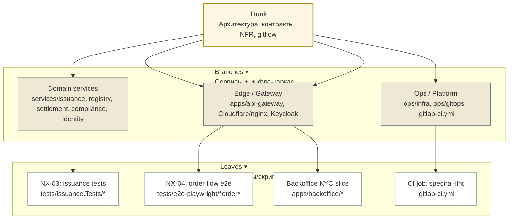
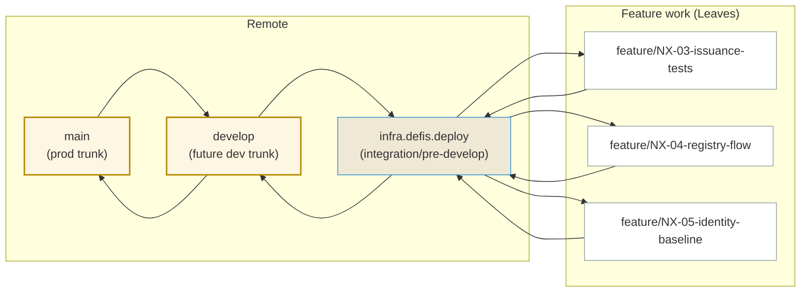
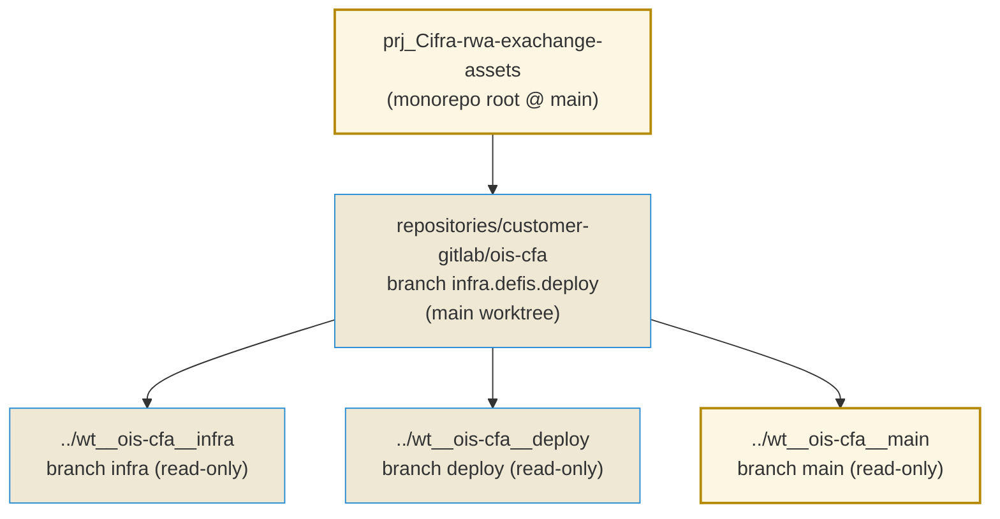

# Prompt
You are Oracle, a focused one-shot problem solver. Emphasize direct answers, cite any files referenced, and clearly note when the search tool was used.  You are GPT‑5 Pro acting as a senior system/solution architect and meta‑framework designer for an AI‑assisted monorepo.  You are now looking at a **mono‑repo root**:  - macOS path: `/Users/user/__Repositories/prj_Cifra-rwa-exachange-assets` - eywa1 path: `/home/user/__Repositories/yury-customer/prj_Cifra-rwa-exachange-assets` - The `ois-cfa` repo is a submodule under:   `repositories/customer-gitlab/ois-cfa`  On both macOS and eywa1 we use **git worktrees** with the pattern:  - `wt__{repo}__{branch}`, where `/` is replaced with `-` - Example on macOS:   - `repositories/customer-gitlab/ois-cfa` (main worktree, branch `infra.defis.deploy`)   - `../wt__ois-cfa__infra`   (branch `infra`)   - `../wt__ois-cfa__deploy`  (branch `deploy`)   - `../wt__ois-cfa__main`    (branch `main`) - Same pattern exists on eywa1.  In `ois-cfa` the `tasks/` folder and `docs/context/*` are the **main handles for future AI agents**.  I have attached:  - `c2p_ois-cfa.txt`: ~4MB code2prompt snapshot of the `ois-cfa` repo on branch `infra.defis.deploy` (structure + key files, including `tasks/NX-*` and `docs/context/*`); - `20251116-1603-gpt5pro-audit-feedback-review.gpt5p.md`: your earlier deep V1‑audit (architecture + recommendations); - `20251117-1747-gpt5pro-next-steps-after-audit-feedback.gpt5p.md`: follow‑up “next steps” report; - `20251117-1748-gpt5pro-next-steps-after-audit-feedback.gpt5p.md`: another “next steps” angle; - `20251117-1927-gpt5pro-step3-all-together-after-audit-feedback.gpt5p.md`: step‑3 consolidation (“all together after audit + feedback”) including my spoken feedback about Trunk/Branches/Leaves, Mermaid, and infra.defis.deploy; - `20251117-1518-conversation-AlexA-AleksandrO.md`: conversation about NX‑tasks and expectations for `tasks/` + `docs/context/`; - `20251114-agreements-gitflow-AlexA-and-AleksandrO.md`: gitflow agreements (main/develop/tasks/feature/*, infra.defis.deploy, etc.); - `20251117-1713-feedback-to-co-3c63-from-eywa1-co-3dd7.md`: explicit feedback from eywa1 about UK1, CFA1 and what your earlier audits missed; - `AGENTS.md` at the monorepo root (current global agent rules); - `WBS-OIS.md` from `ois-cfa/docs/context` (WBS and link to NX‑tasks).  **Reality and constraints you MUST respect:**  - I will work **from the mono‑repo root on eywa1**, not from bare `ois-cfa` root. - For `ois-cfa` we already created worktrees: `wt__ois-cfa__infra`, `wt__ois-cfa__deploy`, `wt__ois-cfa__main` and main worktree on `infra.defis.deploy`. - Branch `infra.defis.deploy` is now the **integration/pre‑develop branch** (infra + deploy + UK1), not yet clean `develop`. - In the Trees/Leaves/Agents model we absolutely need a **full 3‑level tree**:   - Trunk = architecture, contracts, NFRs, gitflow rules;   - Branches = domain services, gateway, ops skeleton, integration branches (like `infra.defis.deploy`);   - Leaves = feature branches, UI slices, tests, scripts, small config changes. - Mermaid diagrams are **must‑have** for me (ADHD, visual thinker). Any serious structural recommendation must include at least one simple Mermaid diagram.  My current need is:  > **Design a coherent Trunk/Branch/Leaf + NX‑00 framework and AGENTS rules for this mono‑repo, so that future agents (Codex/Claude/GPT‑5) can reliably work from the monorepo root and drive `ois-cfa` via tasks/NX‑* in a safe, staged way.**  VERY IMPORTANT PROCESS RULE:  - Before doing NX‑01..NX‑08 tasks inside `ois-cfa`, I want to define and execute **NX‑00-* meta‑tasks** (AGENTS, Trees/Branches/Leaves, diagrams, indices). - Order is: *write NX‑00 tasks → update AGENTS/Docs accordingly → only then execute NX‑01..NX‑08*. - All outputs of this Oracle call will be used as **zero‑shot context** for other agents, without live conversation.  ---  ### What I need from you (V4 “master” framework):  #### 1) Refine and fix the Trunk / Branches / Leaves model  Using all attached GPT‑5 reports and the TLA docs, and especially step‑3 (1927):  - In Russian (with B2‑level English terms), clearly define for this mono‑repo:    - Trunk: what exactly belongs there (which docs, which contracts, which branches);   - Branches: how to map service/infra structure and git branches (main/develop/infra.defis.deploy/release/*) to Branch‑level;   - Leaves: typical leaf‑level changes (tests, small features, scripts, devops jobs, docs updates).  - Output:    - A short narrative (5–8 bullets) with clear definitions.   - A **table** with columns: `Level` / `What it is in this mono-repo` / `Examples` / `Who touches it` / `Risks`.   - At least **two Mermaid diagrams**:     - one for architecture as a tree (Trunk → Branches → Leaves);     - one for gitflow vs Trunk/Branches/Leaves (main/develop/infra.defis.deploy/feature/NX-* + worktrees).  These diagrams should be simple enough to copy‑paste into markdown (no exotic Mermaid features).  #### 2) NX‑00 meta‑tasks: what must be done before NX‑01..NX‑08  Design a **small “NX‑00‑series”** of meta‑tasks that must be done prior to implementing NX‑01..NX‑08 for `ois-cfa`, working from the monorepo root:  - Think of NX‑00‑01, NX‑00‑02, … NX‑00‑N (N ≈ 3–7). - Each NX‑00 task should be something like:   - “Update AGENTS.md with Trunk/Branch/Leaf + Mermaid rules”;   - “Create TREES-LEAVES-AGENTS-OIS.md and link it from docs/context and AGENTS.md”;   - “Add README/INDEX files for `tasks/` and `docs/context/` to explain how agents should use NX‑tasks from mono‑repo root”;   - “Describe git worktrees and naming pattern wt__{repo}__{branch} in docs/AGENTS so agents understand physical layout on macOS/eywa1”;   - etc.  For each NX‑00‑task provide:  - `NX-00-ID` (e.g. NX‑00‑01, NX‑00‑02, …); - `Target location` (which repo/file(s): mono‑repo AGENTS.md, `repositories/customer-gitlab/ois-cfa/docs/context/…`, etc.); - `Goal` (1–2 lines); - `Steps` (3–7 bullet points, fairly concrete); - `Done-when` (3–5 bullet DoD); - `Agent-friendly?` (yes/no/partial + 1‑line why).  Output this as a table; I will then physically create these NX‑00 files and execute them in order.  #### 3) How NX‑00 connects to NX‑01..NX‑08 and git branches/worktrees  Given:  - gitflow agreements (20251114); - conversation about tasks (1518); - the Trunk/Branch/Leaf model you defined in section 1; - the current worktree layout (`wt__ois-cfa__infra`, `wt__ois-cfa__deploy`, `wt__ois-cfa__main`, main `infra.defis.deploy`);  Explain:  - From which branch and **from which worktree** I should:   - apply NX‑00 tasks on eywa1 (monorepo root + submodule worktrees),   - then branch for NX‑01..NX‑08 (`feature/NX-03-issuance-tests`, etc.),   - and where to merge back (into `infra.defis.deploy`, then later into `develop`/`main`). - Provide 5–10 bullets as a **“Branch/Worktree usage guide”** for future agents, with references to Trunk/Branches/Leaves.  If helpful, add one more small Mermaid diagram (git branches vs worktrees).  #### 4) Concrete AGENTS.md / rules updates  Using the attached monorepo `AGENTS.md` and all previous audits:  - Suggest **concrete changes/additions** to AGENTS rules, focusing on:    - Trunk/Branch/Leaf responsibilities;   - mandatory Mermaid + tables for structural/architectural/gilfow/agentification answers;   - rules about worktrees (wt__{repo}__{branch});   - what agents MAY and MAY NOT do in this mono‑repo (e.g. no touching main/develop contracts, no K8s/fabric topology changes, etc.).  - Output as:    - A short “patch‑like” section (list of new paragraphs/sections to insert into AGENTS.md, not actual diff);   - A bullet list explicitly labeled “Rules for all AI agents” that I can paste into AGENTS.md.  #### 5) Final “handoff” for Codex/Claude/GPT‑5 agents  Remember: your output will be used as **zero‑shot master context** for other agents.  At the end of your answer, produce a short section:  - “How other agents should read and use this document” — 5–8 bullets, describing:   - in what order to read sections (Trunk/Branch/Leaf → NX‑00 → NX‑01..NX‑08 → Branch/Worktree guide → AGENTS rules);   - how to decide whether a concrete task is Leaf/Branch/Trunk;   - when they MUST stop and ask for human confirmation.  Style & format:  - Answer in Russian, with senior‑engineer tone; English technical terms/slang OK. - Structure your answer as:    - TL;DR (3–5 bullets),   - Section 1: Trunk/Branches/Leaves clarified,   - Section 2: NX‑00 meta‑tasks (table),   - Section 3: Branch/Worktree usage guide,   - Section 4: AGENTS.md / rules updates,   - Section 5: Handoff for other agents,   - Final compact table: `Area` / `Decision or rule` / `Your recommendation`.  - Do NOT restate full contents of attached files; focus on synthesis, decisions, and **executable** steps that I can implement from the monorepo root on eywa1.

# Output

TL;DR

* Trunk = **AGENTS + манифесты + контракты + NFR + gitflow + ключевые runbook’и (UK1)**; Branch = **сервисы/infra‑каркас + интеграционные ветки (`infra.defis.deploy`, `release/*`)**; Leaves = **feature‑ветки `feature/NX-*`, UI‑слайсы, тесты, скрипты**. `infra.defis.deploy` — НЕ trunk, а integration‑branch. 
* Перед NX‑01..NX‑08 выполняем **5 meta‑тасков NX‑00‑01..05**: T/B/L‑док, апдейт AGENTS, индекс `tasks/`+`docs/context/`, doc по gitflow+worktrees, выравнивание WBS‑OIS+NX по уровням дерева. Это создаёт единый «каркас» для других агентов.
* Рабочая база на сегодня: **monorepo root@`main` + submodule `ois-cfa`@`infra.defis.deploy`**; feature‑ветки `feature/NX-*` заводим **в `ois-cfa` от `infra.defis.deploy`**, мержим обратно в неё, позже — `infra.defis.deploy → develop → main`. `tasks` — только MD‑таски, не база для кода.
* AGENTS‑rules: агентам **запрещено трогать trunk** (контракты, NFR, gitflow, chaincode, топологию K8s/Fabric, критические runbook’и), обязательны **Mermaid + таблица** для любых структурных/архитектурных решений, работа с worktrees строго по шаблону.
* Всё ниже собрано из `c2p_ois-cfa`, V1/V2/V3‑аудитов, WBS‑OIS, gitflow‑agreements, NX‑разговора и UK1‑feedback через `file_search` по репо.

---

## Section 1. Trunk / Branches / Leaves — уточнённая модель

### 1.1. Краткие определения (моно‑репо целиком)

1. **Trunk (ствол)** — устойчивый «каркас проекта»:
   AGENTS/CLAUDE, манифесты (`project.manifest.json`, `repo-structure`, `workflow`), WBS‑OIS, контракты (`packages/contracts`, `packages/domain`), NFR/безопасность/регуляторка, gitflow‑правила, ключевые runbook’и по окружениям (UK1/Cloudflare/SMTP/Playwright).

2. **Trunk‑ветки** — `main` и будущий `develop` в `ois-cfa` и в корне монорепы. Всё, что туда попадает, считается согласованной архитектурой и контрактом с внешним миром (демо/клиент). 

3. **Branches (ветви)** — реализация доменных сервисов и платформенный «каркас»:
   `services/*`, `apps/api-gateway`, `ops/infra`, `ops/gitops`, `.gitlab-ci.yml`, UK1‑docker‑compose, GitLab Runner/Agent, интеграционные ветки типа `infra.defis.deploy`, `release/*`, `hotfix/*`.

4. **`infra.defis.deploy`** — **integration/pre‑develop branch на уровне Branch**, а не новый trunk: туда сведены `infra`+`deploy`+UK1, она выступает как «интеграционный мост» между feature‑ветками и будущим `develop`.

5. **Leaves (листья)** — локальные изменения, которые можно смело отдавать агентам: feature‑ветки `feature/NX-*`, отдельные UI‑кусочки в порталах, Playwright‑спеки, unit/integ‑тесты, небольшие YAML/Helm/CI‑jobs, вспомогательные скрипты и README в подсистемах.

6. **tasks/NX‑*** — интерфейс для Leaves/Branches: каждый NX‑task описывает срез работы (spec‑matrix, gateway, issuance, registry, identity, CI, backoffice) и в WBS привязан к конкретным Milestones M1..M5.

7. **memory‑bank** — **журнал решений и сессий**, не кодовый trunk: туда пишем логи аудитов, UK1‑деплоя, git‑обсуждений, но не воспринимаем как архитектурный контракт; ссылки на важные записи заводим из trunk‑доков.

8. **Точка входа для агентов**: monorepo `AGENTS.md` → `docs/context/PROJECT-CONTEXT.md` → `docs/context/TREES-LEAVES-AGENTS-OIS.md` (будущий) → `WBS-OIS` → нужный `tasks/NX-*`.

### 1.2. Таблица уровней

| Level  | What it is in this mono-repo                                                                                                   | Examples                                                                                                                                                      | Who touches it                                                            | Risks if broken                                                                                                        |
| ------ | ------------------------------------------------------------------------------------------------------------------------------ | ------------------------------------------------------------------------------------------------------------------------------------------------------------- | ------------------------------------------------------------------------- | ---------------------------------------------------------------------------------------------------------------------- |
| Trunk  | Архитектурный каркас, контракты, NFR, gitflow, ключевые runbook’и и правила агентов на уровне **всей монорепы и `ois-cfa`**    | `AGENTS.md`, CLAUDE.md, `project.manifest.json`, `WBS-OIS.md`, `docs/context/PROJECT-CONTEXT.md`, `packages/contracts/*`, UK1‑ingress/SMTP runbook            | Alex A, Aleksandr O (+ ревью заказчика); агенты — только как советники    | Поломанный контракт с внешним миром, регуляторные риски, невалидный gitflow, несогласованные NFR по перфу/безопасности |
| Branch | Реализация доменов и платформы: сервисы, gateway, ops‑каркас, интеграционные ветки (включая `infra.defis.deploy`)              | `services/issuance/*`, `services/registry/*`, `apps/api-gateway/*`, `ops/infra/*`, `ops/gitops/*`, `.gitlab-ci.yml`, ветки `infra.defis.deploy`, `release/*`  | Alex A, Aleksandr O, senior‑dev; агенты — только мелкие изменения с ревью | Сломанные flows, деградация observability/CI, дрейф infra, нестабильные демо/UK1                                       |
| Leaf   | Локальные фичи и улучшения поверх каркаса: UI‑слайсы, Playwright‑спеки, unit/integ‑тесты, мелкие YAML/CI‑jobs, скрипты, README | `feature/NX-03-issuance-tests`, `tests/e2e-playwright/*`, изменения в `apps/backoffice/*`, `scripts/smoke-gateway.sh`, job `spectral-lint` в `.gitlab-ci.yml` | Любые dev + агенты (обязательно через MR)                                 | Локальные регрессы; риск небольшой, если есть тесты/ревью                                                              |

(таблица — канон для всех NX‑00/NX‑0X тасков)

### 1.3. Mermaid — архитектура как дерево



(адаптировано из V3‑отчёта, но теперь явно используется как canonical‑диаграмма)

### 1.4. Mermaid — gitflow vs Trunk/Branches/Leaves



*Смысл*: сейчас `infra.defis.deploy` — Branch‑уровень интеграции; feature‑ветки живут поверх неё; позже `develop` станет стабильным trunk, а `infra.defis.deploy` можно будет заархивировать как исторический integration‑слой.
 
---

## Section 2. NX‑00 meta‑tasks (до NX‑01..NX‑08)

Ниже — 5 NX‑00 тасков. Предполагается, что сами MD‑файлы `tasks/NX-00-*.md` будут лежать внутри `repositories/customer-gitlab/ois-cfa/tasks/`, но оперировать они могут и корневым `AGENTS.md`.

### Таблица NX‑00

| NX-00-ID                                   | Target location                                                                                                                                                                      | Goal                                                                                                                  | Steps (3–7)                                                                                                                                                                                                                                                                                                                                                                                                                                                                                                                                                                                       | Done-when (3–5 DoD)                                                                                                                                                                                                                                                                                                                     | Agent-friendly?                                                                                                                       |     |                                                                                                                                         |                                                                                                                                                                                                                                      |                                                                                                                          |
| ------------------------------------------ | ------------------------------------------------------------------------------------------------------------------------------------------------------------------------------------ | --------------------------------------------------------------------------------------------------------------------- | ------------------------------------------------------------------------------------------------------------------------------------------------------------------------------------------------------------------------------------------------------------------------------------------------------------------------------------------------------------------------------------------------------------------------------------------------------------------------------------------------------------------------------------------------------------------------------------------------- | --------------------------------------------------------------------------------------------------------------------------------------------------------------------------------------------------------------------------------------------------------------------------------------------------------------------------------------- | ------------------------------------------------------------------------------------------------------------------------------------- | --- | --------------------------------------------------------------------------------------------------------------------------------------- | ------------------------------------------------------------------------------------------------------------------------------------------------------------------------------------------------------------------------------------ | ------------------------------------------------------------------------------------------------------------------------ |
| **NX-00-01** TLA-core                      | - `repositories/customer-gitlab/ois-cfa/docs/context/TREES-LEAVES-AGENTS-OIS.md` (новый)  - `repositories/customer-gitlab/ois-cfa/docs/context/PROJECT-CONTEXT.md` (обновить ссылку) | Зафиксировать модель Trunk/Branches/Leaves для `ois-cfa` + UK1 как отдельный doc и связать с контекстом.              | • Создать `TREES-LEAVES-AGENTS-OIS.md` с определениями уровней, таблицей (как в Section 1.2) и двумя Mermaid‑диаграммами из Section 1.3–1.4.<br>• В `PROJECT-CONTEXT.md` добавить короткий блок «Текущее состояние (infra.defis.deploy + UK1)» с ссылкой на TLA‑doc.  <br>• Указать, что `infra.defis.deploy` — integration/pre‑develop branch, а не trunk.                                                                                                                                                                                                                                       | • Файл `TREES-LEAVES-AGENTS-OIS.md` существует, проверен на Markdown‑валидность.<br>• В нём есть таблица уровней и две Mermaid‑диаграммы, копируемые без правок.<br>• `PROJECT-CONTEXT.md` ссылается на этот файл и кратко описывает роль `infra.defis.deploy` и UK1.  <br>• В tasks/NX‑00‑01‑*.md зафиксирован статус и ссылка на doc. | **Partial** — агент может сгенерировать doc и диаграммы, но финальную формулировку trunk/risks должен проверить человек.              |     |                                                                                                                                         |                                                                                                                                                                                                                                      |                                                                                                                          |
| **NX-00-02** AGENTS-sync                   | - monorepo root: `AGENTS.md`  - symlink `CLAUDE.md` (только обновить target)                                                                                                         | Встроить T/B/L‑модель и правила агентов в глобальный AGENTS, чтобы все агенты читали единый каркас.                   | • В `AGENTS.md` добавить раздел `## Trees / Branches / Leaves (Cifra RWA monorepo)` и под-раздел `### Gitflow & Branch responsibility` по шаблону из Section 4.  <br>• Добавить блок «Rules for all AI agents» (из Section 4) с явным запретом трогать trunk и топологию K8s/Fabric.  <br>• Убедиться, что CLAUDE‑symlink по‑прежнему указывает на тот же файл.                                                                                                                                                                                                                                   | • В `AGENTS.md` присутствует новый раздел с явными определениями Trunk/Branch/Leaf и ссылкой на `TREES-LEAVES-AGENTS-OIS.md`.<br>• Есть явный список правил для агентов, в т.ч. про Mermaid+таблицы и worktrees.<br>• CLAUDE.md остаётся symlink‑ом к AGENTS.md.                                                                        | **Yes** — агент может внести текстовый блок по шаблону; тебе останется только просмотреть и отредактировать формулировки.             |     |                                                                                                                                         |                                                                                                                                                                                                                                      |                                                                                                                          |
| **NX-00-03** Tasks & Context index         | - `repositories/customer-gitlab/ois-cfa/tasks/README.md` (новый) - `repositories/customer-gitlab/ois-cfa/docs/context/README.md` (новый/обновл.)                                     | Объяснить людям и агентам, как читать `tasks/NX-*` и `docs/context/*` из корня монорепы.                              | • В `tasks/README.md` описать назначение NX‑тасков, naming (`NX-01..08`, NX‑00‑*), правила ссылок на docs/context/WBS и что tasks — не SSOT по задачам (SSOT — внешняя система).  <br>• В `docs/context/README.md` описать состав контекстных файлов (PROJECT/FRONTEND/WBS/RULES/PROMPTS-MAP) и порядок чтения перед NX‑работой.  <br>• Добавить в оба README краткий How-to: «запуск из монорепы (eywa1), переход в submodule, выбор ветки/ветки‑фичи».                                                                                                                                          | • Оба README существуют и объясняют назначение папки, структуру и порядок чтения в 1–2 экранa текста.<br>• Из `tasks/NX-01..08` есть обратные ссылки на README (например, «см. общий README для правил использования NX»).<br>• В AGENTS.md есть ссылка на эти README как на входную точку.                                             | **Yes (~90%)** — идеальная работа для агента: собрать ссылки, сформулировать краткие инструкции, ты только проверяешь корректность.   |     |                                                                                                                                         |                                                                                                                                                                                                                                      |                                                                                                                          |
| **NX-00-04** Gitflow & worktrees           | - `repositories/customer-gitlab/ois-cfa/docs/context/GITFLOW-AND-WORKTREES.md` (новый)                                                                                               | Задокументировать gitflow (main/develop/infra.defis.deploy/tasks/feature) и физическую схему worktrees (macOS/eywa1). | • Свести договорённости по gitflow из чата/agreements в один документ: `main`=prod, `develop`=dev/pre‑prod, `tasks`=MD‑таски, `feature/*` от dev/infra.defis.deploy.  <br>• Явно описать, что **до появления стабильного `develop`** роль dev‑trunk выполняет `infra.defis.deploy`.  <br>• Описать pattern worktrees: `repositories/customer-gitlab/ois-cfa` (infra.defis.deploy) + `../wt__ois-cfa__infra`, `../wt__ois-cfa__deploy`, `../wt__ois-cfa__main` и как ими пользоваться на eywa1/macOS. <br>• Вставить маленькую Mermaid‑диаграмму (см. Section 3) с отображением веток и worktrees. | • Документ существует, содержит схему веток, пример команд (`git checkout -b feature/NX-03... infra.defis.deploy`) и Mermaid‑диаграмму.<br>• В `TREES-LEAVES-AGENTS-OIS.md` и `AGENTS.md` есть ссылка на этот doc как на источник правды по веткам/worktrees.<br>• В tasks/NX‑* нет противоречащих указаний по веткам.                  | **Partial** — текст и диаграмму может собрать агент, но стратегические формулировки и запреты лучше, чтобы финально проверил человек. |     |                                                                                                                                         |                                                                                                                                                                                                                                      |                                                                                                                          |
| **NX-00-05** WBS/OIS + NX + Tree alignment | - `repositories/customer-gitlab/ois-cfa/docs/context/WBS-OIS.md` - `repositories/customer-gitlab/ois-cfa/tasks/NX-01..NX-08-*.md`                                                    | Свести WBS‑OIS, NX‑таски и Tree‑уровни (Trunk/Branch/Leaf), явно пометить уровень и окружение для каждого NX.         | • В `WBS-OIS.md` добавить колонку/список «Tree level» для Milestones M1..M5 и NX‑тасков (M1=M1Trunk/Branch, NX‑01=Trunk/Branch, NX‑07/08=в основном Leaf).  <br>• В каждом `tasks/NX-0X-*` добавить блок frontmatter/таблицу с полем `tree_level: trunk                                                                                                                                                                                                                                                                                                                                           | branch                                                                                                                                                                                                                                                                                                                                  | leaf`и`target_env: dev                                                                                                                | UK1 | k8s`.  <br>• Обновить описание NX‑задач так, чтобы было видно, откуда ветвиться и какой минимум DoD по окружениям (локально, UK1, k8s). | • WBS‑OIS явно показывает, какие NX относятся к Trunk/Branch/Leaf, и это согласовано с этим документом.<br>• В каждом NX‑файле есть level/env‑поля.<br>• AGENTS/TLA doc отсылают к WBS‑OIS как к канонической матрице NX↔Tree↔Track. | **Yes (~70%)** — агент может разнести поля и таблицы; тебе нужно будет подтвердить уровни и окружения для спорных задач. |

---

## Section 3. Как NX‑00 связаны с NX‑01..NX‑08 и ветками/worktrees

### 3.1. Откуда выполнять NX‑00 на eywa1 (ветки и worktrees)

**Контекст работы:**

* Monorepo root на eywa1: `/home/user/__Repositories/yury-customer/prj_Cifra-rwa-exachange-assets` (ветка `main`).
* Submodule `ois-cfa` в монорепе: `repositories/customer-gitlab/ois-cfa` — **основной worktree на ветке `infra.defis.deploy`**.
* Доп. worktrees:
  `../wt__ois-cfa__infra` (ветка `infra`),
  `../wt__ois-cfa__deploy` (ветка `deploy`),
  `../wt__ois-cfa__main` (ветка `main`).

**Рекомендация:**

* Все NX‑00, NX‑01..NX‑08, пока нет `develop`, выполняем **в `ois-cfa`@`infra.defis.deploy`** (основной worktree в submodule), а монорепо‑root@`main` — для обновлений AGENTS/manifest.

### 3.2. Где ветвиться для NX‑01..NX‑08 и куда мержить

1. **Пока `develop` не заведен / не стабилен**:

   * Для кода в `ois-cfa`:
     `cd repositories/customer-gitlab/ois-cfa` → `git checkout infra.defis.deploy` → `git pull` → `git checkout -b feature/NX-03-issuance-tests`.
   * Все NX‑feature‑ветки живут *от* `infra.defis.deploy`, туда же и мержатся через MR.

2. **После стабилизации (`NX‑02/03/06` зелёные, CI‑gate есть)**:

   * Создаём `develop` от `infra.defis.deploy` (однократно).
   * Дальше feature‑ветки идут уже от `develop`.
   * `infra.defis.deploy` тегируем и кладём в ARCHIVE как «infra+deploy merge snapshot».

3. **Мерж‑путь** (после появления `develop`):
   `feature/NX-*` → `develop` (MR, CI, Playwright/Smoke) → `main` (когда готов релиз). `tasks` остаётся только как ветка с MD‑тасками, от неё **никогда не ветвимся для кода**.

4. **Моно‑репо root**:

   * Для NX‑00‑02 (AGENTS) и других общих docs работаем из root@`main`, но **не трогаем submodules из root‑коммитов**, пока не закоммитили изменения в самих submodules (`ois-cfa`).

### 3.3. Branch/Worktree usage guide (для агентов)

(то, что можно почти дословно кидать в AGENTS/TLA)

1. **Всегда стартуй из монорепы**: `prj_Cifra-rwa-exachange-assets@main`. Перед началом работы прочитай `AGENTS.md` и `docs/context/PROJECT-CONTEXT.md`.
2. **Для кода/доков в `ois-cfa` используй только основной worktree**: `repositories/customer-gitlab/ois-cfa` на ветке `infra.defis.deploy` (пока нет `develop`). Worktrees `wt__ois-cfa__*` — только как read‑only для сравнения/чтения старых веток.
3. **Feature‑ветки создавай только от dev‑trunk**:

   * до появления `develop` — от `infra.defis.deploy`,
   * после — от `develop`. Никогда не ветвись от `tasks`.
4. **NX‑00‑01..05 должны быть выполнены до любых NX‑01..08‑изменений кода**: пока T/B/L‑doc, AGENTS‑rules, README для tasks/docs и gitflow/worktrees‑doc не готовы, feature‑ветки для NX‑01..08 лучше не открывать.
5. **Trunk/Branch/Leaf mapping обязателен**: для любой задачи в `tasks/NX-*` смотри `tree_level` и `target_env`. Если task помечен как `trunk` — не вноси кодовые изменения без явного человеческого ревью/подтверждения.
6. **Работа с worktrees**: не создавай новые worktrees и не меняй существующие имена; паттерн `wt__{repo}__{branch}` считаем фиксированным. Если нужно, просто `cd ../wt__ois-cfa__main` для чтения кода `main`.
7. **CI/UK1‑верификация**: перед merge любой feature‑ветки в `infra.defis.deploy`/`develop` для NX‑02/03/04/05/06 прогоняй минимум `dotnet test` + `npm test` + Playwright‑smoke против UK1.
8. **Никогда не пушь изменения trunk‑файлов напрямую в `main`**: любые правки AGENTS, contracts, манивестов, security/NFR docs — только через MR (даже если формально работаешь один).

### 3.4. Mermaid — ветки vs worktrees



---

## Section 4. Обновления AGENTS.md / правила

### 4.1. «Patch‑like» предложения по структуре AGENTS.md

Отталкиваясь от текущего `AGENTS.md` (правила именования агентов, манифесты, workflow, repo‑structure, people/roles и т.п.)  — предлагаю добавить:

1. **Новый раздел после блока “Repo-local Addendum (Cifra-RWA Exchange Assets)”**:

   ```md
   ## Trees / Branches / Leaves (Cifra RWA monorepo)

   В этом проекте все изменения делятся на три уровня: Trunk, Branches, Leaves.

   - **Trunk** — архитектура, контракты, NFR, gitflow rules, ключевые runbook’и по окружениям (UK1/CFA1/K8s).
   - **Branches** — доменные сервисы, gateway, ops/infra skeleton, интеграционные ветки (`infra.defis.deploy`, `release/*`, `hotfix/*`).
   - **Leaves** — фичи, UI‑слайсы, тесты, небольшие скрипты и конфиги.

   Подробности и примеры: `repositories/customer-gitlab/ois-cfa/docs/context/TREES-LEAVES-AGENTS-OIS.md`.
   ```

2. **Подраздел “Gitflow & Branch responsibility” (внутри этого же блока):**

   ```md
   ### Gitflow & Branch responsibility

   - `main` — prod trunk; только стабильный, проверенный код и контракты.
   - `develop` — будущий dev trunk; под него будут деплоиться Dev/Pre-Prod контуры.
   - `infra.defis.deploy` — временная integration/pre-develop ветка для сведённых infra+deploy+UK1.
   - `tasks` — только `.md`-файлы задач для агентов, **не база для feature-веток**.
   - `feature/*` — короткоживущие ветки под конкретные задачи (часто NX-*), всегда от `infra.defis.deploy` или `develop`.

   Любые изменения в Trunk-ветках (`main`, `develop`) происходят только через MR с human-review.
   ```

3. **Добавить отдельный раздел ближе к концу:**

   ```md
   ## Worktrees layout (ois-cfa)

   На macOS и eywa1 используем git worktrees для submodule `ois-cfa`:

   - Основной worktree (активная работа): `repositories/customer-gitlab/ois-cfa` @ `infra.defis.deploy`.
   - Дополнительные (read-only):  
     - `../wt__ois-cfa__infra` @ `infra`  
     - `../wt__ois-cfa__deploy` @ `deploy`  
     - `../wt__ois-cfa__main` @ `main`

   Правила:
   - не создавайте новые worktrees без явного запроса человека;
   - не переключайте ветку в существующих worktrees;
   - для кода и docs используйте только основной worktree.
   ```

4. **В конец файла добавить блок “Rules for all AI agents” (см. следующий пункт).**

### 4.2. “Rules for all AI agents” — готовый список

Эти bullets можно вставить в `AGENTS.md` как новый раздел:

```md
## Rules for all AI agents

1. **Всегда определяй уровень задачи: Trunk / Branch / Leaf.**
   - Если не можешь однозначно классифицировать — относись к задаче как к Trunk и проси подтверждения человека.

2. **Trunk (архитектура, контракты, NFR, gitflow, ключевые runbook’и):**
   - Не меняй файлы trunk-уровня (`AGENTS.md`, манифесты, `WBS-OIS.md`, `packages/contracts/*`, `packages/domain/*`, `docs/*security*`, `docs/dlt/*`) без явной человеческой инструкции.
   - Любые правки trunk-доков — только через MR и с понятным changelog’ом.

3. **Branches (сервисы, gateway, ops skeleton, integration branches):**
   - Работай в ветках `infra.defis.deploy`, `develop`, `release/*` только маленькими, изолированными diff’ами.
   - Не меняй топологию K8s/Fabric, GitOps-структуру и критические CI stages (deploy, migrations) без прямого указания человека.

4. **Leaves (фичи, UI, тесты, скрипты, мелкие YAML/CI-jobs):**
   - Это твоя основная зона. Можно:
     - добавлять/расширять Playwright-/unit-/integration-тесты;
     - писать небольшие UI-слайсы в порталах;
     - добавлять spec-lint/coverage jobs в CI;
     - править локальные скрипты/README.
   - Всегда добавляй/обновляй тесты и запускай минимальный smoke (dotnet test, npm test, Playwright, где применимо).

5. **Mermaid + таблицы обязательны для структурных ответов.**
   - Любой ответ по архитектуре, gitflow, инфраструктуре или Trees/Leaves должен содержать минимум:
     - одну Mermaid-диаграмму процесса/структуры;
     - одну компактную таблицу с уровнями/ветками/рисками.

6. **Gitflow и ветки:**
   - Не создавай/не переименовывай Trunk-ветки (`main`, `develop`).
   - Не ветвись от `tasks` — только от `infra.defis.deploy` (пока нет `develop`) или от `develop` после его появления.
   - Имена feature-веток: `feature/NX-0X-short-name` либо `feature/TICKET-ID-short-name`.

7. **Worktrees (ois-cfa):**
   - Используй `repositories/customer-gitlab/ois-cfa` как основной worktree (`infra.defis.deploy`).
   - `../wt__ois-cfa__infra`, `../wt__ois-cfa__deploy`, `../wt__ois-cfa__main` — только для чтения.
   - Не создавай новые worktrees и не меняй их ветки.

8. **Окружения:**
   - UK1 — reference dev/demo env; перед любым merge в Trunk/Branch обязательно прогоняй smoke-тесты против UK1 (health + Playwright).
   - CFA1 и K8s-кластер — вторичные; изменения туда обсуждать отдельно.

9. **Безопасность и регуляторика:**
   - Не ослабляй настройки Postfix/OpenDKIM, Cloudflare, Keycloak-политик, TLS и т.п.
   - Любые изменения в chaincode, DLT-топологии и security-settings считались Trunk-уровнем и требуют ручного контроля.

10. **Источники правды:**
    - По коду/архитектуре: `ois-cfa`@`infra.defis.deploy` + `docs/context/*`.
    - По задачам: YouGile/Jira и `tasks/NX-*` (описание среза, а не полный backlog).
    - По решениям: `memory-bank/*` ссылается из docs, но сам по себе не является контрактом.
```

---

## Section 5. Handoff для других агентов

Как это использовать в zero‑shot режиме.

1. **Порядок чтения**:

   1. `AGENTS.md` (особенно разделы про Trees/Branches/Leaves и “Rules for all AI agents”);
   2. `docs/context/PROJECT-CONTEXT.md` (общая архитектура);
   3. `docs/context/TREES-LEAVES-AGENTS-OIS.md` (детали Trunk/Branch/Leaf);
   4. `docs/context/WBS-OIS.md` (Tracks/Milestones + NX‑таски);
   5. нужный `tasks/NX-*`;
   6. для git/infra — `docs/context/GITFLOW-AND-WORKTREES.md`.

2. **Как решать, Trunk/Branch/Leaf ли конкретная задача:**

   * затрагивает ли она контракты, NFR, gitflow, security/Fabric/Keycloak/UK1‑runbook? → **Trunk**;
   * меняет ли структуру сервисов/gateway/ops/CI или интеграционную ветку (`infra.defis.deploy`, `release/*`)? → **Branch**;
   * добавляет тест/спеку/UI‑фрагмент/скрипт/маленький CI‑job? → **Leaf**.

3. **Когда нужно остановиться и звать человека:**

   * любая задача, помеченная в NX/WBS как `tree_level: trunk`;
   * изменения в `packages/contracts`, `packages/domain`, `docs/*security*`, `docs/dlt/*`, chaincode или K8s‑манифесты, влияющие на топологию;
   * изменения в gitflow (ветки main/develop/tasks/release/hotfix);
   * любые сомнения в регуляторке (KYC/KYB, 5625‑У, AML/санкции).

4. **Как использовать NX‑00/NX‑0X:**

   * сначала проверить статус NX‑00‑01..05; если что-то из этого не выполнено, предложить человеку начать именно с NX‑00;
   * для NX‑01..08 работать строго из соответствующей feature‑ветки `feature/NX-0X-*`, следуя описанным там DoD и `Agent-friendly` статусу.

5. **Документировать результат:**

   * любые существенные выводы или цепочки действий фиксировать в `memory-bank` с правильным именованием и ссылкой из соответствующего NX‑task’а или docs‑файла;
   * не создавать дубликаты docs: обновлять существующие, соблюдая frontmatter и versioning‑правила.

6. **Для сложных задач (Trunk/Branch) всегда добавлять:**

   * хотя бы один Mermaid с процессом или структурой;
   * хотя бы одну таблицу с уровнями/рисками/ветками;
   * короткий чек‑лист DoD.

7. **По git/CI/infra действовать консервативно:**

   * не пытаться «улучшить» текущий K8s/Timeweb/CI beyond NX‑06 без явного запроса;
   * в спорных местах оставлять предложения в виде комментариев/маркдаун‑заметок, а не применять автоматически.

---

## Final table — компактное резюме решений

| Area                   | Decision or rule                                                                                                                 | Your recommendation                                                                                                              |
| ---------------------- | -------------------------------------------------------------------------------------------------------------------------------- | -------------------------------------------------------------------------------------------------------------------------------- |
| Tree model (T/B/L)     | Trunk = архитектура/контракты/NFR/gitflow/runbooks; Branch = сервисы+infra‑каркас+integration‑ветки; Leaves = фичи/тесты/скрипты | Зафиксировать модель в `TREES-LEAVES-AGENTS-OIS.md`, AGENTS и WBS‑OIS; использовать таблицу и Mermaid из этого ответа как канон. |
| Gitflow & branches     | `main`/`develop` = trunk; `infra.defis.deploy` = integration/pre‑develop; `tasks` = md‑таски; feature‑ветки от dev‑trunk         | Пока нет `develop`, ветвиться от `infra.defis.deploy`; после стабилизации — от `develop`; `tasks` не использовать для кода.      |
| Worktrees              | Один активный worktree `ois-cfa`@`infra.defis.deploy`; `wt__ois-cfa__*` — read‑only                                              | Жёстко задокументировать layout и запретить агентам создание/изменение worktrees.                                                |
| NX‑00 meta‑tasks       | Перед NX‑01..08 нужны NX‑00‑01..05 (TLA‑doc, AGENTS, README tasks/docs, gitflow+worktrees, WBS+NX+Tree)                          | Завести `tasks/NX-00-*.md` и выполнить их в предложенном порядке, из монорепы@main + `ois-cfa`@`infra.defis.deploy`.             |
| NX‑01..NX‑08 execution | Работать через feature/NX‑ветки с привязкой к Tree‑уровню и окружению                                                            | В каждом NX‑task явно прописать `tree_level` и `target_env`, DoD и Agent-friendly; не выполнять Trunk‑изменения без ревью.       |
| AGENTS.md              | Сейчас описывает общие правила, но без T/B/L и worktrees                                                                         | Добавить разделы Trees/Branches/Leaves, Gitflow & Branch responsibility, Worktrees layout и список “Rules for all AI agents”.    |
| Environments & UK1     | UK1 — основной reference dev/demo, CFA1/K8s вторичны                                                                             | В каждом структурном doc и NX‑task явным текстом указывать UK1 как дефолт для smoke/E2E; не ломать UK1 без явного запроса.       |
| Agent safety & scope   | Риск, что агенты полезут в Trunk/infra/chaincode                                                                                 | Жёстко ограничить scope через AGENTS: разрешать агентам преимущественно Leaf‑работу, Branch/Trunk — только через MR и ревью.     |

Если хочешь, следующим шагом могу помочь прямо разметить скелеты файлов `NX-00-01..05` и TLA‑doc в формате, который можно сразу положить в `tasks/` и `docs/context/`.
