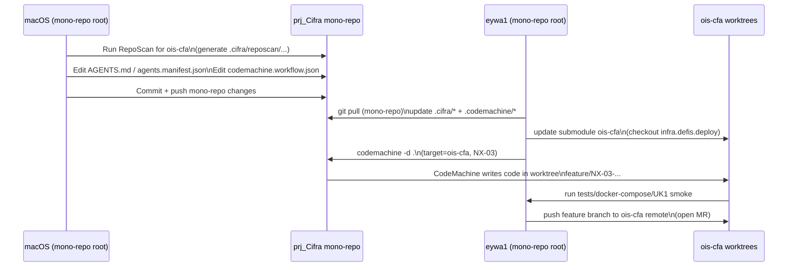

# Prompt
You are Oracle, a focused one-shot problem solver. Emphasize direct answers, cite any files referenced, and clearly note when the search tool was used.  You are GPT‑5 Pro acting as a senior meta‑architect for my AI‑assisted workspace.  Context (must internalise before answering): - I have a personal mono‑repo (`prj_Cifra-rwa-exachange-assets`) with manifests, memory-bank, and submodules like `ois-cfa` (customer repo). - `ois-cfa` is the *team* repo where most of the domain code lives; the mono‑repo is **my control plane** (manifests, AGENTS, workflows, AI experiments) and must not leak into customer repos. - I already have several of your previous audits for `ois-cfa` and infra (V1/V2/V3/V4), including Trunk/Branch/Leaf and NX‑00..NX‑08 ideas. - Now I want to step back and design a *global* framework for three things:   1) **RepoScan**: how to keep up‑to‑date, machine‑readable JSON snapshots of repos (code structure, domains, Trunk/Branch/Leaf mapping) for agents;   2) **Agents & Structures**: how to describe agents, their roles and rules (AGENTS.md, manifests, Trees/Branches/Leaves) in a reusable, JSON+Markdown way;   3) **CodeMachine**: how to orchestrate agents + RepoScan + manifests to actually run coding workflows (Codex/Claude/GPT‑5) on macOS/eywa1.  I have attached: - `c2p_20251118-0905-context-reposcan-agents-structure-and-codemachine.txt`: aggregated context (my notes + transcripts) about these three topics; - `c2p_reposcan.txt`: code2prompt snapshot of the current RepoScan approach, examples, and prior experiments; - `c2p_agents-structures.txt`: snapshot of how I currently describe agents, AGENTS.md patterns, Trees/Leaves/Agents, etc.; - `c2p_codemachine.txt`: snapshot of my early CodeMachine ideas (agent orchestrator, pipelines, map/reduce over tasks); - `c2p_ois-cfa.txt`: snapshot of the `ois-cfa` repo (branch `infra.defis.deploy`), to ground examples in a concrete codebase; - `20251116-1603-gpt5pro-audit-feedback-review.gpt5p.md`, `20251117-1747/1748-gpt5pro-*.gpt5p.md`, `20251117-1927-gpt5pro-step3-all-together-after-audit-feedback.gpt5p.md`, `20251117-2103-gpt5pro-step4-all-and-nextsteps.gpt5p.md`, `20251118-0905-feedback-gpt5pro-step4-all.md`: previous GPT‑5 audits + my spoken feedback (especially about Trunk/Branches/Leaves, Mermaid, NX‑00, mono‑repo vs team repo boundaries).  **High-level ask:**  Design a **coherent, JSON+Markdown based framework** that ties together: - RepoScan snapshots (JSON) of repos like `ois-cfa`; - AGENTS/agent‑structures (Markdown + YAML frontmatter + JSON indices); - CodeMachine orchestration (how agents consume RepoScan + manifests + tasks and operate on worktrees on macOS/eywa1).  Think of it as a “Spec‑Driven Dev + Agent‑Driven Dev OS” for my workspace.  What I need from you:  1) **Conceptual model (RepoScan + Agents + CodeMachine)**    - In Russian (B2‑English terms allowed), explain how you would conceptually split responsibilities between:      - RepoScan (what it produces; how often; for which repos; relation to Trunk/Branch/Leaf);      - Agent descriptors/AGENTS (how we describe agents, their capabilities and guardrails);      - CodeMachine (how it orchestrates agents over RepoScan + tasks + worktrees).    - Output 5–10 bullets that describe the “OS level” model.  2) **JSON schemas / structures (high‑level)**    - Propose high‑level JSON structures for three core artefacts:      1. `reposcan.json` (per repo);      2. `agents.json` or `agents.manifest.json` (per workspace/mono‑repo);      3. `codemachine.workflow.json` (per project or per target like `ois-cfa`).    - For each, define:      - required top‑level fields and their meaning;      - how to encode Trunk/Branch/Leaf in a way that is easy for agents to consume;      - how to reference real files/paths (e.g. `repositories/customer-gitlab/ois-cfa/...`).    - You don’t need to give full JSON Schema; focus on key fields and nesting.  3) **YAML frontmatter & tagging strategy for Markdown docs**    - Based on my feedback (I want YAML frontmatter + tags for everything), propose:      - a minimal, consistent frontmatter schema (keys like `type`, `sphere`, `topic`, `tags`, `level: [trunk|branch|leaf]`, etc.);      - tag vocabularies for RepoScan/Agents/CodeMachine/ois‑cfa so that we can later query/filter docs by these tags;      - rules for how RepoScan and CodeMachine should interpret these tags.    - Output as:      - example YAML blocks for 2–3 types of docs (AGENTS.md, project manifest, repo‑level context doc, NX‑task doc);      - short bullet rules “how agents should use these tags”.  4) **CodeMachine execution model (macOS + eywa1 + worktrees)**    - Using the description of worktrees and mono‑repo layout, describe how CodeMachine should:      - locate RepoScan snapshots and manifests;      - decide which worktree to operate on for a given task (e.g. `ois-cfa`@`infra.defis.deploy`, `wt__ois-cfa__infra`, etc.);      - orchestrate agents in a map/reduce way (e.g. RepoScan → GPT‑5 planning → Codex implementation → GPT‑5 review) while respecting Trunk/Branch/Leaf rules.    - Include 1–2 Mermaid diagrams for:      - CodeMachine high‑level pipeline (inputs → planning → execution → review → commit);      - how tasks flow between macOS and eywa1 (where planning happens, where code runs, where RepoScan is stored).  5) **Concrete next steps (1–2 weeks) to start implementing this framework**    - Given all the above and my existing mono‑repo (manifests, memory‑bank, AGENTS, ois‑cfa submodule), propose a **short, actionable plan** for the next 1–2 weeks:      - which JSON manifests to create first and what minimal fields to include;      - which docs to update with YAML frontmatter/Trunk‑Branch‑Leaf tags;      - how to wire the first version of CodeMachine (even if it’s just a set of scripts + small orchestrator).    - Output as a table: `Step` / `Area` / `What to implement` / `Why now` / `Agent-friendly?`.  Style & format: - Answer in Russian, senior‑engineer tone, B2‑English terms OK. - Structure your answer as:   - TL;DR (3–5 bullets),   - Section 1: Conceptual model,   - Section 2: JSON structures,   - Section 3: YAML frontmatter & tags,   - Section 4: CodeMachine execution model,   - Section 5: Next steps (table),   - Final compact table: `Area` / `Decision` / `Your recommendation`. - Do NOT restate all attached files; focus on synthesis and **executable** design.

# Output
TL;DR

* RepoScan = **C4+FS‑снимок репо + Trunk/Branch/Leaf‑метки**, лежит в монорепе (`.cifra/reposcan/*`), не в `ois-cfa`. Агентам он даёт карту кода и доменов.
* AGENTS/agents.manifest = **единый реестр людей/агентов/skills** с их зонами ответственности (Trunk/Branch/Leaf), разрешёнными репо/путями и движками (GPT‑5, Claude, Codex, CodeMachine sub‑agents).
* CodeMachine‑уровень = **workflow‑манифест per‑target (`codemachine.workflow.json`)**, который связывает: RepoScan → NX‑task → агенты → worktree (`wt__ois-cfa__…`) и запускает map/reduce‑пайплайн (planning → context → codegen → review → commit), опираясь на уже существующую модель CodeMachine CLI.
* Вся “магия” живёт в монорепе (`.cifra/*`, `.codemachine/*`), а `ois-cfa` остаётся чистым team‑репо (только код/документация клиента).
* Я использовал `file_search` по `c2p_reposcan`, `c2p_codemachine`, агентным брейнштормам и `gpt5p-ois-cfa.shtgn.reposcan.json`, чтобы заземлить структуру на реальные примеры.

---

## 1. Концептуальная модель (RepoScan + Agents + CodeMachine)

### 1.1. Разделение ответственности

1. **RepoScan (per‑repo snapshot)**
   *Что:* периодический JSON‑снимок репо (структура, домены, C4‑контексты/контейнеры, Trunk/Branch/Leaf‑карта), по образцу `…ois-cfa.shtgn.reposcan.json`. 
   *Где:* в монорепе, например `.cifra/reposcan/ois-cfa/infra.defis.deploy.reposcan.json` (путь к командному репо + ветка).
   *Когда:* по событию (`git pull` в worktree, значимый MR) или раз в день/спринт.
   *Связь с T/B/L:* каждый path/domain в RepoScan помечен `level: trunk|branch|leaf`; плюс глобальные правила `pattern → level`.

2. **Agents & Structures (AGENTS + agents.manifest.json)**
   *Что:* “паспорт” всех агентов (люди, GPT‑5, Claude, Codex, CodeMachine sub‑агенты) и их зон ответственности. Конфигурация похожа на `main.agents.js`/`sub.agents.js` в CodeMachine, но в JSON.
   *Где:* в монорепе:
   `AGENTS.md` (читаемый humans/LLM) + `.cifra/agents.manifest.json` (машиночитаемый индекс).
   *Связь с T/B/L:* у каждого агента есть `level_scope` (например, `["leaf"]` для Codex‑кодера, `["branch","leaf"]` для GPT‑5‑ревьюера) и `allowed_paths` по шаблонам.

3. **CodeMachine / Code OS (per‑target workflows)**
   *Что:* оркестратор, который по манифесту `codemachine.workflow.json` запускает последовательность шагов: планирование → Task breakdown → контекст → код → review → git‑commit → loop, как в стандартном CodeMachine workflow.
   *Где:* в монорепе: `.cifra/workflows/ois-cfa.codemachine.workflow.json` + runtime‑директория `.codemachine/` (под контролем монорепо, не субмодуля).
   *Связь с RepoScan/AGENTS:* workflow читает `reposcan.json` + `agents.manifest.json` + NX‑tasks‑манифест и для каждого шага выбирает:
   ‑ **какой агент**,
   ‑ **на каком уровне T/B/L** он может менять код,
   ‑ **в каком worktree/ветке** вносить изменения.

4. **Mono‑repo как “Control Plane”**
   *Mono‑repo* хранит всё “мета”: RepoScan, workflow‑манифесты, AGENTS, правила T/B/L, CodeMachine‑config; `ois-cfa` как субмодуль — только доменный код/доки, без `.codemachine` и `.cifra`. Это прямо следует из твоего требования не загрязнять customer‑репо инфраструктурой агентов.

5. **Trunk/Branch/Leaf как общий язык**
   *Docs:* через YAML frontmatter (`level: trunk|branch|leaf`).
   *RepoScan:* через `trunk_branch_leaf.rules/overrides`.
   *Agents:* через `level_scope`.
   *CodeMachine:* каждый шаг workflow и каждый task помечены `level`, и оркестратор тупо не даёт Leaf‑агенту лезть в Trunk‑файлы.

6. **NX‑tasks как API к коду**
   *NX‑серия (`tasks/NX-*.md` в `ois-cfa`) — это Leaf/Branch work items, ссылающиеся на Trunk‑доки (PROJECT‑CONTEXT, контракты, RepoScan) и управляемые CodeMachine как очередь задач.

7. **CodeMachine map/reduce поверх NX**
   *Map:* CodeMachine берёт `NX-0x` → бьёт на подзадачи/leaf‑tasks (tests, конфиги, мелкая логика) → параллелит для разных файлов/поддоменов.
   *Reduce:* собирает диффы, гоняет sanity‑check/тесты, и только после этого формирует MR/commit по правилам gitflow (всё — из монорепы, но коммиты вносятся внутри submodule‑worktree).

---

## 2. JSON‑структуры (high‑level)

### 2.1. `reposcan.json` (per‑repo, per‑branch)

**Назначение:** дать агентам “архитектурную карту” репо (C4 + директории + домены + T/B/L). Базируем на текущих `…ois-cfa.shtgn.reposcan.json`, дополняем слоями structure/domains/tbl.

**Предлагаемая структура (упрощённо):**

```jsonc
{
  "meta": {
    "project": "OIS-CFA",
    "repo": "repositories/customer-gitlab/ois-cfa",
    "branch": "infra.defis.deploy",
    "commit": "abc1234",
    "generated_at": "2025-11-18T10:25:34Z",
    "generator": "cifra-reposcan@shtgn-1.1",
    "version": "reposcan-1.0"
  },

  "c4": {
    "contexts": { "...": { "description": "...", "c4_level": "Context" } },
    "containers": { "...": { "name": "...", "technology": "...", "c4_level": "Container" } },
    "components": { /* опционально, если сканер умеет */ }
  },

  "structure": {
    "dirs": [
      {
        "path": "/",
        "entries": [
          { "name": "services", "kind": "dir", "level": "branch", "tags": ["backend", "dotnet"] },
          { "name": "apps", "kind": "dir", "level": "branch", "tags": ["frontend", "nextjs"] },
          { "name": "docs", "kind": "dir", "level": "trunk", "tags": ["docs", "architecture"] },
          { "name": "tests", "kind": "dir", "level": "leaf", "tags": ["tests"] }
        ]
      }
      // … можно детализировать глубже при необходимости
    ]
  },

  "domains": {
    "issuance": {
      "level": "branch",
      "paths": [
        "services/issuance/**",
        "packages/contracts/issuance.yaml",
        "tests/services/issuance.Tests/**"
      ],
      "c4_containers": ["issuance-service"]
    },
    "registry": {
      "level": "branch",
      "paths": ["services/registry/**", "packages/contracts/registry.yaml"]
    }
    // …
  },

  "docs": [
    {
      "id": "ois-cfa-project-context",
      "path": "docs/context/PROJECT-CONTEXT.md",
      "level": "trunk",
      "sphere": "architecture",
      "tags": ["context", "c4", "ois-cfa"]
    },
    {
      "id": "wbs-ois",
      "path": "docs/context/WBS-OIS.md",
      "level": "trunk",
      "sphere": "planning",
      "tags": ["wbs", "nx-tasks"]
    }
  ],

  "trunk_branch_leaf": {
    "rules": [
      { "pattern": "docs/context/**", "level": "trunk" },
      { "pattern": "packages/contracts/**", "level": "trunk" },
      { "pattern": "services/**", "level": "branch" },
      { "pattern": "apps/**", "level": "branch" },
      { "pattern": "tests/**", "level": "leaf" },
      { "pattern": "tools/**", "level": "leaf" }
    ],
    "overrides": [
      { "path": "docs/context/TREES-LEAVES-AGENTS-OIS.md", "level": "trunk" },
      { "path": "docs/context/nx-03-issuance-tests.md", "level": "leaf" }
    ]
  }
}
```

**Ключевые моменты:**

* **Paths** всегда `repo-relative` (без абсолютных путей), чтобы агенты могли применять один и тот же RepoScan и на macOS, и на eywa1 (корни разные, структура внутри репо — одинаковая).
* T/B/L кодируется как: `level` на элементах `dirs`, `domains`, `docs` + глобальный блок `trunk_branch_leaf.rules`.
* По желанию можно добавить `metrics` (строки кода, количество тестов, % C# vs TS и т.п.), но это уже необязательный слой.

---

### 2.2. `agents.manifest.json` (workspace‑level)

**Назначение:** единый реестр агентов (люди + LLM + CodeMachine‑уровень) и связка с T/B/L, репо и движками. Концептуально — JSON‑версия `config/main.agents.js` + `config/sub.agents.js` из CodeMachine, но на уровне монорепо.

**Структура (high‑level):**

```jsonc
{
  "meta": {
    "workspace": "prj_Cifra-rwa-exachange-assets",
    "generated_at": "2025-11-18T12:00:00Z",
    "version": "agents-1.0"
  },

  "agents": [
    {
      "id": "human.alex",
      "kind": "human",
      "name": "Alex A.",
      "roles": ["architect", "tech-lead", "trunk-owner"],
      "level_scope": ["trunk", "branch", "leaf"],
      "repos": ["*"],
      "tags": ["decision-maker"]
    },
    {
      "id": "ai.gpt5.oraculum",
      "kind": "llm",
      "engine": "openai",
      "model": "gpt-5-pro",
      "roles": ["system-architect", "meta-review"],
      "level_scope": ["branch", "trunk-advisory"],
      "repos": ["*"],
      "tags": ["analysis", "design"],
      "constraints": {
        "write_permissions": ["docs/context/**", "AGENTS.md"],
        "must_request_human_for": ["packages/contracts/**", "ops/infra/**"]
      }
    },
    {
      "id": "ai.codemachine.context-manager",
      "kind": "codemachine-agent",
      "engine": "codex",
      "roles": ["context-manager"],
      "prompt_path": "prompts/templates/codemachine/agents/04-context-manager-agent.md",
      "level_scope": ["branch"],
      "repos": ["repositories/customer-gitlab/ois-cfa"],
      "tags": ["context", "nx-tasks"]
    },
    {
      "id": "ai.codemachine.code-generation",
      "kind": "codemachine-agent",
      "engine": "claude",
      "roles": ["code-generation"],
      "level_scope": ["leaf"],
      "repos": ["repositories/customer-gitlab/ois-cfa"],
      "tags": ["implementation"],
      "write_permissions": [
        "services/**",
        "apps/**",
        "tests/**",
        "tools/**"
      ]
    }
    // …
  ],

  "groups": [
    {
      "id": "ois-cfa.nx-pipeline",
      "description": "Default multi-agent stack for NX tasks in ois-cfa",
      "agents": [
        "ai.codemachine.context-manager",
        "ai.codemachine.code-generation",
        "ai.codemachine.task-sanity-check",
        "ai.codemachine.git-commit"
      ]
    }
  ]
}
```

**Ключевые поля:**

* `level_scope`: на каких T/B/L‑уровнях агент может **менять** код. Читать он может всё, но менять — только в своих диапазонах.
* `write_permissions`: glob‑шаблоны путей; при конфликте с RepoScan/T/B/L → побеждает более строгий (Trunk‑запрет).
* `kind`: `human`, `llm`, `codemachine-agent`, `external-tool` (например, Playwright‑runner).
* `groups`: заготовки под CodeMachine workflows (какой стек агентов использовать per‑target).

---

### 2.3. `codemachine.workflow.json` (per‑project / per‑target)

**Назначение:** декларативно описать, как CodeMachine оркестрирует агентов, NX‑таски, RepoScan и worktrees для конкретной цели (например, `ois-cfa` + NX‑таски). Основано на фактическом `codemachine.workflow.js`, но в JSON‑форме.

**Пример для `ois-cfa` (упрощённо):**

```jsonc
{
  "meta": {
    "id": "ois-cfa-nx-workflow",
    "project": "OIS-CFA",
    "version": 1,
    "description": "NX tasks workflow for ois-cfa using CodeMachine"
  },

  "target": {
    "repo": "repositories/customer-gitlab/ois-cfa",
    "default_branch": "infra.defis.deploy",
    "worktrees": {
      "infra.defis.deploy": "repositories/customer-gitlab/ois-cfa",
      "infra": "../wt__ois-cfa__infra",
      "deploy": "../wt__ois-cfa__deploy",
      "main": "../wt__ois-cfa__main"
    }
  },

  "artifacts": {
    "reposcan": ".cifra/reposcan/ois-cfa/infra.defis.deploy.reposcan.json",
    "agents_manifest": ".cifra/agents.manifest.json",
    "tasks_manifest": ".cifra/tasks/ois-cfa.tasks_manifest.json"
  },

  "task_selection": {
    "strategy": "nx-first-open",
    "filters": {
      "level": ["branch", "leaf"],
      "tags_any": ["nx", "ois-cfa"]
    }
  },

  "pipeline": {
    "init": {
      "agent_id": "ai.codemachine.init",
      "level": "branch",
      "inputs": [],
      "outputs": [".codemachine/template.json"],
      "options": { "branch": "codemachine/dev" }
    },

    "planning": {
      "steps": [
        {
          "id": "principal-analyst",
          "agent_id": "ai.codemachine.principal-analyst",
          "level": "trunk-advisory",
          "inputs": ["artifacts.reposcan", "artifacts.tasks_manifest"],
          "outputs": [".codemachine/artifacts/plan/plan_manifest.json"]
        },
        {
          "id": "task-breakdown",
          "agent_id": "ai.codemachine.task-breakdown",
          "level": "branch",
          "inputs": [".codemachine/artifacts/plan/plan_manifest.json"],
          "outputs": [".codemachine/artifacts/tasks/*.json"]
        }
      ]
    },

    "development_cycle": {
      "kind": "map_reduce",
      "map": {
        "step": {
          "id": "context-manager",
          "agent_id": "ai.codemachine.context-manager",
          "level": "branch",
          "inputs": [
            "artifacts.reposcan",
            ".codemachine/artifacts/tasks/*.json",
            "artifacts.agents_manifest"
          ],
          "outputs": [".codemachine/prompts/context.md"]
        },
        "parallel": true,
        "max_concurrent": 3
      },
      "worker": {
        "steps": [
          {
            "id": "code-generation",
            "agent_id": "ai.codemachine.code-generation",
            "level": "leaf",
            "worktree_selector": "by-branch",
            "inputs": [".codemachine/prompts/context.md"],
            "outputs": ["git-working-tree-diff"]
          },
          {
            "id": "task-sanity-check",
            "agent_id": "ai.codemachine.task-sanity-check",
            "level": "leaf",
            "inputs": ["git-working-tree-diff"],
            "outputs": [".codemachine/artifacts/reports/task-check.json"]
          },
          {
            "id": "git-commit",
            "agent_id": "ai.codemachine.git-commit",
            "level": "leaf",
            "inputs": ["git-working-tree-diff"],
            "outputs": ["git-commit-sha"],
            "options": { "branch_from": "infra.defis.deploy" }
          }
        ]
      },
      "reduce": {
        "step": {
          "id": "check-task",
          "agent_id": "ai.codemachine.check-task",
          "level": "meta",
          "inputs": [".codemachine/artifacts/tasks/*.json"],
          "outputs": [".codemachine/memory/behavior.json"]
        },
        "loop": {
          "action": "stepBack",
          "loopSteps": 3,
          "loopMaxIterations": 20
        }
      }
    }
  }
}
```

**Как тут зашит Trunk/Branch/Leaf:**

* `planning` шаги имеют `level: trunk-advisory` → allowed только читать Trunk и писать в `.codemachine/*`, не трогая Trunk‑код.
* `context-manager` работает на `branch`‑уровне (понимает всю архитектуру, но не пишет код).
* `code-generation` + `task-sanity-check` — чистый `leaf` (меняют только файлы, помеченные в RepoScan как `leaf` + разрешённые `write_permissions` агента).
* `git-commit` завязан на feature‑ветки (`branch_from: infra.defis.deploy` + префикс `feature/NX-*` в реальном запуске).

---

## 3. YAML frontmatter & tagging strategy

### 3.1. Минимальный schema для frontmatter

**Общие ключи (для всех Markdown):**

```yaml
---
id: ois-cfa-project-context        # уникальный kebab/id
title: "OIS-CFA Project Context"   # читаемый заголовок
type: project-context              # project-context | repo-context | nx-task | agent-spec | runbook | decision-log | workflow-spec | misc
sphere: architecture               # architecture | domain | infra | ops | tests | ai-orchestration | security | meta
level: trunk                       # trunk | branch | leaf
repo: repositories/customer-gitlab/ois-cfa   # или mono-repo root для AGENTS
path: docs/context/PROJECT-CONTEXT.md        # repo-relative
domains: [issuance, registry]      # если релевантно
nx: NX-03                          # если это таск или связанный doc
tags: [ois-cfa, context, c4, nx]   # произвольные, но из общего словаря
---
```

**Минимальный набор:** `id`, `type`, `sphere`, `level`, `repo`, `path`, `tags`. Остальное — по ситуации.

### 3.2. Tag vocabulary (первый список)

Условная “онтология” тегов (дальше можно расширять):

* **По подсистемам / доменам:**
  `issuance`, `registry`, `settlement`, `compliance`, `identity`, `gateway`, `frontends`, `ops`, `k8s`, `uk1`, `playwright`, `fabric`, `audit`.
* **По роли документа:**
  `context`, `spec`, `contract`, `runbook`, `howto`, `decision`, `nx`, `wbs`, `agents`, `workflow`, `reposcan`, `codemachine`.
* **По уровню ответственности:**
  `trunk-guard`, `branch-impl`, `leaf-task`.
* **По типу работы:**
  `tests`, `e2e`, `ci`, `infra`, `devops`, `refactor`, `feature`.

RepoScan при обходе docs парсит YAML и заносит в `reposcan.json/docs[]` нужные поля (id, type, sphere, level, tags). 

### 3.3. Примеры YAML для разных типов docs

**1) `AGENTS.md` (корень монорепы)**

```yaml
---
id: cifra-global-agents
title: "CIFRA Workspace Agents & Rules"
type: agent-spec
sphere: ai-orchestration
level: trunk
repo: .
path: AGENTS.md
tags: [agents, policy, trunk-guard, codemachine]
---
```

**2) Project‑manifest / context doc (`ois-cfa/docs/context/PROJECT-CONTEXT.md`)**

```yaml
---
id: ois-cfa-project-context
title: "OIS-CFA: Project Context & Architecture"
type: project-context
sphere: architecture
level: trunk
repo: repositories/customer-gitlab/ois-cfa
path: docs/context/PROJECT-CONTEXT.md
domains: [issuance, registry, settlement, compliance, identity]
tags: [ois-cfa, context, c4, reposcan-source]
---
```

**3) Repo‑level context doc (`docs/context/TREES-LEAVES-AGENTS-OIS.md`)**

```yaml
---
id: ois-cfa-tla
title: "Trees / Branches / Leaves / Agents for OIS-CFA"
type: repo-context
sphere: meta
level: trunk
repo: repositories/customer-gitlab/ois-cfa
path: docs/context/TREES-LEAVES-AGENTS-OIS.md
tags: [tla, agents, trunk-guard, nx]
---
```

**4) NX‑task doc (`repositories/customer-gitlab/ois-cfa/tasks/NX-03-issuance-tests.md`)**

```yaml
---
id: nx-03-issuance-tests
title: "NX-03 – Issuance happy-path coverage & tests"
type: nx-task
sphere: tests
level: leaf
repo: repositories/customer-gitlab/ois-cfa
path: tasks/NX-03-issuance-tests.md
domains: [issuance]
nx: NX-03
tags: [nx, tests, issuance, leaf-task, ois-cfa]
---
```

### 3.4. Как RepoScan и CodeMachine должны использовать теги

**RepoScan:**

* При скане docs:

  * Парсит YAML → кладёт `docs[]` в `reposcan.json` (id, path, level, sphere, tags).
  * Отмечает doc как источник контекста для доменов (`domains` → `reposcan.domains[*].docs`).
* Если `type: project-context` `level: trunk` → помечает как “главный контекст”.

**CodeMachine/агенты:**

* **Перед любой серьёзной операцией** агент:

  1. Фильтрует `reposcan.docs` по `level in ['trunk','branch']` и релевантным `sphere/tags`.
  2. Читает минимум: `project-context`, `tla`, `wbs-ois`, соответствующий `nx-task`.
* **При записи:**

  * Leaf‑агент **не имеет права** изменять doc с `level: trunk`; максимум — предложить diff в отдельном Leaf‑doc (напр. `decision-log` с `level: leaf`).
  * Branch‑агент может менять `branch`‑доки (например, сервис‑специфика), но не Trunk.
* **При выборе задач:**

  * CodeMachine ищет `type: nx-task` + `tags` и домены → определяет какие агенты/шаги нужны.
* **При генерации новых docs:**

  * Агент обязан проставить frontmatter по шаблону, иначе манифест и RepoScan не увидят doc.

---

## 4. CodeMachine execution model (macOS + eywa1 + worktrees)

### 4.1. Где что лежит

**Монорепо root** (и macOS, и eywa1):

```txt
prj_Cifra-rwa-exachange-assets
├── .cifra/
│   ├── reposcan/
│   │   └── ois-cfa/
│   │       └── infra.defis.deploy.reposcan.json
│   ├── workflows/
│   │   └── ois-cfa.codemachine.workflow.json
│   └── agents.manifest.json
├── .codemachine/              # runtime CodeMachine артефакты (план, tasks.json, context, logs)
├── AGENTS.md
└── repositories/
    └── customer-gitlab/
        └── ois-cfa/           # основной worktree (infra.defis.deploy)
../wt__ois-cfa__infra
../wt__ois-cfa__deploy
../wt__ois-cfa__main
```

* `.cifra/*` — долгоживущие манифесты/снимки (под контролем монорепо).
* `.codemachine/*` — runtime CodeMachine (можно частично игнорировать в git).

### 4.2. Как CodeMachine находит RepoScan и манифесты

Алгоритм:

1. Стартуем из монорепо root (`codemachine -d /path/to/prj_Cifra…`).
2. `codemachine.workflow.json` для `target=ois-cfa` знает:

   * путь к RepoScan (`artifacts.reposcan`),
   * путь к agents‑manifest,
   * путь к tasks‑manifest.
3. `Context-manager` (аналог `ContextAssembler_v1.1`) читает: RepoScan → определяет домены/контейнеры → строит карту файлов, которые можно менять для конкретного NX‑таска.

### 4.3. Выбор worktree для задачи

Правила:

1. **По умолчанию** все NX‑таски для `ois-cfa` выполняются в worktree `repositories/customer-gitlab/ois-cfa` (ветка `infra.defis.deploy`).
2. Если в NX‑таске в frontmatter/теле указан `branch:` или `target_branch:`:

   * `infra` → `../wt__ois-cfa__infra`;
   * `deploy` → `../wt__ois-cfa__deploy`;
   * `main` → `../wt__ois-cfa__main`.
3. CodeMachine step `git-commit` всегда создаёт feature‑ветку `feature/NX-xx-…` **внутри выбранного worktree**, а не в монорепо.
4. В `codemachine.workflow.json` задаётся `worktree_selector`:

   * `"by-branch"` — выбирает по `target_branch` таска;
   * `"default"` — всегда infra.defis.deploy.
5. На eywa1 и macOS структура одинакова, CodeMachine просто поднимается относительно monorepo root (никаких hard‑coded `/home/user/...`).

### 4.4. Orchestration map/reduce (respecting T/B/L)

**High‑level pipeline (Mermaid)**

```mermaid
flowchart LR
    A[Input: NX-task + target repo] --> B[Load manifests\nreposcan.json + agents.manifest.json + workflow.json]
    B --> C[Planning\nPrincipal Analyst + Task Breakdown]
    C --> D[Task Queue\n.tasks/*.json]

    subgraph MAP[Map: per-task execution]
      D --> E[Context Manager\n(read-only trunk+branch)]
      E --> F[Code Generation\nLeaf agents (Codex/Claude)]
      F --> G[Task Sanity Check\nLeaf-level QA]
      G --> H[Git Commit\nfeature/NX-* branch]
    end

    H --> I[Reduce: Check-task\nbehavior.json]
    I -->|action: loop| D
    I -->|action: stop| J[Summary & MR proposal]

    J --> K[Human Review\n(Trunk owners)]
    K --> L[Merge into infra.defis.deploy\nthen develop/main]
```

* T/B/L соблюдается:

  * E (Context) читает всё, пишет только в `.codemachine`.
  * F/G/H работают на leaf‑уровне (ограничены `write_permissions` + RepoScan rules).
  * Merge в Trunk‑ветки — только после human review.

### 4.5. Поток задач между macOS и eywa1

**Идея:** планирование и тяжёлый контекст (RepoScan, NX‑план, архитектура) можно крутить на macOS; тяжёлые тесты/деплой — на eywa1, используя те же манифесты.



* Вся “орchestration‑логика” (манифесты, RepoScan, AGENTS) едина для macOS и eywa1 → ты можешь планировать с ноутбука и исполнять на eywa1 без расхождений.

---

## 5. Next steps (1–2 недели) — что реально сделать

### План как таблица

| Step | Area               | What to implement                                                                                                                                                                                                     | Why now                                                                                                 | Agent-friendly?                                                                          |
| ---- | ------------------ | --------------------------------------------------------------------------------------------------------------------------------------------------------------------------------------------------------------------- | ------------------------------------------------------------------------------------------------------- | ---------------------------------------------------------------------------------------- |
| 1    | RepoScan           | Создать `.cifra/reposcan/ois-cfa/infra.defis.deploy.reposcan.json` на базе текущего `…gpt5p-ois-cfa.shtgn.reposcan.json` + добавить секции `structure`, `domains`, `docs`, `trunk_branch_leaf`.                       | Без этого агентов не к чему привязывать — они не понимают, где Trunk/Branch/Leaf и какие домены есть.   | Да — генерацию/merge JSON можно смело отдать LLM под твоим ревью.                        |
| 2    | Agents             | В корне монорепы завести `.cifra/agents.manifest.json` с 5–10 ключевыми агентами (ты, Aleksandr, GPT‑5 Oracle, Codemachine контекст/код/QA/git). Прописать `level_scope` и `write_permissions` минимум для `ois-cfa`. | Это единая точка правды, кого куда подпускаем; дальше CodeMachine/Claude могут читать только этот файл. | Частично — LLM может сгенерить skeleton, но финальные права должен расставить ты.        |
| 3    | Docs + frontmatter | Добавить YAML frontmatter с `type/sphere/level/tags` в: `AGENTS.md`, `docs/context/PROJECT-CONTEXT.md`, `WBS-OIS.md`, `TREES-LEAVES-AGENTS-OIS.md` (создать), `tasks/NX-0x-*.md`.                                     | Без frontmatter RepoScan не сможет нормально индексировать контекст, а агенты — фильтровать docs.       | Да — LLM может массово добавить frontmatter по шаблону, при условии аккуратной проверки. |
| 4    | Workflow           | Создать `.cifra/workflows/ois-cfa.codemachine.workflow.json` по предложенной схеме (init → planning → map/reduce development_cycle), завести mapping worktrees.                                                       | Даёт один чёткий entrypoint для `codemachine -d . --workflow ois-cfa`, вместо adhoc‑шагов.              | Да — skeleton/JSON легко делегировать, главное — проверить пути/ветки.                   |
| 5    | Tasks‑manifest     | Сгенерировать `.cifra/tasks/ois-cfa.tasks_manifest.json` из существующих `tasks/NX-*.md` (простой Node/TS‑скрипт по образцу `extract_tasks.js` из CodeMachine).                                                       | Чтобы CodeMachine мог работать с JSON‑списком задач, а не парсить Markdown в рантайме.                  | Да — полностью агентский шаг (скрипт+манифест) с минимальным риском.                     |
| 6    | CodeMachine glue   | Написать маленький CLI‑обёртку `tools/cifra-codemachine.ts`: аргументы `--target ois-cfa --nx NX-03`, поднимает нужный workflow, worktree и запускает codemachine CLI.                                                | Удобный UX: один entrypoint для всех агентов и людей; снимает когнитивную нагрузку.                     | Да — реализация обёртки может быть сгенерена LLM.                                        |
| 7    | Policy (AGENTS)    | Обновить `AGENTS.md` текстом правил для всех агентов (см. финальную таблицу), включая обязательные Mermaid+таблицы и запрет на Trunk‑изменения без человека.                                                          | Чтобы любые дальнейшие аудиты/агенты играли по одним и тем же правилам.                                 | Да — текст можно почти целиком вставить из этого ответа.                                 |

---

## Финальная компактная таблица: Area / Decision / Recommendation

| Area        | Decision                                                                                                               | Your recommendation                                                                                             |
| ----------- | ---------------------------------------------------------------------------------------------------------------------- | --------------------------------------------------------------------------------------------------------------- |
| RepoScan    | Использовать единый формат `reposcan.json` (на базе `shtgn.reposcan.json`) с слоями C4 + structure + domains + T/B/L.  | Вынести все снимки в `.cifra/reposcan/*`, обновлять по ключевым событиям; не класть их в `ois-cfa`.             |
| Agents      | Ввести `agents.manifest.json` как SSOT по агентам и зонам ответственности (Trunk/Branch/Leaf, paths).                  | Завести минимум 5–10 агентов и `groups` для `ois-cfa`; любые новые агенты добавлять только через этот манифест. |
| Docs/tags   | Обязательный YAML frontmatter (`type`, `sphere`, `level`, `tags`) для AGENTS/contexts/NX‑docs.                         | Стандартизировать шаблоны и заставить RepoScan/агентов всегда читать frontmatter перед анализом текста.         |
| CodeMachine | Workflow описывать в `codemachine.workflow.json` per‑target, без JS‑магии, с явными ссылками на RepoScan/AGENTS/tasks. | Для `ois-cfa` создать один основной workflow и дальше эволюционировать только его, а не плодить варианты.       |
| Worktrees   | Все операции агентов с `ois-cfa` выполнять через `worktrees` (`wt__ois-cfa__*`), выбранные по branch/level.            | В манифесты явно зашить mapping веток → worktrees; не позволять агентам самостоятельно выбирать пути.           |
| T/B/L       | Использовать Trunk/Branch/Leaf как единую ось ответственности во всех артефактах (RepoScan, AGENTS, YAML, workflows).  | Любое новое правило/агент/таск сначала классифицировать по T/B/L, потом уже описывать остальное.                |
| Separation  | Монорепо = control plane (`.cifra`, `.codemachine`, AGENTS, workflows); `ois-cfa` = чистый customer repo.              | Не добавлять CodeMachine/AGENTS/Reposcan‑артефакты внутрь `ois-cfa` субмодуля, только в родительскую монорепу.  |

Если хочешь, следующий шаг — я могу конкретно расписать skeleton файлов (`.cifra/…`) или помочь спроектировать `cifra-codemachine` CLI под твой текущий Node/Nest стек.
