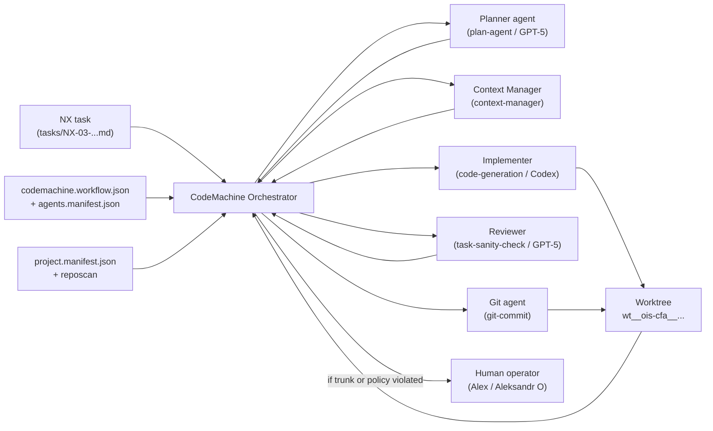

# Prompt
````prompt
You are Oracle, a focused one-shot problem solver. Emphasize direct answers, cite any files referenced, and clearly note when the search tool was used.  You are GPT‑5 Pro acting as a senior meta‑architect for **Agents & CodeMachine** in my AI‑assisted workspace.  Context: - I have a personal mono‑repo (`prj_Cifra-rwa-exachange-assets`) that acts as a control plane: manifests, memory-bank, AGENTS, RepoScan snapshots, and submodules like `ois-cfa`. - `ois-cfa` is the main team repo where domain code lives; mono‑repo must not leak into customer repos, but must give agents a clear, safe framework. - We already explored Trunk/Branches/Leaves, gitflow, NX‑00..NX‑08, and high‑level CodeMachine concepts. Now I want to go deeper specifically into **agents/AGENTS and CodeMachine workflows**.  I have attached: - `c2p_20251118-0905-context-reposcan-agents-structure-and-codemachine.txt`: aggregated context for RepoScan+Agents+CodeMachine (read this first); - `c2p_agents-structures.txt`: snapshot of how I currently describe agents (AGENTS.md patterns, Trees/Leaves/Agents, etc.); - `c2p_codemachine.txt`: snapshot of early CodeMachine ideas (roles, pipelines, map/reduce flows, etc.); - `c2p_ois-cfa.txt`: snapshot of `ois-cfa` (branch `infra.defis.deploy`) to ground examples; - `20251117-2103-gpt5pro-step4-all-and-nextsteps.gpt5p.md`: your previous V4‑style audit (Trunk/Branch/Leaf, NX‑00..NX‑08, agent rules); - `20251118-0905-feedback-gpt5pro-step4-all.md`: my spoken feedback (mono‑repo vs team repo, YAML frontmatter/tags, repo boundaries, RepoScan/Agents/CodeMachine expectations); - `AGENTS.md`: current global agent rules at mono‑repo root; - `project.manifest.json`: current project manifest (indices, manifests, roles) as an example of machine‑readable SSOT.  **High-level ask for this call:**  Design a **clear, implementable spec for Agents & CodeMachine** that: - defines how agents (GPT‑5, Codex, Claude, etc.) are described in machine‑readable form (JSON/manifest) and in AGENTS.md; - defines how CodeMachine uses these manifests + RepoScan + tasks to orchestrate agents over worktrees on macOS/eywa1; - respects Trunk/Branches/Leaves and the separation between mono‑repo (control plane) and `ois-cfa` (team repo).  What I need from you:  1) **Agent taxonomy & roles**    - In Russian (B2‑English terms OK), define a small taxonomy of agent roles for this workspace, e.g.:      - Planner (GPT‑5): reads RepoScan/manifests, designs plans.      - Implementer (Codex/Claude): edits code/tests.      - Reviewer (GPT‑5): reviews diffs and plans.      - Ops/Infra helper, Docs/Writer, etc.    - For each role, specify:      - allowed levels (Trunk/Branch/Leaf);      - typical tasks;      - which repos and branches they may touch (mono‑repo root vs `ois-cfa` submodule vs others).  2) **`agents.manifest.json` – high‑level structure**    - Propose a JSON structure (per workspace/mono‑repo) that describes agents and their rules. Include fields like:      - `id`, `name`, `provider` (OpenAI/Anthropic/etc.), `kind` (planner/implementer/reviewer/ops/docs);      - `allowed_levels` (trunk/branch/leaf);      - `repos` (which repos/submodules they may touch);      - `branches`/`worktrees` patterns they may operate on (e.g. `infra.defis.deploy`, `feature/*`, `wt__ois-cfa__*`);      - `tools` (shell, git, code editors);      - `safety_rules` (e.g. “no touching AGENTS.md”, “no Fabric topology changes”).    - Provide a pseudo‑JSON schema + 1–2 example agent entries (Planner GPT‑5, Implementer Codex) grounded in this mono‑repo.  3) **`codemachine.workflow.json` – how to model workflows**    - Design a JSON structure that describes a CodeMachine workflow for a target repo (e.g. `ois-cfa`) and a task (e.g. NX‑03 or NX‑00‑01):      - `id`, `target_repo`, `target_branch`, `worktree_path` pattern;      - `entrypoints` (which NX‑tasks or manifests it uses);      - `steps`: for each step – which agent role runs, what it consumes (RepoScan, tasks, manifests), what it produces (plan, patch, review);      - conditions (when to stop/ask human, when to auto‑continue);      - Trunk/Branch/Leaf constraints per step.    - Provide a concrete example (pseudo‑JSON) of a workflow for:      - NX‑00‑01: “Update AGENTS.md with Trunk/Branch/Leaf + Mermaid rules”; and      - NX‑03‑a: “Fix issuance tests & EF config” (leaf‑heavy task on `ois-cfa`@`infra.defis.deploy`).  4) **Interaction between AGENTS.md (Markdown) and agents.manifest.json (JSON)**    - Explain how you see the split:      - what lives in human‑facing AGENTS.md vs what lives in machine‑facing `agents.manifest.json`;      - how to keep them in sync (e.g. JSON is SSOT, AGENTS.md is “human projection”; or the opposite);      - how YAML frontmatter and tags in AGENTS.md can reference entries in `agents.manifest.json`.    - Output 5–10 bullets + 1–2 small YAML/JSON examples.  5) **CodeMachine orchestration model (focused on agents)**    - Describe, at a high level, how CodeMachine should:      - read `agents.manifest.json`, `reposcan.json`, `project.manifest.json`, and NX‑tasks;      - select the right agent/role and worktree for a given task (Trunk/Branch/Leaf + repo + branch);      - run map/reduce loops (planner → implementer(s) → reviewer → commit) while respecting all safety rules.    - Include 1 Mermaid diagram showing the CodeMachine/agents interaction (from task selection to commit).  6) **Concrete next steps (1–2 weeks) specifically for Agents & CodeMachine**    - Propose a short, actionable plan to:      - define a first `agents.manifest.json` for this mono‑repo;      - update AGENTS.md with the new rules/sections;      - implement a minimal CodeMachine v0 (even as a set of scripts/configs) that uses these manifests.    - Output as a table: `Step` / `Artifact` / `What to implement` / `Why now` / `Agent-friendly?`.  Style & format: - Answer in Russian, senior‑engineer tone, B2‑English terms OK. - Structure your answer as:   - TL;DR (3–5 bullets),   - Section 1: Agent taxonomy & roles,   - Section 2: agents.manifest.json,   - Section 3: codemachine.workflow.json,   - Section 4: AGENTS.md vs agents.manifest.json,   - Section 5: Orchestration model,   - Section 6: Next steps (table),   - Final compact table: `Area` / `Decision` / `Your recommendation`. - Do NOT restate all attached files; focus on synthesis and **executable** design.
````

# Output 
TL;DR

* Я использовал `file_search` по монорепе (AGENTS.md, project.manifest.json, Codemachine docs, agents-structures, reposcan‑контекст; см. цитаты в тексте).
* Агентная таксономия: **Planner / Implementer / Reviewer / Ops / Docs (+ Context/Git system‑агенты)** с жёсткими ограничениями по Trunk/Branch/Leaf и по репам (`monorepo` vs `ois-cfa`).
* `agents.manifest.json` = машинный SSOT для ролей/моделей/политик (уровни дерева, репы, ветки, worktrees, tools, safety‑rules). AGENTS.md = человекочитаемая проекция, привязанная к manifest через id/anchors.
* `codemachine.workflow.json` описывает task‑workflow (NX‑00 / NX‑03‑a): repo+branch+worktree, entrypoints (NX‑task, reposcan, manifests), steps (planner→context→implementer→reviewer→git), условия остановки и human‑gate.
* CodeMachine v0: тонкий оркестратор, который читает `project.manifest.json` + `agents.manifest.json` + `codemachine.workflow.json` и запускает нужные движки (GPT‑5/Codex/Claude) по worktree, уважая Trunk/Branch/Leaf и customer‑границу `ois-cfa`.

---

## Section 1. Agent taxonomy & roles

### 1.1. Базовые роли

(ориентируюсь и на уже существующие роли Codemachine: arch‑agent, plan‑agent, context‑manager, code‑generation, task‑sanity‑check, git‑commit и модули loop/trigger )

| Role (kind)                             | Типичный engine/model                                     | Уровни дерева (допускается писать)              | Репы/ветки, куда можно **писать**                                                    | Основные задачи                                                                                  |
| --------------------------------------- | --------------------------------------------------------- | ----------------------------------------------- | ------------------------------------------------------------------------------------ | ------------------------------------------------------------------------------------------------ |
| **Planner / Architect** (`planner`)     | GPT‑5 Pro / Claude Sonnet (через Codemachine / CloudCode) | Trunk (только docs), Branch                     | Monorepo root (`AGENTS.md`, manifests, docs), `ois-cfa` docs/context **RO**          | Планирование NX‑тасков, декомпозиция, дизайн workflow, high‑level arch‑правки                    |
| **Implementer / Coder** (`implementer`) | Codex CLI / Claude Code / Cursor                          | Leaf (основной), Branch (ограниченно)           | `ois-cfa` feature‑ветки (`feature/NX-*`) в worktrees; monorepo — только scripts v0   | Изменения кода/тестов/скриптов по NX‑таскам, без правки trunk‑контрактов                         |
| **Reviewer / Evaluator** (`reviewer`)   | GPT‑5 Pro / Claude                                        | Leaf, Branch (docs), Trunk (только review‑docs) | Monorepo docs, `ois-cfa` (diff‑обзор, ревью‑отчёты, без прямого пуша в main/develop) | Code review, тест‑ревью, план‑ревью, формирование DoD/решений                                    |
| **Ops / Infra helper** (`ops`)          | Codex CLI / Claude Code                                   | Branch (infra‑каркас), Leaf                     | `ois-cfa/ops/*`, CI/CD configs, Helm/YAML в ветках `infra*`, `feature/*`             | Скрипты деплоя, CI‑jobs, k8s manifests (кроме топологии Fabric/K8s), UK1 runbooks                |
| **Docs / Writer** (`docs`)              | GPT‑5 Pro / Claude / Gemini                               | Trunk (docs), Branch, Leaf                      | Monorepo docs, `docs-cfa-rwa` submodule, `ois-cfa/docs/context/*`                    | Описание архитектуры, AGENTS, README, контекстные доки под NX‑таски                              |
| **Context Manager** (`context`)         | GPT‑5 / Claude (Codemachine context-manager)              | Все уровни **RO**                               | Все репы **read‑only**                                                               | Сбор контекста: чтение reposcan, manifests, задач, генерация `context.md`                        |
| **Git / Commit agent** (`git`)          | Cursor / Codex                                            | Leaf                                            | `ois-cfa` feature‑ветки                                                              | Формирование и применение патчей, локальные коммиты; **никогда** не меняет main/develop напрямую |

### 1.2. Trunk / Branch / Leaf per role

* **Planner**

  * Trunk: может **предлагать** изменения (через MR‑описания, NX‑00 планы), но не пушит в main/develop/`infra.defis.deploy`.
  * Branch: может описывать рефакторинги и изменения сервисов, оставляя реализацию Implementer’у.
  * Leaf: обычно не нужен, кроме локальных планов для конкретной feature‑ветки.

* **Implementer**

  * Leaf: основная зона работы — feature‑ветки `feature/NX-*` в `ois-cfa`.
  * Branch: только мелкие правки, если есть явный NX‑task и human‑gate.
  * Trunk: запрещено (кроме генерить предложения в Markdown).

* **Reviewer**

  * Leaf/Branch: читает diff, но пишет только review‑docs/комментарии, не меняет контракты.
  * Trunk docs: может помочь правками в AGENTS/арх‑доках **по NX‑00 таскам** с human‑approve.

* **Ops**

  * Branch: изменения в `infra.defis.deploy`, `infra`, `deploy`, CI‑pipeline в ветках.
  * Trunk: только предложения в docs; **никаких** прямых правок топологии Fabric/K8s, core‑infra.

* **Docs**

  * Trunk: может обновлять текст в AGENTS.md и контекстных доках по явным NX‑00 задачам.
  * Branch/Leaf: любые пояснения/README, если соответствуют gitflow и не меняют контракты.

* **Context / Git**

  * Context: никогда не пишет в репо, только в `.codemachine/prompts/context.md` или аналог. 
  * Git: создаёт/обновляет Leaf‑ветки, делает коммиты и MR, но не изменяет remote‑конфиги и не пушит в `main/develop`.

### 1.3. Репы и ветки по ролям (граница monorepo vs `ois-cfa`)

С учётом того, что **монорепа — личный control‑plane Alex, а `ois-cfa` — customer/team‑репа и не должна знать о монорепе** :

* Любые **манIFESTы, AGENTS, CodeMachine‑конфиги** — хранятся и живут в монорепе.
* `ois-cfa` видит только свои `tasks/NX-*`, `docs/context/*` и код — **без ссылок** на `prj_Cifra-rwa-exachange-assets`.
* Planner/Docs/Reviewer работают по trunk‑докам и manifests в монорепе и затем оперируют `ois-cfa` через NX‑таски + worktrees.

---

## Section 2. `agents.manifest.json` – структура и примеры

### 2.1. Общая структура (псевдо‑schema)

```jsonc
{
  "schemaVersion": "1.0",
  "project": {
    "id": "prj_Cifra-rwa-exachange-assets",
    "manifest": "./project.manifest.json"
  },
  "repos": [
    {
      "id": "monorepo",
      "path": ".",
      "kind": "control-plane"
    },
    {
      "id": "ois-cfa",
      "path": "repositories/customer-gitlab/ois-cfa",
      "kind": "team-repo",
      "source": "customer-gitlab"
    }
  ],
  "roles": [
    {
      "id": "planner",
      "description": "High-level planning & architecture",
      "allowed_levels": ["trunk", "branch"]
    },
    {
      "id": "implementer",
      "description": "Code/test implementation for NX tasks",
      "allowed_levels": ["leaf"]
    },
    {
      "id": "reviewer",
      "description": "Diff and plan review",
      "allowed_levels": ["leaf", "branch", "trunk-docs"]
    }
    // ...
  ],
  "agents": [
    {
      "id": "planner-gpt5",
      "name": "Planner GPT-5",
      "provider": "openai",
      "model": "gpt-5-pro",
      "kind": "planner",
      "description": "Reads RepoScan, manifests and NX tasks to produce executable plans.",
      "allowed_levels": ["trunk-docs", "branch"],
      "permissions": {
        "repos": [
          {
            "repo_id": "monorepo",
            "read": true,
            "write": ["docs", "agents-rules"],
            "max_level_write": "trunk-docs"
          },
          {
            "repo_id": "ois-cfa",
            "read": true,
            "write": [],
            "max_level_write": null
          }
        ],
        "branch_patterns": {
          "include": ["main", "develop", "infra.defis.deploy", "release/*"],
          "exclude": ["hotfix/*"]
        },
        "worktrees": {
          "pattern": "wt__{repo}__{branch}",
          "allowed": [
            "../wt__ois-cfa__infra",
            "../wt__ois-cfa__deploy",
            "../wt__ois-cfa__main"
          ]
        }
      },
      "tools": ["shell-ro", "git-ro", "reposcan", "codemachine"],
      "safety_rules": [
        "no_edit:manifests/*.json",
        "no_edit:repositories/customer-gitlab/ois-cfa/*",
        "no_force_push",
        "no_k8s_or_fabric_topology"
      ],
      "doc_anchor": "AGENTS.md#planner-gpt-5"
    },

    {
      "id": "impl-codex",
      "name": "Codex Implementer",
      "provider": "codex-cli",
      "model": "gpt-5-code-medium",
      "kind": "implementer",
      "description": "Implements NX tasks in ois-cfa feature branches.",
      "allowed_levels": ["leaf"],
      "permissions": {
        "repos": [
          {
            "repo_id": "ois-cfa",
            "read": true,
            "write": ["code", "tests", "scripts"],
            "max_level_write": "leaf"
          }
        ],
        "branch_patterns": {
          "include": ["feature/NX-*"],
          "require_base": "infra.defis.deploy"
        },
        "worktrees": {
          "pattern": "wt__{repo}__{branch}",
          "allowed_pattern": "../wt__ois-cfa__*"
        }
      },
      "tools": ["shell", "git-local", "editor"],
      "safety_rules": [
        "no_edit:AGENTS.md",
        "no_edit:manifests/*.json",
        "no_edit:ops/k8s/fabric-topology/*.yml",
        "no_push_to:main",
        "no_push_to:develop"
      ],
      "doc_anchor": "AGENTS.md#impl-codex"
    }
  ]
}
```

Ключевые моменты:

* `project.manifest.json` уже SSOT для submodules/реп и окружений  — `agents.manifest.json` просто добавляет поверх слой **policy**.
* `repos` в agents‑manifest — это *view* на те же пути, что и в project.manifest, чтобы не дублировать знания.
* `permissions.branch_patterns` и `permissions.worktrees` жёстко кодируют правила gitflow/worktrees (`wt__{repo}__{branch}`), не давая Codex/Claude выйти за отведённые ветки.
* `safety_rules` — список простых string‑политик; их будет интерпретировать слой CodeMachine v0 или твой CLI‑оракул.

---

## Section 3. `codemachine.workflow.json` – моделирование workflow

### 3.1. Структура workflow

Псевдо‑структура JSON (читается твоим оркестратором и мапится на CodeMachine main/sub‑agents и modules ):

```jsonc
{
  "schemaVersion": "1.0",
  "id": "nx-03a-issuance-tests",
  "kind": "nx-task",
  "tree_level": "leaf",
  "target": {
    "repo_id": "ois-cfa",
    "default_branch": "infra.defis.deploy",
    "feature_branch_pattern": "feature/NX-03-*",
    "worktree_path": "../wt__ois-cfa__infra"
  },
  "entrypoints": {
    "nx_task": "repositories/customer-gitlab/ois-cfa/tasks/NX-03-issuance-tests.md",
    "project_manifest": "./project.manifest.json",
    "agents_manifest": "./manifests/agents.manifest.json",
    "reposcan": "./reposcan/20251111-1325-gpt5p-ois-cfa.shtgn.reposcan.json"
  },
  "steps": [
    {
      "id": "plan",
      "name": "Plan NX-03-a",
      "role": "planner",
      "agent_id": "planner-gpt5",
      "level": "branch",
      "cm_agent": "plan-agent",
      "inputs": ["entrypoints.nx_task", "entrypoints.reposcan", "entrypoints.project_manifest"],
      "outputs": ["artifacts/nx-03a-plan.md"],
      "human_gate": {
        "required": false
      }
    },
    {
      "id": "context",
      "name": "Assemble Context",
      "role": "context",
      "agent_id": "context-gpt5",
      "level": "branch",
      "cm_agent": "context-manager",
      "inputs": ["artifacts/nx-03a-plan.md", "entrypoints.reposcan"],
      "outputs": [".codemachine/prompts/context-nx-03a.md"]
    },
    {
      "id": "implement",
      "name": "Implement tests & EF config",
      "role": "implementer",
      "agent_id": "impl-codex",
      "level": "leaf",
      "cm_agent": "code-generation",
      "branch_policy": {
        "create_feature_if_missing": true,
        "feature_from": "infra.defis.deploy",
        "feature_name": "feature/NX-03-issuance-tests"
      },
      "worktree": "target.worktree_path",
      "inputs": ["artifacts/nx-03a-plan.md", ".codemachine/prompts/context-nx-03a.md"],
      "outputs": ["git_patch", "updated_files"],
      "limits": {
        "max_files_changed": 10,
        "max_loc_changed": 400
      }
    },
    {
      "id": "review",
      "name": "Review implementation",
      "role": "reviewer",
      "agent_id": "review-gpt5",
      "level": "branch",
      "cm_agent": "task-sanity-check",
      "inputs": ["git_diff", "entrypoints.nx_task"],
      "outputs": ["artifacts/nx-03a-review.md"],
      "human_gate": {
        "required": true,
        "block_on": ["tests_failing", "breaking_change_detected"]
      }
    },
    {
      "id": "commit",
      "name": "Commit & conclude",
      "role": "git",
      "agent_id": "git-cursor",
      "level": "leaf",
      "cm_agent": "git-commit",
      "conditions": {
        "require_human_approval_from_step": "review"
      },
      "outputs": ["git_commit_sha"]
    }
  ],
  "completion": {
    "on_success": "MR_TO_INFRA_DEFIS_DEPLOY",
    "on_failure": "STOP_AND_NOTIFY"
  }
}
```

### 3.2. Пример workflow: NX‑00‑01 (Update AGENTS.md T/B/L rules)

Это Trunk‑doc задача в **монорепе**, но всё равно описывается как workflow, чтобы Planner/Docs/Reviewer работали по правилам:

```jsonc
{
  "schemaVersion": "1.0",
  "id": "nx-00-01-agents-tbl",
  "kind": "nx-meta",
  "tree_level": "trunk-docs",
  "target": {
    "repo_id": "monorepo",
    "default_branch": "main",
    "worktree_path": "."
  },
  "entrypoints": {
    "nx_task": "memory-bank/tasks-meta/NX-00-01-agents-tbl.md",
    "project_manifest": "./project.manifest.json",
    "agents_manifest": "./manifests/agents.manifest.json"
  },
  "steps": [
    {
      "id": "plan",
      "role": "planner",
      "agent_id": "planner-gpt5",
      "level": "trunk-docs",
      "cm_agent": "plan-agent",
      "inputs": ["entrypoints.nx_task", "entrypoints.project_manifest"],
      "outputs": ["artifacts/nx-00-01-plan.md"],
      "human_gate": { "required": false }
    },
    {
      "id": "draft-doc",
      "role": "docs",
      "agent_id": "docs-gpt5",
      "level": "trunk-docs",
      "cm_agent": "code-generation",
      "inputs": ["artifacts/nx-00-01-plan.md"],
      "outputs": ["AGENTS.md.patch"],
      "safety": {
        "paths_allowed": ["AGENTS.md"],
        "no_touch": ["manifests/*.json", "repositories/**"]
      }
    },
    {
      "id": "review",
      "role": "reviewer",
      "agent_id": "review-gpt5",
      "level": "trunk-docs",
      "cm_agent": "task-sanity-check",
      "inputs": ["AGENTS.md.patch", "entrypoints.nx_task"],
      "outputs": ["artifacts/nx-00-01-review.md"],
      "human_gate": {
        "required": true,
        "block_on": ["unclear_rules", "trunk_policy_violation"]
      }
    },
    {
      "id": "commit",
      "role": "git",
      "agent_id": "git-cursor",
      "level": "trunk-docs",
      "cm_agent": "git-commit",
      "conditions": { "require_human_approval_from_step": "review" },
      "outputs": ["git_commit_sha"]
    }
  ]
}
```

Главное: **никакие workflow NX‑00 не дают авто‑commit в main без human‑gate**.

---

## Section 4. AGENTS.md vs agents.manifest.json

С учётом текущего AGENTS.md (правила, manifests, people/domains/flows) и того, что `project.manifest.json` уже указывает на AGENTS как конвенцию для агентов :

### 4.1. Разделение ответственности

1. **`agents.manifest.json` = машинный SSOT**

   * идентификаторы агентов (`agent_id`), роли, provider/model, политики доступа (репы, ветки, уровни дерева), safety‑rules;
   * используется CodeMachine, CLI‑скриптами и другими агентами программно.

2. **AGENTS.md = человекочитаемая «проекция»**

   * объясняет, *зачем* такие роли/агенты, как ими пользоваться, примеры;
   * содержит ссылки/anchors на `agents.manifest.json` (по `agent_id` и `doc_anchor`).

3. **Происхождение правды**

   * Если расходятся AGENTS.md и `agents.manifest.json` по правам/уровням — истинным считается **manifest**, AGENTS должен быть выровнен.
   * CI/линтер позже может сравнивать и выдавать предупреждения.

4. **YAML frontmatter в AGENTS.md**

   * указывает путь до manifest и версию синхронизации:

     ```yaml
     ---
     created: 2025-10-30 19:04
     updated: 2025-11-18 10:30
     type: project-rules
     version: 1.4.0
     agents_manifest: ./manifests/agents.manifest.json
     tags: [agents, codemachine, trunk]
     ---
     ```

5. **Связка секций AGENTS с agents.manifest**

   * каждая секция роли/агента получает anchor с id manifest:

     ```md
     ### Planner GPT-5 (`agent_id: planner-gpt5`)

     - kind: planner
     - levels: trunk-docs, branch
     - provider: openai, model: gpt-5-pro
     - см. `agents.manifest.json > agents[].id == "planner-gpt5"`
     ```

6. **Обратная ссылка из manifest**

   * в agents.manifest поле `doc_anchor` хранит ссылку вида `AGENTS.md#planner-gpt-5-agent-id-planner-gpt5` для навигации.

7. **Tags как индекс**

   * frontmatter‑теги уровней дерева: `tags: [agents, trunk, planner]` позволяют RepoScan/индексатору строить быстроту поиска контекста для агентов.

8. **Обновление**

   * при изменении ролей/политик: сначала PR в `agents.manifest.json` + линтер маппинга, затем обновление AGENTS.md по результатам.

---

## Section 5. CodeMachine orchestration model (focused on agents)

Опираюсь на оригинальный Codemachine CLI: main/sub‑agents, modules (loop/trigger), context‑manager и git‑commit/ task‑sanity‑check.

### 5.1. High-level pipeline

1. **Task selection**

   * Оператор или мета‑агент выбирает NX‑таск (например, NX‑03‑a) и соответствующий `codemachine.workflow.json`.
   * Указывается `tree_level` (trunk/branch/leaf) и target (repo/branch/worktree).

2. **Context bootstrap**

   * Оркестратор читает:

     * `project.manifest.json` → где лежат submodules, какие окружения/серверы.
     * `agents.manifest.json` → какие агенты и права.
     * `reposcan/*.shtgn.json` → снимок файла/структуры для целевого repo (аналог Architecture Manifest).
     * NX‑task (`tasks/NX-*`) → постановка задачи.
   * Запускается Codemachine workspace (`.codemachine/`), если его нет — создаётся по дефолтному бутстрапу.

3. **Agent selection**

   * Для каждого `step` в workflow по полям `role` и `agent_id` выбирается:

     * движок (Codex/Claude/GPT‑5/Cursor);
     * соответствующий Codemachine main agent (`plan-agent`, `context-manager`, `code-generation`, `task-sanity-check`, `git-commit` и т.п.). 
   * Проверяется policy: `allowed_levels`, `branch_patterns`, `worktrees`, `safety_rules` → если step нарушает policy, остановка и запрос к человеку.

4. **Execution (map / reduce)**

   * `Planner` (plan‑agent) генерит план → артефакт `plan.md`.
   * `Context Manager` собирает контекст → `.codemachine/prompts/context.md`. 
   * Один или несколько `Implementer`‑шагов (code‑generation) в нужных worktrees создают/обновляют код.
   * `Reviewer` (task‑sanity-check + возможно отдельный GPT‑reviewer) валидирует по DoD и NX‑описанию. 
   * `Modules` (`check-task`, `iteration-checker`) управляeт циклами: повторить шаги, если не достижен DoD или есть ошибки.

5. **Safety gates**

   * Для **trunk‑уровня** шаги с `level: trunk-docs` всегда имеют `human_gate.required = true`.
   * Для Branch‑уровня infra‑шагов `Ops` агент не может менять Fabric/K8s topology — это зашито в `safety_rules`.
   * Для Leaf‑уровня разрешён авто‑commit в feature‑ветки, но с лимитом на размер diff и обязательным review step.

6. **Commit and MR**

   * Git‑agent (git‑commit) только коммитит в feature‑ветку/локальную ветку, не трогает remotes/branch‑policies.
   * Создание MR/PR делается либо человеком, либо отдельным безопасным экшеном, который тоже читает agents‑policies.

### 5.2. Mermaid: CodeMachine + Agents interaction



---

## Section 6. Next steps (1–2 weeks) для Agents & CodeMachine

### 6.1. План как таблица

| Step | Artifact                                          | What to implement                                                                                                                                                                                                | Why now                                                                                                  | Agent-friendly?                                                                                                      |
| ---- | ------------------------------------------------- | ---------------------------------------------------------------------------------------------------------------------------------------------------------------------------------------------------------------- | -------------------------------------------------------------------------------------------------------- | -------------------------------------------------------------------------------------------------------------------- |
| 1    | `manifests/agents.manifest.json` v0.1             | Создать v0 manifest по предложенной схеме: базовые `roles` + 3–4 агента (planner‑gpt5, impl‑codex, review‑gpt5, git‑cursor) с минимальным набором `permissions` и `safety_rules`.                                | Это новый SSOT для оркестрации; без него CodeMachine не понимает, кого где запускать.                    | ✅ Да: можно поручить Codex/Claude с DoD «валидный JSON + маппинг на текущие CLI/движки».                             |
| 2    | `AGENTS.md` (обновлённый)                         | Добавить frontmatter‑поле `agents_manifest`, раздел «Trees / Branches / Leaves & Agent Roles» и блок «Rules for all AI agents» (см. ниже), сославшись на manifest.                                               | Все агенты уже читают AGENTS как вход; нужно завести туда линки на manifest и правила Trunk/Branch/Leaf. | ✅ Да, с NX‑00‑01: текст может сгенерировать агент, ты ревьюишь.                                                      |
| 3    | `.codemachine/` workspace в монорепе              | Инициализировать Codemachine в корне монорепы (`codemachine -d .`), настроить базовые config/main.agents.js и modules.js, добавив ссылки на существующие план/контекст/код‑агентов из оригинального Codemachine. | Нужен единый entrypoint (CLI + конфиги) для всех дальнейших workflow.                                    | ⚠️ Частично: bootstrap и простые правки может сделать агент, но финальную структуру config’ов лучше собрать вручную. |
| 4    | `codemachine/workflows/nx-00-01.workflow.json`    | Закодировать NX‑00‑01 workflow (обновление AGENTS) в JSON, как в примере; добавить скрипт `scripts/run-workflow.cjs`, который читает JSON и вызывает Codemachine шаги.                                           | Это «обкатка» схемы на безопасной trunk‑doc задаче.                                                      | ✅ Да, кроме написания самого Node‑скрипта, который лучше быстро набросать вручную.                                   |
| 5    | `codemachine/workflows/nx-03a.workflow.json`      | Описать workflow NX‑03‑a (issuance tests & EF config) через planner→context→implementer→reviewer→git с запертой зоной `feature/NX-03-*` worktree.                                                                | Первый реальный Leaf‑workflow, максимально репрезентативный для будущих задач.                           | ✅ Да, после того как manifest/AGENTS и скрипт из шага 4 будут готовы.                                                |
| 6    | Mini‑runbook `docs/context/AGENTS-CODEMACHINE.md` | Краткий doc: «Как запускать CodeMachine‑workflow из монорепы, как читаются manifests, как подключаются NX‑таски».                                                                                                | Чтобы другие агенты/люди могли быстро подключиться к оркестратору с нулевым контекстом.                  | ✅ Да, практически полностью может написать GPT‑5 по этому ответу.                                                    |

---

## Final compact table: Area / Decision / Recommendation

| Area               | Decision                                                                                                                                                                       | Your recommendation                                                                                                                                      |
| ------------------ | ------------------------------------------------------------------------------------------------------------------------------------------------------------------------------ | -------------------------------------------------------------------------------------------------------------------------------------------------------- |
| Agent roles        | Вводим чёткую таксономию: Planner / Implementer / Reviewer / Ops / Docs + Context/Git system‑агенты с жёсткими правами по Trunk/Branch/Leaf и репам.                           | Закрепить в `agents.manifest.json` и AGENTS.md; любая новая роль сначала через PR в manifest.                                                            |
| Repos & boundaries | Монорепа = control‑plane (manifests, AGENTS, Codemachine, RepoScan); `ois-cfa` = customer team‑repo, без ссылок на монорепу.                                                   | Все orchestrator‑конфиги и agents‑rules храним в монорепе; `ois-cfa` только читает свои tasks/docs.                                                      |
| Agents manifest    | `agents.manifest.json` — машинный SSOT для агентов и политик; ссылается на `project.manifest.json` для реп/окружений.                                                          | Сделать v0.1 в ближайшие дни и сразу подключить к простому CLI‑орchestrator’у.                                                                           |
| Workflows          | `codemachine.workflow.json` описывает NX‑таски: target repo/branch/worktree, steps и human‑gates; затем мапится в Codemachine main/sub‑agents.                                 | Сначала реализовать 2 эталонных workflow (NX‑00‑01, NX‑03‑a), потом масштабировать по аналогии.                                                          |
| AGENTS vs manifest | AGENTS.md = human‑projection (описания, правила, UX); `agents.manifest.json` = policy‑SSOT, привязанный через anchors/frontmatter.                                             | Ввести frontmatter‑связку и регулярно прогонять линтер, сверяющий AGENTS.md с manifest.                                                                  |
| Orchestration      | CodeMachine v0 читает project/agents/workflow‑manifests + reposcan, выбирает агентов и гоняет pipeline planner→context→implementer→reviewer→git с respect к Trunk/Branch/Leaf. | Реализовать как минимальный Node/Python‑скрипт, не пытаясь сразу переписать сам Codemachine; сначала «тонкий управляющий слой» над уже существующим CLI. |

Если хочешь, следующим шагом могу выдать конкретный шаблон `scripts/run-workflow.cjs`, который читает `codemachine.workflow.json` и запускает шаги через `codemachine step <agent-id>` с проверкой `agents.manifest.json`.
