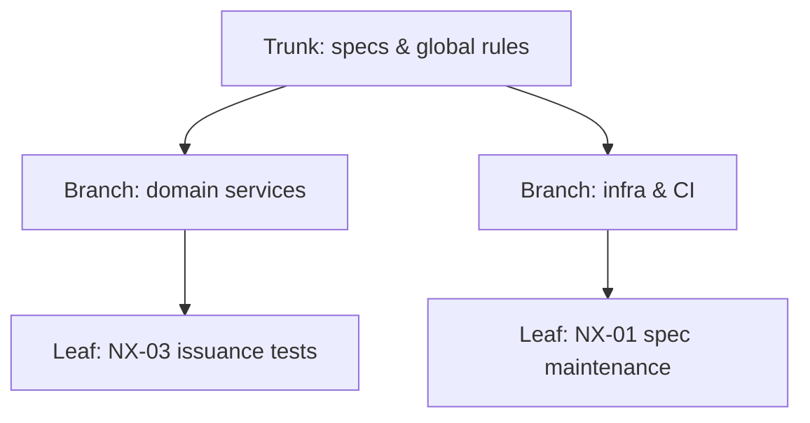
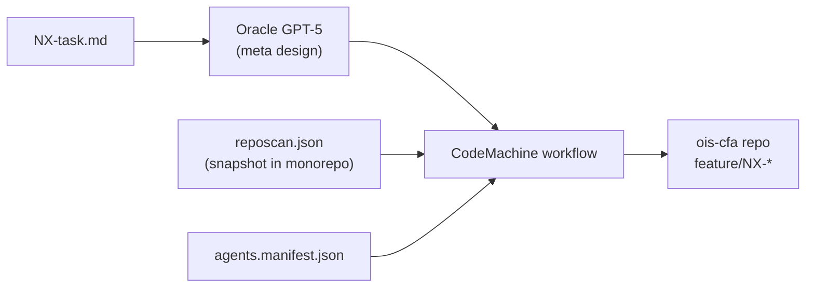

# Prompt
You are Oracle, a focused one-shot problem solver. Emphasize direct answers, cite any files referenced, and clearly note when the search tool was used.  You are GPT‑5 Pro acting as a senior meta‑architect and "final Oracle" for my AI‑assisted workspace.  Context (must internalise): - I have a personal mono‑repo `prj_Cifra-rwa-exachange-assets` (manifests, memory-bank, AGENTS, submodules like `repositories/customer-gitlab/ois-cfa`). - `ois-cfa` is the main team repo; mono‑repo is my **control plane** and must not leak into customer repos. - You have already produced several deep audits (V1/V2/V3/V4) for `ois-cfa` and infra, plus three fresh step5 reports:   - 20251118-1321-gpt5pro-step5-cohere-json-markdown.gpt5p.md — global JSON+Markdown framework (RepoScan, agents.manifest, workflows, YAML frontmatter);   - 20251118-1322-gpt5pro-step5-reposcan.gpt5p.md — focused RepoScan v1 design;   - 20251118-1323-gpt5pro-step5-agents-and-codemachine.gpt5p.md — Agents & CodeMachine design. - I also gave you spoken feedback (especially 20251118-0905-*) about:   - mono‑repo vs team‑repo boundaries,   - need for a full Trunk/Branches/Leaves model (including Branch level),   - desire to drive everything with Mermaid diagrams (visual ADHD),   - the idea of NX‑00 meta‑tasks and using Oracle GPT‑5 Pro as "connect‑the‑dots" brain.  I have attached: - `c2p_aggregated-gpt5pro-talks.txt`: aggregated code2prompt snapshot with your step3/4/5 reports and my feedback (step3 all‑together, step4 + feedback, step5 trio); - `c2p_20251118-0905-context-reposcan-agents-structure-and-codemachine.txt`: context for RepoScan/Agents/CodeMachine; - `c2p_reposcan.txt`: current RepoScan ideas/experiments; - `c2p_agents-structures.txt`: current agent/AGENTS structure ideas; - `c2p_codemachine.txt`: current CodeMachine ideas; - `c2p_ois-cfa.txt`: snapshot of `ois-cfa` (branch `infra.defis.deploy`) as concrete example; - `AGENTS.md`: current global agent rules at mono‑repo root; - `project.manifest.json`: current project manifest for mono‑repo; - `WBS-OIS.md`: WBS for `ois-cfa` with NX‑01..NX‑08; - `20251117-1518-conversation-AlexA-AleksandrO.md`: conversation about NX‑tasks and expectations.  **High-level ask:**  1) **Validate and refine step5 vs my 0905 feedback**    - In Russian (B2‑English terms OK), briefly assess whether the three step5 reports (cohere‑json‑markdown, reposcan, agents+codemachine) fully satisfy the intent of my 0905 feedback, especially:      - mono‑repo vs team‑repo boundaries,      - complete Trunk/Branches/Leaves model (with Branch layer),      - strong use of Mermaid diagrams as visual backbone,      - clear place for RepoScan/Agents/CodeMachine in the OS.    - If you see 1–3 important gaps or inconsistencies, list them explicitly.  2) **Design the NX‑00 series as a glue‑layer for everything**    - I want to define a small set of NX‑00 meta‑tasks that must be executed **before** NX‑01..NX‑08, and that encode your latest design into concrete work for me.    - Propose 4–7 NX‑00 tasks (NX‑00‑01, NX‑00‑02, …) such as:      - updating AGENTS.md with Trunk/Branch/Leaf + Mermaid rules;      - creating TREES-LEAVES-AGENTS-OIS.md;      - defining initial `reposcan.json` skeleton for `ois-cfa`;      - defining initial `agents.manifest.json` and `codemachine.workflow.json` skeletons;      - documenting worktrees and gitflow usage.    - For each NX‑00 task provide:      - `NX-00-ID`;      - `Target location` (mono‑repo file paths);      - `Goal` (1–2 строки);      - `Steps` (3–7 bullets, конкретные действия);      - `Done-when` (3–5 bullets DoD);      - `Agent-friendly?` (yes/no/partial + 1 строка, какой агент и в какой роли).  3) **Map NX‑00 + NX‑01..NX‑08 to Trunk/Branches/Leaves and agent types**    - For each of:      - NX‑00‑* from section 2,      - NX‑01..NX‑08 from WBS‑OIS,    - classify:      - `Level` = trunk / branch / leaf (можно trunk‑advisory/branch‑heavy/leaf‑heavy, если нужно);      - `Preferred execution` = human‑only / GPT‑5 Oracle / Codex/Claude (implementer) / CodeMachine pipeline;      - `Notes` (1–2 строки: почему именно так, какие риски).    - Output as a table, чтобы я мог использовать её как матрицу для выбора инструмента.  4) **Mermaid plan: where diagrams are must‑have**    - You know I am a visual thinker and want Mermaid diagrams **per major section** of the OS.    - Propose a concrete “Mermaid plan”:      - which diagrams must exist and в каких файлах (e.g. TREES-LEAVES-AGENTS-OIS.md, RepoScan doc, Agents/CodeMachine doc, gitflow/worktrees doc, NX‑roadmap doc);      - для каждого: краткое описание (что рисуем, какие ноды/рёбра);      - как агенты должны относиться к этим диаграммам (обновлять vs только читать).    - Output as a bullet list + 1–2 примерных Mermaid‑фрагмента (упрощённых, но репрезентативных).  5) **When to call Oracle GPT‑5 vs Codex vs CodeMachine**    - Based on all previous reports and the new NX‑00 design, give me a **practical decision rule**:      - когда запускать Oracle GPT‑5 Pro (типа current call) — какие виды задач это оправдывает;      - когда достаточно Codex/Claude/"implementer"‑агента в одиночку;      - когда имеет смысл запускать полноценный CodeMachine workflow (map/reduce, planner→implementer→reviewer).    - Output as 5–10 bullets + a small decision table: `Task pattern` / `Level` / `Preferred tool` / `Why`.  Style & format: - Answer in Russian, senior‑engineer tone, B2‑English terms OK. - Structure your answer as:   - TL;DR (3–5 bullets),   - Section 1: Step5 vs 0905 feedback (validation & gaps),   - Section 2: NX‑00 series design,   - Section 3: Mapping NX‑00 + NX‑01..NX‑08 to Levels & tools (table),   - Section 4: Mermaid plan,   - Section 5: When to call Oracle vs Codex vs CodeMachine,   - Final compact table: `Area` / `Decision` / `Your recommendation`. - Do NOT restate full contents of attached files; focus on synthesis and **executable** guidance I can apply from the mono‑repo root on eywa1.

# Output
* Я просмотрел вложения через `file_search` (aggregated step3/4/5, 0905‑контекст, RepoScan/Agents/CodeMachine, AGENTS.md, project.manifest.json, WBS‑OIS, разговор 1518). См. ссылки в тексте.
* Step5 в целом реализует твой 0905‑фидбек: чётко разводит монорепо (control plane: `.cifra/.codemachine`, AGENTS, manifests, RepoScan) и `ois-cfa` (team‑repo), использует Trunk/Branch/Leaf во всех артефактах и встраивает RepoScan/Agents/CodeMachine в одну ОС.
* Основные дыры: нет оформленных NX‑00 тасков для `.cifra`/RepoScan/CodeMachine, Mermaid не закреплён как обязательный “каркас” по файлам/ролям, и T/B/L‑теги ещё не доведены до фактических docs/NX‑тасков/манифестов.
* Предлагаю серию NX‑00‑01..07: 01–05 — документационный каркас (TLA, AGENTS, README, gitflow, WBS↔NX↔T/B/L), 06 — RepoScan v1 в монорепе, 07 — `agents.manifest.json` + базовый CodeMachine workflow, строго в control plane.
* Ниже — матрица уровней (Trunk/Branch/Leaf) для NX‑00 и NX‑01..06, Mermaid‑план и практическое правило “когда звать Oracle / когда Codex / когда CodeMachine”.

---

## 1. Step5 vs 0905‑фидбек (валидация + дыры)

### 1.1. Что уже закрыто

**1) Граница монорепо vs team‑repo**

* Step5 явно фиксирует: монорепо = control plane (`.cifra`, `.codemachine`, AGENTS, workflows, snapshots RepoScan), `ois-cfa` = чистый customer‑репо с кодом/доками, без артефактов оркестрации. 
* RepoScan‑снимки предлагается хранить **только в монорепе**: `snapshots/reposcan/{repo-id}/{branch}.reposcan.json`, с относительными путями внутрь `ois-cfa`, без утечки личных путей/хостов.
* `project.manifest.json` уже знает про субмодуль `ois-cfa` и его remotes, но пока не знает про `.cifra`/RepoScan/agents.manifest — это и есть зазор на NX‑00. 

**Вывод:** по архитектуре и правилам граница описана корректно, но не материализована в файловой структуре.

---

**2) Trunk / Branches / Leaves (с явным Branch‑слоем)**

* В V4/step4 у тебя уже есть чёткие определения Trunk/Branch/Leaf + 2 Mermaid‑диаграммы: дерево архитектуры и gitflow (main/develop/infra.defis.deploy/feature/NX-*).
* Step5 для RepoScan кодирует T/B/L **per‑node** (`level: "trunk"|"branch"|"leaf"`) и связывает это с NX‑индексом и anchors.
* В agents/CodeMachine T/B/L используется в `allowed_levels` для агентов и в `tree_level` для шагов workflow.
* `infra.defis.deploy` везде последовательно трактуется как **Branch‑уровень integration**, а не trunk.

**Вывод:** концептуально Branch‑слой введён и консистентен, но метки уровня ещё не прожились во всех фактических artefacts (WBS, NX‑tasks, YAML frontmatter).

---

**3) Mermaid как визуальный backbone**

* В step3/4 ты уже получил 2 ключевые Mermaid‑диаграммы: “Tree (Trunk→Branches→Leaves)” и “Gitflow vs T/B/L”.
* Step5 для CodeMachine добавляет Mermaid‑диаграмму pipeline planner→context→implementer→reviewer→git, и для RepoScan описан поток “FS scan → groups → nx_index → JSON”.

**Проблема:** нигде не зафиксировано *где именно* эти диаграммы должны жить (какие файлы) и кто имеет право их менять. Сейчас это “диаграммы в отчёте”, а не часть ОС.

---

**4) Место RepoScan / Agents / CodeMachine в ОС**

* RepoScan v1: один `reposcan.json` на репо/ветку, с узлами (services/apps/packages/docs/tests), доменами, T/B/L, anchors и `nx_index`, хранится в монорепе в `snapshots/reposcan/...`.
* Agents: `agents.manifest.json` как машинный SSOT (id, provider, allowed_levels, repos/branches/worktrees, safety_rules), AGENTS.md как человекочитаемая проекция + YAML frontmatter с ссылкой на manifest.
* CodeMachine: читает `project.manifest.json`, `agents.manifest.json`, `reposcan.json` и NX‑таск, выбирает правильный агент/уровень/ветку и гоняет pipeline (planner → context → implementer → reviewer → git) строго по T/B/L и safety‑правилам.

**Вывод:** архитектурное место этих трёх штук в ОС определено чётко, в линию с 0905‑фидбеком.

---

### 1.2. 3 ключевые дыры/несостыковки

1. **Нет NX‑00 для control plane (`.cifra`/RepoScan/CodeMachine)**

   * NX‑00‑01..05 уже определены для TLA‑doc, AGENTS sync, README для `tasks/` и `docs/context/`, gitflow+worktrees и WBS↔NX↔Tree.
   * Но нет NX‑00 задач, которые:

     * создают `snapshots/reposcan/...` с первым `reposcan.json` для `ois-cfa@infra.defis.deploy`;
     * вводят `agents.manifest.json` v0.1;
     * инициализируют минимальный CodeMachine workspace/`workflow.json`.

2. **Mermaid не закреплён как обязательный контент**

   * Диаграммы уже спроектированы, но нет явных правил: “такие-то файлы обязаны их содержать, редактируются только через NX‑00‑таски, остальные агенты — read‑only”.

3. **T/B/L‑метки и YAML frontmatter не доведены до рабочих docs/NX**

   * В `WBS-OIS.md` и NX‑тасках пока нет поля `tree_level` / `level` в frontmatter.
   * AGENTS.md сейчас не имеет ни YAML frontmatter, ни ссылки на `agents.manifest.json`, хотя именно это было решением в step5.

Эти три дыры и надо закрыть NX‑00‑серией.

---

## 2. NX‑00 series: клеящий слой перед NX‑01..NX‑08

Ниже — 7 NX‑00 задач. Все пути — **от корня монорепы**.

### Таблица NX‑00

| NX-00-ID                                              | Target location (артефакты)                                                                                                                                             | Goal (1–2 строки)                                                                                                                                                                               | Steps (3–7 bullets)                                                                                                                                                                                                                                                                                                                                                                                                                                                                                                                                                                                                                                                                            | Done-when (3–5 bullets)                                                                                                                                                                                                                                                                                          | Agent-friendly?                                                                                                                             |     |                                                                                                                                                                                                      |                                                                                                                                                      |                                                                                                                  |
| ----------------------------------------------------- | ----------------------------------------------------------------------------------------------------------------------------------------------------------------------- | ----------------------------------------------------------------------------------------------------------------------------------------------------------------------------------------------- | ---------------------------------------------------------------------------------------------------------------------------------------------------------------------------------------------------------------------------------------------------------------------------------------------------------------------------------------------------------------------------------------------------------------------------------------------------------------------------------------------------------------------------------------------------------------------------------------------------------------------------------------------------------------------------------------------- | ---------------------------------------------------------------------------------------------------------------------------------------------------------------------------------------------------------------------------------------------------------------------------------------------------------------- | ------------------------------------------------------------------------------------------------------------------------------------------- | --- | ---------------------------------------------------------------------------------------------------------------------------------------------------------------------------------------------------- | ---------------------------------------------------------------------------------------------------------------------------------------------------- | ---------------------------------------------------------------------------------------------------------------- |
| **NX‑00‑01 — TLA Core**                               | `repositories/customer-gitlab/ois-cfa/docs/context/TREES-LEAVES-AGENTS-OIS.md` (новый) + правка `.../PROJECT-CONTEXT.md`                                                | Зафиксировать модель Trunk/Branches/Leaves + gitflow для `ois-cfa` в одном TLA‑doc, с 2 Mermaid‑диаграммами и ссылкой из PROJECT‑CONTEXT.                                                       | • Создать TLA‑doc с: краткими определениями Trunk/Branch/Leaf, таблицей уровней, 2 диаграммами (дерево архитектуры и gitflow vs T/B/L).  • В `PROJECT-CONTEXT.md` добавить раздел “TLA & текущее состояние (infra.defis.deploy + UK1)” с ссылкой на новый doc.  • Вставить ссылку на TLA‑doc в WBS и NX‑таски как “обязательный контекст”.  • Обновить YAML frontmatter в обоих файлах с `level: trunk` и тегами `[tla, nx]`.                                                                                                                                                                                                                                                                  | • `TREES-LEAVES-AGENTS-OIS.md` существует, мерджится без конфликтов.  • Внутри есть таблица уровней + 2 валидные Mermaid‑блока.  • `PROJECT-CONTEXT.md` ссылается на TLA‑doc.  • В минимум одном NX‑task явно есть ссылка “см. TLA‑doc”.                                                                         | **Partial** — черновик текста+диаграмм может собрать агент, но финальные формулировки и риски должен подтвердить ты.                        |     |                                                                                                                                                                                                      |                                                                                                                                                      |                                                                                                                  |
| **NX‑00‑02 — AGENTS Sync**                            | `AGENTS.md` + symlink `CLAUDE.md`                                                                                                                                       | Встроить T/B/L, gitflow и правила агентов в глобальный AGENTS, связать его с `agents.manifest.json` (пока пустой скелет).                                                                       | • Добавить YAML frontmatter с полями `type: project-rules`, `agents_manifest: ./manifests/agents.manifest.json`, `level: trunk`.   • Добавить раздел `## Trees / Branches / Leaves (Cifra RWA)` + краткую таблицу уровней и ссылку на TLA‑doc.   • Добавить блок “Rules for all AI agents” (запрет трогать trunk‑контракты, K8s/Fabric topology и т.п.).   • Убедиться, что `CLAUDE.md` по‑прежнему symlink на AGENTS.                                                                                                                                                                                                                                                                         | • В AGENTS.md есть frontmatter с корректным путём к agents.manifest.  • Есть явный раздел T/B/L + ссылка на TLA‑doc и на GITFLOW‑doc.  • Есть блок “Rules for all AI agents”.  • `CLAUDE.md` остаётся symlink на AGENTS.md.                                                                                      | **Yes (≈80%)** — отличная задача для CodeMachine/Docs‑агента под human‑review.                                                              |     |                                                                                                                                                                                                      |                                                                                                                                                      |                                                                                                                  |
| **NX‑00‑03 — Tasks & Context Index**                  | `repositories/customer-gitlab/ois-cfa/tasks/README.md` (новый), `.../docs/context/README.md` (новый/апдейт)                                                             | Объяснить людям и агентам, как читать `tasks/NX-*` и `docs/context/*` из корня монорепы, включая связь с TLA и WBS.                                                                             | • В `tasks/README.md` описать: назначение NX‑тасков, naming (`NX-00-*`, `NX-01..08`), связь с WBS‑OIS и TLA.  • В `docs/context/README.md` описать состав контекстных файлов (`PROJECT-CONTEXT`, `TREES-LEAVES-AGENTS-OIS`, `WBS-OIS`, OPS‑runbooks) и порядок чтения.  • Добавить в оба README блок “Как запускать NX‑таск из монорепо: root → submodule → ветка feature/NX-*”.   • Обновить ссылки в существующих NX‑тасках на новый README.                                                                                                                                                                                                                                                 | • README для `tasks/` и `docs/context/` существуют и описывают структуру за 1–2 экрана.  • В каждом NX‑task есть ссылка на `tasks/README.md`.  • AGENTS.md даёт ссылку на эти README как входную точку.                                                                                                          | **Yes (≈90%)** — может сделать текстовый агент; ты проверяешь только точность ссылок/веток.                                                 |     |                                                                                                                                                                                                      |                                                                                                                                                      |                                                                                                                  |
| **NX‑00‑04 — Gitflow & Worktrees**                    | `repositories/customer-gitlab/ois-cfa/docs/context/GITFLOW-AND-WORKTREES.md`                                                                                            | Задокументировать gitflow (main/develop/infra.defis.deploy/tasks/feature) и физическую схему worktrees на eywa1/macOS с привязкой к T/B/L.                                                      | • Свести договорённости о ветках и worktrees из разговоров/отчётов в один doc.   • Нарисовать Mermaid‑диаграмму с main/develop/infra.defis.deploy + feature/NX-* и пометкой T/B/L.   • Описать паттерн worktrees `wt__ois-cfa__{branch}` и как ими пользоваться на eywa1.   • Добавить ссылку на этот doc в TLA и AGENTS.                                                                                                                                                                                                                                                                                                                                                                      | • Док существует, содержит схему веток, пример команд и Mermaid.  • TLA и AGENTS ссылаются на него как на SSOT по веткам/worktrees.  • В NX‑тасках нет противоречащих указаний по веткам.                                                                                                                        | **Partial** — черновик текста/диаграммы может собрать агент, но правила/запреты по веткам лучше утвердить вручную.                          |     |                                                                                                                                                                                                      |                                                                                                                                                      |                                                                                                                  |
| **NX‑00‑05 — WBS/OIS + NX + Tree Alignment**          | `repositories/customer-gitlab/ois-cfa/docs/context/WBS-OIS.md`, `repositories/customer-gitlab/ois-cfa/tasks/NX-*.md`                                                    | Явно пометить Tree‑уровень (T/B/L) и окружения для каждого NX‑таска/Milestone и синхронизировать это с WBS.                                                                                     | • В `WBS-OIS.md` добавить колонку/поле “Tree level” для M1..M5 и NX‑тасков.  • В каждом `tasks/NX-0X-*` добавить frontmatter/таблицу с `tree_level: trunk                                                                                                                                                                                                                                                                                                                                                                                                                                                                                                                                      | branch                                                                                                                                                                                                                                                                                                           | leaf`и`env: local                                                                                                                           | UK1 | CFA1`.  • Обновить TLA‑doc с кратким summary уровней NX‑тасков (какие trunk‑heavy, какие leaf‑heavy).  • При необходимости — дописать короткие NX‑подтаски (a/b/m) для разделения trunk/leaf‑работы. | • Все NX‑tasks имеют явный `tree_level` и `env`.  • WBS‑OIS ссылается на NX‑tasks и их уровни.  • Нет расхождений между WBS и frontmatter NX‑тасков. | **Yes (≈70%)** — агент может разнести поля и таблицы, но уровни/окружения для спорных задач — твоя зона решения. |
| **NX‑00‑06 — RepoScan v1 Baseline**                   | `snapshots/reposcan/ois-cfa/infra.defis.deploy.reposcan.json` + `scripts/reposcan-generate-ois-cfa.sh` (или `Makefile`‑таргет)                                          | Завести минимальный pipeline RepoScan v1 и получить первый JSON‑снимок для `ois-cfa@infra.defis.deploy` в монорепе.                                                                             | • Создать каталог `snapshots/reposcan/ois-cfa/`.  • На базе существующих Shotgun/RepoScan JSON (hypetrain, ois-cfa) определить поля v1: `summary`, `nodes`, `groups`, `anchors`, `nx_index`, `domains`, с `level` per‑node.   • Написать скрипт/Make‑таргет, который: читает git‑метаданные, пробегает FS `repositories/customer-gitlab/ois-cfa`, классифицирует узлы и пишет JSON в `snapshots/...infra.defis.deploy.reposcan.json`.  • Добавить короткий `docs/os/REPOSCAN-OIS.md` с описанием формата и примером.                                                                                                                                                                           | • Есть рабочий скрипт/таргет, который стабильно генерирует `*.reposcan.json`.  • JSON содержит T/B/L, anchors и `nx_index` хотя бы для 2–3 NX‑тасков.  • RepoScan‑файл лежит только в монорепе, в `snapshots/`, и игнорируется из `ois-cfa`.                                                                     | **Partial** — структуру JSON и часть кода может набросать агент, но финальный формат и фильтры (что не светить) лучше решить вручную.       |     |                                                                                                                                                                                                      |                                                                                                                                                      |                                                                                                                  |
| **NX‑00‑07 — Agents Manifest & CodeMachine Skeleton** | `manifests/agents.manifest.json`, `.codemachine/` (config + `workflows/nx-00-01.workflow.json`, `workflows/nx-03a.workflow.json`), `docs/context/AGENTS-CODEMACHINE.md` | Оформить v0.1 `agents.manifest.json` и минимальный CodeMachine v0, который умеет прогонять NX‑00‑01 (AGENTS) и NX‑03a через planner→implementer→reviewer→git, не трогая customer‑репо напрямую. | • На базе step5‑схемы описать структуру `agents.manifest.json` (id, kind, provider, allowed_levels, repos/branches/worktrees, safety_rules) и завести 3–5 ключевых агентов (planner‑gpt5, docs‑gpt5, implementer‑codex/claude, reviewer‑gpt5).   • Инициализировать `.codemachine/` в монорепе (config/main, modules и т.п.), *не* добавляя ничего в `ois-cfa`.   • Закодировать workflows для NX‑00‑01 (AGENTS‑update) и NX‑03a (issuance tests) в JSON по схеме из step5.   • Написать `scripts/run-workflow.cjs`, который читает workflow/manifest и вызывает CodeMachine CLI.   • Создать `docs/context/AGENTS-CODEMACHINE.md` как короткий runbook “как запускать workflow из монорепы”.  | • `agents.manifest.json` существует, валиден и описывает хотя бы базовые агенты/политики.  • Есть `.codemachine` с минимальной конфигурацией и 2 workflow‑файлами.  • `scripts/run-workflow.cjs` успешно прогоняет dry‑run NX‑00‑01 без auto‑commit в `main`.   • Есть doc с объяснением, как этим пользоваться. | **Partial** — генерация JSON/шаблонов хорошо даётся агенту, но layout `.codemachine` и safety‑политики лучше спроектировать с Oracle/тобой. |     |                                                                                                                                                                                                      |                                                                                                                                                      |                                                                                                                  |

---

## 3. Mapping NX‑00 + NX‑01..NX‑08 к Trunk/Branch/Leaf и инструментам

> NB: для NX‑07/08 в WBS пока нет явных формулировок — там только планируемые M4/M5. Я помечаю их как TBD‑ориентиры, а не финальную истину. 

### Таблица: NX‑tasks → Level & Preferred execution

| Task                                             | Level (Tree)             | Preferred execution                                            | Notes                                                                                                                                                                                    |
| ------------------------------------------------ | ------------------------ | -------------------------------------------------------------- | ---------------------------------------------------------------------------------------------------------------------------------------------------------------------------------------- |
| **NX‑00‑01 — TLA Core**                          | **Trunk (meta‑arch)**    | **GPT‑5 Oracle**                                               | Строит каноническую модель T/B/L и связывает её с контекстом/UK1; ошибка здесь ломает всю ОС, поэтому делать совместно: ты + Oracle, без автоматического коммита.                        |
| **NX‑00‑02 — AGENTS Sync**                       | Trunk                    | CodeMachine pipeline (docs‑workflow)                           | Формально это текстовый patch в одном файле с понятной DoD; есть пример workflow NX‑00‑01‑AGENTS в step5. Oracle нужен только для первого прохода/ревью.                                 |
| **NX‑00‑03 — Tasks & Context Index**             | Trunk‑advisory (docs)    | Codex/Claude (implementer)                                     | Простые README, низкий риск; можно отдавать single‑agentу, главное — чёткий DoD и ссылки.                                                                                                |
| **NX‑00‑04 — Gitflow & Worktrees**               | Trunk‑advisory / Branch  | GPT‑5 Oracle                                                   | Документирует стратегию веток/worktrees, влияет на все дальнейшие решения; лучше делать в диалоге с Oracle, а потом дать агенту отформатировать.                                         |
| **NX‑00‑05 — WBS/OIS + NX + Tree**               | Trunk+Branch             | CodeMachine pipeline                                           | Массовое обновление WBS и десятка NX‑тасков по одинаковому шаблону (frontmatter `tree_level`); идеально ложится на planner→docs workflow, но финальную классификацию уровней смотри сам. |
| **NX‑00‑06 — RepoScan v1 Baseline**              | Trunk‑ops (branch‑aware) | GPT‑5 Oracle + small implementer script                        | Тут важно правильно решить *что* сканировать/что выкинуть, чтобы не светить лишнее; код скрипта может написать Codex, но формат/фильтрацию утверждай через Oracle.                       |
| **NX‑00‑07 — Agents Manifest & CM Skeleton**     | Trunk                    | GPT‑5 Oracle (design) + CodeMachine (self‑bootstrapping позже) | Это “мозг” ОС: роли агентов, safety, связи с RepoScan. Первый проход — чисто human+Oracle; когда стабилизируется, можно описать как NX‑meta workflow.                                    |
| **NX‑01 — Spec validation + API/Event Matrix**   | Trunk/Branch             | CodeMachine pipeline                                           | Склейка спеки, линтеров и матрицы по всем сервисам; это сквозная задача, хорошо подходит для RepoScan+CM с жёстким human‑gate по контрактам.                                             |
| **NX‑02 — Gateway routing + health/metrics**     | Branch                   | CodeMachine pipeline                                           | Много мелких правок в gateway/service конфигах и docs; planner+implementer+reviewer на базе RepoScan даёт максимальную пользу, решения по auth/timeout оставляешь себе.                  |
| **NX‑03 — Issuance endpoints + tests**           | Leaf‑heavy               | CodeMachine pipeline / Implementer                             | По сути — тесты и чуть EF/config; leaf‑heavy, но затрагивает несколько файлов/слоёв, поэтому лучше полнофункциональный workflow (planner→impl→reviewer).                                 |
| **NX‑04 — Registry order flow**                  | Branch+Leaf              | CodeMachine pipeline                                           | Меняет поведение Registry и e2e‑флоу; branch‑уровень бизнес‑логики + leaf‑тесты. Хорошо закатывать через CM‑workflow с tight scope из RepoScan.                                          |
| **NX‑05 — Identity/Keycloak baseline (planned)** | Branch (security)        | GPT‑5 Oracle + implementer                                     | Identity/Keycloak = чувствительная зона, с регуляторкой/политиками; архитектуру/границы (что можно менять) лучше проговаривать с Oracle, реализацию отдавать Codex/Claude под явные DoD. |
| **NX‑06 — CI quality gates (planned)**           | Branch/Trunk‑ops         | CodeMachine pipeline                                           | Автоматизируемая, повторяемая задача (линтеры, покрытия, артефакты); идеальный кандидат для CM с RepoScan (поиск сервисов без тестов/линтеров).                                          |
| **NX‑07 — Observability/Security slice (TBD)**   | Скорее Branch            | CodeMachine pipeline (default)                                 | В WBS пока нет конкретного описания; по характеру будет branch‑уровень infra/observability. По умолчанию — CM, но любые новые security‑policy изменения сначала через Oracle.            |
| **NX‑08 — Release/Prod Readiness (TBD)**         | Trunk (release policy)   | GPT‑5 Oracle                                                   | Ожидаемый характер — релизная политика, gates, checklist; это trunk‑governance, для него лучше Oracle + ручное принятие решений, автоматизацию только вокруг вспомогательных скриптов.   |

---

## 4. Mermaid‑план: где диаграммы обязательны и кто их трогает

### 4.1. Где именно нужны диаграммы

* **TLA‑doc**:

  * Файл: `repositories/customer-gitlab/ois-cfa/docs/context/TREES-LEAVES-AGENTS-OIS.md`.
  * Диаграммы:

    * “Trunk/Branches/Leaves как дерево архитектуры”.
    * “Gitflow vs T/B/L (main/develop/infra.defis.deploy/feature/NX-*)”.
  * Политика: обновляется только в рамках **NX‑00‑01**, любая другая задача — только читает.

* **AGENTS.md**:

  * Файл: `AGENTS.md`.
  * Диаграмма: компактная версия дерева T/B/L (1–2 ветки) или ссылка на TLA‑doc; плюс, опционально, мини‑диаграмма “агенты vs уровни”.
  * Политика: правки диаграмм — только NX‑00‑02 / NX‑00‑07, с human‑gate.

* **GITFLOW‑doc**:

  * Файл: `repositories/customer-gitlab/ois-cfa/docs/context/GITFLOW-AND-WORKTREES.md`.
  * Диаграмма: git‑ветки (main/develop/infra.defis.deploy/tasks/feature/NX-*) + worktrees, с маркировкой T/B/L.
  * Политика: обновляет только NX‑00‑04; остальные агенты читают для выбора ветки.

* **WBS‑OIS**:

  * Файл: `repositories/customer-gitlab/ois-cfa/docs/context/WBS-OIS.md`.
  * Диаграмма: дерево Milestones → NX‑таски, с подсветкой trunk/branch/leaf и окружений (local/UK1/CFA1).
  * Политика: изменения диаграмм — только в рамках NX‑00‑05.

* **RepoScan‑doc**:

  * Файл: `docs/os/REPOSCAN-OIS.md` (новый, монорепо).
  * Диаграмма: схематичное дерево `ois-cfa`: контракты, services, apps, tests, ops, docs; плюс стрелка “RepoScan JSON” → “CodeMachine/NX”.
  * Политика: обновляется при изменениях формата `reposcan.json` (в рамках NX‑00‑06).

* **AGENTS‑CODEMACHINE doc**:

  * Файл: `docs/context/AGENTS-CODEMACHINE.md`.
  * Диаграмма: pipeline “NX‑task → Oracle (иногда) → CodeMachine (planner/context/impl/reviewer) → git commit → MR”.
  * Политика: меняется вместе с NX‑00‑07.

### 4.2. Что делать агентам с диаграммами

* Любая **Leaf/Branch‑задача**: диаграммы только читаются, правки запрещены (safety‑rule в `agents.manifest.json`). 
* Менять диаграммы могут только **NX‑00‑агенты/flow** с явным `tree_level: trunk-docs` и `human_gate: required`.
* RepoScan‑генератор может пересобирать только **JSON**, не Mermaid — диаграммы в docs всегда остаются ручным/Oracle‑слоем.

### 4.3. Примерные Mermaid‑фрагменты

**1) Архитектурное дерево T/B/L (для TLA‑doc / AGENTS)**

**2) Поток “NX‑task → Oracle/RepoScan → CodeMachine → ois-cfa” (для AGENTS‑CODEMACHINE/RepoScan‑doc)**

---

## 5. Когда звать Oracle GPT‑5, когда Codex/Claude, а когда CodeMachine

### 5.1. Практические правила (bullets)

1. **Oracle GPT‑5** — когда задача касается **Trunk/OS‑уровня**:

   * новые/изменённые правила T/B/L, gitflow, worktrees;
   * изменение архитектуры RepoScan/agents.manifest/CodeMachine;
   * любая “первый раз” формулировка политики/контракта/регуляторки.

2. **Oracle GPT‑5** — когда есть **неясный scope/риски**:

   * ты не уверен, trunk это или leaf;
   * непонятны регуляторные границы (identity, security, K8s топология).

3. **Codex/Claude (implementer‑агент)** — для **локальных leaf‑задач**:

   * один сервис, один модуль, понятный DoD (фикс теста, мелкий endpoint, правка скрипта).
   * нет касания trunk‑docs, контрактов, gitflow.

4. **CodeMachine pipeline** — для **структурных NX‑тасков**, где:

   * участвуют несколько файлов/папок/сервисов;
   * есть чёткий NX‑таск + RepoScan + WBS;
   * хочется повторяемый процесс (planner→context→impl→reviewer→git).

5. **Комбо: Oracle → CodeMachine** — когда задача **cross‑cutting**:

   * сначала Oracle фиксирует рамки (T/B/L, safety, архитектурные решения),
   * потом CM‑workflow выполняет bulk‑работу по этим правилам (например, массовое обновление frontmatter или тестов).

6. Для **Docs/README‑косметики** (NX‑00‑03 типа):

   * чаще всего достаточно implementer‑агента под лёгким human‑review; CodeMachine избыточен. 

7. Для **всего, что трогает secrets/infra/K8s/Keycloak**:

   * по умолчанию — Oracle + ты; агенты могут только предлагать diff/README, но не пушить YAML/helm напрямую.

### 5.2. Решенческая табличка

| Task pattern                                                                | Level             | Preferred tool                       | Why                                                                                                                   |
| --------------------------------------------------------------------------- | ----------------- | ------------------------------------ | --------------------------------------------------------------------------------------------------------------------- |
| “Определить/переписать правила T/B/L, gitflow, worktrees, AGENTS”           | Trunk             | **Oracle GPT‑5**                     | Это governance, не implementation; ошибка ломает всю ОС. Лучше один плотный вызов Oracle, чем серия “слепых” правок.  |
| “Спроектировать/поменять формат `reposcan.json` или `agents.manifest.json`” | Trunk‑ops         | Oracle GPT‑5                         | Требует баланс privacy/utility, знание всех агентов/реп; хороший кандидат для архитектурного дизайна, а не пайплайна. |
| “Массово разнести `tree_level`/frontmatter по WBS/NX‑таскам”                | Trunk+Branch docs | CodeMachine pipeline                 | Шаблонная работа по куче файлов, но с едиными правилами; идеально для planner→docs→reviewer с human‑gate.             |
| “Сделать первую реализацию NX‑03 (issuance tests)”                          | Leaf‑heavy        | CodeMachine pipeline                 | Много файлов + тесты + EF; нужен контекст+review, но логика чётко описана в NX‑таске.                                 |
| “Фикс одного теста, исправление DTO, мелкий refactor”                       | Leaf              | Codex/Claude                         | Узкий, хорошо ограниченный scope; overkill тянуть полный CM‑workflow или Oracle.                                      |
| “Update AGENTS.md по готовому шаблону (без смены политики)”                 | Trunk docs        | CodeMachine pipeline или implementer | Если политика уже решена, это чистый docs‑patch; CM полезен для повторяемости и safety (`paths_allowed`).             |
| “Identity/Keycloak baseline, новые RBAC‑политики”                           | Branch/security   | Oracle + implementer                 | Высокий риск регуляторки/безопасности; Oracle для рамок, Codex/Claude — для кода/конфигов под строгим DoD.            |
| “Импортировать новый сервис в CI/CD, добавить линтеры/coverage”             | Branch/Trunk‑ops  | CodeMachine pipeline                 | Типовая инфраструктурная работа по шаблону; хорошо автоматизируется CM‑workflow, опираясь на RepoScan.                |

---

## Финальная компактная таблица: Area / Decision / Recommendation

| Area                                    | Decision                                                                                                                                                                                   | Your recommendation                                                                                                                              |
| --------------------------------------- | ------------------------------------------------------------------------------------------------------------------------------------------------------------------------------------------ | ------------------------------------------------------------------------------------------------------------------------------------------------ |
| **Монорепо vs `ois-cfa`**               | Монорепо = control plane (`AGENTS.md`, `manifests`, `snapshots/reposcan`, `.codemachine`), `ois-cfa` = чистый customer‑код/доки; никаких CodeMachine/RepoScan артефактов внутри `ois-cfa`. | Выполни NX‑00‑06/07 строго в монорепе; в `ois-cfa` ограничься TLA/WBS/NX‑docs без `.cifra`/CM‑конфигов.                                          |
| **Trunk/Branches/Leaves**               | Использовать T/B/L как единую ось ответственности во *всех* артефактах (RepoScan, AGENTS, YAML frontmatter, workflows).                                                                    | Сначала добей NX‑00‑01..05 (TLA, AGENTS, README, GITFLOW, WBS↔NX), затем не принимать новые правила/таски без явной T/B/L‑классификации.         |
| **NX‑00 series**                        | 7 meta‑тасков: 01–05 (док‑каркас), 06 (RepoScan v1), 07 (agents.manifest + CM skeleton).                                                                                                   | Выполнить NX‑00 последовательно перед заходом в NX‑01..06; это “инфраструктура для агентов”, без неё все последующие шаги будут кривыми.         |
| **Mermaid diagrams**                    | Диаграммы обязательны в TLA, AGENTS, GITFLOW‑doc, WBS‑OIS, RepoScan‑doc и AGENTS‑CODEMACHINE; редактируются только через NX‑00‑таски.                                                      | Сразу при выполнении NX‑00‑01..07 вставь минимальные диаграммы; в agents.manifest запрети Leaf/Branch‑агентам менять эти файлы.                  |
| **RepoScan**                            | Один `reposcan.json` на репо/ветку, хранится в `snapshots/reposcan/...` в монорепе; используется как карта для NX/CM.                                                                      | Сделай NX‑00‑06: скрипт генерации + первый снимок `ois-cfa@infra.defis.deploy`, не коммитя ничего в `ois-cfa`.                                   |
| **Agents manifest & AGENTS.md**         | `agents.manifest.json` = машинный SSOT; AGENTS.md = человекочитаемая проекция с frontmatter‑ссылкой и правилами для агентов.                                                               | Через NX‑00‑02 и NX‑00‑07: сначала завести manifest, затем синхронизировать AGENTS.md, прописать уровни/ветки/репы и safety‑rules.               |
| **CodeMachine**                         | CodeMachine читает project/agents/repo‑scan/NX и выполняет NX‑таски как pipeline; никакой самодеятельности поверх trunk‑политик.                                                           | Оформить NX‑00‑07: минимальный `.codemachine` + 2 эталонных workflow (NX‑00‑01, NX‑03a) и runbook `AGENTS-CODEMACHINE.md`.                       |
| **Tool choice (Oracle vs Codex vs CM)** | Trunk/OS/архитектура → Oracle; leaf‑локальные задачи → Codex/Claude; cross‑service NX‑работа → CodeMachine pipeline.                                                                       | Перед запуском любой новой задачи сначала классифицируй её по T/B/L и используй решенческую таблицу из секции 5 как чек‑лист выбора инструмента. |

Если хочешь, следующий шаг — могу конкретизировать один из NX‑00 (например, NX‑00‑06 RepoScan) в виде почти готового `Makefile`+скрипта и шаблона `reposcan.json`.
