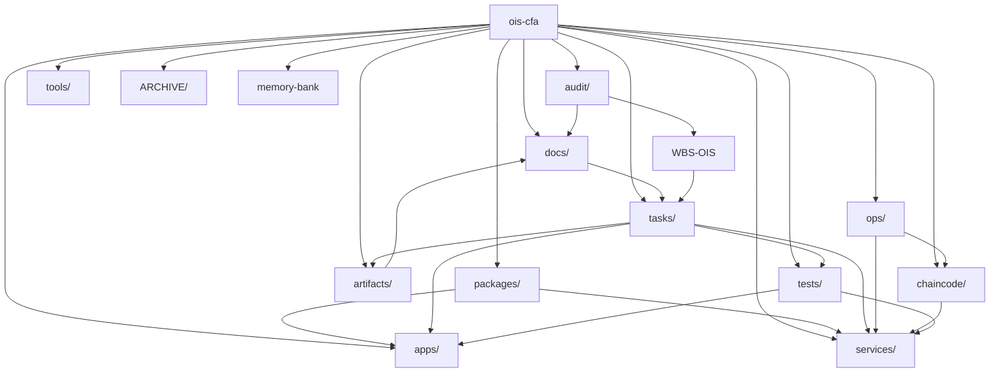
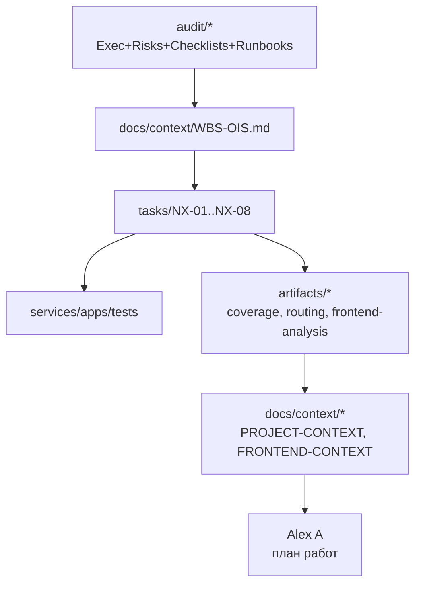

# Prompt

```markdown
You are Oracle, a focused one-shot problem solver. Emphasize direct answers, cite any files referenced, and clearly note when the search tool was used.  You are GPT‑5 Pro acting as a senior system/solution architect AND teacher for me (Alex A), focused ONLY on the `ois-cfa` repo.  **Important about me (the human):** - I am comfortable with TypeScript/Python, basic DevOps, AI‑agents, but **this is my first real .NET project**. - My ADHD brain learns best through:   - strong analogies (e.g. "this is like `ruff` vs `eslint`", "this is like `pip/poetry` vs `npm/pnpm`"),   - structured tables (What / Where / Why / Analogy),   - Mermaid diagrams for folder structure, flows, and relationships.  **Repo under focus:** - `ois-cfa` (customer/team repo), branch `infra.defis.deploy`. - Paths on macOS:   - `/Users/user/__Repositories/prj_Cifra-rwa-exachange-assets/repositories/customer-gitlab/ois-cfa` - High-level tree (you will also see this in the attached `c2p_ois-cfa.txt`):   - `apps/`, `services/`, `packages/`, `docs/`, `tasks/`, `audit/`, `artifacts/`, `ops/`, `chaincode/`, `tests/`, etc. - Aleksandr O. has already done a lot of architectural work here (docs, NX tasks, audits, artifacts). I need you to **explain his intent to me** in a way my brain understands.  I have attached: - `c2p_ois-cfa.txt`: fresh code2prompt snapshot of `ois-cfa@infra.defis.deploy` (code + docs + NX tasks + tests); - `c2p_aggregated-gpt5pro-talks.txt`: aggregated GPT‑5 Pro audits and my feedback (step3/4/5/6), including Trunk/Branches/Leaves and NX‑series; - `PROJECT-CONTEXT.md`: `repositories/customer-gitlab/ois-cfa/docs/context/PROJECT-CONTEXT.md` — current hand-written context; - `WBS-OIS.md`: `docs/context/WBS-OIS.md` — work breakdown and NX‑01..NX‑08 mapping; - `RULES-SUMMARY.md`: `docs/context/RULES-SUMMARY.md` — summary of rules/constraints for OIS‑CFA project; - `audit/00_Executive_Summary.md`: high-level infra/CI/K8s audit by Aleksandr; - `audit/03_Roadmap_Prioritized.md`: prioritized roadmap from the same audit; - `artifacts/FRONTEND-FUNCTIONALITY-ANALYSIS.md`: analysis of current frontend behaviour and gaps; - `artifacts/issuance-endpoints-coverage-report.md`: coverage report for issuance endpoints; - `CLAUDE.desktop.min.md`: my global preferences (tables, Mermaid, B2 English terms, Why→What→How→Result).  **What I need from you (for my learning):**  ### 1) Explain the repo structure in my language  - For each top-level folder under `ois-cfa` (apps, services, packages, docs, tasks, audit, artifacts, ops, chaincode, tests, tools, ARCHIVE, memory-bank symlink):   - Explain **What** it is (functional role) in 1–2 sentences.   - Explain **Where** key things live inside (e.g. for `docs` → architecture/ops/dlt/security, for `apps` → portals, etc.).   - Explain **Why** Aleksandr organized it this way (his intent, based on attached docs).   - Give **Analogy** in Python/TypeScript terms (e.g. "think of `services` as Django apps / NestJS modules", "audit/* like a formal ADR+RFC pack", "packages/* like shared libraries + generated clients"). - Output this as a **table** with columns: `Folder` / `What` / `Where` / `Why` / `Analogy (Python/TS)`. - Provide at least one simple **Mermaid diagram** that shows the top-level folders and how they relate (e.g. docs ↔ tasks ↔ services/apps/tests).  ### 2) Decode the docs: docs/*, audit/*, artifacts/*, docs/context/*  - Using `PROJECT-CONTEXT.md`, `WBS-OIS.md`, `RULES-SUMMARY.md`, `audit/*`, `artifacts/*`:   - For each major doc group:     - `docs/context/*`     - `docs/architecture/*`     - `docs/backend/*`, `docs/frontend/*`, `docs/deploy/*`, `docs/security/*`, `docs/dlt/*`     - `audit/*`     - `artifacts/*`   - Explain:     - What questions this group answers (for whom: AlexA, AleksandrO, Yury, auditors, agents).     - How it connects to NX‑tasks and WBS.     - Where I should start reading if I want to understand: **a)** frontend, **b)** backend/services, **c)** infra/ops, **d)** security/compliance. - Output as 2–3 tables, for example:   - `Group` / `Key docs` / `Answers to...` / `Primary audience` / `Link to NX/WBS`.   - `Doc` / `Path` / `Short summary` / `When to read`. - Add a Mermaid diagram that shows flows like: WBS-OIS → NX tasks → audit → artifacts → docs/context.  ### 3) Explain each NX task (NX‑01..NX‑08) in concrete, example-based terms  For each NX‑task under `tasks/NX-*` (NX‑01..NX‑08): - Summarise **What** it wants (1–2 sentences, plain Russian). - Summarise **Why** it exists (which risk/gap/feature it covers, linked to audit/docs where possible). - Give 1–2 **Concrete examples** of changes for this NX task, in terms I understand:   - For NX‑01: e.g. "run lint over OpenAPI/AsyncAPI and update a matrix doc X" (like `ruff`/`eslint` for specs).   - For NX‑02: e.g. "update gateway routing config Y and add health/metrics endpoints Z".   - For NX‑03: e.g. "fix EF config so issuance tests green, add test similar to `<example>`".   - For NX‑07/08: examples of backoffice KYC flows and Audit Log UI flows. - Where relevant, provide analogies: "this is like writing tests in pytest around existing APIs", "like updating Next.js pages and React components calling a TS SDK". - Output as a table: `NX-ID` / `What` / `Why` / `Example changes` / `Analogy`.  ### 4) Explain Aleksandr O.'s path and intent (interpretive layer)  - Based on audit docs, artifacts and NX/WBS, explain in 5–10 bullets **what Aleksandr O. has already built and why**:   - his view on CI/CD, infra, K8s/Timeweb, observability (from `audit/*`);   - his intent in `tasks/NX-*` (why NX‑01..08 and in this order);   - his expectations from me as AI‑integration architect (from WBS, RULES-SUMMARY, conversation 20251117-1518...). - Be honest and concrete, not "тизерно"; this должно помочь мне не чувствовать, что я "делаю не то".  ### 5) One short “orientation note” I can give to Aleksandr O  - At the end, write a short note (3–5 абзацев, по-русски) addressed to **Александр О.**, from my perspective (Alex A):   - Что я уже разобрался в общей архитектуре `ois-cfa` по его артефактам;   - Какие NX‑таски и docs я вижу как приоритетные для ближайшей работы (без перепридумывания его плана);   - Как я планирую использовать C4/RepoScan/диаграммы и daily‑репорты, чтобы **ему было прозрачно**, что я делаю именно то, что нужно.  Style & formatting: - Russian main, B2‑English terms OK. - Heavy use of tables and a few simple Mermaid diagrams. - Do NOT restate all attached files; focus on synthesis and teaching me (AlexA) how to think about this repo and Aleksandr's plan.
```

# Output
**TL;DR**

* `ois-cfa` = монорепо в стиле Nx: **contracts in `packages` → .NET services in `services` → порталы в `apps` → K8s/VPS в `ops`**, вокруг — доки (`docs`), аудит (`audit`), отчёты (`artifacts`), NX‑таски (`tasks`).
* Доковая цепочка: **audit → WBS-OIS → tasks/NX-01..08 → artifacts → docs/context** — так Александr фиксирует риск/план/факт и даёт тебе “рельсы” для работы + для агентов.
* NX‑01..08 — это не рандомные файлы, а **последовательный коридор**: сперва спеки/маршрутизация/issuance+registry+CI, потом Identity, и только после этого — backoffice KYC и Audit‑UI (NX‑07/08).

> Использовал **`file_search`** по всем прикреплённым файлам (`c2p_ois-cfa`, PROJECT/WBS/RULES, audit, artifacts, aggregated-gpt5pro-talks). Внешний web-поиск не использовал.

---

## 1) Структура репозитория в твоих терминах

Ментальная модель:
**это как большой Nx‑монорепо**:

* `packages` — как `libs/` + `contracts/` (OpenAPI/AsyncAPI/JSON Schema + сгенерированные SDK).
* `services` — микросервисы .NET (issuance/registry/settlement/compliance/identity/fabric-gateway).
* `apps` — edge+порталы (API Gateway + Next.js порталы issuer/investor/backoffice).
* `ops` — всё, что поднимает окружение: K8s/Helm/Fabric/Timeweb + docker-compose VPS.

### 1.1 Таблица по верхним папкам

| Folder                  | What                                                                                                                           | Where (ключевое внутри)                                                                                                                                                                                                                      | Why (зачем так)                                                                                                                               | Analogy (Python/TS)                                                                                                                       |
| ----------------------- | ------------------------------------------------------------------------------------------------------------------------------ | -------------------------------------------------------------------------------------------------------------------------------------------------------------------------------------------------------------------------------------------- | --------------------------------------------------------------------------------------------------------------------------------------------- | ----------------------------------------------------------------------------------------------------------------------------------------- |
| `apps/`                 | Edge и UI‑слой: API‑gateway (ASP.NET) + Next.js порталы: `portal-issuer`, `portal-investor`, `backoffice`, `shared-ui`.        | `apps/api-gateway` (YARP, auth, rate limiting), `apps/backoffice`, `apps/portal-issuer`, `apps/portal-investor`, `apps/shared-ui`.                                                                                                           | Отделить **входные интерфейсы** (HTTP/UI) от доменной логики сервисов. Gateway = единственная точка входа, порталы = разные роли.             | В мире TS: как `apps/` в Nx (Next.js приложения) плюс отдельный express‑gateway. В мире Python: FastAPI gateway + несколько frontend SPA. |
| `services/`             | Доменные .NET‑сервисы: issuance, registry, settlement, compliance, identity, fabric-gateway, интеграции (банк/ESIA).           | `services/issuance`, `services/registry`, `services/settlement`, `services/compliance`, `services/identity`, `services/fabric-gateway`, `services/integrations/*`.                                                                           | Чистый DDD‑слой: каждый bounded context отдельно, чтобы **менять домен независимо** от UI и infra.                                            | Как несколько Django apps / NestJS modules по доменам (`issuance`, `registry` и т.д.) с общими схемами.                                   |
| `packages/`             | Контракты и SDK: OpenAPI/AsyncAPI/JSON Schemas + dotnet‑клиенты и TS‑SDK.                                                      | `packages/contracts/*` (openapi-*.yaml, asyncapi.yaml, schemas), `packages/dotnet-clients/*`, `packages/sdks/ts`.                                                                                                                            | Реализовать **spec‑first**: сначала YAML + генераторы, потом код/тесты. Один источник правды для API/Events.                                  | В Python: `pydantic` схемы + `openapi-generator` клиенты; в TS: как `@company/contracts` и `@company/sdk` пакеты в monorepo.              |
| `docs/`                 | Центральное досье: контекст, архитектура, backend/frontend описание, deploy, security, DLT, assumptions.                       | `docs/context/*` (PROJECT-CONTEXT, WBS-OIS, RULES-SUMMARY, FRONTEND-CONTEXT, PROMPTS-MAP), `docs/architecture/*` (C4, UML, STRIDE, NFR), `docs/backend/context-map.md`, `docs/frontend/*`, `docs/deploy/*`, `docs/dlt/*`, `docs/security/*`. | Разделить **контекст/решения** от кода. Это Trunk‑уровень: сюда смотрит заказчик, аудитор и ты, когда решаешь “что менять”.                   | Как `docs/` в хорошем Django/Nest монорепо: ADR, C4, runbooks, playbooks.                                                                 |
| `tasks/`                | NX‑таски: описания работ NX‑01..NX‑08 с frontmatter (id, nx, domains, level).                                                  | `tasks/NX-01-spec-validate-and-matrix.md`, `NX-02-gateway-routing-and-health.md`, `NX-03-issuance-coverage.md`, `NX-04-registry-orders-flow.md`, NX‑05/06/07/08 *.md.                                                                        | Это **интерфейс задач для людей и агентов**, а не таск‑трекер. Каждый NX связывает контракты, сервисы, тесты, UI и артефакты.                 | Как `tasks/*.md` в mono‑репо, где каждая таска = мини‑RFC с scope/DoD. В TS‑мире — смесь Jira story + ADR.                                |
| `audit/`                | Формальный аудит: рекомендации по CI/K8s, Risk Register, Cost/Capacity, Observability Checklist, Security Checklist, Runbooks. | `audit/02_Recommendations.md`, `04_Risk_Register.md`, `05_Cost_Capacity_Calc.md`, `06_Observability_Checklist.md`, `07_Security_Checklist.md`, `08_Runbooks.md`, `09_Artifacts/*`.                                                           | Это **регуляторно‑ориентированный слой**: чем мы рискуем, какие SLI/SLO/IB‑требования, как делать rollback/инциденты. Отсюда растут WBS и NX. | Как отдельная папка с “security review + SRE runbooks” в SRE‑ориентированном проекте.                                                     |
| `artifacts/`            | Фактические отчёты по NX‑таскам и проверкам: frontend‑анализ, gateway‑routing, issuance‑coverage, test reports.                | `artifacts/FRONTEND-FUNCTIONALITY-ANALYSIS.md`, `artifacts/gateway-routing-report.md`, `artifacts/issuance-endpoints-coverage-report.md`, TRX/JUnit и прочие результаты.                                                                     | Фиксировать “что реально проверено” и линковать к NX/WBS. Это **evidence** для аудитора и для тебя (от чего отталкиваться).                   | В Python/TS мире — как `reports/` с Allure/JUnit/coverage + ручные аудиторские отчёты.                                                    |
| `ops/`                  | Инфраструктура и эксплуатация: Helm/K8s, Timeweb/Terraform, Fabric, docker-compose‑VPS, debug/diagnostics.                     | `ops/infra/*` (Helm charts, Grafana dashboards), `ops/fabric/*` (chaincode deploy/runbooks), `ops/debug/scripts/*` (лог‑коллекторы), `docs/deploy/*` рядом как runbook’и.                                                                    | Цель — **воспроизводимый контур**: dev/K8s/UK1/VPS. Aleksandr выносит всё infra‑мышление сюда, чтобы не загрязнять сервисы.                   | Как `infra/` + `deploy/` в Django/Nest mono‑репо: Helm, Terraform, Ansible, docker-compose.                                               |
| `chaincode/`            | Исходники Fabric‑chaincode (issuance/registry) для DLT‑слоя.                                                                   | `chaincode/issuance`, `chaincode/registry` + scripts из `ops/fabric/scripts/*`.                                                                                                                                                              | DLT как отдельный bounded context, но рядом с остальными, чтобы стыковать с `services/*` и AsyncAPI.                                          | В Python: отдельный пакет с смарт‑контрактами; в TS — пакет с chaincode для Fabric.                                                       |
| `tests/`                | Общие тестовые проекты (e2e/интеграция), частично дублирующие `services/*/*.Tests`.                                            | `tests/issuance.Tests/*` и др.; TRX‑репорты, Playwright e2e (по плану).                                                                                                                                                                      | Выделить **кросс‑сервисные** и сквозные тесты в одном месте, не зашивая их в конкретный сервис.                                               | Как `tests/` в Python‑монорепо: e2e/contract tests вокруг нескольких сервисов/порталов.                                                   |
| `tools/`                | Скрипты/утилиты для dev/CI: build/test helpers, spec‑lint, миграции. Упоминаются в BACKEND-BUILD-AND-TEST.                     | shell‑скрипты установки cli, wrapper’ы над `dotnet build/test`, возможно, генераторы `reposcan`.                                                                                                                                             | Снять “когнитивную боль” с dotnet/helm/kubectl: один скрипт = одна команда.                                                                   | Как `tools/` в TS‑монорепо: `lint-specs.sh`, `run-tests.sh`, `generate-clients.ts`.                                                       |
| `ARCHIVE/`              | “Холодное хранилище” старых шаблонов/черновиков/генерёнки, которая больше не является Trunk.                                   | Доковые шаблоны, устаревшие контуры, промежуточные артефакты.                                                                                                                                                                                | Чётко отделить **активный контекст** (`docs/`, `audit/`, `artifacts/`) от исторических вещей, чтобы агенты и люди не путались.                | Как `archive/` в Notion/Obsidian: всё ещё полезно как reference, но не для ежедневной работы.                                             |
| `memory-bank` (symlink) | Журнал решений и отчётов: daily‑логи, discovery‑ноуты, gitflow‑agreements, infra‑branch notes.                                 | Ссылки на `memory-bank/**` с discovery UK1, gitflow agreements, инфра‑логами и т.п.                                                                                                                                                          | Это **официальный knowledge‑log**; `tasks/` лишь интерфейс, а контекст/история живёт в memory‑bank.                                           | В Python/TS — как отдельный `knowledge/` репо, примонтированный в проект; в PKM‑терминах — “daily notes” для этого репо.                  |

### 1.2 Mermaid: верхнеуровневые связи



---

## 2) Что делают docs/audit/artifacts и как ими пользоваться

### 2.1 Группы документов

| Group                                                                           | Key docs                                                                                                                  | Answers to…                                                                                                                                                               | Primary audience                                                    | Link to NX/WBS                                                                                                                                                  |
| ------------------------------------------------------------------------------- | ------------------------------------------------------------------------------------------------------------------------- | ------------------------------------------------------------------------------------------------------------------------------------------------------------------------- | ------------------------------------------------------------------- | --------------------------------------------------------------------------------------------------------------------------------------------------------------- |
| `docs/context/*`                                                                | `PROJECT-CONTEXT.md`, `WBS-OIS.md`, `RULES-SUMMARY.md`, `FRONTEND-CONTEXT.md`, `PROMPTS-MAP.md`.                          | “Что это за система? Какие bounded contexts? Какой сейчас статус? Какие глобальные правила (.NET 8, spec-first, OTEL, тесты)? Как разбита работа (tracks/milestones/NX)?” | Ты, Aleksandr, AI‑агенты как context‑manager’ы, PM/архитектор.      | `WBS-OIS` даёт Milestones M1..M5 и привязку NX‑01..NX‑06. `PROMPTS-MAP` объясняет, какие мастер‑промпты генерят эти файлы и NX‑таски.                           |
| `docs/architecture/*`                                                           | UML/DFD (UseCases, CFALifecycle, Purchase, Payout), NFR targets, STRIDE/Threat, HLF‑network‑design, регуляторные матрицы. | “Как выглядит система на уровне C4/процессов/данных/угроз? Какие SLI/SLO/NFR и как они связаны с ГОСТ/СТО/259‑ФЗ?”                                                        | Архитекторы, ИБ/аудиторы, ты когда обосновываешь дизайн.            | Это Trunk: NX‑таски не меняют их напрямую, а должны им соответствовать (SLI/SLO из `14-NonFunctional-Targets` → Observability Checklist → NX‑06 CI/monitoring). |
| `docs/backend/*`                                                                | `backend/context-map.md`, сервисные md (например, `docs/services/issuance.md`).                                           | “Какой endpoint реализован в каком контроллере/сервисе/Entity? Как он связан с AsyncAPI/событиями и тестами?”                                                             | Backend‑разработчики, ты, тест‑инженеры, агенты, делающие coverage. | На этом стоит NX‑01 (API/Event Matrix) и NX‑03/NX‑04 (покрытие issuance/registry). `context-map` — основной индекс для NX‑01/03.                                |
| `docs/frontend/*`                                                               | `frontend/MVP-impl.md`, `docs/apps/*.md`, FRONTEND‑CONTEXT.                                                               | “Какие маршруты есть в порталах? Какие endpoints каждая страница должна вызывать? Где MVP‑дыры (Issuer payouts, Backoffice KYC/audit/registry)?”                          | Frontend‑разработчики и ты, особенно для NX‑07/08.                  | FRONTEND‑CONTEXT + MVP‑impl → исходник для NX‑07 (KYC‑UI) и NX‑08 (Audit‑UI).                                                                                   |
| `docs/deploy/*`                                                                 | `deploy/docker-compose-at-vps/*`, timeweb/Terraform/UK1 runbooks.                                                         | “Как поднять dev‑контур на VPS? Какие порты/переменные? Как получить kubeconfig от Timeweb? Как проверить health?”                                                        | Ты, DevOps/SRE.                                                     | Это основа для “UK1 as reference env” и для части NX‑06 (CI/quality gates → живой стенд + smoke).                                                               |
| `docs/security/*` (частично внутри `docs/architecture/threat/*` + рег. матрицы) | Threat/STRIDE, Mitigations‑Map, регуляторные матрицы (259‑ФЗ, ГОСТ 57580, СТО БР).                                        | “Какие угрозы/контуры доверия? Какие меры ИБ считаются минимально достаточными?”                                                                                          | ИБ/аудитор, ты для обоснования архитектурных решений.               | Связано с `audit/07_Security_Checklist` и NFR. NX‑таски должны не ломать заложенные меры (mTLS, secrets, networkpolicy).                                        |
| `docs/dlt/*`                                                                    | `docs/dlt/dev-network.md` + ссылки на HLF‑дизайн.                                                                         | “Как развернуть Fabric dev‑network? Какой канал/chaincode/команды?”                                                                                                       | DLT‑разработчики, ты при трассировке сквозных операций до ledger.   | Используется в audit/observability + ops/infra/helm; косвенно — для NX‑03/04, когда проверяешь, что цепочка событий доходит до ledger.                          |
| `audit/*`                                                                       | Recommendations, Risk Register, Cost/Capacity, Observability Checklist, Security Checklist, Runbooks.                     | “Где болит infra/CI/K8s сейчас? Какие риски/стоимость/план действий? Какие требования к observability/security/rollback?”                                                 | Aleksandr, ты, DevOps, security, аудиторы.                          | Отсюда вырос WBS‑OIS и NX‑таски: M1..M5 = прямое отражение блоков из audit (спеки → gateway → core flows → identity → CI/Security).                             |
| `artifacts/*`                                                                   | FRONTEND‑FUNCTIONALITY‑ANALYSIS, gateway‑routing‑report, issuance‑coverage‑report, и др.                                  | “Что реально сделано по конкретному NX? Какие спек‑дифы? Какие тесты зелёные/красные?”                                                                                    | Ты, Aleksandr, QA, заказчик при демонстрации.                       | Каждый отчёт привязан к NX (например, NX‑02→gateway‑routing, NX‑03→issuance coverage) и к WBS milestone’ам.                                                     |

### 2.2 Где читать, если хочу быстро въехать в X

| Цель                                              | С чего начать                                                                                                     | Потом                                                                                                                                          | Почему так                                                                                                                                              |
| ------------------------------------------------- | ----------------------------------------------------------------------------------------------------------------- | ---------------------------------------------------------------------------------------------------------------------------------------------- | ------------------------------------------------------------------------------------------------------------------------------------------------------- |
| a) Понять фронтенд (порталы, особенно backoffice) | `docs/context/FRONTEND-CONTEXT.md` + `docs/frontend/MVP-impl.md`.                                                 | `artifacts/FRONTEND-FUNCTIONALITY-ANALYSIS.md` → код в `apps/backoffice`, `apps/portal-issuer`, `apps/portal-investor`.                        | CONTEXT + MVP‑impl задают “как должно быть”, artifacts показывают “как есть”, код — “что реально”. Это напрямую подготавливает к NX‑07/08.              |
| b) Понять backend/services                        | `docs/backend/context-map.md` + `PROJECT-CONTEXT` секция “Architecture Snapshot”.                                 | Контракты из `packages/contracts/*` → конкретный сервис (`services/issuance`, `services/registry`, …) → тесты `services/*/*.Tests`, `tests/*`. | Context map = индекс (endpoint→handler→entity→topic). Snapshot даёт картинку bounded contexts. Потом по NX‑03/04 ты углубляешься в конкретные сервисы.  |
| c) Понять infra/ops (K8s/Timeweb/VPS)             | `docs/deploy/docker-compose-at-vps/00-overview.md` и 01–04, + UK1/timeweb runbooks в `docs/deploy` и `ops/infra`. | `audit/06_Observability_Checklist.md`, `audit/08_Runbooks.md`, Helm/Fabric runbooks в `docs/dlt/dev-network.md`.                               | Сначала “как поднять dev/VPS”, потом “как смотреть на живую систему” (SLI/SLO, логи, runbooks). Это база для NX‑06 и любого troubleshooting.            |
| d) Понять security/compliance                     | `docs/architecture/threat/*` + NFR/регуляторные матрицы, `RULES-SUMMARY.md`.                                      | `audit/07_Security_Checklist.md`, `audit/04_Risk_Register.md`, разделы в PROJECT‑CONTEXT про соответствие 259‑ФЗ/ГОСТ.                         | Архитектурный уровень → чеклисты/риски → конкретные меры в infra/CI. Важно при работе с Identity/Backoffice (NX‑05/07/08), чтобы не нарушить ИБ‑каркас. |

### 2.3 Mermaid: поток “audit → WBS → NX → artifacts → docs”



---

## 3 NX‑таски (NX‑01..NX‑08) по‑человечески

Опираюсь на `WBS-OIS.md`, `c2p_ois-cfa`, артефакты NX‑02/03 и таблицу NX‑07.s1/NX‑08.s1 из aggregated‑отчёта.

### 3.1 Таблица NX‑01..NX‑08

| NX-ID                                                       | What (простым языком)                                                                                                                             | Why (какую дыру закрывает)                                                                                                                                                              | Example changes (конкретно)                                                                                                                                                                                                                                                                                                                                 | Analogy                                                                                                                                                        |
| ----------------------------------------------------------- | ------------------------------------------------------------------------------------------------------------------------------------------------- | --------------------------------------------------------------------------------------------------------------------------------------------------------------------------------------- | ----------------------------------------------------------------------------------------------------------------------------------------------------------------------------------------------------------------------------------------------------------------------------------------------------------------------------------------------------------- | -------------------------------------------------------------------------------------------------------------------------------------------------------------- |
| **NX‑01** — Spec validation + API/Event Matrix              | Прогнать lint/валидацию по всем OpenAPI/AsyncAPI/JSON Schema и собрать **матрицу endpoint→handler→entity→topic**.                                 | Без этого непонятно, какие спеки уже в порядке, где расхождения, и как Backend реально привязан к контрактам. Это Trunk для всех следующих NX.                                          | 1) Обновить `ops/scripts/validate-specs.sh` и прогнать Spectral/asyncapi/AJV по `packages/contracts/*`. 2) Обновить `docs/backend/context-map.md` (или отдельную матрицу) по текущему коду `services/*`. 3) Зафиксировать SPEC DIFF’ы (например, `dltTxHash` в событиях issuance vs AsyncAPI).                                                              | Как если бы ты завёл один `ruff/eslint` + `schemathesis`/`ajv` для REST+events и выгрузил “список всех API с линком на viewset/handler и тесты” в Django/Nest. |
| **NX‑02** — Gateway routing + health/metrics                | Проверить и выровнять конфиг API‑gateway: маршруты, path‑prefixы, health/metrics, rate‑limits.                                                    | Сейчас были расхождения между OpenAPI и YARP (например, `/orders/{id}` vs `/v1/orders/{id}`), health/metrics реализованы не везде. Это точка входа, её нельзя оставить “как получится”. | 1) Проверить `apps/api-gateway/appsettings.json` и OpenAPI gateway spec (`packages/contracts/openapi-gateway.yaml`) и привести пути к一致ию. 2) Добавить/проверить health/metrics endpoints у всех сервисов и промаршрутизировать их через gateway. 3) Описать результат в `artifacts/gateway-routing-report.md` (уже есть первая версия).                    | В Nest/FastAPI‑мире — навести порядок в reverse‑proxy (NGINX/Traefik) и make sure liveness/metrics доступны в одном месте.                                     |
| **NX‑03** — Issuance endpoints alignment + tests            | Довести сервис `issuance` до состояния “спеки совпадают с кодом, happy‑path покрыт тестами, события корректны”.                                   | В отчёте видно: часть тестов падает (проблема с EF провайдерами и JSON), AsyncAPI не знает про `dltTxHash`, есть специфик DIFF’ы.                                                       | 1) Починить конфигурацию EF (не смешивать InMemory и Npgsql) в тестах `services/issuance/issuance.Tests`. 2) Выравнять payload событий с AsyncAPI (`dltTxHash` — либо добавить в spec, либо убрать из кода). 3) Добить зелень тестов в `tests/issuance.Tests` и обновить coverage в `artifacts/issuance-endpoints-coverage-report.md`.                      | Как в Python: привести FastAPI сервис + SQLAlchemy модели + pytest‑тесты к соответствию openapi.yaml, пока не будет зелёного CI и нормального coverage.        |
| **NX‑04** — Registry order flow (create→reserve→paid)       | Пройти полный путь заказа: создание в gateway → запись в registry → события → состояние кошельков/транзакций, включая DLT‑hash.                   | Сейчас registry‑модель богата (orders, holdings, tx, dltTxHash), но **нет полного гарантированного happy‑path**. Это ключевой бизнес‑флоу.                                              | 1) На уровне OpenAPI (gateway + registry) проверить/добавить endpoints для create/reserve/pay order. 2) Добавить интеграционные тесты (dotnet или e2e) которые проходят цепочку целиком и проверяют, что статусы в БД/событиях корректны. 3) Описать результаты в отдельном `artifacts/registry-orders-flow-report.md` (аналог issuance).                   | Как написать end‑to‑end pytest, который создаёт заказ, проверяет запись в Postgres, событие в Kafka и изменение баланса в ledger.                              |
| **NX‑05** — Identity/Keycloak baseline                      | Довести identity‑слой до “реальной” работы с Keycloak: OIDC discovery, токены, роли, базовые политики для порталов и gateway.                     | Сейчас identity — stub + dev‑режимы; для реального демо и регулятора нужно показать, что **ESIA/Keycloak‑цепочка не фикция**.                                                           | 1) Довести `services/identity` и конфиг Keycloak (realm/clients/roles) до совместимости с текущими порталами (NextAuth). 2) Обновить docs в `docs/deploy/docker-compose-at-vps/06-keycloak` (или аналог) и PROJECT‑CONTEXT блок про auth. 3) Добавить smoke‑тесты (Playwright или простой http) на успешный логин и роль‑базовый доступ.                    | В TS‑мире — нормально подключить Keycloak/Auth0 к Next.js и gateway, чтобы `role:issuer/backoffice/investor` реально работали, а не просто были в коде.        |
| **NX‑06** — CI quality gates (spec‑lint + tests + coverage) | Включить в GitLab CI/infra минимальные, но жёсткие quality‑гейты: lint specs, dotnet tests, frontend tests, артефакты coverage.                   | Сейчас гейты описаны “на бумаге” (audit + RULES), но нет стабильного, зелёного pipeline, который стопает критичные нарушения.                                                           | 1) Добавить в `.gitlab-ci.yml` стадии `spec-lint` (Spectral/AJV), `test-backend` (`dotnet test`), `test-frontend`, `test-e2e` (Playwright), `publish-artifacts` (TRX/junit/coverage). 2) Настроить сбор артефактов и, при возможности, GitLab Pages для отчётов. 3) Обновить `audit/02_Recommendations` статус и RULES‑SUMMARY, что гейты реально работают. | Как перевести твой “идеальный CI план” в реальный `.gitlab-ci.yml`, где ошибки в спеках/тестах реально ломают pipeline.                                        |
| **NX‑07** — Backoffice KYC/Kvalification MVP                | Сделать **минимальный, но живой** KYC‑UI в backoffice: список KYC‑тасков + детали, затем (в следующих под‑тасках) approve/reject и qualification. | Сейчас KYC/registry UI частично реализован, но нет чёткого потока и привязки к compliance endpoints. Регуляторно это критичная часть (5625‑У, KYC/AML).                                 | Для под‑таска `NX-07.s1`: 1) В `apps/backoffice` добавить страницу `/kyc` с таблицей KYC‑тасков (mock или real API). 2) Привязать к `/v1/compliance/kyc/*` (или создать mock слой через gateway). 3) Написать Playwright‑сценарий “admin открывает KYC‑таск и видит детали”. 4) Обновить FRONTEND‑CONTEXT, какие регуляторные требования этим MVP покрыты.  | Как сделать маленький вертикальный спринт: React‑страница + TS‑SDK вызовы к уже описанному REST‑API, плюс один e2e‑тест в Playwright.                          |
| **NX‑08** — Backoffice Audit‑UI MVP                         | Показать аудит‑лог в backoffice: таблица событий + фильтры по времени/actor/action, без CSV/advanced фич.                                         | Backend аудит и события уже есть (openapi‑gateway содержит `/v1/audit`, dotnet‑client с `GetAuditEvents*` есть), но UI нет. Для регулятора **жизненно важно** видеть журнал.            | Для `NX-08.s1`: 1) Добавить страницу `/audit` в `apps/backoffice` с таблицей и фильтрами. 2) Подключить TS‑SDK/dotnet‑gateway клиент к `/v1/audit`. 3) Добавить Playwright‑сценарий “admin фильтрует audit log по типу события”. 4) Отдельно зафиксировать, что CSV/advanced фильтры — future scope.                                                        | Как прикрутить Admin‑UI к уже существующему `/v1/audit` API: один React table, несколько фильтров и e2e‑тест.                                                  |

---

## 4) Какой путь и намерение у Александра (мой разбор)

Собираю картинку из PROJECT‑CONTEXT, WBS, RULES‑SUMMARY, audit и aggregated‑reports.

1. **Сначала он построил Trunk**:

   * архитектура/регуляторка/угрозы/assumptions в `docs/architecture/*` + `docs/assumptions.md`,
   * спецификации API/Events в `packages/contracts/*`,
   * контекстный снимок в `PROJECT-CONTEXT` и RULES‑SUMMARY (spec‑first/test‑first, .NET 8/9, OTEL/health/Prometheus обязательны).

2. **Параллельно он собрал Branch‑каркас**:

   * доменные сервисы `issuance/registry/settlement/compliance/identity` + интеграции и fabric-gateway,
   * edge‑слой `apps/api-gateway` + порталы,
   * ops: Helm/K8s/Fabric/Timeweb + частично docker‑compose.

3. **Дальше он сделал аудит infra/CI/security, а не coding‑спринт**:

   * Risk Register, Cost/Capacity, Observability + Security checklists, Runbooks — это не “доки ради доков”, а чек‑листы для будущего продакшена: SLI/SLO, pod‑security, NetworkPolicy, Trivy, rollback‑процедуры.

4. **На основе аудита он формализовал WBS‑OIS и NX‑таски**:

   * Milestones M1..M5 — это аккуратно нарезанные срезы: **M1: спеки в порядке (NX‑01)** → **M2: gateway (NX‑02)** → **M3: core flows issuance+registry (NX‑03/04)** → **M4: identity** → **M5: CI‑гейты**.
   * NX‑07/08 появляются уже после стабилизации backends как маленькие вертикали UI по KYC и Audit‑логам.

5. **Он зафиксировал, что `tasks/` и `memory-bank` = интерфейс для агентов и для тебя**:

   * `memory-bank` — журнал решений/логов/дискавери;
   * `tasks/` — небольшой набор NX‑тасков, а не заменитель Jira;
   * RepoScan/`*.reposcan.json` должен связывать NX‑таски с кодом/доками, чтобы агенты работали безопасно по T/B/L.

6. **По отношению к тебе он явно ожидает роль “AI‑интеграционный архитектор + executor на Branch/Leaf”**:

   * Ты не перепридумываешь архитектуру/регуляторку (Trunk), а **доводишь Branch/Leaf до “production‑ready demo”** по NX‑таскам.
   * Ты используешь агентов для leaf‑работ (тесты, UI wiring, spec‑lint, отчёты), но сам держишь под контролем контракты, gitflow и ключевые решения.

7. **Порядок NX‑тасков — это коридор, чтобы ты не “улетел в фронтенд”, пока не стабилизированы основы**:

   * сначала NX‑01/02/03/04/05/06 (спеки, gateway, core flows, identity, CI),
   * только потом NX‑07/08 (Backoffice KYC/Audit), уже поверх стабильных API/Events/identity.

8. **UK1/compose/Timeweb‑часть (твой вклад) он уже встроил в картину**:

   * UK1 описан как reference env, `infra.defis.deploy` — рабочая ветка, docker‑compose runbooks легли в `docs/deploy/*`. Это значит: твой “deploy‑хаос” уже нормализован как часть архитектуры, а не побочкой.

Коротко: **он уже построил “каркас и регуляторную рамку” и ожидает от тебя не “изобрести новое”, а методично закрывать NX‑коридор, используя агентов и фиксируя артефакты.**

---

## 5) Короткая “ориентационная записка” для Александра О.

(можешь практически копипастить, слегка правя под себя)

Александр, привет.

Я разобрался в общей архитектуре `ois-cfa` именно через твои артефакты: `PROJECT-CONTEXT`, `WBS-OIS`, `RULES-SUMMARY`, backend‑context‑map, frontend‑/deploy‑runbooks и audit‑пакет (risks/observability/security/runbooks). Для себя я это держу как Nx‑монорепо: `packages` = контракты/SDK, `services` = домены, `apps` = порталы/gateway, `ops` = контуры (K8s/Timeweb/VPS), `docs`/`audit`/`artifacts` = Trunk‑уровень, а `tasks/NX-*` и `memory-bank` — интерфейс задач и истории.

По приоритетам я ориентируюсь на твой WBS и NX‑коридор, без переизобретения: **M1..M3 (NX‑01..NX‑04)** — привести спеки/маршрутизацию/issuance+registry к проверяемому и повторяемому состоянию с тестами и отчётами; **M4–M5 (NX‑05..NX‑06)** — стабилизировать identity/Keycloak и минимальные CI‑гейты (spec‑lint, тесты, coverage). Уже после этого я беру **NX‑07/08.s1** как небольшие вертикальные срезы Backoffice KYC‑ и Audit‑UI, опираясь на твой FRONTEND‑CONTEXT и существующие `/v1/compliance/*` и `/v1/audit` endpoints, чтобы не тащить фронт раньше, чем устаканен backend.

Для прозрачности я планирую работать так:

* **C4/RepoScan/диаграммы** — держать обновлённым “map of territory”: Trunk/Branch/Leaf помечены, NX‑таски привязаны к код/докам, чтобы и людям, и агентам было видно границы.
* Каждому NX‑срезу — свой **artifacts‑отчёт** (как уже сделано для gateway‑routing и issuance‑coverage): что проверено, какие команды, какие SPEC DIFF’ы, какой статус тестов/coverage.
* По факту — **короткие daily/near‑daily отчёты** в `memory-bank`/контекстных доках: что именно сделано по NX‑таскам, какие блокеры, какие решения принято/предлагаются. Так ты в любой момент можешь открыть один doc и увидеть, что я и агенты делаем ровно то, что заложено в твоём WBS/audit, а не “что-то рядом”.

Если хочешь, я отдельным шагом оформлю минимальный “how to read ois-cfa now” (DOC-ROOT.v1): одна диаграмма + 1–2 таблицы, чтобы следующий человек (или агент) зашёл в репо и сразу попал в ту же картину мира, которую ты выстроил.
