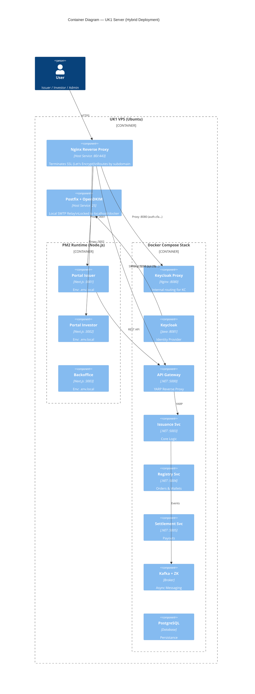
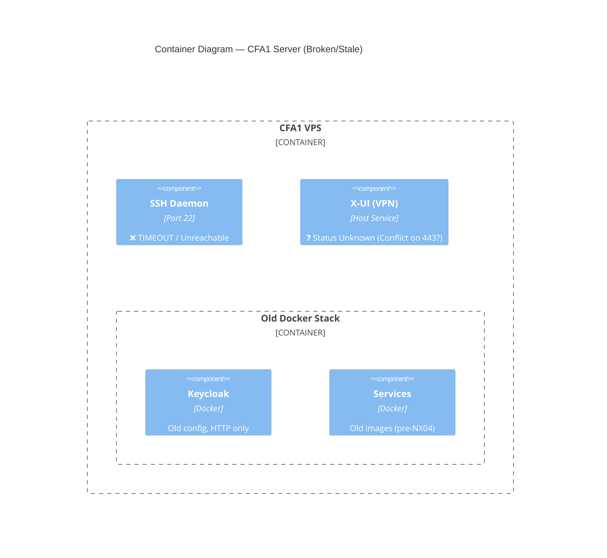

# Prompt
````prompt
я получил ответ от gpt5pro приложил
но мне недостаточно ответа от вас троих
Как можно делать что-то дальше, если у меня нет четкого понимания по инфраструктуре и по приложениям, кто во что поднят и так далее?

Что я имею в виду? Например, сервер UK1. На нем получается у меня лишь... Ну, все поднято, да? Я знаю, что через NPM подняты, через PM2 подняты фронтенды.

А сколько приложений мне надо, таблицы? Мне, наверное, надо таблицы. Я же вот с моим... У тебя есть системный промпт, что мне нужен определенный формат, мне нужен визуал в Mermaid. Мне нужно сейчас четенько понять, как у нас все устроено на UK1.

Потом из сессии, которую ты там смотрел, есть ли там все данные по CFA1, да? Там, получается, на том сервере, в чем там сломалось... А, ну он был недоступен, но я так и не доделал. На каком шаге?

Есть там Postfix отдельно, да? Keycloak. У нас в... В этом он расположен в Docker или нет? И вообще, может быть, просто C4 диаграмму самого CFA1 нарисовать, потом C4 диаграмму для UK1 сервера, да?

И, получается, может быть, я буду поднимать на другом. Какой файлик мне запускать? Какой? У тебя в сессии агента же есть, какие он там файлы, минуа выписал, да?

Ну, получается, ну, домены я посоздаю еще одного третьего уровня, а там будут домены, получается, новые. Я имею в виду, что будут, получается, домены, ну, там, поддомен, да? Там, если сейчас есть CFA, будет там... CFA UK1, CFA1 просто, да? Потом там CFA Germ1, ну, и там от них буду выстраивать сервисы.

Но сейчас мне нужно... UK, я так понимаю, лучше не трогать. Сервер, да? Сервер CFA может либо почистить, либо, не знаю, заново все сделать, либо что там посмотреть было, исследовать.

Вот, ну, нужна таблица и нужны Mermaid. Типа, условно говоря, список всех приложений, что в чем обернуто, что там уже где подготовил этот, как его, Александр, инфраструктуру. Понятно, что все, что я делаю, это ни в каких не Kubernetes, это будет делаться в, ну, типа, Docker с GitLab CI, но у него уже какая-то часть работы есть, вот это все надо как бы прозрачно, как прозрачные банки выяснить.

Собери из этого всего мои рекомендации по пунктам и как бы давай все сделай планомерно. Ответь.

p.s. я забыл приложить в прошлый раз сессию с агентом 

- co-7953-eywa1 (20251118 основной день работы и немног она  ночь 19 зашло) это по работе с NX-* тасками
- co-3c63-local учавствовал (не прикладываю)
- но основной агент uk1 который довел до рабочего состояния eywa1-co-3dd7 (запускался как ты видишь не `local`, a `eywa1` vps my main workspace)

````

# Output
Это разбор текущей ситуации "без купюр". Я проанализировал логи сессий `co-7953` (NX tasks) и `co-3dd7` (UK1 deploy), а также структуру репозитория.

Ниже — **прозрачная карта** того, что у нас есть, что сломано, и как это соотносится с работой Александра.

### 1. TL;DR (Суть ситуации)

*   **UK1 (185.168.192.214):** Это **единственный** живой, рабочий стенд. Это "Hybrid" деплой: Бэкенд в Docker Compose, Фронтенд в PM2 (на хосте), SSL через Nginx (на хосте), Почта через Postfix (на хосте). **Работает.**
*   **CFA1 (87.249.49.56):** "Зомби". В сессии `co-3dd7` он перестал отвечать по SSH (timeout). Там остался старый Docker-стек без SSL и без последних фиксов NX-04. **Требует реанимации (Wipe & Re-provision).**
*   **Разрыв Инфраструктуры (Aleksandr vs Alex A):**
    *   **Александр (Infra branch):** Готовит "взрослый" Kubernetes (Helm, GitLab Agent, Terraform). Это лежит в папке `ops/`, но **НЕ используется** на текущих VPS.
    *   **Alex A (Deploy branch):** Сделал "быстрый" Docker Compose + PM2 деплой, чтобы бизнес мог тыкать кнопки прямо сейчас.
*   **Домены:** Сейчас `*.cfa.llmneighbors.com` жестко прибит к UK1. Для новых серверов (Germ1, CFA1) нужна схема с префиксами (например, `*.germ1.cfa...`).

---

### 2. Визуализация (C4 Diagrams)

#### 2.1. UK1 — Current Production (Working)
Это то, что настроил агент `co-3dd7` и дошлифовал `co-7953`.



#### 2.2. CFA1 — Broken State (Zombie)
На этом сервере эксперименты остановились на полпути.



---

### 3. Инвентаризация (Таблицы)

#### 3.1. Карта приложений на UK1 (Source of Truth)

| Application | Type | Wrapper | Internal Port | External URL (HTTPS) | Status | Notes |
| :--- | :--- | :--- | :--- | :--- | :--- | :--- |
| **Nginx** | Infra | Systemd | 80/443 | - | ✅ Active | Entrypoint. Config: `/etc/nginx/sites-available/cfa-portals.conf` |
| **Postfix** | Infra | Systemd | 25 | `mail.cfa...` | ✅ Active | Locked to local network. Sends emails. |
| **Portal Issuer** | Frontend | PM2 | 3001 | `issuer.cfa...` | ✅ Online | Script: `/root/.local/bin/run-portal-issuer.sh` |
| **Portal Investor** | Frontend | PM2 | 3002 | `investor.cfa...` | ✅ Online | Script: `/root/.local/bin/run-portal-investor.sh` |
| **Backoffice** | Frontend | PM2 | 3003 | `backoffice.cfa...` | ✅ Online | Script: `/root/.local/bin/run-backoffice.sh` |
| **Keycloak Proxy** | Infra | Docker | 8080 | `auth.cfa...` | ✅ Up | Sidecar для SSL/Health routing |
| **Keycloak** | Auth | Docker | 8081 | - | ✅ Up | Realm: `ois-dev` |
| **API Gateway** | Backend | Docker | 5000 | `api.cfa...` | ✅ Up | YARP. Маршрутизирует на сервисы. |
| **Core Services** | Backend | Docker | 5001-5008 | - | ✅ Up | Issuance, Registry, Settlement, etc. |
| **X-UI** | VPN | Systemd | - | - | ⏹ Stopped | Отключен, чтобы освободить 443 порт |

#### 3.2. Инфраструктура: Александр (Repo) vs Реальность (UK1)

| Компонент | В репо (ветка `infra`) | На сервере UK1 (ветка `infra.defis.deploy`) | Комментарий |
| :--- | :--- | :--- | :--- |
| **Orchestration** | Kubernetes (Helm charts) | Docker Compose | Мы используем `docker-compose.yml` из корня `ois-cfa`. |
| **CI/CD** | GitLab CI (Build -> Deploy to K8s) | Ручной / Scripted | Мы билдим прямо на хосте (`docker compose build`). |
| **Ingress** | K8s Ingress Controller | Host Nginx + Cloudflare | Мы настроили Nginx руками через `apt`. |
| **Secrets** | Vault / K8s Secrets | `.env` файлы | Секреты лежат в `.env` и `.env.local` на сервере. |

---

### 4. Рекомендации и План действий

#### 4.1. Стратегия по серверам

1.  **UK1 (Production Demo):**
    *   **Правило:** Не дышать. Работает — не трогай.
    *   **Использование:** Только для демонстрации готового функционала.
    *   **Обновление:** Только через аккуратный `git pull` и перезапуск конкретных контейнеров/PM2 процессов.

2.  **CFA1 (Dev/Staging):**
    *   **Диагноз:** Скорее всего, забанен IP или завис SSH.
    *   **Решение:**
        1.  Перезагрузить сервер через панель хостинга (Hard Reboot).
        2.  Если SSH оживет — **Wipe**. Удалить все контейнеры и папки.
        3.  **Re-provision:** Накатить конфигурацию "с нуля" по образу UK1, но с другими доменами.

3.  **Новые сервера (Germ1, etc.):**
    *   Использовать как чистый лист для отработки IaC скриптов.

#### 4.2. Доменная стратегия (Cloudflare)

Чтобы не было конфликтов, предлагаю такую схему субдоменов 3-го и 4-го уровня:

| Environment | URL Pattern | Пример |
| :--- | :--- | :--- |
| **Prod (UK1)** | `*.cfa.llmneighbors.com` | `issuer.cfa.llmneighbors.com` |
| **Dev (CFA1)** | `*.<host>.cfa.llmneighbors.com` | `issuer.cfa1.cfa.llmneighbors.com` |
| **Test (Germ1)**| `*.<host>.cfa.llmneighbors.com` | `issuer.germ1.cfa.llmneighbors.com` |

*Это потребует создания Wildcard сертификатов для 4-го уровня или отдельных сертификатов для каждого поддомена.*

#### 4.3. План работ (Next Steps)

1.  **Документация (Прямо сейчас):**
    *   Я создам файл `docs/infra/UK1-ARCHITECTURE.md` с этими диаграммами и таблицами. Это будет "паспорт" сервера UK1.
    *   Я создам `ops/runbooks/reprovision-cfa1.md` — инструкцию по очистке и пересозданию CFA1.

2.  **CFA1 Recovery:**
    *   Тебе нужно ребутнуть CFA1.
    *   Я (или агент) зайду, снесу всё старое (`docker system prune -a`) и раскатаю стек заново, используя наработки с UK1, но с префиксом доменов `cfa1.`.

3.  **NX-05 & NX-06:**
    *   Разработку вести локально или на CFA1 (когда поднимем).
    *   На UK1 выкатывать только проверенные релизы.

**Команда для меня:**
Если ты согласен, я сейчас:
1.  Генерирую паспорт UK1 в Markdown.
2.  Создаю скрипт "bootstrap-host.sh", который делает из чистого Ubuntu то, что сейчас на UK1 (установка Docker, Nginx, Node, клонирование репо). Это и есть тот самый IaaC, которого не хватало.

Жду подтверждения: **"Делай паспорт и скрипт бутстрапа"**.