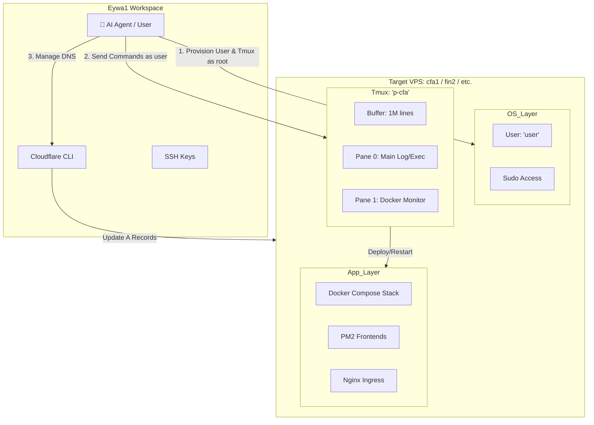

# Prompt 
````prompt
Смотри, корректировки

- рабочее место `workspace` где запущен агент codex-cli gpt5.1high: `eywa1` 
- у него есть доступ по ssh keys к серверам `ssh {uk1|cfa1|fin2|fin1|germ1}` и это агент может со своего сервера запускать команды по установке все
- не будет ли это overengineering сделать примерной такой конфиг ssh, и вообще мне недоконца понятно как он работает но я предположу как бы мне хотелось типо что агент создает на каждом из рабочих серверов tmux session `p-cfa` и в ней работает
- но прежде мне ненравится что у всех этих серверов стоит там root, агенту бы стоило создать пользователя sudo user called `user` with %password% одинаковый на все сервера и хранить стандартно в `/srv` или где лучше проект назвать `%folder%/cfa` и все
- и потом по итогу есть sudo `user` on {server} with tmux session `p-cfa` и наш codex-cli агент запущенный на `eywa1` выполняет команды условно `ssh {alias}-tmux "%command%"` и эти команды как бы изнутри сессии и я могу сам подключится глянуть что там потом или сразу и логи останется в tmux session input/output,
- ток еще в каждом tmux выставить 1M output хранить можно а не по-умолчанию 2-10K!
- наверное это какой-то setup cкрипт надо написать набросок агенту как отдельную задачу и выполнить донастроить да?
- а потом собственно главная цель делать саму работу условно поднять это на fin2, cfa1 серверах с отличием что fin2 пуст на этот счет а cfa1 надо почистить 

- и домены не как ты указал с доп уровнем а лучше обезлично без alias server-ов (я сам буду вести учет где какой) `*.cfa{1,2,3}.llmneighbors.com`, `*.cfa.llmneighbors.com` у нас уже есть.
-  Сами домены агент и все действия агент будет делать через cloudflare-cli там с api или как авторизация на `eywa1` напоминаю что центральный workspace `eywa1` как-то так

нужно собрать это все в четкий док DoD, Kickoff tasks with phases чтобы ненапортачил агент и все кусочками шагами надо делать а то сам знаешь агентов. И промпт ему такой или серию промптов


p.s. я тебе накидал runbook но они могут быть старее чем deploy, и самое точка истины это "eywa1-p-cfa-w6.p1-20251118-1503-co-3dd7.session.md" в истории у тебя есть выше

Все понятно сделаешь?

Тебе все понятно, все спроектируешь? вот доки
````
# Output
Да, задача понятна. Это переход от "ручного управления" к **оркестрации**. Мы превращаем `eywa1` в командный центр (Control Plane), а целевые сервера (`cfa1`, `fin2` и т.д.) — в стандартизированные ноды.

Идея с `tmux` отличная для отладки: ты всегда можешь зайти на сервер, сделать `tmux attach -t p-cfa` и увидеть весь лог выполнения, как будто ты сидел там с самого начала.

Ниже — **Архитектурный план**, **DoD** и **Промпт** для агента.

---

### 1. Архитектура: Eywa1 Control Plane

Мы не используем Ansible (чтобы не усложнять), мы используем **Bash-over-SSH** с сохранением контекста в Tmux.



---

### 2. Definition of Done (DoD)

**Phase 1: Standardization (Setup Script)**
- [ ] На целевом сервере создан юзер `user` с sudo без пароля.
- [ ] SSH ключи с `eywa1` проброшены пользователю `user`.
- [ ] Установлен базовый софт: Docker, Nginx, Postfix, Git, NVM/Node, Tmux.
- [ ] Настроен `.tmux.conf` (history-limit 1000000).
- [ ] Создана сессия `p-cfa`, которая стартует при ребуте (через cron `@reboot` или systemd).

**Phase 2: Infrastructure (Domains & SSL)**
- [ ] Для сервера `cfa1` (и других) созданы DNS записи через Cloudflare API с `eywa1`:
    - `*.cfa1.llmneighbors.com` -> IP сервера.
    - `cfa1.llmneighbors.com` -> IP сервера.
- [ ] На сервере получен Wildcard сертификат (Certbot DNS challenge или HTTP challenge через Nginx).

**Phase 3: Deployment (The App)**
- [ ] Репозиторий склонирован в `/srv/cfa`.
- [ ] `.env` файлы сгенерированы (на основе шаблонов, секреты подставлены).
- [ ] Бэкенд (Docker) запущен и Healthy.
- [ ] Фронтенд (PM2) запущен от юзера `user` и доступен локально.
- [ ] Nginx настроен как Reverse Proxy (SSL termination) на порты приложений.

**Phase 4: Verification**
- [ ] `curl https://api.cfa1.llmneighbors.com/health` -> 200.
- [ ] `curl https://issuer.cfa1.llmneighbors.com` -> Открывается (или редирект на Keycloak).

---

### 3. Kickoff Tasks (Phases)

#### Phase 1: The "Provisioner" Script
Агент должен создать скрипт на `eywa1` (например, `tools/provision-node.sh`), который принимает `IP` или `ALIAS` и делает первичную настройку (создание юзера, tmux).

#### Phase 2: The "Deployer" Logic via Tmux
Агент должен использовать паттерн отправки команд в tmux.
*Пример команды агента:*
`ssh user@cfa1 "tmux send-keys -t p-cfa 'cd /srv/cfa && git pull' C-m"`

#### Phase 3: Execution on CFA1 (Cleanup & Re-deploy)
Так как `cfa1` "грязный", первая команда в tmux будет:
`docker system prune -af && rm -rf /opt/ois-cfa && rm -rf /srv/cfa` (полная зачистка).

---

### 4. Промпт для Агента (Copy-Paste)

Скопируй этот текст новому агенту. Он содержит весь контекст и жесткие инструкции.

```markdown
# ROLE: Senior DevOps Engineer / Infrastructure Architect
# MISSION: Standardize & Deploy OIS-CFA on multiple nodes (cfa1, fin2, etc.)

## CONTEXT
We are moving from manual deployments to a standardized "Control Plane" approach.
- **Workspace:** You are running on `eywa1` (Management VPS).
- **Targets:** You have SSH access to `cfa1`, `fin2`, `uk1` (do not touch uk1), etc.
- **Repo:** `~/prj_Cifra-rwa-exachange-assets` (Monorepo).
- **Source of Truth:** The session log `eywa1-p-cfa-w6.p1-20251118-1503-co-3dd7.session.md` contains the working configuration (Nginx/Docker/PM2) that we achieved on `uk1`.

## OBJECTIVE
Deploy the OIS-CFA stack on **`cfa1`** (needs cleanup) and **`fin2`** (fresh) using a standardized, reproducible approach managed from `eywa1`.

## ARCHITECTURE REQUIREMENTS
1.  **User:** Do NOT run apps as `root`. Create a user named `user` with sudo privileges on target nodes.
2.  **Path:** Deploy code to `/srv/cfa` (not /opt).
3.  **Visibility (Tmux):**
    *   All long-running commands must run inside a named Tmux session: `p-cfa`.
    *   Configure Tmux history limit to `1000000` lines.
    *   You will execute commands from `eywa1` by sending keys to this session via SSH.
4.  **Domains:**
    *   Pattern: `*.{node_alias}.llmneighbors.com` (e.g., `auth.cfa1.llmneighbors.com`).
    *   Manage DNS using `flarectl` or `curl` from `eywa1` (Cloudflare creds are in `.env`).
5.  **Stack:**
    *   **Backend:** Docker Compose (Postgres, Kafka, Keycloak, .NET Services).
    *   **Frontend:** Node.js (v20) via PM2 (running as `user`).
    *   **Ingress:** Nginx (Host level) handling SSL (Let's Encrypt) and proxying to localhost ports.
    *   **Mail:** Postfix (Host level, local relay).

## PHASE 1: PREPARATION (Local on eywa1)
1.  Create a helper script `ops/scripts/deploy/provision-node.sh` on `eywa1`.
    *   It should take a target host (IP/Alias) as an argument.
    *   It connects as `root` first.
    *   Creates `user`, sets up SSH keys (copy from eywa1).
    *   Installs: Docker, Nginx, Postfix, jq, curl, git, tmux.
    *   Installs NVM & Node 20 for `user`.
    *   Configures `.tmux.conf` (history-limit).
    *   Creates the `p-cfa` session if missing.

## PHASE 2: EXECUTION (Target: cfa1)
*Target `cfa1` is currently in a bad state. It needs a wipe.*

1.  **Wipe:** Send commands to `cfa1` (via root) to stop all docker containers, pm2 processes, and remove `/opt/ois-cfa`.
2.  **Provision:** Run your `provision-node.sh` against `cfa1`.
3.  **DNS:** Use Cloudflare API from `eywa1` to create A-records for `*.cfa1.llmneighbors.com` pointing to `cfa1` IP.
4.  **Deploy (via Tmux):**
    *   SSH as `user@cfa1`.
    *   Send commands to `p-cfa` session:
        *   Clone repo to `/srv/cfa`.
        *   Checkout branch `infra.defis.deploy`.
        *   Generate `.env` (ensure ports don't conflict, or use standard ones since we are in `/srv/cfa`).
        *   `docker compose up -d` (Backend).
        *   `npm install` & `pm2 start` (Frontend).
5.  **Ingress:**
    *   Generate Nginx config for `*.cfa1...` (reuse templates from `ops/infra/uk1/`).
    *   Run Certbot (DNS challenge or HTTP challenge) to get SSL.

## DELIVERABLES
1.  **The Scripts:** `provision-node.sh` and `deploy-node.sh` (stored in `ops/scripts/deploy/`).
2.  **The Log:** Update `memory-bank/Scrum/20251119-cfa1-nx05-06/bootstrap.session.md` with the exact commands run and their output.
3.  **Verification:** A table showing URLs for `cfa1` (Issuer, Investor, Admin) and their HTTP 200 status.

## CRITICAL INSTRUCTIONS
*   **Do not break `uk1`**. It is the production demo.
*   **Use the artifacts.** The file `artifacts/registry-flow-report.md` and `gateway-routing-report.md` contain the truth about ports and routes.
*   **Be Atomic.** Commit your scripts to the repo (`deploy` branch) before running them, so we don't lose work if the session crashes.

**START NOW.**
```