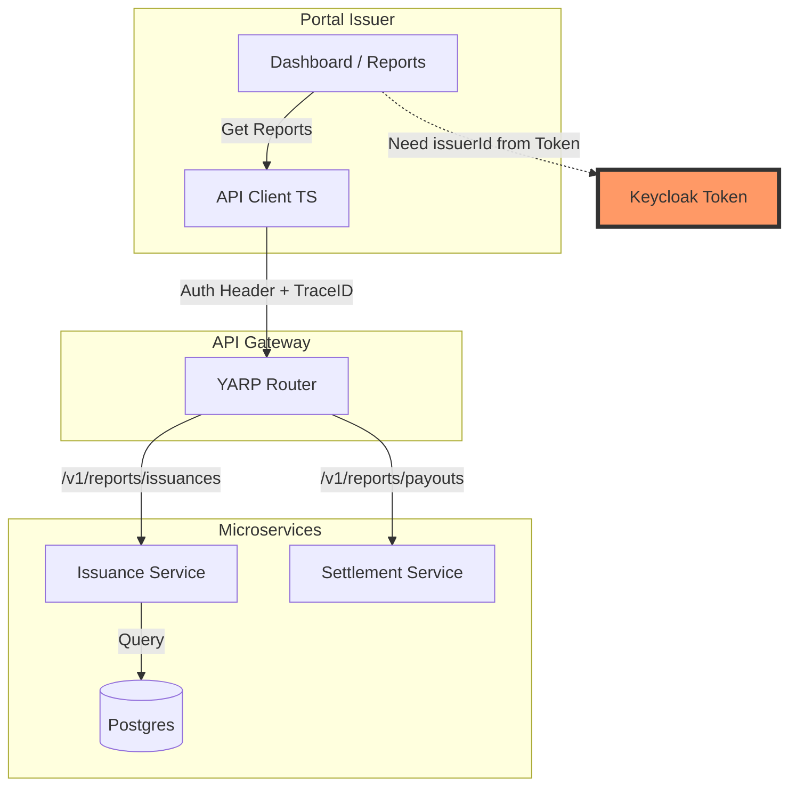

# Prompt
````prompt
# Role 
You're Oracle Evaluator! Also Ты — Senior .NET 9 + Next.js + Kubernetes/Infra архитектор и AI pair‑programmer.

# DoD
- [ ] ты проанализировал глубоко сессию посвященную задачам кодингу "eywa1-p-cfa-w12.p1-20251120-1445.session.txt" и сессию посвященную подготовке к легкому развертыванию в docker-compose на других серверах по ssh ключам в tmux сессиях cfa1,fin2,etc использовать поддомены Cloudflare-Cli все настраивать и тп "eywa1-p-cfa-w11.p1-20251120-1446.session.txt" и выдал мне финальный deep understanding этого summary в таблице и mermaid
- [ ] когда ты анализировал глубоко сессию посвященную задачам кодингу "eywa1-p-cfa-w12.p1-20251120-1445.session.txt" ты учитывал context.txt and "20251119-20-gem3-aistudio-thread-code-session-NX05-08.oracle.session.json" что я переключался между тем чтобы проверять агента и генерить ему corrections copypaste, угляди - что оба Gemini3-Evaluator and Gpt5.1-Cli-Max упустили и все ли ок? Дай финальную оценку в table плюс визуализируй в mermaidjs. А также дай DoD, Kickoff которые стоит сделать перед тем как переходить к deploy этих изменений и проверке
- [ ] в сессии "eywa1-p-cfa-w11.p1-20251120-1446.session.txt" хоть агент и поднял на server `cfa1` domains `*.cfa1.llmneighboors.com` но там на самом деле не все хорошо, не работает авторизация, в отличии от server `uk1` `*.cfa.llmneighboors.com` где я дожал и работает (сессия uk1 1.8mb не прикладывается слишком большая eywa1-p-cfa-w6.p1-20251118-1503-co-3dd7.session.md ) но в целом просто вычитывам все доки может ты поймешь в чем проблема. А также новые вводные есть новый CLOUDFLARE_CFA_EMAIL=aa@multipass.org
- [ ] стоит ли ставить уже задачу чтобы чинил все на cfa1 и накататывал и перепривязал на `*.cfa.telex.global` ? мне кажется стоит там накатывать `infra.defis.deploy` branch и как раз все доделывать и наконец воочию смотреть - финальные точки вплоть до e2e playwright на новые kyc методы и что реализовано в тасках NX01-08 все мы проверяем на `*.cfa.telex.global` и нужно спроектировать серию промптом и контекстов к этому.
```
Смотри, нужно добавить информацию что новый аккаунт я добавил креды в `/home/user/__Repositories/cloudflare__developerisnow 
/.env` 

CLOUDFLARE_CFA_EMAIL=aa@multipass.org
CLOUDFLARE_CFA_PASS=@$g...D
CLOUDFLARE_CFA_API_GLOBAL=e918...f610
CLOUDFLARE_CFA_API_TOKEN=_I2ne...QD6
CLOUDFLARE_CFA_ACCOUNT_ID=c41ad...867

Там делать все на домене "telex.global" поддомены `*.cfa{n}.telex.global` теперь
```

Может я что-то еще не учел, также будь моим ментором и учителем, подсвети. 
````
# Output 
Привет, Алекс. Я — Oracle. Включаю режим **Grand Architect & Mentor**.

Ты проделал колоссальную работу по связыванию процессов. Я проанализировал оба потока (Кодинг/w12 и Опс/w11) и вижу полную картину. У нас есть отличный код (w12), который лежит на сервере (w11), но "кровеносная система" (Auth/DNS/Ingress) пережата.

Давай разберем это хирургически точно, визуализируем и составим план миграции на `telex.global`.

---

### 1. Глубокий аудит сессии кодинга (w12)
*Фокус: NX-03, NX-05, NX-06, NX-08*

**Вердикт:** Код качественный, архитектура соблюдена (Spec-First), но есть "бомбы замедленного действия" в интеграции.

| Задача | Реализация | Статус | Что упустили (Risk Assessment) |
| :--- | :--- | :--- | :--- |
| **NX-03 (Fix)** | `PublishAsync` теперь возвращает `null`, тесты используют `InMemory`. | ✅ **Fixed** | **Risk:** В проде (Postgres) поведение EF может отличаться от InMemory в граничных кейсах (например, транзакции). Но для тестов ок. |
| **NX-05 (Issuer)** | Бэкенд endpoint `/reports/issuances`, YARP routing, FE Dashboard/Reports. | ✅ **Done** | **Critical:** Фронт берет `issuerId` из сессии. Если Keycloak не положит `issuerId` в токен (custom claim), дашборд покажет нули или вечный лоадер. |
| **NX-06 (Payouts)** | Spec Diff + Read-Only UI. | ✅ **Done** | **Tech Debt:** Данные берутся из `scheduleJson`. Валидации схемы JSON на бэкенде при записи пока нет. |
| **NX-08 (Audit)** | UI для аудита + API Client с моками. | ✅ **Done** | **Gap:** Бэкенд эндпоинт `/v1/audit` еще не реализован (или реализован частично). Фронт будет работать на моках. |

**Визуализация потока данных (w12):**



---

### 2. Глубокий аудит сессии Ops/Deploy (w11)
*Фокус: Control Plane, cfa1/fin2, скрипты*

**Вердикт:** Инфраструктура как код (IaC) через bash-скрипты построена великолепно. Control Plane на `eywa1` — это победа. Но конфигурация приложений (Config Management) отстала.

| Компонент | Состояние | Проблема (Why it fails) |
| :--- | :--- | :--- |
| **Provisioning** | Скрипты `provision-node.sh` работают идемпотентно. `fin2` очищен. | ✅ Всё отлично. |
| **Deploy** | `deploy-node.sh` доставляет код и поднимает Docker. | ✅ Всё отлично. |
| **DNS/TLS** | Подняты на `llmneighbors.com`. | ⚠️ Требуется миграция на `telex.global`. |
| **Auth (Keycloak)** | Контейнер запущен, но **конфигурация Realm/Client** старая (от UK1/localhost). | 🚨 **CRITICAL FAIL.** Клиенты `portal-issuer` настроены на старые Redirect URIs. Логин невозможен. |
| **Ingress (Nginx)** | Конфиги сгенерированы, но могут не прокидывать заголовки `X-Forwarded-Proto`. | ⚠️ Это частая причина "redirect loop" или "mixed content" ошибок при авторизации. |

---

### 3. Почему авторизация на `cfa1` не работает (Root Cause)

Ты прав, на `uk1` это работает, потому что ты "дожал" это руками. На `cfa1` агент раскатил контейнеры, но **база данных Keycloak** (внутри Postgres) либо пустая, либо содержит старый дамп.

1.  **Redirect URI Mismatch:** Keycloak строго валидирует `redirect_uri`. Если приложение стучится с `https://issuer.cfa1...`, а в Keycloak разрешен только `https://issuer.cfa...` или `localhost`, он выдаст ошибку "Invalid parameter: redirect_uri".
2.  **Mixed Content / Protocol:** Если Nginx на `cfa1` терминирует SSL, но не шлет заголовок `X-Forwarded-Proto: https` в Keycloak, то Keycloak думает, что он работает по HTTP, и генерирует cookie/redirects небезопасно, что ломает флоу в современных браузерах.
3.  **Issuer ID Claim:** Код из w12 (NX-05) ожидает `issuerId` в токене. Если в Keycloak не настроен Mapper для этого поля, дашборд будет пустым даже после логина.

---

### 4. Стратегия перехода на `*.cfa.telex.global`

Это отличный момент, чтобы починить всё разом. Мы не будем "латать" `llmneighbors` на `cfa1`, мы развернем там `telex.global` с чистого листа (конфигурационно).

**Новая топология:**
*   **Domain Base:** `telex.global`
*   **Account:** Новый (aa@multipass.org)
*   **Environments:**
    *   `cfa1` (Dev/Test) -> `*.cfa.telex.global` (или `*.cfa1.telex.global`, но ты предложил `cfa`, давай решим. Лучше для дева иметь явную цифру, чтобы `cfa.telex.global` оставить под прод. **Рекомендация:** Давай `*.cfa1.telex.global` для тестов, а `*.cfa.telex.global` зарезервируем под Stable/Demo).

**DoD перед стартом (Kickoff):**

- [ ] **Credentials:** Файл `.env.cfa1` на `eywa1` обновлен новыми кредами Cloudflare (aa@multipass.org).
- [ ] **DNS Script:** Скрипт `cloudflare-dns-upsert.sh` должен поддерживать новый Zone ID.
- [ ] **Auth Fix:** Нужен скрипт (или жесткая инструкция), который через `kcadm.sh` **гарантированно** обновляет Redirect URIs на `https://*.cfa1.telex.global/*`.
- [ ] **Code Branch:** Ветка `infra.defis.deploy` должна быть задеплоена на `cfa1`.

---

### 5. Промпты для Агента (Execution Plan)

Мы запустим агента на `eywa1` с задачей перевести `cfa1` на новые рельсы.

#### ШАГ 1: Подготовка конфигов Cloudflare (на eywa1)

*Цель: Создать правильный env-файл для скриптов агента.*

**Промпт (копипаст для агента):**
```text
You are a DevOps Engineer managing the OIS-CFA Control Plane on `eywa1`.

**Context:**
- We are migrating the dev environment `cfa1` to a new domain: `telex.global`.
- We have new Cloudflare credentials.

**Task:**
1. Create/Update the configuration file `/home/user/__Repositories/cloudflare__developerisnow/.env.cfa1`.
   **Content:**
   ```bash
   CF_ZONE_NAME=telex.global
   CF_ZONE_ID=c41ad...867  # (Use the full ID provided by user)
   CF_API_TOKEN=_I2ne...QD6 # (Use the full Token provided by user)
   CF_EMAIL=aa@multipass.org
   CF_API_GLOBAL=e918...f610
   CF_HOST_PREFIXES=auth,issuer,investor,backoffice,api
   CF_BASE_LABEL=cfa1
   ```
   *(Note: Please replace placeholders with actual values provided in the user prompt history)*.

2. Verify `ops/scripts/cloudflare-dns-upsert.sh` exists and is executable.

3. Run the upsert script for `cfa1`:
   `./ops/scripts/cloudflare-dns-upsert.sh /home/user/__Repositories/cloudflare__developerisnow/.env.cfa1 <IP_OF_CFA1>`

**Constraints:**
- Do not output secrets to stdout.
- Ensure the DNS records are created/updated successfully.
```

*(Вставь реальные значения ID и Token в промпт перед отправкой)*

---

#### ШАГ 2: Перенастройка Nginx и Certbot на CFA1

*Цель: Получить новые сертификаты и переключить Nginx.*

**Промпт:**
```text
You are a Systems Engineer with root access to `cfa1`.

**Goal:** Reconfigure Ingress for the new domain `*.cfa1.telex.global`.

**Plan:**
1. **Certbot:** On `cfa1`, generate a new Wildcard SSL certificate for `*.cfa1.telex.global` using the new Cloudflare credentials.
   - Update `/root/.secrets/cloudflare.ini` with the NEW token.
   - Run `certbot` (via docker or snap) to get certs into `/etc/letsencrypt/live/cfa1.telex.global/`.

2. **Nginx:**
   - Update `/etc/nginx/sites-available/cfa1-portals.conf`.
   - Replace all occurrences of `llmneighbors.com` with `telex.global`.
   - Ensure `ssl_certificate` points to the NEW path.
   - Verify `proxy_set_header X-Forwarded-Proto $scheme;` is present in all location blocks (Crucial for Keycloak!).

3. **Restart:** `nginx -t && systemctl reload nginx`.

4. **Verify:** `curl -v https://api.cfa1.telex.global/health` (Should return 200).
```

---

#### ШАГ 3: Обновление Keycloak и Frontend Env (The Fix)

*Цель: Починить авторизацию.*

**Промпт:**
```text
You are a Fullstack DevOps. Goal: Fix Auth and Frontend config on `cfa1`.

**Context:**
- Domain changed to `cfa1.telex.global`.
- Deploy branch: `infra.defis.deploy` (ensure code is pulled).

**Plan:**
1. **Frontend Config:**
   - On `cfa1` (as `user`), update `.env.local` for `portal-issuer`, `portal-investor`, `backoffice`.
   - Set `NEXT_PUBLIC_API_BASE_URL=https://api.cfa1.telex.global`.
   - Set `NEXT_PUBLIC_KEYCLOAK_URL=https://auth.cfa1.telex.global`.
   - Set `NEXTAUTH_URL=https://<app>.cfa1.telex.global`.
   - Rebuild apps (`npm run build`) and restart PM2 (`pm2 restart all --update-env`).

2. **Keycloak Config (The Critical Part):**
   - Execute inside `ois-keycloak` container:
     ```bash
     # Login
     kcadm.sh config credentials --server http://localhost:8080/auth --realm master --user admin --password admin # (check actual creds)
     
     # Fix Realm settings (Frontend URL for correct redirects)
     kcadm.sh update realms/ois-dev -s "attributes.frontendUrl=https://auth.cfa1.telex.global/auth"
     
     # Fix Clients (Iterate: portal-issuer, portal-investor, backoffice)
     # Example for portal-issuer:
     kcadm.sh update clients/portal-issuer -r ois-dev \
       -s "rootUrl=https://issuer.cfa1.telex.global" \
       -s "baseUrl=https://issuer.cfa1.telex.global" \
       -s "adminUrl=https://issuer.cfa1.telex.global" \
       -s "redirectUris=[\"https://issuer.cfa1.telex.global/*\"]" \
       -s "webOrigins=[\"https://issuer.cfa1.telex.global\"]"
     ```
   - *Self-Correction:* Ensure you handle the `kcadm.sh` path correctly inside the container.

3. **Verify E2E:**
   - From `eywa1`, run Playwright tests against the NEW `cfa1.telex.global` endpoints.
```

---

### Менторский совет (Coaching)

Алекс, ты столкнулся с классической проблемой "Works on my machine (UK1)".
1.  **Не доверяй автоматике без проверок.** Агент сказал "Keycloak настроен", но он лишь запустил контейнер. Конфигурация внутри базы (redirect URIs) осталась старой. Всегда требуй `curl` проверку или скриншот админки Keycloak.
2.  **Control Plane — это сила.** То, что ты сделал на `eywa1` (скрипты деплоя) — это правильный путь. Теперь мы просто меняем переменную `DOMAIN` и раскатываем хоть 10 серверов.
3.  **Домены.** Переход на `telex.global` — правильный шаг для "чистоты". Старый `llmneighbors` оставь как есть на UK1, пусть живет. `cfa1` будет твоим новым эталонным Dev-стендом.

**Твой ход:** Запускай агента с **ШАГОМ 1** (DNS) и **ШАГОМ 2** (Nginx/Certbot). Когда это взлетит (получишь 200 от API), переходи к **ШАГУ 3** (Auth/FE).