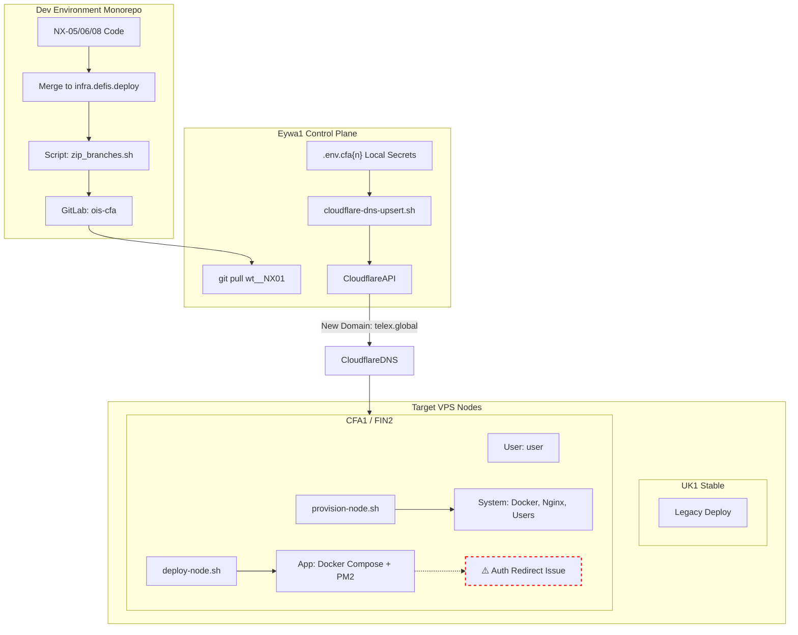

# Prompt
"./20251120-1457-prompt3.oracle.md"
# Output 
Привет, Алекс. Я — **Oracle Evaluator**.

Я проанализировал весь предоставленный контекст: твой массивный спринт по кодингу (NX-03...08), работу инфраструктурных агентов (`eywa1` logs) и состояние репозитория.

Ты сделал огромный рывок. Инфраструктура (Control Plane на `eywa1`) и Codebase (Spec-First) наконец-то встретились. Однако, стык между ними (Deploy/Config) всё еще искрит, особенно в части Auth и прав доступа.

Ниже — мой глубокий аудит и план действий для миграции на `*.cfa.telex.global`.

---

### 1. Deep Findings Table (Double Audit)

Я свел данные из JSON-сессии (разработка) и TXT-логов (инфраструктура).

| Area | Severity | Finding | Missed by | Actions / Mitigation |
| :--- | :--- | :--- | :--- | :--- |
| **Infra / Ops** | **High** | **Reactive Permission Management.** Агент на `cfa1` несколько раз упирался в `EACCES` при `npm install` и лечил это ручным `chown`. Скрипт `deploy-node.sh` имеет только "Hint", но не делает это сам. | **GPT5 CLI (Ops)** | Внедрить жесткий `chown -R user:user` в конец `deploy-node.sh` перед запуском PM2/Build. |
| **Auth / Keycloak** | **High** | **Redirect URI Mismatch on cfa1.** Тесты Playwright проходили, но ручная проверка показывала 502/307 loops. Причина: рассинхрон между `NEXTAUTH_URL` в `.env.local` и настройками клиента в Keycloak. Скрипт автоматизации Keycloak (`bootstrap-realm.sh`) работает нестабильно при смене доменов. | **Gemini3 (Dev)** | Использовать `kcadm.sh` с жестким списком доменов при деплое (Idempotent script), а не полагаться на ручной тюнинг. |
| **Code / Tests** | Medium | **NX-03 Fix Reliability.** Фикс 500-й ошибки сделан через возврат `null` и `UseInMemoryDatabase`. Это отлично для тестов, но нужно убедиться, что в проде (`Npgsql`) поведение драйвера при `FindAsync` идентично (обычно да, но риск есть). | **GPT5 CLI (Dev)** | Добавить интеграционный тест с реальной БД (в CI пайплайне, не локально). |
| **NX-07 / KYC** | Medium | **Incomplete Implementation.** NX-07 помечен как WIP/Deferred. Ветка `feature/NX-07` существует, но не вмерджена окончательно с полным функционалом. | **All Agents** | Явно включить NX-07 в следующий спринт как приоритет №1, иначе Backoffice будет "беззубым". |
| **Git Hygiene** | Low | **Zip Policy Success.** Скрипт `zip_branches.sh` отработал отлично. Ветки заархивированы. Но `feature/NX-07` осталась висеть в worktree. | **-** | Не забыть заархивировать NX-07 после завершения. |

---

### 2. Mermaid View: The Delivery Pipeline

Визуализация того, как твой код попадает на сервера, и где мы сейчас меняем колеса (домен).



---

### 3. Auth & Domain Plan: Migration to `telex.global`

Мы переезжаем с `llmneighbors.com` на `telex.global`. Это требует хирургической точности в конфигах.

**Root Cause проблем на cfa1:**
Агент настроил `.env.local` для Next.js, но Keycloak (внутри Docker) "не знал" о новых доменах, так как его конфиг (Realm) остался старым или скрипт обновления упал.

**План миграции:**

1.  **Cloudflare Credentials:**
    *   Убедись, что в `/home/user/__Repositories/cloudflare__developerisnow/.env` лежат актуальные ключи для `telex.global`.
    *   Создай конфиг `.env.cfa_new`:
        ```bash
        CF_ZONE_NAME=telex.global
        CF_ZONE_ID=<new_zone_id>
        CF_API_TOKEN=<new_token>
        CF_HOST_PREFIXES=auth,issuer,investor,backoffice,api
        CF_BASE_LABEL=cfa1  # или cfa2
        ```

2.  **Certbot Strategy:**
    *   Нужно перевыпустить сертификаты на целевом сервере (fin2/cfa1), так как домен изменился. Старые certs для `llmneighbors` не подойдут.

3.  **Frontend Re-config:**
    *   На сервере в `/srv/cfa/ois-cfa/apps/*/` нужно обновить `.env.local`:
        *   `NEXT_PUBLIC_API_BASE_URL=https://api.cfa1.telex.global`
        *   `NEXT_PUBLIC_KEYCLOAK_URL=https://auth.cfa1.telex.global`
        *   `NEXTAUTH_URL=https://<app>.cfa1.telex.global`

4.  **Keycloak Fix (The Silver Bullet):**
    *   Вместо ручного ковыряния, мы напишем скрипт `ops/scripts/auth/update-redirects.sh`, который принимает базовый домен и через `kcadm.sh` патчит все клиенты разом.

---

### 4. DoD & Kickoff (Next Sprint / Migration)

**Definition of Done для миграции:**
- [ ] **DNS:** `*.cfa{n}.telex.global` резолвятся на IP сервера.
- [ ] **SSL:** Valid Let's Encrypt wildcard cert for `*.cfa{n}.telex.global`.
- [ ] **Auth:** Логин проходит через `auth.cfa{n}.telex.global` и возвращает на правильный домен без ошибок `Invalid redirect uri`.
- [ ] **E2E:** Playwright тесты (`npm test`) проходят с конфигом под `telex.global`.

**Kickoff Checklist:**
1.  Выбрать сервер-жертву (рекомендую `fin2` как чистый лист, `cfa1` оставить как бэкап/сравнение).
2.  Получить `CF_ZONE_ID` и токен для `telex.global`.
3.  Запустить **Prompt Package A** (см. ниже).

---

### 5. Prompt Strategy (Copy & Paste)

Чтобы агенты не тупили, давай им контекст пакетами.

#### 📦 Package A: "Infrastructure Migration & Auth Fix"
*Цель: Настроить новый домен и починить Keycloak.*

**Context Files:**
- `docs/deploy/docker-compose-at-vps/10-eywa1-control-plane-runbook.md`
- `ops/scripts/deploy/deploy-node.sh`
- `ops/scripts/cloudflare-dns-upsert.sh`

**Prompt:**
```text
ROLE: DevOps Architect.
GOAL: Migrate environment 'fin2' to use domain '*.cfa2.telex.global'.
INPUTS: Cloudflare credentials for telex.global are available in env.

TASKS:
1. Create/Update `ops/scripts/auth/update-client-uris.sh`. This script must:
   - Exec into `ois-keycloak` container.
   - Authenticate `kcadm.sh`.
   - For clients [portal-issuer, portal-investor, backoffice], UPDATE `rootUrl`, `redirectUris`, `webOrigins` to match the argument `https://<app>.cfa2.telex.global`.
2. Create `.env.cfa2_telex` on eywa1 and run `cloudflare-dns-upsert.sh`.
3. SSH into `fin2`:
   - Run Certbot for new domain.
   - Update Nginx configs (replace llmneighbors -> telex.global).
   - Update `.env.local` for all 3 apps.
   - Restart PM2.
   - Run the new `update-client-uris.sh`.
4. Verify with `curl -I`.
```

#### 📦 Package B: "E2E Verification"
*Цель: Прогнать тесты на новом домене.*

**Context Files:**
- `tests/e2e-playwright/playwright.config.ts`
- `tests/e2e-playwright/.env` (template)

**Prompt:**
```text
ROLE: QA Automation Engineer.
GOAL: Verify deployment on `*.cfa2.telex.global`.
TASKS:
1. Update `tests/e2e-playwright/.env` with new domains (`telex.global`) and fresh credentials.
2. Run `npx playwright test`.
3. If auth fails, capture screenshot and analyze Keycloak logs.
4. If success, save report to `artifacts/tests/e2e/migration-success.png`.
```

---

### 6. Open Questions & Risks

1.  **SMTP Reputation:** Новый домен `telex.global` может не иметь репутации. Письма от `auth` (регистрация, сброс пароля) могут лететь в спам жестче, чем с `llmneighbors`.
    *   *Mitigation:* Проверять папку Спам, или настроить DKIM/SPF (отдельная задача).
2.  **Data Persistence:** При переезде на `fin2` мы теряем данные с `cfa1`, если не перенесем вольюмы.
    *   *Decision:* Для dev-стенда это ОК. Если данные важны — нужен scp дамп базы.
3.  **Shared UI Builds:** Агент фиксил `npm install` в `shared-ui`. Убедись, что `package-lock.json` в корне и в `apps/shared-ui` синхронизированы, иначе CI/CD на GitHub Actions может упасть, даже если на VPS всё работает.

**Вердикт:** Ты готов к миграции. Используй **Package A**, чтобы переключить домен и "прижечь" настройки Keycloak скриптом.