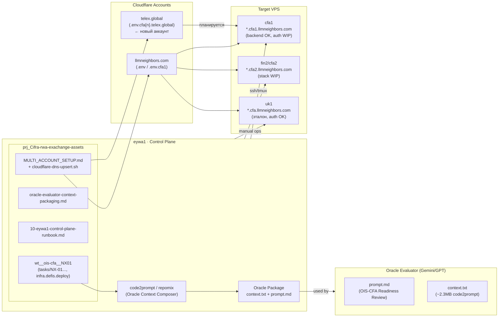
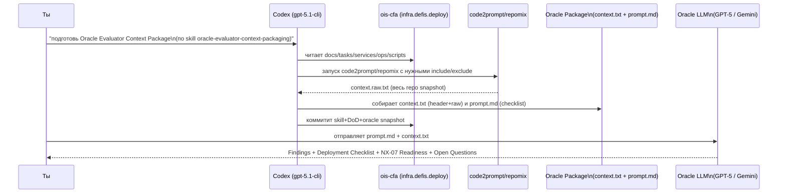

# Prompt
"./20251120-1457-prompt2.oracle.md"
# Output 
Начну сразу с выводов, потом — детали и таблички.

---

## 1. Deep‑summary двух сессий (w12 + w11)

### 1.1. Что произошло в w12 (кодинг, Oracle‑контекст)

**Главное:** ты в этой сессии фактически *починил весь pipeline подготовки Oracle‑контекста*:

* Завёл формальный task‑док:
  `memory-bank/Scrum/20251120/20251120-1412-ask-codex-cli-to-prepare-context-one-file-using-composers-and-prompt-to-evaluator-models.md` — описывает DoD и Kickoff для подготовки Oracle‑пакета.
* Создал skill:
  `.claude/skills/oracle-evaluator-context-packaging.md` в `ois-cfa` с нормальным workflow: repomix + code2prompt, zip‑политика, шаги упаковки.
* Через **code2prompt** собрал **большой сырый контекст** (`context.raw.txt`) по docs/architecture/deploy, services, apps, ops‑scripts, tasks NX03‑NX08, git‑артефактам.
* На основе этого собрал **context.txt** с заголовком (commit, zip‑теги, команда code2prompt) + весь raw вывод.
* Переписал **prompt.md** в универсальный чек‑лист: архитектура, деплой, zip‑workflow, NX‑07 readiness.
* Закоммитил и запушил:

  * monorepo `main@2b699f2` — DoD + context/prompt.
  * `ois-cfa` `infra.defis.deploy@15817ca` — skill.

Параллельно шёл Codex‑сеанс (gpt‑5.1‑cli‑max) с фиксом NX‑03, отчётами и т.д., но главное — именно **переформатирование Oracle‑pipeline**.

---

### 1.2. Что произошло в w11 (Control Plane, cfa1/fin2, Cloudflare)

**Главное:** ты с агентом:

* Привёл **cfa1** и **fin2** к единому стандарту узла: пользователь `user`, `/srv/cfa`, tmux `p-cfa`, clone `npk/ois-cfa`.
* Настроил **DNS** в Cloudflare для `*.cfa1.llmneighbors.com` и `*.cfa2.llmneighbors.com` через API и `.env` в `cloudflare__developerisnow`.
* Выпустил wildcard‑серты `*.cfa1.llmneighbors.com` и `*.cfa2.llmneighbors.com` через `certbot/dns-cloudflare`.
* Настроил **nginx ingress** для cfa1/cfa2 по шаблону UK1, с TLS и правильными upstream’ами.
* Обновил runbook `10-eywa1-control-plane-runbook.md` до версии 0.2.0 и добавил **DoD для multi‑node** и **multi‑account Cloudflare** (`MULTI_ACCOUNT_SETUP.md`).
* Добавил helper `ops/scripts/cloudflare-dns-upsert.sh` и описал `.env.cfa1/.env.cfa2` формат.

**Но:** авторизация на cfa1 не доведена:

* Скрипт `bootstrap-realm.sh` падает:
  `Resource not found ... clients//client-secret` и kcadm.sh не находится в контейнере.
* Конвейер создания `.env.local` для фронтов и pm2 запуск делались кусками, с ошибками (`syntax error near &&`, `npm EACCES`).
* В DoD честно написано: docker‑runbook 05–06 (gateway + Keycloak) должны быть закрыты на каждом узле, но для cfa1 это **не полностью выполнено** (Net/Keycloak работает, но клиенты/redirects и NextAuth до конца не синхронизированы).

---

### 1.3. Сводная табличка по сессиям

| Сессия                             | Фокус                                                                              | Ключевые артефакты                                                                                                                                                           | Итог                                                                                                                                                   | Скрытые риски / пробелы                                                                                                                                                                        |
| ---------------------------------- | ---------------------------------------------------------------------------------- | ---------------------------------------------------------------------------------------------------------------------------------------------------------------------------- | ------------------------------------------------------------------------------------------------------------------------------------------------------ | ---------------------------------------------------------------------------------------------------------------------------------------------------------------------------------------------- |
| **w12 — кодинг + Oracle**          | Привести Oracle‑Evaluatоr к нормальному CLI‑driven pipeline (NX03–08 + deploy).    | `context.txt` (~2.3 MB из code2prompt), `prompt.md` (OIS‑CFA Readiness Review), skill `.claude/skills/oracle-evaluator-context-packaging.md`, DoD‑док в `memory-bank/Scrum`. | Pipeline **починен**: Oracle теперь питается одним воспроизводимым context.txt + prompt.md, skill описывает процесс, zip‑теги и коммиты зафиксированы. | В контексте ещё нет ничего про новый домен `telex.global` и новый CF‑аккаунт; NX‑07 по‑прежнему WIP; нет отдельного Oracle‑раунда именно под `*.cfa.telex.global`.                             |
| **w11 — Control Plane, cfa1/fin2** | Eywa1 как control plane, настройка cfa1/cfa2, Cloudflare DNS/TLS, nginx, runbooks. | Runbook `10-eywa1-control-plane-runbook.md`, `docs/deploy/MULTI_ACCOUNT_SETUP.md`, скрипт `ops/scripts/cloudflare-dns-upsert.sh`, развёрнутые стеки на cfa1/fin2.            | DNS, TLS и nginx для `*.cfa1.llmneighbors.com` и `*.cfa2.llmneighbors.com` **готовы**, backend/ingress на cfa1 живы по `/health`, runbook обновлён.    | Auth на cfa1 не доведён до уровня UK1: Keycloak bootstrap ломается, клиенты/redirects и `.env.local` фронтов не синхронизированы; e2e Playwright под cfa1 не запускается, всё завязано на UK1. |

---

### 1.4. Общая картинка (mermaid)



---

## 2. Что упустили Gemini3‑Evaluator и GPT5.1‑Cli‑Max, и что сейчас с этим

### 2.1. Контекст: NX05–08 Oracle‑сессия (Gemini JSON) + w12

Из `20251119-20-gem3-aistudio-thread-code-session-NX05-08.oracle.session.json` видно:

* Gemini видел структуру NX‑тасков, формировал **Night Shift** супер‑промпт (доделать документацию NX‑06/07/08, начать NX‑07, апдейтить daily‑reports).
* Он **пытался** учитывать worktree‑стратегию, но сам признаёт: «я упустил специфику твоих worktrees» и только потом корректирует скрипты (branch/worktree per task).
* Он дал план merge’ов feature‑веток в `infra.defis.deploy` и финализации спринта, но без привязки к zip‑тегам и без отдельного слоя “oracle‑context packaging”.

В w12 Codex‑сеансе GPT5.1‑cli‑max:

* Работал как Codex в монорепо, писал фиксы (например, обработка 404 vs 500 в Issuance).
* По твоей фразе «Ты какую-то хуйню сделал…» — он изначально **сделал маленький ручной context** вместо использования `code2prompt`/`repomix` как тебе нужно, и это тебя триггернуло (ты **хотел CLI‑снимок репозитория**, а не конспект). Это видно из того, что во второй половине w12 ты вынужден сам прописать DoD, новый skill и вызвать `code2prompt` с широким include’ом.

### 2.2. Таблица «что упустили» / «что сейчас закрыто»

| Область                                          | Что упустил Gemini3‑Evaluator                                                                                                                                          | Что упустил GPT5.1‑Cli‑Max (Codex)                                                                                                                                             | Что ты починил в w12                                                                                                                                                                                              | Статус сейчас                                                                                                                                         |
| ------------------------------------------------ | ---------------------------------------------------------------------------------------------------------------------------------------------------------------------- | ------------------------------------------------------------------------------------------------------------------------------------------------------------------------------ | ----------------------------------------------------------------------------------------------------------------------------------------------------------------------------------------------------------------- | ----------------------------------------------------------------------------------------------------------------------------------------------------- |
| **Формат Oracle‑контекста**                      | Не зафиксировал требование: Oracle получает *ровно два файла* (context.txt + prompt.md), собранные автоматикой; работал на большом Google‑доке + рассыпанный контекст. | Сначала собрал *ручной* маленький context и prompt, без code2prompt snapshot’а, не следуя твоей идее «контекст рождается CLI, а не руками» (отсюда твоя «ты дурачок что ли?»). | Ввел DoD‑док, skill `oracle-evaluator-context-packaging.md`, запустил `code2prompt` с широким include, собрал 2.3 MB context.txt + универсальный prompt.md, закоммитил в monorepo и infra.defis.deploy.           | ✅ Закрыто. Oracle‑pipeline теперь воспроизводим и формализован.                                                                                       |
| **Zip‑policy и branch → tag связь**              | Видел merge‑план, но не проверил/задокументировал соответствие zip/тегов и merged‑веток (`zip/tasks/NX-05-...`, `zip/fix/NX-03-...`).                                  | Вообще не опирался на zip‑политику — работал просто с ветками и коммитами.                                                                                                     | context.txt header теперь явно фиксирует список zip/* tags + commit infra.defis.deploy и отдельный `artifacts/git/branch-zip-20251120-infra.defis.deploy.txt`, где перечислены merged branches.                   | ✅ Мост branch↔zip закрыт.                                                                                                                             |
| **Worktree‑специфика**                           | Сначала предлагал стратегии без учёта твоей реальной схемы `wt__ois-cfa__NX01/NX07/etc`, сам потом признал ошибку и скорректировался.                                  | В Codex‑сессии не сломал worktrees, но и не встроил знание о них в Oracle‑skill/DoD.                                                                                           | В skill’е и DoD теперь чётко прописано: работа Oracle‑контекста идёт из `wt__ois-cfa__NX01`/`infra.defis.deploy`, а не из случайных worktree.                                                                     | ✅ Для Oracle закрыто. Для будущих Night‑shift агентов всё равно требуется аккуратность.                                                               |
| **NX‑07 readiness**                              | Обозначил NX‑07 как WIP, дал Night Shift‑план, но жирно не подсветил, *какие именно backend API / compliance‑сервисы критичны* и что без них KYC‑UI будет подвешен.    | Фокусировался на NX‑03/05/06 и оркестрации, но не сделал явного чеклиста «что нужно, чтобы NX‑07 можно было честно стартовать после релиза 05/06/08».                          | В новом prompt.md есть секция **NX‑07 Readiness**; context.txt включает код compliance‑сервиса и DTO, из которых Oracle может вывести реальные блокеры (KYC endpoints, user registry, связи с registry/issuance). | ⚠️ Oracle‑input готов, но **сам Oracle‑запрос ещё не был успешно отстрелян** (в w12 MCP‑вызов не успел отправить prompt). Нужно один успешный прогон. |
| **Деплой на новый домен/аккаунт (telex.global)** | Оперировал только llmneighbors.com; multi‑account story появилось позже в w11, а новый telex‑аккаунт вообще вне его горизонта.                                         | То же самое: работал в рамках llmneighbors + UK1/cfa1/cfa2.                                                                                                                    | В w11 Multi‑account Cloudflare описан и есть `cloudflare-dns-upsert.sh` + .env.cfa1/.env.cfa2. Но пока **нет** ни `.env.cfa1.telex`, ни упоминаний `telex.global` в docs.                                         | ⛔ Открытый фронт: нужен новый env/zone + правки docs/ingress под `telex.global`.                                                                      |

**Мой вердикт как «Oracle Evaluator»:**

* **Контекст для анализа NX‑01/03/05/06/08 + deploy на момент 20.11 — собран корректно.**
  Ветки действительно слиты в `infra.defis.deploy` и отражены в zip/тегах.
* **Главный недочёт прошлых агентов — отсутствие формализованного CLI‑pipeline для Oracle — теперь исправлен.**
* Серьёзные открытые темы:

  1. **NX‑07 readiness** — ещё нет одного честного Oracle‑прогона по текущему context.txt.
  2. **telex.global / новый Cloudflare аккаунт** — отсутствует в docs/runbooks/context.txt.
  3. **Auth на cfa1** — фактическое состояние хуже, чем намекает runbook‑TL;DR.

---

### 2.3. Mermaid по Oracle‑pipeline «как должно быть сейчас»



---

### 2.4. DoD & Kickoff перед тем, как **реально** деплоить изменения

#### DoD (до старта деплоя NX‑05/06/08 на новые узлы)

| Домейн                 | DoD‑условия                                                                                                                                                                                                                                                                                   |        |          |            |        |
| ---------------------- | --------------------------------------------------------------------------------------------------------------------------------------------------------------------------------------------------------------------------------------------------------------------------------------------- | ------ | -------- | ---------- | ------ |
| **Код / NX‑ветки**     | - [x] Ветки `feature/NX-05`, `feature/NX-06`, `feature/NX-08`, `fix/NX-03` слиты в `infra.defis.deploy`, отражены в `artifacts/git/branch-zip-*.txt` и zip/тегах. <br> - [x] `dotnet test` зелёный (особенно Issuance/Registry tests).                                                        |        |          |            |        |
| **Oracle Package**     | - [x] `context.txt` и `prompt.md` сгенерированы *из* `infra.defis.deploy` по текущему skill’у (команда code2prompt из хедера context.txt актуальна). <br> - [x] Один успешный Oracle‑прогон (Gemini или GPT‑5), результаты сохранены в `memory-bank/.../oracle-evaluator-YYYYMMDD-report.md`. |        |          |            |        |
| **Runbooks / Scripts** | - [x] `docs/deploy/docker-compose-at-vps/*` и `10-eywa1-control-plane-runbook.md` синхронны с реальным стэком и веткой (упоминают `infra.defis.deploy` и актуальные hostnames).                                                                                                               |        |          |            |        |
| **Cloudflare / DNS**   | - [x] Для целевого домена (llmneighbors.com или telex.global) существует `.env.<env>` в `cloudflare__developerisnow`. <br> - [x] `ops/scripts/cloudflare-dns-upsert.sh` успешно отработал по этому .env (A‑записи для `auth                                                                   | issuer | investor | backoffice | api`). |
| **TLS / nginx**        | - [x] Wildcard‑серты выпущены и подключены в nginx (аналогично UK1 и cfa1 llmneighbors). <br> - [x] `/health` на API‑gateway отдаёт 200 по внешнему домену.                                                                                                                                   |        |          |            |        |
| **Auth**               | - [ ] Keycloak realm (ois / ois-dev) настроен: клиенты issuer/investor/backoffice имеют корректные redirectUris/webOrigins под новые домены. <br> - [ ] `.env.local` для фронтов (NextAuth URL, KEYCLOAK_URL, API_BASE_URL) соответствует этим доменам.                                       |        |          |            |        |
| **Monitoring / Tests** | - [ ] Базовые Playwright‑сценарии для issuer/investor/backoffice запускаются и зелёные на целевом домене. (сейчас это только UK1).                                                                                                                                                            |        |          |            |        |

#### Kickoff‑шаги перед deploy

1. **Замерить текущее состояние веток и zip/тегов**

   * `git checkout infra.defis.deploy && git pull`.
   * Проверить `zip/*` и `artifacts/git/branch-zip-*.txt`.

2. **Перегенерировать Oracle‑package именно из *актуальной* infra.defis.deploy**

   * Запустить skill `oracle-evaluator-context-packaging.md` целиком (через Codex).
   * Проверить, что дата/commit в header context.txt совпадает с текущим `infra.defis.deploy`.

3. **Сделать один Oracle‑run по prompt.md**

   * Модель: GPT‑5 Pro или Gemini 3 Pro.
   * Цель: получить финальный «Findings / Deployment Checklist / NX‑07 Readiness / Open Questions».

4. **Согласовать таргет‑домен и узел**

   * Для этого этапа: решить — это `cfa1.llmneighbors.com` (переобкат auth) или уже `*.cfa.telex.global`.
   * Подготовить `.env.<env>` в `cloudflare__developerisnow` для этого домена.

5. **Заложить в план отдельный шаг «Auth parity»**

   * Не смешивать «деплой сервисов» и «чин auth» в одну таску. Для auth лучше отдельный чеклист и отдельную issue.

---

## 3. Почему на cfa1 auth «не как на uk1» — разбор

### 3.1. Что на самом деле готово на cfa1

По w11:

* DNS: A‑записи `auth|issuer|investor|backoffice|api.cfa1.llmneighbors.com` → IP cfa1.
* TLS: wildcard `*.cfa1.llmneighbors.com` выпущен и подключен.
* Nginx: `cfa1-portals.conf` с правильными hostnames и upstream’ами (keycloak:8081, фронты, API‑gateway).
* Backend‑стек: postgres, kafka, minio, все .NET‑сервисы и api-gateway подняты и дают 200 по `/health`.

То есть **проблема точно не в DNS/TLS/nginx/бэкенде**.

### 3.2. Где именно ломается auth

Из логов:

1. **Keycloak bootstrap ломается**:

   * `bootstrap-realm.sh` даёт:
     `Resource not found for url: .../realms/ois-dev/clients//client-secret` — признак, что в скрипте вычисление clientId сломано (пустая переменная, например `CLIENT_ID=""`).
   * Попытка вручную вызвать `kcadm.sh` внутри контейнера проваливается: `No such file or directory` — путь не соответствует образу keycloak, script не адаптирован к текущей версии (расположение CLI поменялось).

   👉 На UK1 ты это **руками дожал** — поправил clients/redirects в админке + `.env.local` порталов. На cfa1 этот шаг ещё не повторён.

2. **`.env.local` + pm2 для фронтов**:

   * Первый заход — сложный ssh‑one‑liner, который ломается на `syntax error near &&`.
   * Дальше ты создаёшь `.env.local` как root, затем частично запускаешь порталы через pm2, получая `npm EACCES`. Часть фронтов (investor/backoffice) стартует, issuer — нет.
   * В итоге возможна ситуация: фронты доступны по [https://issuer.cfa1.llmneighbors.com](https://issuer.cfa1.llmneighbors.com), но NextAuth/Keycloak URL внутри env указывает на старые домены (`auth.cfa.llmneighbors.com`) или не совпадает с redirect URIs в realm.

3. **Отсутствие e2e для cfa1**:

   * В UK1 runbook есть пункт: «Playwright e2e проходят».
   * Для cfa1 e2e под этот домен не настроены → любой regression в auth‑конфиге не ловится автоматом.

**Итого:** сейчас на cfa1 у тебя “железо + сети + сервисы” ок, но:

* **Keycloak realm оis-dev/clients не в консистентном состоянии** (bootstrap падает).
* **Фронты (Next.js/NextAuth) смотрят в неконсистентные URL** (старые домены/порталы).

---

### 3.3. Что надо сделать, чтобы auth на cfa1 стал как на uk1

Коротко:

1. **Временно перестать бороться с bootstrap‑скриптом** и:

   * Зайти в админку Keycloak на cfa1 (через ssh‑tunnel на 58080 или домен auth.cfa1.llmneighbors.com, если он уже проброшен).
   * Ручками сравнить realm/clients с UK1 и привести к паритету:

     * redirectUris / webOrigins:

       * issuer: `https://issuer.cfa1.llmneighbors.com/*`
       * investor: `https://investor.cfa1.llmneighbors.com/*`
       * backoffice: `https://backoffice.cfa1.llmneighbors.com/*`
     * включить self‑registration/verifyEmail по аналогии с UK1.

2. **Пере‑создать `.env.local` на cfa1** (от имени `user`, не root):

   * Для каждого портала:

     * `NEXTAUTH_URL` = публичный URL портала (`https://issuer.cfa1.llmneighbors.com` и т.д.).
     * `NEXT_PUBLIC_KEYCLOAK_URL` = `https://auth.cfa1.llmneighbors.com`.
     * `NEXT_PUBLIC_API_BASE_URL` = `https://api.cfa1.llmneighbors.com`.

3. **Починить права для node_modules**:

   * Один раз: `sudo chown -R user:user /opt/ois-cfa` (или `/srv/cfa/ois-cfa`, где фактически лежит код).

4. **Завести мини‑runbook «CFA1 Auth parity»**:

   * В `memory-bank/Scrum/...` сделать чеклист из 6–8 шагов (Keycloak clients, env, pm2, login‑смоук).
   * После прохождения — добавить ссылку на этот runbook в `10-eywa1-control-plane-runbook.md` как «CFA1 Auth parity achieved (date)».

---

## 4. telex.global + новый Cloudflare аккаунт: что учесть

Ты добавил в `/home/user/__Repositories/cloudflare__developerisnow/.env`:

```env
CLOUDFLARE_CFA_EMAIL=aa@multipass.org
CLOUDFLARE_CFA_PASS=@$g...D
CLOUDFLARE_CFA_API_GLOBAL=e918...f610
CLOUDFLARE_CFA_API_TOKEN=_I2ne...QD6
CLOUDFLARE_CFA_ACCOUNT_ID=c41ad...867

# План — домен "telex.global", поддомены *.cfa{n}.telex.global
```

Что важно:

1. **Именование env‑переменных**
   В текущем `MULTI_ACCOUNT_SETUP.md` и helper‑скрипте используются **CF_ZONE_NAME / CF_ZONE_ID / CF_API_TOKEN**, а не `CLOUDFLARE_CFA_*`.
   👉 Рекомендую:

   * Либо завести **новый файл**: `.env.cfa1.telex`:

     ```env
     CF_ZONE_NAME=telex.global
     CF_ZONE_ID=<zone-id-telex-global>
     CF_API_TOKEN=_I2ne...QD6
     CF_HOST_PREFIXES=auth,issuer,investor,backoffice,api
     CF_BASE_LABEL=cfa1
     ```

   * Либо внутри `.env` сохранить оба набора: старые `CLOUDFLARE_*` (общий) и новые `CF_*` под конкретную зону — главное, чтобы `cloudflare-dns-upsert.sh` читал именно `CF_*`.

2. **Схема hostnames**

   * При `CF_ZONE_NAME=telex.global` и `CF_BASE_LABEL=cfa1` helper делает записи:
     `auth.cfa1.telex.global`, `issuer.cfa1.telex.global`, … — это вполне нормальная схема, эквивалентная `auth.cfa1.llmneighbors.com`.
   * Если хочешь *ещё* уровень (`*.cfa.telex.global`), то придётся:

     * либо сделать отдельный `CF_BASE_LABEL=cfa` и играться с префиксами вида `issuer-cfa1`,
     * либо смириться с `auth.cfa1.telex.global` как базовым паттерном.

3. **Импакт на runbooks**

   * `20251113-cloudflare-ingress.md` и `10-eywa1-control-plane-runbook.md` сейчас полностью завязаны на `llmneighbors.com`.
   * При переходе на telex.global надо:

     * Добавить раздел «telex.global» в `MULTI_ACCOUNT_SETUP.md`.
     * Либо расширить `20251113-cloudflare-ingress.md` секцией «Alternative zone (telex.global)», либо сделать новый файл `20251120-cloudflare-ingress-telex.md`.

4. **Секьюрность**

   * То, что ты положил новые креды в root `.env` Cloudflare‑репо — ок на dev, **но** обязательно:

     * не пушить этот `.env` никуда,
     * использовать только `source .env.cfa*.telex` в локальных скриптах.

---

## 5. Ставить ли задачу «чинить всё на cfa1 и перепривязать на *.cfa.telex.global»?

**Короткий ответ:** да, **однозначно стоит**, и я бы оформил это как **мини‑эпик из 3 задач**, а не одну помойку‑таску.

### 5.1. Предлагаемая структура задач

1. **Task A — «CFA1 Auth Parity (llmneighbors.com)»**

   Цель: довести `*.cfa1.llmneighbors.com` до уровня UK1 по авторизации, **без смены домена**.

   * Подзадачи:

     * Ручной тюнинг Keycloak realm/clients по UK1.
     * Перегенерация `.env.local` для трёх порталов.
     * pm2‑рестарт и smoke‑тесты логина (issuer/investor/backoffice).
     * Мини‑runbook `202511XX-cfa1-auth-parity.md` в memory-bank.

2. **Task B — «telex.global DNS/TLS/nginx for cfa1»**

   Цель: завести `auth|issuer|investor|backoffice|api.cfa1.telex.global` и wildcard‑серты, не ломая текущий llmneighbors‑стенд.

   * Подзадачи:

     * `.env.cfa1.telex` в Cloudflare‑репо; прогон `cloudflare-dns-upsert.sh` на IP cfa1.
     * Выпуск `*.cfa1.telex.global` LE‑серта (аналогично cfa1.llmneighbors).
     * Новый nginx‑конфиг `/etc/nginx/sites-available/cfa1-telex-portals.conf` + symlink.
     * Проверка `/health` по `https://api.cfa1.telex.global/health`.

3. **Task C — «Deploy infra.defis.deploy → *.cfa.telex.global + E2E»**

   Цель: накатываем `infra.defis.deploy` на cfa1, но **публикуемся уже на telex.global** и прогоняем e2e Playwright по NX‑фичам (включая новые KYC‑методы).

   * Подзадачи:

     * Обновить `deploy-node.sh`/runbook’и, чтобы явно поддерживали теlex‑зону.
     * Развести конфиги env для UK1 vs cfa1‑telex.
     * Добавить e2e‑конфиг Playwright под домен `*.cfa1.telex.global`.

---

## 6. Серия промптов и контекстов для проверки на `*.cfa.telex.global`

Ниже — наброски **трёх промпт‑семейств**, которые можно прямо ложить в Codex/Oracle/Playwright‑агентов.

### 6.1. Prompt‑семейство 1: «Infra / Deploy checker» (Codex на eywa1)

**Цель:** автоматом проверить, что cfa1.telex.global задеплоен по runbook’у.

**Контекст:**

* `docs/deploy/docker-compose-at-vps/*.md`
* `docs/deploy/20251113-cloudflare-ingress.md` + новый `20251120-cloudflare-ingress-telex.md` (когда появится).
* `docs/deploy/MULTI_ACCOUNT_SETUP.md`
* `ops/scripts/deploy/provision-node.sh`, `deploy-node.sh`, `ops/scripts/cloudflare-dns-upsert.sh`.

**Каркас промпта:**

> Ты — Codex‑агент на `eywa1`.
> Твоя задача — верифицировать инфраструктуру для узла `cfa1.telex.global` согласно runbook’ам `docker-compose-at-vps` и `10-eywa1-control-plane-runbook.md`.
>
> 1. Прочитай `docs/deploy/docker-compose-at-vps/*.md`, `docs/deploy/MULTI_ACCOUNT_SETUP.md` и `10-eywa1-control-plane-runbook.md`.
> 2. С помощью `ssh user@cfa1` проверь:
>
>    * наличие `/srv/cfa/ois-cfa`,
>    * статус docker‑контейнеров,
>    * наличие LE‑серта для `*.cfa1.telex.global`,
>    * nginx‑конфиг для `cfa1.telex.global`.
> 3. С `eywa1` через Cloudflare‑helper проверь DNS A‑записи `auth|issuer|investor|backoffice|api.cfa1.telex.global`.
> 4. В отчёте выведи таблицу `Check | Command | Result | OK/FAIL` и список action items.

### 6.2. Prompt‑семейство 2: «Oracle Evaluator — Post‑Deploy» (ты сейчас просишь именно это)

**Контекст:**

* Свеже‑перегенерированный `context.txt` (из infra.defis.deploy).
* Актуальный `prompt.md` (OIS‑CFA Readiness Review).
* Дополнительный mini‑context: URL‑мэппинг `*.cfa.telex.global`.

**Дополнение к prompt.md (под новый домен):**

В секцию **Objective 2** добавить:

> Новое окружение: `cfa1.telex.global` (Cloudflare зона `telex.global`).
> Проверить, что все ссылки в docs/deploy и коде (nginx, env, Keycloak, NextAuth) **консистентны** относительно новых доменов:
>
> * `auth.cfa1.telex.global`
> * `issuer.cfa1.telex.global`
> * `investor.cfa1.telex.global`
> * `backoffice.cfa1.telex.global`
> * `api.cfa1.telex.global`

И в Expected Output → Deployment Checklist для New VPS — добавить колонку `Domain`.

### 6.3. Prompt‑семейство 3: «Playwright / KYC e2e на NX01‑08» (для агента, который правит tests)

**Контекст:**

* `tests/e2e-playwright/**` (текущие UK1‑тесты).
* `tasks/NX-05-issuer-dashboard-and-reports.md`, `tasks/NX-06-issuer-payout-schedule-spec-and-ui.md`, `tasks/NX-07-backoffice-kyc-and-user-registry.md`, `tasks/NX-08-backoffice-audit-log-ui.md`.
* Куски кода из context.txt: issuer dashboard (useQuery), backoffice KYC & clients pages, compliance/issuance/registry services.

**Каркас промпта:**

> Ты — Senior QA / e2e инженер.
> Проект: OIS‑CFA (`infra.defis.deploy`), домен: `*.cfa1.telex.global`.
> Нужно:
>
> 1. Прочитать спецификации NX‑05/06/07/08 и текущие Playwright‑тесты.
> 2. Спроектировать и реализовать e2e‑сценарии для:
>
>    * Issuer: логин → dashboard → отчёты NX‑05 → payout schedule NX‑06.
>    * Investor: регистрация/логин, покупка выпуска, проверка wallet/holdings.
>    * Backoffice: KYC queue (NX‑07), audit log (NX‑08).
> 3. Обновить конфиг Playwright под `cfa1.telex.global` (baseURL и env‑переменные).
> 4. В отчёте: таблица `Scenario | Steps | URLs | Main assertions`, список TODO для недостающих API/fixtures.

---

## 7. Немного менторинга — что ты уже сделал хорошо и на что смотреть дальше

**Что у тебя круто:**

* Ты *перенёс ответственность за консистентность контекста* из головы агента в CLI‑pipeline (code2prompt + skill + DoD). Это именно то, что отличает «хобби‑проект» от «управляемой системы».
* Runbook‑ориентированный подход (UK1 как эталон, Eywa1 как control plane, cfa1/fin2 как playground) построен правильно.
* Multi‑account Cloudflare уже описан, и helper‑скрипт убирает “копипаст‑ад” с curl’ами.

**Где аккуратнее:**

1. **Не верить TL;DR агента на слово** — всегда сверять с реальными логами (ты это и сделал, когда сказал «на cfa1 auth не работает»).
2. **Чётко отделять «готов для UK1» и «готов для нового домена»** в DoD (сейчас всё ещё смешано в одном runbook).
3. **Всюду, где появится `telex.global`, сразу править docs** (иначе Oracle‑контекст через неделю станет полулживым).

Если хочешь, следующий шаг могу помочь тебе:

* взять текущий `prompt.md` + `context.txt` как есть,
* **синтезировать пример финального Oracle‑отчёта** (Findings / Checklist / NX‑07 Readiness / Open Questions),
  чтобы ты видел, **что именно** ожидать от реального прогона по этим файлам.
