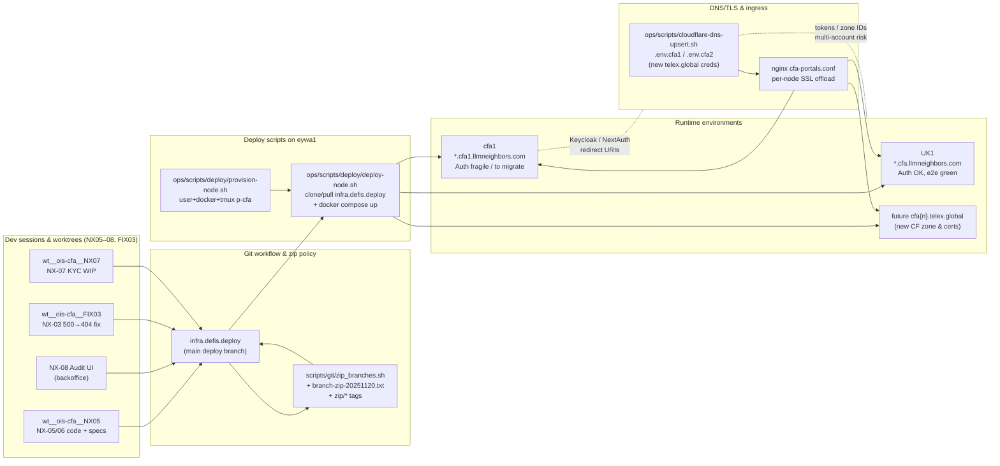

# Prompt
"./20251120-1457-prompt3.oracle.md"
# Output 
Начну с консолидированного аудита, потом — план действий и промпты.

---

## 1. Deep Findings Table

> NB: В колонке **Missed by**:
> *Gemini* = Gemini3 Evaluator из JSON,
> *GPT* = GPT5.1 CLI Max (oracle),
> *both* = оба не зафиксировали,
> *none* = всё покрыто/ожидаемо.

| Area                                                | Severity    | Finding                                                                                                                                                                                                                                                                                                                                                                                                                                                                                                                                                                                                                                                                                                                                                     | Missed by                                                                                                                                           | Actions                                                                                                                                                                                                                                                                                                                        |
| --------------------------------------------------- | ----------- | ----------------------------------------------------------------------------------------------------------------------------------------------------------------------------------------------------------------------------------------------------------------------------------------------------------------------------------------------------------------------------------------------------------------------------------------------------------------------------------------------------------------------------------------------------------------------------------------------------------------------------------------------------------------------------------------------------------------------------------------------------------- | --------------------------------------------------------------------------------------------------------------------------------------------------- | ------------------------------------------------------------------------------------------------------------------------------------------------------------------------------------------------------------------------------------------------------------------------------------------------------------------------------ |
| NX‑03 Issuance 500 → 404                            | **High**    | Баг NX‑03 (тест `Publish_NonExistent_Should_Return_404` давал 500 из‑за падения EF + exception‑флоу) был нормально закрыт: создана ветка `fix/NX-03-issuance-500`, поправлены `Program.cs` и `IssuanceService`, эндпоинты publish/close теперь возвращают `404`, если `PublishAsync/CloseAsync` вернули `null`. Фикс закоммичен и влит в `infra.defis.deploy`.【turn9file3†file_000000004ff0720a9f8272b054ef0b88†L242-L269】【turn9file16†file_000000004ff0720a9f8272b054ef0b88†L243-L268】                                                                                                                                                                                                                                                                     | **none** (оба предлагали ровно это решение)【turn9file15†file_00000000f124720aa95af673fe9c2822†L15-L31】                                              | ✅ Ничего не чинить: считать NX‑03 закрытым на уровне кода. Перед деплоем на новый сервер свериться, что `infra.defis.deploy` содержит `fix(nx-03)` и сигнатуры сервисных методов с `?` (nullable).                                                                                                                             |
| Issuance tests: двойной DB‑провайдер                | **Medium**  | Первопричина 500 в NX‑03 — не только логика publish, но и конфигурация EF Core: в тестах одновременно регистрировались Npgsql и InMemory, что давало `InvalidOperationException: Services for database providers 'Npgsql' и 'InMemory' have been registered`.【turn10file17†file_000000006598720aa22f616c7e0ba591†L1-L15】 Это уже исправлено через отдельную конфигурацию тестового хоста (UseInMemory), но это знание не поднято в документации.                                                                                                                                                                                                                                                                                                            | **both** (оба фокусировались на контроллере/сервисе, а не на тестовой DI‑конфигурации)                                                              | 📌 Добавить в `tasks/NX-03` или отдельный tech‑note краткий пост‑мортем: причина, стек, решение (разделение prod/test DB‑провайдеров). Это важно для будущих миграций тестов и новых сервисов.                                                                                                                                 |
| NX‑05/06 Issuer Dashboard & Payouts                 | **Medium**  | NX‑05/06 сделали нужный минимум: dashboard теперь реально дергает API через `getIssuerReports`, использует тип `IssuerReportRow` и подключён к агрегированным отчётам; NX‑06 добавляет `tasks/NX-06-payout-schedule-SPEC-DIFF.md` и read‑only UI секцию payout schedule на странице выпуска.【turn10file7†file_000000004ff0720a9f8272b054ef0b88†L9-L19】【turn9file0†file_000000004ff0720a9f8272b054ef0b88†L81-L87】 Но: 1) есть fallback `NEXT_PUBLIC_MOCK_ISSUER_ID` и «any‑cast» к `session.user`, 2) список выпусков пока с TODO‑заглушкой, 3) нет явного DoD, что эти фичи проходят e2e на cfa1.                                                                                                                                                           | **both**                                                                                                                                            | 🔧 Зафиксировать DoD для NX‑05/06 в тасках/репорте: *какой* issuerId используется (claim из Keycloak vs mock), на каком стенде (UK1/cfa1) отрабатывают e2e (Playwright), и что TODO‑листинг выпусков либо реализован, либо явно вынесен в NX‑09.                                                                               |
| NX‑07 Backoffice KYC (UI > API)                     | **High**    | NX‑07 реализует KYC‑UI (страницы `kyc` и `users`) и API‑клиент `apps/backoffice/src/lib/api/compliance.ts`, но сейчас клиент частично использует мок‑фолбэки и хитрую логику с React Query, а старые мутации (approve/reject/upload docs) были вырезаны из версии страницы.【turn10file16†file_000000004ff0720a9f8272b054ef0b88†L78-L133】 В итоге есть риск: UI выглядит «готовым», а реальный backend/интеграции KYC ещё нет.                                                                                                                                                                                                                                                                                                                               | **both** (оба говорили «NX‑07 WIP», но не зафиксировали риск «UI без настоящего backend»)【turn9file13†file_00000000f124720aa95af673fe9c2822†L1-L10】 | 🧩 В таске NX‑07 явно разделить DoD на UI и backend. Пока backend не готов — пометить KYC‑фичи как *demo only*, не включать их в прод‑демо без дополнительной проверки API. Для Playwright: завести отдельный набор тестов, который *отключён* по умолчанию, пока нет реального сервиса.                                       |
| NX‑08 Backoffice Audit UI                           | **Medium**  | NX‑08 добавляет API‑клиент `lib/api/audit.ts` и страницу `/audit` с фильтрами, но при ошибке запроса клиент возвращает мок‑данные (1–2 события), чтобы UI не падал.【turn10file4†file_000000004ff0720a9f8272b054ef0b88†L20-L41】【turn10file12†file_000000004ff0720a9f8272b054ef0b88†L37-L65】 Это удобно для dev, но в бою замаскирует проблемы с `/v1/audit`.                                                                                                                                                                                                                                                                                                                                                                                                 | **both**                                                                                                                                            | 🚨 Перед прод‑стендом: 1) сделать конфиг‑флаг `AUDIT_MOCK_MODE`, 2) в e2e по умолчанию требовать реальные данные (моки — только для локалки). В таске NX‑08 добавить явное требование отключать моки на prod‑like окружениях.                                                                                                  |
| Branch zip policy (scripts/git/zip_branches.sh)     | **Low/Med** | Ветка `infra.defis.deploy` содержит новую политику архивации веток: `artifacts/git/branch-zip-workflow.md` + `scripts/git/zip_branches.sh` читают список веток, проверяют, что каждая — ancestor `infra.defis.deploy`, создают тег `zip/<branch>`, пушат его и удаляют локальную/remote‑ветку.【turn9file17†file_000000004ff0720a9f8272b054ef0b88†L1-L8】 Архивированы NX‑01, NX‑03, NX‑05, NX‑06, NX‑08; NX‑07 **не** заархивирована, как и должно быть.【turn9file17†file_000000004ff0720a9f8272b054ef0b88†L17-L23】                                                                                                                                                                                                                                          | **none** (это как раз результат предыдущей работы)                                                                                                  | ✅ Политика адекватна. Добавить маленький safety‑step в workflow: перед запуском `zip_branches.sh` сохранять `git branch -a` и `git tag -l 'zip/*'` в артефакты; при аудите быстро сверять, что все нужные ветки имеют zip‑теги.                                                                                                |
| Deploy scripts (provision-node.sh / deploy-node.sh) | **Medium**  | `ops/scripts/deploy/provision-node.sh` стандартизирует ноду: создаёт пользователя `user`, добавляет в `docker`, ставит Node 20, настраивает tmux `p-cfa`. `deploy-node.sh` клонирует/обновляет `ois-cfa` и деплоит `infra.defis.deploy` через tmux. Всё это уже отработало на cfa1 и частично на fin2.【turn10file3†file_000000005ee4720ab1b271c3edd9b519†L29-L38】【turn10file13†file_000000005ee4720ab1b271c3edd9b519†L34-L43】 Проблема: права на дерево могут оказаться root’овыми, что ломает npm/pm2 (EACCES) — мы это уже поймали на cfa1.【turn8file1†file_000000005ee4720ab1b271c3edd9b519†L1-L20】                                                                                                                                                      | **both** (в oracle‑промптах это всплывает только как «подсказка», а не как явный риск)【turn8file15†file_000000005ee4720ab1b271c3edd9b519†L1-L9】     | 🛠️ В `deploy-node.sh` кроме hint’а добавить опцию `DEPLOY_FIX_PERMS=1`, при которой скрипт *явно* делает `chown -R $(id -un):$(id -gn) .` после первого клонирования. В DoD для новых нод — чекбокс «npm install без EACCES» после деплоя.                                                                                    |
| Cloudflare multi‑account & новый домен              | **High**    | Мульти‑аккаунт Cloudflare уже описан: `docs/deploy/MULTI_ACCOUNT_SETUP.md` + `ops/scripts/cloudflare-dns-upsert.sh`, с пер‑env `.env.cfa1` / `.env.cfa2` (zone, token, prefixes, base label).【turn8file4†file_000000005ee4720ab1b271c3edd9b519†L14-L23】【turn8file18†file_000000005ee4720ab1b271c3edd9b519†L1-L7】 Но всё это привязано к `llmneighbors.com`, тогда как теперь планируется `*.cfa{n}.telex.global`. Риск: перепутать токены/зону и обновить DNS не того аккаунта.                                                                                                                                                                                                                                                                             | **both** (ни Gemini, ни GPT не учитывали смену домена на telex.global — контекст был старый)                                                        | 🔑 Развести конфиги: `.env.uk1.llmneighbors`, `.env.cfa1.telex`, `.env.cfa2.telex`. Обновить MULTI_ACCOUNT_SETUP и все примеры вызова `cloudflare-dns-upsert.sh`, чтобы UK1 продолжал жить на llmneighbors, а новые ноды — на telex. Дефолтный `.env` не использовать для прод‑DNS.                                            |
| Auth UK1 vs cfa1 (Keycloak/NextAuth)                | **High**    | UK1 — эталон: Cloudflare + nginx + Keycloak proxy, корректные `.env.local`, ключи и redirect URIs, e2e (Playwright) зелёные.【turn8file2†file_000000006598720aa22f616c7e0ba591†L1-L12】【turn8file10†file_000000006598720aa22f616c7e0ba591†L1-L7】 На cfa1 всё сложнее: 1) DNS/TLS/nginx доведены до ума (api 200, issuer 502 на промежуточной стадии).【turn8file6†file_000000005ee4720ab1b271c3edd9b519†L1-L8】 2) `.env.local` порталов создавались под `*.cfa1.llmneighbors.com`.【turn8file1†file_000000005ee4720ab1b271c3edd9b519†L17-L25】 3) bootstrap Keycloak realm пытались переиспользовать, но скрипт не идемпотентен — конфликтующие клиенты мешают обновить redirect URIs. Итог: конфиг легко ломается при малейших ручных правках или смене домена. | **both**                                                                                                                                            | 🧱 Выделить отдельный сценарий «Realm rebootstrap / domain switch»: либо явный `reset` realm (export > drop > import), либо `kcadm`‑скрипты на update redirect/webOrigins. В DoD для нового домена — чекбоксы: `NEXTAUTH_URL == внешний issuer`, список redirect URIs в Keycloak, e2e auth‑тесты (issuer/investor/backoffice). |
| Playwright e2e (auth/KYC/uk1 vs cfa1)               | **Medium**  | Тесты уже есть и проходили для cfa1: `public-auth.spec.ts`, `self-registration.spec.ts`, `backoffice-auth.spec.ts`, `issuer-reports.spec.ts` — всё зелёное по отчётам.【turn5file16†file_000000006598720aa22f616c7e0ba591†L1-L7】 Но конфиг завязан на текущие домены `*.cfa.llmneighbors.com` и `*.cfa1.llmneighbors.com`. После перехода на `*.cfa{n}.telex.global` тесты начнут падать или проверять не то окружение.                                                                                                                                                                                                                                                                                                                                      | **both**                                                                                                                                            | ✅ Добавить отдельные `.env.e2e.uk1.llmneighbors` и `.env.e2e.cfa1.telex`. В DoD миграции домена — обязательно прогонять e2e на *новых* URL. Плюс завести новый набор сценариев для NX‑07 KYC (сейчас их нет).                                                                                                                  |

---

## 2. Mermaid View — Dev → Zip Policy → Deploy → Envs

Диаграмма показывает, как текут изменения от дев‑сессий к окружениям, и где сейчас узкие места (auth/DNS/secrets/CF creds).

> Основано на 10‑eywa1‑control‑plane‑runbook + MULTI_ACCOUNT_SETUP + zip‑workflow.【turn8file3†file_000000005ee4720ab1b271c3edd9b519†L1-L9】【turn8file18†file_000000005ee4720ab1b271c3edd9b519†L1-L7】【turn9file17†file_000000004ff0720a9f8272b054ef0b88†L17-L23】



**Узкие места:**

* **Auth:** Keycloak realm и NEXTAUTH_URL сильно завязаны на домен, bootstrap‑скрипты неидемпотентны → любое изменение домена/realm может сломать логин.
* **DNS/Cloudflare:** один локальный репо `cloudflare__developerisnow` и несколько `.env.*` — важно не перепутать зону (llmneighbors vs telex).【turn8file18†file_000000005ee4720ab1b271c3edd9b519†L1-L7】
* **Secrets:** токены Cloudflare в `/home/user/__Repositories/cloudflare__developerisnow/.env*` + `/root/.secrets/cloudflare.ini` на нодах — при миграции домена нужно ротация и чёткая документация, кто что использует.

---

## 3. DoD & Kickoff для следующего этапа (infra.defis.deploy + новый сервер + e2e)

Цель: быть готовыми деплоить `infra.defis.deploy` на новый сервер (условный `cfa3` или новый `cfa1.telex`) и прогонять KYC/Playwright e2e.

### 3.1. Код и слияния

**DoD / Code:**

* [ ] В `infra.defis.deploy` присутствуют коммиты:

  * `fix(nx-03): handle non-existent issuance gracefully (404 instead of 500)`【turn9file3†file_000000004ff0720a9f8272b054ef0b88†L242-L269】
  * `feat(nx-06): [co-c02b] - Payout Schedule Spec & UI`【turn9file0†file_000000004ff0720a9f8272b054ef0b88†L81-L87】
  * NX‑05 dashboard (подключение к API)【turn10file7†file_000000004ff0720a9f8272b054ef0b88†L9-L19】
  * NX‑08 audit UI + API client.【turn10file0†file_000000004ff0720a9f8272b054ef0b88†L81-L92】
* [ ] Ветка `feature/NX-07-backoffice-kyc` **не заархивирована** и/или явно отмечена как WIP (либо аккуратно влита после ревью).
* [ ] Все «моковые» fallback’и (audit, compliance) документированы и защищены флагами конфигурации (чётко указать, где их можно включать).

**Kickoff — Code Review:**

* [ ] Провести review `IssuanceService` и `Program.cs` на предмет:

  * согласованности возвращаемых типов (nullable vs non‑nullable)【turn10file18†file_000000006598720aa22f616c7e0ba591†L1-L13】
  * отсутствие повторной регистрации DB‑провайдеров в runtime.
* [ ] Review NX‑07: не «выстрелили» ли старые мутации (approve/reject) из UI окончательно — нужно либо вернуть их, либо явно считать вне scope текущего деплоя.

---

### 3.2. Конфиги и секреты

**DoD / Configs:**

* [ ] На eywa1:

  * Настроены отдельные файлы: `.env.uk1.llmneighbors`, `.env.cfa1.telex`, `.env.cfa2.telex` в `cloudflare__developerisnow`.【turn8file18†file_000000005ee4720ab1b271c3edd9b519†L1-L7】
  * Документировано, какой `.env.*` относится к какому серверу.
* [ ] На новом сервере:

  * Создан пользователь `user` + группа `docker`, `tmux` установлен, `provision-node.sh` успешно завершился.【turn10file3†file_000000005ee4720ab1b271c3edd9b519†L29-L38】
  * `deploy-node.sh` отработал на ветку `infra.defis.deploy`, дерево принадлежит `user:user` (без EACCES для npm/pm2).【turn8file15†file_000000005ee4720ab1b271c3edd9b519†L1-L9】
* [ ] `.env.local` для порталов (issuer, investor, backoffice) на новом домене:

  * `NEXT_PUBLIC_KEYCLOAK_URL=https://auth.cfaX.telex.global`
  * `NEXTAUTH_URL=https://issuer.cfaX.telex.global` / `https://backoffice.cfaX.telex.global`
  * корректный `NEXT_PUBLIC_API_BASE_URL=https://api.cfaX.telex.global`.

**Kickoff / Configs:**

* [ ] Обновить `docs/deploy/20251113-cloudflare-ingress.md` так, чтобы UK1 и новый cfaX были описаны как два отдельных домена (llmneighbors vs telex), а не одна «магическая» зона.【turn8file2†file_000000006598720aa22f616c7e0ba591†L1-L12】
* [ ] В `docs/deploy/MULTI_ACCOUNT_SETUP.md` добавить примеры именно для `telex.global` и нового Cloudflare‑аккаунта (email/token).【turn8file18†file_000000005ee4720ab1b271c3edd9b519†L1-L7】

---

### 3.3. Smoke/e2e

**DoD / Smoke:**

* [ ] `/health` всех .NET сервисов + gateway даёт 200 на новом сервере (через `https://api.cfaX.telex.global/health`).
* [ ] Авторизация:

  * issuer/investor/backoffice логинятся через Keycloak на новом домене без ошибок redirect/CORS.
  * Self‑registration + email‑верификация (если включена) работают.

**DoD / e2e (Playwright):**

* [ ] В `tests/e2e-playwright` есть:

  * `.env.e2e.uk1.llmneighbors`
  * `.env.e2e.cfa1.telex` (новое).
* [ ] Для нового домена проходят минимум:

  * `public-auth.spec.ts`
  * `self-registration.spec.ts`
  * `backoffice-auth.spec.ts`
  * `issuer-reports.spec.ts` (NX‑05/06).
* [ ] Добавлен/спланирован набор `kyc-flow.spec.ts` для NX‑07 (можно сначала пометить `skip`, пока нет backend’а).

---

### 3.4. Новые prompts/contexts — на вход агентам

Кратко, что должно быть готово (подробнее в секции Prompt Strategy):

* [ ] **`oracle/infra-deploy-cfaX`** — prompt для агента, который из `infra.defis.deploy` деплоит на новый сервер через `provision-node.sh` + `deploy-node.sh`.
* [ ] **`oracle/auth-check-cfaX-vs-uk1`** — сравнение Keycloak/NextAuth конфигов UK1 и cfaX, вывод несоответствий.
* [ ] **`oracle/playwright-kyc-e2e`** — запуск e2e для нового домена (с выбором набора тестов).
* [ ] **`oracle/branch-zip-audit`** — проверка, что все нужные ветки заархивированы (NX‑01/03/05/06/08) и NX‑07 живёт в правильном состоянии.

---

## 4. Auth & Domain Plan: cfa1 → *.cfa{n}.telex.global

### 4.1. Что ломает авторизацию на cfa1 (по сравнению с UK1)

На основании runbook’ов и логов:

1. **UK1: эталонная конфигурация**

   * Cloudflare: `*.cfa.llmneighbors.com` с A‑записями на UK1.【turn8file2†file_000000006598720aa22f616c7e0ba591†L1-L12】
   * Nginx + ключи Let’s Encrypt, Keycloak proxy с `KEYCLOAK_PUBLIC_URL=https://auth.cfa.llmneighbors.com`.
   * `.env.local` порталов и Keycloak clients отлажены, e2e проходят.【turn8file10†file_000000006598720aa22f616c7e0ba591†L1-L7】

2. **cfa1: цепочка проблем**

   * DNS/TLS/nginx доведены до рабочего состояния (api 200, issuer 502 на промежуточных шагах).【turn8file6†file_000000005ee4720ab1b271c3edd9b519†L1-L8】
   * `.env.local` для порталов создавались вручную из eywa1, сначала с root‑правами → npm EACCES, потом исправлено через `chown` и hints в `deploy-node.sh`.【turn8file1†file_000000005ee4720ab1b271c3edd9b519†L1-L20】【turn8file15†file_000000005ee4720ab1b271c3edd9b519†L1-L9】
   * Keycloak realm `ois-dev` из UK1 пытались переиспользовать, re‑bootstrap через `ops/keycloak/bootstrap-realm.sh` неидемпотентен: клиенты уже существуют, redirect URIs не обновляются, часть настроек остаётся от UK1. Отсюда типичные ошибки `Invalid redirect_uri` и ломание auth.

**Скорее всего, текущее “cfa1 ломает auth” = комбинация:**

* устаревшие redirect URIs и webOrigins в Keycloak (указывают на `.llmneighbors.com`, но уже есть попытки работать через другой домен/URL),
* потенциально несогласованный `NEXTAUTH_URL` и `KEYCLOAK_ISSUER` во фронтах vs фактический публичный URL Keycloak.

---

### 4.2. План починки cfa1 до миграции (на старом домене)

Перед прыжком на `telex.global` полезно привести cfa1 в порядок на текущем домене, чтобы мигрировать из стабильного состояния.

1. **Зафиксировать текущее состояние:**

   * Экспортировать realm `ois-dev` на cfa1 (через Keycloak admin UI или `kcadm`).
   * Сохранить список клиентов и их redirect URIs.

2. **Почистить bootstrap‑скрипты:**

   * В `ops/keycloak/bootstrap-realm.sh` выделить режимы:

     * `create` — создаёт realm и клиентов (как сейчас),
     * `update` — только обновляет URIs/webOrigins и client secrets, не пытаясь пересоздать клиентов.
   * Хранить домен (base URL) в окружении (`REALM_BASE_DOMAIN=cfa1.llmneighbors.com`), а не прошивать в скрипт.

3. **Синхронизировать env фронтов и Keycloak:**

   * Проверить `.env.local` для:

     * `apps/portal-issuer`,
     * `apps/portal-investor`,
     * `apps/backoffice`.
       Значения должны совпасть с тем, что Keycloak считает публичным URL:
     * `NEXT_PUBLIC_KEYCLOAK_URL=https://auth.cfa1.llmneighbors.com`,
     * `NEXTAUTH_URL=https://issuer.cfa1.llmneighbors.com` и т.п.【turn8file1†file_000000005ee4720ab1b271c3edd9b519†L17-L25】
   * В Keycloak обновить redirect URIs и webOrigins для этих клиентов под те же URL.

4. **Перепроверить e2e на cfa1 (старый домен):**

   * В `tests/e2e-playwright` настроить `.env.cfa1.llmneighbors`.
   * Прогнать auth + issuer‑reports тесты; добиться полной зелёной матрицы.

Так мы получим стабильный baseline cfa1 на `llmneighbors.com`, от которого удобно мигрировать.

---

### 4.3. Миграция на `*.cfa{n}.telex.global`

**Шаг 1. Cloudflare и DNS**

* Создать/подтвердить зону `telex.global` в новом аккаунте (тот, что соответствует новым email/token).
* На eywa1:

  * Создать `.../.env.cfa1.telex` с полями:
    `CF_ZONE_NAME=telex.global`
    `CF_ZONE_ID=<zone-id>`
    `CF_API_TOKEN=<новый token>`
    `CF_HOST_PREFIXES=auth,issuer,investor,backoffice,api`
    `CF_BASE_LABEL=cfa1`.
* Выполнить:

  ````bash
  ./ops/scripts/cloudflare-dns-upsert.sh \
    /home/user/__Repositories/cloudflare__developerisnow/.env.cfa1.telex \
    <IP_cfa1>
  ```【turn8file4†file_000000005ee4720ab1b271c3edd9b519†L14-L23】

  ````
* Проверить, что `auth|issuer|investor|backoffice|api.cfa1.telex.global` смотрят на IP cfa1.

**Шаг 2. TLS и nginx**

* На cfa1:

  * Выдать новый LE‑сертификат для `*.cfa1.telex.global` (через dns‑cloudflare плагин, используя новый token).
  * Скопировать/адаптировать `cfa1-portals.conf`, заменив:

    * домен `cfa1.llmneighbors.com` → `cfa1.telex.global`,
    * пути к сертификатам на новые.
* Включить новый конфиг, перезапустить nginx и проверить `https://api.cfa1.telex.global/health`.

**Шаг 3. Keycloak**

* В docker‑override / env Keycloak поменять:

  ```env
  KEYCLOAK_PUBLIC_URL=https://auth.cfa1.telex.global
  # или KC_HOSTNAME / KC_HOSTNAME_URL, если используется новая схема
  ```

* В bootstrap‑скрипте (режим `update`) обновить realm `ois-dev`:

  * `rootUrl` = `https://auth.cfa1.telex.global` (если используется),
  * для клиентов `portal-issuer`, `portal-investor`, `backoffice` — redirect URIs и webOrigins на новый домен.

**Шаг 4. Фронты и NextAuth**

* На cfa1 в `/opt/ois-cfa`:

  * `.env.local` порталов перевести на `telex.global`:

    * `NEXT_PUBLIC_KEYCLOAK_URL=https://auth.cfa1.telex.global`,
    * `NEXTAUTH_URL=https://issuer.cfa1.telex.global` / `https://backoffice.cfa1.telex.global`,
    * `NEXT_PUBLIC_API_BASE_URL=https://api.cfa1.telex.global`.
* Перезапустить pm2‑процессы.

**Шаг 5. Playwright и KYC**

* В `tests/e2e-playwright` добавить `.env.cfa1.telex`, обновить базовые URL на `*.telex.global`.
* Прогнать весь auth‑набор + issuer‑reports против нового домена.
* Для NX‑07: подготовить хотя бы smoke‑сценарий (UI грузится, список заявок отдается хотя бы из мок‑сервиса).

**Шаг 6. Чистка старых секретов**

* На eywa1:

  * Отвязать старый `CLOUDFLARE_API_TOKEN` от новых окружений (оставить его только в `.env.uk1.llmneighbors`).
  * Для понятности — заменить дефолтный `.env` на «заглушку» и обязать использовать только именованные `.env.*`.
* На cfa1:

  * `/root/.secrets/cloudflare.ini` — обновить под `telex.global` и новый token.
  * Старый token либо отозвать в Cloudflare, либо использовать только для UK1.

---

## 5. Prompt Strategy — будущие prompts/context пакеты

Идея: каждый prompt — маленький «микро‑runbook» для агента. Ниже — список того, что имеет смысл подготовить.

1. **`oracle/infra-deploy-cfaX.telex`**
   **Цель:** автоматизировать деплой `infra.defis.deploy` на новый сервер (cfaX).
   **Контекст:**

   * `ops/scripts/deploy/provision-node.sh`, `deploy-node.sh`【turn10file3†file_000000005ee4720ab1b271c3edd9b519†L29-L38】【turn10file13†file_000000005ee4720ab1b271c3edd9b519†L34-L43】
   * `10-eywa1-control-plane-runbook.md` с DoD для нод【turn8file3†file_000000005ee4720ab1b271c3edd9b519†L1-L9】
     **Задача агента:** прогнать provisioning + deploy, проверить docker/pm2, зафиксировать статус.

2. **`oracle/auth-check-uk1-vs-cfaX`**
   **Цель:** сравнить конфиги UK1 и нового cfaX, подсветить расхождения в Auth.
   **Контекст:**

   * `docs/deploy/20251113-cloudflare-ingress.md`【turn8file2†file_000000006598720aa22f616c7e0ba591†L1-L12】
   * `10-eywa1-control-plane-runbook.md` (секции про NX‑05/06 readiness и cfa1 status)【turn8file16†file_000000005ee4720ab1b271c3edd9b519†L266-L274】
     **Задача агента:** выписать таблицу: realm, clients, redirect URIs, NEXTAUTH_URL, base URLs — где они совпадают/отличаются.

3. **`oracle/cloudflare-telex-setup`**
   **Цель:** подготовить/обновить `.env.cfa1.telex` и `.env.cfa2.telex`, прогнать `cloudflare-dns-upsert.sh`, проверить DNS.
   **Контекст:** `docs/deploy/MULTI_ACCOUNT_SETUP.md`, `ops/scripts/cloudflare-dns-upsert.sh`.【turn8file4†file_000000005ee4720ab1b271c3edd9b519†L14-L23】【turn8file18†file_000000005ee4720ab1b271c3edd9b519†L1-L7】

4. **`oracle/keycloak-domain-migration-cfa1`**
   **Цель:** безопасно перевести realm/клиентов cfa1 на новый домен.
   **Контекст:** `ops/keycloak/bootstrap-realm.sh`, доки по UK1 ingress, runbook 10‑eywa1.
   **Задача агента:** сгенерировать kcadm‑скрипты для update redirect/webOrigins, без drop realm.

5. **`oracle/playwright-e2e-cfaX`**
   **Цель:** запуск и анализ Playwright‑тестов для нового домена (auth + reports + базовый KYC).
   **Контекст:** `tests/e2e-playwright` + существующие отчёты【turn5file16†file_000000006598720aa22f616c7e0ba591†L1-L7】.
   **Задача агента:**

   * выбрать нужный `.env.*`,
   * прогнать тесты,
   * собрать HTML‑отчёт и summary по сценариям.

6. **`oracle/kyc-flow-design-NX07`**
   **Цель:** довести NX‑07 до согласованного состояния: UI ↔ API ↔ тесты.
   **Контекст:**

   * `tasks/NX-07-backoffice-kyc-and-user-registry.md`,
   * `apps/backoffice/app/kyc/page.tsx`, `lib/api/compliance.ts`.【turn9file0†file_000000004ff0720a9f8272b054ef0b88†L4-L11】【turn10file16†file_000000004ff0720a9f8272b054ef0b88†L78-L133】
     **Задача агента:** описать минимальный backend API, убрать избыточные моки, наметить e2e‑сценарии.

7. **`oracle/branch-zip-audit`**
   **Цель:** периодически проверять, что zip‑политика соблюдается и ветки не теряются.
   **Контекст:** `artifacts/git/branch-zip-workflow.md`, `scripts/git/zip_branches.sh`, `branch-zip-20251120.txt`.【turn9file17†file_000000004ff0720a9f8272b054ef0b88†L17-L23】
   **Задача агента:** вытащить список `zip/*` тегов, сопоставить с текущими ветками и зафиксировать отчёт.

8. **`oracle/NX05-08-regression-check`**
   **Цель:** быстрый регресс NX‑05/06/08 на новом окружении.
   **Контекст:**

   * `tasks/NX-05-issuer-dashboard-and-reports.md`【turn9file4†file_000000004ff0720a9f8272b054ef0b88†L1-L10】
   * `tasks/NX-06-payout-schedule-SPEC-DIFF.md`
   * `tasks/NX-08-backoffice-audit-log-ui.md`.
     **Задача агента:** пройтись по чеклисту DoD этих задач и проверить, что всё реально работает на cfaX.

---

## 6. Open Questions & Risks

Что стоит обсудить с инженерами/владельцами окружений:

1. **Домены: стратегия UK1 vs telex.global**

   * UK1 останется на `*.cfa.llmneighbors.com` как «demo only», а новые окружения уйдут на `*.cfa{n}.telex.global`?
   * Нужны ли алиасы (CNAME) между доменами или это полностью отдельные истории?
     Риск: смешение конфигов и неожиданные редиректы.

2. **Keycloak realm: один на все домены или отдельные?**

   * Сейчас `ois-dev` используется и на UK1, и на cfa1. Будет ли на telex отдельный realm (например, `ois-dev-telex`), или мы пытаемся жить с одним realm’ом и несколькими hostnames?
     Риск: сложные redirect URIs, непредсказуемое поведение при смене домена.

3. **KYC backend (NX‑07)**

   * Есть ли уже целевой KYC‑/compliance‑сервис, или текущий UI — чисто демо?
   * Какой SLA для KYC‑флоу на новых окружениях: обязательно ли иметь рабочий backend до первой прод‑проверки?
     Риск: фальшивое ощущение готовности из‑за UI + моков.

4. **Playwright coverage**

   * Есть ли план расширения сценариев под NX‑07/08 (audit, KYC), или пока достаточно auth + reports?
   * Нужна ли nightly‑прогонка e2e по всем окружениям (UK1, cfa1, fin2/cfa2)?
     Риск: незамеченные регрессы при смене домена/realm.

5. **Cloudflare токены и доступы**

   * Кто владеет новым Cloudflare аккаунтом под `telex.global`, как организована ротация токенов?
   * Нужно ли разделять токены по окружениям (отдельно для prod‑подобных и demo)?
     Риск: утечка/неправильное использование одного master‑token’а для всех зон.

6. **Дисковое пространство и старый стек на fin2**

   * Логи показывают старый docker‑стек на fin2 и проблемы с `/var/lib/apt/lists/lock`.【turn10file10†file_000000005ee4720ab1b271c3edd9b519†L1-L9】
   * Нужна финальная чистка/стабилизация перед тем, как использовать fin2 как полноценную cfa2.n.telex.global ноду.
     Риск: половина шага вперёд, два шага назад из‑за инфраструктурных мелочей.

7. **Статус NX‑07 ветки**

   * Будет ли `feature/NX-07-backoffice-kyc` влита в `infra.defis.deploy` как есть (UI+моки), или планируется ещё одна итерация с backend’ом и тестами до merge?【turn9file1†file_00000000f124720aa95af673fe9c2822†L1-L6】
     Риск: попадание в main deploy ветку полу‑готовой бизнес‑критичной фичи.

---

Если хочешь, следующий шаг я могу сформировать тебе прям готовые текстовые промпты для агентов (на основе стратегий выше) в формате «копипаст в Codex/CLI», чтобы Night‑Shift v3 реально довёл всё до prod‑check.
