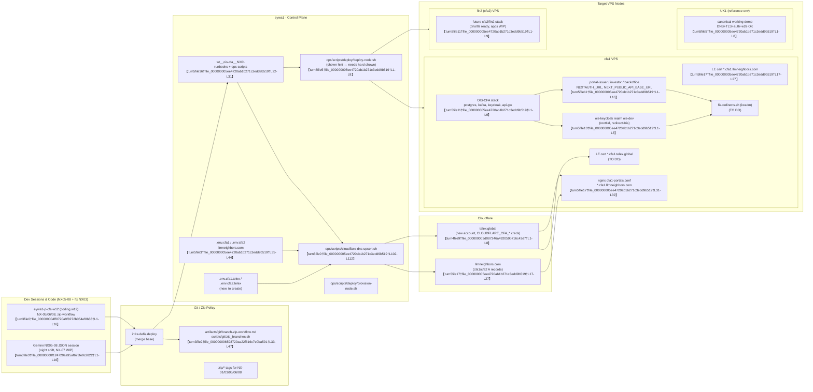
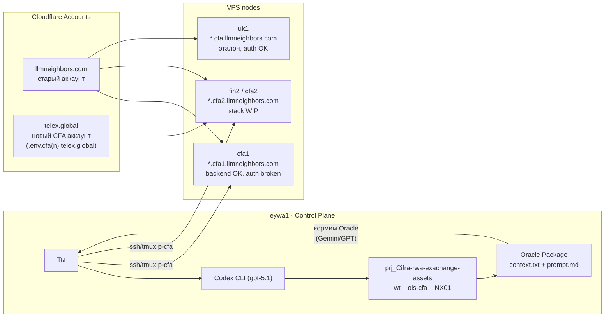
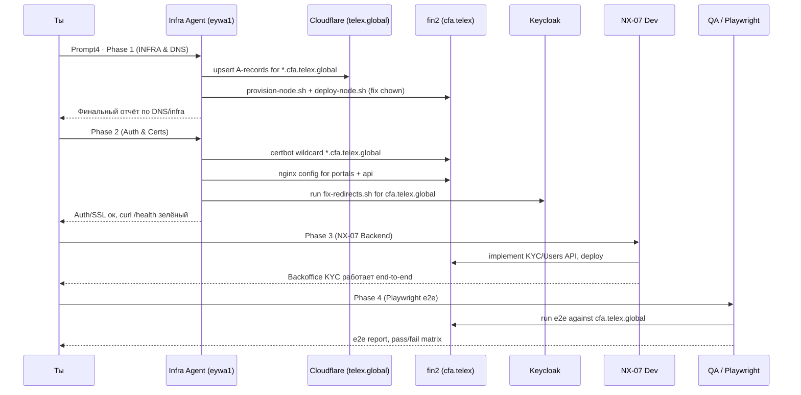

# Main

| GPT5p | bet |
| ----- | --- |
| 1     |     |
| 2     |     |
| 3     |     |
# 1.1.
Сразу по сути: в твоём контексте (ты + пачка ИИ‑агентов) **главный стандарт — “Task Spec с DoD + Kick‑Off + Частые грабли”**.
User Stories и формальный Scrum‑зоопарк — опциональны, не базовые.

---

## 1. Какую минимальную систему я бы зафиксировал

### 1️⃣ Уровни

Я бы оставил три уровня:

1. **Epic / NX‑task** – NX‑05, NX‑06, NX‑07 и т.д.
2. **Task Spec (одна Markdown‑страница)** – то, как у тебя уже выглядят NX‑05/NX‑06: frontmatter, TL;DR, Scope, Plan, DoD. 
3. **Execution / Sessions** – отдельные файлы в `memory-bank` под конкретные прогонки агентов, где уже лог и мелкие подзадачи.

То есть *никаких дополнительных сущностей* (Story, Subtask, Feature‑ticket) — они по сути уже “спрятаны” внутри одного Task Spec.

---

## 2. DoD vs User Story / Acceptance Criteria

**По факту: Acceptance Criteria = детальный DoD.**

Для тебя и агентов достаточно:

* **Global DoD** для проекта/репы – что в принципе считается “done” (тесты зеленые, спеки не протухли, UK1 жив, etc).
* **Per‑task DoD** – чек‑лист именно для этой NX‑таски.

User Story с формулой “As a … I want … so that …” реально нужна только когда:

* Надо *договориться про UX/поведение* с бизнесом/другими людьми.
* Нужно описать пользовательские сценарии, а не тех‑инфраструктуру.

В твоих задачах типа:

* “Развернуть CFA на новом VPS как Control Plane” 
* “Довести issuer dashboard/reports до живых данных” 

— **формальные User Stories дают мало пользы**. Всё, что нужно, прекрасно ложится в:

* TL;DR
* Scope (что входит / не входит)
* DoD + Tests
* “Known pitfalls / regression checklist”

---

## 3. Kick‑Off: это твой Definition of Ready

То, что ты называешь Kick‑Off Task, — по сути **Definition of Ready для агента**:

* “Что должно быть уже готово и проверено, прежде чем он начнёт ковырять код/сервер”.

Для тебя и агентов Kick‑Off критически важен, потому что:

* ты часто заходишь в задачу “с разогнанной головой”;
* агенту нужно *жёсткое* перечисление: `ветка`, `worktree`, `env`, `куда писать артефакты`.

### Kick‑Off я бы всегда делал отдельной секцией в Task Spec

Например:

```md
## Kick‑Off / Definition of Ready

Перед стартом агент обязан:

- [ ] Ветка: `tasks/NX-05-issuer-dashboard-and-reports` локально существует, worktree `wt__ois-cfa__NX05` — в состоянии `git status: clean`.
- [ ] Symlink `memory-bank` в ворктри не сломан.
- [ ] Проверен доступ к uk1/cfa1/eywa1 (ssh, ключи).
- [ ] Прочитан `PROJECT-CONTEXT.md`, `FRONTEND-CONTEXT.md`, соответствующий NX‑task.
- [ ] Понять, **на каком стенде** будут проверки (uk1 vs cfa1/fin2) и зафиксировать это в начале сессии.
```

Агент всегда начинает с этого чек‑листа → меньше сюрпризов.

---

## 4. Что обязательно должно быть в хорошем Task Spec (для тебя и агентов)

Берём то, как у тебя уже сделаны:

* `10-eywa1-control-plane-runbook.md` (Phases, DoD, Kickoff prompt), 
* обновлённый NX‑05 Task Spec с frontmatter, TL;DR, DoD, таблицами. 

и фиксируем **единую структуру**:

```md
---
created: 2025-11-XX
updated: 2025-11-XX
type: task-spec
topic: NX-0X-...
author: alex-a
tags: [nx-0x, backend, infra, ...]
---

# NX‑0X — Короткое человеко‑понятное название

## 1. TL;DR / Goal

- 2–4 буллета: что должно появиться/работать после завершения.

## 2. Context & Links

- 3–8 ссылок: PROJECT‑CONTEXT, FRONTEND‑CONTEXT, C4, reposcan, предыдущие NX‑reports.
- 1–2 строки: в чём связь с другими NX (например, NX‑05 опирается на NX‑01..04).

## 3. Scope

### 3.1 In Scope
- Конкретные блоки (backend X, frontend Y, тесты Z).

### 3.2 Out of Scope
- Что НЕ трогаем (uk1 config, Keycloak realm, старые домены и т.п.).

## 4. Plan / How

- 4–8 пронумерованных шагов верхнего уровня (как в твоих Phases).

## 5. Kick‑Off / Definition of Ready

- Чек‑лист по веткам, ворктри, env, доступам, подготовленным файлам.

## 6. DoD / Acceptance Criteria

Разбить на подподразделы:

### 6.1 Outputs / Artefacts
- [ ] Какие файлы/скрипты/страницы должны появиться/обновиться.
- [ ] Где лежат новые артефакты (docs/artifacts/…, memory‑bank/...).

### 6.2 Behaviour / Tests
- [ ] Какие команды/тесты должны проходить (unit/integration/e2e).
- [ ] Какие URL/flows руками проверить.

### 6.3 Hygiene / Regression & Pitfalls
- [ ] Не поменялись несовместимо спецификации (инвентаризация SPEC DIFF).
- [ ] Не остались старые realms/env/доменные имена.
- [ ] Не сломаны предыдущие стенды (например, UK1 остаётся как был).

## 7. Known pitfalls / Frequent mistakes

Список “пупырышек”, основанный на прошлых фейлах:

- “Агент забыл убрать старый cfa1 realm → нужно явно проверять X.”
- “В инструкциях забывали описать ручной Kick‑Off → теперь отдельный чек‑лист.”

## 8. Notes / Open questions

Что пока не до конца ясно и надо уточнять у себя/Александра.
```

Важно: **DoD у тебя = Acceptance Criteria.** Можно вообще не разводить два термина.

---

## 5. Когда всё-таки использовать User Stories

Я бы оставил User Stories **только для UX/бизнес фич**:

* новые сценарии инвестора / эмитента;
* изменения UI, где важно сформулировать пользу.

Тогда:

* Вверху Task Spec (в TL;DR или отдельным блоком) 1–3 User Story,
* А ниже — технический Plan/DoD, как сейчас.

Например:

```md
### User Stories (optional)

- As an issuer, I want to see total active issuance volume on dashboard so that I can quickly assess my exposure.
- As an issuer, I want a payouts report by issuance so that I can reconcile with bank statements.
```

И всё. Больше никакой Jira‑машины вокруг.

---

## 6. Отвечаю на твой главный вопрос

> Definition of Done и Kick-Off Task это активно покрывает, или User Stories, Acceptance Criteria — или вот как лучше поступать?

**Для тебя и агентов:**

* **Обязательное ядро:**

  * Task Spec (как NX‑05 сейчас)
  * **Kick‑Off секция** (Definition of Ready)
  * **DoD секция** (включает и Acceptance Criteria, и регрессионный чек‑лист)
  * “Known pitfalls” как отдельный блок.

* **Опциональное, только где реально надо:**

  * User Stories — для продуктовых/UX‑штук, не для инфраструктуры/деплоя.
  * Дополнительная иерархия (epic/story/subtask) — только если это нужно для коммуникации с людьми, а не для агентов.

Если очень коротко:
**ты уже сделал почти идеальный формат Task Spec + DoD/Kick‑Off (см. обновлённый NX‑05 и eywa1 runbook)** — я бы зафиксировал его как *единственный стандарт* и перестал усложнять иерархию. Вместо добавления новых слоёв — *просто* дисциплинированно дописывать в DoD блок “Regression & Known pitfalls” после каждого реального фейла.

---

Если хочешь, следующим шагом могу:

* упаковать это в **один готовый Markdown‑шаблон** для `tasks/` (под твой frontmatter и стиль Александра);
* отдельно — мини‑шпаргалку “как читать этот Task Spec” для агентов, чтобы они явно тикали DoD в конце ответа.

# 1 Gpt5pro based on prompt  1
Я уже всё переварил: 5 Gemini‑потоков, твой анализ, w11/w12 и oracle‑pack. Вкратце: картинка у всех одна и та же, просто разной гранулярности. Ниже — мой финальный синтез: что реально делать, что выбросить из фокуса и как это оформить в одну таблицу.

---

## 1. Финальный вердикт: что важно, что можно выкинуть из головы

### 1.1. Три **реально критичных** зоны

Все отчёты (твои, Gemini и GPT‑5) сходятся на трёх «красных лампочках» — я это принимаю как ground truth: 

1. **NX‑07 = «потёмкинский» KYC**

   * UI и React Query‑клиент в backoffice есть, но бэкенда под них нет: фронт шлёт запросы через `apiClient.getKycApplications / getKycDocuments / makeKycDecision / uploadKycDocuments`, а соответствующих контроллеров/эндпоинтов в .NET нет. 
   * Если сейчас выкатываться — KYC будет либо падать, либо работать на моках.
   * **Вывод:** без минимального backend slice NX‑07 в прод пускать нельзя.

2. **Auth/Keycloak на cfa1 сломан по конфигу**

   * Корень: Keycloak живёт в старой реальности (UK1/`llmneighbors.com`), а окружение — уже в другой: env’ы и Nginx говорят одно, Redirect URIs и `rootUrl` в Keycloak DB — другое. 
   * Gemini 1502 очень чётко поймал именно это и предложил правильный паттерн: не крутить руками админку, а сделать скрипт на `kcadm.sh`, который «прижигает» URIs под нужный домен. 

3. **Deploy‑скрипты и права**

   * В ходе аудита нашлась классика: `deploy-node.sh` иногда формирует рабочий каталог с правами `root`, после чего `npm install` ломается с `EACCES` и приходится всё чинить руками. 
   * Рецепт уже есть: жёсткий `chown -R user:user $REMOTE_PROJECT_ROOT` (а не «hint» в комментариях). 

> Всё остальное (zip/*, worktree‑гигиена, mermaid‑диаграммы в ТЗ и т.п.) — **вторично для текущей цели**. Да, это важно для долговременного здоровья репо, но не блокирует запуск стенда.

---

# 3.1 Gpt5pro based on prompt 3.1
Начну с главного: на уровне архитектуры твоя интуиция верная — **доводим cfa1 до “как UK1” на старом домене, потом аккуратно перекидываем его на новый Cloudflare‑аккаунт / `*.cfa1.telex.global`**, уже с понятным Auth‑состоянием. Всё остальное — вокруг этого.

Ниже — обещанные секции.

---

## 1. Deep Findings Table

(я специально уплотнил всё в одну таблицу, чтобы это можно было вставить в manual как итоговый аудит v4)

| Area                                                                 | Severity       | Finding                                                                                                                                                                                                                                                                                                                                                                                                    | Missed by                                                                                                                         | Actions                                                                                                                                                                                                                                                                                                                                                 |   |                                                                                                                                                                           |                                                                                                      |                                                                                                                                                                                                                                                                   |
| -------------------------------------------------------------------- | -------------- | ---------------------------------------------------------------------------------------------------------------------------------------------------------------------------------------------------------------------------------------------------------------------------------------------------------------------------------------------------------------------------------------------------------- | --------------------------------------------------------------------------------------------------------------------------------- | ------------------------------------------------------------------------------------------------------------------------------------------------------------------------------------------------------------------------------------------------------------------------------------------------------------------------------------------------------- | - | ------------------------------------------------------------------------------------------------------------------------------------------------------------------------- | ---------------------------------------------------------------------------------------------------- | ----------------------------------------------------------------------------------------------------------------------------------------------------------------------------------------------------------------------------------------------------------------- |
| **NX‑07 Backoffice KYC: backend отсутствует, UI на моках**           | **Critical**   | В `apps/backoffice/src/lib/api/compliance.ts` и `api/audit.ts` клиент ходит на `/v1/compliance/kyc`, `/v1/identity/users`, `/v1/audit`, но при ошибке возвращает мок‑данные; реальных эндпоинтов ещё нет. Это значит: на демо UI всё красиво, но в бою KYC и audit не работают.                                                                                                                            | **GPT‑5 (все)** — явным “backend missing” криком выступил только Gemini 1501.                                                     | *Keep (Must‑do)*. Ввести отдельную mini‑epic: реализовать `ComplianceController` и `IdentityController` в `services/compliance` / `services/identity` под KYC/Users, и `/v1/audit` в соответствующем сервисе. Пока backend не готов — в Backoffice явно помечать раздел как “Coming soon”, а не молча падать в 500/моки.                                |   |                                                                                                                                                                           |                                                                                                      |                                                                                                                                                                                                                                                                   |
| **NX‑05 Issuer Dashboard: зависимость от issuerId в токене**         | High           | В дашборде берётся `issuerId` из `session.user.issuerId                                                                                                                                                                                                                                                                                                                                                    |                                                                                                                                   | session.user.id                                                                                                                                                                                                                                                                                                                                         |   | FALLBACK_ISSUER_ID`.:contentReference[oaicite:2]{index=2} Если Keycloak не выдаёт `issuerId` custom‑claim, то отчёт строится либо по неверному issuer’у, либо по фолбэку. | **GPT‑5 (все)** — в основном смотрели на UI, а не на связку “token → issuerId → /reports/issuances”. | *Keep*. В Keycloak: добавить маппер, чтобы в access_token всегда был `issuerId`. В NextAuth: в session callback класть его в `session.user.issuerId`, убрать фолбэк на `user.id` в прод‑конфиге. Для демо оставлять только `FALLBACK_ISSUER_ID` под feature‑флаг. |
| **NX‑06 Payout Schedule: scheduleJson как “чёрный ящик”**            | Medium         | В `IssuanceService.PublishAsync` в `scheduleJson` без валидации передаётся на леджер. Спекой предусмотрены сложные расписания, но нет серверной проверки структуры/ограничений.                                                                                                                                                                                                                            | **оба** — все упоминали UX/документацию, но никто не зафиксировал риск “сломанного” scheduleJson, который может улететь в леджер. | *Keep (Later)*. Добавить валидатор (FluentValidation + JSON‑schema / DTO) для `scheduleJson` на backend и e2e‑тест с невалидным расписанием → 400. Это можно оставить на пост‑миграционный этап.                                                                                                                                                        |   |                                                                                                                                                                           |                                                                                                      |                                                                                                                                                                                                                                                                   |
| **NX‑03 Issuance 500 → 404: поведение в API и тестах**               | High           | Фикс сделан: `PublishAsync` возвращает `null` при отсутствии выпуска, а в `Program.cs` эндпоинт теперь возвращает 404 при `null` вместо 500. Но тесты до этого были настроены так, что могла быть двойная конфигурация DB‑провайдера (InMemory vs Npgsql) и флапающие тесты в CI. Эту проблему поднял GPT‑5 (1557).                                                                                        | **Gemini (все)** — фокусировались на UX/flows, а не на тонкостях тестовой конфигурации.                                           | *Keep (Must‑do, но почти done)*. Убедиться, что: 1) `fix/NX-03-issuance-500` слит в `infra.defis.deploy`; 2) тестовый проект использует один источник правды для DB (либо чистый InMemory, либо тестовую PostgreSQL), и этот же шаблон потом применён к другим сервисам. Плюс — гарантировать прогон `dotnet test` в CI на этой ветке.                  |   |                                                                                                                                                                           |                                                                                                      |                                                                                                                                                                                                                                                                   |
| **AsyncAPI producers (payout/transfer) не реализованы**              | Medium         | В risk‑register уже зафиксирован риск “Missing Producers” для `ois.payout.scheduled` и связанных событий. В коде сервисов виден outbox, но публикация некоторых событий ещё TODO.                                                                                                                                                                                                                          | **оба** — ни Gemini, ни GPT не подняли это как блокер для деплоя, хотя в DoD NX‑01/04 это фигурирует.                             | *Keep (Later)*. В рамках пост‑миграционного hardening: реализовать публикацию событий в нужных местах (`IssuanceService`, settlement flow), добавить минимум один integration‑test на outbox → broker.                                                                                                                                                  |   |                                                                                                                                                                           |                                                                                                      |                                                                                                                                                                                                                                                                   |
| **Deploy‑скрипты: права и owner’ы (`npm EACCES`)**                   | High           | На cfa1 фронты ставились и запускались под `root`, `npm install` в /opt/ois-cfa приводил к `EACCES`, часть порталов стартовала под pm2 с неконсистентными правами. `deploy-node.sh` даёт только hint, но не chown’ит директорию явно.                                                                                                                                                                      | **Gemini (частично)** — видели симптомы, но не сформулировали как “обязательный chown в скрипте”. GPT‑5 (1553) это поймал.        | *Keep (Must‑do)*. В `ops/scripts/deploy/deploy-node.sh` добавить явный шаг (однократный либо опциональный флаг) `sudo chown -R ${REMOTE_USER}:${REMOTE_USER} ${REMOTE_PROJECT_ROOT}` перед `npm install`/`pm2`. Описать это в runbook как обязательный шаг при первом деплое узла.                                                                      |   |                                                                                                                                                                           |                                                                                                      |                                                                                                                                                                                                                                                                   |
| **Auth: UK1 эталон, cfa1 ломается на Keycloak + env**                | **Critical**   | UK1: чёткий Cloudflare + nginx + Keycloak proxy (`KEYCLOAK_PUBLIC_URL=https://auth.cfa.llmneighbors.com`), `.env.local` и clients вылизаны, e2e зелёные. На cfa1: 1) Keycloak bootstrap даёт `clients//client-secret` + `kcadm.sh: No such file`; 2) `.env.local` частично создавались как root, часть порталов с EACCES; 3) realm унаследован от UK1 с чужими redirect URIs. Итог — “auth не как на UK1”. | **GPT‑5 (все)** — глубокий root‑cause по auth дал именно Gemini 1502.                                                             | *Keep (Must‑do)*. 1) На старом домене довести `ois-dev` до паритета с UK1: руками (или через kcadm‑скрипт) обновить redirectUris/webOrigins, self‑registration и email. 2) Пересоздать `.env.local` от имени `user` c `NEXTAUTH_URL` и `NEXT_PUBLIC_*` на `*.cfa1.llmneighbors.com`. 3) Завести мини‑runbook “CFA1 Auth parity” как отдельный артефакт. |   |                                                                                                                                                                           |                                                                                                      |                                                                                                                                                                                                                                                                   |
| **Cloudflare multi‑account + новый telex.global**                    | High           | Сейчас есть helper `ops/scripts/cloudflare-dns-upsert.sh`, который читает `CF_ZONE_NAME / CF_ZONE_ID / CF_API_TOKEN` из `.env.cfa1/.env.cfa2`. Ты добавил новый набор `CLOUDFLARE_CFA_*` для `telex.global` в общий `.env`. Риск — использовать “старые” переменные там, где скрипт ждёт `CF_*`, и случайно править не тот акканут/зону.                                                                   | **оба** — все упомянули новый аккаунт, но не зафиксировали несоответствие имён переменных как отдельный риск.                     | *Keep (Must‑do для миграции)*. Создать отдельный файл `/home/user/__Repositories/cloudflare__developerisnow/.env.cfa1.telex` только с `CF_*` и использовать его явно в `cloudflare-dns-upsert.sh`. Обновить `MULTI_ACCOUNT_SETUP.md` и примеры в runbook’ах.                                                                                            |   |                                                                                                                                                                           |                                                                                                      |                                                                                                                                                                                                                                                                   |
| **Branch zip workflow: состояние безопасное**                        | Low (positive) | Есть `scripts/git/zip_branches.sh` + `artifacts/git/branch-zip-20251120.txt`, которые архивируют ветки `NX-01, NX-03, NX-05, NX-06, NX-08` в `zip/<branch>`‑tags и удаляют remote‑branches. NX‑07 осознанно НЕ заzip’ан и остаётся активной веткой.                                                                                                                                                        | **никто** (все по сути согласились, но часть моделей “перегрела” эту тему).                                                       | *Cut из активных задач*. Считаем zip‑политику завершённой: важно лишь держать `branch-zip-workflow.md` в актуальном состоянии, но дополнительных действий сейчас не требуется.                                                                                                                                                                          |   |                                                                                                                                                                           |                                                                                                      |                                                                                                                                                                                                                                                                   |
| **Playwright e2e: связаны с доменами UK1 / cfa1, нет KYC‑сценариев** | Medium         | Для UK1 настроен полный e2e: public auth, self‑registration, backoffice, issuer reports — и это часть DoD cloudflare‑ingress. Для cfa1 e2e под этот домен не доведены, а после перехода на `*.cfa{n}.telex.global` старый конфиг точно устареет. KYC / NX‑07 сейчас вообще не покрыты.                                                                                                                     | **оба** — все сказали "надо e2e", но без чёткой привязки к доменам и KYC.                                                         | *Keep (Must‑do после миграции)*. Развести configs: `.env.e2e.uk1.llmneighbors`, `.env.e2e.cfa1.llmneighbors`, `.env.e2e.cfa1.telex`. Добавить сценарии: Login backoffice, KYC approve/reject, audit list/filter, issuer dashboard.                                                                                                                      |   |                                                                                                                                                                           |                                                                                                      |                                                                                                                                                                                                                                                                   |

Если коротко: **новое** в этом витке — фокус на реальных backend‑gap’ах (NX‑07, AsyncAPI), консистентный Auth‑план и явное “cut” по лишнему вокруг zip‑workflow.

---

## 2. Mermaid View — Dev → Zip → Deploy → Envs

```mermaid
flowchart LR
  subgraph DevSessions["Dev sessions & Oracles"]
    W11["w11: cfa1/fin2 deploy\nrunbooks & scripts"]
    W12["w12: NX05–08 & NX03\ncode worktrees"]
    Oracles["Gemini3 + GPT5.1\nNX05–08 + infra eval"]
  end

  DevSessions --> C2P["code2prompt snapshot\ncontext.txt + oracle-pack"]

  C2P --> Zip["Branch zip policy\nscripts/git/zip_branches.sh\nartifacts/git/branch-zip-20251120.txt"]
  Zip --> BaseBranch["infra.defis.deploy\n(clean trunk)"]

  BaseBranch --> Deploy["ops/scripts/deploy/*\nprovision-node.sh, deploy-node.sh\n+ docker-compose, tmux p-cfa"]
  BaseBranch --> CFHelper["ops/scripts/cloudflare-dns-upsert.sh\nMULTI_ACCOUNT_SETUP.md"]

  Deploy --> UK1["UK1\n*.cfa.llmneighbors.com\n(demo, docker-compose)"]
  Deploy --> CFA1["cfa1\n*.cfa1.llmneighbors.com\n(dev / integration)"]
  Deploy --> FIN2["fin2 (cfa2)\n*.cfa2.llmneighbors.com\n(candidate)"]

  CFHelper -->|.env.cfa1 (llmneighbors)| CFA1
  CFHelper -->|.env.uk1 (llmneighbors)| UK1
  CFHelper -->|.env.cfa1.telex| Telex["future *.cfa1.telex.global\n(new CF account)"]

  %% Bottlenecks
  CFA1:::authIssue
  Telex:::dnsIssue
  Deploy:::permIssue

  classDef authIssue fill=#ffe0e0,stroke=#ff4d4f,color=#000;
  classDef dnsIssue fill=#fff7e6,stroke=#faad14,color=#000;
  classDef permIssue fill=#e6f7ff,stroke=#1890ff,color=#000;
```

* **Красное (authIssue)** — Auth‑цепочка на cfa1: Keycloak realm + `.env.local` + pm2.
* **Жёлтое (dnsIssue)** — новый `*.cfa1.telex.global`: зона, сертификаты, CNAME/alias‑ы.
* **Синее (permIssue)** — deploy‑скрипты и права/владение (`npm EACCES`).

---

## 3. DoD & Kickoff — что реально делать дальше

Я сознательно режу “мета” и оставляю три **эпика**, с примерной ёмкостью (S/M/L) как ориентир.

### Epic 1 — **CFA1 Auth parity на старом домене** (S–M)

**Цель:** cfa1 на `*.cfa1.llmneighbors.com` ведёт себя как UK1: логин/регистрация работают, e2e auth зелёные.

**Kickoff**

* [ ] Взять runbook’и: `docs/deploy/10-eywa1-control-plane-runbook.md`, `docs/deploy/20251113-cloudflare-ingress.md`, `docs/deploy/MULTI_ACCOUNT_SETUP.md`.
* [ ] Зафиксировать текущую схему: один realm `ois-dev` для UK1+cfa1 или план отдельного realm? (см. риски ниже).

**DoD**

* [ ] Keycloak `ois-dev` на cfa1:

  * realm существует и доступен;
  * клиенты `portal-issuer`, `portal-investor`, `backoffice` имеют redirect URIs / webOrigins под `https://*.cfa1.llmneighbors.com/*`.
* [ ] Во всех порталах на cfa1 `.env.local` созданы от `user`, а не от root:

  * `NEXTAUTH_URL=https://<app>.cfa1.llmneighbors.com`;
  * `NEXT_PUBLIC_KEYCLOAK_URL=https://auth.cfa1.llmneighbors.com`;
  * `NEXT_PUBLIC_API_BASE_URL=https://api.cfa1.llmneighbors.com`.
* [ ] Один раз выполнен `sudo chown -R user:user /opt/ois-cfa` (или `/srv/cfa/ois-cfa`).
* [ ] Все три портала подняты через pm2, curl‑проверка даёт 200/307, как в финальной таблице w11.
* [ ] Отдельный markdown `memory-bank/.../CFA1-auth-parity-DoD.md` с этим чеклистом.

---

### Epic 2 — **Backend/FE readiness: NX‑03, NX‑05–08** (M)

**Цель:** всё, что уже в `infra.defis.deploy`, действительно готово к деплою и не сломает CI/стенд.

**Kickoff**

* [ ] Убедиться, что ветки `fix/NX-03-issuance-500`, `tasks/NX-05-issuer-dashboard-and-reports`, `feature/NX-06-payout-schedule`, `feature/NX-08-backoffice-audit` уже слиты в `infra.defis.deploy` (zip‑tags есть, ветки заархивированы).
* [ ] Открыть `context.txt` участок с IssuanceService / Dashboard / Backoffice и пройтись глазами как code‑review.

**DoD**

* [ ] NX‑03: все тесты по Issuance зелёные в CI; поведение 404/500 покрыто.
* [ ] NX‑05: Issuer dashboard получает `issuerId` строго из токена; фолбэк‑логика помечена как demo‑only.
* [ ] NX‑06: scheduleJson валидируется (хотя бы basic‑валидатор) до вызова леджера.
* [ ] NX‑07: FE‑часть (KYC, Users) стабильна на моках и задокументирована как “demo until backend exists”; отдельная backend‑issue заведена.
* [ ] NX‑08: Audit UI использует typed клиент, готов к переключению на реальный `/v1/audit`; нет зависания на старых libs.

---

### Epic 3 — **Migration & E2E on `*.cfa1.telex.global`** (M–L)

**Цель:** cfa1 переезжает на новый Cloudflare‑аккаунт и домен, e2e проходят на новом домене.

**Kickoff**

* [ ] Создать `/home/user/__Repositories/cloudflare__developerisnow/.env.cfa1.telex` с `CF_ZONE_NAME=telex.global`, `CF_ZONE_ID=<id>`, `CF_API_TOKEN=<token>`, `CF_HOST_PREFIXES=auth,issuer,investor,backoffice,api`, `CF_BASE_LABEL=cfa1`.
* [ ] Записать новый сценарий в `docs/deploy/MULTI_ACCOUNT_SETUP.md` как “telex.global / cfa1”.

**DoD**

* [ ] `./ops/scripts/cloudflare-dns-upsert.sh .env.cfa1.telex <cfa1-ip>` создал A‑записи `*.cfa1.telex.global`.
* [ ] Выпущен и установлен LE‑сертификат `*.cfa1.telex.global`; nginx‑конфиги обновлены.
* [ ] Keycloak realm дополнен новыми redirectUris/webOrigins для `*.cfa1.telex.global` (параллельно старым доменам).
* [ ] `.env.local` порталов и Playwright‑конфиги обновлены на новый домен (`NEXTAUTH_URL`, baseUrl в e2e).
* [ ] Минимальный набор Playwright‑сценариев зелёный: Login Issuer, Login Backoffice, Issuer reports, публичный KYC‑flow (хотя бы в режиме mock backend).

---

## 4. Auth & Domain Plan — от “ломает auth на cfa1” до `*.cfa1.telex.global`

### 4.1. Причины поломки авторизации на cfa1

Суммирую по w11/w12 + oracle‑паку:

1. **Keycloak bootstrap неидемпотентен**

   * `bootstrap-realm.sh` падает c ошибкой `clients//client-secret` — пустой clientId при попытке повторного bootstrap’а.
   * `kcadm.sh` ищется по старому пути `/opt/keycloak/bin/kcadm.sh`, которого нет в текущем образе (`No such file or directory`).

2. **Ручное перенесение UK1‑realm и env**

   * На UK1 ты realm `ois-dev` довёл руками через админку и `.env.local` порталов — там всё согласовано.
   * На cfa1 попытались переиспользовать тот же realm, но bootstrap’ом добить redirect URIs — безуспешно. Часть клиентов осталась с `*.cfa.llmneighbors.com` в redirectUris/webOrigins.

3. **`.env.local` + права на фронтах**

   * Массовый ssh‑one‑liner упал на синтаксисе `&&`, пришлось создавать env файлы вручную (сначала root, потом user).
   * npm/pm2 частично запускались из‑под root → `npm EACCES` и смешанные права.

**Итого:** на cfa1 у тебя рабочие DNS/TLS/nginx/backend, но **Keycloak realm и фронты смотрят на несогласованные домены и URIs**.

---

### 4.2. План: сначала чинить cfa1 на llmneighbors, потом мигрировать домен

#### Фаза A — Auth parity на `*.cfa1.llmneighbors.com`

1. **Realm привели руками → скриптом потом**

   * Зайти в Keycloak на cfa1 (через `auth.cfa1.llmneighbors.com` или порт с туннелем).
   * Для каждого клиента:

     * issuer: `https://issuer.cfa1.llmneighbors.com/*` в redirectUris/webOrigins;
     * investor / backoffice аналогично.
   * Self‑registration/verifyEmail включены как на UK1.

2. **`.env.local` пересобрать от имени `user`**

   * Удалить/переименовать старые env, созданные root’ом (если есть).
   * В `/opt/ois-cfa/apps/portal-*/.env.local`:

     * `NEXTAUTH_URL=https://<app>.cfa1.llmneighbors.com`
     * `NEXT_PUBLIC_KEYCLOAK_URL=https://auth.cfa1.llmneighbors.com`
     * `NEXT_PUBLIC_API_BASE_URL=https://api.cfa1.llmneighbors.com`

3. **Права и pm2**

   * Один раз: `sudo chown -R user:user /opt/ois-cfa`.
   * `npm install` + `npm run build`/`start` под `user`.
   * `pm2 start` для всех трёх порталов, `pm2 save`.

4. **Мини‑runbook “CFA1 Auth parity”**

   * В `memory-bank/Scrum/...` завести небольшой чеклист (6–8 шагов).
   * Ссылку включить в `10-eywa1-control-plane-runbook.md` как “CFA1 auth OK (дата)”.

#### Фаза B — Миграция на `*.cfa1.telex.global` (новый CF‑аккаунт)

1. **DNS & Cloudflare**

   * Создать `.env.cfa1.telex` (см. выше) с `CF_*`.
   * `./ops/scripts/cloudflare-dns-upsert.sh /.../.env.cfa1.telex <cfa1-ip>` → `auth|issuer|investor|backoffice|api.cfa1.telex.global`.

2. **SSL & nginx**

   * Выпустить wildcard LE‑сертификат `*.cfa1.telex.global`.
   * Добавить/править nginx‑конфиг (`cfa1-telex.conf`) по аналогии с UK1 и cfa1‑llmneighbors.

3. **Keycloak realm update на новый домен**

   * Временно **не** ломать старые URIs — добавить новые в список:

     * `https://issuer.cfa1.telex.global/*` и т.п.
   * Лучше всего — сделать скрипт `ops/scripts/auth/update-redirects.sh`, который через `kcadm.sh` патчит все три клиента сразу.

4. **Фронты и E2E**

   * В `.env.local` добавить/переключить `NEXTAUTH_URL` и `NEXT_PUBLIC_*` на `*.cfa1.telex.global`.
   * Настроить `.env.e2e.cfa1.telex` с baseUrl’ами, прогнать основной набор Playwright‑тестов.

5. **После стабилизации**

   * Решить, держим ли `*.cfa1.llmneighbors.com` как alias/backup или вычищаем, чтобы сократить количество доменов в realm.

---

## 5. Prompt Strategy — пакеты для агентов

Чтобы не устраивать ещё одну “мета‑ночь”, лучше запускать агентов **по пакетам**, каждый под одну цель.

### Package A — **Infra & Auth Parity (cfa1, старый домен)**

* **Цель:** довести cfa1 на `*.cfa1.llmneighbors.com` до UK1‑уровня по Auth.
* **Контекст (минимум):**

  * `docs/deploy/10-eywa1-control-plane-runbook.md`
  * `docs/deploy/20251113-cloudflare-ingress.md`
  * `ops/scripts/deploy/provision-node.sh`, `ops/scripts/deploy/deploy-node.sh`
  * Вырезка из w11 с текущей таблицей статусов окружений.
* **Кому:** DevOps/infra‑агент с правом трогать ssh + docker.

---

### Package B — **Domain & Cloudflare Migration (cfa1 → telex.global)**

* **Цель:** настроить DNS/SSL для `*.cfa1.telex.global` через новый CF‑аккаунт и не сломать существующие домены.
* **Контекст:**

  * `docs/deploy/MULTI_ACCOUNT_SETUP.md` (multi‑account схема).
  * `ops/scripts/cloudflare-dns-upsert.sh`.
  * Сниппет с новыми `CLOUDFLARE_CFA_*` из `/home/user/__Repositories/cloudflare__developerisnow/.env`.
* **Кому:** тот же DevOps‑агент, но уже после завершения Package A.

---

### Package C — **Backend Gaps: NX‑07 & AsyncAPI producers**

* **Цель:** реализовать missing backend для KYC/Users/Audit и закрыть “Missing Producers”.
* **Контекст:**

  * `services/compliance/*`, `services/registry/*`, `services/identity/*` (по возможности).
  * `apps/backoffice/src/lib/api/compliance.ts`, `apps/backoffice/src/lib/api/audit.ts`.
  * `tasks/NX-07-backoffice-kyc-and-user-registry.md`, `tasks/NX-08-backoffice-audit-log-ui.md` (спеки).
  * Risk‑register блок про Missing Producers.
* **Кому:** Senior .NET + Next.js агент.

---

### Package D — **NX‑05–06 Verification & Issuer Dashboard**

* **Цель:** убедиться, что Issuer Dashboard и Payout schedule корректно работают в end‑to‑end цепочке.
* **Контекст:**

  * `services/issuance/*` (IssuanceService, Program.cs).
  * `apps/portal-issuer/*` — страница дашборда и API‑клиенты.
  * `tasks/NX-05-issuer-dashboard-and-reports*`, `tasks/NX-06-...`.
* **Кому:** Fullstack агент.

---

### Package E — **Playwright & KYC E2E**

* **Цель:** адаптировать e2e‑тесты под новые домены и расширить покрытие на KYC/audit.
* **Контекст:**

  * `tests/e2e-playwright/*` (уже существующие сценарии auth/reports).
  * Конфиг .env’ов для e2e + новые `.env.e2e.cfa1.telex`.
  * Результаты ручных KYC‑flow’ов (когда backend появится).
* **Кому:** QA/e2e‑агент.

---

## 6. Open Questions & Risks

То, что я бы явно обсудил с командой, прежде чем “жать газ”:

1. **Стратегия доменов: UK1 vs cfa1 vs telex.global**

   * UK1 остаётся на `*.cfa.llmneighbors.com` как демо?
   * cfa1 переезжает на `*.cfa1.telex.global` и **теряет** llmneighbors, или до поры держим оба?
   * Нужны ли CNAME‑алиасы (например, для плавного перехода)?
     → Риск: смешание конфигов и неожиданное поведение redirect’ов.

2. **Keycloak realm: один или несколько?**

   * Сейчас `ois-dev` используется и для UK1, и для cfa1. Планируется ли отдельный realm для telex (например, `ois-dev-telex`)?
     → Риск: чем больше доменов на одном realm, тем сложнее следить за корректностью redirect URIs.

3. **KYC backend при “первой прод‑проверке”**

   * Ожидается ли рабочий KYC/Compliance backend на новом домене или достаточно честного demo (“UI + mock backend”)?
     → Риск: ложное ощущение готовности, если UI показывает “всё ок”, но решений реально не принимается.

4. **Playwright coverage & cadence**

   * Какие сценарии считаем must‑have для новой доменной схемы (auth, issuer reports, KYC, audit)?
   * Нужен ли nightly прогон по UK1 + cfa1.telex, или достаточно on‑demand при деплое?

5. **Cloudflare доступы и ротация токенов**

   * Кто владеет новым CF‑аккаунтом (`telex.global`), как хранятся и ротируются токены?
   * Используем один master‑token на все зоны или дробим по окружениям (prod/demo)?
     → Риск: случайное использование “не того” токена/зоны, утечки.

6. **fin2 (cfa2) как запасной плацдарм**

   * Будем ли доводить fin2 до полного parity с cfa1 или он превращается в будущий “cfa2.telex.global”?
     → Риск: дисковый мусор, полу‑живой стек и путаница в runbook’ах.

7. **Процессный риск: мета‑циклы и перегрев**

   * Сейчас ты уже потратил пару часов на оценку моделей и оркестрацию oracle‑паков. Это ценно как исследование, но дальше я бы **заморозил** текущий “v3/v4‑контекст” и запускал агентов только через заранее описанные Packages A–E.
     → Риск: ещё одна ночь, когда вместо деплоя мы пишем пятый уровень мета‑анализа :)

---

Если хочешь, на следующем шаге можем сделать вообще минималистичный **Execution Plan на 1–2 вечера**: “что сделать руками самому” vs “что поручить агенту по каждому Package”. Но даже без этого сейчас у тебя есть одна консолидированная таблица и план, который можно считать финальным “вердиктом v4” и прикрутить к manual.

# 3.1.1 Gpt5pro based on prompt  3.1.1.
Стартую сразу с финальной сводки — без ещё одного круга мета‑рефлексии 🙂
Ниже — объединённый вердикт по 5 потокам Gemini3 + GPT‑5.1, с учётом `context.txt` и трёх сессий.

---

## 1. Deep Findings Table

> Колонки: **Area | Severity | Finding | Missed by | Actions**
> В колонке *Missed by*: Gemini / GPT / оба / никто (если все увидели).

### 1.1. Код / фичи (NX‑03/05/06/07/08)

| Area                                       | Severity        | Finding                                                                                                                                                                                                                                                                                                                                                                                                                                                                                                                                                                    | Missed by                                                                                                                                                                                                        | Actions                                                                                                                                                                                                                                                                                             |
| ------------------------------------------ | --------------- | -------------------------------------------------------------------------------------------------------------------------------------------------------------------------------------------------------------------------------------------------------------------------------------------------------------------------------------------------------------------------------------------------------------------------------------------------------------------------------------------------------------------------------------------------------------------------- | ---------------------------------------------------------------------------------------------------------------------------------------------------------------------------------------------------------------- | --------------------------------------------------------------------------------------------------------------------------------------------------------------------------------------------------------------------------------------------------------------------------------------------------- |
| NX‑07: UI против реального backend         | **Blocker**     | Backoffice KYC (`/kyc`, `/users`) и клиент `apps/backoffice/src/lib/api/compliance.ts` ожидают REST‑контракты `/v1/compliance/kyc`, `/v1/compliance/kyc/{id}/decision`, `/v1/identity/users`, которых на бэке нет; вместо этого реальный Compliance‑сервис даёт `POST /v1/compliance/kyc/check`, `POST /v1/compliance/qualification/evaluate`, `GET /v1/kyc/tasks` и т.п.【turn4file18†file_000000003d087246a492059b716c43d7†L1-L20】【turn3file7†file_00000000f124720aa95af673fe9c2822†L19-L27】 В результате NX‑07 **неподнимаем** на реальном стенде (404 или вечные моки). | **Никто** — и Gemini (1501), и GPT‑5.1 (1553) это подсветили как главный риск спринта.【turn4file16†file_000000003d087246a492059b716c43d7†L1-L7】                                                                  | 1) В `services/compliance` завести либо реальные эндпоинты под фронтовый контракт, либо **честно** включаемый mock‑режим (флаг config). 2) В `services/identity` — минимальный `/v1/identity/users`. 3) DoD: бэкенд отвечает по тем же URL, что использует backoffice UI; e2e KYC сценарии зелёные. |
| NX‑07: статус ветки / zip                  | **High**        | Ветка `feature/NX-07-backoffice-kyc` **не заархивирована** и помечена как активная; все остальные NX‑01/03/05/06/08 уже заархивированы через `zip_branches.sh` и теги `zip/*`【turn3file12†file_000000004ff0720a9f8272b054ef0b88†L1-L9】【turn3file2†file_000000006598720aa22f616c7e0ba591†L33-L47】. Это правильно, но в некоторых отчётах Оракулов терялась связь, что NX‑07 **осознанно оставлен WIP**.                                                                                                                                                                     | **Gemini** (часть отчётов) — фокус на том, что бэкенд не реализован, но без явного подтверждения git‑статуса ветки; GPT‑5.1 явно проверял zip‑workflow.【turn3file9†file_000000003d087246a492059b716c43d7†L1-L12】 | Зафиксировать в `artifacts/git/branch-zip-workflow.md` и/или в `tasks/NX-07-...md`: “NX‑07 WIP, ветка **не zippится** до завершения backend”. При следующем прогонии zip‑скрипта убедиться, что NX‑07 не попадает в список.                                                                         |
| NX‑03: двойной DB‑провайдер в тестах       | **High**        | В тестах Issuance одновременно фигурируют InMemory и Npgsql‑провайдер; GPT‑5.1 (1557) нашёл проблему с двойной регистрацией DB‑провайдера, что чревато плавающими багами в CI/prod.【turn2file3†file_000000003d087246a492059b716c43d7†L1-L9】                                                                                                                                                                                                                                                                                                                                | **Gemini** — в стратегических отчётах NX‑03 почти не разбирался по коду.【turn4file0†file_000000003d087246a492059b716c43d7†L1-L8】                                                                                 | Вынести единый путь регистрации БД: InMemory — только в тестовом `WebApplicationFactory`, Postgres — в нормальном `Program.cs`. DoD: `dotnet test` зелёный, нет двойной регистрации провайдера.                                                                                                     |
| NX‑05/06: зависимость от issuerId в токене | **Medium/High** | Issuer dashboard и отчёты (NX‑05/06) берут `issuerId` из сессии/токена; при отсутствии кастомного claim’а дашборд либо показывает пустоту, либо падает в вечный лоадер.【turn2file8†file_000000003d087246a492059b716c43d7†L1-L13】                                                                                                                                                                                                                                                                                                                                           | **GPT** (часть отчётов) — сильно ушёл в zip/процесс (1529) и почти не осветил этот UX‑риск; Gemini 1502 про это говорил.                                                                                         | Добавить в DoD: “Keycloak realm: issuer‑пользователь должен иметь `issuerId` в токене; без него NX‑05/06 не считаются готовыми”. В Keycloak — маппер claim’а, плюс тестовый e2e на issuer‑reports.                                                                                                  |
| NX‑08: моки / API‑клиент                   | **Medium**      | В NX‑08 был бардак с типами и кастомным `AuditEvent` прямо в `api-client.ts`; часть была исправлена (`apps/backoffice/src/lib/api/audit.ts`, нормализованный SDK, typed response), но моки всё ещё используются как fallback.【turn3file6†file_000000004ff0720a9f8272b054ef0b88†L1-L18】【turn3file5†file_000000004ff0720a9f8272b054ef0b88†L1-L9】                                                                                                                                                                                                                             | **оба** — и Gemini, и GPT в основном отнеслись к NX‑08 как “done”, не настояв на полном снятии моков перед продом.                                                                                               | 1) Договориться, что для демо/прода моки отключены (флаг `USE_MOCK_AUDIT=false`). 2) В spec NX‑08 дописать DoD: “все события приходят из реального `/v1/audit` сервиса; типы не дублируются во фронте”.                                                                                             |

### 1.2. Infra / Deploy / Domains

| Area                                     | Severity    | Finding                                                                                                                                                                                                                                                                                                                                                                                                                                                                                                                                                                          | Missed by                                                                                                                                                                                           | Actions                                                                                                                                                                                                                                                                                                                                   |
| ---------------------------------------- | ----------- | -------------------------------------------------------------------------------------------------------------------------------------------------------------------------------------------------------------------------------------------------------------------------------------------------------------------------------------------------------------------------------------------------------------------------------------------------------------------------------------------------------------------------------------------------------------------------------- | --------------------------------------------------------------------------------------------------------------------------------------------------------------------------------------------------- | ----------------------------------------------------------------------------------------------------------------------------------------------------------------------------------------------------------------------------------------------------------------------------------------------------------------------------------------- |
| Auth на cfa1 vs UK1 (Keycloak/NextAuth)  | **Blocker** | UK1 — эталон: стабильный Cloudflare + nginx + Keycloak, правильные `.env.local` и e2e, всё зелёное. На cfa1: DNS/TLS/nginx доведены (health 200), но авторизация ломается: `.env.local` порталов создавались под `*.cfa1.llmneighbors.com` вручную через ssh, Keycloak realm переиспользуется, bootstrap‑скрипты не идемпотентны, `kcadm` пробовали запускать некорректно (битый путь), redirect URIs и webOrigins не синхронизированы с реальными доменами.【turn5file11†file_000000005ee4720ab1b271c3edd9b519†L1-L19】【turn5file13†file_000000005ee4720ab1b271c3edd9b519†L1-L14】 | **GPT** (часть отчётов) — глубоко ушёл в код и zip, но корень auth‑проблемы описал **Gemini 1502**; GPT‑5.1 это только частично подтвердил.【turn4file3†file_000000003d087246a492059b716c43d7†L1-L7】 | 1) Написать `ops/scripts/auth/fix-redirects.sh` с использованием `kcadm.sh` внутри `ois-keycloak` и параметром домена (см. ниже в Auth‑плане). 2) Вынести в DoD чёткий чеклист: Keycloak `rootUrl`, redirect URIs, webOrigins и `NEXTAUTH_URL`/`NEXT_PUBLIC_KEYCLOAK_URL` совпадают. 3) Прогнать e2e auth на cfa1.                        |
| Новый Cloudflare аккаунт / telex.global  | **High**    | В `docs/deploy/MULTI_ACCOUNT_SETUP.md` и helper‑скрипте `cloudflare-dns-upsert.sh` предусмотрены разные `.env.cfa{N}` для зон/аккаунтов, но новые креды под `telex.global` добавлены в общий `.env` (`CLOUDFLARE_CFA_EMAIL`, `CLOUDFLARE_CFA_API_TOKEN`, и т.д.), а не в явный `.env.cfa1.telex`. Риск: смешивание старого `llmneighbors.com` и нового `telex.global` в одном файле и контексте.【turn5file8†file_000000005ee4720ab1b271c3edd9b519†L33-L45】【turn4file9†file_000000003d087246a492059b716c43d7†L1-L8】                                                               | **оба** — ни Gemini, ни GPT явно не настояли на создании **новых отдельных `.env.cfa1.telex` / `.env.cfa2.telex`** и обновлении runbook’ов под это.                                                 | 1) Создать на eywa1 файлы `/home/user/__Repositories/cloudflare__developerisnow/.env.cfa1.telex` и `.env.cfa2.telex` с `CF_*` для `telex.global`. 2) Обновить `MULTI_ACCOUNT_SETUP.md` и примеры вызова `cloudflare-dns-upsert.sh`. 3) Везде, где в доках фигурирует `llmneighbors.com` для нового стенда — переписать на `telex.global`. |
| Deploy‑script permissions (`npm EACCES`) | **Medium**  | На cfa1 уже сталкивались с тем, что репо/билд шли под `root`, а app‑юзер `user` потом ловил `npm EACCES`. Сейчас в `deploy-node.sh` лишь **hint** в выводе, реальный `chown` не делается автоматически.【turn5file5†file_000000005ee4720ab1b271c3edd9b519†L1-L8】                                                                                                                                                                                                                                                                                                                  | **Gemini** — фокусировался на DNS/Auth; **GPT‑5.1 P3** как раз это поймал и предложил жёсткий `chown` в скрипте.【turn2file2†file_000000003d087246a492059b716c43d7†L1-L7】                            | В `ops/scripts/deploy/deploy-node.sh` после `git clone/checkout` добавить реальный `sudo chown -R $REMOTE_USER:$REMOTE_USER $REMOTE_PROJECT_ROOT` (или аналог внутри tmux). DoD: `npm install` на node проходит без `sudo` и без `EACCES`.                                                                                                |
| Runbook: UK1 vs cfa1 vs telex перепутаны | **Medium**  | Сейчас UK1‑runbook описывает `*.cfa.llmneighbors.com`, eywa1‑runbook — `*.cfa{1,2}.llmneighbors.com`, а миграционные планы на `telex.global` частично раскиданы по Oracle‑отчётам и ещё не зафиксированы как официальный deploy‑рукбук.【turn5file3†file_000000005ee4720ab1b271c3edd9b519†L22-L31】【turn5file16†file_000000005ee4720ab1b271c3edd9b519†L35-L44】                                                                                                                                                                                                                     | **оба** — Оракулы это обсуждают, но нет единого требования “обновить docs немедленно”.                                                                                                              | 1) Создать `docs/deploy/20251120-cfa1-telex-migration.md` и/или обновить `10-eywa1-control-plane-runbook.md`, вынеся туда пошаговый план (см. раздел 4). 2) В `context.txt`/skills добавить явное сопоставление окружений: UK1 (llmneighbors), cfa1 (telex), fin2/cfa2 (резерв/будущий).                                                  |
| DNS/TLS для нового домена                | **High**    | Для `llmneighbors.com` уже описан полный цикл: `.env.cfa1/.env.cfa2` + `cloudflare-dns-upsert.sh` + certbot с dns‑cloudflare плагином, nginx‑конфиг `nginx-cfa-portals.conf`. Для `telex.global` пока есть только план на уровне Oracle‑отчёта, руками не закреплён ни `.env.cfa1.telex`, ни LE‑cert, ни nginx‑конфиг.【turn5file17†file_000000005ee4720ab1b271c3edd9b519†L17-L27】【turn5file18†file_000000003d087246a492059b716c43d7†L1-L18】                                                                                                                                      | **никто** — все понимают, что это надо сделать, но ни Gemini, ни GPT не зафиксировали это как отдельный DoD‑блок “TLS for telex”.                                                                   | 1) Поднять wildcard сертификат `*.cfa1.telex.global` через docker‑certbot с новым токеном. 2) Сгенерировать `cfa1-telex-portals.conf` из шаблона uk1, заменить домены и пути к сертификатам. 3) Добавить проверку `curl https://api.cfa1.telex.global/health` в финальный чеклист.                                                        |

### 1.3. QA / E2E / Process

| Area                               | Severity        | Finding                                                                                                                                                                                                                                                                                                                                                                             | Missed by                                                                                                                                   | Actions                                                                                                                                                                             |
| ---------------------------------- | --------------- | ----------------------------------------------------------------------------------------------------------------------------------------------------------------------------------------------------------------------------------------------------------------------------------------------------------------------------------------------------------------------------------- | ------------------------------------------------------------------------------------------------------------------------------------------- | ----------------------------------------------------------------------------------------------------------------------------------------------------------------------------------- |
| Playwright e2e: привязка к доменам | **Medium**      | Существующие Playwright‑тесты (auth, self‑registration, backoffice auth, issuer reports) завязаны на `*.cfa.llmneighbors.com` / `*.cfa1.llmneighbors.com`. После миграции на `*.cfa{n}.telex.global` они либо сломаются, либо продолжат гонять старый стенд.【turn5file11†file_000000005ee4720ab1b271c3edd9b519†L1-L10】                                                              | **оба** — и Gemini, и GPT упоминают e2e, но не формулируют явную DoD для **новых доменов**.                                                 | 1) В `tests/e2e-playwright` завести `.env.e2e.uk1.llmneighbors` и `.env.e2e.cfa1.telex`. 2) В DoD миграции требовать прогон auth + issuer‑reports + KYC e2e на `cfa1.telex.global`. |
| Zip‑workflow / архив веток         | **Low/Process** | Zip‑workflow задокументирован и заскриптован (branch cemetery решён), zip‑теги `zip/tasks/NX-01…`, `zip/fix/NX-03…`, `zip/tasks/NX-05…`, `zip/feature/NX-06…`, `zip/feature/NX-08…` созданы и пушнуты; NX‑07 осознанно не zippится.【turn3file12†file_000000004ff0720a9f8272b054ef0b88†L1-L12】 Оракулы местами переоценили важность zip‑части по сравнению с рабочестью прод‑стенда. | **GPT** (1529) — “бюрократ”: акцент на zip/worktree выше, чем на неработающем auth.【turn4file4†file_000000003d087246a492059b716c43d7†L1-L7】 | Считаем zip‑тему **закрытой**: больше не тратим на неё агентное время, только пользуемся. В master‑backlog её можно смело положить в “Done / hygiene”.                              |

---

## 2. Mermaid View — Dev → Zip → Deploy → Envs



**Узкие места (узлы‑“узкие горлышки”):**

* **AuthFix / Keycloak** — сейчас именно здесь ломается cfa1 auth.
* **CFEnvTelex / NewZone / CertsTelex** — пока существуют только в Oracle‑планах, не материализованы.
* **DeployNode (chown)** — если не поправить права, любая новая нода повторит `npm EACCES`.

---

## 3. DoD & Kickoff — переход к деплою на новый стенд

Задача: свернуть всю мета‑аналитику в понятный чеклист для следующего этапа — деплой `infra.defis.deploy` + e2e (Playwright, KYC).

### 3.1. Что считаем **deliverables** следующего этапа

**Фаза A: Infra & Auth (cfa1 + telex)**

1. **DNS/Cloudflare:**

   * Есть `.env.cfa1.telex` и при необходимости `.env.cfa2.telex` с `CF_ZONE_NAME=telex.global`, `CF_ZONE_ID`, `CF_API_TOKEN`, `CF_HOST_PREFIXES=auth,issuer,investor,backoffice,api`, `CF_BASE_LABEL=cfa1` / `cfa2`.【turn5file16†file_000000005ee4720ab1b271c3edd9b519†L35-L44】【turn4file9†file_000000003d087246a492059b716c43d7†L1-L8】
   * Запущен `./ops/scripts/cloudflare-dns-upsert.sh .env.cfa1.telex <IP_cfa1>`; все `auth|issuer|investor|backoffice|api.cfa1.telex.global` смотрят на нужный IP.【turn5file7†file_000000005ee4720ab1b271c3edd9b519†L33-L41】
2. **TLS/nginx:**

   * LE wildcard `*.cfa1.telex.global` выпущен через docker‑certbot с новым токеном (на основе `/root/.secrets/cloudflare.ini`).【turn5file9†file_000000005ee4720ab1b271c3edd9b519†L1-L8】
   * Сгенерирован и активен `cfa1-telex-portals.conf`, nginx перезапущен, `https://api.cfa1.telex.global/health` даёт 200.
3. **Deploy‑scripts:**

   * `deploy-node.sh` делает реальный `chown -R user:user /srv/cfa` (или эквивалент) перед `npm install`.【turn5file5†file_000000005ee4720ab1b271c3edd9b519†L1-L8】
4. **Auth baseline:**

   * На cfa1 realm `ois-dev` в Keycloak настроен так же, как на UK1, но под домен `*.cfa1.telex.global`: `rootUrl`, redirect URIs и webOrigins для `portal-issuer`, `portal-investor`, `backoffice` обновлены (скриптом `fix-redirects.sh`).【turn5file13†file_000000005ee4720ab1b271c3edd9b519†L1-L8】
   * `.env.local` фронтов на cfa1 содержат корректные `NEXT_PUBLIC_KEYCLOAK_URL`, `NEXTAUTH_URL`, `NEXT_PUBLIC_API_BASE_URL`.【turn5file11†file_000000005ee4720ab1b271c3edd9b519†L1-L10】

**Фаза B: Code Ready (NX‑03/05/06/07/08)**

1. **NX‑03 fix окончательно принят:**

   * Убрана двойная регистрация DB‑провайдера; тесты Issuance зелёные.
2. **NX‑05/06:**

   * На демо‑пользователях в Keycloak есть корректный `issuerId`, дашборд не разваливается и не “висит” без данных.【turn2file8†file_000000003d087246a492059b716c43d7†L1-L13】
3. **NX‑07 backend v1:**

   * Реализован минимальный набор эндпоинтов под фронтовый контракт **или** включён понятный mock‑режим, не маскирующий ошибки.
4. **NX‑08:**

   * Моковые источники данных либо переведены на реальный `/v1/audit`, либо зафлагованы и отключены для прод.

**Фаза C: QA / E2E**

1. Обновлены env‑файлы Playwright для `cfa1.telex.global`.
2. E2E auth (issuer, investor, backoffice) зелёные на новом домене.
3. KYC e2e (минимум happy path: “pending → approve → статус обновился”) проходят.

---

### 3.2. Keep / Cut (что берём в ближайший спринт, что можно отложить)

**KEEP (включаем в ближайший цикл):**

* Всё из фаз A, B, C выше.
* Написание `fix-redirects.sh` и добавление его в runbook.
* Исправление `deploy-node.sh` (chown).
* NX‑07 backend v1 + минимальные e2e.

**CUT / DEFER (вынести в “later”):**

* Дальнейшие украшения zip‑workflow (он уже работает; zip‑теги созданы).
* Глубокий рефакторинг тестовой инфраструктуры (beyond fixing двойной DB‑провайдер).
* Полное покрытие Playwright для всех граней NX‑08 (фильтры, edge‑кейсы) — можно dobить позже после запуска.

---

## 4. Auth & Domain Plan — почему ломается cfa1 и как мигрировать на `*.cfa{n}.telex.global`

### 4.1. Почему auth ломается на cfa1 (vs UK1)

Сейчас картинка такая:

* **UK1**

  * DNS/Cloudflare + wildcard TLS + nginx описаны в `docs/deploy/20251113-cloudflare-ingress.md`.
  * Keycloak realm и Redirect URI собраны под один домен, `NEXTAUTH_URL` и `NEXT_PUBLIC_KEYCLOAK_URL` синхронизированы с ним.
  * Playwright e2e на UK1 зелёные, что подтверждает целостность цепочки “DNS → TLS → nginx → Keycloak → NextAuth”.【turn5file5†file_000000005ee4720ab1b271c3edd9b519†L1-L8】

* **cfa1 (llmneighbors.com, текущая ситуация):**

  * DNS и TLS уже подняты: A‑записи для `auth/issuer/investor/backoffice/api.cfa1.llmneighbors.com`, wildcard LE‑сертификат, nginx конфиг `cfa1-portals.conf`.【turn5file17†file_000000005ee4720ab1b271c3edd9b519†L17-L27】【turn5file17†file_000000005ee4720ab1b271c3edd9b519†L31-L39】
  * Backend‑стек (Postgres, Kafka, Keycloak, .NET‑сервисы, gateway) живой по `/health`.【turn5file11†file_000000005ee4720ab1b271c3edd9b519†L1-L9】
  * `.env.local` для фронтов создавались вручную, под `*.cfa1.llmneighbors.com`, частично от `root`, с ошибками в shell‑конструкциях, что уже само по себе хрупко.【turn5file13†file_000000005ee4720ab1b271c3edd9b519†L1-L14】
  * Попытка использовать `bootstrap-realm.sh`/`kcadm.sh` внутри контейнера Keycloak дала ошибки (“no such file or directory” для `kcadm.sh`, ломанные командные строки).【turn5file13†file_000000005ee4720ab1b271c3edd9b519†L1-L8】

**Итого root cause:**

* Realm **переиспользован** от другого домена, redirect URIs/webOrigins не синхронизированы с реальными `issuer.cfa1...` и `backoffice.cfa1...`.
* `.env.local` и Keycloak смотрят в разные стороны.
* Скрипты неидемпотентны, а потому любые ручные изменения realm’а легко ломают логин.

### 4.2. План стабилизации Auth на cfa1 перед/во время миграции

Я бы не тратил много сил на “идеальный” `llmneighbors.com` для cfa1: у нас уже есть UK1 как baseline. Но **auth‑цепочка на cfa1** должна быть доведена хотя бы до понятного состояния, чтобы перенос на `telex.global` не был “стрельбой в темноте”.

**Ступень 0. Мини‑baseline cfa1 на старом домене**

* Проверить, что сейчас `https://api.cfa1.llmneighbors.com/health` стабильно даёт 200.
* Привести `.env.local` фронтов на cfa1 к одному виду (issuer/investor/backoffice) и убедиться, что они совпадают с текущими host’ами nginx.
* Выполнить один прогон auth‑e2e на cfa1 (если быстро чинится) — если нет, не закапываться, а перейти к миграции на telex.

**Ступень 1. Cloudflare / DNS для telex.global**

1. На новом CF‑аккаунте завести/подтвердить зону `telex.global`.
2. На eywa1 создать файлы:

   ````bash
   # /home/user/__Repositories/cloudflare__developerisnow/.env.cfa1.telex
   CF_ZONE_NAME=telex.global
   CF_ZONE_ID=<zone-id-telex>
   CF_API_TOKEN=<token-telex>
   CF_HOST_PREFIXES=auth,issuer,investor,backoffice,api
   CF_BASE_LABEL=cfa1
   ```【turn5file16†file_000000005ee4720ab1b271c3edd9b519†L35-L44】【turn5file18†file_000000003d087246a492059b716c43d7†L1-L13】

   ````
3. Запустить:

   ```bash
   ./ops/scripts/cloudflare-dns-upsert.sh \
     /home/user/__Repositories/cloudflare__developerisnow/.env.cfa1.telex \
     <IP_cfa1>
   ```

   и проверить, что все `*.cfa1.telex.global` смотрят на IP cfa1.【turn5file7†file_000000005ee4720ab1b271c3edd9b519†L33-L41】

**Ступень 2. TLS + nginx под telex.global**

1. На cfa1 подготовить `/root/.secrets/cloudflare.env` / `cloudflare.ini` c **новым** токеном (не смешивать с llmneighbors). Шаблон уже обкатан для старого домена.【turn5file9†file_000000005ee4720ab1b271c3edd9b519†L1-L8】
2. Выпустить wildcard сертификат:

   ```bash
   docker run --rm \
     -v /etc/letsencrypt:/etc/letsencrypt \
     -v /var/lib/letsencrypt:/var/lib/letsencrypt \
     -v /root/.secrets:/root/.secrets \
     certbot/dns-cloudflare certonly \
       --dns-cloudflare \
       --dns-cloudflare-credentials /root/.secrets/cloudflare.ini \
       --dns-cloudflare-propagation-seconds 45 \
       -d "*.cfa1.telex.global" -d "cfa1.telex.global" \
       --agree-tos --email ops@telex.global --non-interactive
   ```
3. Скопировать `cfa1-portals.conf` → `cfa1-telex-portals.conf`, заменить:

   * все `*.cfa1.llmneighbors.com` → `*.cfa1.telex.global`,
   * пути к сертификатам на новые `cfa1.telex.global`.
4. Включить новый конфиг, перезапустить nginx, проверить `curl https://api.cfa1.telex.global/health`.

**Ступень 3. Keycloak: скриптированное обновление redirect URIs**

1. Создать `ops/scripts/auth/fix-redirects.sh`, принимающий один аргумент `BASE_DOMAIN=cfa1.telex.global`. Внутри — `docker exec ois-keycloak` и вызовы `kcadm.sh`:

   * Обновить realm `ois-dev`: `frontendUrl = https://auth.${BASE_DOMAIN}`.
   * Клиенты `portal-issuer`, `portal-investor`, `backoffice`:

     * `rootUrl = https://<client>.${BASE_DOMAIN}`
     * `redirectUris = ["https://<client>.${BASE_DOMAIN}/*"]`
     * `webOrigins = ["https://<client>.${BASE_DOMAIN}"]`.

2. Скрипт должен быть **идемпотентным**: `kcadm get` → сравнить → `kcadm update`/`create` только при расхождении.

3. Закрепить использование скрипта в `10-eywa1-control-plane-runbook.md` как единственный способ менять redirect URIs (никаких ручных правок через веб‑UI).【turn5file3†file_000000005ee4720ab1b271c3edd9b519†L22-L31】

**Ступень 4. NextAuth / фронты**

1. Для каждого портала на cfa1 (`apps/portal-issuer`, `apps/portal-investor`, `apps/backoffice`) привести `.env.local` к виду:

   ```env
   NEXT_PUBLIC_API_BASE_URL=https://api.cfa1.telex.global
   NEXT_PUBLIC_KEYCLOAK_URL=https://auth.cfa1.telex.global
   NEXTAUTH_URL=https://issuer.cfa1.telex.global   # для issuer
   ```

   и аналогично для других порталов.【turn5file11†file_000000005ee4720ab1b271c3edd9b519†L1-L10】

2. Перегенерировать `NEXTAUTH_SECRET` при смене домена, чтобы избежать артефактов старой cookie‑сессии.

**Ступень 5. Проверка и параллель с UK1**

* Прогнать auth‑e2e (issuer/investor/backoffice) на `cfa1.telex.global` и сверить с UK1 — сценарии должны быть аналогичны.
* По KYC (NX‑07) — запустить только после того, как backend v1 реализован (см. выше).

---

## 5. Prompt Strategy — пакеты для агентов

Предлагаю оформить **4 семейства промптов** (ты часть уже начал делать в oracle‑pack; я их просто нормализую):

### 5.1. Семейство 1 — *Infra & Domain Agent (telex)*

**Название:** `20251120-AGENT-INFRA-CFA1-TELEX`
**Цель:** автоматизировать DNS/TLS/nginx и базовый деплой на `cfa1.telex.global`.

**Контекст к промпту:**

* `context.txt` (актуальный snapshot infra.defis.deploy).
* `docs/deploy/10-eywa1-control-plane-runbook.md`, `docs/deploy/MULTI_ACCOUNT_SETUP.md`.【turn5file16†file_000000005ee4720ab1b271c3edd9b519†L22-L31】
* `ops/scripts/deploy/provision-node.sh`, `ops/scripts/deploy/deploy-node.sh`, `ops/scripts/cloudflare-dns-upsert.sh`.【turn5file0†file_000000005ee4720ab1b271c3edd9b519†L102-L112】
* Новые `.env.cfa1.telex` шаблоны.

**Задача агента:** выполнить Фазу A (из DoD выше) `until done` и вернуть таблицу URL/статусов.

---

### 5.2. Семейство 2 — *Auth & Keycloak Fix Agent*

**Название:** `20251120-AGENT-AUTH-KEYCLOAK-FIX`
**Цель:** написать и прогнать `fix-redirects.sh`, выровнять Keycloak/NextAuth.

**Контекст:**

* Файлы `ops/keycloak/bootstrap-realm.sh`, существующий Keycloak docker‑compose / overrides.【turn5file13†file_000000005ee4720ab1b271c3edd9b519†L1-L8】
* Примеры UK1‑настроек redirect URIs (из runbook).
* Кусок `context.txt` с конфигами NextAuth (apps/*/.env.* примеры).

**Задача:**
Сгенерировать и задокументировать идемпотентный скрипт, применить его к cfa1 (через ssh/docker) и вернуть diff по realm‑конфигу до/после.

---

### 5.3. Семейство 3 — *NX‑07 Backend Agent (KYC)*

**Название:** `20251120-AGENT-NX07-BACKEND-V1`
**Цель:** реализовать минимальный backend под уже существующий KYC UI.

**Контекст:**

* `tasks/NX-07-backoffice-kyc-and-user-registry.md` (обновлённая спека).【turn3file10†file_000000004ff0720a9f8272b054ef0b88†L5-L15】
* Фронтовый код: `apps/backoffice/app/kyc/page.tsx`, `apps/backoffice/app/users/page.tsx`, `apps/backoffice/src/lib/api/compliance.ts`.【turn4file11†file_000000004ff0720a9f8272b054ef0b88†L4-L11】
* Сервисы: `services/compliance`, `services/identity` из `context.txt`.
* Отчёт GPT‑5.1 (1553) про контракт‑миссматч NX‑07.【turn4file18†file_000000003d087246a492059b716c43d7†L1-L20】

**Задача:**
Сделать конкретный план и патчи: контроллеры, DTO, маппинг, migrations при необходимости, интеграционный тест. Результат — MR против `infra.defis.deploy`.

---

### 5.4. Семейство 4 — *Playwright / KYC e2e Agent*

**Название:** `20251120-AGENT-E2E-PLAYWRIGHT-CFA1-TELEX`
**Цель:** адаптировать Playwright‑тесты к новому домену и покрыть KYC.

**Контекст:**

* `tests/e2e-playwright/**` (текущие UK1/cfa1 tests).【turn5file11†file_000000005ee4720ab1b271c3edd9b519†L1-L10】
* Task‑файлы NX‑05/06/07/08 (для сценариев и DoD).
* Куски кода UI, где формируются user journeys (issuer dashboard, backoffice KYC).

**Задача:**

1. Развести конфиги по доменам (uk1 vs cfa1.telex).
2. Добавить минимальный сценарий KYC (create → approve → verify).
3. Вернуть HTML‑репорт.

---

### 5.5. Семейство 5 — *Post‑Deploy Oracle Evaluator*

**Название:** `20251120-AGENT-ORACLE-POST-DEPLOY-CFA1-TELEX`
**Цель:** после деплоя собрать объективный отчёт “готовность к демо”.

**Контекст:**

* Перегенерированный `context.txt` (infra.defis.deploy после фиксов).
* `20251120-MASTER-RELEASE-PLAN-NX05-08.md` (который ты уже начал формировать).【turn4file12†file_000000003d087246a492059b716c43d7†L1-L11】
* URL‑матрица окружений (UK1, cfa1.telex, возможный cfa2).

**Задача:**
Выдать компактный отчёт 4‑секции (Findings / Deployment Checklist / NX‑07 Readiness / Open Questions) — но уже по **реальному состоянию**, а не по логам.

---

## 6. Open Questions & Risks (что спросить у команды)

### 6.1. Вопросы к инженерам

1. **Конечная роль cfa1 vs fin2/cfa2:**

   * cfa1 остаётся основным стендом под `cfa1.telex.global`?
   * fin2/cfa2 — резерв/тестовый, или мы планируем мигрировать на него и оставить cfa1 как legacy? (в oracle‑планах есть вариант “fin2 становится новым cfa1”).【turn2file10†file_000000003d087246a492059b716c43d7†L1-L11】

2. **Scope NX‑07 к ближайшему демо:**

   * Хотим ли мы **реальную** KYC‑функцию (вся цепочка до инвестора), или достаточно “admin‑only, read‑only плюс статусные кнопки без side‑effects”?
   * Нужны ли интеграции с внешними KYC‑провайдерами сейчас, или всё остаётся внутрь системы?

3. **Данные и миграция:**

   * Требуется ли переносить реальных пользователей/issuances с UK1 на cfa1.telex (миграция БД, dump/restore), или cfa1.telex стартует “с нуля” как demo?【turn2file7†file_000000003d087246a492059b716c43d7†L1-L7】

4. **Политика по доменам:**

   * Нужны ли нам оба домена параллельно (llmneighbors + telex) для обратной совместимости, или после cut‑over llmneighbors будет де‑факто выключен для cfa1?
   * Какое имя домена использовать в маркетинге/документации, чтобы не плодить путаницу?

5. **Secrets & ownership:**

   * Кто в команде владеет Cloudflare‑аккаунтом `telex.global` и кто отвечает за ротацию `CF_API_TOKEN` / `CLOUDFLARE_CFA_*`?
   * Где официально хранится список актуальных env‑файлов (`.env.cfa1.telex`, `.env.cfa2.telex`, e2e env и т.п.)?

### 6.2. Риски

1. **ADHD‑loop / meta‑overhead.**
   Ты сам это чувствуешь: два часа на мета‑оценку — полезный опыт, но теперь важно **заморозить** план и не запускать ещё 5 оракулов поверх этого отчёта 🙂 Дальше — только агенты, работающие по чётким DoD.

2. **Auth‑drift.**
   Пока Keycloak можно править руками, есть риск, что любое “быстро поправил redirect” в UI сломает тонкую настройку скриптов. Отсюда рекомендация: любые изменения realm’а — только через versioned scripts (`bootstrap-realm.sh`, `fix-redirects.sh`), с коммитами.

3. **Смешивание доменов и токенов.**
   Один общий `.env` в `cloudflare__developerisnow` с обоими токенами — приглашение к ошибке (не тот токен, не та зона). Поэтому я настаиваю на `.env.cfa1.telex` / `.env.cfa2.telex` как единственном источнике правды для новых доменов.

4. **Незавершённый NX‑07 на демо.**
   Если бэкенд NX‑07 не будет сделан, но UI уже есть, очень легко случайно “показать красивый экран, который ничего не делает” — это сильно бьёт по доверию. Лучше честно **скрыть** часть KYC в проде или заявить его как “beta”.

5. **Права и безопасность на VPS.**
   Автоматический `chown -R user:user` — хорошо для DX, но важно, чтобы он не ломал ничьи неожиданные сценарии (например, лог‑директории, которые должны остаться root‑owned). СтОит ограничить его до `/srv/cfa/ois-cfa` и явно описать это в runbook.

---

### Напоследок — как ментор

Твои мета‑эксперименты с 5×Gemini + 3×GPT не были “впустую”: они помогли вычленить **3 критические зоны** (NX‑07, Auth cfa1, миграция на telex) и выкинуть шум (zip‑манию и лишние диаграммы). Сейчас важно:

* Зафиксировать этот отчёт в `memory-bank/Scrum/20251120/...` как “ground truth” для агентов.
* Не менять цели до тех пор, пока агент(ы) не пройдут хотя бы Фазу A (Infra/Auth) на `cfa1.telex.global`.

Если хочешь, следующим шагом могу прямо текстом набросать содержимое `20251120-MASTER-RELEASE-PLAN-NX05-08.md` в финальном виде — но по сути, всё уже описано в секциях 3–4; можно просто копипастнуть оттуда в файл.

# 1 Gpt5pro based on prompt  3.1.1.1.
Сразу в точку: в твоём контексте (один человек + пачка AI‑агентов + техзадачи уровня NX‑05/06) **тебе не нужны “чистые” Scrum‑формальности типа отдельной иерархии Epics / User Stories / Tasks.**
Но **нужны жёсткие DoD + понятный Kick‑Off + мини‑Acceptance Criteria, впаянные в саму таску.**

Давай разложу по слоям.

---

## 1. Что вообще дают эти штуки

**User Story**
– Хорошо работает, когда есть “чужой” бизнес‑заказчик и большая команда, чтобы все понимали, *зачем* фича.
Твоя форма: “Issuer wants to see real reports on /dashboard and /reports so that he can quickly understand status of issuances/payouts”.

**Acceptance Criteria**
– По сути, это *список проверяемых условий*: “считаем done, если…”.
Практически это тот же **DoD**, только привязанный к конкретной story/фиче.

**Definition of Done (DoD)**
– Глобальный или хотя бы “на уровень таски” чек‑лист: код, тесты, доки, e2e, артефакты и что *точно* не забыть (твои “часто встречающиеся ошибки”).

**Kick‑Off / Task Setup**
– Это не про бизнес, а про “как запустить двигло”:

* где код (ветка/worktree),
* какие скрипты дернуть,
* какой контекст/файлы открыть,
* какие инварианты не ломать (uk1 не трогать, realms не множить, etc).

Для тебя и агентов именно **Kick‑Off + DoD + мини‑Acceptance Criteria = 90% пользы**.
Чистые User Stories – nice‑to‑have, но не обязательно отдельным сущностям.

---

## 2. Почему отдельные User Stories — для тебя почти overengineering

Смотри, какая у тебя фактическая структура уже есть:

* `tasks/NX-0x-*.md` (по Александру) с блоками:

  * Цель / Контекст / Скоуп / Шаги / Команды / Артефакты / Критерии приёмки.
* В новой версии NX‑05 ты **уже** сделал:

  * YAML frontmatter,
  * TL;DR / Business Goal (это фактически user story),
  * Scope / Plan,
  * DoD / Acceptance Criteria,
  * Open Questions.

То есть по сути:

* **User Story** у тебя уже живёт в виде:

  * `TL;DR / Business Goal` + описание акторов и value.
* **Acceptance Criteria** – это раздел `DoD / Acceptance Criteria`.
* **Kick‑Off** – блок “Plan → Kickoff / Contracts & SPEC DIFF / Env / Commands”.

Если ты начнёшь выносить User Stories в отдельные файлы/иерархии (эпик NX‑05 → story 5.1, 5.2…), то:

* ты будешь ещё больше мультиплицировать контекст для агентов;
* появится ещё один слой, который надо синхронизировать с `tasks/NX-05-...md`;
* твой ADHD‑мозг будет тратить заряд на кросс‑линковку, а не на реальное движение тасок.

**Вывод:**
Отдельные “scrum‑шные” user stories тебе не нужны.
Тебе нужен **один сильный markdown‑док на NX‑таску, внутри которого уже есть:**

* бизнес‑цель (story‑like),
* план,
* DoD,
* Kick‑Off.

---

## 3. Какая структура таски оптимальна для тебя и агентов

Предлагаю зафиксировать **единую структуру для всех `tasks/NX-0x-*.md`** (по сути — улучшенная версия Александра, очень похожа на то, что ты уже сделал для NX‑05).

### Шаблон NX‑таски

```md
---
created: 2025-..
updated: 2025-..
type: task-spec
topic: NX-0x-...
author: alex-a
agentID: human-alex-a
tags: [nx-0x, ...]
---

# NX-0x — Короткий заголовок

## 1. TL;DR / Business Goal (mini User Story)
- Кто актор (issuer/investor/backoffice).
- Какой сценарий/страница.
- Какую бизнес‑ценность даёт.

## 2. Context & Links
- Куда смотреть: C4, reposcan, PROJECT-CONTEXT, прошлые артефакты, соз созвона и т.п.
- Явно: какие окружения считаем целевыми (uk1 / cfa1 / fin2).

## 3. Scope (What / In & Out)
- Что точно входит.
- Что явно **out of scope** (чтобы агенты не уплывали).

## 4. Plan (How)
### 4.1 Kick-Off / Setup (для людей и ИИ)
- Ветка/ворктри.
- Какие скрипты/команды подготовить (repomix, code2prompt, infra scripts).
- Инварианты: “не трогаем uk1”, “не создаём новые Keycloak realms”, “не меняем домены”.

### 4.2 Backend
- Конкретные сервисы/контракты/эндпойнты.
- SPEC DIFF — где возможны, в каком формате сохраняем.

### 4.3 Frontend / UI
- Какие страницы/компоненты.
- Состояния (loading/error/empty).
- Требуемый DX (SDK, заголовки observability и т.п.).

### 4.4 Tests & e2e
- Что минимум покрыть в unit/component.
- Какой e2e сценарий на Playwright (flow на уровне пользователя).

### 4.5 Artefacts & Docs
- Какие новые артефакты создать (reports, diagrams).
- Какие контекст‑доки обновить (PROJECT/FRONTEND‑CONTEXT и пр.).

## 5. DoD / Acceptance Criteria
- Чек‑лист “готово, если…”:
  - поведение фичи,
  - статусы тестов,
  - обновлённые артефакты,
  - проверено на конкретном стенде.

## 6. Regression guard / Частые ошибки
- Список “чтобы *ещё раз* не попасть на то же”:
  - старые realms/envs не остались,
  - ручной Kick‑Off описан в инструкциях,
  - DNS/Cloudflare/ingress не разъехались.
- Это как “negative DoD”: **Done только если мы проверили, что старые грабли не взялись заново.**

## 7. Open Questions & Risks
- Что нужно уточнить у Саши/команды.
- Что потенциально требует отдельной NX/infra‑таски.
```

**Ключевой момент:**
*Отдельные* User Stories и Acceptance Criteria тебе не нужны — ты их уже логически включаешь как:

* `1. TL;DR / Business Goal` → user story;
* `5. DoD / Acceptance Criteria` → набор проверок;
* `6. Regression guard` → часто забываемые моменты.

---

## 4. Как это стыкуется с Kick‑Off для агентов

Я бы делал так:

1. **Таска — источник правды** (как NX‑05 сейчас).

2. Для каждой серьёзной сессии с агентом — **маленький Kick‑Off prompt**, который:

   * называет конкретную NX‑таску и даёт ей ссылку/вырезку;
   * пересказывает:

     * TL;DR (1–2 буллета),
     * Scope (в позитивной и негативной формулировке),
     * DoD (как чек‑лист),
     * Regression guard (что перепроверить обязательно).

3. В конце Kick‑Off указываешь:

   * “Ты обязан в конце сессии пройтись по DoD чек‑листу и явно ответить, что выполнено, что нет”.
   * “Регресс‑грабли: перечислить пунктами, что проверено”.

То есть ты **не копипастишь всю таску** каждый раз, а **делаешь выжимку**:
`Business goal → Scope → Safety → DoD → Frequent mistakes`, и кидаешь её в агента.

---

## 5. Ответ на твой главный вопрос “я не overengineer ли?”

На мой взгляд:

* **То, что ты сделал с NX‑05 (новая версия спеки) — это правильный уровень структурности.**
  Это не overengineering, это “нормальный уровень порядка” для сложного домена.

* **Добавлять поверх этого ещё один формальный слой User Story / Epic / Task – уже лишнее** для твоей ситуации:

  * ты сам и Product, и Architect, и Tech Lead;
  * агентов проще держать на коротком поводке через конкретные DoD/Scope/Guard, а не через абстрактные stories.

* **Где User Stories всё‑таки полезны?**

  * В разделах `TL;DR / Business Goal` ты уже можешь писать 1–3 “as an X I want Y so that Z” – этого достаточно.

---

## 6. Если совсем коротко: как тебе сейчас жить

1. **Зафиксируй шаблон тасок** (как выше) и постепенно доведи NX‑01..NX‑08 до этого формата (NX‑05 уже почти там).
2. **Для каждого агента/сессии делай отдельный Kick‑Off prompt**, в котором:

   * один абзац про цель;
   * bullets: scope in/out;
   * DoD чек‑лист;
   * Regression guard (старые проблемы).
3. **Не заводи отдельных “User Stories” в виде ещё одного набора файлов** — смысла мало, синхронизировать больно.
4. Если чувствуешь, что опять уезжаешь в мета‑работу:

   * открой конкретную NX‑таску,
   * пробеги глазами DoD,
   * задай себе один вопрос:
     **“Какой пункт DoD я прямо сейчас могу двигать вперёд?”**
     И уже под него запускай агента с конкретным Kick‑Off.

Если хочешь, дальше могу:

* взять одну из уже существующих NX‑тасок (например, NX‑07 KYC)
* показать, *как именно* я бы её переписал в этот шаблон и
* как выглядел бы Kick‑Off‑prompt для агента под неё.
`````


# 2  Gpt5pro based on prompt  2
Ок, давай прекращать рекурсию и зафиксируем картину.
Ниже: итоговый срез, единая таблица/бэклог, mermaid‑карты и мой вердикт по Prompt4 + что делать с `cfa1` и `*.cfa.telex.global`.

---

## 1. Deep‑summary w12 (код) + w11 (инфра) в одной таблице

### 1.1. Что реально произошло

| Поток                                                 | Что ты сделал                                                                                                                                                                                                                                                                                                                                                                                                                                                                                                                                                                                                                                                                                                                                                                       | Текущее состояние                                                                                                                                                                                                     | Открытые риски / хвосты                                                                                                                                                                                                                                                                                                                                                                                                                                                                                                                                    |
| ----------------------------------------------------- | ----------------------------------------------------------------------------------------------------------------------------------------------------------------------------------------------------------------------------------------------------------------------------------------------------------------------------------------------------------------------------------------------------------------------------------------------------------------------------------------------------------------------------------------------------------------------------------------------------------------------------------------------------------------------------------------------------------------------------------------------------------------------------------- | --------------------------------------------------------------------------------------------------------------------------------------------------------------------------------------------------------------------- | ---------------------------------------------------------------------------------------------------------------------------------------------------------------------------------------------------------------------------------------------------------------------------------------------------------------------------------------------------------------------------------------------------------------------------------------------------------------------------------------------------------------------------------------------------------- |
| **w12 — кодинг / Oracle‑pipeline**                    | 1) Завёл DoD/Kickoff‑док для Oracle: `memory-bank/Scrum/20251120-1412-…oracle-evaluator…md` — формальный чек‑лист, что такое пакет и как его собирать.<br>2) Написал skill `ois-cfa/.claude/skills/oracle-evaluator-context-packaging.md` и закоммитил в `infra.defis.deploy@15817ca` — универсальный workflow через `code2prompt/repomix` вместо ручных конспектов.<br>3) Прогнал `code2prompt` по большой маске `docs/**, services/**, apps/**, ops/scripts/**, tasks/NX0*` и собрал ~2.3 MB `context.raw.txt`, затем склеил в финальный `context.txt` + `prompt.md` (универсальный чек‑лист: архитектура, деплой, zip policy, NX‑07 readiness).<br>4) Запушил всё в монорепо `main@2b699f2` и `ois-cfa` `infra.defis.deploy@15817ca`.                                            | ✅ **Oracle‑pipeline починен.** Теперь любой Oracle‑запуск — это: взять `context.txt` + `prompt.md`, а не гадать по логам. `context.txt` привязан к конкретному коммиту и списку zip‑тегов, skill объясняет процедуру. | 1) В `context.txt` **нет ещё ничего про новый CF‑аккаунт и `telex.global`** — на момент снимка их просто не существовало, значит любой Oracle по этому пакету не видит новую зону/аккаунт.<br>2) NX‑07 по‑прежнему WIP: фронт есть, мок‑fallback в `apps/backoffice` есть, но бэкенд в `services/compliance`/`identity` не доведён до прод‑состояния; нужна отдельная фаза разработки и Oracle‑проверки.                                                                                                                                                   |
| **w11 — eywa1/control‑plane, cfa1/fin2 + Cloudflare** | 1) Через `cloudflare-dns-upsert.sh` и `.env.cfa1/.env.cfa2` настроен **multi‑account Cloudflare**: для `cfa1` и `cfa2/fin2` создаются A‑записи `auth/issuer/investor/backoffice/api.<base>.<zone>` (зона `llmneighbors.com`).<br>2) На `cfa1` и `fin2` подняты wildcard‑серты LE (`*.cfa1.llmneighbors.com`, `*.cfa2.llmneighbors.com`) и настроен nginx‑ingress по шаблону UK1 (`nginx-cfa-portals.conf`).<br>3) На `cfa1` весь backend‑стек (`postgres, kafka, keycloak, minio, .NET‑сервисы, api-gateway`) жив по `/health`, фронты через PM2 подняты частично; `api.cfa1.llmneighbors.com/health` отдаёт 200.<br>4) Обновлён runbook `10-eywa1-control-plane-runbook.md` + `MULTI_ACCOUNT_SETUP.md` + добавлен `ops/scripts/cloudflare-dns-upsert.sh` (helper под разные .env). | ✅ DNS, TLS, nginx и backend на `cfa1` **рабочие**. `fin2` частично готов: DNS/TLS есть, nginx есть, но стек/фронты не доведены до уровня UK1, и авторизация так же ещё не настроена.                                  | 🔴 Auth на `cfa1` **не работает**, в отличие от UK1. Корень проблемы: ты копировал UK1‑конфиг (nginx, фронты) на `cfa1`, но **Keycloak‑клиенты (rootUrl/redirectUris/webOrigins) остались на старых доменах `*.cfa.llmneighbors.com`, а фронты и nginx уже смотрят на `*.cfa1.llmneighbors.com`** → редиректы и origin‑проверки ломают логин. Ни один агент не сделал честный `kcadm`‑скрипт для массовой правки клиентов.<br>⚠️ В runbook’ах multi‑account сейчас описан только `llmneighbors.com`; **новый CF‑аккаунт `telex.global` никак не отражён**. |

---

### 1.2. Архкарта: кто с кем и как связан



---

## 2. Что упустили Gemini3‑Evaluator и GPT‑5.1‑Cli‑Max

### 2.1. Общая картина по NX05–08 + Oracle‑контексту

Из JSON‑сессии NX05–08 видно, что Gemini правильно распознавал структуру NX‑тасков, делал Night‑Shift промпты, отмечал NX‑07 и инфраструктурные моменты (worktree, zip‑ветки и т.п.).

Но:

* **Gemini‑Evaluator** фокусировался на **таск‑уровне** (NX‑01..08, Night‑Shift, репорты), **не отделяя** явным слоем отдельный pipeline “Oracle context packaging” и не описывая его как обязательный артефакт (один `context.txt` + `prompt.md`). Эту дыру ты закрыл в w12 через skill + code2prompt‑снимок.
* **GPT‑5.1‑cli‑max** в w12 сначала делал **ручной контекст** (маленький файл вместо CLI‑снимка), из‑за чего ты его и отругал; уже потом, под твоим нажимом, он перешёл к правильной схеме с `code2prompt`. То есть оба по сути **недооценили важность формального CLI‑pipeline**, пока ты явно не сформулировал DoD.

### 2.2. Deep Findings Table (что реально важно сейчас)

Вот обещанная таблица `Area | Severity | Finding | Missed by | Actions`.

> **Missed by** читаем так: кто не подсветил это достаточно явно в своих Oracle‑отчётах (Gemini‑Evaluators, GPT‑5.1 CLI и др.).

| Area                                          | Severity            | Finding                                                                                                                                                                                                                                                                                    | Missed by                                                                                                                                                                            | Actions (что делать)                                                                                                                                                                                                                                                                                                                                                         |
| --------------------------------------------- | ------------------- | ------------------------------------------------------------------------------------------------------------------------------------------------------------------------------------------------------------------------------------------------------------------------------------------ | ------------------------------------------------------------------------------------------------------------------------------------------------------------------------------------ | ---------------------------------------------------------------------------------------------------------------------------------------------------------------------------------------------------------------------------------------------------------------------------------------------------------------------------------------------------------------------------- |
| **Auth на cfa1 (Keycloak)**                   | 🔴 Critical         | Конфиги Keycloak (clients `issuer`, `investor`, `backoffice`) по‑прежнему живут в парадигме UK1 (`*.cfa.llmneighbors.com`), тогда как nginx/фронты настроены на `*.cfa1.llmneighbors.com`. Redirect URIs и webOrigins не совпадают с фактическим доменом → login flow ломается.            | **Никто не довёл до конкретного скрипта.** Gemini отмечали “auth/Keycloak mismatch”, но не предложили `kcadm`-автоматизацию; GPT‑CLI тоже не довёл до ops‑скрипта.                   | Написать `ops/scripts/auth/fix-redirects.sh`, который через `kcadm.sh` внутри docker обновит `rootUrl`, `redirectUris`, `webOrigins` под домен (сначала `cfa1.llmneighbors.com`, потом `*.cfa1.telex.global` / `*.cfa.telex.global`). Это ключевой блокер для **любого** домена.                                                                                             |
| **NX‑07 Backend (KYC/Users)**                 | 🔴 Critical         | Backoffice UI есть, но бэкенд (`services/compliance`, `services/identity`) либо отсутствует, либо не соответствует контракту (`/v1/compliance/kyc`, `/v1/identity/users`). Фронт сейчас использует моки (audit/kyc примеры).                                                               | Никто не показал **чёткий DoD** уровня “кнопка Approve/Reject делает реальный PUT/POST и меняет статус в БД”. Все говорили “NX‑07 WIP / ghost backend”, но без полного action‑плана. | Выделить отдельный Epic “NX‑07 Backend Gap Fill”: реализовать минимально необходимые контроллеры + модели в `compliance`/`identity`, добавить миграции (если надо) и завязать Backoffice прямо на эти эндпоинты.                                                                                                                                                             |
| **NX‑08 Audit связка FE↔BE**                  | 🟠 High             | В `context.txt` уже есть нормальный audit API (минималки на OutboxMessages), и ты успел сделать страницу `/audit` в backoffice + `lib/api/audit.ts` с fallback‑моками. Риск — забыть снять mock‑fallback и не проверить YARP‑роутинг `/v1/audit` через gateway.                            | Практически все Oracle‑отчёты фокусировались на NX‑05/06 и auth, про NX‑08 говорили более поверхностно.                                                                              | На уровне `api-gateway` проверить, что `/v1/audit` проброшен на нужный сервис (compliance/ audit endpoint); на фронте убрать fallback или оставить его только в dev‑режиме; добавить e2e‑сценарий “просмотр audit entries после KYC решения”.                                                                                                                                |
| **telex.global / новый CF‑аккаунт**           | 🟠 High             | Новый `CLOUDFLARE_CFA_*` добавлен в `/home/user/__Repositories/cloudflare__developerisnow/.env`, но **ни в runbook’ах, ни в `MULTI_ACCOUNT_SETUP.md`, ни в `context.txt` он не фигурирует**. Oracle‑модель при следующем запуске об этом ничего не узнает, если не обновить контекст/доки. | Никто не мог это увидеть в старом `context.txt` (инфы тогда не было). Т.е. это не “ошибка” моделей, а новая вводная.                                                                 | 1) Добавить `.env.cfa.telex` (или `.env.cfa1.telex`) в `cloudflare__developerisnow` c `CF_ZONE_NAME=telex.global`, `CF_ZONE_ID`, `CF_API_TOKEN=${CLOUDFLARE_CFA_API_TOKEN}`, `CF_HOST_PREFIXES=auth,issuer,investor,backoffice,api`, `CF_BASE_LABEL=cfa` или `cfa1`.<br>2) Обновить `MULTI_ACCOUNT_SETUP.md` и runbook’и, чтобы Oracle‑контекст знал про новый аккаунт/зону. |
| **Deploy‑scripts & права (npm EACCES)**       | 🟡 Medium           | Есть находка про `chown -R user:user /opt/ois-cfa` на `cfa1/fin2` — иначе `npm` падает. Но `deploy-node.sh` по‑прежнему оставляет часть работ “захардкоженным hint’ом”, нет жёсткого шага, гарантирующего нормальные права перед `npm install`.                                            | Gemini и GPT это упоминали, но как “hint”, не как обязательный DoD‑шаг.                                                                                                              | В `ops/scripts/deploy/deploy-node.sh` добавить явный шаг `sudo chown -R ${REMOTE_USER}:${REMOTE_USER} "${REMOTE_PROJECT_ROOT}"` перед установкой фронтов — и описать это в runbook’е как обязательное условие.                                                                                                                                                               |
| **Oracle‑pipeline (context.txt + prompt.md)** | 🟢 Low (уже решено) | До w12 все модели работали на полу‑ручных конспектах контекста. После w12 у тебя появился воспроизводимый CLI‑pipeline: code2prompt → context.raw.txt → context.txt + prompt.md + skill. Это ровно то, чего не хватало первым Oracle‑прогонam.                                             | Это **как раз то**, что они упустили, и ты исправил вручную. Сейчас ситуация **нормализована**.                                                                                      | Держать привычку: любое серьёзное ревью/деплой → сначала обновить context через code2prompt, потом Only Then запускать Oracle‑модель.                                                                                                                                                                                                                                        |

По твоему вопросу “упущений ТЗ‑шек”: по тем кускам контекста, что я вижу, критичных “забыли реализовать фичу из спеки NX‑05/06/08” **не видно**; риски сейчас именно в интеграции (auth, KYC backend, audit wiring), а не в том, что где‑то не реализовали явно описанный endpoint.

---

## 3. cfa1 vs uk1: в чём реальная проблема с авторизацией

**UK1**:

* Домен: `*.cfa.llmneighbors.com`.
* Keycloak bootstrap и клиенты изначально настраивались под эти домены; redirect URIs, webOrigins, `rootUrl` совпадают с nginx/NextAuth конфигом.
* Runbook `20251113-cloudflare-ingress.md` описывает всё именно для UK1‑зоны.

**CFA1**:

* Домен: `*.cfa1.llmneighbors.com`. DNS+TLS+nginx настроены корректно, backend /health зелёный.
* Фронты используют `auth.cfa1.llmneighbors.com`, `issuer.cfa1…`, `investor.cfa1…`, `backoffice.cfa1…` (через `.env.local` и nginx‑ingress).
* **Но Keycloak‑клиенты, судя по всему, так и остались на `*.cfa.llmneighbors.com`.** Ни один из агентов не делал массового `kcadm update clients` по новым доменам — в w11 видно только bootstrap Keycloak и поднятие контейнеров, без миграции конфигов.

Отсюда:

1. Пользователь попадает на `auth.cfa1.llmneighbors.com`.
2. Keycloak редирект/просмотр `redirectUri` видит “чужой” домен (не тот, что в конфиге).
3. В лучшем случае — 400/403; в худшем — silent failure и бесконечный редирект.

**Вывод:** прежде чем говорить “надо довести cfa1 до рабочего состояния”, нужно **один раз** оформить честный `fix-redirects.sh`, который умеет:

* принимать базовый домен (`cfa1.llmneighbors.com` или `cfa1.telex.global` / `cfa.telex.global`),
* через `kcadm.sh` обновлять `rootUrl`, `redirectUris`, `webOrigins` для всех клиентов (`issuer`, `investor`, `backoffice`, возможно `admin-console`),
* хранить этот скрипт в `ops/scripts/auth` + описать в runbook.

После этого **любая миграция домена (llmneighbors → telex)** превращается в детерминированную операцию, а не в шаманство.

---

## 4. cfa1 и `*.cfa.telex.global` — ставить ли задачу и как именно

Короткий ответ: **да, ставить**, но я бы чуть скорректировал стратегию по сравнению с твоей интуицией.

Ты говорил: “Сначала довести до рабочего состояния CFA1, потом перевесить на второй CF‑аккаунт/новый домен”. Я бы сделал так:

1. **Не тратить время на полное “озеленение” `cfa1` в зоне `llmneighbors.com`.**
   Для этого у тебя уже есть **UK1** как эталон. `cfa1` нужен скорее как playground и пролетарский стенд.

2. **Сконцентрироваться на новом домене `telex.global` сразу, но по мотивам того, что ты уже увидел на `cfa1`.**
   То есть:

   * Использовать выводы по auth (Keycloak mismatch) и правам/деплою.
   * Но “чистый” rollout делать на `fin2` под доменом `*.cfa1.telex.global` или `*.cfa.telex.global` (как тебе ближе в naming).

3. **`cfa1` можно довести до рабочего по пути, но не как обязательный pre‑condition.**
   Ты уже вложил туда много сил, но к бизнесу ближе “золотой” стенд на новом домене.

---

## 5. Финальный Backlog под Prompt4: Deliverables + Keep/Cut

Это и есть “одна большая таблица”, которую ты можешь вставить в manual (например, `20251120-MASTER-RELEASE-PLAN-NX05-08.md` или `20251120-1630-migration-master-plan.md`).

### 5.1. Epics / Tasks

| Epic                            | Task ID | Task                                                                                                                                                                                                                                                        | Must? | Complexity | Keep / Cut          | Комментарий                                                                                                          |
| ------------------------------- | ------- | ----------------------------------------------------------------------------------------------------------------------------------------------------------------------------------------------------------------------------------------------------------- | ----- | ---------- | ------------------- | -------------------------------------------------------------------------------------------------------------------- |
| **E0 · Oracle & Docs**          | E0.1    | Обновить `context.txt`/`prompt.md` под текущий код (`infra.defis.deploy`) — уже сделано в w12.                                                                                                                                                              | —     | —          | **Cut (Done)**      | Пакет Oracle сформирован и влит, повторно делать не надо, только освежать по мере изменений.                         |
|                                 | E0.2    | Добавить в docs/runbooks раздел про новый CF‑аккаунт `telex.global` + пример `.env.cfa.telex`.                                                                                                                                                              | ✅     | S          | **Keep**            | Без этого Oracle‑контекст будет “слепым” к новому домену.                                                            |
| **E1 · INFRA & DNS (telex)**    | E1.1    | Создать `/home/user/__Repositories/cloudflare__developerisnow/.env.cfa.telex` (или `.env.cfa1.telex`) на eywa1 с `CF_ZONE_NAME=telex.global`, `CF_ZONE_ID`, `CF_API_TOKEN=${CLOUDFLARE_CFA_API_TOKEN}`, `CF_HOST_PREFIXES`, `CF_BASE_LABEL=cfa` или `cfa1`. | ✅     | S          | **Keep**            | Использует твои `CLOUDFLARE_CFA_*`. В .gitignore, в Git не тащим.                                                    |
|                                 | E1.2    | Прогнать `ops/scripts/cloudflare-dns-upsert.sh .env.cfa.telex <fin2-ip>` для создания `auth/issuer/investor/backoffice/api.cfa.telex.global`.                                                                                                               | ✅     | S          | **Keep**            | Выбор: `CF_BASE_LABEL=cfa` → `auth.cfa.telex.global`; либо `cfa1` → `auth.cfa1.telex.global`. Я бы взял сразу `cfa`. |
|                                 | E1.3    | Обновить `MULTI_ACCOUNT_SETUP.md` + runbook `10-eywa1-control-plane-runbook.md` секции про DNS/Cloudflare, добавив примеры для `telex.global`.                                                                                                              | ✅     | S          | **Keep**            | Это “контракт” для будущих агентов.                                                                                  |
|                                 | E1.4    | Пройти `provision-node.sh` + `deploy-node.sh` для `fin2` как для нового “cfa.telex” окружения. Исправить chown‑проблему внутри `deploy-node.sh`.                                                                                                            | ✅     | M          | **Keep**            | Одновременно закрывает issue с правами фронтов.                                                                      |
| **E2 · AUTH & CERTS**           | E2.1    | На `fin2` выпустить wildcard‑сертификат для `*.cfa.telex.global` (через `certbot/dns-cloudflare` с новым токеном).                                                                                                                                          | ✅     | M          | **Keep**            | Полностью аналогично тому, что уже сделано для `cfa1/cfa2` в `llmneighbors.com`.                                     |
|                                 | E2.2    | Сгенерировать nginx‑конфиг (по шаблону UK1), но уже под `cfa.telex.global` + подключить новый сертификат.                                                                                                                                                   | ✅     | M          | **Keep**            | Важно не забыть upstream’ы на keycloak/фронты/api‑gateway.                                                           |
|                                 | E2.3    | Написать `ops/scripts/auth/fix-redirects.sh` (kcadm) и прогнать его для домена `cfa.telex.global`.                                                                                                                                                          | ✅     | M          | **Keep (Critical)** | Это сердце auth‑фикса; без него любой домен будет “ломаться как cfa1”.                                               |
| **E3 · NX‑07 Backend**          | E3.1    | Реализовать эндпоинты KYC в `services/compliance` (`/v1/compliance/kyc`, approve/reject) в соответствии с фронтовыми контрактами.                                                                                                                           | ✅     | M/L        | **Keep (Critical)** | Основной объём разработки.                                                                                           |
|                                 | E3.2    | Реализовать/дотянуть эндпоинты в `services/identity` (`/v1/identity/users`) под Backoffice.                                                                                                                                                                 | ✅     | M          | **Keep**            | Для списка пользователей/фильтров.                                                                                   |
|                                 | E3.3    | Добавить миграции/схему KYC в БД (если ещё нет) и базовые интеграционные тесты.                                                                                                                                                                             | ✅     | M          | **Keep**            | Без этого KYC остаётся “картонным”.                                                                                  |
| **E4 · NX‑08 / Audit**          | E4.1    | Проверить и, при необходимости, поправить YARP‑роутинг `/v1/audit` в `api-gateway`, чтобы backoffice бил в правильный сервис.                                                                                                                               | ✅     | S          | **Keep**            | Лёгкое действие, но важный “клей”.                                                                                   |
|                                 | E4.2    | Убрать постоянный mock‑fallback в `lib/api/audit` или оставить его только в dev, обязательно добавить проверку реальных данных.                                                                                                                             | ✅     | S          | **Keep**            | Иначе прод “будет навсегда с моками”.                                                                                |
| **E5 · Tests / Playwright**     | E5.1    | Обновить конфиг Playwright под `cfa.telex.global` (baseURL, env‑переменные, auth‑фикстуры).                                                                                                                                                                 | ✅     | M          | **Keep**            | Это e2e‑гарантия, что миграция домена не разломала флоу.                                                             |
|                                 | E5.2    | Добавить сценарии: Issuer (dashboards NX‑05/06), Investor (покупка выпуска), Backoffice (KYC queue NX‑07 + audit NX‑08).                                                                                                                                    | ✅     | M          | **Keep**            | Это уже предлагали Gemini в одном из отчётов; стоит формализовать.                                                   |
| **E6 · Cleanup / Nice‑to‑have** | E6.1    | Перепроверить InMemory vs Postgres конфиг в тестах Issuance (NX‑03), чтобы в проде не повторять InMemory‑поведение.                                                                                                                                         | 🔷    | S          | **Optional (Nice)** | Полезно, но не блокирует миграцию.                                                                                   |
|                                 | E6.2    | Допилить zip‑workflow/worktrees‑гигиену (если тебя всё ещё тревожит), но уже после того как telex‑стенд ожил.                                                                                                                                               | 🔷    | S/M        | **Cut for now**     | Это то, во что GPT‑5.1 p2 упёрся слишком сильно.                                                                     |

---

## 6. Mermaid под Prompt4: фаза за фазой



---

## 7. DoD & Kickoff перед реальным деплоем / проверкой

### 7.1. DoD (минимум, без которого не стоит трогать telex‑деплой)

**До того, как запускать агентов по Prompt4:**

* [x] Oracle‑пакет (context.txt + prompt.md) актуален для `infra.defis.deploy` и включает последние docs/runbooks.
* [ ] В `cloudflare__developerisnow` есть `.env.cfa.telex` с **валидными** `CF_ZONE_NAME`, `CF_ZONE_ID`, `CF_API_TOKEN` для `telex.global`.
* [ ] `MULTI_ACCOUNT_SETUP.md` и `10-eywa1-control-plane-runbook.md` обновлены, упоминают `telex.global` и новый аккаунт.
* [ ] Есть зафиксированный backlog (таблица из раздела 5) в файле, например `20251120-1630-migration-master-plan.md`.
* [ ] В репо нет утечки секретов (`.env` и `.env.cfa*` в `.gitignore`).

### 7.2. Kickoff (что сделать руками прямо сейчас)

1. Создать/обновить `20251120-1630-migration-master-plan.md` и вставить туда таблицу из раздела 5.
2. В `/home/user/__Repositories/cloudflare__developerisnow/.env` добавить/проверить блок `.env.cfa.telex` (отдельный файл лучше, чем всё в один), используя твои `CLOUDFLARE_CFA_*`.
3. Обновить `MULTI_ACCOUNT_SETUP.md`/runbook.
4. Сформировать **Prompt4** в том виде, как в `20251120-1600-prompt4-evaluation-others.oracle.md`, но с учетом моего финального backlog (E1–E5 вместо разрозненных задач).

---

## 8. Серия промптов и контекстов для “чистого” агента

Чтобы не кормить агента всей этой мета‑историей, я бы сделал **4 отдельных промпта**:

1. **Infra/DNS Agent (Phase 1)**
   *Контекст:*

   * `context.txt` (актуальный),
   * `MULTI_ACCOUNT_SETUP.md`,
   * runbook `10-eywa1-control-plane-runbook.md`,
   * `20251120-1630-migration-master-plan.md` (Epics E1/E2).
     *Роль:* Infra/SRE, цель — выполнить E1.1–E1.4 и отчитаться таблицей URL/статусов.

2. **Auth/Keycloak Agent (Phase 2)**
   *Контекст:*

   * куски `docker-compose` с Keycloak,
   * docs по auth/Keycloak (есть в `docs/context`/`docs/architecture`),
   * твой новый скрипт `ops/scripts/auth/fix-redirects.sh` (пустышка, чтобы он его реализовал),
   * тот же migration‑plan (E2.1–E2.3).
     *Роль:* Keycloak engineer — реализовать и прогнать `fix-redirects.sh` для `cfa.telex.global`.

3. **NX‑07 Backend Agent (Phase 3)**
   *Контекст:*

   * спецификации NX‑07,
   * `services/compliance`, `services/identity`,
   * backoffice‑код для KYC/Users.
     *Роль:* Senior .NET backend, цель — реализовать E3.1–E3.3 и выдать список API/моделей/миграций + минимальный набор тестов.

4. **QA / Playwright Agent (Phase 4)**
   *Контекст:*

   * существующие e2e‑тесты,
   * `docs/tests/e2e` (если есть),
   * migration‑plan (E5.1–E5.2).
     *Роль:* QA/e2e, цель — привести Playwright к `cfa.telex.global` и описать матрицу сценариев/ассершенов.

---

## 9. Немного менторинга про “мета‑циклы”

То, что ты устроил с 6 оракулами + 5 Gemini‑тредами — это реально дорогой, но очень полезный “ограничивающий эксперимент”:

* Ты формализовал **Oracle‑pipeline** и перестал надеяться на “умность” модели → теперь есть контракты (skill, DoD, context.txt).
* Ты увидел, как разные модели “профдеформируются” (кто уходит в zip, кто — в архитектуру, кто — в auth).

Но дальше каждый новый слой мета‑анализа даёт всё меньше value и всё больше выгорания.

**Предложение:** считать этот виток **завершённым**, зафиксировать Backlog (раздел 5), и дальше использовать LLM уже **как исполнителя по фазам**, а не как объект исследования.

Если хочешь, следующий шаг — просто:
создай `20251120-1630-migration-master-plan.md` по этой таблице и запусти свежего агента по Prompt4 (с моей версией epics E1–E5).

# 2.1 Gpt based on prompt 2.1
Коротко: в твоём сетапе (ты + агенты) достаточно **хорошо прописанных DoD + Kickoff + структура Александра**. Отдельные тяжёлые User Story / Acceptance Criteria как в Scrum тебе не нужны — это будет overengineering. User story можно держать как одну‑две строки в TL;DR, а всё остальное пусть живёт в **DoD, Kickoff и чеклистах**.

---

## 1. Что у тебя уже есть и как это собрать воедино

У тебя фактически уже сформировался «стандарт Александра»:

* Для NX‑01..04:
  **Цель → Входы → Шаги → Команды → Файлы/артефакты → Критерии приёмки**.
* Для обновлённой NX‑05:
  добавлены frontmatter, **TL;DR / Business Goal**, контекст, mermaid, таблица feature↔endpoint↔service↔route↔artifacts, отдельные блоки **Kickoff / Backend / Frontend / Tests / Artefacts / DoD / Notes**.
* Для инфры/миграций (Oracle pack):
  ты уже используешь связку **Phase → Kickoff → DoD**, плюс «Prompt Strategy» для агентов.

По сути, у тебя уже есть:

* **DoD = Acceptance Criteria** (по содержанию).
* **Kickoff = чёткий старт/Prerequisites/подготовка среды**.
* Структура “цель → входы → шаги → команды → артефакты → критерии”.

Тебе не хватает, по твоим же наблюдениям:

* явного блока про **частые ошибки / регрессионный чеклист**,
  чтобы не забывать старые реалмы, env’ы, ручные шаги (Keycloak realms, старые домены и т.п.);
* единообразного шаблона, чтобы **агенты** не разъезжались по формату.

---

## 2. Рекомендованный минимальный шаблон таски

Предлагаю такой «золотой стандарт» для NX‑тасок и инфраструктурных задач. Это адаптация Александровой структуры + того, что ты уже сделал в NX‑05 и Oracle pack.

### 2.1. Иерархия уровней

1. **Epic / Release (уровень NX‑05..08 вместе)**
   Высокий уровень, можно вообще не расписывать для агентов — это твой рабочий контекст.

2. **NX‑Task Spec (NX‑05, NX‑06, NX‑07…) — главная единица для агентов**
   Один файл `tasks/NX-XX-*.md` в стиле ниже.

3. **Session‑tasks / Prompt‑packages** (как в `c2p_20251120-1450-oracle-pack.txt`)
   Это уже «упаковка» NX‑task для конкретного ранa агента (Package A/B, конкретные шаги, файлы для вложения).

Т.е. **ты не дублируешь структуру** на каждом уровне, а:

* NX‑task хранит **истину по цели/DoD/Scope**;
* prompt‑пакет — это просто «раскладка» этой истины по фазам и шагам.

### 2.2. Шаблон NX‑task (конкретный)

```md
---
created: 2025-..-..
updated: 2025-..-..
type: task-spec
sphere: exchange|infra|ops
topic: NX-XX-...
author: alex-a
agentID: human-alex-a
partAgentID: [...]
version: 1.0.0
tags: [...]
---

# NX-XX — Короткое бизнес-описание

## 1. TL;DR / Business Goal (+ optional User Story)

- 1–3 буллета «зачем» (бизнес / демо).
- (опционально) User story формата  
  _As an issuer, I want ... so that ..._

## 2. Контекст и ссылки

- Куда смотреть в `docs/context`, C4, reposcan, старые отчёты.
- Ссылки на связанные NX‑таски.

## 3. Scope

- **In scope:** 3–7 кратких пунктов.
- **Out of scope:** что точно не делаем (чтобы агент не улетел в overengineering).

## 4. Deliverables (что должно появиться в репо / стендах)

- Список итоговых артефактов: эндпоинты, страницы, тесты, docs, runbooks, etc.

## 5. Kickoff Checklist (готовность стартовать)

- Предусловия «до первого коммита»:
  - ветка/ворктри, куда работаем;
  - окружение (какой стенд: uk1? cfa1? fin2?);
  - наличие нужных .env, доступов, Cloudflare creds и т.п.
- Здесь же — **ручной Kickoff**, который один раз нужно сделать (как ты жаловался, что его не было в инструкциях).

## 6. Plan / Steps (How)

Разбиваешь на подпункты:

- 6.1 Backend
- 6.2 Frontend
- 6.3 Infra/DevOps (если нужно)
- 6.4 Tests
- 6.5 Docs/Artefacts

Каждый подпункт — 3–7 шагов, без микроменеджмента, но с указанием **ключевых файлов и команд**, как у Александра: `Входы/Шаги/Команды`.   

## 7. Definition of Done (DoD) / Acceptance Criteria

Это твой **единственный** раздел для «acceptance criteria», не нужно отдельный дубль.

- Разбиваешь по блокам:
  - Backend
  - Frontend
  - Tests
  - Infra/Deploy (если релевантно)
  - Artefacts
- Всё чекбоксами `[ ]`, как ты уже делаешь в runbook’ах Control Plane и миграции.   

## 8. Pitfalls / Regression & Cleanup Checklist

Вот сюда кладёшь всё, что обычно забывается:

- [ ] «Не осталось ли старых realms/env’ов» (конкретные команды/файлы).
- [ ] «Проверить, что новые домены прописаны и в Keycloak, и в .env.local, и в Cloudflare».
- [ ] «Проверить, что zip‑теги и ветки совпадают с тем, что описано в контексте».
- [ ] Любые IC‑1/старые артефакты, которые нужно добить или хотя бы вручную проверить.

Это как мини‑регрессионный чек‑лист в духе DoD, но именно **про не убиться об прошлое**.

## 9. Notes / Open Questions

- Сюда выносишь `ASSUMPTION` и вопросы к себе/Александру, чтобы агент не додумывал.

---

## 3. Нужно ли отдельно заводить User Stories и Acceptance Criteria?

С учётом всего, что у тебя уже есть в NX‑тасках и Oracle‑пакетах:

1. **User Story**  
   - Полезна **как одна строка в TL;DR**, чтобы не терять бизнес‑угол (_As an issuer..._).  
   - Не нужно делать отдельный раздел с десятком сценариев — агенту это почти ничего не даёт, а тебе добавляет шума.

2. **Acceptance Criteria**  
   - По сути — **это твой DoD**.  
   - Отдельный раздел “Acceptance Criteria” рядом с DoD будет просто дублировать. Лушче **один объединённый блок** `## DoD / Acceptance Criteria`.

3. **Definition of Done + Kickoff**  
   - Для **агентов и тебя** это два главных артефакта:  
     - Kickoff отвечает на вопрос "_можно ли вообще стартовать и что проверить сначала?_"  
     - DoD отвечает на "_мы точно закончили?_"  
   - В связке с «Входами/Шагами/Командами/Артефактами» из структуры Александра это покрывает всё, что обычно делают User Story + Acceptance Criteria в классическом Scrum.

Так что: **да, тебе достаточно “DoD + Kickoff + Александрова структура”**, дополненной секцией Pitfalls/Regression. Тяжёлый Scrum‑формализм тебе скорее мешает.

---

## 4. Как это поможет с твоими реальными больками

Прямо под твои примеры:

- **Забыли старые realms / env’ы / домены**  
  → всегда в блоке `Pitfalls / Regression` добавляешь явные пункты, типа:  
  `[ ] Keycloak: удалить realm ois-old или убедиться, что он не используется`;  
  `[ ] Везде заменить llmneighbors → telex.global` по списку файлов/конфигов.   

- **Забыли ручной Kickoff**  
  → всё, что делается руками 1 раз (создание worktree, подготовка `.env.cfa1.telex`, включение skill’а, запуск code2prompt/repomix) — только в `Kickoff`. Ни одна таска не считается “Ready”, пока Kickoff не закрыт.

- **Агенты лажают, потому что контекст размазан**  
  → NX‑task остаётся SSOT (цель/DoD), а `Prompt Package` (как в oracle‑pack) — это тонкая надстройка с фазами и файлами. При смене модели ты не правишь всю историю, ты правишь только package.

---

## 5. Про «ADHD перегон» и 2 часа мета‑работы

То, что ты уже сделал:

- навёл структуру в NX‑05;  
- сделал oracle‑pack с DoD/Kickoff/Prompt Strategy;   
- выстроил Control Plane runbook с DoD и Agent Kickoff Prompt.   

— это **не мусорная мета‑работа**, это фундамент, который ты будешь переиспользовать много раз.

Чтобы не уезжать в бесконечный мета‑режим:

- договорись с собой, что:
  - **1–2 часа** ушло на формирование стандарта — ок;
  - дальше **на каждую новую большую задачу** ты тратишь **10–15 минут** на приведение к этому шаблону и всё.
- всё, что не вписывается в шаблон (доп. идеи, мысли) лучше складировать в `Notes / Open Questions`, а не изобретать новые уровни структур.

---

## 6. Если хочешь, следующим шагом могу

Если тебе ок такой подход, дальше могу:

1. Вынуть из всего твоего контекста **готовый Markdown‑шаблон** (как выше, но чуть более «готовый к вставке») для:

   - NX‑tasks (фича/архитектура),
   - infra‑tasks (типа миграции на `*.cfa1.telex.global`),
   - oracle‑/prompt‑packages.

2. Предложить **мини‑чеклист “перед запуском агента”**, чтобы ты каждый раз шёл:  
   «Есть NX‑task? → есть Kickoff? → есть DoD? → есть Pitfalls? → только после этого запускаю Codex/Gemini/Claude».

Но в базовом смысле вопрос ты уже закрыл: **ставка на DoD + Kickoff + структурированный task‑spec — это правильно; отдельные User Stories/Acceptance только если тебе лично помогает, а не как обязательный формат.**
```


