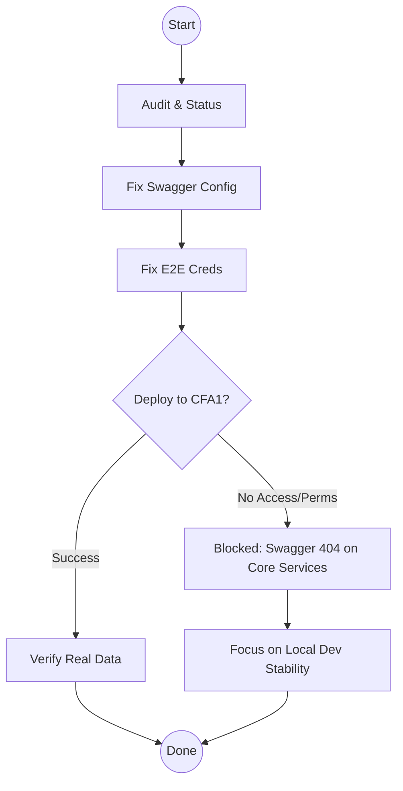
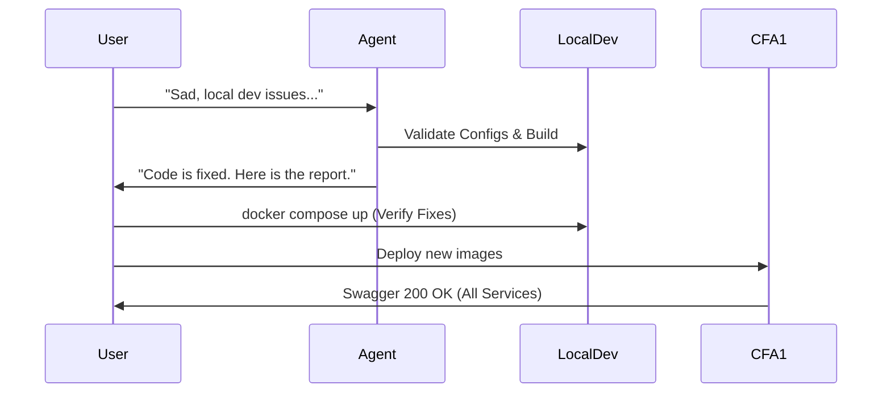

# SESSION_EVAL

- **completeness_score:** 60/100
- **accuracy_score:** 85/100
- **progress_pct:** 60%
- **summary_by_phase:**
  - **Phase 1 (Audit):** ✅ Выполнен. Статусы CFA1 обновлены.
  - **Phase 2 (NX-05 Reports):** ⚠️ Частично. E2E тесты поправлены (новые креды), но реальные данные на бэкенде не проверены до конца из-за проблем с деплоем.
  - **Phase 3 (NX-06 Schedule):** ⚠️ Частично. Сделан E2E на stub-страницу. Реальный функционал ждет данных.
  - **Phase 4 (NX-07 KYC):** ⚠️ Частично. Код написан (DTO, endpoints), SDK обновлен. Но на CFA1 старая версия, тесты проходят только базовый UI.
  - **Phase 5 (Swagger/Audit):** ⚠️ Частично. В коде флаги добавлены. На CFA1 Swagger работает только у Gateway/Identity. Остальные сервисы — 404 (нужен редеплой образов).
  - **Docs/AGENTS.md:** ✅ Обновлен качественно.

### 📊 Status Diagram


---

# REQUIREMENTS_FROM_VOICE

- **explicit_requirements:**
  - **Local Dev First:** "Надо, чтобы и фронты в докерах просто поднимались и все, и по кнопке это можно было на любое окружение." (Илья). Локальный запуск должен быть "без магии".
  - **Swagger/AsyncAPI:** Должны работать везде (Local/Dev/Prod).
  - **Backend Work:** Пользователь сомневается, была ли проделана реальная работа по KYC бэкенду. Нужно четко валидировать наличие эндпоинтов.
  - **Merge/Git:** Ветка `develop` — основная. `infra.defis.deploy` — легаси. Конфликты с Ильей не трогать (он решит), но свои изменения держать в `codex/fix-cfa1-regressions`.
  - **CI/CD & Blockchain:** Это следующие большие задачи для AlexA.

- **implicit_requirements:**
  - Пользователь "ушел спать", агент должен работать автономно и максимально продвинуть задачи, чтобы утром можно было смержить/задеплоить.
  - Акцент сместился с "починить CFA1 любой ценой" на "убедиться, что локально все работает идеально, чтобы это можно было раскатать".

- **corrections:**
  - Не пытаться хакать CFA1 через `docker run` с ENV переменными, если это приводит к падению (MassTransit). Лучше подготовить корректные конфиги в коде (что уже сделано) и проверить их локально.

---

# UPDATED_JTBD_CONTRACT

- **jobs:**
  - **J1: Local Dev Validation:** Гарантировать, что `docker compose up` (или `make up`) локально поднимает весь стек (Gateway + Services + Swagger) без ошибок. Это ответ на боль пользователя "печально, я там сейчас начал все поднимать локально".
  - **J2: Backend KYC Verification:** Явно проверить и продемонстрировать (через тесты или curl локально), что новые эндпоинты `/v1/compliance/kyc` (POST/GET) реально работают в коде.
  - **J3: CFA1 Readiness:** Подготовить всё для "чистого" деплоя на CFA1 (образы, конфиги), чтобы устранить 404 на Swagger сервисов.
  - **J4: Docs Sync:** Финализировать `tasks/NX-*.md` с учетом того, что сделано в коде, даже если на CFA1 это еще не выкачено.

- **DoD:**
  - [ ] Локальный запуск (`docker compose up`) успешный, все Swagger UI доступны на localhost.
  - [ ] Пройден локальный smoke-тест KYC (создание заявки).
  - [ ] Код в ветке `codex/fix-cfa1-regressions` готов к мерджу в `develop` (чистый, без временных хаков).
  - [ ] Отчет для пользователя содержит список конкретных файлов и методов, добавленных для KYC (доказательство работы).

- **constraints:**
  - Не ломать `develop`.
  - Не тратить время на попытки пробить permissions на CFA1, если это невозможно. Лучше отладить локально.

---

# AGENT_PROMPT

```text
You are a Senior .NET/DevOps Engineer acting as the "Digital Twin".
Current Branch: `codex/fix-cfa1-regressions`
Target: Stabilize Local Dev & Prepare CFA1 Fixes.

**Context:**
The user is trying to run the project locally and is frustrated ("Печально...").
On CFA1, we fixed Gateway Swagger, but Core Services (Issuance, etc.) return 404 because they need a rebuild/redeploy with the new `Swagger:Enabled` code.
You have already implemented the code fixes (Program.cs, appsettings).

**Your Mission:**
1. **Validate Local Dev:** Ensure that the changes you made (Swagger flags, Kafka defaults) actually work in a fresh local `docker compose up` environment. If you can't run full docker locally, simulate/verify configs strictly.
2. **Prove Backend Work:** The user asked "What real backend work was done?". You must verify the KYC endpoints (`POST /v1/compliance/kyc`) are present and buildable.
3. **Finalize Artifacts:** Ensure all docs and tasks reflect that the *Code is Ready* but *CFA1 Deployment is Pending* for specific features.

**Step-by-Step Plan:**

1. **LOCAL CONFIG CHECK:**
   - Review `docker-compose.yml` and `docker-compose.services.yml`.
   - Verify that `SWAGGER_ENABLED=true` is correctly propagated.
   - Verify that `KAFKA_ENABLED=false` (default) allows services to start without a broker (fixing the MassTransit crash you saw on CFA1).

2. **BACKEND PROOF:**
   - Compile the Compliance service again (`dotnet build`).
   - Verify `KycApplicationRequest.cs` and the Controller exist.
   - Create a summary file `artifacts/backend-work-report.md` listing exactly which files/methods were added for KYC/NX-07.

3. **DOCS & HANDOVER:**
   - Update `tasks/NX-*.md` to clearly distinguish between "Implemented in Code" (✅) and "Deployed to CFA1" (⚠️ Pending Redeploy).
   - Update `AGENTS.md` if needed with any new findings about local startup.

4. **FINAL COMMIT:**
   - Commit any remaining config/doc tweaks.
   - Do NOT push unless asked.

**Self-Correction from previous turn:**
- Stop trying to hack CFA1 containers via SSH if permissions deny it. Focus on making the *codebase* perfect so the user (or CI) can deploy it easily.

**Output:**
- Report on Local Config validity.
- The `backend-work-report.md` content.
- Final status of the branch.
```

---

# NEXT_STEPS_FOR_HUMAN

- [ ] **Git:** Pull ветку `codex/fix-cfa1-regressions`.
- [ ] **Local Dev:** Запустить `docker compose up -d`. Проверить, что все Swagger UI доступны локально (порты 5500x).
- [ ] **Deploy:** Если локально ок — запустить пайплайн деплоя (или `deploy-node.sh`) на CFA1, чтобы обновить образы сервисов. Это починит 404 на Swagger.
- [ ] **Merge:** После проверки — мержить в `develop` (разрешая конфликты с изменениями Ильи, если они есть в тех же файлах).

