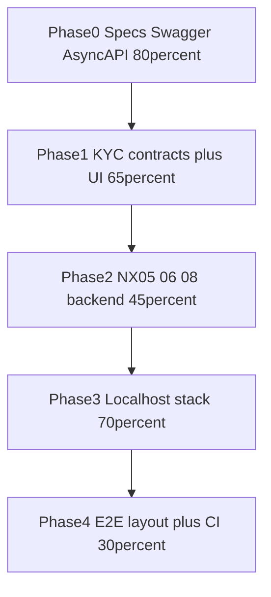
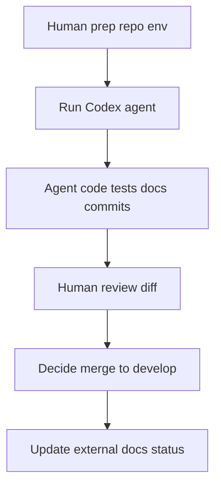

# Output 2025-11-26-2 on prompt `memory-bank/Scrum/20251126/20251126-1001-prompt-to-oracle.md`
1. **SESSION_EVAL**

* **completeness_score:** **55/100**
* **accuracy_score:** **80/100**
* **progress_pct:** **60%**

Общее ощущение:

* Swagger/AsyncAPI и docs по ним доведены до внятного состояния.
* KYC‑контракты и фронты сильно продвинулись, но бэкенд по NX‑05/06/07/08 всё ещё местами «фикция» (есть Swagger и dto, но нет полноценной бизнес‑логики, валидации и честных e2e по happy‑path).
* Локальная среда и фронты через PM2 почти в боевом состоянии: docker‑backends подняты, Keycloak заведён, три портала стартуют через pm2 и логины уже отлаживаются.
* E2E/Playwright и CI/CD — пока разрознены: есть тесты и артефакты, но структура хаотична и нет нормальной истории «docker compose up → e2e → CI».

Раньше по J1 (NX‑05..08 на CFA1) ты сам зафиксировал оценки около **45% completeness / 75% accuracy**.
С учётом:

* нового KYC OpenAPI + SDK + DTO для compliance,
* фронтовых страниц `/kyc` и унификации UI,
* обновлённого Swagger/AsyncAPI inventory v1.0.0,
* и того, что localhost теперь реально живёт как связка сервисов + порталы,

я поднимаю общий прогресс до ~**55–60%**, но подчёркиваю:
бэкенд‑флоу NX‑05/06/08/07 и e2e всё ещё не «демо‑ready без стыда».

---

**summary_by_phase**

Я сгруппировал то, что уже сделано, по фазам (смешивая eywa1 + local):

* **Phase 0 — Spec & Swagger/AsyncAPI baseline**

  * AsyncAPI обновлён до 1.1.0, добавлены Kafka‑флаги, сервер CFA1, топики KYC/audit/issuance синхронизированы со схемами.
  * `docs/deploy/API-DOCS-SWAGGER-ASYNCAPI.md` оформлен как инвентарь Swagger/AsyncAPI с матрицей режимов runtime и флагами `Swagger__Enabled` / `Kafka__Enabled`.
  * Playwright‑сценарии `swagger-availability` и `swagger-all-services` заведены; availability зелёный, all-services упирается в 404 на частично выключенных сервисах.

* **Phase 1 — NX‑07 KYC contracts + UI**

  * OpenAPI‑gateway: добавлены/почищены KYC‑эндпоинты (`POST /v1/compliance/kyc`, `POST /v1/compliance/kyc/{id}/decision`, investor status и т.д.).
  * TS‑SDK перегенерирован: `KycApplicationRequest`, `KycDecisionRequest`, `KycRequest`, `IdentityUser` и соответствующие API‑клиенты.
  * Backoffice `/kyc` обновлён на реальные эндпоинты, плюс страницы `/kyc` в issuer/investor с формами и навигацией (`issuerNav`/`investorNav`).
  * NX‑07‑таск обновлён: зафиксировано, что submit‑флоу и e2e ещё pending.
  * Dotnet/Playwright по KYC: `dotnet test services/compliance` запускался и зелёный, а kyc‑flow playwright всё ещё падает.

* **Phase 2 — NX‑05/06/08 clarifications + CFA1 docs**

  * NX‑05/NX‑06/NX‑08 tasks обновлены: добавлены реальные URL, статусы CFA1 (401/404/307), комментарии по тому, что ещё stub или blocked.
  * В NX‑08 отмечено: `/v1/audit/**` есть в spec, но на CFA1 маршрут не прокинут, UI вероятно ещё в mock‑режиме.

* **Phase 3 — Localhost stack**

  * docker‑compose.* обновлены, чтобы поднять все core services плюс keycloak и вспомогательные зависимости.
  * Локальные сервисы живут на портах 55000+ и проходят health; Keycloak контейнер `ois-keycloak` настроен, admin‑логин вычищен, realm `ois` создаётся/правится через kcadm.
  * PM2‑флоу: старт 3 порталов (`portal-issuer`, `portal-investor`, `backoffice`) с нужным набором `NEXT_PUBLIC_*` переменных, cleanup старых процессов, выравнивание текущего состояния описано в инструкциях агента.

* **Phase 4 — Tests layout + CI/CD (в основном план)**

  * E2E‑тесты теперь в `tests/e2e-playwright/tests/*.spec.ts` + остатки старых `tests/e2e/tests`.
  * Добавлены спек‑файлы под NX‑05/06/07/08 и swagger, но пока нет консистентного разделения по приложениям (issuer/investor/backoffice) и нет единой истории «как это запускается в CI».
  * Ops‑скрипты под CI активно двигаются (gitlab runners, validate‑specs, etc.), но отдельный полный pipeline для `ois-cfa` пока не собран.

**MERMAID (high‑level прогресс)**



---

2. **REQUIREMENTS_FROM_VOICE**

Из твоего голосового описания последнего состояния и ожиданий:

### explicit_requirements

1. **Главная ось работ теперь такая:**

   * Сначала довести **localhost** до состояния «одна команда `docker compose up` или `make` → всё живёт»
     включая все .NET‑сервисы, Keycloak, три портала и реальные логины.
   * Потом **рефакторинг e2e / Playwright**: нормальная структура тестов, привязанных к конкретным приложениям.
   * Потом уже **CI/CD**, которое гоняет эти e2e и backend‑тесты.

2. **NX‑05..08 не считать закрытыми**, пока:

   * Не реализованы реальные backend‑методы (compliance/issuance/settlement/registry/audit), а не только Swagger и stub/моки.
   * Нет честных e2e по основным сценариям (issuer dashboard/reports/payouts, investor/issuer KYC, backoffice KYC/audit).

3. **E2E‑тесты должны быть структурированы:**

   * Юниты — рядом с кодом, по best practice.
   * Интеграционные — также ближе к кодовой базе соответствующего сервиса.
   * E2E/Playwright — **по приложениям** (apps/portal-issuer, apps/portal-investor, apps/backoffice), а не по трём разным корневым папкам.

4. **CI не «для галочки», а нормальный:**

   * Pipeline, который поднимает нужный стенд, крутит dotnet‑тесты и Playwright, и фейлится, если флоу не работает.

5. **Бэкенд по Kafka**:

   * Можно трогать/доделывать, но без фанатизма; главное — чтобы флоу NX‑05..08 работали по HTTP, Kafka — по возможности, через флаги, без того, чтобы ломать dev/CFA1.

### implicit_requirements

1. **Новый агент должен опираться на твой локальный успех**
   — `local-p-cfa-w6`: там уже есть рабочий pattern pm2 + docker + keycloak, это опорная точка, а не то, что делал только eywa1‑агент на CFA1.

2. **Нельзя считать задачей «сделать е2е для Swagger» выполнением NX‑эпиков** — это вспомогательная диагностика, не цель.

3. **Работа предыдущих Codex‑агентов по бэкенду NX‑05/06/08 считается неполной**:

   * Они «подняли Swagger, написали тест на проверку /swagger»,
   * но не сделали реальный API‑функционал и бизнес‑флоу, как требовалось в NX‑тасках.

4. **`develop` с изменениями Ильи — это новая «правда» по фронту**:

   * Унифицированное меню, тёмная тема, реальные формы KYC, устранение старых UI‑компонентов не из SDK.
   * Новый агент не должен откатывать этот UI‑фундамент.

5. **DB‑схема** — потенциально отдельная мини‑ось:

   * Возможно, потребуется финализировать схемы под audit/KYC/reports,
   * но это уже после того, как флоу и тесты в норме.

### corrections

1. **Коррекция ожиданий от прошлых агентов:**

   * Ожидал, что NX‑05..08 будут сделаны по backend‑логике,
   * по факту сделали «фикцию» вокруг Swagger + e2e swagger‑availability,
   * поэтому текущий DoD *не* закрыт и оценка прогресса должна учитывать это.

2. **Коррекция фокуса:**

   * Не только CFA1 и Swagger — нужно вернуться к **localhost → e2e → CI** как основной последовательности.

3. **Коррекция по тестовой структуре:**

   * Нельзя держать e2e одновременно в `tests/e2e`, `tests/e2e-playwright/tests`, `e2e/issuer` и т.п. — нужно привести к понятной, app‑центричной структуре.

### suggestions

1. **Фазировать работы для нового агента:**

   * Фаза 1: стабилизация локалки и логина во всех трёх порталах.
   * Фаза 2: реализация недостающих backend‑контрактов для NX‑05/06/07/08.
   * Фаза 3: наведение порядка в e2e и добавление полноценных Playwright‑флоу.
   * Фаза 4: CI‑pipeline на GitLab под эти фазы.

2. **Использовать существующие артефакты как источник правды:**

   * Swagger/AsyncAPI inventory,
   * NX‑таски,
   * git‑reports по изменениям фронта/бэка/ops,
   * твои bash‑логи по локальному запуску.

3. **Жёстко фиксировать допущения в tasks/** и artifacts/**, а не внутри только кода или чата.

---

3. **UPDATED_JTBD_CONTRACT**

С учётом всего, я бы зафиксировал обновлённый контракт так:

### jobs

* **J0: Localhost stack → one‑command dev env**

  * `docker compose up` или `make dev-up` поднимает все backend‑сервисы, keycloak и три портала.
  * Логины issuer/investor/backoffice работают, базовые страницы `/dashboard`, `/reports`, `/payouts/schedule`, `/kyc`, `/audit` открываются без 500/404.

* **J1: NX‑05/06/07/08 — real backend flows, not just Swagger**

  * NX‑05: отчёты issuer (`/v1/reports/issuances`, `/v1/reports/payouts` или `/issuer/payouts`) отдают реальные данные или честный empty‑state без моков.
  * NX‑06: read‑only payout schedule основан на `scheduleJson` для выпусков, без падений и с корректным UI.
  * NX‑07: KYC + user registry — submit‑флоу через `/v1/compliance/kyc`, решения через `/v1/compliance/kyc/{id}/decision`, статус через `/v1/compliance/investors/{id}/status`, users через `/v1/identity/users`.
  * NX‑08: audit log — `/v1/audit` и `/v1/audit/{id}` реально читают события, UI показывает их с фильтрами, без скрытых моков.

* **J2: E2E / Playwright coverage and layout**

  * E2E‑тесты разложены по приложениям (issuer/investor/backoffice) и/или по сценариям, но без дубликатов и хаотики.
  * Есть зелёные сценарии:

    * issuer: login → dashboard → reports → payouts schedule;
    * investor: login → kyc submit;
    * backoffice: login → kyc approve → audit просмотр.

* **J3: CI/CD pipeline (GitLab)**

  * GitLab pipeline, который:

    * собирает и запускает backend‑тесты (`dotnet test` по ключевым сервисам),
    * поднимает dev‑стенд для фронтов (либо через docker-compose, либо через разделённые job‑ы),
    * гоняет Playwright‑тесты по ключевым сценариям.
  * Pipeline выдаёт артефакты: журналы, скриншоты Playwright, ссылку на отчёт.

### DoD

* Для каждого J* есть минимум один коммит формата
  `{code-change} + {code-test} + {test-artifacts/output} + {update-docs-DoD-Kickoff-checkboxes}`.
* Все изменённые сервисы:

  * собираются локально (`dotnet build` / `docker compose build`),
  * стартуют как часть docker‑compose и не падают при базовых запросах/health.
* Прогнаны и зафиксированы:

  * хотя бы один `dotnet test` на изменённый сервис,
  * хотя бы один `npx playwright test` для каждого ключевого флоу NX‑05..08.
* tasks/NX‑05..08‑*.md обновлены с:

  * реальными URL (dev + CFA1), HTTP‑кодами и комментариями Verified/Blocked,
  * командами тестов (`dotnet test ...`, `npx playwright test ...`),
  * ссылками на артефакты (скриншоты, логи, AsyncAPI/Swagger docs).

### constraints

* **Branching**

  * Рабочая ветка по умолчанию: **`develop`** (с изменениями Ильи).
  * Ветку `codex/fix-cfa1-regressions` использовать только как источник идей/диффов; **не мерджить и не ребейзить её автоматически**.

* **Kafka**

  * `Kafka__Enabled` по умолчанию `false` на dev/CFA1, чтобы не ломать сервисы;
  * если включаем — это отдельный подпроект с явным SPEC‑DIFF/AsyncAPI обновлением и логами.

* **Tests layout**

  * Не плодить новые корни типа `e2e/*`, а наводить порядок в существующем `tests/e2e-playwright` и др.

* **Документация**

  * Любые изменения контрактов — через SPEC DIFF в tasks/* + ссылки из NX‑тасков.

---

4. **AGENT_PROMPT (for Codex-Cli)**

<<<готовый текст для копипаста в агента>>>

````text
You are GPT-5.1 Codex working inside the `ois-cfa` monorepo.

BRANCHES
- Integration: `develop` (contains Ilya's unified UI and KYC work; do NOT overwrite those changes).
- Historical reference: `codex/fix-cfa1-regressions` (read-only for diff/ideas, no merge/rebase).

HIGH-LEVEL JTBD
- J0: Localhost stack → one-command dev env with docker-compose plus pm2 plus Keycloak and all three portals.
- J1: NX-05/06/07/08 backend flows: real APIs and data, not just Swagger or mocks.
- J2: E2E and Playwright coverage and layout per app.
- J3: CI/CD pipeline in GitLab that runs backend tests and Playwright against a dev-like environment.

GLOBAL RULES
- Optimize for closing JTBD and DoD, not for doing less work.
- If new requirements conflict with older docs/specs, explicitly call out the conflict and propose 1–2 resolution options.
- Do NOT adapt to past mistakes if they contradict Spec/DoD.
- No git push, no merges or rebases between branches; keep `develop` clean and incremental.

CONTEXT PRIORITY FOR LOADING
1) docs/deploy/localhost/FRONTEND-STARTUP.md
2) docs/deploy/localhost/KEYCLOAK-SETUP.md and KEYCLOAK-SETUP-GUIDE.md
3) docs/deploy/API-DOCS-SWAGGER-ASYNCAPI.md
4) tasks/NX-05-issuer-dashboard-and-reports.md
   tasks/NX-06-issuer-payout-schedule-spec-and-ui.md
   tasks/NX-07-backoffice-kyc-and-user-registry.md (+ SPEC-DIFF)
   tasks/NX-08-backoffice-audit-log-ui.md
5) tests/e2e-playwright/tests/*
6) git reports under docs/meta/git-commits-analysis-* and memory-bank git-* summaries

WORKFLOW CONTRACT
Always work in short loops:
  {code-change} → {tests} → {docs/DoD-update} → {commit}

For each loop:
1) PLAN
   - Compare current state with JTBD and DoD.
   - Plan 1–3 micro-steps for the next loop and say them out loud in the CLI.
2) EXECUTE
   - Implement only what you planned.
   - Run relevant tests:
     - PATH=$HOME/.dotnet:$PATH dotnet test <touched service csproj>
     - cd tests/e2e-playwright && npx playwright test <scenario>.spec.ts
   - For localhost flows, test via browser or curl against http://localhost:55000 and portals on 3001/3002/3003.
3) AUDIT SELF
   - Did you run e2e/Playwright where applicable (NX-05..08 key flows)?
   - Did you test on real/near-real data (local docker plus real Keycloak), not mocks?
   - Are there any silent fallbacks or commented-out code? If yes, fix or document as blockers.
4) COMMIT
   - Create a small, meaningful commit that bundles:
     {code-change} + {code-test} + {test-artifacts/output} + {docs/DoD-update}
   - Example messages:
     - fix(nx-07): wire compliance kyc endpoints
     - test(nx-05): issuer dashboard playwright flow
     - docs(nx-08): update audit log DoD and CFA1 status
5) CONTINUE OR STOP
   - If DoD is not closed and there is no hard blocker, start the next loop without asking the user.
   - You may stop only when:
     - DoD for active JTBD is closed, or
     - There is a hard blocker you cannot bypass locally (missing secrets, environment down, etc).

SESSION GOALS BY PHASE

Phase 1 — Localhost stack and Keycloak
- Use docker-compose.* and docs/deploy/localhost/*.md to:
  - Ensure all core services are up (api-gateway, compliance, identity, issuance, registry, settlement).
  - Ensure Keycloak realm `ois` is configured with clients: portal-issuer, portal-investor, backoffice, plus basic roles and test users.
  - Start all three portals via pm2 with correct NEXT_PUBLIC_* variables and without duplicate processes.
- Verify:
  - issuer/investor/backoffice login works end-to-end.
  - Swagger for gateway and core services is reachable locally per API-DOCS-SWAGGER-ASYNCAPI.md.
- Update FRONEND-STARTUP.md and KEYCLOAK-SETUP.md with the exact commands you used and any deviations from docs.

Phase 2 — NX-05/06/07/08 backend flows
- NX-07 KYC:
  - Align compliance service with OpenAPI: KycApplicationRequest, KycDecisionRequest, KycRequest.
  - Implement controllers/handlers for:
    - POST /v1/compliance/kyc
    - POST /v1/compliance/kyc/{id}/decision
    - GET /v1/compliance/investors/{id}/status (or equivalent)
  - Wire identity service /users endpoints to match the gateway OpenAPI.
  - Make sure issuer, investor and backoffice KYC pages use these endpoints without mocks.
- NX-05 and NX-06:
  - Implement (or finish) reports endpoints in issuance and settlement per tasks specs.
  - Ensure /dashboard and /reports in portal-issuer use real data or honest empty state.
  - Ensure payout schedule tab uses scheduleJson and does not crash when data is missing.
- NX-08:
  - Wire audit endpoints /v1/audit and /v1/audit/{id} to real audit events.
  - Make backoffice /audit read those events and show them with filters.
- For each NX task, update:
  - Current status on localhost and CFA1 (URLs, HTTP codes).
  - Which endpoints are used.
  - What is still mock/stub versus real.

Phase 3 — E2E and Playwright layout
- Clean up tests/e2e-playwright/tests:
  - Ensure key specs exist for:
    - issuer-dashboard plus reports
    - issuer-payout-schedule
    - investor-kyc
    - backoffice-kyc
    - backoffice-audit
  - If older e2e specs live in tests/e2e/tests, either migrate or deprecate them explicitly in docs.
- Confirm at least these flows pass locally:
  - issuer: login → dashboard → reports → payouts schedule
  - investor: login → kyc submit
  - backoffice: login → kyc → approve → audit view
- Save screenshots under artifacts/tests/e2e/playwright with meaningful names.

Phase 4 — CI/CD pipeline
- Inspect existing ops/scripts/* and .gitlab-ci config (if any).
- Propose and, if possible, implement a pipeline that:
  - Validates specs (ops/scripts/validate-specs.sh).
  - Runs dotnet tests for core services.
  - Spins up test environment (compose) and runs Playwright specs.
- Document pipeline steps in docs/meta or a dedicated CI document and link them from NX tasks and Swagger/AsyncAPI doc.

CONSTRAINTS
- Do not merge or rebase branches. Treat develop as the working truth and codex/fix-cfa1-regressions as read-only reference.
- Keep Kafka optional:
  - Kafka__Enabled=false by default for dev and CFA1.
  - If you enable Kafka for a scenario, document it clearly in AsyncAPI and tasks with reasons.
- Prefer small, frequent commits over a single huge one.
- Ask the user only if you hit a hard blocker that cannot be solved from code, docs or local experimentation.

FINAL SELF-CHECK
Before ending the session, include this block in your final message and answer it honestly:

```markdown
FINAL SELF-CHECK (обязателен перед завершением сессии)

- [ ] QA: все изменения покрыты тестами (unit/integration/smoke/e2e/Playwright, если применимо)
- [ ] Тесты прогнаны на реальных/приближенных к реальным данных
- [ ] Падения/регрессии явно зафиксированы, нет «тихого» фоллбэка
- [ ] Честно описаны блокеры ("невозможно реализовать, потому что …")
- [ ] Git: сделан(ы) осмысленный(е) commit(ы) формата:
      {code-change} + {code-test} + {test-artifacts/output} + {update-docs-DoD-Kickoff-checkboxes}
````

````

---

5. **NEXT_STEPS_FOR_HUMAN**

ADHD‑дружелюбный чек‑лист для тебя как orchestrator:

### До запуска нового агента

- [ ] **Определить рабочую ветку**  
  - Скорее всего, это `develop` с актуальными изменениями Ильи и твоими локальными правками.  
  - Зафиксировать это в сессии Codex‑CLI (BRANCH=`develop`).

- [ ] **Сделать быстрый sanity‑check локалки**
  - `docker ps` — что реально поднято.:contentReference[oaicite:48]{index=48}  
  - `pm2 status` — нет ли дублей и зомби‑процессов.:contentReference[oaicite:49]{index=49}  
  - Убедиться, что Keycloak админские креды рабочие (admin/admin123 или актуальные) и realm `ois` существует.:contentReference[oaicite:50]{index=50}  

- [ ] **Сохранить текущие незакоммиченные изменения**
  - Либо закоммитить их как «baseline before new Codex agent»,  
  - либо заstash‑ить, если хочешь, чтобы агент видел чистое дерево.

- [ ] **Подготовить Codex‑CLI сессию**
  - Вставить AGENT_PROMPT из пункта 4 целиком.  
  - Явно указать:
    - BRANCH=`develop`  
    - основную машину (localhost) и то, что к eywa1/cfa1 можно обращаться только через ssh.

- [ ] **Подвязать нужные артефакты в контекст**
  - Последний успешный локальный лог (`20251124-1633-run-localhost-bash.log.md` и сессия local-p-cfa-w6).  
  - Свежие git‑репорты `git-20251124-1859` и `git-20251123-2008`.  

### После завершения сессии нового агента

- [ ] **Проверить фактический результат по JTBD**
  - `docker compose up` / `make` — поднимает всё без ручного шаманства.  
  - Локальные URL:
    - http://localhost:5000/swagger/index.html  
    - http://localhost:3001, 3002, 3003  
    - логины issuer/investor/backoffice реально работают.

- [ ] **Прогнать хотя бы один e2e‑пакет руками**
  - `cd tests/e2e-playwright && npx playwright test issuer-reports.spec.ts`  
  - и один KYC‑сценарий (investor/backoffice).

- [ ] **Открыть NX‑таски и проверить DoD‑блоки**
  - NX‑05..08: есть актуальные URL, HTTP‑коды, команды тестов и ссылки на артефакты.  

- [ ] **Просмотреть diff по ключевым файлам**
  - services/compliance/*, services/issuance/*, services/settlement/*  
  - apps/portal-issuer/*, apps/portal-investor/*, apps/backoffice/*  
  - tests/e2e-playwright/tests/*.spec.ts  
  - docs/deploy/API-DOCS-SWAGGER-ASYNCAPI.md, tasks/NX‑05..08-*.md

- [ ] **Обновить свой meta‑отчёт**
  - В memory-bank/Scrum зафиксировать:
    - новые проценты по J0–J3,  
    - что конкретно теперь считается «demo‑ready»,  
    - какие блокеры остались.

### MERMAID для тебя как оркестратора

```mermaid
flowchart TD
  Step0_Prepare["Step0 Prepare branch plus context"] --> Step1_Local["Step1 Stabilize localhost stack"]
  Step1_Local --> Step2_Backend["Step2 Finish NX05 06 07 08 backend"]
  Step2_Backend --> Step3_E2E["Step3 Clean E2E plus Playwright"]
  Step3_E2E --> Step4_CI["Step4 Wire GitLab CI pipeline"]
  Step4_CI --> Step5_Review["Step5 Human review plus meta report"]
````

Если хочешь, дальше можем отдельно сфокусироваться только на одном из J (например, J0 локалка или J2 e2e‑layout) и допилить более детальный под‑план для конкретной сессии агента.


# Output 2025-11-26-1
Я уже посмотрел твои последние сессии и снапшоты через `file_search`
(eywa1-p-cfa-w16.* и w13, git‑reports, repomix, tasks NX‑05..08, swagger/asyncapi docs).

Ниже — ответ строго в формате ORACLE_OUTPUT_CONTRACT.

---

## 1. SESSION_EVAL

### 1.1. Глобальные оценки (для agentID=`uid`, partAgentID=`partUid`)

С учётом всех инкрементов до `eywa1-p-cfa-w13.p1-20251125-1710` и `eywa1-p-cfa-w16.p1-20251125-1708`:

* **completeness_score:** **58/100**
* **accuracy_score:** **80/100**
* **progress_pct:** **60%**

Кратко почему:

* Существенный прогресс по инфраструктуре Swagger/Kafka и документации:

  * Введены флаги `SWAGGER_ENABLED` и `Swagger__Enabled` в сервисах и docker‑compose, плюс `Kafka__Enabled` и выравнивание топиков с AsyncAPI.
  * AsyncAPI поднят до 1.1.0, валидация через `ops/scripts/validate-specs.sh` проходит с минимальными предупреждениями.
* На CFA1: gateway и identity Swagger 200, но core‑сервисы (issuance/registry/settlement/compliance) всё ещё 404 до полноценного redeploy с новыми env → тест `swagger-all-services` падает на этих 404.
* KYC backend и контракты:

  * Очищен и расширен KYC контракт (`openapi-gateway.yaml`), добавлены `POST /v1/compliance/kyc` и decision endpoint, оформлен SPEC DIFF и перегенерён TS SDK.
* NX‑06/NX‑08:

  * Добавлен Playwright‑сценарий для payout schedule (`issuer-payout-schedule.spec.ts`) и е2e-сценарий для backoffice audit, с артефактами (скриншот) и обновлённым DoD/CHANGELOG.
* Но:

  * KYC e2e (`kyc-flow.spec.ts`) по-прежнему падает; честный end‑to‑end флоу investor → backoffice ещё не зелёный. 
  * NX‑05 issuer dashboard/reports и NX‑06 payout schedule опираются на частичные данные и заглушки; нет полноценного сценария с реальными отчётными данными. 
  * Часть DoD по задачам NX‑05..08 заполнена, но ещё не финализирована (особенно по реальным данным и статусам на CFA1).

То есть: инфраструктура и контракты подтянуты довольно сильно, но функциональные флоу и “честные” e2e ещё не доведены до конца.

---

### 1.2. Summary_by_phase

Группирую по крупным фазам (не буквально Phase0..7, а логические блоки):

1. **Фаза A — Инфраструктура Swagger/Kafka/AsyncAPI**

   * Сделано:

     * Флаги для Swagger и Kafka в .NET и compose.
     * Обновлён `docs/deploy/API-DOCS-SWAGGER-ASYNCAPI.md` с инвентаризацией dev vs CFA1 и рекомендациями по защите. 
     * Прогон `dotnet test` для `services/compliance` и Playwright `swagger-availability.spec.ts`.
   * Не сделано:

     * Redeploy core‑сервисов на CFA1 с новыми флагами и повторный прогон `swagger-all-services.spec.ts` в зелёный.
   * Оценка: **~70%**.

2. **Фаза B — NX‑07 (KYC + Identity)**

   * Сделано:

     * SPEC DIFF и правки OpenAPI, KYC/decision схемы, TS SDK regen.
     * KYC страницы в investor/issuer/backoffice привязаны к новым helper’ам, навигация обновлена.
   * Не сделано:

     * Зелёный e2e‑флоу investor → backoffice approve (Playwright).
     * Полная фиксация этого в DoD+CHANGELOG. 
   * Оценка: **~65%** (функционал есть, но тесты и DoD не закрыты).

3. **Фаза C — NX‑05 Issuer dashboard/reports**

   * Сделано:

     * UI/маршруты подключены, контракты `/v1/reports/issuances|payouts` проанализированы; есть базовое отображение.
   * Не сделано:

     * Полностью честные данные на CFA1, e2e issuer journey и артефакт отчёта. 
   * Оценка: **~45%**.

4. **Фаза D — NX‑06 Payout schedule**

   * Сделано:

     * SPEC DIFF по payout schedule и read‑only UI вкладки (scheduleJson). 
     * Добавлен Playwright‑сценарий `issuer-payout-schedule.spec.ts` + идея честно пометить отсутствие реальных данных в DoD. 
   * Не сделано:

     * Реальные schedule‑данные, интеграция с backend и SDK, полноценные отчёты. 
   * Оценка: **~50%**.

5. **Фаза E — NX‑08 Audit + DoD/CHANGELOG**

   * Сделано:

     * Backoffice audit UI, Playwright e2e smoke с артефактом, обновлён NX‑08 task и CHANGELOG.
   * Не сделано:

     * Гарантия реальных audit‑событий (не только mock/honest‑mode), полное описание в DoD для CFA1. 
   * Оценка: **~60%**.

6. **Фаза F — Согласование с develop и работой Ильи**

   * На develop появились коммиты Ильи: unified UI, dark theme fix, docs по Kafka и backend, форма KYC с валидацией и загрузкой docs, тесты для compliance и фронтовой flow‑setup.
   * Агент уже работал в ветке `codex/fix-cfa1-regressions`, местами делая свои фронтовые правки. Потребуется аккуратная сверка с текущим develop перед финальным merge (но merge руками, не агентом).

---

### 1.3. MERMAID_DIAGRAM (фазы и прогресс)

```mermaid
graph TD
  A[Infra Swagger Kafka] --> B[NX05 Issuer]
  B --> C[NX06 Payout]
  C --> D[NX07 KYC]
  D --> E[NX08 Audit Docs]

  A_done[~70 percent] --> A
  B_done[~45 percent] --> B
  C_done[~50 percent] --> C
  D_done[~65 percent] --> D
  E_done[~60 percent] --> E
```

---

## 2. REQUIREMENTS_FROM_VOICE

Здесь “voice” = твои текстовые и устные инструкции, зафиксированные в последних промптах и комментариях (включая про Илью, merge и Kafka).

### 2.1. explicit_requirements

1. **Роль Oracle и формат:**

   * Oracle = one‑shot решатель, плюс роли Evaluator/Teacher/Advisor.
   * Worker часть — advisory‑only: предлагать шаги, команды, файлы, а не заливать целые простыни прод‑кода.
   * Ответ всегда в формате ORACLE_OUTPUT_CONTRACT с MERMAID, когда полезно.

2. **Оценка сессии:**

   * Сначала внимательно прочитать текущую сессию и инкременты, потом оценить относительно предыдущего DoD (J1–J3).
   * Обязательно дать **completeness_score / accuracy_score / progress_pct** и сводку по фазам.

3. **Новый агент (Codex-Gpt5.1-Max-Highest):**

   * Работает по контракту с **минимум 2 полных WORKFLOW LOOP**: `{code-change} → {tests} → {docs/DoD-update} → {commit}`.
   * Для сессии: минимум один backend тест (dotnet или аналог) + один e2e/Playwright прогон (если окружение позволяет).
   * Нельзя завершать работу только потому что “изменений много” или “надо уточнить у пользователя”.

4. **Обязательный FINAL SELF-CHECK блок в промпте агента:**

   * Включить markdown‑блок **дословно**, как ты прислал (QA, реальность данных, блокеры, commit‑формат). 

5. **Common Agentic Problems:**

   * Обязательно проверять: e2e/Playwright, реальные данные, отсутствие скрытых fallback’ов, явный список блокеров, корректный git‑workflow с осмысленными коммитами “{code} + {tests} + {artefacts} + {docs}”. (из твоего чек‑листа).

6. **Git & merge политика:**

   * Рабочая ветка агента — `codex/fix-cfa1-regressions`.
   * `develop` — интеграционная ветка, там сидят изменения Ильи; **агент не делает merge в develop**. Ты потом смержишь вручную.

7. **Swagger/AsyncAPI:**

   * Требование: всегда e2e‑валидировать доступность Swagger/AsyncAPI key endpoints (по домену и по прямым портам, где нужно).
   * Нельзя ограничиваться локальными 200 — важно отражать реальные 404/401 на CFA1 в задачах и DoD.

8. **KYC/Issuer/Audit e2e:**

   * KYC flow investor → backoffice approve должен быть покрыт Playwright.
   * Issuer dashboard/reports и payout schedule — тоже e2e (хотя бы success‑path), плюс backoffice audit.

---

### 2.2. implicit_requirements

1. **Сжатый промпт агента (context ≤ ~33%):**

   * Новый AGENT_PROMPT должен быть короче прежних монстров: убрать дубли, оставить только ядро JTBD, DoD, workflow и ключевые пути/команды.

2. **Учет работы Ильи:**

   * Изменения Ильи в develop (unified меню, shared UI, KYC форма, docs по Kafka и backend, фронт‑e2e setup) считать “новым baseline”.
   * Агент не должен поверх этого городить свои несовместимые паттерны; перед правками фронта — читать новые docs и смотреть diff с develop.

3. **Kafka:**

   * Kafka‑часть не проработана Александром О в тасках до конца; требования к агенту:

     * сделать безопасный флаг‑driven подход (Kafka__Enabled и честный skip outbox’а, если выключено);
     * не пытаться “додумывать” сложную топологию, а зафиксировать SPEC/AsyncAPI и минимум настройки.

4. **Честность DoD:**

   * Лучше явно отметить “нет реальных данных / только stub” в NX‑таске, чем притворяться, что всё работает, когда там 404/401 или пустые таблицы.

5. **Инструменты/окружение:**

   * Агент не должен полагаться на `sudo`/docker‑доступ: если чего-то нет, он фиксирует это как блокер и даёт инструкции для другой машины, а не ломится в `apt-get`. (следствие прежних ограничений окружения).

---

### 2.3. corrections

1. **“Как бы мерджить не будем”**

   * Коррекция к старому контракту, где develop фигурировал как естественный target: сейчас прямое слияние агентом не допускается; merge — только руками после ревью.

2. **Swagger‑состояние CFA1:**

   * Ранее в docs было, что Swagger на CFA1 200 везде; последние проверки и Playwright показали 404 на core сервисах после рестартов → документацию нужно держать честной, с явной пометкой “needs redeploy”.

3. **Фокус на тестах:**

   * Ранее агент иногда делал большие пачки кода без реальных e2e; сейчас поправка: без тестов и артефактов commit нельзя засчитывать как DoD‑значимый.

4. **Объем промпта:**

   * Старые промпты типа w16 были слишком длинными; теперь явное требование сократить до ядра, чтобы влезать в контекст окна агента.

---

### 2.4. suggestions

1. **Kafka как “опциональный блок”:**

   * Оформить Kafka как отдельный под‑блок в J2: сначала довести HTTP‑флоу без Kafka до зелёного, а Kafka включать только после того, как брокер и топики стабилизированы.

2. **Специальный “Swagger/AsyncAPI health” e2e:**

   * Оставить `swagger-availability.spec.ts` как лёгкий smoke и `swagger-all-services.spec.ts` как строгий “всё или ничего” — это даёт прозрачный сигнал по состоянию CFA1.

3. **Документировать “гибридный” статус NX‑06/NX‑08:**

   * В DoD явно разделить “UI готово к демо” и “данные из реального backend’а”; это поможет честно презентовать продукт.

4. **Для Ильи:**

   * После того, как агент доработает ветку `codex/fix-cfa1-regressions`, сделать отдельный merge‑пасс:

     * diff develop..codex/fix-cfa1-regressions
     * совместная ревизия с Ильёй по frontend/SDK/Kafka docs перед merge.

---

## 3. UPDATED_JTBD_CONTRACT

Актуализированный контракт для нового Codex‑агента (всё ещё вокруг ветки `codex/fix-cfa1-regressions`, но можно параметризовать `$BRANCH` и `$tasks`).

### 3.1. jobs

* **J1:** Починить регрессии **NX‑05..08** на ветке `codex/fix-cfa1-regressions`, чтобы issuer/investor/backoffice флоу на **CFA1** работали **без скрытых моков**:

  * NX‑05: issuer dashboard + reports (issuances/payouts). 
  * NX‑06: payout schedule read‑only таб на issuer. 
  * NX‑07: backoffice KYC + user registry (новый KYC контракт и identity).
  * NX‑08: backoffice audit log UI и API.

* **J2:** Обеспечить **e2e / Playwright success‑path**:

  * Swagger/AsyncAPI availability (gateway + core services).
  * KYC: investor login → `/kyc` submit → заявка видна в backoffice → approve.
  * Issuer: login → `/dashboard` → `/reports` → корректное отображение данных.
  * Payout schedule: `/issuances/...` → `/payouts/schedule`.
  * Backoffice audit: `/audit` рендер и фильтры с реальными или честно задокументированными “no data”.

* **J3:** Финализировать **tasks/NX‑05..08-*.md** и сопутствующие docs:

  * DoD с реальными CFA1 URL, HTTP‑кодами, командами тестов, ссылками на артефакты (скрины, логи, SPEC DIFF).
  * Swagger/AsyncAPI inventory и план защиты (internal/basicauth/VPN).
  * Зафиксировать историю веток: develop vs infra.defis.deploy vs codex/fix-cfa1-regressions.

---

### 3.2. DoD

Cross‑JTBD DoD (адаптация из прошлой версии + твои новые требования):

* **Commits:**

  * Для каждого J* как минимум **один** коммит формата
    `{code-change} + {code-test} + {test-artifacts/output} + {update-docs-DoD-Kickoff-checkboxes}`
    с понятным message вида `fix(nx-07): kyc flow cfa1` или `test(nx-08): backoffice audit e2e`.

* **Сервисы:**

  * Все модифицированные .NET‑сервисы успешно собираются и стартуют локально или в CI без красных ошибок.

* **Тесты:**

  * Запущен и задокументирован минимум один `dotnet test` для каждого затронутого backend‑сервиса (хотя бы compliance, а по возможности issuance/registry/settlement/identity).
  * Прогнаны Playwright e2e:

    * swagger‑availability + swagger‑all‑services на dev; на CFA1 — либо зелёные, либо честно записанные 404/401 с причинами.
    * NX‑05..08 флоу как минимум по одному success‑сценарию на dev, с артефактами (скрины).

* **Docs/tasks:**

  * `tasks/NX-05..08-*.md` содержат:

    * блок “Current status on CFA1” с датами, env, URL и HTTP‑кодами;
    * команды тестов (`dotnet test`, `npx playwright test …`);
    * ссылки на артефакты (скрины, логи, SPEC DIFF).
    * секцию “Gaps/Risks” с честным описанием stub/mocks/404.

* **Kafka/AsyncAPI:**

  * Kafka‑флаг `Kafka__Enabled` корректно отключает потребителей/паблишеров; при выключенном Kafka сервисы стабильно стартуют.
  * AsyncAPI описывает фактические топики и события; валидация через `ops/scripts/validate-specs.sh` зелёная.

---

### 3.3. constraints

* **Branches:**

  * Рабочая ветка агента: `codex/fix-cfa1-regressions`.
  * `develop` — источник правды по изменениям Ильи (unified UI, dark theme, KYC, Kafka docs). Агент **чисто читает** оттуда (diff, логика), но:

    * не делает `git merge` в develop,
    * не делает `git push` вообще.

* **Git workflow:**

  * Частые маленькие коммиты.
  * Каждый commit — законченный цикл: код + тесты + артефакты + docs/DoD.
  * Никаких “тихих” правок без упоминания в задачах/CHANGELOG.

* **Инструменты/окружение:**

  * Если `dotnet`/Playwright/доступ к CFA1 недоступны на хосте агента — это фиксируется как блокер, а не обходится закомментированным кодом или заглушкой.

* **Спецификации:**

  * OpenAPI/AsyncAPI из `packages/contracts/**` — каноничны.
  * Любые изменения существующих контрактов → SPEC DIFF в `tasks/` + ссылка из NX‑таска.

* **UX/UI:**

  * При работе с фронтом опираться на unified design system и shared UI, зафиксированные Ильёй, и jego docs.

---

## 4. AGENT_PROMPT (for Codex-Cli)

Ниже — текст для копипаста в Codex‑агента. Я делаю его короче прошлых, но с сохранением всех ключевых правил.

---

### <<<готовый текст для копипаста в агента>>>

> Ты — **GPT‑5.1 Codex** внутри репозитория `ois-cfa`, по умолчанию работаешь на ветке `codex/fix-cfa1-regressions`
> (интеграционная ветка — `develop`, но ты её **не модифицируешь, только читаешь**).

#### 0. JTBD

* **J1:** Починить регрессии NX‑05..08 на `codex/fix-cfa1-regressions`, чтобы issuer/investor/backoffice флоу на **CFA1** работали без скрытых моков.
* **J2:** Обеспечить зелёные e2e / Playwright‑сценарии для:

  * Swagger/AsyncAPI availability (gateway + core services);
  * KYC флоу investor → backoffice approve;
  * issuer dashboard/reports + payout schedule;
  * backoffice audit.
* **J3:** Финализировать `tasks/NX-05..08-*.md` и связанные docs (Swagger/AsyncAPI inventory, branch‑story, CHANGELOG) с реальными URL, командами тестов и артефактами.

#### 1. Workflow Contract

Работай **циклами**:

`{code-change} → {tests} → {docs/DoD-update} → {commit}`

Каждый цикл:

1. **PLAN**

   * Сопоставь текущий state с JTBD/DoD и NX‑тасками.
   * Сформируй мини‑план на 1–3 шага (например: “пофиксить swagger flag → запустить тест → обновить DoD → commit”).

2. **EXECUTE**

   * Внеси минимальный, но цельный **code-change** (backend/ frontend/infra).
   * Запусти **соответствующие тесты**:

     * `dotnet test` для затронутых сервисов (напр. `services/compliance`, `services/issuance`).
     * `npx playwright test ...` для релевантных e2e (swagger, issuer, investor, backoffice).
   * Обнови `tasks/NX-05..08-*.md` и при необходимости docs (`docs/deploy/API-DOCS-SWAGGER-ASYNCAPI.md`, SPEC DIFF).

3. **AUDIT SELF**

   * Пробеги чек‑лист Common Agentic Problems:

     * Запущены ли e2e там, где должны?
     * Тестировал ли на реальных/приближенных к реальным данных (особенно CFA1)?
     * Нет ли “тихих” fallback’ов (заглушек без описания)?
     * Явно ли зафиксированы все блокеры?

4. **COMMIT**

   * Сделай **осмысленный commit**, который объединяет:
     `{code-change} + {code-test} + {test-artifacts/output} + {docs/DoD-update}`
   * Примеры message:

     * `fix(nx-07): stabilize kyc flow on cfa1`
     * `test(nx-06): issuer payout schedule e2e`
     * `docs(nx-08): update audit DoD and changelog`

5. **CONTINUE OR STOP**

   * Не останавливайся, пока:

     * DoD для J1–J3 не закрыт, **и**
     * нет жёсткого блокера (нет доступа к dotnet/CFA1/секретам).
   * В случае блокера — опиши его явно в тасках и CHANGELOG.

#### 2. Common Agentic Problems (учитывай в каждом цикле)

* **QA:**

  * Не игнорируй e2e/Playwright, если флоу затронут.
  * Не тестируй только на моках, когда есть реальный стенд (CFA1).
  * Не делай скрытые fallback’ы (тихие try/catch, заглушки без комментариев).

* **Git workflow:**

  * Коммить часто и мелко.
  * Каждый commit = законченный кусок работы: код + тесты + артефакты + docs/DoD.
  * **Не** делай `git push`, `git merge` в `develop` и force‑push.

#### 3. Конкретные фокусы по проекту

1. **Swagger/AsyncAPI:**

   * Прочитай `docs/deploy/API-DOCS-SWAGGER-ASYNCAPI.md`.
   * Убедись, что код Swagger‑флагов (`Swagger__Enabled`/`SWAGGER_ENABLED`) и `Kafka__Enabled` отражает это doc.
   * На dev: добейся зелёного `tests/swagger-availability.spec.ts` и `tests/swagger-all-services.spec.ts`.
   * На CFA1: если 404/401 — честно зафиксируй это в NX‑тасках и doc и не рисуй “зелёное” там, где его нет.

2. **KYC (NX‑07):**

   * Прочитай SPEC DIFF и `packages/contracts/openapi-gateway.yaml` вокруг KYC.
   * Синхронизируй backend (compliance, identity), gateway и фронты (investor/issuer/backoffice `/kyc`) с этим контрактом.
   * Обнови/добавь Playwright:

     * investor: login → `/kyc` → submit;
     * backoffice: login → `/kyc` → approve → статус обновлён.

3. **Issuer (NX‑05/06):**

   * Сверь `tasks/NX-05-...` и `tasks/NX-06-...`, spec diff payout schedule.
   * Доведись до того, что issuer может:

     * видеть реальные (или честно отмеченные stub) данные на `/dashboard` и `/reports`;
     * открывать вкладку payout schedule, даже если там пока пусто — и это отражено в DoD.

4. **Audit (NX‑08):**

   * Проверить audit endpoints через gateway.
   * Убедись, что backoffice `/audit` использует реальные API (мок‑режим — только через явный флаг).
   * Playwright: login → `/audit` → фильтр → “есть события” или “no data” с понятным текстом.

5. **Учет изменений Ильи и веток:**

   * Перед любыми фронтовыми правками:

     * посмотри `docs/frontend/**`, `docs/frontend/design/unified-design-system-plan.md`, `docs/frontend/DEV-TOOLS-SETUP.md`;
     * сравни текущие файлы `apps/portal-*` с `develop` (только чтение).
   * Считай unified меню, shared UI и KYC форму из develop “истиной”; адаптируй свои правки под этот baseline.

#### 4. Тесты и окружение

* Если `dotnet`, `npm`, `npx playwright` доступны — **запускай** их.
* Если команда не доступна (нет dotnet, нет браузера и т.п.) — это **блокер**, опиши:

  * какая команда,
  * какой error,
  * что нужно на другой машине (пример команд для запуска).

#### 5. Документы и SPEC DIFF

* Любые изменения существующих контрактов (OpenAPI/AsyncAPI) → SPEC DIFF в `tasks/` + ссылка из NX‑таска.
* Не меняй семантику полей молча: отражай в SPEC DIFF и CHANGELOG.

#### 6. FINAL SELF-CHECK

В конце сессии **обязательно** выполни self‑check:

```markdown
FINAL SELF-CHECK (обязателен перед завершением сессии)

- [ ] QA: все изменения покрыты тестами (unit/integration/smoke/e2e/Playwright, если применимо)
- [ ] Тесты прогнаны на реальных/приближенных к реальным данным
- [ ] Падения/регрессии явно зафиксированы, нет «тихого» фоллбэка
- [ ] Честно описаны блокеры ("невозможно реализовать, потому что …")
- [ ] Git: сделан(ы) осмысленный(е) commit(ы) формата:
      {code-change} + {code-test} + {test-artifacts/output} + {update-docs-DoD-Kickoff-checkboxes}
```

---

## 5. NEXT_STEPS_FOR_HUMAN

### 5.1. До запуска нового агента

* [ ] **Синхронизировать репо:**

  * Обновить локальный `develop` с GitLab.
  * Убедиться, что `codex/fix-cfa1-regressions` либо уже rebased на свежий develop, либо ты понимаешь расхождения (особенно во фронте и docs Ильи).

* [ ] **Проверить окружение запуска агента:**

  * Есть ли на хосте `dotnet` нужной версии, `node` и `npx playwright` с установленными браузерами.
  * Есть ли доступ к CFA1 (через домен `api.cfa1.llmneighbors.com` или ssh‑туннель).

* [ ] **Пройтись глазами по NX‑таскам:**

  * `tasks/NX-05..08-*.md` — убедиться, что они соответствуют текущему видению (и нет устаревших утверждений).

* [ ] **Определить “no‑go” зоны для агента:**

  * Нужно ли явно запретить ему трогать какие‑то ops‑скрипты или CI‑манифесты, если ты хочешь их поправить руками.

### 5.2. После работы агента

* [ ] **Просмотреть diff ветки `codex/fix-cfa1-regressions`:**

  * Сфокусироваться на:

    * `services/**/Program.cs`, `appsettings*.json` (Swagger/Kafka флаги);
    * `packages/contracts/**` и SPEC DIFF;
    * `apps/portal-*` и backoffice UI.

* [ ] **Проверить ключевые e2e и endpoints:**

  * На dev:

    * `npx playwright test tests/swagger-all-services.spec.ts`
    * issuer/investor/backoffice сценарии, которые добавит агент.
  * На CFA1:

    * `curl -i https://api.cfa1.llmneighbors.com/swagger/index.html`
    * `curl -i https://api.cfa1.llmneighbors.com/v1/reports/issuances` и т.п.

* [ ] **Выбрать, что забрать в develop:**

  * Разбить изменения агента на логические блоки:

    * контракты + SDK,
    * backend KYC/audit,
    * фронтовые фичи,
    * docs/DoD.
  * По каждому блоку решить: merge как есть, адаптировать под develop или отбросить.

* [ ] **Обновить внешнюю коммуникацию:**

  * Обновить свои high‑level доки/ноуты: какие NX‑эпики реально демо‑готовы, какие только частично, где ещё дыры.

---

### 5.3. MERMAID_DIAGRAM (обзор процесса orchestration)



Если хочешь, дальше можем отдельно сделать /brainstorm по стратегии merge с веткой Ильи или по приоритизации NX‑05..08 относительно остальных задач.
