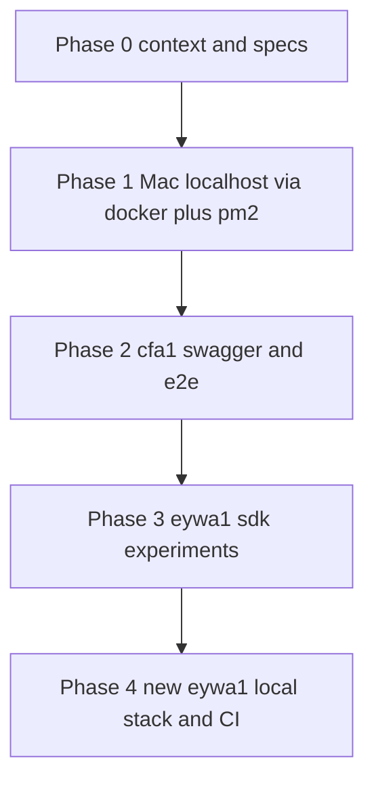

Начну с главного: я уже прогнал `file_search` по твоим логам, trees и контекстам, поэтому ниже — не фантазия, а выжимка из реально сделанных сессий (local-w5/w6, eywa1-w13/w16, c2p trees и memory-bank).

---

## 1. SESSION_EVAL

### 1.1. Где мы сейчас (по старому DoD)

**Фактическое состояние по логам:**

* **Локальный Mac (local-w5/w6)**

  * Стек `.docker-compose` для сервисов поднимается, health/Swagger 200 на `api-gateway` и core-сервисы, порты 55000/58080. 
  * Keycloak локально настроен, realm `ois`, пользователи `*@demo.local`, пароли `demo123`, клиенты portal-issuer / portal-investor / backoffice.
  * Фронты (issuer / investor / backoffice) успешно крутятся через **pm2** на 3001/3002/3003.
  * Часть Playwright e2e (issuer auth) зелёная, но не весь набор.

* **eywa1 (Ubuntu VPS, агент d792)**

  * Агент сидел в `ois-cfa` под юзером `user`, ветка `codex/fix-cfa1-regressions`/`develop`, но **докер-демон недоступен без прав** (`permission denied` к `/var/run/docker.sock`).
  * `make generate-sdks` падал: сначала из‑за отсутствия openapi-generator-cli/Java, потом — из‑за среды (Node 22) и контрактных ошибок (complaints/KycTask и т.д.).
  * Пытался решить через Docker‑образ openapi-generator, но тоже упёрся в права Docker. 
  * Основной фокус — Swagger на **cfa1** и Playwright против удалённого стенда, а не поднятие полного локального стека на самом eywa1.

* **NX‑05..08**

  * По твоему же запросу в логах: за 21–23 ноября на ветке `codex/fix-cfa1-regressions` были в основном Swagger/SDK/тестовая обвязка, а **новых бизнес‑методов KYC/issuer-dashboard** в сервисах фактически не подвезли. 

* **Структура репы и тестов**

  * Monorepo: `apps` (Next.js фронты, api-gateway), `services` (issuance/registry/settlement/compliance/identity), `packages` (contracts/domain/SDKs), `tests` (backend unit, e2e, e2e-playwright).
  * Playwright сейчас живёт в `tests/e2e-playwright/tests/*.spec.ts`, плюс есть старый `e2e/issuer`.

### 1.2. Оценка по старому контракту (NX‑05..08, cfa1)

Грубо, но честно:

* **completeness_score:** ~**35/100**

  * Локальная разработка на Mac — почти ок.
  * cfa1/Swagger/e2e — частично закрыто.
  * NX‑05..08 как фичи (backend + UI) — в основном не сделаны, только инфраструктура вокруг.

* **accuracy_score:** ~**70/100**

  * Агент в целом действовал по Spec‑first (OpenAPI/AsyncAPI), обновлял DoD/CHANGELOG, артефакты Playwright, фиксил Keycloak/Swagger.
  * Но локальный eywa1‑стек как «локалка» так и не был доведён до нормального состояния, много энергии ушло на обходы без фикса фундаментальных блокеров (docker‑права, Java/openapi-generator).

* **progress_pct по «глобальному маршруту» (локалка → e2e → CI):**

  * Локалка **на Mac:** ~80%
  * Локалка **на eywa1:** ~10–15% (почти нет работающего стека)
  * e2e (Playwright стабильно, локально+стенд): ~40%
  * CI/CD: ~10% (описано в docs/ops, но не доведено до живых пайплайнов).

### 1.3. Фазовый обзор



* До **Phase3** (eywa1) — дотянулись, но застряли на tooling (`docker`/Java) и не перевели eywa1 в полноценную «локалку».
* Сейчас твой новый запрос — это старт **Phase4**, но с другим приоритетом: **сначала localhost + make‑таргеты, потом CI, и только потом NX‑05..08**.

---

## 2. REQUIREMENTS_FROM_VOICE

Я собрал требования и из твоего голосового сообщения в чате, и из temp/memory‑bank, и из старых задач по localhost.

### 2.1. Явные требования

1. **Новый агент на eywa1**

   * Рабочая директория:
     `/home/user/__Repositories/yury-customer/prj_Cifra-rwa-exachange-assets/repositories/customer-gitlab/ois-cfa` (ветка `develop`).
   * Считать eywa1 **как локальную dev‑машину**, а не «прод‑сервер».

2. **Главная цель — `make up-local` на eywa1**

   * `make up-local` должен поднимать **весь стек**:

     * backend‑сервисы (через docker compose, как на Mac).
     * frontend‑порталы (issuer, investor, backoffice) **через Docker**, **без pm2** на eywa1.
   * Порты не должны конфликтовать с другими сервисами на VPS; если конфликт — агент:

     * проверяет (`ss -ltn` / `docker ps`),
     * меняет маппинг портов в compose/.env,
     * фиксирует итоговую карту портов в финальном отчёте.

3. **pm2‑usage nuance**

   * На Mac и у Ильи — pm2 watch‑mode норм.
   * На **eywa1**:

     * **не использовать pm2 для фронтов**,
     * если нужен «watch‑mode» для фронтов — сделать это через Docker (volume‑mount + `npm run dev` / `next dev`) или описать как отдельный dev‑режим в compose.

4. **Сделать рабочими ключевые `make`‑таргеты на eywa1:**

   Из memory‑bank и локальной сессии:

   * `make up-local` — поднят стек (backend+frontend) на eywa1.
   * `make seed`

     * под капотом: `docker-compose exec api-gateway dotnet run --project services/seed -- seed-db`.
     * «ничего не происходит» сейчас — потому что нет/долго стартует `api-gateway`.
   * `make validate-specs`

     * сейчас ломается на OpenAPI‑контракте: нет `KycTask`, дубли `/v1/complaints`, нет `ComplaintReplyRequest`/`ComplaintResolveRequest`.
   * `make generate-sdks`

     * зависит от исправленного OpenAPI и рабочего openapi-generator-cli/Java.
     * на eywa1 дополнительный блокер: нет sudo и нет доступа к docker‑daemon для Docker‑варианта.
   * `make e2e`

     * должен запускать Playwright (и, возможно, ещё что‑то) против **локального** стека, а не cfa1.
     * сейчас ломается из‑за env/зависимостей и раздвоенной структуры тестов (`tests/e2e`, `tests/e2e-playwright`, `e2e/issuer`).

5. **Рефакторинг e2e‑тестов**

   * Убрать «хаос из трёх папок» и прийти к логике:

     * unit/integration рядом с кодом (как сейчас),
     * e2e/Playwright — завязаны на конкретные **apps/**, а не на общий `tests/`.
   * Не обязательно закончить полный перенос в `apps/**/tests/*` в этой итерации, но:

     * хотя бы зафиксировать целевую структуру,
     * убедиться, что `make e2e` запускает осмысленный набор (issuer/backoffice/investor journeys).

6. **Приоритеты по дорожной карте**

   * Сейчас **нет смысла зарываться в NX‑05..08**.
   * Новый порядок:

     1. Локальный стек (localhost) на Mac и eywa1 → единая модель.
     2. CI (GitLab pipelines) на базе `make up-local`, `make validate-specs`, `make generate-sdks`, `make e2e`.
     3. Потом — БД/миграции/дизайн и фичи NX‑05..08.

### 2.2. Неявные требования / ожидания

* **Spec‑first, без «кринжа»** — OpenAPI/AsyncAPI остаются источником правды; любые исправления контрактов для validate-specs/generate-sdks должны быть аккуратны и задокументированы, без тихого изменения семантики.
* **Единый командный интерфейс**

  * Dev‑стек должен подниматься одним‑двумя make‑командами, чтобы потом их переиспользовать в CI.
* **Жёсткие agent‑правила**

  * Не задавать бесконечные уточнения, работать по JTBD/DoD, вести план и self‑check (как в твоих правилах AGENT_WORKFLOW_CONTRACT и FINAL SELF-CHECK).

### 2.3. Коррекции

* Предыдущее ожидание, что «агент за 21–23 ноября сделал backend по NX‑05..08», **не совпадает с реальностью**: он делал Swagger/SDK/Playwright, а не бизнес‑методы. 
* Локалка на eywa1 на самом деле **не была** доведена до состояния `make up-local → всё работает`; это было только на Mac.

### 2.4. Предложения (из твоего голоса)

* Выровнять всё под **одну цепочку**:
  **`make up-local` → `make validate-specs` → `make generate-sdks` → `make seed` → `make e2e` → затем CI**.
* E2E/Playwright привести к per‑app структуре и завязать на реальные journeys (issuer, investor, backoffice), а не на абстрактный набор.

---

## 3. UPDATED_JTBD_CONTRACT

### 3.1. Jobs (обновлённые, без NX‑05..08)

**J1: Eywa1 локальный стек (`make up-local`)**

* **Цель:**
  На eywa1 `make up-local` поднимает:

  * все необходимые backend‑контейнеры (api-gateway, identity, issuance, registry, settlement, compliance, keycloak, postgres, kafka/minio/redis по минимуму),
  * frontend‑порталы через Docker (без pm2. pm2 допустим только на Mac).
* **DoD J1:**

  * [ ] `make up-local` отрабатывает **без ошибок**.
  * [ ] `docker ps` на eywa1 показывает api-gateway и core‑сервисы в состоянии `Up`.
  * [ ] `curl -i -w "\nHTTP:%{http_code}\n" http://localhost:5000/health` → `HTTP:200`.
  * [ ] Swagger открывается локально хотя бы на gateway и identity плюс 1–2 core‑сервисах (или честно задокументирован блокер).
  * [ ] issuer/investor/backoffice доступны с eywa1 (и по внешнему IP, если порты проброшены) на финальных портах; карта портов зафиксирована в отчёте.

---

**J2: Контракты и SDK (`make validate-specs` + `make generate-sdks`)**

* **Цель:**
  Исправить ошибки OpenAPI так, чтобы:

  * `make validate-specs` проходил,
  * `make generate-sdks` успешно генерил TypeScript SDK на eywa1 **без sudo и без доступа к docker‑daemon**.
* **DoD J2:**

  * [ ] `make validate-specs` → exit code 0, без ошибок о `KycTask`, complaints и пропавших схемах.
  * [ ] `make generate-sdks` → exit code 0; SDK‑папки обновлены, no untracked garbage. 
  * [ ] На eywa1 `java -version` работает из user‑level JDK (без sudo) ИЛИ используется другой поддерживаемый способ (например, глобальный npm CLI без java, если это реально). 
  * [ ] В tasks/`NX-01`/`NX-02` (или отдельном doc) есть краткое описание: какие ошибки были, как исправили, какие команды теперь эталонны.

---

**J3: Локальные e2e + рефакторинг структуры**

* **Цель:**
  Превратить `make e2e` на eywa1 в осмысленный запуск Playwright против **локального стека**, с зачатком нормальной структуры тестов.
* **DoD J3:**

  * [ ] В корне репы `make e2e` успешно прогоняет хотя бы минимальный набор:

    * swagger‑availability swagger-all-services,
    * issuer dashboard/reports,
    * backoffice KYC (или аналог).
  * [ ] Playwright browsers установлены на eywa1, лог установки зафиксирован.
  * [ ] Тесты не завязаны на cfa1 по умолчанию, а используют локальные BASE_URL (либо через env, либо конфиги).
  * [ ] Зафиксирован таргетная структура e2e (например, `apps/<app>/tests/e2e-playwright` планом или частичным переносом) с указанием «что сейчас, что потом».

---

**J4: Подготовка к CI (пока только дизайн)**

* **Цель:**
  Запроектировать GitLab pipelines, которые повторяют локальный цикл:

  * `make validate-specs` → `make generate-sdks` → `make up-local` (минимальный health) → `make e2e`.
* **DoD J4 (минимальный для этой итерации):**

  * [ ] Описан .gitlab-ci.yml скелет (jobs, stages, нужные образы/предварительные шаги).
  * [ ] Зафиксированы блокеры (например, Playwright в CI, docker-in-docker, миграции БД).

---

### 3.2. Конфликт с прежними NX‑05..08 JTBD

**Старое:** «Агент, сиди в `codex/fix-cfa1-regressions` и закрывай NX‑05..08 (issuer dashboard, payout schedule, KYC, audit) на cfa1.»

**Новое:** «NX‑05..08 пока не трогаем; сначала localhost (Mac + eywa1), затем CI, потом вернёмся к БД и NX‑эпикам.»

**Разруливание:**

* На время **замораживаем NX‑05..08 как активный JTBD**.
* Агент на eywa1:

  * может **читать** tasks/NX‑05..08 как контекст,
  * но **не должен** вносить туда изменения, кроме возможного «Blocked by env/CI not ready» в DoD (по согласованию, либо вообще не трогать сейчас).

---

## 4. AGENT_PROMPT (for Codex-Cli на eywa1)

Ниже — текст, который можно **прямо копипастить** в codex‑cli для удалённого агента на eywa1.

---

### <<<готовый текст для копипаста в агента>>>

You are **GPT‑5.1 Codex** running on host **eywa1** (Ubuntu, 8 GB RAM) as user `user`.
This host is treated as a **local developer machine**, not a production server.

Repo root on this host:

```bash
cd /home/user/__Repositories/yury-customer/prj_Cifra-rwa-exachange-assets/repositories/customer-gitlab/ois-cfa
```

Relevant structure: monorepo with `apps/` (api-gateway, portals), `services/` (.NET), `packages/` (contracts, SDKs), `tests/` (backend tests, Playwright), `docker-compose*.yml`, and a top-level `Makefile`.

---

#### 0. Global rules

* **Autonomy level:** 3
  Work in short loops without asking the user, unless you hit a **hard blocker** (no creds, no docker access, no sudo).

* **Workflow loop (must obey):**

  > `{code-change} → {tests} → {docs/DoD-update} → {commit}`

* **Every meaningful change =**

  * Code updated (backend / frontend / configs / Makefile).
  * Tests updated/added (unit/integration/e2e where relevant).
  * Docs updated (memory-bank Scrums, tasks if in scope).
  * One focused commit bundling all of the above.

* **Spec-first:** OpenAPI/AsyncAPI in `packages/contracts/**` are canonical. Fix contracts to make `make validate-specs` and `make generate-sdks` pass, but do not silently change semantics. If you must make non-trivial changes, add a short SPEC DIFF note.

* **No pm2 on eywa1:**

  * Do **not** use pm2 to run frontends here.
  * Frontends must run **via Docker** (compose) on eywa1. pm2 is allowed only on the Mac workspace (already configured).

* **Hard constraints on this host:**

  * You likely have **no sudo** (`sudo -n true` fails).
  * Access to `docker.sock` may be restricted; you must check and treat it as a blocker if you cannot fix it as user.

---

#### 1. Jobs (JTBD) for this session

Focus only on **environment and tests**, not on implementing NX‑05..08 business features.

**J1: Make `make up-local` on eywa1 bring up the full local stack via Docker.**

* Target state:

  * `make up-local` starts:

    * backend services (api-gateway, identity, issuance, registry, settlement, compliance, keycloak, postgres, supporting infra like kafka/minio/redis if needed),
    * frontend portals (issuer, investor, backoffice) via Docker.
  * No pm2 is used for frontends on eywa1.
  * Ports do not clash with other processes; if they do, adjust mapping and document the final map.

**J2: Make `make validate-specs` and `make generate-sdks` pass on eywa1.**

* Target state:

  * OpenAPI errors around `KycTask`, `/v1/complaints`, `ComplaintReplyRequest`, `ComplaintResolveRequest` are fixed.
  * `make validate-specs` exits with 0.
  * `make generate-sdks` completes successfully using a user-level Java or another supported approach (no sudo, no docker daemon access).

**J3: Make `make e2e` run meaningful Playwright e2e against the *local* stack and start cleaning e2e structure.**

* Target state:

  * Playwright browsers installed on eywa1. 
  * `make e2e` runs Playwright (and any other configured tests) against localhost, not cfa1.
  * At least:

    * swagger-availability / swagger-all-services,
    * issuer dashboard/reports,
    * backoffice KYC
      are green or have clearly documented blockers.
  * There is a clear note about the desired future structure (e.g. per app under `apps/**/tests/e2e-playwright`).

---

#### 2. Plan by phases

Keep a **visible plan** in Codex (Plan section) and update it after each loop.

##### Phase 0 – Identify yourself and sync

1. Run `/status` in Codex, note your `agentID` and derive `partAgentID` from the last 4 chars.

2. From repo root:

   ```bash
   cd /home/user/__Repositories/yury-customer/prj_Cifra-rwa-exachange-assets/repositories/customer-gitlab/ois-cfa
   git fetch origin
   git checkout develop
   git pull --ff-only
   git status -sb
   ```

3. Ensure working tree is clean or that you fully understand existing changes.

4. Quickly inspect:

   * `Makefile` (targets: `up-local`, `seed`, `validate-specs`, `generate-sdks`, `e2e`).
   * `docker-compose.yml`, `docker-compose.services.yml`, `docker-compose.apps.yml`, `.env`.
   * `tests/e2e-playwright`, `tests/e2e`, `e2e/issuer` to understand the current e2e mess.

Document any obvious conflicts between Mac setup and eywa1 (ports, env, missing services).

---

##### Phase 1 – J1: `make up-local` on eywa1 via Docker

**Loop 1: Can you talk to Docker?**

1. From repo root:

   ```bash
   docker ps
   docker compose version || docker-compose version
   ```

2. If you get `permission denied` to `/var/run/docker.sock`:

   * Treat this as a **hard blocker**.
   * Document:

     * exact error,
     * required fix (adding user to `docker` group or configuring root-level Docker),
     * that you cannot fix it without sudo.
   * You may still proceed to Phase 2 and 3 in a **“dry-run”** mode (inspecting Makefile, specs, tests) but clearly mark J1 as blocked.

3. If Docker is usable:

   * Inspect services list and existing compose config:

     ```bash
     ls docker-compose*.yml
     docker compose config --services
     ```

   * Verify which services correspond to:

     * api-gateway,
     * identity-service, issuance-service, registry-service, settlement-service, compliance-service, keycloak, postgres, kafka, minio, redis.

**Loop 2: Wire `make up-local` to docker compose**

1. Read `Makefile` target `up-local` and its dependencies. If it does not exist, design it to call the appropriate set of `docker compose up -d` commands without rebuilding images unless necessary.

2. Make sure:

   * backend services use `ASPNETCORE_ENVIRONMENT=Development` plus `Swagger__Enabled=true` if needed (or equivalent).
   * optional services like `bank-nominal` are either excluded or do not block the compose run (consider `--no-deps` if necessary, but prefer using existing patterns from local Mac session).

3. For frontends:

   * Use `docker-compose.apps.yml` (or similar) to define dev containers for portal-issuer, portal-investor, backoffice.
   * They should run something like `npm run dev` / `next dev` inside containers with volume mounts of `apps/<app>` and env wired from `.env`. Do not copy full configs, but reuse existing `Dockerfile`s and patterns.
   * Make sure there is **no pm2** in these flows.

4. Run:

   ```bash
   make up-local
   ```

   * If it fails, capture logs:

     * `docker compose ps`
     * `docker compose logs api-gateway` and the failing services.

**Loop 3: Verify health and ports**

1. After successful `make up-local`:

   ```bash
   docker ps --format 'table {{.Names}}\t{{.Status}}\t{{.Ports}}'
   curl -i -w "\nHTTP:%{http_code}\n" http://localhost:5000/health
   ```

2. Check Swagger endpoints:

   ```bash
   curl -sk -o /tmp/swagger.html -w "HTTP:%{http_code}\n" http://localhost:5000/swagger/index.html
   # and optionally for identity/service-specific swagger urls
   ```

3. If ports (5000, 55000, 58080, 3001–3003) are occupied by other apps:

   * Use `ss -ltn` to detect conflicts.
   * Adjust port mappings in `.env` / compose files (e.g. map api-gateway to 55000 instead of 5000) and re-run `make up-local`.
   * Record final mapping in a short host-specific doc section.

When J1 is reasonably stable, mark its DoD checkboxes and move on.

---

##### Phase 2 – J2: Contracts and SDKs

**Loop 1: Understand current failures**

1. Run:

   ```bash
   make validate-specs
   ```

2. Capture exact errors (OpenAPI schema issues we already saw: missing `KycTask`, duplicate `/v1/complaints` paths, missing `ComplaintReplyRequest` and `ComplaintResolveRequest`).

3. Run:

   ```bash
   make generate-sdks
   ```

   and capture the error message (Node version issues, Java missing, etc).

**Loop 2: Fix OpenAPI contracts**

1. Edit `packages/contracts/openapi-gateway.yaml` minimally to:

   * add missing schema definitions (`KycTask`, `ComplaintReplyRequest`, `ComplaintResolveRequest`) based on existing backend/domain models,
   * remove or resolve duplicated `/v1/complaints` paths.

2. Re-run:

   ```bash
   make validate-specs
   ```

   until it exits with 0.

3. Briefly document what changed and why (in a contracts note or SPEC DIFF), referencing the initial spectral errors.

**Loop 3: Make `generate-sdks` work on eywa1 without sudo**

1. Ensure you have user-level Java:

   ```bash
   ls -R /home/user/.local/java
   /home/user/.local/java/*/bin/java -version || true
   ```

   If necessary, adjust `PATH` or `JAVA_HOME` in your shell for the duration of `make generate-sdks`. 

2. If `@openapitools/openapi-generator-cli` is used via npm:

   * Ensure it finds `java` in PATH.
   * Run `make generate-sdks` again.

3. Do **not** attempt to fix this via Docker if `docker run` is blocked by `permission denied` to `docker.sock` — document that as a blocker and stick to the Java CLI path.

4. Once `make generate-sdks` succeeds:

   * check `git status` for SDK files only,
   * add/update them and commit together with any contract changes and a short note in docs.

---

##### Phase 3 – J3: Local e2e via `make e2e` and test refactor

**Loop 1: Inspect current e2e setup**

1. From repo root:

   ```bash
   tree tests/e2e
   tree tests/e2e-playwright/tests
   tree e2e/issuer || true
   cat playwright.config.ts
   ```

   Note the existing specs like `issuer-reports.spec.ts`, `backoffice-kyc.spec.ts`, `swagger-all-services.spec.ts` etc.

2. Identify which specs are currently wired to cfa1 URLs versus localhost.

**Loop 2: Make Playwright usable on eywa1**

1. Ensure browsers are installed (if not yet done here):

   ```bash
   npx playwright install
   # or npx playwright install chromium
   ```

2. Run a **single** spec against localhost to confirm everything is wired:

   ```bash
   cd tests/e2e-playwright
   API_BASE_URL=http://localhost:5000 npx playwright test tests/swagger-availability.spec.ts --workers=1
   ```

   Adjust `API_BASE_URL` and auth env vars if needed.

**Loop 3: Align `make e2e`**

1. Inspect `Makefile` target `e2e` (and any `tests/e2e` scripts).

2. Ensure `make e2e`:

   * runs from repo root,
   * calls Playwright with:

     * explicit BASE_URL pointing to local api-gateway / portals,
     * appropriate credentials (from local Keycloak seeds, not cfa1).

3. Start from a minimal subset:

   * swagger-availability / swagger-all-services,
   * issuer-reports,
   * backoffice-kyc.

4. Once these are stable:

   * capture traces/screenshots to `tests/e2e-playwright/test-results` or `artifacts/tests/e2e/playwright`,
   * update at least one doc (e.g. `artifacts/tests/e2e/README` or memory-bank) with commands and URLs.

**Loop 4: Design target e2e layout**

You do **not** have to fully move tests now, but you must:

1. Propose a target structure, e.g.:

   * `apps/portal-issuer/tests/e2e-playwright/...`
   * `apps/portal-investor/tests/e2e-playwright/...`
   * `apps/backoffice/tests/e2e-playwright/...`

2. Optionally:

   * move 1–2 issuer/backoffice specs into the new layout as a proof-of-concept,
   * adjust Playwright config to allow per-app projects referencing those paths.

3. Document this plan in a short section in `docs/frontend` or a new `tests/e2e-structure.md`.

---

#### 3. Git and commits

For each completed loop:

1. Bundle changes into a commit with:

   ```text
   {code-change} + {code-test} + {test-artifacts/output} + {docs/DoD-update}
   ```

2. Use clear messages like:

   * `chore(localhost): make up-local work on eywa1`
   * `fix(specs): unblock validate-specs and generate-sdks on eywa1`
   * `test(e2e): run playwright against eywa1 localhost`

---

#### 4. FINAL SELF-CHECK before ending the session

Before you produce the final response:

```markdown
FINAL SELF-CHECK

- [ ] QA: все изменения покрыты тестами (unit/integration/smoke/e2e/Playwright, если применимо)
- [ ] Тесты прогнаны на реальных/приближенных к реальным данных (eywa1 localhost, а не только cfa1)
- [ ] Падения/регрессии явно зафиксированы, нет «тихого» фоллбэка
- [ ] Честно описаны блокеры ("невозможно реализовать, потому что …", особенно docker.sock/sudo)
- [ ] Git: сделан(ы) осмысленный(е) commit(ы) формата:
      {code-change} + {code-test} + {test-artifacts/output} + {update-docs-DoD-Kickoff-checkboxes}
```

You are **not allowed** to consider the work done until this checklist is satisfied or a hard blocker is clearly documented.

### <<<конец промпта для агента>>>

---

## 5. NEXT_STEPS_FOR_HUMAN

Что тебе как оркестратору сделать до/после запуска агента.

### 5.1. Перед запуском агента на eywa1

* [ ] **Проверить docker‑доступ руками** от имени `user` на eywa1:

  ```bash
  ssh user@eywa1
  docker ps
  ```

  * Если снова `permission denied` к `docker.sock` — нужно один раз руками добавить `user` в группу `docker` (или аналог) под root. Иначе J1/J2 будут заблокированы ещё до старта.

* [ ] Убедиться, что репа на eywa1 в адекватном состоянии:

  ```bash
  cd /home/user/__Repositories/yury-customer/prj_Cifra-rwa-exachange-assets/repositories/customer-gitlab/ois-cfa
  git status -sb
  ```

* [ ] Вставить блок **AGENT_PROMPT** из этого ответа в codex-cli сессию `codex-cli__eywa1-…` и запустить.

### 5.2. После того как агент отработает

* [ ] Проверить, что на eywa1 реально работает:

  ```bash
  make up-local
  curl -i -w "\nHTTP:%{http_code}\n" http://localhost:5000/health
  make validate-specs
  make generate-sdks
  make e2e
  ```

* [ ] Просмотреть git‑коммиты агента:

  * что он сделал с `Makefile`, `docker-compose*.yml`,
  * какие правки в OpenAPI,
  * какие e2e‑спеки он трогал.

* [ ] Сверить, что в его финальном отчёте честно описаны:

  * блокеры (если остались),
  * действующие команды,
  * порты,
  * что именно запускать в CI.

* [ ] Уже после этого можно будет просить следующего агента:

  * упаковать CI `gitlab-ci.yml` на базе реально работающих команд,
  * вернуться к NX‑05..08 и БД‑части.

---

Если хочешь, следующим шагом могу сделать отдельный **CI‑ориентированный AGENT_PROMPT**, когда убедимся, что `make up-local`/`seed`/`validate-specs`/`generate-sdks`/`e2e` действительно зелёные на eywa1.
