## 1. Большая карта: epics × акторы × сервисы

Это «единый трейд‑эпик»: от выпуска эмитентом до выплат и погашения, с привязкой к epics и сервисам.

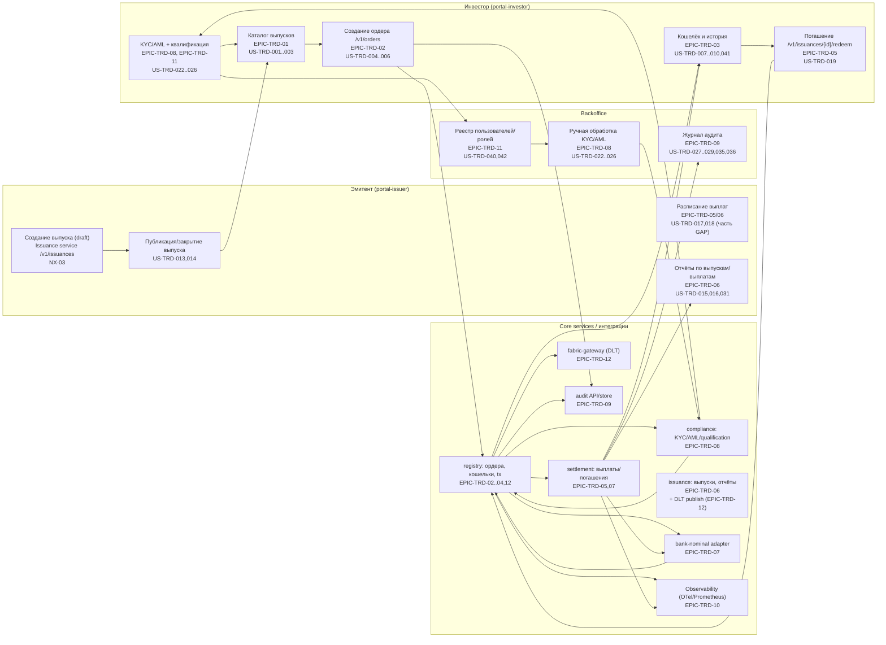
```mermaid
flowchart LR
    %% Роли/кабинеты

    subgraph Investor["Инвестор (portal-investor)"]
      I_KYC["KYC/AML + квалификация\nEPIC-TRD-08, EPIC-TRD-11\nUS-TRD-022..026"]
      I_Catalog["Каталог выпусков\nEPIC-TRD-01\nUS-TRD-001..003"]
      I_Order["Создание ордера /v1/orders\nEPIC-TRD-02\nUS-TRD-004..006"]
      I_Wallet["Кошелёк и история\nEPIC-TRD-03\nUS-TRD-007..010,041"]
      I_Redeem["Погашение /v1/issuances/{id}/redeem\nEPIC-TRD-05\nUS-TRD-019"]
    end

    subgraph Issuer["Эмитент (portal-issuer)"]
      E_Create["Создание выпуска (draft)\nIssuance service /v1/issuances\nNX-03"]
      E_Publish["Публикация/закрытие выпуска\nUS-TRD-013,014"]
      E_Payout["Расписание выплат\nEPIC-TRD-05/06\nUS-TRD-017,018 (часть GAP)"]
      E_Reports["Отчёты по выпускам/выплатам\nEPIC-TRD-06\nUS-TRD-015,016,031"]
    end

    subgraph Backoffice["Backoffice"]
      B_UserReg["Реестр пользователей/ролей\nEPIC-TRD-11\nUS-TRD-040,042"]
      B_KYC["Ручная обработка KYC/AML\nEPIC-TRD-08\nUS-TRD-022..026"]
      B_Audit["Журнал аудита\nEPIC-TRD-09\nUS-TRD-027..029,035,036"]
    end

    subgraph CoreServices["Core services / интеграции"]
      S_Compliance["compliance: KYC/AML/qualification\nEPIC-TRD-08"]
      S_Issuance["issuance: выпуски, отчёты\nEPIC-TRD-06\n+ DLT publish (EPIC-TRD-12)"]
      S_Registry["registry: ордера, кошельки, tx\nEPIC-TRD-02..04,12"]
      S_Settlement["settlement: выплаты/погашения\nEPIC-TRD-05,07"]
      S_Bank["bank-nominal adapter\nEPIC-TRD-07"]
      S_Fabric["fabric-gateway (DLT)\nEPIC-TRD-12"]
      S_Audit["audit API/store\nEPIC-TRD-09"]
      S_Observ["Observability (OTel/Prometheus)\nEPIC-TRD-10"]
    end

    %% Основной торговый путь

    E_Create --> E_Publish
    E_Publish --> I_Catalog

    I_KYC --> I_Catalog
    I_Catalog --> I_Order
    I_Order --> S_Registry

    S_Registry --> S_Compliance
    S_Compliance --> S_Registry

    S_Registry --> S_Bank
    S_Bank --> S_Registry

    S_Registry --> S_Fabric
    S_Registry --> I_Wallet

    I_Wallet --> I_Redeem
    I_Redeem --> S_Registry

    S_Registry --> S_Settlement
    S_Settlement --> S_Bank
    S_Settlement --> I_Wallet
    S_Settlement --> E_Reports
    S_Settlement --> B_Audit

    %% Backoffice KYC цикл

    I_KYC --> B_UserReg
    B_UserReg --> B_KYC
    B_KYC --> S_Compliance
    S_Compliance --> I_KYC

    %% Аудит и наблюдаемость

    I_Order --> S_Audit
    S_Registry --> S_Audit
    S_Registry --> S_Observ
    S_Settlement --> S_Observ
```

Как читать:

- Стрелка слева направо — бизнес‑поток. Пример: эмитент создаёт выпуск → публикует → он попадает в каталог инвестора (EPIC‑TRD‑06 → EPIC‑TRD‑01). 📎filecite📎turn2file18📎turn2file14📎
- Инвестор: KYC/квалификация → каталог → ордер → обновлённый кошелёк/история → погашение и выплаты (EPIC‑TRD‑01..03,05,08). 📎filecite📎turn2file18📎turn2file0📎turn2file12📎turn2file14📎turn3file18📎
- Бэк‑офис: реестр пользователей/ролей + ручная модерация KYC + аудит, который питается событиями из compliance/registry/settlement. 📎filecite📎turn3file18📎turn1file19📎
- Core‑сервисы: registry замыкает ордера/кошельки/tx; bank‑adapter делает `/nominal/transfer`; fabric‑gateway даёт `txHash` в DLT (EPIC‑TRD‑02,07,12). 📎filecite📎turn2file0📎turn1file2📎turn3file10📎turn2file6📎turn2file8📎

Это и есть твой «огромный Mermaid user journey» на уровне системы/epics.

---

## 2. User‑journey инвестора (по людям, а не по микросервисам)

Здесь — чисто взгляд инвестора, без внутренних сервисов, но с привязкой к epics.

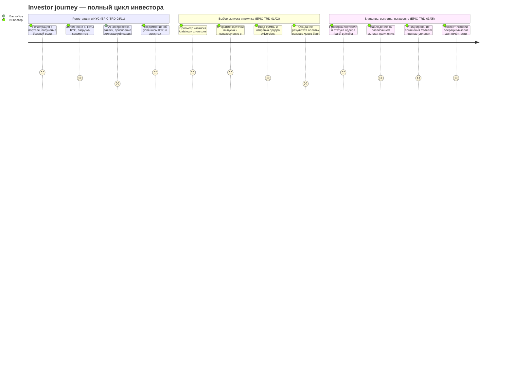
```mermaid
journey
    title Investor journey — полный цикл инвестора
    section Регистрация и KYC (EPIC-TRD-08/11)
      Регистрация в портале, получение базовой роли: 3:Инвестор
      Заполнение анкеты KYC, загрузка документов: 2:Инвестор
      Ручная проверка заявки, присвоение роли/квалификации: 1:Backoffice
      Уведомление об успешном KYC и лимитах: 3:Инвестор

    section Выбор выпуска и покупка (EPIC-TRD-01/02)
      Просмотр каталога /catalog и фильтров: 3:Инвестор
      Открытие карточки выпуска и ознакомление с условиями: 3:Инвестор
      Ввод суммы и отправка ордера /v1/orders: 2:Инвестор
      Ожидание результата оплаты/резерва через банк: 1:Инвестор

    section Владение, выплаты, погашение (EPIC-TRD-03/05)
      Проверка портфеля и статуса ордера (paid) в /wallet: 3:Инвестор
      Наблюдение за расписанием выплат, получение купонов: 2:Инвестор
      Инициирование погашения /redeem при наступлении срока: 2:Инвестор
      Экспорт истории операций/выплат для отчётности: 2:Инвестор
```

Это удобно показывать стейкхолдерам/лицензиару как минимальный, но полный путь инвестора, не погружая их в REST/AsyncAPI.

---

## 3. KYC/AML + квалификация: отдельный sequence‑flow

Здесь видно, что KYC — не просто «галочка в форме», а отдельный поток между порталом, compliance и backoffice (EPIC‑TRD‑08).

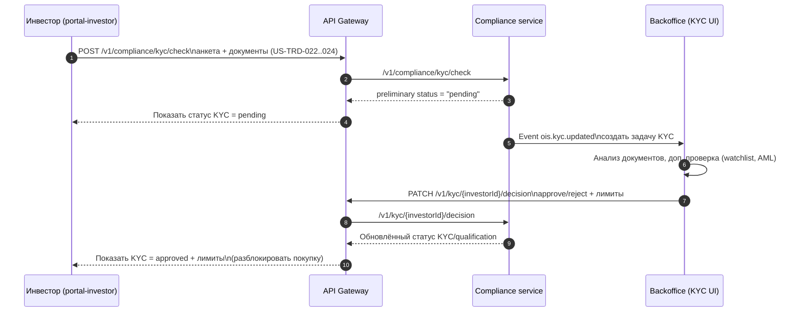
```mermaid
sequenceDiagram
    autonumber
    participant Inv as Инвестор (portal-investor)
    participant GW as API Gateway
    participant Comp as Compliance service
    participant BO as Backoffice (KYC UI)

    Inv->>GW: POST /v1/compliance/kyc/check\nанкета + документы (US-TRD-022..024)
    GW->>Comp: /v1/compliance/kyc/check
    Comp-->>GW: preliminary status = "pending"
    GW-->>Inv: Показать статус KYC = pending

    Comp->>BO: Event ois.kyc.updated\nсоздать задачу KYC
    BO->>BO: Анализ документов, доп. проверка (watchlist, AML)
    BO->>GW: PATCH /v1/kyc/{investorId}/decision\napprove/reject + лимиты
    GW->>Comp: /v1/kyc/{investorId}/decision
    Comp-->>GW: Обновлённый статус KYC/qualification
    GW-->>Inv: Показать KYC = approved + лимиты\n(разблокировать покупку)
```

Ключевые моменты:

- Бизнес‑инвариант: без `KYC=approved` и валидной квалификации инвестора EPIC‑TRD‑02 «Покупка ЦФА» не должен идти в оплату (registry обязан дергать compliance перед резервом/оплатой). 📎filecite📎turn2file0📎turn2file11📎turn3file18📎
- Здесь же можно прикрутить аудит (EPIC‑TRD‑09) — каждое решение и загрузка документа должен логироваться в `ois.audit.logged` + `/v1/audit`. 📎filecite📎turn1file19📎turn1file15📎

---

## 4. Покупка: order → банк → реестр → DLT → settlement

Теперь «мясо» trade‑эпика: как выглядит минимальный happy‑path от отправки ордера до владения и будущих выплат. Это клеится из EPIC‑TRD‑02, EPIC‑TRD‑07, EPIC‑TRD‑12 и части EPIC‑TRD‑05.

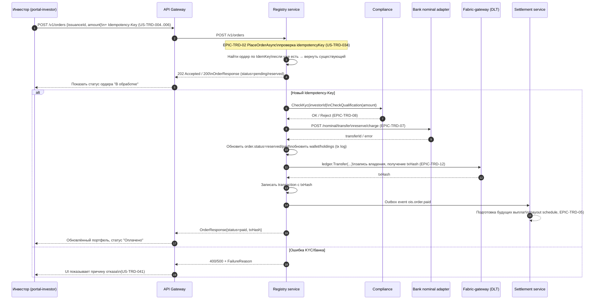
```mermaid
sequenceDiagram
    autonumber
    participant Inv as Инвестор (portal-investor)
    participant GW as API Gateway
    participant Reg as Registry service
    participant Comp as Compliance
    participant Bank as Bank nominal adapter
    participant Fabric as Fabric-gateway (DLT)
    participant Settle as Settlement service

    Inv->>GW: POST /v1/orders {issuanceId, amount}\n+ Idempotency-Key (US-TRD-004..006)
    GW->>Reg: POST /v1/orders

    note over Reg: EPIC-TRD-02 PlaceOrderAsync\nпроверка idempotencyKey (US-TRD-034)
    Reg->>Reg: Найти ордер по IdemKey\nесли уже есть → вернуть существующий
    Reg-->>GW: 202 Accepted / 200\nOrderResponse (status=pending/reserved)
    GW-->>Inv: Показать статус ордера "В обработке"

    alt Новый Idempotency-Key
        Reg->>Comp: CheckKyc(investorId)\nCheckQualification(amount)
        Comp-->>Reg: OK / Reject (EPIC-TRD-08)

        Reg->>Bank: POST /nominal/transfer\nreserve/charge (EPIC-TRD-07)
        Bank-->>Reg: transferId / error

        Reg->>Reg: Обновить order.status=reserved/paid\nобновить wallet/holdings (tx log)
        Reg->>Fabric: ledger.Transfer(...)\nзапись владения, получение txHash (EPIC-TRD-12)
        Fabric-->>Reg: txHash
        Reg->>Reg: Записать transaction с txHash

        Reg->>Settle: Outbox event ois.order.paid
        Settle-->>Settle: Подготовка будущих выплат\n(payout schedule, EPIC-TRD-05)

        Reg-->>GW: OrderResponse{status=paid, txHash}
        GW-->>Inv: Обновлённый портфель, статус "Оплачено"
    else Ошибка KYC/банка
        Reg-->>GW: 400/500 + FailureReason
        GW-->>Inv: UI показывает причину отказа\n(US-TRD-041)
    end
```

Здесь уже чётко видно для аудитора:

- Где проверяются KYC/лимиты.
- Где фактически списываются/резервируются фиат‑средства (через `/nominal/transfer` банка). 📎filecite📎turn1file2📎turn3file18📎
- Где фиксируется владение в реестре и DLT (`txHash`), и как это завязано на EPIC‑TRD‑12. 📎filecite📎turn3file10📎turn2file8📎
- Откуда возьмутся данные для истории инвестора и отчётов эмитента/бэк‑офиса (tx‑лог и события `ois.order.*`, `ois.registry.transferred`, `ois.payout.*`). 📎filecite📎turn2file12📎turn2file2📎turn2file15📎turn1file3📎

---

## Что дальше можно будет нарастить

Когда ты посмотришь эти диаграммы и скажешь «да, это примерно то, что мы реально хотим показать на лицензии», следующим шагом логично будет:

- Разрезать по epics:
  - Отдельный маленький Mermaid для EPIC‑TRD‑05 (redeem + settlement run + payouts). 📎filecite📎turn2file14📎turn1file6📎
  - Отдельный для EPIC‑TRD‑06 (кабинет эмитента `/dashboard` и `/reports`). 📎filecite📎turn2file4📎turn2file16📎
  - Отдельный для EPIC‑TRD‑09/10 (audit + observability сквозной трейс от фронта до settlement). 📎filecite📎turn1file19📎turn1file15📎turn1file10📎

- И подвязать к каждому узлу конкретные файлы: story/epic, OpenAPI/AsyncAPI, кусок кода (`RegistryService`, `IssuanceService`, `Settlement` и т.д.).

Но уже сейчас у тебя есть:

1. Один большой трейд‑джорни‑граф (по ролям и сервисам).
2. Чисто пользовательский путь инвестора.
3. KYC‑цепочка.
4. Цепочка покупки с банком и DLT.

Можешь прямо копипастить эти блоки в свой `.md`/Notion/Confluence и дальше будем от них плясать.

You:
Смотри мы провели звонок и по сути тебе необходимо сейчас из файла backlog.txt еще раз внимательно прочесть 12 Epics + 43 User Stories, и простым нетехническим а понятным бизнесу языком сделать  user journey mermaidjs визуализации столько штук сколько нужно чтобы презентовать на звонке они должны быть четки и прозрачными понятными чтобы утвердить vision, все очень подробно о моей цели есть на нашем звонке между мной (Alex) + AleksandrO + Ilya

ChatGPT:
Смотри, я внимательно прошёлся по `c2p_backlog.txt` (12 epics + 43 stories) и по созвону `20251126-1300-tech-sync-AleksandrO-Ilya-Alex.md`.📎filecite📎turn5file15📎turn4file4📎turn5file0📎turn4file12📎turn4file6📎turn3file11📎turn6file18📎turn5file17📎turn4file15📎turn4file13📎turn6file13📎turn3file6📎turn7file3📎turn7file6📎\
Ниже — набор Mermaid‑диаграмм, которые можно сразу показать на звонке как бизнес‑vision. Я специально:

- не лезу в эндпоинты и схемы;
- связываю все 12 эпиков в несколько простых user journey;
- отделяю первичный рынок / покупку (то, о чём вы договорились сейчас) от вторичного рынка (как «следующий шаг»).📎filecite📎turn7file6📎

---

## 1. Общий бизнес‑journey: от онбординга до погашения

Этот график — «картинка для Юры»: показывает, что лицензируемый флоу полный — KYC, выпуск, покупка, владение, выплаты, погашение, аудит.

```mermaid
journey
  title Полный путь: Эмитент, Инвестор, Бэк-офис

  section Подключение эмитента
    Эмитент оставляет заявку и передаёт документы: 4: Эмитент
    Бэк-офис проводит KYC/AML эмитента и проверку компании: 3: Бэк-офис
    Эмитент получает доступ в портал эмитента: 5: Эмитент

  section Онбординг инвестора
    Инвестор регистрируется на платформе и подтверждает контакты: 5: Инвестор
    Инвестор заполняет KYC-анкету и загружает документы: 4: Инвестор
    Бэк-офис проверяет KYC/квалификацию и выносит решение: 3: Бэк-офис
    Инвестор видит статус «допущен/ограничен» к операциям: 4: Инвестор

  section Публикация выпуска
    Эмитент создаёт выпуск ЦФА и прикладывает юрдокументы: 4: Эмитент
    Бэк-офис и комплаенс согласуют выпуск (структура, лимиты, риски): 3: Бэк-офис
    Выпуск публикуется и попадает в каталог: 5: Система

  section Выбор и покупка
    Инвестор открывает каталог, фильтрует и выбирает выпуск: 5: Инвестор
    Инвестор читает условия выпуска в карточке и принимает решение: 5: Инвестор
    Инвестор вводит сумму и создаёт заявку на покупку: 5: Инвестор
    Платформа проверяет лимиты и статус KYC/квалификации: 3: Система
    Платформа инициирует списание/блокировку денег в банке: 3: Система
    Банк подтверждает успешное списание: 3: Банк
    Реестр и DLT фиксируют права инвестора по выпуску: 3: Система

  section Владение и выплаты
    Инвестор видит обновлённый портфель и историю операций: 5: Инвестор
    Эмитент отслеживает продажи и структуру инвесторов по выпускам: 4: Эмитент
    Эмитент планирует расписание выплат и погашения: 3: Эмитент
    Settlement-движок запускает цикл выплат через банк: 3: Система
    Инвестор получает выплаты и видит их в истории: 5: Инвестор

  section Погашение и вторичный рынок (следующий этап)
    Эмитент инициирует погашение выпуска по правилам ИС: 3: Эмитент
    Права инвесторов гасятся, остатки выплачиваются через банк: 3: Система
    Брокер/номинальный держатель осуществляет вторичные передачи прав: 2: Брокер
    Все действия попадают в аудит и отчёты для регулятора: 3: Бэк-офис
```

---

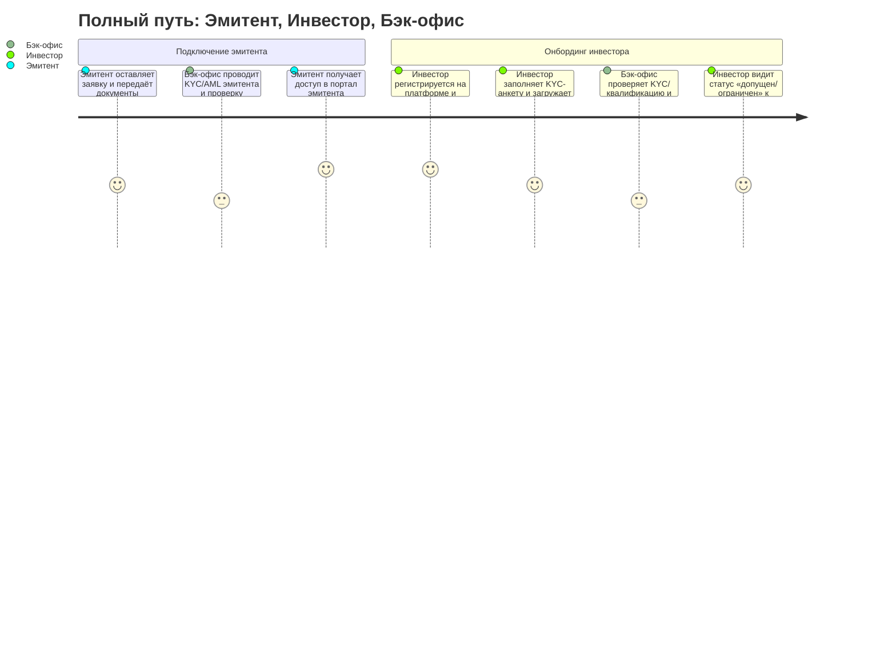
```mermaid
journey
  title Полный путь: Эмитент, Инвестор, Бэк-офис

  section Подключение эмитента
    Эмитент оставляет заявку и передаёт документы: 4: Эмитент
    Бэк-офис проводит KYC/AML эмитента и проверку компании: 3: Бэк-офис
    Эмитент получает доступ в портал эмитента: 5: Эмитент

  section Онбординг инвестора
    Инвестор регистрируется на платформе и подтверждает контакты: 5: Инвестор
    Инвестор заполняет KYC-анкету и загружает документы: 4: Инвестор
    Бэк-офис проверяет KYC/квалификацию и выносит решение: 3: Бэк-офис
    Инвестор видит статус «допущен/ограничен» к операциям: 4: Инвестор

```

---

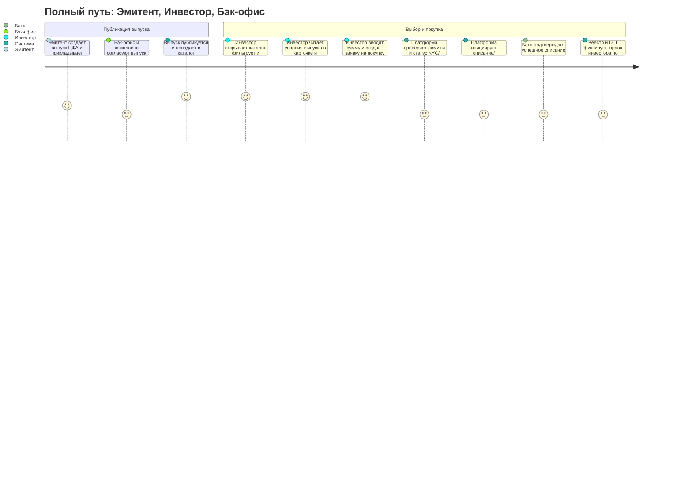
```mermaid
journey
  title Полный путь: Эмитент, Инвестор, Бэк-офис


  section Публикация выпуска
    Эмитент создаёт выпуск ЦФА и прикладывает юрдокументы: 4: Эмитент
    Бэк-офис и комплаенс согласуют выпуск (структура, лимиты, риски): 3: Бэк-офис
    Выпуск публикуется и попадает в каталог: 5: Система

  section Выбор и покупка
    Инвестор открывает каталог, фильтрует и выбирает выпуск: 5: Инвестор
    Инвестор читает условия выпуска в карточке и принимает решение: 5: Инвестор
    Инвестор вводит сумму и создаёт заявку на покупку: 5: Инвестор
    Платформа проверяет лимиты и статус KYC/квалификации: 3: Система
    Платформа инициирует списание/блокировку денег в банке: 3: Система
    Банк подтверждает успешное списание: 3: Банк
    Реестр и DLT фиксируют права инвестора по выпуску: 3: Система

```
---

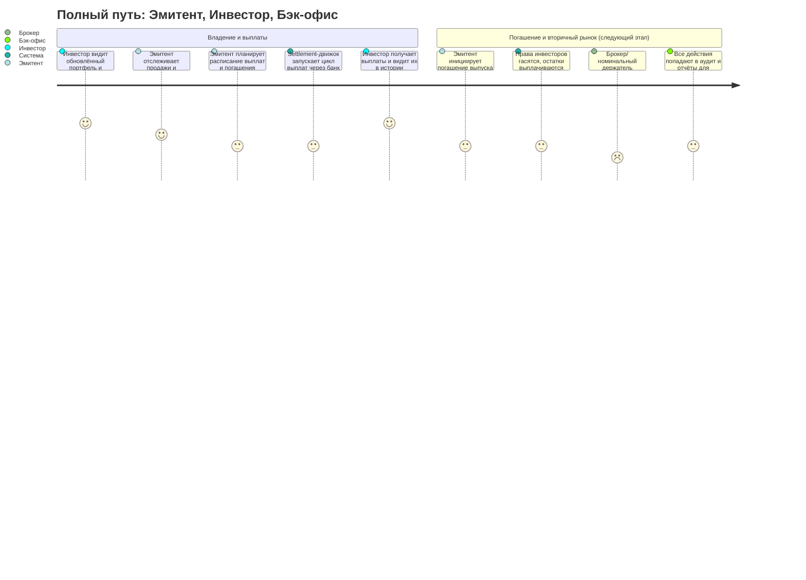
```mermaid
journey
  title Полный путь: Эмитент, Инвестор, Бэк-офис


  section Владение и выплаты
    Инвестор видит обновлённый портфель и историю операций: 5: Инвестор
    Эмитент отслеживает продажи и структуру инвесторов по выпускам: 4: Эмитент
    Эмитент планирует расписание выплат и погашения: 3: Эмитент
    Settlement-движок запускает цикл выплат через банк: 3: Система
    Инвестор получает выплаты и видит их в истории: 5: Инвестор

  section Погашение и вторичный рынок (следующий этап)
    Эмитент инициирует погашение выпуска по правилам ИС: 3: Эмитент
    Права инвесторов гасятся, остатки выплачиваются через банк: 3: Система
    Брокер/номинальный держатель осуществляет вторичные передачи прав: 2: Брокер
    Все действия попадают в аудит и отчёты для регулятора: 3: Бэк-офис
```
Здесь под капотом сидят EPIC‑TRD‑01..05 + 07 + 08 + 09 + 12, а 10 и 11 — техническая обвязка наблюдаемости и безопасности.

---

## 2. Investor Portal: подробный флоу покупки (MVP‑happy‑path)

Это главная диаграмма про то, что вы сейчас реально делаете: первичная покупка выпуска инвестором через терминал «как в Т‑банке/Альфе» без усложнения стаканом.📎filecite📎turn7file5📎turn7file17📎

Покрывает в первую очередь EPIC‑TRD‑01, 02, 03, 08, частично 05, 07, 12.

```mermaid
flowchart LR
  %% Онбординг
  subgraph Onboarding [Онбординг инвестора]
    A[Инвестор заходит на портал инвестора] --> B[Регистрируется и подтверждает email/телефон]
    B --> C[Заполняет профиль и KYC-анкету, загружает документы]
    C --> D{Решение KYC/квалификации}
  end

  D -->|Approved| E[Статус «допущен к сделкам»\nДоступ к каталогу выпусков]
  D -->|Rejected или Pending| D2[Показываем причины/статус\nПокупка недоступна]

  %% Каталог и выбор выпуска
  subgraph Discovery [Каталог и выбор выпуска]
    E --> F[Инвестор открывает каталог выпусков\nи применяет фильтры-срок, доходность, риск]
    F --> G[Переходит в карточку выбранного выпуска\nи читает условия, документы, риски]
    G --> H{Готов купить этот выпуск?}
  end

  H -->|Нет| F
  H -->|Да| I[Открывает «терминал» выпуска,\nвводит сумму/количество и создаёт заявку]

  %% Покупка
  subgraph Purchase [Покупка выпуска]
    I --> J[Платформа проверяет:\n• статус KYC/квалификации\n• ограничения по суммам и выпуску\n• доступный объём]
    J --> K{Проверки пройдены?}
    K -->|Нет| K2[Показываем понятную ошибку:\nлимит, статус, нет объёма и т.п.]
    K -->|Да| L[Инвестор подтверждает заявку\nи соглашается с условиями]

    L --> M[Платформа отправляет команду\nна списание/блокировку средств в банке]
    M --> N{Банк подтвердил списание?}
    N -->|Нет| N2[Заявка остаётся неоплаченной или отменяется,\nинвестор видит проблему оплаты]
    N -->|Да| O[Права по выпуску фиксируются за инвестором\nв реестре и DLT]
  end

  %% После сделки
  subgraph PostTrade [После покупки]
    O --> P[Инвестор видит обновлённый кошелёк:\nкол-во ЦФА, текущая стоимость, доходность]
    P --> Q[Инвестор открывает историю операций\nпокупки, выплаты, погашения]
    Q --> R[Инвестор может выгрузить историю\nв отчёт например, CSV для налогов]
  end

  %% Отмена до оплаты
  I -. Опционально .-> CXL[Инвестор отменяет черновую заявку\nдо оплаты]
```

---

## 3. Issuer Portal: путь эмитента

Этот флоу объясняет бизнес‑директору от клиента, что делает эмитент в системе: от черновика выпуска до отчётности и погашения. Основные epics: TRD‑06, TRD‑05, плюс связка с DLT и банком (TRD‑07, 12).📎filecite📎turn6file14📎turn6file17📎turn4file6📎turn3file6📎turn6file18📎

```mermaid
flowchart LR
  A[Эмитент входит в портал эмитента] --> B[Создаёт черновик выпуска:\nсумма, срок, ставка, график выплат, документы]
  B --> C[Отправляет выпуск на внутреннее\nи регуляторное согласование]

  C --> D{Выпуск согласован?}
  D -->|Нет| C2[Получает комментарии комплаенса\nи правит параметры/документы] --> C
  D -->|Да| E[Публикация выпуска на платформе\nВыпуск появляется в каталоге инвестора]

  E --> F[Эмитент в дашборде видит продажи:\nобъём размещения, количество инвесторов]
  F --> G[Планирует расписание выплат и погашения\nпо условиям выпуска]
  G --> H[Согласует с бэк-офисом запуск выплат\nи погашения по расписанию]

  H --> I[Запускается settlement-цикл:\nбанк списывает/перечисляет деньги,\nплатформа обновляет статусы выплат]
  I --> J[Эмитент видит отчёты:\n• по выпускам\n• по выплатам\n• по инвесторам]

  J --> K[По окончании срока инициирует погашение выпуска]
  K --> L[Права инвесторов гасятся,\nинвесторы получают финальные выплаты и\nвидят закрытие выпуска в портфеле]
```

---

## 4. Backoffice / Compliance: управление доступом, аудит и банк

Это то, что длительный звонок с Юрой пытались «нащупать» — что именно делает backoffice, кроме абстрактного «проверяем KYC». Тут подсобраны EPIC‑TRD‑08, 09, 07 и 11.📎filecite📎turn5file17📎turn4file15📎turn6file18📎turn6file13📎

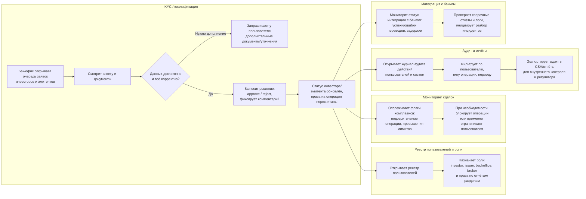
```mermaid
flowchart LR
  %% KYC & квалификация
  subgraph KYC [KYC / квалификация]
    A[Бэк-офис открывает очередь заявок\nинвесторов и эмитентов] --> B[Смотрит анкету и документы]
    B --> C{Данных достаточно\nи всё корректно?}
    C -->|Нужно дополнение| D[Запрашивает у пользователя\nдополнительные документы/уточнения]
    C -->|Да| E[Выносит решение:\napprove / reject,\nфиксирует комментарий]
    E --> F[Статус инвестора/эмитента обновлён,\nправа на операции пересчитаны]
  end

  %% Реестр пользователей и роли
  subgraph Registry [Реестр пользователей и роли]
    F --> G[Открывает реестр пользователей]
    G --> H[Назначает роли:\ninvestor, issuer, backoffice, broker\nи права по отчётам/разделам]
  end

  %% Мониторинг сделок и комплаенса
  subgraph Monitoring [Мониторинг сделок]
    F --> I[Отслеживает флаги комплаенса:\nподозрительные операции, превышения лимитов]
    I --> J[При необходимости блокирует операции\nили временно ограничивает пользователя]
  end

  %% Аудит
  subgraph Audit [Аудит и отчёты]
    F --> K[Открывает журнал аудита действий\nпользователей и систем]
    K --> L[Фильтрует по пользователю,\nтипу операции, периоду]
    L --> M[Экспортирует аудит в CSV/отчёты\nдля внутреннего контроля и регулятора]
  end

  %% Банк и выплаты
  subgraph Bank [Интеграция с банком]
    F --> N[Мониторит статус интеграции с банком:\nуспехи/ошибки переводов, задержки]
    N --> O[Проверяет сверочные отчёты и логи,\nинициирует разбор инцидентов]
  end
```

---

## 5. Сквозной sequence: как проходит одна покупка (для технарей, но по‑человечески)

Это уже ближе к EPIC‑TRD‑02 + 07 + 08 + 12, но всё ещё на человеческом языке. Можно показывать на том же созвоне, когда надо объяснить, как связаны портал, банк и реестр.

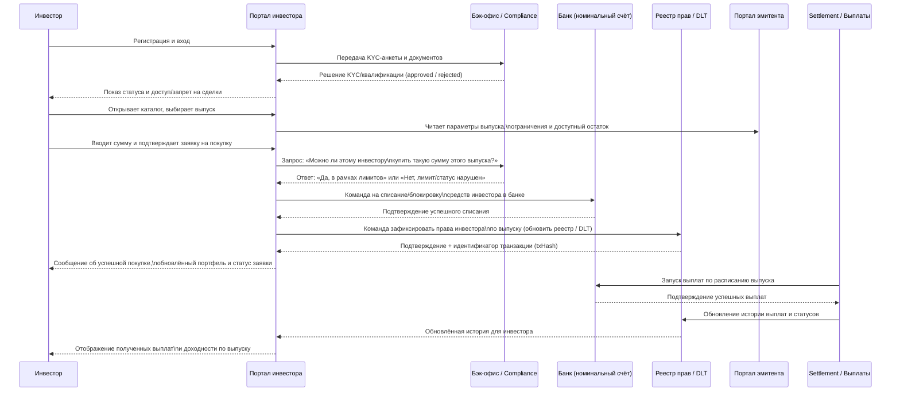
```mermaid
sequenceDiagram
  participant Inv as Инвестор
  participant InvPortal as Портал инвестора
  participant Back as Бэк-офис / Compliance
  participant Bank as Банк (номинальный счёт)
  participant Reg as Реестр прав / DLT
  participant Iss as Портал эмитента
  participant Settl as Settlement / Выплаты

  %% Онбординг
  Inv->>InvPortal: Регистрация и вход
  InvPortal->>Back: Передача KYC-анкеты и документов
  Back-->>InvPortal: Решение KYC/квалификации (approved / rejected)
  InvPortal-->>Inv: Показ статуса и доступ/запрет на сделки

  %% Выбор выпуска
  Inv->>InvPortal: Открывает каталог, выбирает выпуск
  InvPortal->>Iss: Читает параметры выпуска,\nограничения и доступный остаток
  Inv->>InvPortal: Вводит сумму и подтверждает заявку на покупку

  %% Проверки перед сделкой
  InvPortal->>Back: Запрос: «Можно ли этому инвестору\nкупить такую сумму этого выпуска?»
  Back-->>InvPortal: Ответ: «Да, в рамках лимитов» или «Нет, лимит/статус нарушен»

  %% Оплата и фиксация прав
  InvPortal->>Bank: Команда на списание/блокировку\nсредств инвестора в банке
  Bank-->>InvPortal: Подтверждение успешного списания
  InvPortal->>Reg: Команда зафиксировать права инвестора\nпо выпуску (обновить реестр / DLT)
  Reg-->>InvPortal: Подтверждение + идентификатор транзакции (txHash)
  InvPortal-->>Inv: Сообщение об успешной покупке,\nобновлённый портфель и статус заявки

  %% Выплаты позже по расписанию
  Settl->>Bank: Запуск выплат по расписанию выпуска
  Bank-->>Settl: Подтверждение успешных выплат
  Settl->>Reg: Обновление истории выплат и статусов
  Reg-->>InvPortal: Обновлённая история для инвестора
  InvPortal-->>Inv: Отображение полученных выплат\nи доходности по выпуску
```

---

## 6. Как это соотносится с 12 epics (быстрый мостик)

Чтобы тебе не держать в голове, куда делись все эпики:

- EPIC‑TRD‑01 Каталог — блок Discovery в диаграммах 1 и 2.📎filecite📎turn5file15📎
- EPIC‑TRD‑02 Покупка ЦФА — Purchase в диаграмме 2 + sequence‑диаграмма.📎filecite📎turn4file4📎
- EPIC‑TRD‑03 История инвестора — PostTrade в диаграмме 2 + часть диаграммы 1 (история/экспорт).📎filecite📎turn5file0📎
- EPIC‑TRD‑04 Передача прав / вторичный рынок — последний блок общей диаграммы (как «следующий этап»).📎filecite📎turn4file12📎
- EPIC‑TRD‑05 Погашение/выплаты — блоки «Владение и выплаты» и «Погашение» в диаграмме 1 + шаги G–K в диаграмме 3.📎filecite📎turn4file6📎
- EPIC‑TRD‑06 Кабинет эмитента — вся диаграмма 3.📎filecite📎turn6file14📎
- EPIC‑TRD‑07 Интеграция с банком — Payment‑узлы в диаграммах 2 и 5, блок Bank в диаграмме 4.📎filecite📎turn6file18📎
- EPIC‑TRD‑08 KYC/AML/квалификация — секция «Онбординг» в диаграммах 1, 2 и весь блок KYC в диаграмме 4.📎filecite📎turn5file17📎
- EPIC‑TRD‑09 Аудит — блок Audit в диаграмме 4 и последняя строка в общей диаграмме.📎filecite📎turn4file15📎
- EPIC‑TRD‑10 Наблюдаемость/SLO — не отдельные шаги юзера, а слой мониторинга/метрик вокруг банковских вызовов, заказов и settlement; можно показать на отдельной тех‑презе.📎filecite📎turn4file13📎
- EPIC‑TRD‑11 Безопасность/Права — реестр пользователей и роли в диаграмме 4 (UserRegistry).📎filecite📎turn6file13📎
- EPIC‑TRD‑12 DLT/реестр/txHash — шаги фиксации прав в диаграммах 1, 2 и 5.📎filecite📎turn3file6📎

# V2 before call insights
Cделаем более «бизнес‑читабельный» набор схем и сразу подсветим скоуп к 20‑му.

Я опираюсь на 12 эпиков EPIC‑TRD‑01…12 из `backlog/epics` и контекст‑файл `CONTEXT-TRADING.md`.
А на созвоне вы формулировали MVP как «эмитент выпускает ЦФА → инвестор покупает → мы платим».

Ниже — **готовый набор Mermaid‑диаграмм**, который можно прямо вставлять в док/Notion и показывать заказчику.

* общий **mindmap по эпикам с разрезом MVP / позже**;
* **end‑to‑end user journey** по всем ролям с пометками `[MVP]/[Later]`;
* отдельные journeys для **инвестора**, **эмитента**, **backoffice**;
* две **state‑диаграммы** (жизненный цикл выпуска и KYC);
* **quadrant chart** для разговора о скоупе и приоритете.

---

## 1. Карта эпиков и разрез MVP / позже (mindmap)

Это то, с чего удобно начинать звонок: видно, что вся «торговля» — не один монолит, а кусочки.

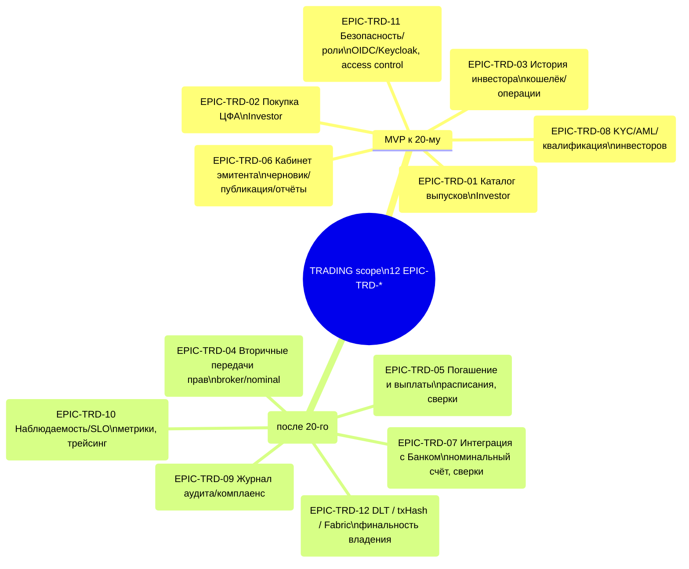
```mermaid
mindmap
  root((TRADING scope\n12 EPIC-TRD-*))
    MVP к 20-му
      (EPIC-TRD-01 Каталог выпусков\nInvestor)
      (EPIC-TRD-02 Покупка ЦФА\nInvestor)
      (EPIC-TRD-03 История инвестора\nкошелёк/операции)
      (EPIC-TRD-06 Кабинет эмитента\nчерновик/публикация/отчёты)
      (EPIC-TRD-08 KYC/AML/квалификация\nинвесторов)
      (EPIC-TRD-11 Безопасность/роли\nOIDC/Keycloak, access control)
    Позже (после 20-го)
      (EPIC-TRD-04 Вторичные передачи прав\nbroker/nominal)
      (EPIC-TRD-05 Погашение и выплаты\nрасписания, сверки)
      (EPIC-TRD-07 Интеграция с Банком\nноминальный счёт, сверки)
      (EPIC-TRD-09 Журнал аудита/комплаенс)
      (EPIC-TRD-10 Наблюдаемость/SLO\nметрики, трейсинг)
      (EPIC-TRD-12 DLT / txHash / Fabric\nфинальность владения)
```

«Вот полный scope, вот чем мы закрываем MVP к 20‑му, а вот что пойдёт в следующий цикл».

---

## 2. End‑to‑end user journey (все роли + MVP/позже)

Здесь одна линия истории «одна сделка», но разложенная по ролям.

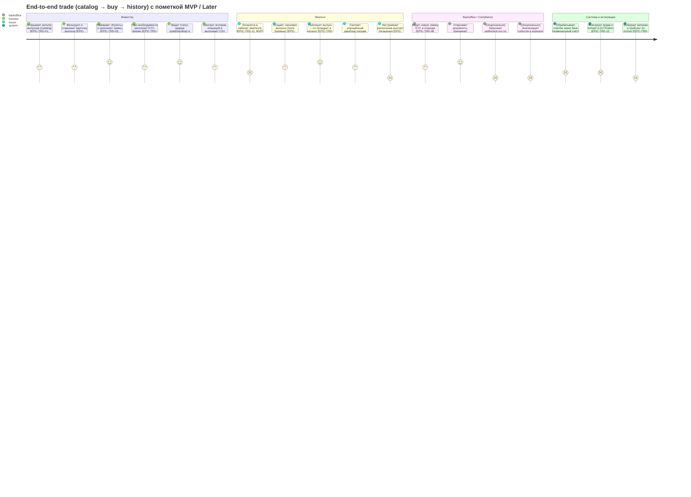
```mermaid
journey
  title End-to-end trade (catalog → buy → history) с пометкой MVP / Later

  section Инвестор
    Открывает каталог выпусков (/catalog) [EPIC-TRD-01, MVP]      : 3: investor
    Фильтрует и открывает карточку выпуска [EPIC-TRD-01, MVP]     : 3: investor
    Нажимает «Купить» и заполняет заявку [EPIC-TRD-02, MVP]       : 4: investor
    При необходимости заполняет KYC-форму [EPIC-TRD-08, MVP]      : 3: investor
    Видит статус ордера (paid/pending) в портфеле [EPIC-TRD-02/03, MVP] : 4: investor
    Смотрит историю операций и выгружает CSV [EPIC-TRD-03, MVP]   : 3: investor

  section Эмитент
    Логинится в кабинет эмитента [EPIC-TRD-11, MVP]               : 2: issuer
    Создаёт черновик выпуска (поля базовые) [EPIC-TRD-06, MVP]    : 3: issuer
    Публикует выпуск → он попадает в каталог [EPIC-TRD-06+01, MVP]: 4: issuer
    Смотрит упрощённый дашборд продаж [EPIC-TRD-06, MVP]          : 3: issuer
    Настраивает расписание выплат/погашения [EPIC-TRD-05, Later]  : 1: issuer

  section Backoffice / Compliance
    Видит новую заявку KYC в очереди [EPIC-TRD-08, MVP]           : 3: backoffice
    Открывает документы, принимает решение approve/reject [EPIC-TRD-08, MVP]: 4: backoffice
    (Опционально) Запускает settlement-run по выплатам [EPIC-TRD-05/07, Later] : 1: backoffice
    (Опционально) Анализирует события в журнале аудита [EPIC-TRD-09, Later]    : 1: backoffice

  section Система и интеграции
    Обрабатывает платёж через банк (номинальный счёт) [EPIC-TRD-07, Later]     : 2: system
    Фиксирует права и txHash в DLT/Fabric [EPIC-TRD-12, Later]                 : 2: system
    Собирает метрики и трейсинг по потоку [EPIC-TRD-10, Later]                 : 1: system
```

**На звонке**: эту диаграмму удобно листать по секциям —
«Вот что видит инвестор; вот — эмитент; вот — backoffice; вот — что пока останется за кадром, но заложено в архитектуру».

---

## 3. Investor journey (упрощённая, только то, что бизнесу важно)

Эта версия — чисто фронтовый взгляд инвестора, без сервисов и интеграций.

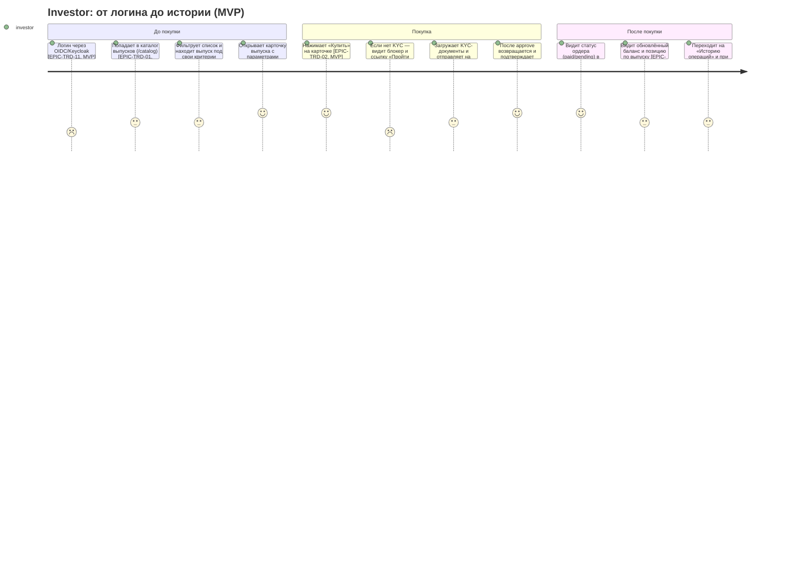
```mermaid
journey
  title Investor: от логина до истории (MVP)

  section До покупки
    Логин через OIDC/Keycloak [EPIC-TRD-11, MVP]                  : 2: investor
    Попадает в каталог выпусков (/catalog) [EPIC-TRD-01, MVP]     : 3: investor
    Фильтрует список и находит выпуск под свои критерии [EPIC-TRD-01, MVP] : 3: investor
    Открывает карточку выпуска с параметрами [EPIC-TRD-01, MVP]   : 4: investor

  section Покупка
    Нажимает «Купить» на карточке [EPIC-TRD-02, MVP]              : 4: investor
    Если нет KYC — видит блокер и ссылку «Пройти проверку» [EPIC-TRD-08, MVP] : 2: investor
    Загружает KYC-документы и отправляет на проверку [EPIC-TRD-08, MVP]       : 3: investor
    После approve возвращается и подтверждает заявку [EPIC-TRD-02, MVP]       : 4: investor

  section После покупки
    Видит статус ордера (paid/pending) в портфеле [EPIC-TRD-02/03, MVP]       : 4: investor
    Видит обновлённый баланс и позицию по выпуску [EPIC-TRD-03, MVP]          : 3: investor
    Переходит на «Историю операций» и при необходимости выгружает CSV [EPIC-TRD-03, MVP] : 3: investor
```

---

## 4. Issuer journey (разбитый, без «монстра»)

Вместо одной огромной flowchart по эмитенту — компактный journey.

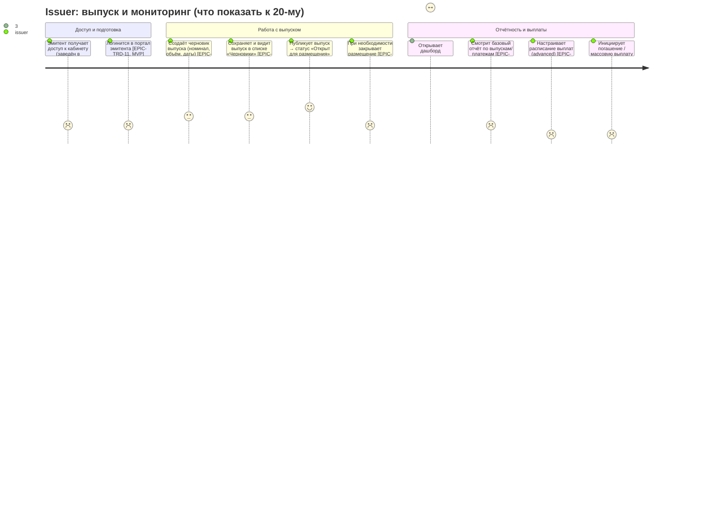
```mermaid
journey
  title Issuer: выпуск и мониторинг (что показать к 20-му)

  section Доступ и подготовка
    Эмитент получает доступ к кабинету (заведён в backoffice) [EPIC-TRD-11, MVP] : 2: issuer
    Логинится в портал эмитента [EPIC-TRD-11, MVP]                                : 2: issuer

  section Работа с выпуском
    Создаёт черновик выпуска (номинал, объём, даты) [EPIC-TRD-06, MVP]           : 3: issuer
    Сохраняет и видит выпуск в списке «Черновики» [EPIC-TRD-06, MVP]             : 3: issuer
    Публикует выпуск → статус «Открыт для размещения» [EPIC-TRD-06, MVP]         : 4: issuer
    При необходимости закрывает размещение [EPIC-TRD-06, MVP]                    : 2: issuer

  section Отчётность и выплаты
    Открывает дашборд: сколько продано, сколько осталось [EPIC-TRD-06, MVP]      : 3: issuer
    Смотрит базовый отчёт по выпускам/платежам [EPIC-TRD-06, MVP]                : 2: issuer
    Настраивает расписание выплат (advanced) [EPIC-TRD-05, Later]                : 1: issuer
    Инициирует погашение / массовую выплату [EPIC-TRD-05, Later]                 : 1: issuer
```

---

## 5. Backoffice / Compliance journey

Фокус: KYC/qualification + то, что можно перенести «позже».

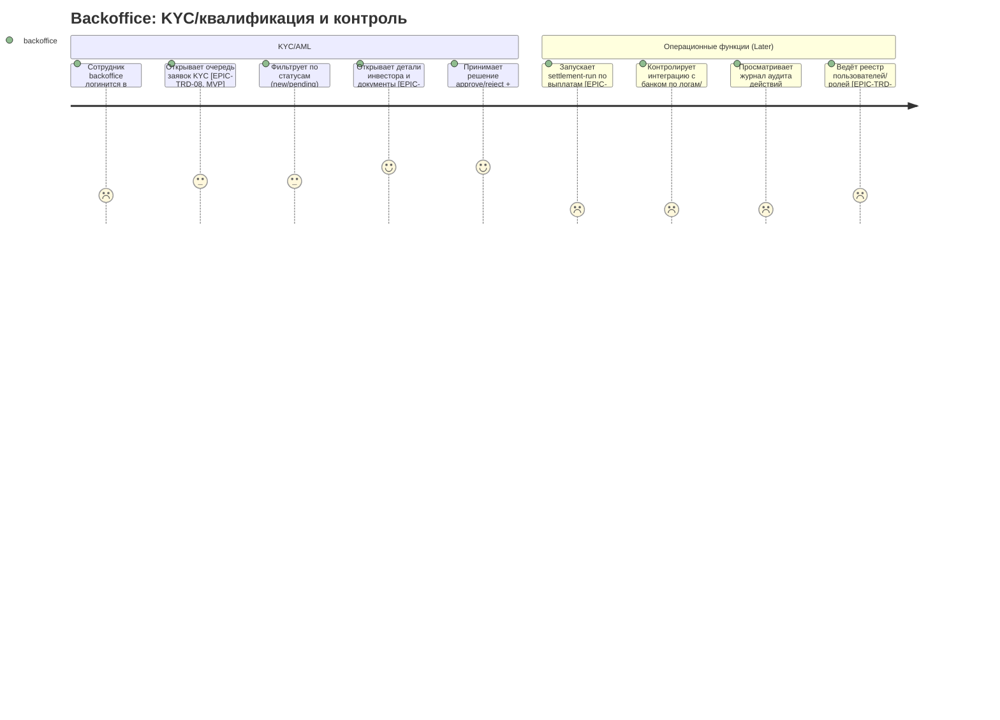
```mermaid
journey
  title Backoffice: KYC/квалификация и контроль

  section KYC/AML
    Сотрудник backoffice логинится в backoffice-портал [EPIC-TRD-11, MVP]        : 2: backoffice
    Открывает очередь заявок KYC [EPIC-TRD-08, MVP]                               : 3: backoffice
    Фильтрует по статусам (new/pending) [EPIC-TRD-08, MVP]                        : 3: backoffice
    Открывает детали инвестора и документы [EPIC-TRD-08, MVP]                     : 4: backoffice
    Принимает решение approve/reject + задаёт квалификационный лимит [EPIC-TRD-08, MVP]: 4: backoffice

  section Операционные функции (Later)
    Запускает settlement-run по выплатам [EPIC-TRD-05/07, Later]                  : 1: backoffice
    Контролирует интеграцию с банком по логам/алертам [EPIC-TRD-07/10, Later]     : 1: backoffice
    Просматривает журнал аудита действий пользователей [EPIC-TRD-09, Later]       : 1: backoffice
    Ведёт реестр пользователей/ролей [EPIC-TRD-11, MVP]                           : 2: backoffice
```

---

## 6. Жизненный цикл выпуска (state diagram вместо перегруженного flow)

Это заменяет «большую диаграмму (1)» по issuer: только ключевые состояния, понятные бизнесу.

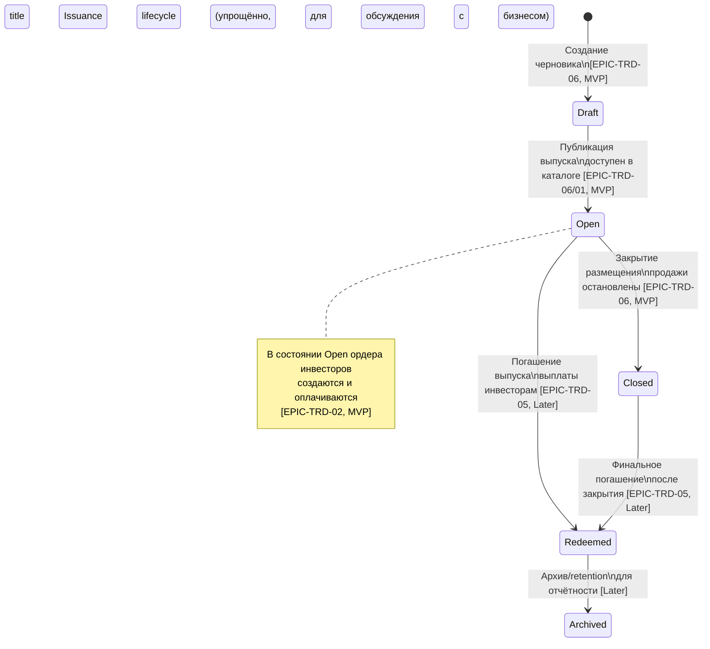
```mermaid
stateDiagram-v2
  title Issuance lifecycle (упрощённо, для обсуждения с бизнесом)

  [*] --> Draft: Создание черновика\n[EPIC-TRD-06, MVP]
  Draft --> Open: Публикация выпуска\nдоступен в каталоге [EPIC-TRD-06/01, MVP]
  Open --> Closed: Закрытие размещения\nпродажи остановлены [EPIC-TRD-06, MVP]

  Open --> Redeemed: Погашение выпуска\nвыплаты инвесторам [EPIC-TRD-05, Later]
  Closed --> Redeemed: Финальное погашение\nпосле закрытия [EPIC-TRD-05, Later]

  Redeemed --> Archived: Архив/retention\nдля отчётности [Later]

  note right of Open
    В состоянии Open ордера инвесторов
    создаются и оплачиваются
    [EPIC-TRD-02, MVP]
  end note
```

👉 Эта штука очень хорошо «зашивает» разговор про лицензирование: видно, что **даже MVP** уже укладывается в нормальный жизненный цикл выпуска, а не в «игрушку».

---

## 7. Жизненный цикл KYC/квалификации (state diagram)

Тут ты показываешь, что KYC — не просто «форма», а понятный процесс.

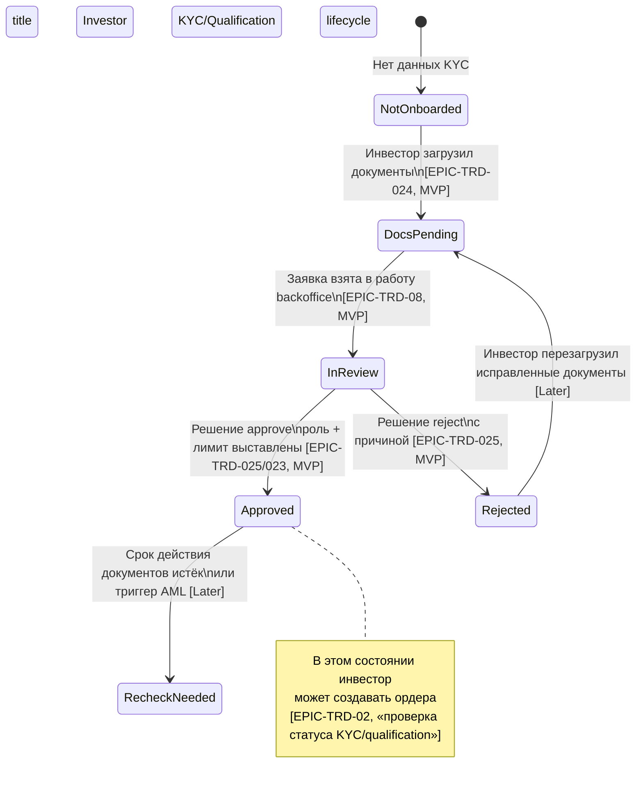
```mermaid
stateDiagram-v2
  title Investor KYC/Qualification lifecycle

  [*] --> NotOnboarded: Нет данных KYC
  NotOnboarded --> DocsPending: Инвестор загрузил документы\n[EPIC-TRD-024, MVP]
  DocsPending --> InReview: Заявка взята в работу backoffice\n[EPIC-TRD-08, MVP]
  InReview --> Approved: Решение approve\nроль + лимит выставлены [EPIC-TRD-025/023, MVP]
  InReview --> Rejected: Решение reject\nс причиной [EPIC-TRD-025, MVP]

  Approved --> RecheckNeeded: Срок действия документов истёк\nили триггер AML [Later]
  Rejected --> DocsPending: Инвестор перезагрузил исправленные документы [Later]

  note right of Approved
    В этом состоянии инвестор
    может создавать ордера
    [EPIC-TRD-02, «проверка статуса KYC/qualification»]
  end note
```

---

## 8. Quadrant chart: как обсуждать, что в MVP, а что нет

Это чисто «менеджерская» картинка: по осям **ценность для демо/лицензии** и **объём/риск реализации**.

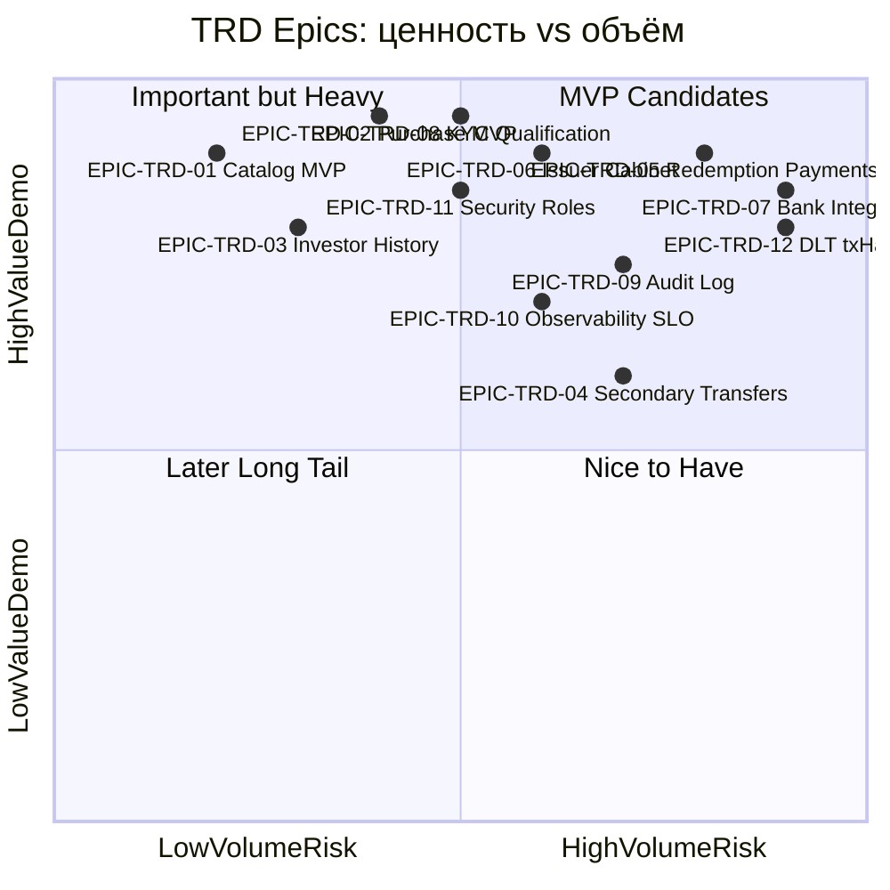
```mermaid
quadrantChart
    title TRD Epics: ценность vs объём
    x-axis LowVolumeRisk --> HighVolumeRisk
    y-axis LowValueDemo --> HighValueDemo
    quadrant-1 MVP Candidates
    quadrant-2 Important but Heavy
    quadrant-3 Later Long Tail
    quadrant-4 Nice to Have

    EPIC-TRD-01 Catalog MVP         : [0.2, 0.9]
    EPIC-TRD-02 Purchase MVP         : [0.4, 0.95]
    EPIC-TRD-03 Investor History     : [0.3, 0.8]
    EPIC-TRD-06 Issuer Cabinet      : [0.6, 0.9]
    EPIC-TRD-08 KYC Qualification     : [0.5, 0.95]
    EPIC-TRD-11 Security Roles     : [0.5, 0.85]

    EPIC-TRD-05 Redemption Payments     : [0.8, 0.9]
    EPIC-TRD-07 Bank Integration : [0.9, 0.85]
    EPIC-TRD-09 Audit Log          : [0.7, 0.75]
    EPIC-TRD-10 Observability SLO     : [0.6, 0.7]
    EPIC-TRD-12 DLT txHash            : [0.9, 0.8]
    EPIC-TRD-04 Secondary Transfers    : [0.7, 0.6]
```

Координаты тут **примерные**, смысл в визуальном разделении:
«Вот шесть штук, которые логично взять в MVP, а вот бóльшие куски, которые лучше обсудить как next phase».

---

## Summary

1. **Mindmap (№1)** — открыть в начале: «Вот весь мир, вот кусок до 20‑го».
2. **End‑to‑end journey (№2)** — пройти глазами, чтобы все стейкхолдеры согласились с общей картинкой.
3. **Actor‑journeys (№3–5)** — по необходимости: если кто‑то «ныряет» в свой кабинет.
4. **State‑диаграммы (№6–7)** — когда разговор уйдёт в лицензирование / регуляторику.
5. **Quadrant (№8)** — финальный слайд для фиксации scope: «эти EPIC‑ы — в коммит к 20‑му, эти — за бортом MVP».

Если хочешь, следующим шагом могу:

* сделать **12 очень коротких journey по каждому EPIC‑TRD‑0X** (1–2 шага «as is»);
* или наоборот, собрать **отдельный набор схем только по MVP‑эпикам**, чтобы он поместился на один экран для демо.
