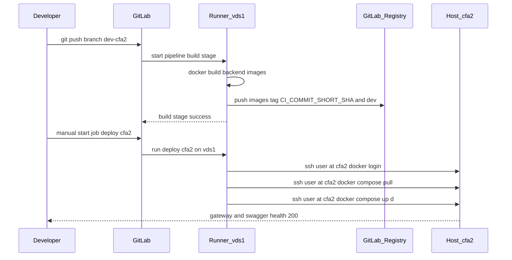
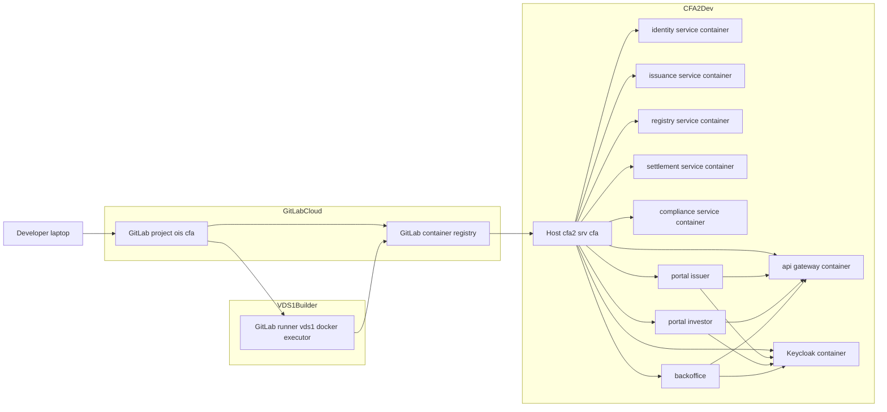

Сейчас у нас, по сути, уже почти есть тот простой сценарий, который ты хочешь:
**vds1 как builder, GitLab Registry как хранилище образов, cfa2 как простая docker‑машина, которая делает pull и up.** Нужно это аккуратно дооформить и зафиксировать в понятный план.

Я разобрал:

* oracle‑док 20251126‑1805 и промпт для авто‑агента с auto‑setup‑ci.sh, runner‑токенами и т.д.
* последнюю сессию `eywa1-p-cfa-w19...`, где уже есть:

  * `bootstrap-cfa2.sh`: Docker + compose на cfa2, `/srv/cfa` и пользователь `user` с sudo;
  * `ci-bootstrap-cfa2.sh` и `ci-setup-runner-vds1.sh`;
  * ветка `infra-ci-setup` с минимальным `.gitlab-ci.yml`, где `build-api-gateway` на тег `vds1` собирает образ и пушит в GitLab Registry, а `deploy-cfa2` через SSH идёт на `cfa2` и делает `docker login` + `docker compose pull && docker compose up -d`.

Понимаю твой дискомфорт: агент ушёл в **full‑automation‑overkill** (auto‑setup, генерация токенов, динамическая генерация compose и .env), вместо простого итеративного сценария.

Давай зафиксируем **простой CI/CD план** и сразу нарисуем:

* архитектуру по шагам,
* mermaid sequence + C4 deploy,
* таблицу‑шпаргалку,
* и лёгкий промпт для нового агента без лишней магии.

---

## 1. Что мы хотим на самом деле

**Цель Dev‑цикла на cfa2:**

1. Я пушу в выбранную ветку (например `develop` или отдельную `dev-cfa2`).
2. GitLab:

   * запускает пайплайн на раннере на **vds1**;
   * билдит Docker‑образы бэков (и позже фронтов);
   * пушит их в GitLab Registry.
3. По кнопке `deploy-cfa2`:

   * job на vds1 по SSH логинится на `cfa2`;
   * делает `docker login` + `docker compose pull` + `docker compose up -d` в `/srv/cfa`;
   * сервисы на `cfa2` реально стартуют, health 200.
4. Дальше итеративно:

   * сначала **только build+deploy без тестов**,
   * потом добавляем **tests** как отдельный stage, который гейтит deploy,
   * потом уже **фронты (issuer, investor, backoffice) через Keycloak**.

Важно:

* **UK1 не трогаем**, он остаётся референсом. 
* Для cfa2 домены и Cloudflare/telex — отдельный уровень (runbook), но **первую итерацию Dev можно делать по IP и портам**, без TLS.

---

## 2. Текущее состояние по факту

Суммарно по `eywa1-p-cfa-w19...` и `c2p_deploy`:

* **cfa2**:

  * есть пользователь `user` с sudo NOPASSWD; SSH по ключам работает; `/srv/cfa` создано. 
  * Docker и Docker Compose plugin установлены, `docker compose version` даёт v2.29.7.
  * уже крутится Portainer как UI, но он нам не нужен как registry; просто сервис для ручного просмотра. 

* **vds1**:

  * Docker и gitlab‑runner стоят, runner зарегистрирован на GitLab через API (auto‑setup‑ci). 

* **репо `ois-cfa`, ветка `infra-ci-setup`**:

  * добавлен `ops/scripts/ci-bootstrap-cfa2.sh` и `ops/scripts/ci-setup-runner-vds1.sh`;

  * `.gitlab-ci.yml` переписан под минимальный pipeline:

    * `build-api-gateway`:

      * `image: docker:24.0`, сервис `docker:24.0-dind`, теги `vds1`,
      * `docker build` образ `api-gateway` и пуш в `$CI_REGISTRY_IMAGE/api-gateway:$CI_COMMIT_SHA` плюс `latest` для default‑branch.

    * `deploy-cfa2`:

      * теги `vds1`,
      * в `before_script` — ssh‑agent + `SSH_PRIVATE_KEY`, `ssh-keyscan cfa2`,
      * в `script` — SSH на `cfa2`, `docker login`, `cd /srv/cfa && docker compose pull && docker compose up -d`.

  * позже job был расширен для генерации `.env` и `docker-compose.yml` на `cfa2` из CI скрипта (cat > /srv/cfa/.env << EOF и т.п.).

То есть **минимальный end‑to‑end уже почти есть**, но:

* compose и env генерятся “на лету” из CI → риск параллельных реальностей;
* билдится только `api-gateway`, остальные сервисы и фронты не подключены;
* тестовый stage пока выкинут.

---

## 3. Предлагаемый пошаговый план (Dev на cfa2)

### 3.1 Инкременты

| Шаг | Цель                                                                   | Trigger                                | Что билдим                                                                                    | Что деплоим                                               | Tests                             |
| --- | ---------------------------------------------------------------------- | -------------------------------------- | --------------------------------------------------------------------------------------------- | --------------------------------------------------------- | --------------------------------- |
| 0   | Зафиксировать базу: Docker+Runner+SSH+`/srv/cfa`                       | однократно                             | ничего                                                                                        | ничего                                                    | ручные curl                       |
| 1   | Минимальный Dev pipeline: build backend images + ручной deploy на cfa2 | push в `dev-cfa2` (или `develop`)      | gateway + один сервис                                                                         | docker compose для backend без фронтов                    | нет                               |
| 2   | Полный backend Dev: все основные .NET сервисы                          | тот же                                 | gateway + identity + issuance + registry + settlement + compliance                            | тот же compose но с полным набором сервисов               | нет                               |
| 3   | Front+Keycloak: Dev‑порталы через Keycloak                             | тот же                                 | фронты (issuer, investor, backoffice) + возможно отдельные obразы для Keycloak‑realm или init | compose добавляет порталы и Keycloak, env на Keycloak URL | smoke e2e по входу                |
| 4   | Tests stage: unit/integration/e2e перед deploy                         | push на dev‑ветку, deploy через manual | как в 2–3                                                                                     | как в 3                                                   | да, обязателен green перед deploy |

---

## 4. Варианты сценариев deploy и выбор

### 4.1 Сценарии

| Сценарий                                                            | Build                | Deploy                                                              | Pros                                                                                                                   | Cons                                                                                        | Рекомендация            |
| ------------------------------------------------------------------- | -------------------- | ------------------------------------------------------------------- | ---------------------------------------------------------------------------------------------------------------------- | ------------------------------------------------------------------------------------------- | ----------------------- |
| A. Runner на vds1, deploy через SSH на cfa2                         | vds1 docker executor | job `deploy-cfa2` по SSH запускает `docker compose pull/up` на cfa2 | Простая ментальная модель, уже почти реализовано; чёткий раздел builder vs target; одна точка билда для всех окружений | SSH и compose надо аккуратно версионировать; секреты через GitLab Variables                 | **Выбран** как основной |
| B. Runner на самом cfa2, build+run локально                         | cfa2 docker executor | тот же runner делает `docker build` и `docker compose up`           | нет SSH, меньше “прыжков”                                                                                              | жестко привязаны к одному хосту; тяжелый build на prod‑host; сложнее потом масштабироваться | Не берём                |
| C. Только shared‑runners GitLab, deploy через remote docker context | shared               | `docker context` или remote API на cfa2                             | без отдельного vds1                                                                                                    | сложнее в отладке; порт и доступ к docker API наружу → лишние риски                         | Не берём                |

У нас по факту уже работает сценарий **A** (runner на vds1 + SSH на cfa2) — нужно его **упростить и зафиксировать**.

---

## 5. Как именно это должно выглядеть (target design)

### 5.1 .gitlab-ci.yml для Dev (упрощённый скелет)

Идея:

* **Stages**: `build`, `deploy` (потом добавим `test`).
* Jobs запускаются **только** для `dev-cfa2` (или `develop`), чтобы не мешать другим границам.
* `deploy-cfa2` — `when: manual`, чтобы вначале ты руками нажимал кнопку.

Пример структуры (без всех деталей, но с нужной формой):

```yaml
stages:
  - build
  - deploy

variables:
  DOCKER_HOST: tcp://docker:2375
  DOCKER_DRIVER: overlay2

.build_backend_template:
  stage: build
  tags: [vds1]
  image: docker:24.0
  services:
    - docker:24.0-dind
  script:
    - docker info
    - docker login -u "$CI_REGISTRY_USER" -p "$CI_REGISTRY_PASSWORD" "$CI_REGISTRY"
    - >
      docker build
      -t "$CI_REGISTRY_IMAGE/$IMAGE_NAME:$CI_COMMIT_SHORT_SHA"
      -f "$DOCKERFILE_PATH"
      "$BUILD_CONTEXT"
    - docker push "$CI_REGISTRY_IMAGE/$IMAGE_NAME:$CI_COMMIT_SHORT_SHA"
    - |
      if [ "$CI_COMMIT_BRANCH" = "dev-cfa2" ]; then
        docker tag "$CI_REGISTRY_IMAGE/$IMAGE_NAME:$CI_COMMIT_SHORT_SHA" \
          "$CI_REGISTRY_IMAGE/$IMAGE_NAME:dev"
        docker push "$CI_REGISTRY_IMAGE/$IMAGE_NAME:dev"
      fi
  rules:
    - if: '$CI_COMMIT_BRANCH == "dev-cfa2"'

build:gateway:
  extends: .build_backend_template
  variables:
    IMAGE_NAME: api-gateway
    DOCKERFILE_PATH: apps/api-gateway/Dockerfile
    BUILD_CONTEXT: apps/api-gateway

# потом добавим build:identity, build:issuance, registry, settlement, compliance, фронты…

deploy:cfa2:
  stage: deploy
  tags: [vds1]
  image: alpine:3.19
  needs:
    - build:gateway
  before_script:
    - apk add --no-cache openssh-client bash
    - eval "$(ssh-agent -s)"
    - echo "$SSH_PRIVATE_KEY" | tr -d '\r' | ssh-add -
    - mkdir -p ~/.ssh
    - ssh-keyscan -H cfa2 >> ~/.ssh/known_hosts
  script:
    - ssh user@cfa2 "docker login -u $CI_REGISTRY_USER -p $CI_REGISTRY_PASSWORD $CI_REGISTRY"
    - ssh user@cfa2 "cd /srv/cfa && docker compose pull && docker compose up -d"
  rules:
    - if: '$CI_COMMIT_BRANCH == "dev-cfa2"'
  when: manual
  environment:
    name: cfa2-dev
```

Это очень близко к тому, что уже сейчас в `infra-ci-setup` после правок агента, просто:

* явно ограничили ветку;
* добавили tag `dev`;
* оставили compose на стороне `cfa2`, а не генерим его в CI.

### 5.2 Где должен лежать docker-compose для cfa2

Вместо генерируемого compose:

1. В репо (например `deploy/docker-compose-at-vps/cfa2/docker-compose.yml`) — по аналогии с UK1 runbook’ами.
2. На `cfa2`:

   * один раз копируем:

     ```bash
     ssh user@cfa2 "mkdir -p /srv/cfa"
     scp deploy/docker-compose-at-vps/cfa2/docker-compose.yml user@cfa2:/srv/cfa/docker-compose.yml
     scp deploy/docker-compose-at-vps/cfa2/.env.dev user@cfa2:/srv/cfa/.env
     ```

   * дальше CI‑job только делает `docker compose pull/up` без изменения файлов.

Так мы **не плодим параллельные реальности**, всё состояние compose и env версионируется в репозитории, вместе с кодом.

---

## 6. Mermaid diagrams

### 6.1 Sequence: Dev push → vds1 → Registry → cfa2



### 6.2 C4‑style deploy для Dev на cfa2



---

## 7. Таблица‑шпаргалка по ролям и командам

### 7.1 Кто за что отвечает

| Сущность                      | Роль                                           | Примеры действий                                                                      |
| ----------------------------- | ---------------------------------------------- | ------------------------------------------------------------------------------------- |
| GitLab project `npk/ois-cfa`  | Source of truth для кода, compose и CI         | Редактируем `.gitlab-ci.yml`, `deploy/docker-compose-at-vps/cfa2/*`                   |
| Runner на vds1 с тегом `vds1` | Build и deploy агент                           | Выполняет `docker build` и SSH на `cfa2`                                              |
| GitLab Registry               | Хранит образы `api-gateway`, сервисов, фронтов | Теги `CI_COMMIT_SHORT_SHA`, `dev`, позже `stage`, `prod`                              |
| cfa2                          | Dev‑хост, только `docker compose pull/up`      | `cd /srv/cfa && docker compose ps`, `logs`, `curl /health`                            |
| Cloudflare для cfa2           | DNS и TLS                                      | Через `cloudflare-dns-upsert.sh` и `.env.cfa2.telex`, но позже, после стабильного Dev |

### 7.2 Частые команды

| Где   | Что проверить             | Команда                                               |
| ----- | ------------------------- | ----------------------------------------------------- |
| eywa1 | Проверка runner’а         | `ssh root@vds1 "gitlab-runner list"`                  |
| eywa1 | Запуск deploy job вручную | В GitLab UI → Pipeline → `deploy:cfa2`                |
| cfa2  | Версии docker и compose   | `docker --version && docker compose version`          |
| cfa2  | Что запущено              | `docker compose -f /srv/cfa/docker-compose.yml ps`    |
| cfa2  | Логи gateway              | `docker logs -f api-gateway` или имя сервиса          |
| cfa2  | Health gateway            | `curl -i http://localhost:58081/health` (порт по env) |

---

## 8. Лёгкий промпт для нового агента (без оверинжиниринга)

Если захочешь снова подключить Codex‑агента, вот **упрощённый AGENT_PROMPT**, который продолжает текущую работу, а не изобретает auto‑setup заново:

```markdown
ROLE: Senior DevOps engineer
LOCATION: eywa1 control plane
TARGETS: vds1 as GitLab runner, cfa2 as dev host, eywa1 current workspaces ubuntu vps where you're running
REPO PATH: /home/user/__Repositories/yury-customer/prj_Cifra-rwa-exachange-assets/repositories/customer-gitlab/ois-cfa

CONTEXT:
- cfa2 already has user with sudo and Docker plus Docker Compose, directory /srv/cfa exists.
- vds1 already has gitlab-runner registered and tag vds1 is available.
- Branch infra-ci-setup contains minimal CI with build-api-gateway and deploy-cfa2 via SSH.
- We want a SIMPLE dev pipeline: push -> build images on vds1 -> manual deploy to cfa2 with docker compose pull/up.
- No auto-setup of runners or tokens. No regeneration of docker-compose on cfa2 from CI; compose files should live in repo.

JTBD:
1. Stabilize dev pipeline for cfa2 (backend only, no tests).
2. Prepare compose and env for cfa2 in repo, not generated from CI.
3. Extend build matrix to include all backend services.
4. Document commands and URLs for manual checks.

CONSTRAINTS:
- Do not touch UK1 or cfa1 configs.
- Do not create or rotate runner tokens via API; assume runner on vds1 already exists.
- Use GitLab Registry as the only image registry.
- Keep deploy job manual (when: manual) in this iteration.

PHASES:

PHASE 0: Sync and inspection
- Checkout branch infra-ci-setup (or create dev-cfa2 branch from it).
- Read:
  - c2p_deploy.txt
  - deploy/docker-compose-at-vps/*
  - .gitlab-ci.yml
- Summarize current CI and docker-compose layout.

PHASE 1: Compose and env for cfa2 in repo
- Create deploy/docker-compose-at-vps/cfa2/docker-compose.yml and .env.dev
  - Include api-gateway and minimal set of backend services.
  - Use images from CI_REGISTRY_IMAGE with tag dev.
- Copy these files to /srv/cfa on cfa2 once (via ssh+scp).
- Verify: ssh user@cfa2 "cd /srv/cfa && docker compose up -d" works manually.

PHASE 2: CI build for backend images
- Update .gitlab-ci.yml:
  - Add build jobs for identity, issuance, registry, settlement, compliance using a shared template.
  - Tag images with CI_COMMIT_SHORT_SHA and dev for branch dev-cfa2.
- Make sure build jobs run only on branch dev-cfa2 (rules).

PHASE 3: CI deploy to cfa2
- Keep deploy:cfa2:
  - runs on tag vds1.
  - uses SSH_PRIVATE_KEY variable for user@cfa2.
  - runs docker login and docker compose pull/up in /srv/cfa.
- Ensure deploy job:
  - depends on all backend build jobs.
  - has when: manual and rules: only for branch dev-cfa2.
- Verify end-to-end:
  - Push test commit to dev-cfa2.
  - Wait for build jobs to finish green.
  - Click deploy:cfa2.
  - On cfa2, check docker compose ps and curl health on gateway and services.

DELIVERABLES:
- Updated .gitlab-ci.yml with build matrix and deploy job.
- deploy/docker-compose-at-vps/cfa2/docker-compose.yml and .env.dev committed.
- Short markdown note in docs/deploy or memory-bank with:
  - commands to run,
  - branch name,
  - cfa2 IP and ports for gateway and swagger,
  - checklist for manual verification.
```

---

Если хочешь, следующий шаг можем сделать ещё более конкретный:

* расписать **конкретный `docker-compose.yml` для cfa2 dev** (только бэки + keycloak, без фронтов),
* и отдельный шаг уже для фронтов + Keycloak‑realm, когда Dev‑бэки стабильно крутятся на cfa2.
