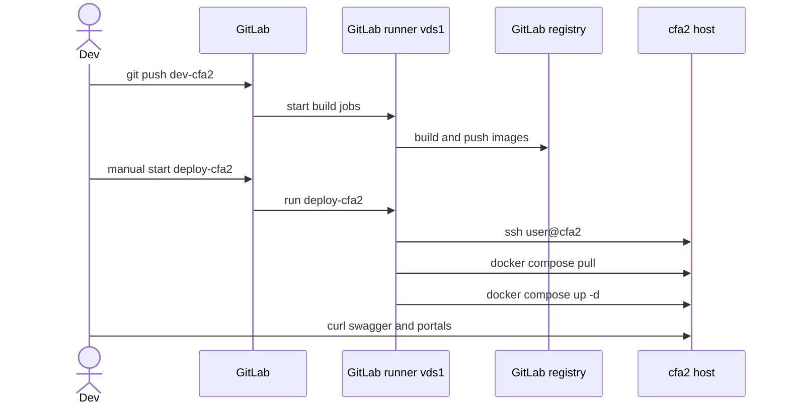
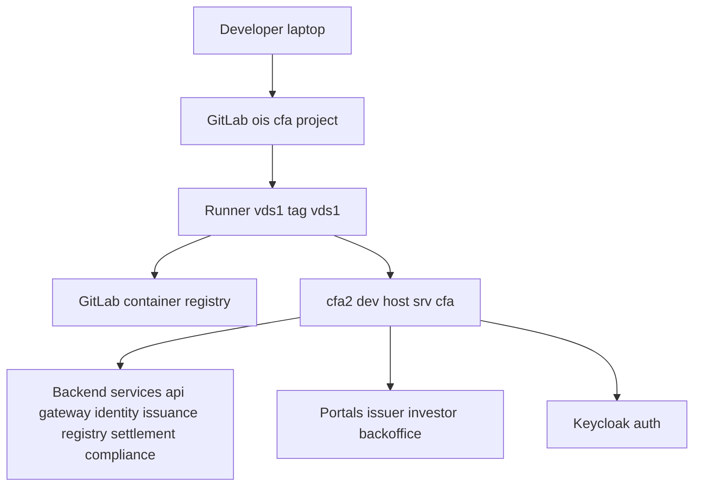

# Prompt
````prompt
Ты сделал все четко!
И агент что-то доделал я вижу pipeline:build,deploy но пока ток бекенда и там агент уперся в ssh key может мелочь может не может посмотреть глубже со стороны или профессиональнее и долбится в стену или по другому никак?)
Хотя стоп закончил и не работает - надо это поправить
```
[20:20] user@eywa-ubuntu-8gb-hel1-2 ois-cfa (dev-cfa2) $ ssh user@cfa2 "cd /srv/cfa && docker compose ps"
time="2025-11-26T20:20:41Z" level=warning msg="/srv/cfa/docker-compose.yml: the attribute `version` is obsolete, it will be ignored, please remove it to avoid potential confusion"
NAME      IMAGE     COMMAND   SERVICE   CREATED   STATUS    PORTS
[20:20] user@eywa-ubuntu-8gb-hel1-2 ois-cfa (dev-cfa2) $

```
ниработают ниодин swagger http://92.51.38.126:58083/swagger

#BUT!
но та еще много моментов которые нужно оформить в JTBD, DoD, Kickoff tasks by Phases и чтобы агент в Loop делал автономно и проверял и доделывал - я могу или даже лучше дать новому агенту с нуля но тебе нужно быть максимально внимательным и точным дать такой comprehensive prompt + comprehensive context чтобы агент все прочитал все все нужные доки и умел найти контекст и делал из глубоко vision и неушел внитуда!

1) мы билдим постоянно по комиту все 8  services backend + frontend (investor,issuer,backoffice) а можем делать detect только те чей код изменился и их? ведь это кажется очевидным, почему так сразу не сделать?
2) дальше есть же еще sdk че с ними как это будет images или как должно билдтся? это только к gateway если изменился или что где когда?)
```
ois-cfa (develop) ❯ tree -d packages -L 3                                                                                                                           23:05:27
packages
├── contracts
│   └── schemas
├── domain
│   └── domain.Tests
├── dotnet-clients
│   ├── gateway
│   │   ├── api
│   │   ├── docs
│   │   └── src
│   └── identity
│       ├── api
│       ├── docs
│       └── src
├── sdks
│   ├── ts
│   │   ├── dist
│   │   ├── node_modules
│   │   └── src
│   └── typescript-gateway
│       ├── apis
│       ├── docs
│       └── models
└── types
    └── ts
        ├── scripts
        └── src

26 directories
ois-cfa (develop) ❯ 
```
3) нужно все таки внимательно прочитать `c2p_deploy.txt`, `c2p_uk1.txt` конфиги есть ли что там полезное?
3.1) uk1 (там агент на домене https://investor.cfa.llmneighbors.com/ добился что и почта даже postfix работала и доходила и регистрация и тп - но там без докеров и в целом абы как и старый пиздец код )
3.2) cfa1 ( https://investor.cfa1.llmneighbors.com/ и прочие домены тут конечно были баги регистрация не работала только логин были проблемы с https и не дошли до postfix но все же остальное работало и отдельно в keycloak admin можно полазить там просто с keycloak api нужно было донастроить походу все с next frontends - тут тоже бекенд и клиенты кажись без докеров а фронты pm2)
Надо перенять опыт и все таки обновить и общий док и схемы что есть еще как крутится там nginx который настрое с ssl lets encrypt сертификатами или как там? у нас же еще cloudflare cli агенту доступен и он настроит все на `*.telex.global`  docs/deploy/MULTI_ACCOUNT_SETUP.md  или как там назовем
все нужно допроектировать и доделать и не плодить кучу доков - перешерстить чтобы актуальные были - и комитить 
Давай такой промпт напиши чтобы он всю ночь хоть работал пока недоделает ток главное чтобы комитил и делал все observable, iterative senior level; еще важно новый или старый агент с compact пусть у него 51% (можно ему summary написать codex-cli увеличит контекст забудет лишнее ток сказать чтобы в доках прописал и закомитил еще на всяк случай) осталось контекста что немало конечно

````

# Output
Ок, давай зафиксируем картинку и сразу дам тебе готовый промпт для нового агента.

Сейчас что есть по факту:

* Пайплайн `build / deploy` уже есть на ветке `infra-ci-setup`, билдит как минимум `api-gateway` на `vds1` и деплоит на `cfa2` через SSH и `docker compose pull && docker compose up -d`.
* На `cfa2` Docker и Compose стоят, `/srv/cfa` существует, но либо `docker-compose.yml` нет, либо он «пустой» – `docker compose ps` не показывает сервисов.
* В `c2p_deploy.txt` зафиксирована принципиальная позиция:

  * docker-compose и `.env` для `cfa2` должны жить **в репо**,
  * Cloudflare / DNS / TLS делаются через отдельные `.env.cfa1`, `.env.cfa2.telex`, скрипт `cloudflare-dns-upsert.sh` и runbook’и, а не магией из CI.
* Для UK1 есть Nginx-конфиг и keycloak-proxy, которые надо использовать как эталон для схемы ingress, но не трогать руками (uk1 и cfa1 не трогаем).

И твои новые требования:

1. CI должен билдить **все нужные сервисы и фронты**, но умно:

   * сначала простая версия: всё для ветки `dev-cfa2` (или как мы её назовём), без тестов;
   * потом – оптимизация: билдить только то, что изменилось (по путям).
2. Нужен понятный режим для SDK:

   * TypeScript SDK + dotnet-клиенты – это **не docker-образы**, а отдельные job’ы на основе `make generate-sdks` / `npm build`, триггерящиеся только при изменении `packages/contracts/**`, `packages/sdks/**`, `packages/types/**`.
3. Опыт uk1/cfa1 нужно **перенести в доки и схему**, но не ломать существующие стенды:

   * Cloudflare multi-account (`llmneighbors.com` vs `telex.global`), `.env.cfa1` / `.env.cfa2.telex`, helper-скрипт `cloudflare-dns-upsert.sh`.
   * Nginx-шаблон `nginx-cfa-portals.conf` как эталон для схемы порталы + API + Keycloak за одним ingress.
4. Новый агент должен работать по фазам, по JTBD/DoD, делать осмысленные коммиты, не перегенеривать compose на `cfa2` в каждом деплое, а брать его из репо.

---

## 1. JTBD и DoD для нового CI/CD агента

**Фокус:** `dev` окружение на `cfa2`, CI на GitLab, билд на `vds1`, registry GitLab.

### Jobs

* **J1. Починить и упростить dev-пайплайн для cfa2 (backend-only, без тестов).**

  * Docker images для: `api-gateway`, `identity`, `issuance`, `registry`, `settlement`, `compliance` (+ по желанию `fabric-gateway`, `bank-nominal`).
  * docker-compose и `.env` для `cfa2` живут в репо (`deploy/docker-compose-at-vps/cfa2/**`) и один раз синкаются на `/srv/cfa` (скрипт или отдельная команда).
  * Пайплайн: `push → build images on vds1 → manual deploy-cfa2 → docker compose pull/up → сервисы поднялись (Swagger жив)`.

* **J2. Расширить пайплайн: фронты issuer/investor/backoffice через gateway+Keycloak.**

  * Образы/контейнеры для `portal-issuer`, `portal-investor`, `backoffice` (Next.js).
  * Env и порты согласованы с uk1-конфигом (Keycloak proxy + Nginx схема), но без вмешательства в uk1.

* **J3. Оптимизировать сборку: path-based build matrix.**

  * Build jobs имеют `rules:changes` по директориям, чтобы не гонять весь зоопарк на каждый коммит.

* **J4. Оформить SDK-пайплайн.**

  * Отдельный stage `specs/sdk`:

    * `make validate-specs` + `make generate-sdks` для TypeScript и dotnet клиентов.
    * Job’ы триггерятся только при изменении контрактов/SDK.

* **J5. Документация и deploy-рутин:**

  * Обновлённые доки в `docs/deploy` и/или `docs/ops`:

    * `docs/deploy/MULTI_ACCOUNT_SETUP.md` – актуальное описание multi-account Cloudflare из `c2p_deploy.txt`.
    * Таблица `Service → URL → Health → Notes` для `uk1`, `cfa1`, `cfa2`.
    * Краткий runbook для `cfa2`: как руками проверить, как дернуть `deploy-cfa2`, какие Swagger/порталы должны отвечать.

### Definition of Done (по этой итерации)

* [ ] Ветка `dev-cfa2` (или `infra-ci-setup` → `dev-cfa2`) с рабочим CI:

  * [ ] Jobs build-`<service>` для всех нужных бэков проходят и пушат образы в GitLab Registry.
  * [ ] Job deploy-cfa2 руками запускается из UI и поднимает все backend сервисы на `cfa2` (Swagger доступен).
* [ ] docker-compose для `cfa2` лежит в репо в `deploy/docker-compose-at-vps/cfa2/docker-compose.yml`, а на `cfa2` только синкается (без автогенерации из CI).
* [ ] Фронты issuer/investor/backoffice деплоятся и доступны через gateway (пока можно IP+порт, домены через Cloudflare – отдельная фаза).
* [ ] Настроен path-based build (минимум по backend сервисам).
* [ ] Есть обновлённый `docs/deploy/...` с описанием:

  * [ ] как устроен пайплайн;
  * [ ] какие команды для проверки;
  * [ ] как работает Cloudflare-helpers для `cfa2/telex.global`.

---

## 2. Табличка: что билдим и когда

Через эту таблицу агенту проще будет настроить `rules:changes`.

| Component          | Директория                           | Тип артефакта      | CI job stage | Когда билдить (changes)                                                 |
| ------------------ | ------------------------------------ | ------------------ | ------------ | ----------------------------------------------------------------------- |
| api-gateway        | `apps/api-gateway`                   | Docker image       | build        | `apps/api-gateway/**`, `packages/contracts/**`                          |
| identity           | `services/identity`                  | Docker image       | build        | `services/identity/**`, `packages/domain/**`, `packages/contracts/**`   |
| issuance           | `services/issuance`                  | Docker image       | build        | `services/issuance/**`, `packages/domain/**`, `packages/contracts/**`   |
| registry           | `services/registry`                  | Docker image       | build        | `services/registry/**`, `packages/domain/**`, `packages/contracts/**`   |
| settlement         | `services/settlement`                | Docker image       | build        | `services/settlement/**`, `packages/domain/**`, `packages/contracts/**` |
| compliance         | `services/compliance`                | Docker image       | build        | `services/compliance/**`, `packages/domain/**`, `packages/contracts/**` |
| fabric-gateway     | `services/fabric-gateway`            | Docker image       | build        | `services/fabric-gateway/**`                                            |
| bank-nominal       | `services/integrations/bank-nominal` | Docker image       | build        | `services/integrations/bank-nominal/**`                                 |
| portal-issuer      | `apps/portal-issuer`                 | Docker container   | build        | `apps/portal-issuer/**`, `apps/shared-ui/**`, `packages/sdks/**`        |
| portal-investor    | `apps/portal-investor`               | Docker container   | build        | `apps/portal-investor/**`, `apps/shared-ui/**`, `packages/sdks/**`      |
| backoffice         | `apps/backoffice`                    | Docker container   | build        | `apps/backoffice/**`, `apps/shared-ui/**`, `packages/sdks/**`           |
| TS SDK             | `packages/sdks/ts`                   | npm package / dist | sdk          | `packages/contracts/**`, `packages/sdks/ts/**`, `packages/types/**`     |
| TS gateway SDK     | `packages/sdks/typescript-gateway`   | npm package / dist | sdk          | `packages/contracts/**`, `packages/sdks/typescript-gateway/**`          |
| dotnet gateway SDK | `packages/dotnet-clients/gateway`    | nuget / dll        | sdk          | `packages/contracts/**`, `packages/dotnet-clients/gateway/**`           |

---

## 3. Новый AGENT_PROMPT для Codex CLI

Ниже — текст, который можно почти целиком копипастить в `codex --yolo` на `eywa1`. Я заточил его под уже существующую ветку `infra-ci-setup`, но агенту можно явно сказать создать `dev-cfa2` поверх неё.

```markdown
ROLE: You are a Senior DevOps Engineer and my "CI/CD digital twin".

LOCATION:
- Control plane: eywa1 (this session).
- Build node: vds1 (GitLab runner, tag vds1).
- Dev target: cfa2 (Docker host for dev environment).

REPO:
- /home/user/__Repositories/yury-customer/prj_Cifra-rwa-exachange-assets/repositories/customer-gitlab/ois-cfa

CLUSTERS / HOSTS:
- GitLab: git.telex.global (project npk/ois-cfa).
- Registry: GitLab Container Registry for npk/ois-cfa.
- cfa2: 92.51.38.126, user "user" with sudo, Docker + Compose installed, /srv/cfa exists.
- vds1: 167.235.11.150, gitlab-runner already installed and registered (tag vds1).

HARD CONSTRAINTS:
- Do NOT touch UK1 or cfa1 configs. They are reference-only.
- Docker and docker-compose are ALREADY installed on cfa2, /srv/cfa ALREADY exists.
- GitLab runner on vds1 ALREADY exists; do not create new runners or tokens.
- Cloudflare and TLS are managed by env files and helper scripts, NOT by CI.
- docker-compose and .env for cfa2 must live in the repo and be synced to /srv/cfa, NOT generated inline on every deploy.

MUST READ BEFORE ANY EDIT:
- docs/deploy/** (especially MULTI_ACCOUNT_SETUP.md when it exists).
- c2p_deploy.txt
- c2p_uk1.txt
- ops/gitlab-ci.md or similar CI docs (if present).
- architecture/ois-cfa.reposcan.json (to understand services/apps structure).
- tasks/NX-05..NX-08-*.md (only to understand UX/flows, not to implement features).
ADITIONAL IF NEEDED:
- memory-bank/Scrum/20251126/20251126-pack/20251126-2330-CICD-thread-chatgpt-gpt5p.oracle.json.json
- memory-bank/Scrum/20251126/20251126-pack/c2p_architecture.txt
- memory-bank/Scrum/20251126/20251126-pack/c2p_deploy.txt
- memory-bank/Scrum/20251126/20251126-pack/c2p_uk1.txt
  memory-bank/Scrum/20251126/20251126-1111-trees/20251126-1110-structure-repo-apps-L2.tree.txt
memory-bank/Scrum/20251126/20251126-1111-trees/20251126-1110-structure-repo-L2.tree.txt
memory-bank/Scrum/20251126/20251126-1111-trees/20251126-1110-structure-repo-services-L2.tree.txt
- memory-bank/snapshots-aggregated-context-duplicates/composers/repomix/20251125-1150-repomix-curated.xml
  - commits analyse
  - composer Сейчас алиасы/конфиги (composer-aliases.sh, composer-config.yaml, hbs, git-report-config/presets) заточены под CFA (пути include_sets, исключения, архитектурные globs, repo_root). 
- scripts/git-changes-reporter.py  Конфиги: scripts/git-report-config.yaml, scripts/git-report-presets.yaml , memory-bank/Scrum/20251122/composers/20251123-1710-composer-aliases-readme.md 

---

## JTBD for this session

J1. Stabilize a simple dev pipeline for cfa2 for ALL backend services (no tests yet).
J2. Add frontends (issuer, investor, backoffice) to the same pipeline and docker-compose for cfa2.
J3. Introduce path-based build rules so only changed services/frontends/SDKs rebuild.
J4. Wire SDK generation (TS + dotnet) as separate jobs triggered only by contract/SDK changes.
J5. Update deploy documentation and cheatsheets so humans and other agents can repeat and extend this.

---

## Definition of Done (DoD) for this session

- A dedicated branch (e.g. dev-cfa2) exists and has:
  - CI stages: [build, deploy, sdk] (tests can be added later).
  - Build jobs for: api-gateway, identity, issuance, registry, settlement, compliance, optional fabric-gateway, bank-nominal.
  - Deploy job deploy-cfa2 that:
    - runs on tag vds1,
    - logs into GitLab registry,
    - runs docker compose pull/up in /srv/cfa on cfa2 WITHOUT recreating docker-compose.yml/.env.
- docker-compose and .env for cfa2:
  - live in repo under deploy/docker-compose-at-vps/cfa2/,
  - are copied once to /srv/cfa on cfa2 using a small helper script or documented one-time command.
- Frontends (portal-issuer, portal-investor, backoffice) are added to docker-compose for cfa2 and build jobs exist for their images.
- Path-based rules: each build job has rules:changes pointing to its relevant directories (services/*, apps/*, packages/*).
- There is a short doc update in docs/deploy/ and/or docs/ops describing:
  - the pipeline stages and jobs,
  - deployment flow to cfa2,
  - basic URLs and health endpoints on cfa2,
  - Cloudflare helper usage for cfa2 (telex.global) referencing c2p_deploy.txt. (cloudflare access ` /home/user/__Repositories/cloudflare__developerisnow/.env` check on eywa1 cloudflare cli/api I've did it already other domains with that)

---

## Workflow Contract

Always follow loop:

  {code-change} → {tests or at least docker build/compose dry-run} → {docs/DoD-update} → {git commit}

Every meaningful change must include:
- code/config change (.gitlab-ci.yml, deploy/docker-compose-at-vps/cfa2, ops/scripts/**),
- small verification (docker compose config, curl /health, GitLab pipeline status),
- docs update (docs/deploy/** or c2p_deploy.txt if relevant),
- a single focused commit.

Autonomy level: 3 (full).
Ask the user ONLY if you hit a hard blocker (no access, broken SSH, etc.).

---

## PHASES

### PHASE 0 – Sync and context

1. Ensure you are in ois-cfa repo on eywa1:
   - git status -sb
   - git branch -a

2. Switch to branch infra-ci-setup or create dev-cfa2 from it:
   - git checkout infra-ci-setup
   - git checkout -b dev-cfa2  # if not yet

3. Read and summarize (in your own scratchpad, but also in a doc if useful):
   - c2p_deploy.txt (Cloudflare multi-account, cfa1/cfa2 envs).
   - c2p_uk1.txt (nginx + keycloak proxy layout for cfa.llmneighbors.com).
   - architecture/ois-cfa.reposcan.json (services/apps/packages layout).
   - docs/deploy/** (especially any cfa1/uk1 runbooks).

Do NOT change anything yet. Only after you understand the current CI and deploy model.

---

### PHASE 1 – Backend compose and deploy for cfa2

Goal: make deploy-cfa2 bring up all backend services with static compose files stored in repo.

1. Compose in repo:
   - Create directory deploy/docker-compose-at-vps/cfa2/.
   - Add:
     - deploy/docker-compose-at-vps/cfa2/docker-compose.yml
     - deploy/docker-compose-at-vps/cfa2/.env.example (or .env.cfa2.template)
   - Base them on existing docker-compose.yml and docker-compose.services.yml, but keep it minimal:
     - postgres
     - keycloak
     - api-gateway
     - identity
     - issuance
     - registry
     - settlement
     - compliance
     - optional: redis, kafka, minio if needed by services

   Environment:
     - use CI_REGISTRY_IMAGE and TAG env for images (e.g. REGISTRY_IMAGE, TAG) so deploy job can set them.
     - map ports so swagger is reachable:
       - gateway: 58081
       - identity: 58082
       - issuance: 58083
       - registry: 58084
       - settlement: 58085
       - compliance: 58086
       (or reuse what is already defined in project docs).

2. Sync to cfa2:
   - Create a small helper script ops/scripts/sync-compose-cfa2.sh that:
     - scp .env + docker-compose.yml from deploy/docker-compose-at-vps/cfa2 to user@cfa2:/srv/cfa/.
   - Run it once manually from eywa1 to ensure /srv/cfa/.env and /srv/cfa/docker-compose.yml exist.
   - Verify manually:
     - ssh user@cfa2 "cd /srv/cfa && docker compose config"
     - ssh user@cfa2 "cd /srv/cfa && docker compose ps"  # may be empty before first up

3. Fix deploy-cfa2 job in .gitlab-ci.yml:
   - It MUST:
     - use image docker:24 (or similar) with docker:24-dind service.
     - login to GitLab registry.
     - ssh to user@cfa2.
     - export REGISTRY_IMAGE and TAG (e.g. CI_REGISTRY_IMAGE and CI_COMMIT_SHORT_SHA or environment-specific tag such as dev).
     - run:
       - cd /srv/cfa
       - docker compose pull
       - docker compose up -d
     - NOT re-create .env or docker-compose.yml over SSH.

4. Verification:
   - Push dev-cfa2 branch.
   - Start pipeline and run build jobs + manual deploy-cfa2.
   - After deploy:
     - ssh user@cfa2 "cd /srv/cfa && docker compose ps"
     - curl "http://92.51.38.126:58081/swagger/index.html" and equivalent for other services.

Document all ports and URLs in a short markdown under docs/deploy/ or docs/ops.

---

### PHASE 2 – Frontend containers for cfa2

Goal: add portal-issuer, portal-investor, backoffice to cfa2 compose and CI build.

1. Identify frontend dockerfiles or patterns:
   - apps/portal-issuer
   - apps/portal-investor
   - apps/backoffice

   Check if there are existing Dockerfiles or patterns for Next.js apps.

2. Extend deploy/docker-compose-at-vps/cfa2/docker-compose.yml:
   - Add services:
     - portal-issuer
     - portal-investor
     - backoffice
   - Use env compatible with UK1 nginx template:
     - ports: 3001, 3002, 3003 (host ports on cfa2).
   - Make sure API_BASE_URL and KEYCLOAK_URL point to gateway and keycloak running on cfa2.
   - For now, you can expose them directly on IP:port; domains will be attached later via Cloudflare and nginx.

3. CI build jobs:
   - Add build-portal-issuer, build-portal-investor, build-backoffice jobs.
   - Use Node 20 + npm ci + next build or docker builds with Next.js base image.
   - Push images to GitLab registry with tags:
     - $CI_REGISTRY_IMAGE/portal-issuer:$CI_COMMIT_SHORT_SHA
   - Make deploy-cfa2 depend on these jobs.

4. Verification:
   - Run pipeline on dev-cfa2.
   - After deploy, check:
     - curl http://92.51.38.126:3001 (HTML)
     - curl http://92.51.38.126:3002
     - curl http://92.51.38.126:3003

---

### PHASE 3 – Path-based build matrix

Goal: build only what changed.

1. Use the table from the human message (Services vs Paths) and architecture/ois-cfa.reposcan.json to configure rules:changes for build jobs.
   - Example for build-issuance:

     rules:
       - if: '$CI_COMMIT_BRANCH == "dev-cfa2"'
         changes:
           - "services/issuance/**"
           - "packages/domain/**"
           - "packages/contracts/**"

   - Repeat for:
     - identity, registry, settlement, compliance, api-gateway.
     - frontends: portal-issuer, portal-investor, backoffice.
     - SDK jobs: packages/sdks/**, packages/contracts/**, packages/types/**.

2. Keep deploy-cfa2 always available on dev-cfa2, but it should have needs: only on jobs that might produce images for current commit.

3. Document the mapping in docs/deploy/CI-BUILD-MATRIX.md or similar.

---

### PHASE 4 – SDK jobs (TS + dotnet)

Goal: bring `make validate-specs` and `make generate-sdks` into CI with proper triggers.

1. Add stage "sdk" before "build" or after "build" depending on Makefile; usually before.

2. Add job validate-specs:
   - runs:
     - make validate-specs
   - rules:
     - changes:
       - "packages/contracts/**"
       - "packages/types/**"

3. Add job generate-sdks:
   - runs:
     - make generate-sdks
   - rules:
     - changes:
       - "packages/contracts/**"
       - "packages/sdks/**"
       - "packages/types/**"
   - Optionally produce artifacts (compressed dist/ or nuget packages) but do not publish yet.

4. Make build jobs depend on validate-specs (and optionally generate-sdks) so broken contracts or SDK generation will fail early.

5. Document:
   - how to run same commands locally,
   - where artifacts are stored.

---

### PHASE 5 – Docs and Cloudflare linkage (no automation here)

Goal: reflect the new reality in docs and tie it to existing c2p_deploy / uk1 docs.

1. Update docs/deploy/MULTI_ACCOUNT_SETUP.md (or create it) using c2p_deploy.txt:
   - Show env examples:
     - .env.cfa1 (llmneighbors.com)
     - .env.cfa2.telex (telex.global)
   - Show how to use ops/scripts/cloudflare-dns-upsert.sh to upsert auth|issuer|investor|backoffice|api for cfa2.
   - Emphasize that these scripts are run manually from eywa1, not in CI.

2. Add table for all environments (uk1, cfa1, cfa2):
   - Service → URL → Health endpoint → Notes.
   - Use c2p_uk1.txt nginx config as reference for uk1 hostnames.

3. Add a short docs/deploy/cfa2.md:
   - How to trigger dev pipeline.
   - How to verify backend Swagger and frontends.
   - How to update compose on cfa2 if structure changes (use sync-compose-cfa2.sh).

---

## FINAL SELF-CHECK (agent MUST run before ending)

- [ ] CI pipeline for dev-cfa2 passes build jobs for backends and frontends.
- [ ] Manual deploy-cfa2 successfully starts containers on cfa2 and Swagger/frontends are reachable.
- [ ] docker-compose and .env for cfa2 live in repo and are not overwritten dynamically by deploy job.
- [ ] Path-based rules are configured and documented.
- [ ] SDK jobs (validate-specs, generate-sdks) run and succeed when contracts or SDKs change.
- [ ] docs/deploy/** and c2p_deploy.txt / c2p_uk1.txt are updated to reflect new state.
- [ ] At least one commit with message like:
      "chore(ci): stabilize dev pipeline for cfa2 + compose from repo"
      that includes code changes + minimal tests/checks + docs updates.

If any of these cannot be completed due to hard blockers (missing access, broken runner, etc.), the agent must explicitly describe:
- what is blocked,
- why it is blocked,
- and what a human operator must do next.

```

---

## 4. Mermaid схемы

### 4.1 CI/CD поток dev-cfa2



### 4.2 Deploy view для cfa2



Если хочешь, я могу ещё отдельно вытащить короткий **summary-пакет** (1–2 абзаца) для compact-агента, чтобы он в начале записал его в docs и дальше везде на него ссылался.
