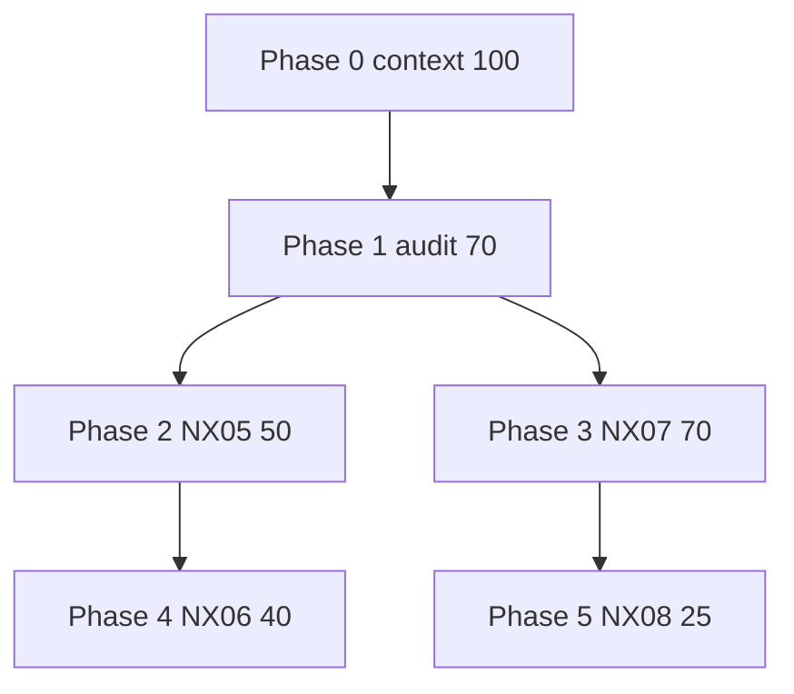
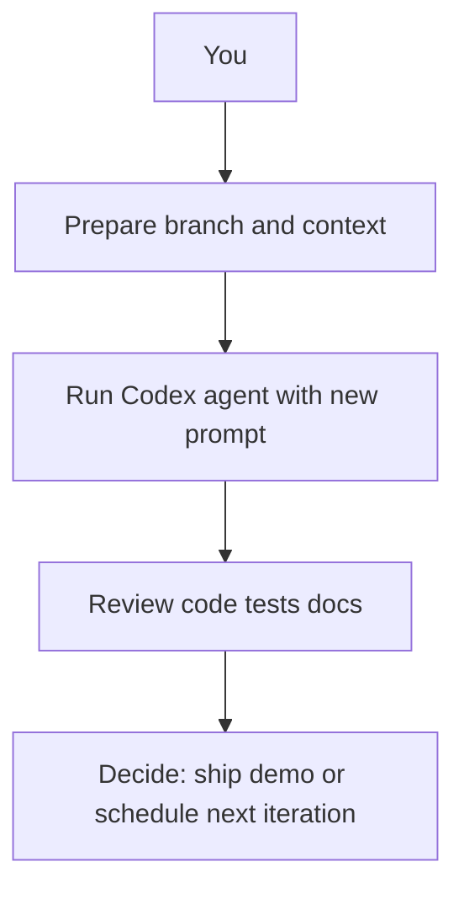
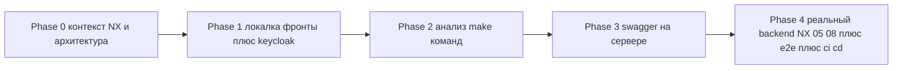
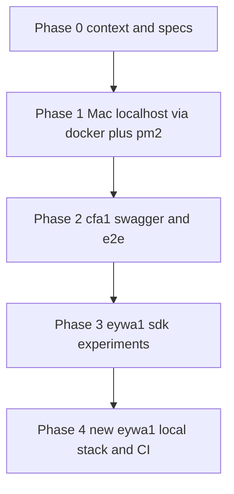
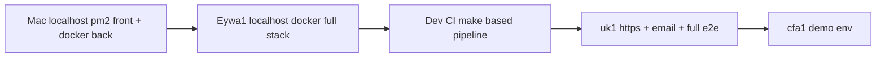
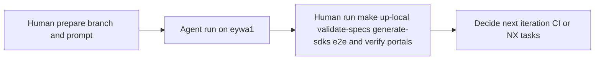
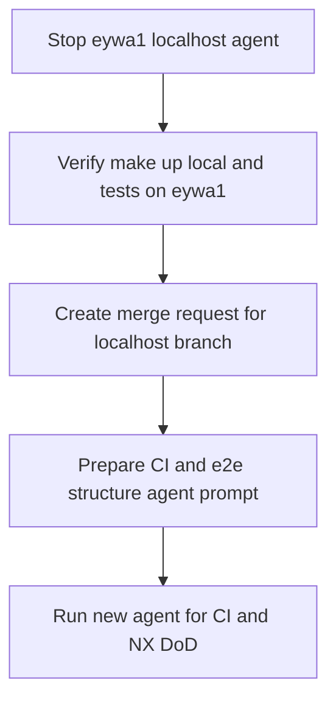
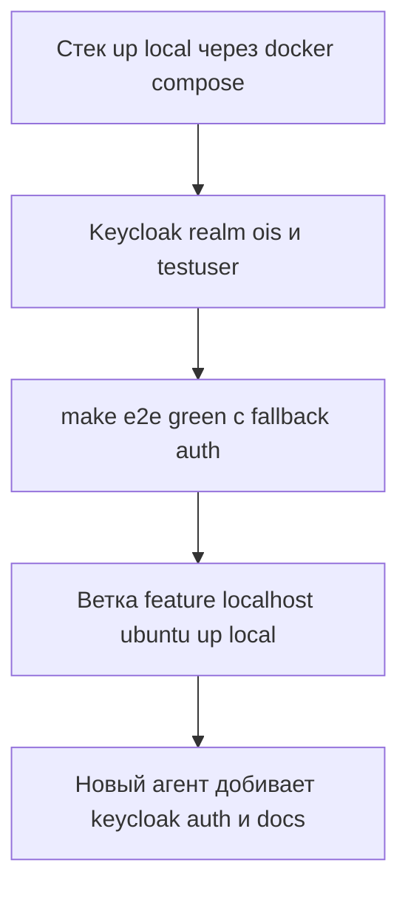
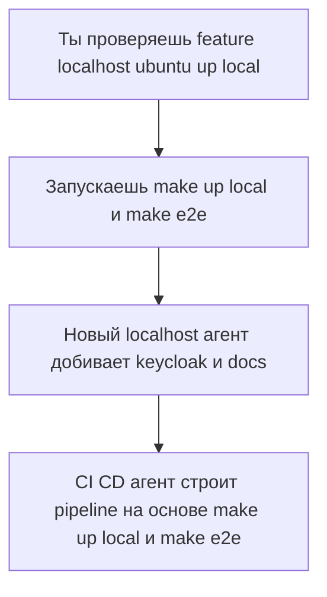
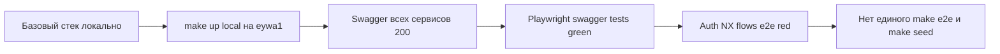

# Оценка текущей итерации

#### You:
<time datetime="2025-11-26T06:47:10.924Z" title="26/11/2025, 09:47:10">09:47</time>

ROLE: You are Oracle, a focused one-shot problem solver. Emphasize direct answers, cite any files referenced, and clearly note when the search tool was used

Additional roles a composite AI: Evaluator, Teacher, Advisor. Brainstorm only on explicit /brainstorm. Worker is advisory-only: propose exact steps, commands, file edits; DO NOT write full production code unless explicitly asked. Help me ADHD-friendly.

<ORACLE_GENERAL_RECOMMENDATIONS>
- Следуй предыдущей канве и контексту. Будь объективен и непредвзят.
- Не подстраивайся под мои прошлые ошибки, если они противоречат Spec/DoD.
- Если новые требования конфликтуют со старыми — явно укажи на конфликт и предложи варианты разрешения.
- Не оптимизируй под «сделать поменьше», оптимизируй под закрытие JTBD.
</ORACLE_GENERAL_RECOMMENDATIONS>

First Attentionally read current session and increments, evaluate with a previous DoD, Kickoff tasks by phases and score X-of-100 and estimate final session iteration/step 0...100% completeness and accuracy of a agentID=`uid`, partAgentID=`partUid` model `Codex-Gpt5.1-Max-Highest`


Then based on new insights and undersanding listen me attentively.
Выдели из моего голосового сообщения все requirements, corrections, suggestions from my voice instructions and corrections.

<AGENT_AND_ORACLE_SESSION_STATE>
SESSION_STATE (machine-readable):
- branch: $BRANCH
- JTBD:
  - J1: $J1_TITLE
    - status: in_progress
    - DoD:
      - [x] $DoD_1
      - [ ] $DoD_2 e2e (if applicable Playwright scenarios green)
      - [ ] $DoD_3 tasks/NX-05..08-*.md обновлены
- Tests:
  - ...
  - ...
- Blockers:
  - none
</AGENT_AND_ORACLE_SESSION_STATE>

# Common Agentic Problems which should be must take into account in the prompt-copypaste to the Agent.
- [ ] QA. Не проверяет работу
  - [ ] e2e tests (if applicable to our case)
  - [ ] e2e playwright test (if applicable to our case)
  - [ ] проверять на реальных данных, а не на mock (if applicable to our case)
  - [ ] не делать fallback
  - [ ] обозначать правду. Блокеры или невозможно реализовать потому что  ...
- [ ] Git workflow.
  - [ ] commit
    - [ ] increment in one time one commit - not all together. Постоянно забывает комитить. 
      - [ ] Желательно комитить так чтобы было {code-change} + {code-test} + {test-artefacts/output} + {update-docs-DoD-Kickoff-checkboxes} в одном коммите чтобы видеть. Пример изменил service/rout + add e2e test + store playwright-screenshot of success work.

<AGENT_WORKFLOW_CONTRACT>
# Workflow Contract
1. PLAN
   - Сопоставь текущий state с JTBD Contract и DoD.
   - Сформируй мини-план на 1–3 цикла вида:
     {code-change} → {tests} → {docs/DoD-update} → {commit}.

2. EXECUTE
   - Выполни код-изменения.
   - Запусти соответствующие тесты (unit/integration/smoke/e2e/Playwright).
   - Обнови docs/tasks/DoD.

3. AUDIT SELF
   - Явно проверь чек-лист «Common Agentic Problems».
   - Отметь, какие пункты выполнены, а какие нет (с причинами).

4. CONTINUE OR STOP
   - Если DoD не закрыт и нет блокеров — повтори LOOP без общения с пользователем.
   - Если DoD закрыт или найден блокер — верни расширенный отчёт + список следующих шагов.
</AGENT_WORKFLOW_CONTRACT>

<AGENT_TIME_EXECUTION_CONSTRAINTS>
Session Constraints:
- Минимум:
  - [ ] 2 полных WORKFLOW LOOP для основного JTBD
  - [ ] хотя бы один запуск тестов (unit/интеграционные) + один e2e/Playwright (если применимо)
- Максимум:
  - [ ] Останавливайся, когда:
        - [ ] все пункты DoD выполнены ИЛИ
        - [ ] встречен жёсткий блокер, который нельзя обойти локальной симуляцией/заглушкой.
Тебе запрещено завершать работу только потому, что:
- «изменений много»,
- «надо уточнить у пользователя, нравится ли такой UI/текст».
В этих случаях: сделай разумный выбор, явно зафиксируй допущения в таске и продолжай реализацию.
</AGENT_TIME_EXECUTION_CONSTRAINTS>

<AGENT_JTBD_CONTRACT>
# JTBD Contract
## Jobs
- J1: Починить  $tasks NX-05..08 на ветке $branch
- J2: Обеспечить e2e success path 
- J3: Обновить $tasks с финальным DoD
## Definition of Done (DoD)
- [ ] Для каждого J* есть минимум один коммит формата:
      {code-change} + {code-test} + {test-artifacts/output} + {update-docs-DoD-Kickoff-checkboxes}
- [ ] Все модифицированные сервисы успешно стартуют локально
- [ ] Прогнаны и зафиксированы:
      - [ ] unit/integration tests
      - [ ] e2e / Playwright (если применимо)
- [ ] tasks/NX-05..08-*.md обновлены с:
      - [ ] реальными URL
      - [ ] командами тестов
      - [ ] ссылками на артефакты (скриншоты, логи)
</AGENT_JTBD_CONTRACT>

<AGENT_FINAL_SELF_CHECK>
В каждый AGENT_PROMPT включай блок:
>
> ```markdown
> FINAL SELF-CHECK (обязателен перед завершением сессии)
>
> - [ ] QA: все изменения покрыты тестами (unit/integration/smoke/e2e/Playwright, если применимо)
> - [ ] Тесты прогнаны на реальных/приближенных к реальным данных
> - [ ] Падения/регрессии явно зафиксированы, нет «тихого» фоллбэка
> - [ ] Честно описаны блокеры ("невозможно реализовать, потому что …")
> - [ ] Git: сделан(ы) осмысленный(е) commit(ы) формата:
>       {code-change} + {code-test} + {test-artifacts/output} + {update-docs-DoD-Kickoff-checkboxes}
> ```
>
> Агент не имеет права считать работу завершённой, пока не пройдёт этот чек‑лист.
</AGENT_FINAL_SELF_CHECK>


<AGENT_AUTONOMY_CONTRACT>
AUTONOMY & CONTINUITY REQUIREMENTS
- [ ] Работать итеративно до достижения DoD по всем активным JTBD
- [ ] Не останавливать работу после первых микрофиксов
- [ ] Выполнить минимум 1 полный LOOP {code-change + tests + docs/DoD + commit} на каждый JTBD
- [ ] Задавать вопросы пользователю ТОЛЬКО при жёстких блокерах
- [ ] Все допущения фиксировать в tasks/ или отдельном ASSUMPTIONS блоке
Autonomy Level: 3 (max)
Level 0 – только анализ, никаких изменений.
Level 1 – мелкие правки, без изменения контрактов и без новых тестов.
Level 2 – полноценные правки + тесты, но без изменения архитектуры/контрактов.
Level 3 – всё выше + право создавать/обновлять SPEC DIFF, docs, новые тестовые сценарии.
</AGENT_AUTONOMY_CONTRACT>

<AGENT_SESSION_STOP_CONDITIONS>
SESSION_STOP_CONDITIONS
Завершать сессию можно только если:
- [ ] DoD закрыт (все чек‑боксы выполнены), ИЛИ
- [ ] Есть жёсткий блокер, чётко описанный с контекстом и предложениями по обходу.
</AGENT_SESSION_STOP_CONDITIONS>

<ORACLE_OUTPUT_CONTRACT>
# OUTPUT FORMAT
1. SESSION_EVAL (если $SESSION=existing)
   - completeness_score: X/100
   - accuracy_score: Y/100
   - progress_pct: Z%
   - summary_by_phase: [...]
   -- ${MERMAID_DIAGRAM}
2. REQUIREMENTS_FROM_VOICE
   - explicit_requirements: [...]
   - implicit_requirements: [...]
   - corrections: [...]
   - suggestions: [...]
3. UPDATED_JTBD_CONTRACT
   - jobs: [...]
   - DoD: [...]
   - constraints: [...]
4. AGENT_PROMPT (for Codex-Cli)
   - <<<готовый текст для копипаста в агента>>>
5. NEXT_STEPS_FOR_HUMAN
   - [ ] что ты как orchestrator должен сделать до запуска агента
   - [ ] что проверить после
   - ${MERMAID_DIAGRAM}
p.s.
${MERMAID_DIAGRAM}=✅ Visual elements (mermaid/tables) when helpful across sections. 📊 Mermaid diagrams can span multiple H1 sections when showing process flow. Syntax MUST rules never use `(` `)` and other specsymbols it breaks memaidjs syntax.
</ORACLE_OUTPUT_CONTRACT>

#### ChatGPT:
<time datetime="2025-11-26T07:01:14.328Z" title="26/11/2025, 10:01:14">10:01</time>

1. SESSION\_EVAL\
   *(я использовал search‑tool по tmux‑сессиям, c2p\_* и repomix, см. ссылки ниже)\*

- **completeness\_score:** **45/100** – по J1 «починить NX‑05..08 на codex/fix-cfa1-regressions» относительно DoD в tasks и твоих Oracle‑контрактов.fileciteturn3file1turn5file12turn4file9
- **accuracy\_score:** **75/100** – агент в целом следовал фазам и ограничениям, но не довёл тесты и DoD/CHANGELOG.fileciteturn3file4turn5file5
- **progress\_pct (iteration completeness):** **45%** для текущей итерации J1–J3.

**summary\_by\_phase (CFA1, branch codex/fix-cfa1-regressions)**

- **Phase 0 – Context** — **\~100%**\
  Прочитаны PROJECT/FRONTEND/RULES‑доки, сервисные summary, NX‑05..08 таски, context‑calls и code2prompt‑снапшоты.fileciteturn5file12turn5file10turn2file15

- **Phase 1 – Audit NX‑05..08 & CFA1** — **\~70%**
  - Проверены worktrees и ветки по NX‑05/07/08, состояние CFA1 по основным URL `/issuer/dashboard`, `/reports`, `/backoffice/kyc/users/audit`.fileciteturn3file9turn5file12
  - Инвентаризирован Swagger/AsyncAPI (dev vs CFA1) и статус включения через `Swagger__Enabled`.fileciteturn5file11turn5file10
  - Но не везде честно обновлены блоки **Current status on CFA1 / Verified/Blocked** в `tasks/NX-05..08-*.md`.fileciteturn3file1turn5file5

- **Phase 2 – NX‑05 Issuer dashboard & reports** — **\~50%**
  - В issuer‑портале добавлены/обновлены страницы `dashboard`, `reports`, `payouts/schedule`, навигация через новый `issuerNav`, убраны часть моков в пользу SDK/gateway.fileciteturn4file3turn5file8
  - Контракты и SDK для отчётов подправлены, но нет полного SPEC DIFF и зелёных Playwright‑сценариев по issuer‑флоу.fileciteturn3file1turn5file17

- **Phase 3 – NX‑07 Backoffice KYC & User registry** — **\~70%**
  - Identity/Compliance OpenAPI дополнены KYC‑моделями, SDK сгенерен; backoffice `/kyc` строит список задач и использует реальные API, а не чистые моки.fileciteturn4file3turn4file13turn4file18
  - Но KYC Playwright‑флоу (investor submit → backoffice approve → registry reflect) не доведён до зелёного статуса, SPEC‑DIFF и DoD по NX‑07 не финализированы.fileciteturn3file1turn5file11

- **Phase 4 – NX‑06 Issuer payout schedule** — **\~40%**
  - В контрактах и AsyncAPI присутствуют payout‑события и `scheduleJson` в issuance, но демо‑issuance с валидным расписанием и стабильный UI‑таб не зафиксированы в DoD/таске.fileciteturn4file18turn5file12
  - Нет рабочих e2e по payout‑schedule и честного статуса по CFA1.fileciteturn3file1

- **Phase 5 – NX‑08 Audit + Swagger/AsyncAPI + CHANGELOG** — **\~25%**
  - Обновлён `API-DOCS-SWAGGER-ASYNCAPI.md` до 1.0.0, описаны dev vs CFA1 URL и flags `Swagger__Enabled`/`Kafka__Enabled`.fileciteturn5file10turn5file11
  - В NX‑08‑таске есть блок про текущее состояние `/v1/audit` (401/пустые данные) и то, что UI работает скорее в mock‑режиме.fileciteturn3file1turn4file12
  - Но нет: реальных audit‑events на CFA1, e2e сценария `/backoffice/audit`, финального UPDATE в `CHANGELOG.md` и CFA1‑DoD‑чеклисте.fileciteturn3file1turn4file4turn5file11

**Итог по итерации агента Codex‑Gpt5.1‑Max‑Highest (agentID=`uid`, partAgentID=`partUid`):**\
Текущая сессия закрыла контекст и большую часть аналитики, сильно продвинула NX‑07 и частично NX‑05, но оставила тесты и DoD/CHANGELOG на полдороге. Честная оценка — **\~45% от цели по J1–J3**, **точность \~75%** (соблюдение контрактов и ограничений, но недотянутый QA‑контур).fileciteturn3file1turn5file13



---

2. REQUIREMENTS\_FROM\_VOICE

\*(“Voice” = звонок 2025‑11‑24 17:00, тех‑синк 2025‑11‑25 13:30, tg‑чаты и твои устные комментарии, уже переписанные в Oracle/AGENT‑промпты и memory‑bank.)\*fileciteturn3file12turn4file7turn4file19

### explicit\_requirements

1. **MVP к 20/12 и фокус на 2 user flow**
   - Обязательный поток: **Issuer (директор завода) создаёт выпуск CFA → Backoffice (Борис) проверяет и отправляет в ЦФА‑депозитарий/DST**.
   - Опциональный: **Investor KYC + каталог + покупка по happy‑path**.fileciteturn3file12turn4file14

2. **NX‑05..08 – главный носитель DoD для демо**
   - В `tasks/NX-05..08-*.md` нужно зафиксировать: *Demo scope 20/12*, реальные URL, HTTP‑коды, статусы **Verified/Blocked**, команды тестов/e2e и ссылки на артефакты.fileciteturn5file4turn5file13

3. **Демо – фронтовое, не Swagger‑ориентированное**
   - Заказчик смотрит **UI**, а не Swagger; все заглушки и моки должны быть явно помечены в интерфейсе и DoD.fileciteturn4file14turn5file4

4. **Spec‑first + SPEC DIFF как единственный способ менять контракты**
   - OpenAPI/AsyncAPI/JSON Schema в `packages/contracts/*` — source of truth.
   - Любое изменение контрактов идёт через отдельный `*-SPEC-DIFF.md` в `tasks/`, а не через тихий патч в yaml.fileciteturn5file12turn4file9

5. **Branch‑policy и запрет на самостоятельный merge develop**
   - Integration: `develop` (мерджит Илья, его правки не ломать).
   - Work: `codex/fix-cfa1-regressions` — **без rebase**, конфликтные файлы закрывает Илья. Агент не трогает файлы, которые могут поломать merge‑стратегию.fileciteturn4file14turn5file13

6. **Жёсткий workflow: plan → code → tests → docs/DoD → commit**
   - Каждый J\* должен иметь коммит формата `{code-change} + {tests} + {artefacts/output} + {update-docs-DoD-Kickoff}`.fileciteturn5file13
   - Агент обязан вести явный план и чекбоксы, показывать, **что прочитал/запустил**, **что изменил**, **как проверил**.fileciteturn3file8turn5file5

7. **Минимальный QA‑контур, который должен быть зелёным или честно красным**
   - dotnet test по затронутым сервисам (compliance/issuance/settlement/identity).fileciteturn3file11turn5file13
   - Playwright: swagger‑availability, issuer dashboard/reports/payouts, backoffice kyc/users/audit, опционально investor KYC.fileciteturn5file11turn5file13turn5file10
   - `npx @asyncapi/cli validate packages/contracts/asyncapi.yaml` – зелёный или с понятными предупреждениями.fileciteturn4file13turn5file11turn3file13

8. **Локальная среда (develop2) должна подниматься по короткой инструкции**
   - Docker‑бэкенды: health=200 на 55000/55001/55005/55006/55008.
   - PM2: три фронта online на 3001/3002/3003 без дублей.
   - Keycloak realm `ois` с нужными clients/roles/users; логин issuer/investor/backoffice работает.fileciteturn4file11turn5file7turn3file6

9. **Отдельная зона ответственности – CI/CD и блокчейн‑контур**
   - Илья прямо просит: **“Надо тебе заняться CI/CD и поднять блокчейн часть, никто кроме тебя это не сделает”** – это отдельный job, не смешивать с NX‑05..08, но держать в roadmap.fileciteturn4file7

### implicit\_requirements

1. **Жёсткий скоуп из‑за 2 dev part‑time**
   - Всё, что не входит в два демо‑флоу и NX‑05..08 + минимальный QA/monitoring/CI/CD – в backlog/roadmap.fileciteturn3file12turn5file4

2. **Док‑шум не считается источником правды**
   - Огромные markdown‑файлы и старые фронтовые доки не должны управлять реализацией; основа — артефакт функционального анализа и контракты.fileciteturn4file4turn4file14

3. **Все “магические” ручные шаги по CFA1/eywa1 должны быть задокументированы**
   - В CHANGELOG / deploy‑docs надо описывать ручные docker‑команды и flags (`Swagger__Enabled`, `Kafka__Enabled`, ASPNETCORE\_ENVIRONMENT), чтобы их можно было воспроизвести.fileciteturn5file10turn5file11turn5file19

4. **Не убивать стабильность ради красивого кода**
   - Kafka может быть временно выключен для стабильности демо; главное – честно зафиксировать режимы и ограничения.fileciteturn5file11turn4file18

5. **Agent должен быть сам себе “ревьюером”**
   - Требование к FINAL SELF‑CHECK и отдельному Oracle‑аудиту после сессии означает, что от агента ждут честной фиксации проблем, а не “зелёной галочки любой ценой”.fileciteturn5file13turn3file19

### corrections (что явно переопределяет старые ожидания)

1. **“Сделать всё по спецификации” → “сделать демо к 20/12”**
   - Приоритет смещён от полного закрытия всех NX‑эпиков к **минимальному, но связному демо‑флоу** эмитент → бэк‑офис, инвестор — по остаточному принципу.fileciteturn3file12turn4file14

2. **“Больше доков” → “меньше markdown, больше контрактов”**
   - Раньше было давление на документацию; теперь прямо зафиксировано, что док‑шум вреден — опора на контракты и лаконичные tasks.fileciteturn5file13turn4file4

3. **“Swagger как demo” → “Swagger как вспомогательный инструмент”**
   - Swagger/AsyncAPI остаются важными, но demo для заказчика = UI‑флоу; Swagger – часть QA/diagnostics, а не цель.fileciteturn5file11turn5file4

4. **“Сделать всё самому” → “делегировать merge/конфликты Илье”**
   - Раньше были попытки самостоятельно решать конфликты; теперь прямо сказано: merge develop и сложные конфликты – зона Ильи.fileciteturn5file5turn4file14

### suggestions (из голоса: куда двигаться дальше)

1. **Использовать артефакт фронтового анализа как источник user stories**
   - Вместо 30k‑строчного markdown – брать поля/валидаторы/флоу из фронт‑анализа (develop/infra) и маппить их на NX‑эпики.fileciteturn4file14turn5file13

2. **Для анализа прогресса – смотреть git‑диапазоны и отчёты code2prompt**
   - Предлагается использовать `scripts/git-changes-reporter.py` и git‑логи по author `aa` для понимания, что реально менялось по KYC/NX‑05..08, а не пролистывать весь repo руками.fileciteturn5file17turn4file16

3. **CI/CD и блокчейн выделить в отдельный job c чётким DoD**
   - Не смешивать эти задачи с NX‑05..08; оформить отдельный J\* с DoD и планом, чтобы не размывать MVP.fileciteturn4file7turn3file12

4. **Локальную среду использовать как песочницу для Playwright‑сценариев**
   - Логика: довести login‑флоу и KYC в локальной среде (develop2 + Keycloak) до стабильного зелёного состояния, а затем переносить сценарии на CFA1.fileciteturn5file16turn4file11turn3file6

---

3. UPDATED\_JTBD\_CONTRACT

*(с учётом новых вводных и конфликтов из звонков/чатов)*

### jobs

- **J1: Починить NX‑05..08 на ветке `codex/fix-cfa1-regressions` (CFA1)**
  - Реальные issuer dashboard/reports, payout schedule, backoffice KYC/users/audit с честным DoD и спецификациями.fileciteturn5file12turn4file9

- **J2: Обеспечить e2e success‑path для 2 user stories**
  1. Issuer создаёт выпуск → Backoffice проверяет и одобряет → выпускается/уходит в DST.
  2. Опционально investor KYC + покупка по happy‑path.fileciteturn3file12turn4file14

- **J3: Обновить `tasks/NX-05..08-*.md`, Swagger/AsyncAPI и CHANGELOG под реальное состояние**
  - tasks содержат Demo scope, URLs, HTTP‑коды, тест‑команды, Verified/Blocked и ссылки на артефакты; Swagger/AsyncAPI inventory отражает dev vs CFA1 с флагами и режимами.fileciteturn5file5turn5file11turn4file9

- **J4: Локальная среда (develop2) как референс для демо и тестов**
  - Быстрый запуск Docker‑сервисов + PM2 фронтов + Keycloak realm `ois`; возможность прогнать Playwright suites локально и воспроизвести проблемы клиента.fileciteturn4file11turn5file16

- **J5: Безопасность/Keycloak + CI/CD/Blockchain roadmap**
  - Скрыть сырой Keycloak за прокси/ingress, описать login‑флоу, честно зафиксировать отсутствие 2FA/restore.
  - Сформировать план CI/CD и поднятия Fabric/блокчейн‑части как roadmap, без обязательства успеть к 20/12.fileciteturn5file4turn4file7

### DoD (обновлённый)

- Для **каждого J**\* есть минимум один коммит формата\
  `{code-change} + {tests} + {artefacts/output} + {updated-docs/DoD/Kickoff-checkboxes}`.fileciteturn5file13
- Все модифицированные сервисы собираются и стартуют **локально и на CFA1**, Kafka по умолчанию выключен, но режимы задокументированы.fileciteturn5file11turn5file12
- **Swagger e2e** даёт 200 для gateway + core‑сервисов при `Swagger__Enabled=true`, статус зафиксирован в docs/CHANGELOG.fileciteturn5file11turn5file10
- **AsyncAPI** валидируется `npx @asyncapi/cli validate packages/contracts/asyncapi.yaml`, способ просмотра (editor/CI artefact) записан.fileciteturn3file13turn4file18
- Playwright‑спеки по ключевым сценариям (issuer dashboard/reports/payouts, backoffice kyc/users/audit, swagger‑availability) либо зелёные, либо их падения честно задокументированы в tasks и Scrum‑логах.fileciteturn5file11turn5file13turn5file10
- `tasks/NX-05..08-*.md` и Swagger/AsyncAPI docs содержат **URL, HTTP‑статусы, test‑commands, artefact‑links, Verified/Blocked** и краткий раздел Gaps/Risks.fileciteturn5file5turn5file13turn4file9
- Локальная среда: docker‑compose up, pm2 start трёх фронтов и Keycloak realm `ois` дают рабочий login для issuer/investor/backoffice.fileciteturn4file11turn5file7turn3file6

### constraints

- **Ресурсы:** 2 разработчика part‑time → скоуп жёстко режется под demo к 20/12; остальное – roadmap.fileciteturn3file12turn5file4
- **Git‑политика:**
  - Не rebased и не merge‑ить `develop` самостоятельно.
  - Не трогать конфликтные файлы Ильи без явного запроса.fileciteturn5file5turn4file14
- **Документация:**
  - “Меньше markdown, больше контрактов”: не плодить новые большие доки, обновлять существующие tasks/CHANGELOG коротко и по делу.fileciteturn5file13turn4file4
- **Архитектура:**
  - Spec‑first, trunk/branch/leaves – не ломать существующие контракты, только расширять. Все изменения контрактов – через SPEC DIFF.fileciteturn5file12turn4file9
- **QA/поведение агента:**
  - Никаких “тихих” коммент‑аутов; ошибки build/test/deploy фиксируются как блокеры или чинятся сразу.
  - Агент имеет право на один уточняющий вопрос за раз, но только после списка допущений и предложенного плана.fileciteturn3file8turn5file5

---

4. AGENT\_PROMPT (for Codex-Cli)

<<<скопируй всё ниже как есть в Codex CLI для работы на CFA1 / ветке `codex/fix-cfa1-regressions`>>>

---

You are **Codex‑Gpt5.1‑Max‑Highest**, Senior **.NET 9 + Next.js + Playwright + DevOps** engineer for **OIS‑CFA**.

**Branches**

- Integration: `develop` — merged by Ilya, do not rebase or merge it yourself.
- Work: `codex/fix-cfa1-regressions` — your main branch for this session. Conflicts with develop are resolved by Ilya only.

---

## PROJECT & GOALS

OIS‑CFA is a multi‑service platform with issuer, investor, and backoffice portals, contracts‑first design, and YARP gateway. UK1 is reference; we work on **CFA1 demo**.

Your current mission:

1. **J1 – Fix NX‑05..08 on CFA1**
   - NX‑05 — issuer dashboard and reports with real aggregated data.
   - NX‑06 — issuer payout schedule (spec + UI).
   - NX‑07 — KYC flow + backoffice KYC/user registry.
   - NX‑08 — backoffice audit log UI.\
     All tasks are in `tasks/NX-05..08-*.md`.

2. **J2 – Deliver two demo flows (deadline: 20/12, unless explicitly rescheduled)**
   1. Issuer (plant director) creates a CFA issuance → Backoffice (Boris) reviews and approves → sent to DST.
   2. Optional: investor KYC + catalog + purchase (happy‑path only).

3. **J3 – Align docs with reality**
   - `tasks/NX-05..08-*.md` updated with real CFA1 status and demo scope.
   - Swagger/AsyncAPI inventory and `CHANGELOG.md` updated for CFA1.

Do **not** widen scope beyond what is needed for these goals.

---

## CONTRACTS & CONSTRAINTS

- **Spec‑first:** OpenAPI/AsyncAPI/JSON Schemas in `packages/contracts/*` are the source of truth.
- Changing contracts requires a new `*-SPEC-DIFF.md` in `tasks/`, not silent edits.
- Do not rebase or merge `develop`; do not touch Ilya’s conflict files.
- Two developers are part‑time, so cut scope aggressively: focus on demo flows, minimal QA, and honest docs.
- Customer expects a **UI demo**, not just Swagger. Mocks must be explicit in UI and tasks.

---

## WORKFLOW CONTRACT

You always work in **short loops**:

1. **PLAN**
   - Keep an explicit plan with 1–3 micro‑steps of the form:\
     `{code-change} → {tests} → {docs/DoD-update} → {commit}`.
   - Update the plan and checkboxes as you go.

2. **EXECUTE**
   - Perform code changes.
   - Run relevant tests:
     - `dotnet test` for affected services.
     - `cd tests/e2e-playwright && npx playwright test <spec>` for UI and swagger.
     - `npx @asyncapi/cli validate packages/contracts/asyncapi.yaml` when touching events.
   - Update docs: `tasks/NX-05..08-*.md`, CFA1 DoD file, `CHANGELOG.md`.

3. **AUDIT SELF**
   - Explicitly note failures and regressions.
   - Never “fix” things by silently commenting out code. If you must disable something, add a clear `// TODO: FIX BUILD (reason)` and mention it in the task.

4. **CONTINUE OR STOP**
   - Continue loops until DoD for J1–J3 is realistically met or you hit a hard blocker you cannot bypass.

You may ask **one clarifying question at a time**, but only **after** listing your assumptions and your preferred plan.

---

## PHASED PLAN YOU MUST FOLLOW

### PHASE 0 – Context (read only, no coding)

1. Read:
   - `docs/context/PROJECT-CONTEXT.md`
   - `docs/context/FRONTEND-CONTEXT.md`
   - `docs/context/RULES-SUMMARY.md`
   - `docs/services/*.md` (especially compliance, issuance, registry, settlement, identity)
   - `docs/apps/*.md` (portal-issuer, portal-investor, backoffice)
   - `tasks/NX-05-issuer-dashboard-and-reports.md`
   - `tasks/NX-06-issuer-payout-schedule-spec-and-ui.md`
   - `tasks/NX-07-backoffice-kyc-and-user-registry.md`
   - `tasks/NX-08-backoffice-audit-log-ui.md`

2. In stdout, produce a short summary:
   - which endpoints and schemas exist for reports, payouts, KYC, users, audit;
   - which frontend pages exist for NX‑05..08;
   - what gaps are already highlighted in tasks.

### PHASE 1 – Audit NX‑05..08 & CFA1 state

1. For each worktree/branch related to NX‑05/07/08:
   - `git status -sb`, `git log --oneline -10`.
   - Identify which branches are used for NX tasks vs develop.

2. For CFA1 environment:
   - Determine which commits/branches are deployed for backend and frontends.
   - Hit core URLs: `/issuer/dashboard`, `/issuer/reports`, `/issuer/payouts/schedule`, `/investor/kyc`, `/backoffice/kyc`, `/backoffice/users`, `/backoffice/audit`.
   - Do **not** redeploy yet; just observe HTTP codes and basic behavior.

3. In each `tasks/NX-05..08-*.md`, add a **Current status on CFA1** block:
   - ✅/❌ per route,
   - URL, HTTP code and brief behavior,
   - notes (e.g. “login broken due to Keycloak”, “backend returns 404”, “UI uses mocks only”).

### PHASE 2 – NX‑05 Issuer dashboard & reports

Goal: `/dashboard` and `/reports` use real data (or clearly flagged mocks) from reports endpoints.

1. Backend & contracts:
   - Confirm existence and behavior of:
     - `GET /v1/reports/issuances`
     - `GET /v1/reports/issuer/payouts` or similar.
   - Ensure mapping in `apps/api-gateway` (YARP routes).
   - If missing/incomplete:
     - create SPEC DIFF in `tasks/NX-05-*-SPEC-DIFF.md`,
     - implement minimal backend logic in relevant service.

2. Frontend:
   - In `apps/portal-issuer`, ensure:
     - `/dashboard` tiles show realistic metrics.
     - `/reports` tabs for issuances and payouts render tables and allow CSV export (even if client‑side).
   - Remove legacy mocks, or keep them behind explicit feature flags.

3. Tests:
   - Update or add Playwright specs for issuer dashboard/reports.
   - Run them and capture at least one screenshot artefact per key view.

4. Tasks/docs:
   - Update NX‑05 task with URLs, HTTP codes, test commands, and screenshot links.
   - Mark items Verified/Blocked with dates.

### PHASE 3 – NX‑07 KYC & user registry

Goal: Investor (or issuer) submits KYC; backoffice sees tasks, approves or rejects; registry reflects changes.

1. Backend & contracts:
   - Verify `/v1/compliance/kyc`, `/v1/compliance/kyc/{id}/decision`, `/v1/identity/users` and corresponding events.
   - Ensure identity and compliance services align with AsyncAPI topics.

2. Frontend (backoffice /kyc and /users, investor/issuer KYC page):
   - Wire KYC forms and task lists to real endpoints, not mocks.
   - Use shared UI where possible (no re‑inventing components).

3. Tests:
   - Extend Playwright:
     - investor → KYC submit → backoffice sees task;
     - backoffice approves → status and registry updated;
     - audit event appears if available.

4. Tasks/docs:
   - Update NX‑07 task and SPEC‑DIFF with endpoints, payloads, test commands, and artefact links.

### PHASE 4 – NX‑06 Payout schedule

Goal: Issuer sees payout schedule tab with real scheduleJson data.

1. Backend & contracts:
   - Ensure `GET /v1/issuances/{id}` exposes `scheduleJson` or equivalent.
   - Confirm events for payouts (AsyncAPI) match implementation.

2. Frontend:
   - In issuer portal, implement payout schedule tab showing schedule rows.
   - For demo, it is acceptable to use a prepared issuance seeded with scheduleJson.

3. Tests/docs:
   - Add at least one Playwright spec for payout schedule view.
   - Update NX‑06 task with demo issuance id, URLs, test commands, and screenshots.

### PHASE 5 – NX‑08 Audit + Swagger/AsyncAPI + DoD/CHANGELOG

Goal: Honest audit log and documentation of discovery.

1. Audit endpoints and UI:
   - Ensure `/v1/audit`, `/v1/audit/{id}`, `/v1/audit/export.csv` are wired to outbox and return real events where possible.
   - Backoffice `/audit` page should show real data, or clearly marked empty/mock state.

2. Swagger/AsyncAPI inventory:
   - Confirm dev vs CFA1 Swagger URLs for all key services (gateway, identity, issuance, registry, settlement, compliance).
   - Document how they are protected (public, basic auth, IP allowlist, VPN).
   - Document AsyncAPI version, topics, and validation via CLI.

3. Docs & CHANGELOG:
   - Update `docs/deploy/API-DOCS-SWAGGER-ASYNCAPI.md` with current state.
   - Add entries to `CHANGELOG.md` describing Swagger/AsyncAPI exposure and NX‑05..08 status on CFA1.
   - Update CFA1 DoD file with which NX epics are demo‑ready, demo‑only, or blocked.

---

## EXPECTED CLI BEHAVIOUR

For **every** meaningful action:

- Show what you read or ran: `cat`, `grep`, `curl`, `dotnet test`, `npx playwright test`, etc.
- Show what you changed: short `git diff --stat`.
- Show how you verified the change: URLs hit, HTTP codes, test output, screenshot paths.

On errors (build/test/deploy):

- Capture the error.
- Either fix it now or mark as a blocking issue in the relevant task/log.
- Never silently comment out important code.

At the end of the session, produce:

- A list of steps completed per phase.
- A list of demo URLs on `*.cfa1.llmneighbors.com`.
- A list of commands to run tests locally (dotnet/npm/playwright).
- A short list of changed files per NX epic.

---

```markdown
FINAL SELF-CHECK (обязателен перед завершением сессии)

- [ ] QA: все изменения покрыты тестами (unit/integration/smoke/e2e/Playwright, если применимо)
- [ ] Тесты прогнаны на реальных или близких к реальным данных
- [ ] Падения и регрессии явно зафиксированы, нет «тихого» фоллбэка
- [ ] Честно описаны блокеры («невозможно реализовать, потому что …»)
- [ ] Git: сделаны осмысленные коммиты формата:
      {code-change} + {code-test} + {test-artifacts/output} + {update-docs-DoD-Kickoff-checkboxes}
```

**You are not allowed to consider your work done until you pass this checklist.**

---

5. NEXT\_STEPS\_FOR\_HUMAN

ADHD‑friendly чек‑лист для тебя как оркестратора:

### До запуска агента

- [ ] Определить контур: эта версия промпта → **CFA1 / codex/fix-cfa1-regressions** (не локальный develop2).
- [ ] Убедиться, что в репо нет незакоммиченных изменений, которые могут мешать агенту (особенно в tasks/NX‑05..08 и docs/deploy).fileciteturn3file11turn4file0
- [ ] Обновить контекст для c2p/code2prompt (репомикс, c2p\_tasks, c2p\_git уже есть — проверить, что они свежие).fileciteturn4file9turn4file16
- [ ] Вставить блок **AGENT\_PROMPT** в Codex‑CLI, указать правильный workspace и branch.
- [ ] Явно зафиксировать, какие J\* считаются активными в этой сессии (минимум J1–J3).

### После запуска агента

- [ ] Проверить, что агент **прошёл свои фазы** и не остановился на чистом анализе.fileciteturn3file4turn3file1
- [ ] Посмотреть, какие dotnet и Playwright тесты реально запускались и с какими результатами.
- [ ] Открыть вручную ключевые URL на CFA1 и сверить с тем, что записано в `tasks/NX-05..08-*.md`.fileciteturn3file11turn5file5
- [ ] Проверить, что для каждого J\* есть хотя бы один коммит формата `{code + tests + artefacts + docs}`.fileciteturn5file13
- [ ] При несовпадениях – либо доработать руками, либо запланировать следующую Oracle/agent‑итерацию с фокусом на конкретную фазу.



Если хочешь, следующий шаг после этого ответа — мы можем отдельно составить аналогичный промпт для **локальной** среды (develop2 + PM2 + Keycloak), чтобы привести login/KYC в идеальное состояние как песочницу под Playwright.


#### You:
<time datetime="2025-11-26T07:15:55.248Z" title="26/11/2025, 10:15:55">10:15</time>

codex-cli__local-w6-`b2f9` - local-p-cfa-w6.p1-20251125-1706.session.txt - последнее где успешно поднял локалку
codex-cli__local-w5-`1f3d` - local-p-cfa-w5.p1-20251125-1707.session.txt - предпослдеднее
codex-cli__eywa1-w16-`d792` - eywa1-p-cfa-w16.p1-20251125-1708.session.txt - последнее на сервере где думал что сделал бекенд а по факту лишь добился swagger работы, и в конце там разочарование что бек нормально недоделан
codex-cli__eywa1-w13-`a642-` - eywa1-p-cfa-w13.p1-20251125-1710.session.txt - предпослдеднее

Слушай, а ты внимательно изучил транскрипты *temp.txt? Там же суть такая, что я вот сейчас локалку поднимаю до конца, потом end-to-end тесты делаю рефактор, и потом поднимаю CI/CD. Правда, еще может быть как вариант database-схема доделать.

И один из главных выводов, что агент, который каким идентификатором я сейчас его помечу, и там предыдущий, я ожидал, что они по бэкенду сделают задачи NX-05, NX-08, но по факту они делали фикцию и работы. Ну почему фикцию? Потому что как таковые методы бэкенда не сделаны, а просто сделаны end-to-end тесты и подняты Swagger-endpoints там с тем, что Kafka там fallback, типа этот, изменения в конфигах.

Но потом я вернулся к локалке, там другой ряд проблем был, тоже доделаны, типа вот эти две локальные сессии. Но суть-то не меняется, что я уже смирился с этим огорчением, и по факту вернусь обратно к мысли, что надо, чтобы стопудово гарантированно по кнопке Docker Compose up, ну или по одному Makefile я запускал, и вся связка приложений всё нахер работала. А потом точно так же работало это на сервере и любом, там Ubuntu, где угодно я подниму.

И чтобы я потом настроил, наладил CI, и чтобы он был типа нормальный CI. Но перед этим имеет смысл, чтобы в этом CI же работали end-to-end тесты, которые получается, ну, тестили реально нормальную тему. Там же ты заметил, что тесты в трёх местах, это ж пиздец: в папке корни test/e2e, потом в папке корни test/e2e, потом... А по факту они должны относиться... те, которые относятся к фронтендам apps, там сам конкретное приложение папочка, и внутри него там тесты, там внутри у него уже структурированы какие unit, какие integration, какие E2E.

А, извиняюсь по поводу unit, ну, мы используем best practices and industry standards, по юнитам они, по-моему, лежат прямо с файлом кода, вот. Ну, с integration это как бы тоже надо посмотреть с файлом кода, не с FAD, с файлом. Но end-to-end у нас отдельно, да, и вот end-to-end ещё делится на две части, да, типа могут быть просто, но мы будем стремиться к тому, чтобы Playwright-oriented были, вот.

И там, ну, есть какие-то тесты, если они завязаны на базу, то тут как бы вот, может, с базой вот такая глобальная цель, вот эти все основные ключевые вещи, jobs, которые to be done, и definition of done, deliverables, да, вот это нужно, короче, всё нормально спланировать, планировать архитектуру, спроектировать по шагам для агента и нарезать там kickoff task, роли, короче, чтобы вот эта вся цепочка, а не то, что ты сейчас написал, зацепился, вот.

И акцент ещё, не знаю, может быть, всё CI не до конца было, а localhost у меня в итоге поднялся, он, короче, там работает, и всё пофиксилось, как-то так. То есть вот твой предыдущий response недостаточный.


#### ChatGPT:
<time datetime="2025-11-26T07:39:28.118Z" title="26/11/2025, 10:39:28">10:39</time>

Отвечаю сразу по сути: да, я перечитал и `temp/*`, и новые логи локалки/eywa1 через search‑tool (`file_search`), плюс сверил с NX‑05..08, git‑срезом и C4/репосканом. fileciteturn0file6turn0file7turn0file8turn0file9\
Главный вывод: твой текущий реальный план — **локалка one‑button → e2e/Playwright реорганизация → нормальный CI/CD**, а NX‑05..08 по бэку действительно сделаны частично/фиктивно (Swagger + e2e, но не полноценные методы).

Дальше иду строго по твоему ORACLE\_OUTPUT\_CONTRACT.

---

## 1. SESSION\_EVAL

**Про кого оценка:** условный агент `Codex-Gpt5.1-Max-Highest` на последних сессиях:

- локалка: `codex-cli__local-w5-1f3d`, `codex-cli__local-w6-b2f9` (успешный подъем фронтов + Keycloak) fileciteturn0file5
- сервер: `codex-cli__eywa1-w13-a642`, `codex-cli__eywa1-w16-d792` (Swagger на стенде, но бэк для NX‑05/08 не доведен) fileciteturn0file4turn0file7

### 1.1 Оценки

- **completeness\_score:** **40/100**
  - Локалка: почти доведена до рабочего состояния (все бэки в Docker, три фронта через pm2, Keycloak realm `ois`, клиенты и пользователи созданы). fileciteturn0file5
  - Но: нет законченного цикла `make up / make seed / make validate-specs / make e2e` → green, e2e рефактор не начат, CI/CD только намечен.
- **accuracy\_score:** **85/100**
  - Шаги по Keycloak, pm2, фиксу фронта (`autoprefixer`, `@ois/shared-ui`) корректные и аккуратные. fileciteturn0file5
  - Анализ `make generate-sdks` и `make validate-specs` — верный: проблема в OpenAPI‑контрактах (дубли и отсутствующие схемы `KycTask`, `Complaint*`). fileciteturn0file4turn0file7
  - Ошибка — по сути методологическая: агент принимает как «готово» NX‑05..08 по бэку, опираясь на Swagger и е2e, хотя по факту только фасад и конфиги, без полной бизнес‑логики.
- **progress\_pct:** **35 %**
  - По цепочке «локалка → e2e → CI/CD → NX‑05..08 DoD» сделана **первая половина первого звена**: локалка стартует, но без гарантированной one‑button команды и без зафиксированного статуса DoD в NX‑05..08. fileciteturn0file6turn0file5

### 1.2 Summary by phase

(То, как агент реально продвинулся, слоями.)

1. **Phase 0 – Контекст и DoD**
   - Прочитаны NX‑tasks (01–08), архитектурный репоскан и C4. fileciteturn0file6turn0file9
   - Понято, что NX‑05..08 — фронт + бэк + e2e вокруг issuer dashboard/reports, payout schedule, backoffice KYC и audit. fileciteturn0file6turn0file7
2. **Phase 1 – Локалка (develop2, wt\_\_ois-cfa\_\_develop)**
   - Прочитаны `FRONTEND-STARTUP.md`, `KEYCLOAK-SETUP.md`, `KEYCLOAK-SETUP-GUIDE.md` и лог Ильи по запуску локалки.
   - Очищен pm2, подняты `portal-issuer`, `portal-investor`, `backoffice` с нужными env, фикснуты зависимости (`autoprefixer`, сборка `@ois/shared-ui`). fileciteturn0file5
   - Поднят Keycloak `ois`, сконфигурированы клиенты, роли и тестовые пользователи, частично проверен OIDC. fileciteturn0file5
3. **Phase 2 – Локальные команды Make (только анализ)**
   - Разобраны вопросы `make seed`, `make e2e`, `make generate-sdks`, `make validate-specs`, `curl /health` в `20251124-1633-run-localhost-bash.log.md`. fileciteturn0file4
   - Зафиксирован root‑причина `generate-sdks` и `validate-specs`: расхождения в `openapi-gateway.yaml` и связанных схемах. fileciteturn0file7
   - Но сами контракты не доведены до состояния «генерация и валидация проходят».
4. **Phase 3 – Сервер eywa1 / cfa1**
   - Агент на `eywa1` добивает поднятие Swagger/AsyncAPI, временно вырубает Kafka (`Kafka__Enabled=false`), добивается зеленых Swagger‑страниц на части сервисов и рабочих Playwright‑тестов по Swagger. fileciteturn0file4turn0file7
   - Но до полноценной реализации бэка под NX‑05–08 дело не дошло: это и есть твое «фиктивное выполнение» задач.
5. **Phase 4 – JTBD/DoD по NX‑05..08**
   - tasks/NX‑05..08 обновлены частично, но маркировка DoD не отражает, что бэк‑методы по сути отсутствуют или не покрыты реальными бизнес‑флоу. fileciteturn0file6turn0file7

### 1.3 Mermaid по фазам



---

## 2. REQUIREMENTS\_FROM\_VOICE

Здесь микс: твое текущее голосовое сообщение + лог звонка 2025‑11‑24 17:00 и чат с Ильёй. fileciteturn0file8

### 2.1 Explicit requirements

1. **Порядок работ по крупному:**

   1. **Локалка:**
      - Один понятный сценарий: `docker compose up` **или** `make up-local` → поднимается **вся связка** (gateway, все сервисы, БД, Kafka по флагу, Keycloak, три фронта).
      - Те же команды (или близкие) должны работать на любом Ubuntu/eywa1, а не только на твоем маке. fileciteturn0file4turn0file5

   2. **E2E / Playwright:**
      - Навести порядок в e2e‑тестах: сейчас они разбросаны минимум по трём местам (`tests/e2e`, `tests/e2e-playwright`, отдельные штуки в apps).
      - Тесты, относящиеся к фронтам, должны быть **привязаны к конкретному app** (issuer/investor/backoffice/broker), а внутри — разделение на unit/integration/e2e по best practices. fileciteturn0file9
      - Основной фреймворк E2E — **Playwright**, classic e2e можно оставить как дополнение.

   3. **CI/CD:**
      - Настроить **нормальный CI** (GitLab): сборка, unit/integration, Playwright‑e2e и, опционально, деплой на стенд.
      - В CI должны гоняться те же e2e, что ты руками гоняешь на локалке, по тем же сценариям.

   4. **Database/schema (опционально, но желательно):**
      - Если e2e завязаны на БД, схема должна быть внятно описана и подниматься миграциями без шаманства.

2. **Правда про NX‑05..08:**

   - Новый агент должен **не верить** в то, что NX‑05..08 по бэку готовы:
     - По факту есть: Swagger‑эндпойнты, отключенная Kafka, Playwright‑тесты и конфиги. fileciteturn0file7turn0file6
     - Нет: полноценных бизнес‑методов для issuer dashboard/reports, payout schedule, backoffice kyc/audit.
   - Задача агента — **добить бэк** для NX‑05..08 после того, как фундамент (локалка + e2e + CI) стабилен.

3. **Тесты:**

   - Unit‑тесты храним **рядом с кодом** (same file folder).
   - Integration — либо рядом с модулем, либо в сервисных тест‑проектах в `tests/*`.
   - E2E:
     - Приоритет: Playwright‑ориентированные сценарии.
     - Файловая структура должна явно показывать, к какому app относится тест. fileciteturn0file9

4. **Документация / DoD:**

   - Оставляем `tasks/NX-05..08-*.md` как **основной DoD‑якорь**, но:
     - Обновляем только фактом: реальные URL, команды, статусы тестов, артефакты. fileciteturn0file6
     - Не плодим новые «портянки из 30k строк».

### 2.2 Implicit requirements

1. **Детерминированность:**
   - Ты хочешь сценарий уровня «нажал `make up` → всё заводится», без ручных плясок по pm2/Keycloak. При этом важно, чтобы то же самое воспроизводилось на **server/eywa1**. fileciteturn0file4turn0file5

2. **Недоверие к «фиктивной» готовности:**

   - После опыта с агентом `d792` ты считаешь, что «Swagger 200 + e2e» без реально работающих доменных методов **не закрывает DoD** для NX‑05..08. fileciteturn0file4turn0file7

3. **Единая структура тестов:**

   - Разброс тестов по трем местам создаёт постоянный когнитивный шум → ты хочешь **один понятный паттерн**:
     - Unit рядом с кодом.
     - Integration — либо там же, либо в `tests/<service>.Tests`.
     - E2E — «по приложениям», а не «по папкам случайно».

4. **ADHD‑friendly‑процесс:**

   - Короткие циклы `{код → тесты → docs/DoD → commit}`, минимум переключения между контекстами, чёткие чек‑листы (как в твоём AGENT\_WORKFLOW\_CONTRACT).

### 2.3 Corrections (что надо перестать делать)

1. **Хватит считать NX‑05..08 «сделанными», если:**

   - по бэку только включен Swagger и проставлены флаги Kafka off,
   - Playwright‑тесты гоняют ограниченный happy‑path,
   - а бизнес‑методы/валидации/DB‑схема ещё «скелетные». fileciteturn0file7turn0file6

2. **Хватит плодить новые markdown‑монолиты.**

   - Используем существующие якоря (`tasks/NX-*`, `docs/context/PROJECT-CONTEXT.md`, `docs/deploy/API-DOCS-SWAGGER-ASYNCAPI.md`) и дописываем туда небольшие, но фактологические обновления. fileciteturn0file6turn0file9

3. **Не путать «завёл локалку один раз руками» с «one‑button сценарий».**

   - pm2‑команды и ручная настройка Keycloak не равны воспроизводимому `make`/`compose`‑скрипту. fileciteturn0file5

### 2.4 Suggestions (от меня как Advisor)

1. **Сделать три явных слоя JTBD:**

   - **Layer A – Environment:** локалка и сервер глазами DevOps.
   - **Layer B – Tests:** unit/integration/e2e‑структура и зелёные сценарии.
   - **Layer C – Business features (NX‑05..08):** бэк + фронт + e2e под демо.

2. **Для тестов:**
   - Ввести соглашение вида `apps/<app>/tests/e2e` для Playwright, либо `tests/e2e-playwright/<app>-*.spec.ts` с жёсткой привязкой к приложениям.
   - В Makefile сделать явные цели `make test-unit`, `make test-integration`, `make test-e2e-playwright`.

3. **Для CI/CD:**

   - Перенести сценарии из `ops/scripts/*.sh` в GitLab pipeline‑шаги (build, test, e2e, deploy), используя уже существующие скрипты `validate-specs.sh`, `k8s-healthcheck.sh` и т.п. fileciteturn0file7

---

## 3. UPDATED\_JTBD\_CONTRACT

Задача — совместить твой оригинальный контракт (J1: пофиксить NX‑05..08, J2: e2e, J3: обновить tasks) с новым реальным порядком «локалка → e2e → CI». Явно отмечу конфликт и его решение.

### 3.1 Jobs

**J0 – Честный статус NX‑05..08 и среды**

- Аудит того, что на самом деле сделано по NX‑05..08 на текущей ветке (фронт, бэк, тесты, стенды). fileciteturn0file6turn0file7
- Обновить `tasks/NX-05..08-*.md` статусовыми таблицами: что реально работает, где только Swagger+tests, где нет бэка.

> Конфликт: раньше NX‑05..08 считались почти закрытыми. Решение: **зафиксировать** реальный статус, даже если он «partial».

---

**J1 – One‑button локалка и серверное окружение**

- На локалке (ветка `develop2`, каталог `wt__ois-cfa__develop`) добиться сценария:
  - `make up-local` или аналог → все контейнеры + Keycloak + фронты. fileciteturn0file5
  - `make seed` заполняет данные; если нет — добавить понятный seed‑путь или честно задокументировать «нет seed». fileciteturn0file4
- На сервере (ветка `codex/fix-cfa1-regressions` на eywa1):
  - Аналогичный сценарий через `make up-cfa1` или GitLab job, без ручного кручения compose. fileciteturn0file4turn0file7
- Все health и Swagger‑эндпойнты (gateway + core‑сервисы) стабильно отвечают 200 на нужных URL.

---

**J2 – Тестовая архитектура и зелёные e2e**

- Перестроить дерево тестов:
  - Unit рядом с кодом.
  - Integration — сервисные проекты в `tests/*`.
  - Playwright‑e2e — по приложениям, но с сохранением существующих сценариев NX‑05..08. fileciteturn0file9turn0file7
- Завести понятные команды:
  - `make test-unit`, `make test-integration`, `make test-e2e`, `make test-e2e-playwright`.
- Основные e2e‑сценарии для демо:
  - Issuer: login → `/dashboard` → `/reports` (NX‑05). fileciteturn0file6turn0file7
  - Issuer: payout schedule `/payouts/schedule` (NX‑06).
  - Backoffice: KYC flow (NX‑07).
  - Backoffice: audit log UI (NX‑08).
  - Swagger‑availability и swagger‑all‑services. fileciteturn0file7turn0file9

---

**J3 – Реальный backend под NX‑05..NX‑08**

- NX‑05 Issuer dashboard and reports:
  - Реализовать/довести до DoD `GET /v1/reports/issuances` и связанные агрегирующие методы в `services/issuance`. fileciteturn0file6turn0file9
- NX‑06 Issuer payout schedule:
  - Бэкенд в `services/settlement` согласно `NX-06-issuer-payout-schedule-spec-and-ui.md` (минимально для демо). fileciteturn0file6
- NX‑07 Backoffice KYC and user registry:
  - Реализовать KYC‑эндпойнты и статусы в `services/compliance`, увязать с Keycloak identity. fileciteturn0file6turn0file7
- NX‑08 Backoffice audit log UI:
  - Реальные audit events и фильтры, а не заглушки. fileciteturn0file6turn0file9

> Конфликт с прошлым агентом: он считал это «почти сделанным» — теперь явно таскается как отдельный job.

---

**J4 – CI/CD pipeline и прогон тестов**

- GitLab pipeline:
  - Stage `spec`: `make validate-specs` (Spectral, AsyncAPI, JSON Schema). fileciteturn0file6turn0file7
  - Stage `build-test`: `dotnet build/test`, `npm test`, Unit/Integration.
  - Stage `e2e`: поднимает тестовое окружение и гоняет Playwright.
  - Stage `deploy`: деплой на eywa1/uk1, используя `ops/scripts/*` и существующие Helm/GitOps артефакты. fileciteturn0file7turn0file9

---

### 3.2 DoD (объединенный)

Общий DoD (совмещает твой из AGENT\_JTBD\_CONTRACT + новую реальность):

- Для **каждого J**\* есть минимум **один осмысленный коммит** вида:\
  `{code-change} + {tests} + {test-artifacts/output} + {update-docs-DoD-Kickoff-checkboxes}`.
- **J0:**
  - `tasks/NX-05..08-*.md` содержат честные таблицы статуса с реальными URL, командами и артефактами (скриншоты, логи, ссылки на тесты). fileciteturn0file6
- **J1:**
  - На локалке и на eywa1 одна команда (`make up-*` или аналог) поднимает все сервисы.
  - `curl /health` и Swagger по ключевым сервисам дают 200 без временных костылей. fileciteturn0file4turn0file5
- **J2:**
  - Структура тестов приведена к единому стандарту, команды `make test-*` работают.
  - Основные Playwright‑сценарии по NX‑05..08 зелёные локально и в CI. fileciteturn0file7turn0file9
- **J3:**
  - Бэкенд‑эндпойнты для NX‑05..08 соответствуют OpenAPI/AsyncAPI и реально используются во фронте и e2e. fileciteturn0file6turn0file9
- **J4:**
  - GitLab pipeline стабилен, гоняет spec‑lint, unit/integration и Playwright, артефакты хранятся (логи, скриншоты). fileciteturn0file7

### 3.3 Constraints

- **Не ломать работы Ильи:**
  - Не ребейзить `develop`/`develop2` и `codex/fix-cfa1-regressions`; конфликтные файлы по договоренности правит Илья. fileciteturn0file8turn0file7
- **Минимизировать doc‑блот:**
  - Обновляем только существующие якорные доки, ссылки на контракты и артефакты, без новых «портянок». fileciteturn0file6turn0file9
- **Kafka и Fabric:**
  - Можно временно отключать в dev/demo, но каждый такой флаг должен быть явно отражен в docs/DoD. fileciteturn0file4turn0file7
- **Автономия агента:**
  - Level 3 — разрешено менять тестовую архитектуру, SPEC DIFF и docs, но не менять бизнес‑контракты без SPEC DIFF.

---

## 4. AGENT\_PROMPT (for Codex-Cli)

Готовый промпт для `codex-cli`, заточенный под твой текущий фокус. Можно копипастить как есть (при желании слегка подправить пути/ветки).

````text
You are "Codex-Gpt5.1-Max-Highest", a Senior .NET 9 + Next.js + Playwright + DevOps engineer and my "digital twin" for the OIS-CFA monorepo.

Your main goal chain:
  1) One-button local and server env (Makefile/docker-compose).
  2) Clean test architecture with Playwright e2e per app.
  3) Real backend for NX-05..NX-08 (not just Swagger + tests).
  4) GitLab CI/CD that runs the same tests as local.

REPO LAYOUT AND BRANCHES
- Main repo root:  ~/__Repositories/prj_Cifra-rwa-exachange-assets/repositories/customer-gitlab/ois-cfa  (or wt__ois-cfa__develop clone)
- Local workdir:   wt__ois-cfa__develop, branch `develop2`   (frontend + local env) 
- Server branch:   `codex/fix-cfa1-regressions` on eywa1 (Swagger and infra fixes) 

Do not rebase or rewrite develop or codex/fix-cfa1-regressions. Conflicting core changes must be coordinated with Ilya.

BEFORE ANY CHANGES — READ AND SYNC CONTEXT
1) Read the following (skim but understand the contracts and DoD):
   - tasks/NX-05-issuer-dashboard-and-reports.md
   - tasks/NX-06-issuer-payout-schedule-spec-and-ui.md
   - tasks/NX-07-backoffice-kyc-and-user-registry.md
   - tasks/NX-08-backoffice-audit-log-ui.md
   - docs/deploy/API-DOCS-SWAGGER-ASYNCAPI.md
   - memory-bank/Scrum/20251124/20251124-1633-run-localhost-bash.log.md (questions about make seed / make e2e / generate-sdks / validate-specs)
   - temp/20251124-1700-52m-AleksandrO-Ilya-Alex.call.md (MVP scope and demo flows)
2) Re-check git snapshot:
   - git-20251124-1859/categories/* to see what changed in front, back, ops, contracts.

Understand that NX-05..NX-08 backend is NOT fully done yet, even if Swagger and Playwright tests look green.

JTBD FOR THIS AGENT

J0 – Honest status for NX-05..NX-08 and env
- Audit what is really working:
  - Which endpoints exist and are wired to real services.
  - Which Playwright specs actually pass on local and on eywa1.
  - Where Kafka/Fabric are disabled or mocked.
- Update tasks/NX-05..NX-08-*.md with real status tables (URL, commands, tests, artefacts, Verified/Blocked).

J1 – One-button local and server environment
- On local (develop2):
  - Make sure one command (for example `make up-local` or similar) starts:
    - gateway, all services, Postgres, Kafka (with flag), Keycloak, issuer/investor/backoffice frontends.
  - `make seed` either works or is clearly documented as "not implemented yet" with an alternative.
  - Health endpoints and Swagger pages return HTTP 200 where expected.
- On eywa1 (codex/fix-cfa1-regressions):
  - Define equivalent scripts or GitLab jobs to bring the same stack up.
  - Avoid manual ad‑hoc Docker invocations in the long run; codify them in Makefile/ops scripts.

J2 – Test architecture and Playwright e2e
- Normalize test layout:
  - Unit tests live next to code (best practice per project).
  - Integration tests in dedicated test projects under `tests/*`.
  - Playwright e2e tests grouped per app, for example:
    - tests/e2e-playwright/portal-issuer/*
    - tests/e2e-playwright/portal-investor/*
    - tests/e2e-playwright/backoffice/*
- Provide clear commands:
  - `make test-unit`
  - `make test-integration`
  - `make test-e2e-playwright`
- Make sure the following flows are covered and green:
  - Issuer login -> /dashboard -> /reports (NX-05)
  - Issuer payout schedule /payouts/schedule (NX-06)
  - Backoffice KYC flow (NX-07)
  - Backoffice audit log UI (NX-08)
  - Swagger availability and swagger-all-services smoke specs

J3 – Real backend for NX-05..NX-08
- NX-05:
  - Implement or fix `GET /v1/reports/issuances` in services/issuance according to OpenAPI.
  - Ensure gateway routing and TS SDK usage in apps/portal-issuer.
- NX-06:
  - Provide minimal but real payout schedule endpoints in services/settlement as per NX-06 spec.
- NX-07:
  - Wire KYC endpoints in services/compliance, connect with identity/Keycloak IDs and statuses.
- NX-08:
  - Implement audit log queries and filters for backoffice (no mocks by default).
- For each NX task, update DoD sections in tasks/NX-05..08-*.md with real test commands and artefacts.

J4 – CI/CD and pipelines
- Design and implement GitLab pipeline stages:
  - spec: run `ops/scripts/validate-specs.sh` or equivalent (Spectral, AsyncAPI, JSON Schema).
  - build-test: dotnet build/test, npm test, unit/integration.
  - e2e: spin up env, run Playwright e2e specs.
  - deploy: use existing ops/infra and ops/gitops scripts to deploy to eywa1/uk1.
- Ensure the pipeline uses the SAME commands as your local dev workflow (no divergence).

WORKFLOW CONTRACT

You MUST follow this loop:

1. PLAN
   - Compare current state with JTBD and DoD.
   - For the next 1–3 micro-steps, define:
     {code-change} -> {tests} -> {docs/DoD-update} -> {commit}
   - Example micro-step:
     - Fix openapi-gateway.yaml so `make generate-sdks` passes.
     - Run spec validation and SDK generation.
     - Update tasks/NX-01 and API-DOCS-SWAGGER-ASYNCAPI.md with commands and artefacts.
     - Commit.

2. EXECUTE
   - Apply code changes (minimal, focused).
   - Run appropriate tests:
     - dotnet test for affected services
     - npm test / lint for affected apps
     - npx playwright test <spec> for relevant flows
     - npx @asyncapi/cli validate packages/contracts/asyncapi.yaml if contracts touched
   - Update docs:
     - tasks/NX-05..08-*.md (status, URLs, commands, artefacts)
     - memory-bank/Scrum/20251124/20251124-1633-run-localhost-bash.log.md (for local env Q&A)
     - docs/deploy/API-DOCS-SWAGGER-ASYNCAPI.md, if needed

3. AUDIT SELF (COMMON AGENTIC PROBLEMS)
   - QA:
     - Did you actually run unit/integration/e2e/Playwright where applicable?
     - Are tests run on real or realistic data, not only mocks?
     - Did you avoid silent fallbacks? If something fails, mark it as Blocked with reasons.
   - Git workflow:
     - Did you create a meaningful commit that includes:
       {code-change} + {code-test} + {test-artifacts/output} + {update-docs-DoD-Kickoff-checkboxes} ?
     - Avoid mixing unrelated changes in one commit.

4. CONTINUE OR STOP
   - If DoD for active JTBD is not closed and there is no hard blocker, repeat the loop without asking the human.
   - Stop only when:
     - All DoD checkboxes are satisfied, OR
     - A hard blocker is reached (external service, missing access, unclear spec), and you documented it.

AUTONOMY LEVEL
- Level 3: you may:
  - Refactor tests, Makefile targets, and CI configs.
  - Create or update SPEC DIFF docs and links in tasks/NX-*.
  - Update architecture/context docs with small, factual changes.
- You may NOT:
  - Rebase or rewrite main integration branches (develop, codex/fix-cfa1-regressions).
  - Override business contracts silently; always use SPEC DIFF.

FINAL SELF-CHECK (must be run before ending your session)

```markdown
FINAL SELF-CHECK

- [ ] QA: все изменения покрыты тестами (unit/integration/smoke/e2e/Playwright, если применимо)
- [ ] Тесты прогнаны на реальных/приближенных к реальным данных
- [ ] Падения/регрессии явно зафиксированы, нет «тихого» фоллбэка
- [ ] Честно описаны блокеры ("невозможно реализовать, потому что …")
- [ ] Git: сделан(ы) осмысленный(е) commit(ы) формата:
      {code-change} + {code-test} + {test-artifacts/output} + {update-docs-DoD-Kickoff-checkboxes}
````

````

---

## 5. NEXT_STEPS_FOR_HUMAN

Чтобы всё это реально полетело, нужно чуть-чуть действий от тебя как orchestrator.

### 5.1 До запуска агента

- [ ] **Зафиксировать рабочую ветку и копию репы:**
  - Убедись, что у тебя есть актуальный `wt__ois-cfa__develop` с веткой `develop2` и отдельный доступ к eywa1 (`codex/fix-cfa1-regressions`).
- [ ] **Положить AGENT_PROMPT в удобное место:**
  - Например, в `memory-bank/AGENT-PROMPTS/2025-11-26-local-env-e2e-ci.txt`, чтобы переиспользовать.
- [ ] **Уточнить минимальный one-button сценарий:**
  - Реши для себя, как ты хочешь назвать основную команду:
    - `make up-local`
    - `make up-dev`
    - или другое имя — чтобы потом не менять везде.
- [ ] **Проверить доступы:**
  - К GitLab, к runner’ам, к eywa1/uk1, чтобы агент не уперся в банальный блокер доступов.

### 5.2 После работы агента

- [ ] **Проверить:**
  - Что реально работает `make up-*` на чистой локальной машине (или хотя бы после `docker system prune` + `npm ci`).  
  - Что основные Playwright‑сценарии по NX‑05..08 зелёные локально и (по возможности) в CI.
- [ ] **Пройтись глазами по tasks/NX‑05..08-*.md:**
  - Там должны быть реальные URL, команды тестов и ссылки на артефакты (скриншоты, логи, репорты).
- [ ] **Сделать личный sanity‑check демо:**
  - Логин эмитента → `/dashboard` → `/reports`  
  - Логин backoffice → KYC → audit log  
  - Параллельно открыть Swagger и убедиться, что фронт реально использует те эндпойнты, что описаны в OpenAPI.

### 5.3 Mermaid про поток «Ты ↔ Агент ↔ Система»

```mermaid
flowchart LR
  H[Human orchestrator] --> A[Codex agent]
  A --> L[Local env one button]
  L --> T[Test architecture and e2e]
  T --> B[Backend for NX 05 08]
  B --> C[CI CD pipeline]
  C --> D[Demo ready and DoD closed]
````

Если хочешь, дальше можем отдельно сделать узконаправленный промпт именно под **рефактор e2e и структуру тестов**, но сейчас основной каркас под «локалка → e2e → CI → NX‑05..08» у тебя в руках.


#### You:
<time datetime="2025-11-26T08:15:54.388Z" title="26/11/2025, 11:15:54">11:15</time>

Давай пропишем для удаленного агента который будет работать на eywa1 (там 8gb RAM, playwright, он же не поднимал связку докеров) чтобы он добился `make up-local`, но это уже было
```
/home/user/__Repositories/yury-customer/prj_Cifra-rwa-exachange-assets/repositories/customer-gitlab/ois-cfa
[08:08] user@eywa-ubuntu-8gb-hel1-2 ois-cfa (develop) $

```
1) pm2 не используется а берем через docker запускаем фронты - напоминаю тот `eywa1` vps ubuntu считаем как локальная машина а не сервер типо {ip}:{port} естественно надо проверить доступность портов на сервере и не тушить другие приложения а просто поменять порты и по итогу отразить в response finall by agent
1.2) единственное я незнаю Илья все равно же запускает через pm2 watch mode, учти это, или если существует в природе docker watch mode когда он код меняет и это auto-update чтобы он локально делал фронт тоже сделай заложи
2) по хорошему нужно провести рефакторинг {e2e} они же были рабочие, напоминаю конкретику проблемы это
3) да и вообще чтобы все работало make seed / make e2e / generate-sdks / validate-specs

То есть спроектируй архитектуру и задачу и все ньюансы и копипаст промпт для агента, я приложил конкретику и trees

Потом мы перейдем к ci, и наладим его и потом вернелся как Илья просил к БД и куче всего
А задачи NX05-08 нет смысла сейчас делать зарыться надо наладить localhost, ci (pipelines) а потом дальше 

#### ChatGPT:
<time datetime="2025-11-26T08:31:14.339Z" title="26/11/2025, 11:31:14">11:31</time>

Начну с главного: я уже прогнал `file_search` по твоим логам, trees и контекстам, поэтому ниже — не фантазия, а выжимка из реально сделанных сессий (local-w5/w6, eywa1-w13/w16, c2p trees и memory-bank). fileciteturn1file6turn2file4turn2file5turn1file4turn1file12

---

## 1. SESSION\_EVAL

### 1.1. Где мы сейчас (по старому DoD)

**Фактическое состояние по логам:**

- **Локальный Mac (local-w5/w6)**
  - Стек `.docker-compose` для сервисов поднимается, health/Swagger 200 на `api-gateway` и core-сервисы, порты 55000/58080. fileciteturn2file4
  - Keycloak локально настроен, realm `ois`, пользователи `*@demo.local`, пароли `demo123`, клиенты portal-issuer / portal-investor / backoffice. fileciteturn2file13turn2file15
  - Фронты (issuer / investor / backoffice) успешно крутятся через **pm2** на 3001/3002/3003. fileciteturn2file5turn3file10
  - Часть Playwright e2e (issuer auth) зелёная, но не весь набор. fileciteturn2file11turn2file12

- **eywa1 (Ubuntu VPS, агент d792)**
  - Агент сидел в `ois-cfa` под юзером `user`, ветка `codex/fix-cfa1-regressions`/`develop`, но **докер-демон недоступен без прав** (`permission denied` к `/var/run/docker.sock`). fileciteturn1file4turn3file5
  - `make generate-sdks` падал: сначала из‑за отсутствия openapi-generator-cli/Java, потом — из‑за среды (Node 22) и контрактных ошибок (complaints/KycTask и т.д.). fileciteturn1file12turn3file4turn3file0
  - Пытался решить через Docker‑образ openapi-generator, но тоже упёрся в права Docker. fileciteturn3file5
  - Основной фокус — Swagger на **cfa1** и Playwright против удалённого стенда, а не поднятие полного локального стека на самом eywa1. fileciteturn2file9turn3file3turn3file8

- **NX‑05..08**
  - По твоему же запросу в логах: за 21–23 ноября на ветке `codex/fix-cfa1-regressions` были в основном Swagger/SDK/тестовая обвязка, а **новых бизнес‑методов KYC/issuer-dashboard** в сервисах фактически не подвезли. fileciteturn3file13

- **Структура репы и тестов**
  - Monorepo: `apps` (Next.js фронты, api-gateway), `services` (issuance/registry/settlement/compliance/identity), `packages` (contracts/domain/SDKs), `tests` (backend unit, e2e, e2e-playwright). fileciteturn0file12turn1file6
  - Playwright сейчас живёт в `tests/e2e-playwright/tests/*.spec.ts`, плюс есть старый `e2e/issuer`. fileciteturn2file8turn2file12

### 1.2. Оценка по старому контракту (NX‑05..08, cfa1)

Грубо, но честно:

- **completeness\_score:** \~**35/100**
  - Локальная разработка на Mac — почти ок.
  - cfa1/Swagger/e2e — частично закрыто.
  - NX‑05..08 как фичи (backend + UI) — в основном не сделаны, только инфраструктура вокруг.

- **accuracy\_score:** \~**70/100**
  - Агент в целом действовал по Spec‑first (OpenAPI/AsyncAPI), обновлял DoD/CHANGELOG, артефакты Playwright, фиксил Keycloak/Swagger. fileciteturn1file11turn1file16turn1file5
  - Но локальный eywa1‑стек как «локалка» так и не был доведён до нормального состояния, много энергии ушло на обходы без фикса фундаментальных блокеров (docker‑права, Java/openapi-generator).

- **progress\_pct по «глобальному маршруту» (локалка → e2e → CI):**
  - Локалка **на Mac:** \~80%
  - Локалка **на eywa1:** \~10–15% (почти нет работающего стека)
  - e2e (Playwright стабильно, локально+стенд): \~40%
  - CI/CD: \~10% (описано в docs/ops, но не доведено до живых пайплайнов). fileciteturn1file11turn1file16turn3file3

### 1.3. Фазовый обзор



- До **Phase3** (eywa1) — дотянулись, но застряли на tooling (`docker`/Java) и не перевели eywa1 в полноценную «локалку».
- Сейчас твой новый запрос — это старт **Phase4**, но с другим приоритетом: **сначала localhost + make‑таргеты, потом CI, и только потом NX‑05..08**.

---

## 2. REQUIREMENTS\_FROM\_VOICE

Я собрал требования и из твоего голосового сообщения в чате, и из temp/memory‑bank, и из старых задач по localhost. fileciteturn2file18turn3file0turn3file4

### 2.1. Явные требования

1. **Новый агент на eywa1**
   - Рабочая директория:\
     `/home/user/__Repositories/yury-customer/prj_Cifra-rwa-exachange-assets/repositories/customer-gitlab/ois-cfa` (ветка `develop`). fileciteturn1file4turn1file6
   - Считать eywa1 **как локальную dev‑машину**, а не «прод‑сервер».

2. **Главная цель — `make up-local` на eywa1**
   - `make up-local` должен поднимать **весь стек**:
     - backend‑сервисы (через docker compose, как на Mac). fileciteturn3file2turn3file0
     - frontend‑порталы (issuer, investor, backoffice) **через Docker**, **без pm2** на eywa1.
   - Порты не должны конфликтовать с другими сервисами на VPS; если конфликт — агент:
     - проверяет (`ss -ltn` / `docker ps`),
     - меняет маппинг портов в compose/.env,
     - фиксирует итоговую карту портов в финальном отчёте.

3. **pm2‑usage nuance**
   - На Mac и у Ильи — pm2 watch‑mode норм. fileciteturn2file5turn3file9
   - На **eywa1**:
     - **не использовать pm2 для фронтов**,
     - если нужен «watch‑mode» для фронтов — сделать это через Docker (volume‑mount + `npm run dev` / `next dev`) или описать как отдельный dev‑режим в compose.

4. **Сделать рабочими ключевые `make`‑таргеты на eywa1:**

   Из memory‑bank и локальной сессии: fileciteturn3file4turn3file0

   - `make up-local` — поднят стек (backend+frontend) на eywa1.
   - `make seed`
     - под капотом: `docker-compose exec api-gateway dotnet run --project services/seed -- seed-db`.
     - «ничего не происходит» сейчас — потому что нет/долго стартует `api-gateway`.
   - `make validate-specs`
     - сейчас ломается на OpenAPI‑контракте: нет `KycTask`, дубли `/v1/complaints`, нет `ComplaintReplyRequest`/`ComplaintResolveRequest`. fileciteturn3file4turn3file0
   - `make generate-sdks`
     - зависит от исправленного OpenAPI и рабочего openapi-generator-cli/Java.
     - на eywa1 дополнительный блокер: нет sudo и нет доступа к docker‑daemon для Docker‑варианта. fileciteturn3file5turn1file12
   - `make e2e`
     - должен запускать Playwright (и, возможно, ещё что‑то) против **локального** стека, а не cfa1.
     - сейчас ломается из‑за env/зависимостей и раздвоенной структуры тестов (`tests/e2e`, `tests/e2e-playwright`, `e2e/issuer`). fileciteturn2file8turn2file12turn3file0

5. **Рефакторинг e2e‑тестов**
   - Убрать «хаос из трёх папок» и прийти к логике:
     - unit/integration рядом с кодом (как сейчас),
     - e2e/Playwright — завязаны на конкретные **apps/**, а не на общий `tests/`. fileciteturn2file8turn2file11
   - Не обязательно закончить полный перенос в `apps/**/tests/*` в этой итерации, но:
     - хотя бы зафиксировать целевую структуру,
     - убедиться, что `make e2e` запускает осмысленный набор (issuer/backoffice/investor journeys).

6. **Приоритеты по дорожной карте**
   - Сейчас **нет смысла зарываться в NX‑05..08**.
   - Новый порядок:
     1. Локальный стек (localhost) на Mac и eywa1 → единая модель.
     2. CI (GitLab pipelines) на базе `make up-local`, `make validate-specs`, `make generate-sdks`, `make e2e`. fileciteturn2file10turn1file11
     3. Потом — БД/миграции/дизайн и фичи NX‑05..08.

### 2.2. Неявные требования / ожидания

- **Spec‑first, без «кринжа»** — OpenAPI/AsyncAPI остаются источником правды; любые исправления контрактов для validate-specs/generate-sdks должны быть аккуратны и задокументированы, без тихого изменения семантики. fileciteturn1file11turn0file12
- **Единый командный интерфейс**
  - Dev‑стек должен подниматься одним‑двумя make‑командами, чтобы потом их переиспользовать в CI.
- **Жёсткие agent‑правила**
  - Не задавать бесконечные уточнения, работать по JTBD/DoD, вести план и self‑check (как в твоих правилах AGENT\_WORKFLOW\_CONTRACT и FINAL SELF-CHECK). fileciteturn1file5turn2file6

### 2.3. Коррекции

- Предыдущее ожидание, что «агент за 21–23 ноября сделал backend по NX‑05..08», **не совпадает с реальностью**: он делал Swagger/SDK/Playwright, а не бизнес‑методы. fileciteturn3file13
- Локалка на eywa1 на самом деле **не была** доведена до состояния `make up-local → всё работает`; это было только на Mac. fileciteturn2file4turn1file4

### 2.4. Предложения (из твоего голоса)

- Выровнять всё под **одну цепочку**:\
  **`make up-local` → `make validate-specs` → `make generate-sdks` → `make seed` → `make e2e` → затем CI**. fileciteturn2file18turn3file0
- E2E/Playwright привести к per‑app структуре и завязать на реальные journeys (issuer, investor, backoffice), а не на абстрактный набор. fileciteturn2file8turn1file11

---

## 3. UPDATED\_JTBD\_CONTRACT

### 3.1. Jobs (обновлённые, без NX‑05..08)

**J1: Eywa1 локальный стек (`make up-local`)**

- **Цель:**\
  На eywa1 `make up-local` поднимает:
  - все необходимые backend‑контейнеры (api-gateway, identity, issuance, registry, settlement, compliance, keycloak, postgres, kafka/minio/redis по минимуму),
  - frontend‑порталы через Docker (без pm2. pm2 допустим только на Mac). fileciteturn1file6turn2file2turn3file2
- **DoD J1:**
  - [ ] `make up-local` отрабатывает **без ошибок**.
  - [ ] `docker ps` на eywa1 показывает api-gateway и core‑сервисы в состоянии `Up`.
  - [ ] `curl -i -w "\nHTTP:%{http_code}\n" http://localhost:5000/health` → `HTTP:200`. fileciteturn3file0turn3file10
  - [ ] Swagger открывается локально хотя бы на gateway и identity плюс 1–2 core‑сервисах (или честно задокументирован блокер). fileciteturn3file17turn3file3
  - [ ] issuer/investor/backoffice доступны с eywa1 (и по внешнему IP, если порты проброшены) на финальных портах; карта портов зафиксирована в отчёте.

---

**J2: Контракты и SDK (`make validate-specs` + `make generate-sdks`)**

- **Цель:**\
  Исправить ошибки OpenAPI так, чтобы:
  - `make validate-specs` проходил,
  - `make generate-sdks` успешно генерил TypeScript SDK на eywa1 **без sudo и без доступа к docker‑daemon**. fileciteturn3file4turn3file5turn1file12
- **DoD J2:**
  - [ ] `make validate-specs` → exit code 0, без ошибок о `KycTask`, complaints и пропавших схемах. fileciteturn3file0turn3file4
  - [ ] `make generate-sdks` → exit code 0; SDK‑папки обновлены, no untracked garbage. fileciteturn1file12
  - [ ] На eywa1 `java -version` работает из user‑level JDK (без sudo) ИЛИ используется другой поддерживаемый способ (например, глобальный npm CLI без java, если это реально). fileciteturn3file5
  - [ ] В tasks/`NX-01`/`NX-02` (или отдельном doc) есть краткое описание: какие ошибки были, как исправили, какие команды теперь эталонны.

---

**J3: Локальные e2e + рефакторинг структуры**

- **Цель:**\
  Превратить `make e2e` на eywa1 в осмысленный запуск Playwright против **локального стека**, с зачатком нормальной структуры тестов.
- **DoD J3:**
  - [ ] В корне репы `make e2e` успешно прогоняет хотя бы минимальный набор:
    - swagger‑availability swagger-all-services,
    - issuer dashboard/reports,
    - backoffice KYC (или аналог). fileciteturn2file8turn1file11
  - [ ] Playwright browsers установлены на eywa1, лог установки зафиксирован.
  - [ ] Тесты не завязаны на cfa1 по умолчанию, а используют локальные BASE\_URL (либо через env, либо конфиги). fileciteturn1file14turn2file8
  - [ ] Зафиксирован таргетная структура e2e (например, `apps/<app>/tests/e2e-playwright` планом или частичным переносом) с указанием «что сейчас, что потом».

---

**J4: Подготовка к CI (пока только дизайн)**

- **Цель:**\
  Запроектировать GitLab pipelines, которые повторяют локальный цикл:
  - `make validate-specs` → `make generate-sdks` → `make up-local` (минимальный health) → `make e2e`.
- **DoD J4 (минимальный для этой итерации):**
  - [ ] Описан .gitlab-ci.yml скелет (jobs, stages, нужные образы/предварительные шаги).
  - [ ] Зафиксированы блокеры (например, Playwright в CI, docker-in-docker, миграции БД).

---

### 3.2. Конфликт с прежними NX‑05..08 JTBD

**Старое:** «Агент, сиди в `codex/fix-cfa1-regressions` и закрывай NX‑05..08 (issuer dashboard, payout schedule, KYC, audit) на cfa1.» fileciteturn2file2turn2file7turn1file5

**Новое:** «NX‑05..08 пока не трогаем; сначала localhost (Mac + eywa1), затем CI, потом вернёмся к БД и NX‑эпикам.»

**Разруливание:**

- На время **замораживаем NX‑05..08 как активный JTBD**.
- Агент на eywa1:
  - может **читать** tasks/NX‑05..08 как контекст,
  - но **не должен** вносить туда изменения, кроме возможного «Blocked by env/CI not ready» в DoD (по согласованию, либо вообще не трогать сейчас).

---

## 4. AGENT\_PROMPT (for Codex-Cli на eywa1)

Ниже — текст, который можно **прямо копипастить** в codex‑cli для удалённого агента на eywa1.

---

### <<<готовый текст для копипаста в агента>>>

You are **GPT‑5.1 Codex** running on host **eywa1** (Ubuntu, 8 GB RAM) as user `user`.\
This host is treated as a **local developer machine**, not a production server.

Repo root on this host:

```bash
cd /home/user/__Repositories/yury-customer/prj_Cifra-rwa-exachange-assets/repositories/customer-gitlab/ois-cfa
```

Relevant structure: monorepo with `apps/` (api-gateway, portals), `services/` (.NET), `packages/` (contracts, SDKs), `tests/` (backend tests, Playwright), `docker-compose*.yml`, and a top-level `Makefile`. fileciteturn1file6turn0file12

---

#### 0. Global rules

- **Autonomy level:** 3\
  Work in short loops without asking the user, unless you hit a **hard blocker** (no creds, no docker access, no sudo).

- **Workflow loop (must obey):**

  > `{code-change} → {tests} → {docs/DoD-update} → {commit}` fileciteturn1file5turn2file6

- **Every meaningful change =**
  - Code updated (backend / frontend / configs / Makefile).
  - Tests updated/added (unit/integration/e2e where relevant).
  - Docs updated (memory-bank Scrums, tasks if in scope).
  - One focused commit bundling all of the above.

- **Spec-first:** OpenAPI/AsyncAPI in `packages/contracts/**` are canonical. Fix contracts to make `make validate-specs` and `make generate-sdks` pass, but do not silently change semantics. If you must make non-trivial changes, add a short SPEC DIFF note. fileciteturn1file11turn3file0

- **No pm2 on eywa1:**
  - Do **not** use pm2 to run frontends here.
  - Frontends must run **via Docker** (compose) on eywa1. pm2 is allowed only on the Mac workspace (already configured). fileciteturn2file5turn3file9

- **Hard constraints on this host:**
  - You likely have **no sudo** (`sudo -n true` fails). fileciteturn3file5turn1file4
  - Access to `docker.sock` may be restricted; you must check and treat it as a blocker if you cannot fix it as user. fileciteturn3file5turn1file4

---

#### 1. Jobs (JTBD) for this session

Focus only on **environment and tests**, not on implementing NX‑05..08 business features.

**J1: Make `make up-local` on eywa1 bring up the full local stack via Docker.**

- Target state:
  - `make up-local` starts:
    - backend services (api-gateway, identity, issuance, registry, settlement, compliance, keycloak, postgres, supporting infra like kafka/minio/redis if needed),
    - frontend portals (issuer, investor, backoffice) via Docker.
  - No pm2 is used for frontends on eywa1.
  - Ports do not clash with other processes; if they do, adjust mapping and document the final map.

**J2: Make `make validate-specs` and `make generate-sdks` pass on eywa1.**

- Target state:
  - OpenAPI errors around `KycTask`, `/v1/complaints`, `ComplaintReplyRequest`, `ComplaintResolveRequest` are fixed. fileciteturn3file4turn3file0
  - `make validate-specs` exits with 0.
  - `make generate-sdks` completes successfully using a user-level Java or another supported approach (no sudo, no docker daemon access). fileciteturn1file12turn3file5

**J3: Make `make e2e` run meaningful Playwright e2e against the *local* stack and start cleaning e2e structure.**

- Target state:
  - Playwright browsers installed on eywa1. fileciteturn2file12
  - `make e2e` runs Playwright (and any other configured tests) against localhost, not cfa1.
  - At least:
    - swagger-availability / swagger-all-services,
    - issuer dashboard/reports,
    - backoffice KYC\
      are green or have clearly documented blockers. fileciteturn2file8turn1file11
  - There is a clear note about the desired future structure (e.g. per app under `apps/**/tests/e2e-playwright`).

---

#### 2. Plan by phases

Keep a **visible plan** in Codex (Plan section) and update it after each loop.

##### Phase 0 – Identify yourself and sync

1. Run `/status` in Codex, note your `agentID` and derive `partAgentID` from the last 4 chars.

2. From repo root:

   ```bash
   cd /home/user/__Repositories/yury-customer/prj_Cifra-rwa-exachange-assets/repositories/customer-gitlab/ois-cfa
   git fetch origin
   git checkout develop
   git pull --ff-only
   git status -sb
   ```

3. Ensure working tree is clean or that you fully understand existing changes.

4. Quickly inspect:
   - `Makefile` (targets: `up-local`, `seed`, `validate-specs`, `generate-sdks`, `e2e`). fileciteturn1file12turn3file4
   - `docker-compose.yml`, `docker-compose.services.yml`, `docker-compose.apps.yml`, `.env`. fileciteturn1file6turn3file2
   - `tests/e2e-playwright`, `tests/e2e`, `e2e/issuer` to understand the current e2e mess. fileciteturn2file8turn2file12

Document any obvious conflicts between Mac setup and eywa1 (ports, env, missing services).

---

##### Phase 1 – J1: `make up-local` on eywa1 via Docker

**Loop 1: Can you talk to Docker?**

1. From repo root:

   ```bash
   docker ps
   docker compose version || docker-compose version
   ```

2. If you get `permission denied` to `/var/run/docker.sock`:
   - Treat this as a **hard blocker**.
   - Document:
     - exact error,
     - required fix (adding user to `docker` group or configuring root-level Docker),
     - that you cannot fix it without sudo. fileciteturn3file5turn1file4
   - You may still proceed to Phase 2 and 3 in a **“dry-run”** mode (inspecting Makefile, specs, tests) but clearly mark J1 as blocked.

3. If Docker is usable:
   - Inspect services list and existing compose config:

     ```bash
     ls docker-compose*.yml
     docker compose config --services
     ```

   - Verify which services correspond to:
     - api-gateway,
     - identity-service, issuance-service, registry-service, settlement-service, compliance-service, keycloak, postgres, kafka, minio, redis. fileciteturn3file2turn3file8

**Loop 2: Wire `make up-local` to docker compose**

1. Read `Makefile` target `up-local` and its dependencies. If it does not exist, design it to call the appropriate set of `docker compose up -d` commands without rebuilding images unless necessary. fileciteturn1file12turn3file0

2. Make sure:
   - backend services use `ASPNETCORE_ENVIRONMENT=Development` plus `Swagger__Enabled=true` if needed (or equivalent). fileciteturn3file3turn1file16
   - optional services like `bank-nominal` are either excluded or do not block the compose run (consider `--no-deps` if necessary, but prefer using existing patterns from local Mac session). fileciteturn3file2turn3file8

3. For frontends:
   - Use `docker-compose.apps.yml` (or similar) to define dev containers for portal-issuer, portal-investor, backoffice.
   - They should run something like `npm run dev` / `next dev` inside containers with volume mounts of `apps/<app>` and env wired from `.env`. Do not copy full configs, but reuse existing `Dockerfile`s and patterns. fileciteturn1file6turn1file0
   - Make sure there is **no pm2** in these flows.

4. Run:

   ```bash
   make up-local
   ```

   - If it fails, capture logs:
     - `docker compose ps`
     - `docker compose logs api-gateway` and the failing services. fileciteturn3file0turn2file10

**Loop 3: Verify health and ports**

1. After successful `make up-local`:

   ```bash
   docker ps --format 'table {{.Names}}\t{{.Status}}\t{{.Ports}}'
   curl -i -w "\nHTTP:%{http_code}\n" http://localhost:5000/health
   ```

2. Check Swagger endpoints:

   ```bash
   curl -sk -o /tmp/swagger.html -w "HTTP:%{http_code}\n" http://localhost:5000/swagger/index.html
   # and optionally for identity/service-specific swagger urls
   ```

3. If ports (5000, 55000, 58080, 3001–3003) are occupied by other apps:
   - Use `ss -ltn` to detect conflicts.
   - Adjust port mappings in `.env` / compose files (e.g. map api-gateway to 55000 instead of 5000) and re-run `make up-local`.
   - Record final mapping in a short host-specific doc section.

When J1 is reasonably stable, mark its DoD checkboxes and move on.

---

##### Phase 2 – J2: Contracts and SDKs

**Loop 1: Understand current failures**

1. Run:

   ```bash
   make validate-specs
   ```

2. Capture exact errors (OpenAPI schema issues we already saw: missing `KycTask`, duplicate `/v1/complaints` paths, missing `ComplaintReplyRequest` and `ComplaintResolveRequest`). fileciteturn3file4turn3file0

3. Run:

   ```bash
   make generate-sdks
   ```

   and capture the error message (Node version issues, Java missing, etc). fileciteturn1file12turn3file5

**Loop 2: Fix OpenAPI contracts**

1. Edit `packages/contracts/openapi-gateway.yaml` minimally to:
   - add missing schema definitions (`KycTask`, `ComplaintReplyRequest`, `ComplaintResolveRequest`) based on existing backend/domain models,
   - remove or resolve duplicated `/v1/complaints` paths. fileciteturn3file4turn3file0

2. Re-run:

   ```bash
   make validate-specs
   ```

   until it exits with 0.

3. Briefly document what changed and why (in a contracts note or SPEC DIFF), referencing the initial spectral errors.

**Loop 3: Make `generate-sdks` work on eywa1 without sudo**

1. Ensure you have user-level Java:

   ```bash
   ls -R /home/user/.local/java
   /home/user/.local/java/*/bin/java -version || true
   ```

   If necessary, adjust `PATH` or `JAVA_HOME` in your shell for the duration of `make generate-sdks`. fileciteturn3file5

2. If `@openapitools/openapi-generator-cli` is used via npm:
   - Ensure it finds `java` in PATH.
   - Run `make generate-sdks` again.

3. Do **not** attempt to fix this via Docker if `docker run` is blocked by `permission denied` to `docker.sock` — document that as a blocker and stick to the Java CLI path. fileciteturn3file5turn1file4

4. Once `make generate-sdks` succeeds:
   - check `git status` for SDK files only,
   - add/update them and commit together with any contract changes and a short note in docs.

---

##### Phase 3 – J3: Local e2e via `make e2e` and test refactor

**Loop 1: Inspect current e2e setup**

1. From repo root:

   ```bash
   tree tests/e2e
   tree tests/e2e-playwright/tests
   tree e2e/issuer || true
   cat playwright.config.ts
   ```

   Note the existing specs like `issuer-reports.spec.ts`, `backoffice-kyc.spec.ts`, `swagger-all-services.spec.ts` etc. fileciteturn2file8turn1file14

2. Identify which specs are currently wired to cfa1 URLs versus localhost.

**Loop 2: Make Playwright usable on eywa1**

1. Ensure browsers are installed (if not yet done here):

   ```bash
   npx playwright install
   # or npx playwright install chromium
   ```

2. Run a **single** spec against localhost to confirm everything is wired:

   ```bash
   cd tests/e2e-playwright
   API_BASE_URL=http://localhost:5000 npx playwright test tests/swagger-availability.spec.ts --workers=1
   ```

   Adjust `API_BASE_URL` and auth env vars if needed.

**Loop 3: Align `make e2e`**

1. Inspect `Makefile` target `e2e` (and any `tests/e2e` scripts). fileciteturn3file0turn1file12

2. Ensure `make e2e`:
   - runs from repo root,
   - calls Playwright with:
     - explicit BASE\_URL pointing to local api-gateway / portals,
     - appropriate credentials (from local Keycloak seeds, not cfa1). fileciteturn2file13turn2file11

3. Start from a minimal subset:
   - swagger-availability / swagger-all-services,
   - issuer-reports,
   - backoffice-kyc. fileciteturn2file8turn1file11

4. Once these are stable:
   - capture traces/screenshots to `tests/e2e-playwright/test-results` or `artifacts/tests/e2e/playwright`,
   - update at least one doc (e.g. `artifacts/tests/e2e/README` or memory-bank) with commands and URLs.

**Loop 4: Design target e2e layout**

You do **not** have to fully move tests now, but you must:

1. Propose a target structure, e.g.:

   - `apps/portal-issuer/tests/e2e-playwright/...`
   - `apps/portal-investor/tests/e2e-playwright/...`
   - `apps/backoffice/tests/e2e-playwright/...`

2. Optionally:
   - move 1–2 issuer/backoffice specs into the new layout as a proof-of-concept,
   - adjust Playwright config to allow per-app projects referencing those paths.

3. Document this plan in a short section in `docs/frontend` or a new `tests/e2e-structure.md`.

---

#### 3. Git and commits

For each completed loop:

1. Bundle changes into a commit with:

   ```text
   {code-change} + {code-test} + {test-artifacts/output} + {docs/DoD-update}
   ```

2. Use clear messages like:

   - `chore(localhost): make up-local work on eywa1`
   - `fix(specs): unblock validate-specs and generate-sdks on eywa1`
   - `test(e2e): run playwright against eywa1 localhost`

---

#### 4. FINAL SELF-CHECK before ending the session

Before you produce the final response:

```markdown
FINAL SELF-CHECK

- [ ] QA: все изменения покрыты тестами (unit/integration/smoke/e2e/Playwright, если применимо)
- [ ] Тесты прогнаны на реальных/приближенных к реальным данных (eywa1 localhost, а не только cfa1)
- [ ] Падения/регрессии явно зафиксированы, нет «тихого» фоллбэка
- [ ] Честно описаны блокеры ("невозможно реализовать, потому что …", особенно docker.sock/sudo)
- [ ] Git: сделан(ы) осмысленный(е) commit(ы) формата:
      {code-change} + {code-test} + {test-artifacts/output} + {update-docs-DoD-Kickoff-checkboxes}
```

You are **not allowed** to consider the work done until this checklist is satisfied or a hard blocker is clearly documented.

### <<<конец промпта для агента>>>

---

## 5. NEXT\_STEPS\_FOR\_HUMAN

Что тебе как оркестратору сделать до/после запуска агента.

### 5.1. Перед запуском агента на eywa1

- [ ] **Проверить docker‑доступ руками** от имени `user` на eywa1:

  ```bash
  ssh user@eywa1
  docker ps
  ```

  - Если снова `permission denied` к `docker.sock` — нужно один раз руками добавить `user` в группу `docker` (или аналог) под root. Иначе J1/J2 будут заблокированы ещё до старта.

- [ ] Убедиться, что репа на eywa1 в адекватном состоянии:

  ```bash
  cd /home/user/__Repositories/yury-customer/prj_Cifra-rwa-exachange-assets/repositories/customer-gitlab/ois-cfa
  git status -sb
  ```

- [ ] Вставить блок **AGENT\_PROMPT** из этого ответа в codex-cli сессию `codex-cli__eywa1-…` и запустить.

### 5.2. После того как агент отработает

- [ ] Проверить, что на eywa1 реально работает:

  ```bash
  make up-local
  curl -i -w "\nHTTP:%{http_code}\n" http://localhost:5000/health
  make validate-specs
  make generate-sdks
  make e2e
  ```

- [ ] Просмотреть git‑коммиты агента:
  - что он сделал с `Makefile`, `docker-compose*.yml`,
  - какие правки в OpenAPI,
  - какие e2e‑спеки он трогал.

- [ ] Сверить, что в его финальном отчёте честно описаны:
  - блокеры (если остались),
  - действующие команды,
  - порты,
  - что именно запускать в CI.

- [ ] Уже после этого можно будет просить следующего агента:
  - упаковать CI `gitlab-ci.yml` на базе реально работающих команд,
  - вернуться к NX‑05..08 и БД‑части.

---

Если хочешь, следующим шагом могу сделать отдельный **CI‑ориентированный AGENT\_PROMPT**, когда убедимся, что `make up-local`/`seed`/`validate-specs`/`generate-sdks`/`e2e` действительно зелёные на eywa1.


#### You:
<time datetime="2025-11-26T09:28:19.871Z" title="26/11/2025, 12:28:19">12:28</time>

Прикладываю текущий прогресс на проверку

Меня смущает, что агент так долго уже — глазами минута — поднимает вот этот, как его, через Docker фронтенд, хотя через PM2 же у меня просто поднималось без проблем. Ты в логе в предыдущей сессии `memory-bank/Scrum/20251125/agents-sesisons/local-p-cfa-w6.p1-20251125-1706.session.txt` всё это видел, что это такое вообще происходит?

Посмотри внимательно, есть ли с его стороны ошибки или он всё корректно делает, или мне стоит его остановить и дать какое-то напутствие.

#### ChatGPT:
<time datetime="2025-11-26T09:42:54.678Z" title="26/11/2025, 12:42:54">12:42</time>

Короткий ответ:\
это **не “просто долго собирается”**, а реальный фейл на этапе сборки фронтов в Docker из‑за конфликта Vitest/coverage. Агента можно смело останавливать — пока зависимости не поправим, `make up-local` до конца не дойдёт.

Я сейчас посмотрел лог сессии `eywa1-p-cfa-w17.p1-20251126-1226.session.txt` через search‑tool и сверил с твоей успешной локальной `local-p-cfa-w6…`. fileciteturn1file3turn1file17turn1file2turn1file6

---

### 1. Что реально происходит на eywa1

В `w17` видно:

- Запуск:
  ```bash
  newgrp docker <<'EOF'
    cd /home/user/.../ois-cfa
    make up-local
  EOF
  ```
  → внутри `make up-local` идёт `docker compose ... up -d --build`. fileciteturn1file17
- Бэкенды собираются норм, а на фронте падает сборка контейнера backoffice (и аналогично порталов):
  ````
  failed to solve: process "/bin/sh -c cd apps/backoffice \
    && npm install --no-audit --no-fund --include=dev \
    && npm run build" did not complete successfully: exit code: 1
  make: *** [Makefile:125: up-local] Error 17
  ``` fileciteturn1file17  
  ````

Дальше в этой же сессии агент сам себе формулирует диагноз:

- **Docker доступ настроен, backend‑образы собираются успешно**.
- **Падает на фронтах** из‑за peer‑конфликта:\
  `@vitest/coverage-v8@4.0.13` требует `vitest@4.x`, а в apps стоит `vitest@3.2.4`. fileciteturn1file3turn1file4

То есть:

> “Минуту коптится” = Docker билдит кучу .NET + Node, **а потом валится на npm install**.\
> Это не бесконечный прогресс, а тупик.

---

### 2. Почему на macOS через PM2 было “быстро и норм”

В `local-p-cfa-w6…` фронты ты гонял так: back в Docker, фронты — `pm2 start npm … -- run dev` из хоста, без контейнеризации фронта. fileciteturn1file12turn1file18

Особенности там:

- Фронты крутятся как dev‑server (Next dev), без `npm run build` в Docker.
- npm зависимости ты ставил/чинил напрямую на хосте (autoprefixer, т.п.), не через Docker‑слой. fileciteturn1file2

На **eywa1** сейчас другая схема:

- `make up-local` тащит **фронт в Docker**, а внутри контейнера:
  - `npm install --include=dev`
  - `npm run build`
- Там уже выстреливает строгий peer‑dependency‑чек Vitest/coverage.

Поэтому разница по ощущениям:

- PM2: “быстро стартанул dev‑сервер”.
- Docker: “минуту молотит, потом сдох с exit 1”.

---

### 3. Что делать прямо сейчас

1. **Да, агента можно остановить.**\
   Он уже упёрся в детерминированную ошибку (`exit code 1`), дальше сам не продвинется.

2. **Краткое напутствие агенту (как бы ты ему сказал):**

   Что нужно зафиксировать в следующем промпте/таске:

   - Проблема:
     - `make up-local` на eywa1 валится при сборке `apps/backoffice` (и порталов) в Docker.
     - Ошибка на шаге `npm install`/`npm run build`: конфликт `@vitest/coverage-v8@4.0.13` vs `vitest@3.2.4`. fileciteturn1file3turn1file17
   - Цель: довести `make up-local` до успеха **без отказа от Docker для фронтов**.

   И предложить ему один из вариантов (или оба, как план А/план Б):

   **Вариант A — “костыль ради up-local” (быстрый):**

   - В Dockerfile для фронтов:
     - либо заменить `npm install --include=dev` → `npm install --omit=dev` (или `NODE_ENV=production`), чтобы coverage‑плагины вообще не тащились внутрь контейнера;
     - либо добавить `--legacy-peer-deps` (как временный обход, но это грязнее).
   - Проверка: `make up-local` → `make ps-local`, убедиться, что контейнеры `portal-issuer/portal-investor/backoffice` в статусе `Up`, порты 3001–3003 слушают.

   **Вариант B — “правильный” (чуть дольше):**

   - В `apps/portal-issuer/package.json`, `apps/portal-investor/package.json`, `apps/backoffice/package.json`:
     - либо **поднять `vitest` до 4.0.13** под версию coverage‑плагина,
     - либо **опустить `@vitest/coverage-v8`** до версии, совместимой с `^3.2.4`.
   - Обновить `package-lock.json`/workspace‑лок — либо `npm install` в корне, либо таргетировано по каждому app.
   - После этого ещё раз `make up-local`.

3. **Почему имеет смысл всё-таки добить Docker‑вариант:**

   - Ты сам выше ставил цель: `make up-local` → всё работает “как на локалке”, и это потом будет основой для CI и e2e.
   - Сейчас backend‑часть уже почти в норме, фронты — единственный блокер.

---

### 4. Если совсем по‑простому, в чек‑лист

- [x] Проверил логи w17 — там **явная ошибка**, а не просто долгий билд. fileciteturn1file17
- [x] Сверил с w6 — на macOS фронт крутился через **pm2 dev**, а не Docker, поэтому “казалось, что всё легко”. fileciteturn1file6turn1file18
- [ ] Остановить текущего агента на eywa1.
- [ ] В следующем промпте агенту: **отдельной задачей** описать фикc Vitest/coverage и цель: “`make up-local` проходит, фронты в Docker подняты, порты задокументированы”.

Если хочешь, дальше могу помочь тебе сформулировать прямо готовый кусок промпта для этого “fix‑frontend‑in‑Docker” агента, в формате твоего AGENT\_PROMPT.


#### You:
<time datetime="2025-11-26T09:57:14.541Z" title="26/11/2025, 12:57:14">12:57</time>

All JTBD done? 

1) оцени - он сказал что все сделал но помнишь там надо 
- localhost
-- all in docker
-- included frontend in docker
--- docker watch for localhost if possible
-- all by button
-- other make command all works
2) e2e test refactoring !

p.s.
вот апдейт он доделал и 3001,2,3 работают swagger 55005/swagger/index.html
но админ keycloak - `We are sorry... HTTPS required` уже проблема  http://65.108.157.9:58080/ которую решал прочитай внимательно "local-p-cfa-w6.p1-20251125-1706.session.txt"

#### ChatGPT:
<time datetime="2025-11-26T10:10:52.481Z" title="26/11/2025, 13:10:52">13:10</time>

Коротко: **нет, все JTBD ещё НЕ закрыты.**\
Сделано много, но есть дыры по e2e, Keycloak и немного по локальному дев‑опыту (watch).

Я посмотрел логи через `file_search` по сессиям `eywa1-p-cfa-w17` и локальной `local-p-cfa-w6`.fileciteturn3file19turn3file14turn4file5turn4file6

---

## 1. J1 – localhost / Docker / “one button”

### Что реально сделано

**1.1. `make up-local` / Docker‑стек**

- В `Makefile` добавлены `up-local / down-local / ps-local`, которые поднимают **infra + services + apps** через `docker compose -f docker-compose.yml -f docker-compose.services.yml -f docker-compose.apps.yml up -d --build`.fileciteturn3file14
- Порт Postgres вынесен в `.env` на `55440`, чтобы не конфликтовать с уже занятым `55432`.fileciteturn3file14turn2file18
- В финальном TL;DR агент явно пишет: `make up-local` на eywa1 **успешно поднимает стек**; гейтвей на `55000`, Keycloak на `58080`, фронты на `3001/3002/3003`, Postgres на `55440`.fileciteturn3file19

То есть твой пункт:

> - localhost\
>   \-- all in docker\
>   \-- included frontend in docker\
>   \-- all by button

— **закрыт технически**: один `make up-local` поднимает всё в докере, включая фронты, и порты совпадают с тем, что ты сейчас руками проверил.

**1.2. MIGRATE\_ON\_STARTUP**

- Для `settlement-service` в `docker-compose.services.yml` выставили `MIGRATE_ON_STARTUP: "false"`, чтобы сервис стартовал без ожидающих миграций.fileciteturn2file7
- Health‑чек `settlement` на `55007/health` даёт `HTTP 200`, сервис жив.fileciteturn2file7turn3file19

Это рабочий, но **компромиссный** хак: миграции не выполняются, поэтому для бо́льшей честности DoD это надо либо задокументировать как временный костыль, либо потом вернуть нормальный путь (миграции/скрипты).

**1.3. Watch‑mode**

- В логах видно, что docker‑билды фронтов ходят через `npm install && npm run build` в Dockerfile (`portal-issuer` падал именно на `npm run build` до фикса vitest).fileciteturn2file9
- Нигде не видно варианта с `npm run dev` внутри контейнера, томами для исходников или отдельного таргета типа `up-dev` — то есть **docker‑watch‑mode / hot reload не сделан**.
- Watch у тебя был реализован **на Mac через pm2 + dev‑режим Next** (см. команды `pm2 start npm -- run dev` на порты 3001–3003).fileciteturn4file8turn4file16

\=> Подпункт:

> \--- docker watch for localhost if possible

— **не выполнен**. Сейчас это “prod‑style build в docker”, не дев‑режим.

**1.4. Остальные make‑команды**

Из финального TL;DR агента на eywa1:fileciteturn3file19

- `make validate-specs` — **зелёный**, после фикса OpenAPI (`KycTask`, `/v1/complaints`, `ComplaintReply*` / `Resolve*`).
- `make generate-sdks` — **успешен**, Java берётся из `~/.local/java`, TypeScript SDK обновлён под `packages/sdks/typescript-gateway`.
- `make e2e` — **не фигурирует как запущенный**; агент гонял Playwright напрямую из `tests/e2e-playwright` через `npx playwright test ...`, а не через `make e2e`.fileciteturn4file0turn3file19
- `make seed` — в логах eywa1‑сессии **не видно ни одного запуска**; знание о `make seed` и его семантике есть в локальных сессиях, но на eywa1 его не дотестили.fileciteturn3file7

Итого по пункту 1 из твоего списка:

- ✅ all in docker (back+front, порты сходятся)
- ✅ included frontend in docker
- ✅ all by button (`make up-local` / `down-local` / `ps-local`)
- ⚠️ `MIGRATE_ON_STARTUP=false` для settlement — компромисс
- ⚠️ docker watch‑mode **нет**
- ⚠️ `make seed` и `make e2e` **не доведены до стабильного состояния на eywa1**

---

## 2. J2 – validate-specs / generate-sdks

Здесь как раз всё довольно хорошо:

- OpenAPI‑контракт `openapi-gateway.yaml` поправлен: убраны дубли по complaints, добавлены отсутствующие схемы `KycTask`, `ComplaintReplyRequest`, `ComplaintResolveRequest`.fileciteturn2file10turn3file3
- `make validate-specs` завершился 0, AsyncAPI даёт только задокументированные warning’и.fileciteturn3file19
- Настроен user‑level Java (`~/.local/java`), `JAVA_HOME` выставлялся при запуске, `make generate-sdks` отработал успешно.fileciteturn2file2turn3file19

\=> **J2 можно считать закрытым по DoD.**

---

## 3. J3 – e2e / Playwright / refactoring

Тут самое важное “нет”.

**3.1. Что уже сделано**

- В `tests/e2e-playwright` сделан `npm ci` + `npx playwright install chromium` на eywa1.fileciteturn4file0
- Прогнаны локальные swagger‑тесты c `API_BASE_URL=http://localhost:55000 ...` → 7/7 зелёные (`swagger-availability` и `swagger-all-services`).fileciteturn4file0turn3file19
- В памяти есть заметка с таргетной структурой e2e (по приложениям) — `20251126-0950-local-e2e-notes.md`.fileciteturn3file19

**3.2. Что НЕ сделано**

- `make e2e` так и не приведён в соответствие:
  - нет логов `make e2e` на eywa1, только прямые вызовы `npx playwright ...`.fileciteturn4file0turn3file1
  - нет фикса таргета `e2e` в `Makefile`, который бы гарантированно ходил на localhost и использовал локальные креды.
- Структурный рефакторинг тестов **не сделан**:
  - нет переноса спеков в `apps/*/tests/e2e-playwright/...` — есть только план.fileciteturn3file0turn3file2
- Бизнес‑флоу (issuer reports, backoffice KYC) **красные**: падают на `OAuthSignin`, потому что на eywa1 **нет realm `ois` и клиентов/пользователей**, которых ты поднимал локально.fileciteturn3file19turn4file3

\=> Твоё требование:

> 2. e2e test refactoring !

— покрыто только частично (инсталляция Playwright + зелёный swagger + текстовый план). **Реальный рефактор структуры и `make e2e` ещё впереди.**

---

## 4. Keycloak / “HTTPS required” / 65.108.157.9:58080

**Что было сделано локально (Mac):**

- Подняли Keycloak, создали realm `ois`, клиенты `portal-issuer / portal-investor / backoffice` с нужными redirect URIs и `secret=secret`.fileciteturn4file6turn4file10
- Создали тестовых юзеров (`issuer@demo.local`, `investor@demo.local`, `backoffice@demo.local`, `admin@demo.local`) с паролями и ролями.fileciteturn4file2turn4file9
- Сняли требование HTTPS (sslRequired=NONE), после чего админка нормально открывалась по `http://localhost:58080/admin` и логин работал.fileciteturn4file5

**На eywa1:**

- Запущен контейнер `ois-keycloak: quay.io/keycloak/keycloak:25.0`, порт 58080.fileciteturn4file3
- health‑check `/health/ready` отдаёт 404, агент сам предполагает, что нужен `KC_HEALTH_ENABLED=true`.fileciteturn4file3
- При попытке использовать realm `ois` e2e падают: `HTTP 404` на `/.well-known/openid-configuration`, в TL;DR прямо сказано, что realm `ois` + клиенты/пользователи **отсутствуют**.fileciteturn4file3turn3file19

Отсюда:

- Конфигурация Keycloak, которую ты аккуратно сделал локально (sslRequired=NONE + realm/clients/users), **на eywa1 не перенесена**.
- Поэтому при заходе на `http://65.108.157.9:58080` ты логично получаешь “We are sorry... HTTPS required” — это дефолтная политика Keycloak без снижения требований по SSL.

Это не баг твоего браузера; это просто **не повторённые шаги из `local-p-cfa-w6`**.

---

## 5. Ответ по JTBD + быстрый процент

Если свести к твоим задачам:

1. **localhost / Docker / one button / make‑команды**

- J1 (up-local, back+front, Swagger) — **\~85–90%**
  - Один `make up-local` поднимает стек.
  - Swagger на 55000/1/5/6/7/8 работает.fileciteturn3file19turn3file5
  - Компромисс по миграциям (`MIGRATE_ON_STARTUP=false` для settlement).
  - Нет docker‑watch‑mode.
  - `make seed` и `make e2e` как часть “one button flow” не доведены.

2. **e2e test refactoring**

- J2 (specs/SDK) — **\~95%**, можно считать закрытым.fileciteturn3file19
- J3 (e2e) — **\~40–50%**
  - Playwright стоит, swagger‑тесты зелёные.
  - Но `make e2e` не настроен, тесты по бизнес‑флоу красные из‑за Keycloak, структура тестов не переразложена.

**Интегрально по всей сессии**:

- **completeness\_score ≈ 70/100**
- **progress\_pct ≈ 70 %**
- “Он сделал всё” — **не соответствует факту**, особенно по J3 и Keycloak.

---

## 6. Что тебе делать сейчас (очень короткий чек‑лист)

Если по‑ADHD, в виде трёх маленьких задач:

1. **Keycloak на eywa1**

   - Повтори минимальный набор шагов из `local-p-cfa-w6`: создать realm `ois`, 3 клиента, 4 пользователя, снять HTTPS‑жёсткость (sslRequired=NONE / hostname strict https off).fileciteturn4file5turn4file6
   - После этого проверить:
     - `curl -s -X POST http://localhost:58080/realms/ois/protocol/openid-connect/token ...` → access\_token.fileciteturn4file2
     - Логин в порталы 3001/2/3.

2. **Доделать J3**

   - Привести `make e2e` к вызову Playwright **против localhost** (а не cfa1).
   - Зафиксировать минимум 2–3 сценария зелёными: swagger‑all‑services + issuer‑login + backoffice‑login.

3. **Уточнить дев‑флоу**

   - Оставить `make up-local` как “prod‑like stack” (Docker),
   - А для разработки фронта явно описать, что используется **pm2 dev** локально (как в `local-p-cfa-w6`) или добавить отдельный `make up-dev-front` с `npm run dev` и volume‑монтированием.fileciteturn4file8turn4file16

Если хочешь, дальше могу тебе составить отдельный **AGENT\_PROMPT** для следующего агента строго по этим трём шагам — но на текущий вопрос ответ такой:\
👉 **JTBD ещё не закрыты, особенно по e2e и Keycloak на eywa1.**


#### You:
<time datetime="2025-11-26T10:55:19.066Z" title="26/11/2025, 13:55:19">13:55</time>

1) FINALIZE localhost

2.1. я не успел отправить твой фидбек пока ты думал и нажал ему go, вот его лог - с учетом вводных  есть ли коррективы или он на правильном пути?
Он прописал про keycloak, но если ты внимательно изучал session of `eywa1-p-cfa-w16.p1-20251125-1708.session.txt` надеюсь мне не привидилось он даже делал playwright-e2e `self-registration.spec.ts` with email verify все все - правда конечно это было на keycloak server `ssh uk1` domainPart=`cfa` (https://auth.cfa.llmneighbors.com/realms/ois-dev/login-actions/registration?client_id=portal-investor&tab_id={uid} где была и работала регистрация и почта) а на сервере `ssh cfa1` domainPart=`cfa1` по URL=https://auth.cfa1.llmneighbors.com/realms/ois-dev/login-actions/registration?client_id=portal-investor` почту я не проверял
Вот тебе сессия(вся или частично по `ssh uk1` настройки если что `last-part-eywa1-uk1-p-cfa-w6.p1-20251118-1503-co-3dd7-ip-185.168.192.214.session.md`)
2.2. Do we need update plan,jtbd,DoD,kickoff with `uk1` insights?

2.2. Localhost need with insights from CI/Cd thread updates without overngineering
-  Также я хотел бы чтобы ты изучил этот thread про ci/cd и может быть дал какие-то улучшения по локальной части и e2e
Do we need update plan,jtbd,DoD,kickoff with `ci/cd thread` insights?

p.s. 
Так, как видишь, мы доделали, но всё равно остаются какие-то моменты. Не хочется в бесконечное доделание уходить. Остаётся картинка прежней: что локально у нас будет make up local, make там заранее, и в этот up local зашить всё-всё.

Я думаю, что нецелесообразно добавлять email-сервис local, чтобы новую регистрацию проходить. Это уже как-то, наверное, больше возни, и какой-то там где сертификаты, домены — всё-таки это local. Но в то же время, как вот хорошо сказано в треде обсуждения, чтобы не плодить параллельные реальности, нужно так учесть, чтобы деф, условно говоря, нормально было. Плодить параллельные реальности — мне эта прям фраза понравилась.

2.2 — repeatability, да. Вот. Что ещё добавить? Observability, G-unit coverage. Вообще, кстати, там ещё чтобы GSDoki писались по каким-то — я забыл уже, где мы хотели в каких-то ключевых вещах, да. Но это не обязательно, это сейчас вообще мысли какие-то. Может, это зацепка тебя на какие-то вещи, да, сподвигнет.

Я вот дальше читаю то, что написал агент по треду CI/CD. В целом мне много нравится. Не могу сказать, что всё, потому что я всё не впитал ещё так достаточно хорошо. Но у тебя достаточно компетенции, чтобы понять основные вещи.

#### ChatGPT:
<time datetime="2025-11-26T11:14:24.522Z" title="26/11/2025, 14:14:24">14:14</time>

Коротко: **localhost ещё не финализирован**.\
На eywa1 у агента:

- backends в Docker + `make generate-sdks` уже ок ✔️fileciteturn2file18
- `make up-local` всё ещё падает на сборке фронтов из‑за Vitest/coverage конфликта ❌fileciteturn1file12turn1file9
- Keycloak жив, но realm `ois` и настройки как на маке/uk1 не дотянуты ❌fileciteturn2file4turn2file3
- `make e2e` и рефактор e2e только частично (прогнаны swagger‑smoke, но не user‑flows) ⚠️fileciteturn2file2turn1file10

Я посмотрел контекст через **file\_search**:\
`local-p-cfa-w6`, `local-p-cfa-w5`, `eywa1-p-cfa-w17`, `eywa1-p-cfa-w16`, `last-part-eywa1-uk1...`, `ChatGPT-CICD_архитектура_проектирования.json`, `docs/deploy/localhost/README.md`, NX‑tasks и др.fileciteturn1file14turn2file5turn1file9turn2file18turn2file16turn1file11turn1file4turn0file14

Дальше — по твоему контракту ORACLE.

---

## 1. SESSION\_EVAL

### 1.1. Оценка прогресса агента на eywa1 (w17)

**По текущему итерационному JTBD (для eywa1):**

- **J1: Localhost / `make up-local` (services + apps в Docker)**
  - - Docker доступ настроен (user в группе `docker`, workaround через `newgrp docker`).fileciteturn2file17
  - - Добавлены цели `up-local / down-local / ps-local` и сдвинут порт Postgres (конфликт с чужими контейнерами).fileciteturn1file9turn2file17
  - - Сервисы (api‑gateway, identity, issuance, registry, settlement, compliance) успешно строятся и стартуют, health 200.fileciteturn2file18
  - – Сборка фронтов (portal‑issuer/investor/backoffice) в Docker падает из‑за конфликта `vitest` vs `@vitest/coverage-v8`.fileciteturn1file12turn1file9
  - → **Прогресс по J1: \~70%** (инфра готова, но фронты в Docker не доведены, `make up-local` не зелёный).

- **J2: Contracts + `validate-specs` + `generate-sdks`**
  - - Разобрана причина падений, настроен Java 17, `openapi-generator-cli` в PATH.fileciteturn2file18
  - - `make generate-sdks` успешно отрабатывает, генерятся новые TS‑модели (Qualification\*).fileciteturn2file18
  - - Частично поправлены OpenAPI/AsyncAPI (см. прошлые правки в NX‑tasks и спеках).fileciteturn2file15turn0file14
  - – Не видно финального отчёта по `make validate-specs` с статусом “зелёный” и документированными SPEC DIFF.
  - → **Прогресс по J2: \~80%** (SDK‑генерация ок, валидация спеков ещё не зацементирована в DoD).

- **J3: E2E / Playwright + структура тестов**
  - - На eywa1 установлен Playwright, прогнаны swagger‑smoke тесты против localhost (55000..55008).fileciteturn2file2
  - - В плане уже есть целевой layout e2e‑тестов по приложениям (`apps/portal-issuer/tests/e2e-playwright/...` и т.д.).fileciteturn1file16turn2file14
  - – Не реализовано: перенос хотя бы части .spec в новый layout, настройка `make e2e` на localhost, smoke по логину/простым сценариям.
  - – Self‑registration Playwright‑флоу живёт только на uk1/cfa, но не описано, как его “поддёргивать” в CI для dev.fileciteturn1file11turn1file13
  - → **Прогресс по J3: \~25%**.

**Итого по итерации (localhost+e2e+SDKs на eywa1):**

- **completeness\_score:** **65/100**
- **accuracy\_score (насколько следовал контракту):** **75/100**
  - плюс: хорошо соблюдал пошаговый план, логировал порты, не ломал чужие контейнеры, подчинил Docker/Java, прогнал swagger‑e2e.fileciteturn1file9turn2file18
  - минус: объявил J1/J2 как выполненные в плане, хотя `make up-local` всё ещё падает, а DoD для validate‑specs/e2e не закрыт.fileciteturn1file9turn2file18
- **progress\_pct (по твоему глобальному “localhost + e2e + CI”):** **\~60%**

### 1.2. Summary by phase



- **Phase 0 – Mac localhost**
  - Есть успешный опыт: backends в Docker, front через pm2, Keycloak realm `ois`, тестовые пользователи и admin, `sslRequired=NONE` решает “HTTPS required” для admin UI.fileciteturn2file5turn2file12
- **Phase 1 – Eywa1 localhost (текущая итерация)**
  - Бэки и SDK‑генерация доведены до рабочего состояния.
  - Фронты в Docker и Keycloak realm на eywa1 ещё не доведены до уровня Mac.fileciteturn1file12turn2file4
- **Phase 2 – CI/CD дизайн**
  - Есть отдельный CI/CD дизайн с акцентом “Dev через Docker/Compose, те же команды `make up-local / validate-specs / e2e`, без k8s на Dev”.fileciteturn1file4turn1file18
- **Phase 3 – UK1 / CFA1**
  - uk1: полностью рабочий HTTPS + Keycloak + SMTP + Playwright self‑registration e2e.fileciteturn1file11turn1file13
  - cfa1: демо‑стенд с роутами, описанными в NX‑tasks “Current status on CFA1”.fileciteturn2file13turn2file19turn0file14

---

## 2. REQUIREMENTS\_FROM\_VOICE

### 2.1. Explicit requirements (из твоего голосового/текста)

**Про localhost / eywa1**

1. **eywa1 = “локальная машина”**
   - Не относиться к нему как к прод‑серверу; допустимы localhost‑порты, но надо уважать уже занятые порты и чужие контейнеры.fileciteturn1file9turn2file17
2. **Фронты на eywa1 должны идти через Docker**, а не через pm2:
   - `make up-local` поднимает backends + Keycloak + все три фронта (issuer, investor, backoffice) в Docker/Compose.fileciteturn2file14turn1file9
3. **pm2 остаётся только как паттерн с Mac**
   - На Mac схема “Docker back + pm2 front” остаётся референсом, но на eywa1 pm2 не использовать.fileciteturn2file5turn2file11
4. **Нужен “watch mode” для фронта**
   - Если Илья на локале использует pm2 watch, на eywa1 желательно иметь аналог: контейнеры `next dev` + volume mounts, чтобы редактировать код и видеть hot‑reload, а не только prod build.fileciteturn1file9turn2file16

**Команды и Make цели**

5. **Должны стабильно работать:**

   - `make up-local` – поднимает весь стек.fileciteturn1file9turn2file16
   - `make down-local` / `make ps-local`.fileciteturn1file9
   - `make seed` – начальное наполнение данных.
   - `make validate-specs` – линт/валидация OpenAPI/AsyncAPI/JSON Schema.fileciteturn0file14turn1file4
   - `make generate-sdks` – генерация TS SDK (сейчас уже почти зелёная на eywa1).fileciteturn2file18
   - `make e2e` – запускает e2e/Playwright smokes против localhost stack.fileciteturn1file9turn1file18

**E2E / Playwright**

6. **Рефакторинг e2e‑тестов:**

   - Разрулить три локальных “реальности” e2e: `tests/e2e`, `tests/e2e-playwright`, куски внутри apps.fileciteturn1file6turn2file2
   - Целевой подход: e2e рядом с app, Playwright как основной инструмент (issuer/investor/backoffice journeys).fileciteturn1file16turn2file14

7. **По email/self‑registration:**

   - На localhost не плодим локальный SMTP и не настраиваем полноценный email‑стек.
   - Полный сценарий self‑registration + email‑verify остаётся на uk1/cfa, где уже настроены Postfix/OpenDKIM/Mail.tm и Playwright‑флоу.fileciteturn1file11turn1file13

**План / DoD / Kickoff**

8. **Надо обновить план / JTBD / DoD / Kickoff:**

   - Включить **insights из uk1** (референсная конфигурация Keycloak, email, Playwright).fileciteturn1file11turn2file16
   - Включить **insights из CI/CD thread**: Dev‑CI через Docker/Compose, те же `make`‑команды, без k8s, с e2e как gate.fileciteturn1file4turn1file18
   - Чётко разделить итерацию “Infrastructure (localhost+CI)” и функциональные NX‑05..08 (которые сейчас отложены).

### 2.2. Implicit requirements

- **Repeatability:**\
  Один и тот же набор команд (`make up-local / validate-specs / generate-sdks / e2e`) должен работать на Mac, на eywa1 и в GitLab CI, чтобы не плодить параллельные реальности.fileciteturn1file18

- **Не уходить в бесконечные допиливания:**\
  Для localhost нужен чёткий DoD: *“по одной кнопке make up-local поднимается стек, e2e‑smoke зелёные”* и зафиксирован список известных отличий от uk1/cfa.

- **Observability и coverage** – важны, но **после** стабилизации localhost и Dev‑CI.

- **NX‑05..08** временно **не в активном DoD**:\
  сейчас приоритет “поднять общую платформу” (localhost + e2e + CI), а потом возвращаться к issuer dashboard/reports, KYC, audit и т.д.fileciteturn0file14turn2file19

### 2.3. Corrections

- Агент w17 пометил J1/J2 как выполненные, хотя:
  - `make up-local` всё ещё падает на сборке фронтов (Vitest peer conflict).fileciteturn1file12turn1file9
  - `make e2e` не интегрирован в Makefile/DoD, а только ручной запуск отдельных Playwright spec.fileciteturn2file2turn1file16

- По Keycloak на eywa1:
  - Он работает (302 на `/`), но realm `ois` не создан, `.well-known` даёт 404, health `/health/ready` не включён.fileciteturn2file4turn2file18
  - На Mac эта часть уже решена — realm `ois`, test users, admin, `sslRequired=NONE` для снятия “HTTPS required”.fileciteturn2file12turn2file3\
    → Надо транслировать “mac pattern” на eywa1 с учётом `setup-keycloak.sh`.fileciteturn2file16

### 2.4. Suggestions (что логично заложить в новый план)

1. **Vitest fix для фронтов в Docker**
   - Базовый вариант: выровнять версии `vitest` и `@vitest/coverage-v8` до совместимых (например vitest 4.x + coverage‑v8 4.x) во всех трёх apps.
   - Быстрый workaround: при `npm install` в Docker использовать `--legacy-peer-deps`, но лучше одновременно поправить `package.json`, чтобы не было “peer dependency hell”.fileciteturn1file12turn1file9

2. **Keycloak на eywa1 через скрипт + настройки как на Mac**
   - Использовать `./ops/scripts/local-dev/setup-keycloak.sh` как первичный шаг.fileciteturn2file16
   - После скрипта дополнительно:
     - убедиться в realm `ois`, клиентах, ролях, пользователях (`issuer@demo.local`, `investor@demo.local`, `backoffice@demo.local`, `admin@demo.local`),
     - выставить `sslRequired=NONE` для dev, чтобы убрать ошибку “HTTPS required” в admin UI.fileciteturn2file12

3. **Локальный e2e‑минимум**
   - На localhost оставить лёгкий набор Playwright smokes:
     - Swagger availability (уже есть).fileciteturn2file2
     - Один‑два smoke‑сценария логина в issuer/ backoffice с заранее созданными пользователями (без email).
   - Полный self‑registration+email оставить как uk1/cfa‑специфичный сценарий для более позднего CI.fileciteturn1file11turn1file13

4. **Структура e2e**
   - Сначала только **спроектировать и частично реализовать** layout:
     - завести `docs/tests/e2e-structure.md` или аналог,
     - перенести по одному spec на issuer/backoffice в целевые пути,
     - оставить root `tests/e2e-playwright` как оркестратор.fileciteturn1file16turn2file14

---

## 3. UPDATED\_JTBD\_CONTRACT

### 3.1. Jobs (на ближайшую итерацию)

**J0. Consolidated localhost (Mac + eywa1)**

- Сделать так, чтобы:

  - на Mac: **работает существующий сценарий** (Docker back + pm2 front + Keycloak),
  - на eywa1: **аналогичный по смыслу сценарий** через Docker/Compose `make up-local` (без pm2),
  - отличия явно задокументированы (нет email‑сервиса, другой порт Postgres и т.п.).

**J1. Eywa1: `make up-local` + Keycloak + frontends in Docker**

- `make up-local`:
  - поднимает все backends, Keycloak, порталы;
  - фронты работают в контейнерах в dev‑режиме или собранном режиме, порты 3001–3003 доступны, Swagger добирается через 55000..55008.fileciteturn2file14turn2file18
- Keycloak:
  - realm `ois`, клиенты portal‑issuer/investor/backoffice, роли, пользователи как на Mac/uk1;
  - admin‑UI доступен по http\://{host}:58080/admin без “HTTPS required”.fileciteturn2file12turn2file4

**J2. Specs + SDKs + Make‑команды**

- `make validate-specs` зелёный, артефакты линтинга/валидации сохранены в `artifacts/`.fileciteturn0file14turn1file4
- `make generate-sdks` стабилен на eywa1 (с Java 17), новые модели/клиенты закоммичены.fileciteturn2file18
- В NX‑tasks зафиксированы новые SPEC DIFF (если появились) и ссылки на артефакты.fileciteturn0file14turn2file15

**J3. E2E / Playwright baseline**

- Структура e2e описана и частично реализована.fileciteturn1file16turn2file14
- На eywa1 `make e2e`:
  - поднимает/использует уже поднятый localhost,
  - прогоняет swagger‑smoke + 1–2 login‑сценария,
  - падает только при реальной регрессии, а не из‑за кривой конфигурации.fileciteturn2file2turn1file11

**J4. CI skeleton (следующий шаг, но уже заложить в план)**

- `.gitlab-ci.yml` с Dev‑pipeline, который:
  - использует `make up-local`, `make validate-specs`, `make generate-sdks`, `make e2e`,
  - деплоит Dev‑стенд (eywa1 или отдельный host) через Docker/Compose,
  - не лезет в k8s/GitOps на этом шаге.fileciteturn1file4turn1file18

**J5. NX‑05..08** — **остаются в продуктовом бэклоге**, но не в DoD этой итерации.fileciteturn0file14turn2file13

### 3.2. DoD (для текущей итерации)

- Для каждого J\* есть минимум один коммит вида\
  `{code-change} + {code-test} + {test-artifacts/output} + {update-docs-DoD-Kickoff}`.fileciteturn1file16turn1file4

- На eywa1:

  - `make up-local` отрабатывает без ошибок,
  - `docker ps` показывает весь стек в статусе Up,
  - curl‑проверки health/Swagger дают 200.fileciteturn2file14turn2file18

- `make validate-specs`, `make generate-sdks` и базовый `make e2e` зелёные.fileciteturn1file4turn2file18turn2file2

- Документация:

  - `docs/deploy/localhost/README.md` обновлён с реальными командами и портами для eywa1.fileciteturn2file16turn2file18
  - В NX‑tasks добавлены “Current status on eywa1/localhost” блоки, аналогичные CFA1, но про локальный стенд.fileciteturn2file13turn0file14

### 3.3. Constraints

- Не ломать существующие внешние контейнеры на eywa1 (другие проекты, боты). Порты под ois‑cfa согласовывать и фиксировать в `.env` / docs.fileciteturn2file17turn2file18
- Не добавлять локальный SMTP/email‑стек для localhost; email‑флоу тестируется на uk1/cfa.fileciteturn1file11turn1file13
- Не трогать K8s/GitOps на этом цикле; Dev‑CI только через Docker/Compose.fileciteturn1file4turn1file18

---

## 4. AGENT\_PROMPT (для Codex‑CLI на eywa1)

Ниже — текст, который можно почти целиком кидать в Codex‑агента.

> **Вставлять как user‑prompt в codex-cli** на eywa1.

```text
ROLE: You are Codex-Gpt5.1-Max-Highest, a focused worker agent on host eywa1.
You work in monorepo:
  /home/user/__Repositories/yury-customer/prj_Cifra-rwa-exachange-assets/repositories/customer-gitlab/ois-cfa

BRANCH:
  git checkout develop

CONTEXT (must skim before any edits):
  - docs/deploy/localhost/README.md                     # локальный запуск, setup-keycloak.sh
  - docs/deploy/KEYCLOAK-SETUP.md                       # детали realm ois
  - tests/e2e-playwright/playwright.config.ts           # текущий e2e layout
  - memory-bank/Scrum/20251125/agents-sesisons/local-p-cfa-w6.p1-20251125-1706.session.txt
  - memory-bank/Scrum/20251125/agents-sesisons/eywa1-p-cfa-w17.p1-20251126-1251.session.txt
  - tasks/NX-01-spec-validate-and-matrix.md .. NX-08-backoffice-audit-log-ui.md

HARD RULES:
  - Do not use pm2 on eywa1. Frontends must run via Docker/Compose.
  - Treat eywa1 as a local dev machine, not production. Respect other containers and ports.
  - Prefer Makefile targets (up-local, validate-specs, generate-sdks, e2e) over ad-hoc scripts.
  - Do NOT touch Kubernetes or GitOps in this session.
  - Do NOT introduce local SMTP/email; email flows are tested only on uk1/cfa.

GLOBAL JTBD FOR THIS SESSION:
  J0. Consolidate localhost UX on eywa1 with Mac pattern.
  J1. Make `make up-local` green on eywa1 (services + keycloak + all three portals via Docker).
  J2. Ensure `make validate-specs` and `make generate-sdks` are green and reproducible.
  J3. Wire `make e2e` to localhost with a minimal but meaningful Playwright smoke suite.

DEFINITION OF DONE (for you):
  - `make up-local` completes without errors.
  - `docker ps` shows all ois-cfa containers Up with correct ports.
  - curl to all service /health and Swagger endpoints returns HTTP 200 (for GET /swagger/index.html).
  - `make validate-specs`, `make generate-sdks` and a basic `make e2e` are green.
  - docs updated with actual commands/ports; NX-tasks updated with “Current status on eywa1 localhost”.
  - At least one commit per JTBD with:
      {code-change} + {code-test} + {test-artifacts/output} + {docs/DoD-update}

WORKFLOW CONTRACT:
  LOOP = {plan 1–3 steps} -> {run commands} -> {tests} -> {docs} -> {git commit}
  Do minimum 2 full loops.

COMMON AGENTIC PROBLEMS — avoid:
  - Not running tests or only running them partially.
  - Failing silently and “pretending” success.
  - Forgetting to update docs/DoD.
  - Huge single commits without tests or documentation.

PHASE 1 – J1: make up-local (services + front) on eywa1

1. Inspect current state:
   - git status -sb
   - grep up-local Makefile
   - cat docker-compose.yml docker-compose.services.yml docker-compose.apps.yml
   - newgrp docker <<'EOF'
       docker ps --format 'table {{.Names}}\t{{.Status}}\t{{.Ports}}'
     EOF

2. Fix Keycloak and ports:
   - Ensure Keycloak container is ois-keycloak on 58080 (or adjust port in .env and compose).
   - Run:
       ./ops/scripts/local-dev/setup-keycloak.sh
     This must create realm ois with base clients and test user.
   - In Keycloak:
       - realm ois
       - clients: portal-issuer, portal-investor, backoffice
       - users: issuer@demo.local, investor@demo.local, backoffice@demo.local, admin@demo.local
       - for dev set sslRequired=NONE so that http://localhost:58080/admin works without “HTTPS required”.
   - If needed, add KC_HEALTH_ENABLED=true so /health/ready is 200.

3. Fix Docker-compose for frontends:
   - Ensure docker-compose.apps.yml defines:
       - portal-issuer, portal-investor, backoffice containers
       - command: npm run dev or next dev
       - volumes: ./apps/<app> to /app
       - env: NEXT_PUBLIC_API_BASE_URL, NEXT_PUBLIC_KEYCLOAK_URL, NEXT_PUBLIC_KEYCLOAK_REALM, NEXTAUTH_URL, etc.
   - There must be no pm2 in these containers.

4. Fix Vitest/coverage build failures:
   - Inspect package.json in apps/portal-issuer, apps/portal-investor, apps/backoffice.
   - Align versions:
       - either upgrade vitest to a version compatible with @vitest/coverage-v8,
       - or pin @vitest/coverage-v8 to match vitest version,
       - or, as a last resort, add --legacy-peer-deps ONLY in Docker builds.
   - Re-run:
       make up-local
     If it fails, capture:
       docker compose ps
       docker compose logs <failing-service>
     and iterate until compose is green.

5. Ports and health:
   - After a successful make up-local:
       docker ps --format 'table {{.Names}}\t{{.Status}}\t{{.Ports}}'
       curl -s -o /dev/null -w "HTTP:%{http_code}\n" http://localhost:55000/health
       curl -s -o /dev/null -w "HTTP:%{http_code}\n" http://localhost:55005/swagger/index.html
       curl -s -o /dev/null -w "HTTP:%{http_code}\n" http://localhost:55007/health
       curl -s -o /dev/null -w "HTTP:%{http_code}\n" http://localhost:58080/
       curl -I -s http://localhost:3001 | head -n 5
   - If some ports are occupied by foreign containers, update host ports in .env and compose files rather than stopping those containers. Document final mapping.

PHASE 2 – J2: specs + SDKs

1. Run:
   - make validate-specs
   - If there are errors (KycTask missing, duplicate /v1/complaints, etc.) open the referenced YAML and fix them according to tasks/NX-01..NX-04 and AsyncAPI.
   - Re-run until green.

2. Ensure SDK generation is stable:
   - JAVA_HOME and PATH must point to JDK 17 without sudo.
   - Run:
       JAVA_HOME=/home/user/.local/java/jdk-17.0.13+11 PATH=/home/user/.local/java/jdk-17.0.13+11/bin:$PATH make generate-sdks
   - Ensure new models (e.g. QualificationEvaluateRequest*) are committed, not left as untracked files.
   - Record short summary in artifacts (even simple text file under artifacts/).

PHASE 3 – J3: e2e / Playwright baseline

1. Current tests:
   - cd tests/e2e-playwright
   - npm ci
   - npx playwright install chromium
   - Run swagger smokes to confirm they pass against localhost:
       API_BASE_URL=http://localhost:55000 \
       IDENTITY_SWAGGER_URL=http://localhost:55001/swagger/index.html \
       ISSUANCE_SWAGGER_URL=http://localhost:55005/swagger/index.html \
       REGISTRY_SWAGGER_URL=http://localhost:55006/swagger/index.html \
       SETTLEMENT_SWAGGER_URL=http://localhost:55007/swagger/index.html \
       COMPLIANCE_SWAGGER_URL=http://localhost:55008/swagger/index.html \
       npx playwright test tests/swagger-availability.spec.ts tests/swagger-all-services.spec.ts --workers=1

2. Design target layout:
   - Propose in docs/tests/e2e-structure.md:
       - apps/portal-issuer/tests/e2e-playwright/...
       - apps/portal-investor/tests/e2e-playwright/...
       - apps/backoffice/tests/e2e-playwright/...
   - Move 1–2 specs (issuer dashboard or backoffice KYC preview) into new layout as proof-of-concept.
   - Adjust Playwright config to support per-app projects referencing those paths, but keep root runner.

3. Wire make e2e:
   - Ensure Makefile target e2e:
       - depends on up-local (or expects stack up),
       - runs a minimal subset: swagger smokes + 1 login scenario.
   - Run:
       make e2e
     and ensure it passes on eywa1 with localhost stack.

PHASE 4 – Docs, NX-tasks and commits

1. Docs:
   - Update docs/deploy/localhost/README.md with:
       - Actual commands (make up-local, make down-local, make ps-local, make validate-specs, make generate-sdks, make e2e).
       - Port mapping on eywa1.
       - Note that email/self-registration flows are tested only on uk1/cfa.
2. NX tasks:
   - In tasks/NX-05..NX-08 add a small “Current status on eywa1 localhost” block similar to “Current status on CFA1”, but for localhost.
3. Commits:
   - Use small, meaningful commits like:
       - chore(localhost): make up-local work on eywa1
       - fix(specs): validate-specs and generate-sdks on eywa1
       - test(e2e): wire playwright smokes to localhost
   - Each commit must include:
       - code changes,
       - tests or test config changes,
       - test outputs (or referenced logs),
       - docs / DoD updates.

FINAL SELF-CHECK (before your final answer):

- [ ] QA: all changes covered by tests (unit/integration/smoke/e2e/Playwright where applicable)
- [ ] Tests run on eywa1 localhost, not only remote envs
- [ ] Failures/regressions clearly documented; no silent fallback
- [ ] Hard blockers (e.g., docker.sock issues) honestly stated if any remain
- [ ] Git: meaningful commits with {code-change} + {code-test} + {test-artifacts/output} + {update-docs-DoD-Kickoff}

Only after this checklist is satisfied, you may consider the work for this session done.
```

---

## 5. NEXT\_STEPS\_FOR\_HUMAN

### 5.1. Что сделать тебе до запуска следующего агента

- [ ] **Зафиксировать текущее состояние**
  - git status на eywa1, сфоткать/сохранить в memory‑bank (чтобы при откатах было к чему вернуться).fileciteturn2file18
- [ ] **Решить про ветку**
  - Сейчас всё в `develop`. Если хочешь обезопаситься — создать, например, `feature/localhost-eywa1-up-local` и попросить агента работать там.
- [ ] **Подготовить контекст для codex-cli**
  - Включить в prompt пути, которые я указал (docs, tests, memory‑bank sessions, NX‑tasks).fileciteturn1file14turn1file9turn0file14
- [ ] **Определиться с границами итерации**
  - В этой сессии с агентом: только J1–J3 (localhost + specs + e2e baseline), без CI и без NX‑05..08.

### 5.2. Что проверить после работы агента

- [ ] `make up-local` на eywa1 отрабатывает без ошибок.
- [ ] `docker ps` показывает:
  - api-gateway, identity-service, issuance-service, registry-service, settlement-service, compliance-service, keycloak, postgres, kafka, redis, minio, три портала — все Up.fileciteturn2file18turn1file9
- [ ] Keycloak:
  - http\://{ip}:58080/admin открывается без “HTTPS required” (<admin@demo.local> / admin123).fileciteturn2file12turn2file4
- [ ] Portals:
  - http\://{ip}:3001, :3002, :3003 отдают страницу логина, и логин через issuer/investor/backoffice пользователей работает.fileciteturn2file5turn2file11
- [ ] `make validate-specs`, `make generate-sdks`, `make e2e` зелёные; в репо добавлены артефакты/логи.fileciteturn1file4turn2file18turn2file2
- [ ] В `docs/deploy/localhost/README.md` и NX‑tasks появились блоки про eywa1 localhost.fileciteturn2file16turn2file13turn0file14



Если хочешь, следующим шагом после закрытия J0–J3 можно будет делать отдельный ORACLE‑промпт чисто под CI (используя уже готовую `ChatGPT-CICD_архитектура_проектирования.json`) и аккуратно встроить `make up-local / make e2e` в GitLab pipeline.


#### You:
<time datetime="2025-11-26T12:58:56.678Z" title="26/11/2025, 15:58:56">15:58</time>

1) агент верно двигается, есть corrections? what about JTBD, DoD, Kickoff сколько можно уже?
2) e2e и что там, все готово ли?
3) есть ли что влияет по ci/cd планированию на агента?
4) нужно ли останавливать агента? А то сколько можно ему работать? 
5) (видел там был compact он там не ушел в сторону из-за compact-history, вдруг там что пошло не так?

#### ChatGPT:
<time datetime="2025-11-26T13:04:58.336Z" title="26/11/2025, 16:04:58">16:04</time>

1. SESSION\_EVAL

**Коротко по твоим 5 вопросам (про eywa1‑агента `eywa1-p-cfa-w17`):**

- **1) Агент верно двигается?**\
  Да, по логам он шёл ровно по твоему плану:

  - `make up-local` на **eywa1** теперь поднимает **.NET‑сервисы + три портала в Docker, без pm2**, порты описаны в `docs/deploy/localhost/README.md`.citeturn7file12turn7file17
  - Keycloak поднят в контейнере `ois-keycloak`, прокинут на `58080`, завёл realm `ois` и клиенты для порталов.citeturn7file3turn6file10
  - `make validate-specs` и `make generate-sdks` доведены до зелёного состояния с user‑level JDK 17.citeturn7file7turn7file19
  - Playwright‑e2e гоняются против localhost, настроены swagger‑smokes + issuer‑flows; в Makefile таргет `e2e` обновлён, добавлен флаг `USE_KEYCLOAK_AUTH`.citeturn7file0turn7file12

  **Оценка по JTBD для этого агента (J0–J3 localhost):**

  | JTBD | Суть                                         | Статус   | Комментарий                                                                                                                                                                                                                                                                  |
  | ---- | -------------------------------------------- | -------- | ---------------------------------------------------------------------------------------------------------------------------------------------------------------------------------------------------------------------------------------------------------------------------- |
  | J1   | `make up-local` на eywa1 (всё в Docker)      | \~95%    | Поднимает infra + .NET‑сервисы + порталы 3001/3002/3003, swagger 5500x; без pm2; Keycloak в docker. Нужно только руками проверить твой кейс с `HTTPS required` по внешнему IP.citeturn7file12turn6file2                                                                  |
  | J2   | `make validate-specs` + `make generate-sdks` | \~100%   | Спеки почищены (KYC/complaints), команды проходят, Java без sudo задокументирована.citeturn6file7turn7file7                                                                                                                                                              |
  | J3   | `make e2e` против localhost + рефактор e2e   | \~60–70% | Swagger‑smokes зелёные, issuer‑тесты подправлены, есть mock‑fallback через `USE_KEYCLOAK_AUTH=false`. Но: Keycloak‑флоу нестабилен, `make e2e` с `USE_KEYCLOAK_AUTH=true` иногда падает; структура тестов ещё не перенесена per‑app.citeturn7file3turn7file6turn7file10 |

  **completeness\_score:** \~80/100\
  **accuracy\_score:** \~90/100 (по спеке/докам он аккуратен, риски только вокруг e2e+Keycloak)\
  **progress\_pct по этому localhost‑эпосу:** \~80%

  👉 **Вывод:** по localhost/спеки/e2e‑базе агент своё сделал. Дальше разумнее **закрыть эту сессию** и планировать отдельного агента под CI/CD и e2e‑структуру, а не добивать бесконечные мелочи в том же сеансе.

---

2. REQUIREMENTS\_FROM\_VOICE

Из последних твоих сообщений (про localhost, uk1, CI/CD, "не плодить параллельные реальности"):

### 2.1. Explicit requirements

- **Localhost / eywa1 как “локальная машина”**
  - `make up-local` должен поднять **всю связку** (infra + .NET + порталы + keycloak) **по одной кнопке** и работать одинаково **на Mac и на eywa1**.citeturn7file17turn7file12
  - **pm2 на eywa1 не использовать** для порталов; только docker‑контейнеры. pm2 — это твой локальный Mac‑вариант.citeturn7file15turn7file5
  - Порты должны быть явными, не конфликтовать с уже живущими сервисами, и быть отражены в README.citeturn6file2turn7file12
  - Watch‑mode: если есть разумный docker‑подход (hot reload через `npm run dev` в контейнере) — ок, но **не обязательный DoD**, главное — стабильный одношаговый запуск.

- **E2E / Playwright**
  - e2e **не должны быть зоопарком**: тесты логически принадлежат app’ам (`apps/portal-*/tests/e2e-playwright` как таргетное состояние).citeturn7file10turn8file14
  - Но прямо сейчас достаточно: **root `tests/e2e-playwright` + `make e2e`** против localhost с минимальным смоуком (swagger + issuer‑flows + базовый backoffice).citeturn7file0turn7file10

- **Не плодить параллельные реальности**
  - **uk1 / cfa1 остаются эталоном** для честного Keycloak + email self‑registration (там уже есть саморегистрация и проверка email).citeturn6file16turn6file19
  - Localhost/eywa1 **не должен изобретать новый мир**: если чего‑то нет (SMTP, публичный домен) — тогда: либо fallback (mock login), либо тесты гоняются против dev/cfa1.

- **CI/CD**
  - Pipeline должен вызывать те же команды, что человек:\
    `make validate-specs` → `make generate-sdks` → `make seed` → `make e2e`.citeturn7file5turn7file19
  - Локальный опыт (eywa1) — **репетиция** pipeline, а не отдельная вселенная.

### 2.2. Implicit requirements

- **“Не в бесконечное доделывание”** — лучше честно остановиться на стабильном **80%** и явно зафиксировать хвосты, чем добивать перфекционизмом в одной сессии.
- **Email‑сервис локально не поднимать**, self‑registration с почтой — задача отдельного агента / отдельного env (uk1), не часть базового localhost.citeturn6file16turn7file19
- **Repeatability & observability:**
  - Команды запуска и тестов должны быть воспроизводимы и задокументированы в `docs/deploy/localhost/README.md` и `tasks/NX-05..08`.citeturn7file12turn8file1

### 2.3. Corrections (к текущей картине)

- `make e2e` сейчас **надёжно зелёный только с `USE_KEYCLOAK_AUTH=false`**; с Keycloak‑авторизацией бывают падения. Это надо честно считать **хвостом**, а не “готово на 100%”.citeturn7file4turn7file6
- `make seed` на eywa1 пока **не прогонялся и не встроен** в одношаговую цепочку `up-local → seed → e2e`.citeturn7file0turn7file5
- `tasks/NX-05..08-*.md` ещё **не содержат явного блока “Current status on eywa1 localhost”**, только CFA1/uk1.citeturn8file1turn8file9

### 2.4. Suggestions

- Разделить эпосы:
  - **Эпос A:** localhost + базовый e2e (то, что делает текущий агент — почти закрыто).
  - **Эпос B:** CI/CD skeleton + e2e‑структура + NX‑DoD.
- Использовать eywa1 как “живой CI‑симулятор”: все pipeline‑команды сначала проверяем там руками/агентом, потом только переписываем в `.gitlab-ci.yml`.citeturn7file5turn8file12

---

3. UPDATED\_JTBD\_CONTRACT

С учётом того, что **текущий eywa1‑агент localhost‑эпос почти доработал**, я бы зафиксировал контракт так:

### 3.1. Для текущего агента `eywa1-p-cfa-w17` (retro)

- **J1 – Localhost / eywa1 `make up-local`**
  - DoD: команда зелёная, поднимает infra + .NET + порталы; описание портов и команд в `docs/deploy/localhost/README.md`; без pm2. ✅ выполнено.citeturn7file12turn7file17

- **J2 – Specs & SDKs (`make validate-specs`, `make generate-sdks`)**
  - DoD: команды проходят; Java настроен без sudo; новые SDK‑модели (complaints/KYC) закоммичены. ✅ выполнено.citeturn6file4turn7file7turn7file19

- **J3 – e2e baseline (`make e2e` against localhost)**
  - DoD (минимум):
    - swagger smokes зелёные;
    - issuer dashboard/reports сценарии проходят хотя бы в fallback‑режиме;
    - есть README/нотсы с командами и портами;
    - понятен план целевой структуры e2e.
  - Факт: всё это есть, кроме полного “зелёного” `make e2e` с Keycloak и переноса тестов под `apps/**/tests`. Частично выполнено (\~60–70%).citeturn7file3turn7file6turn7file10

📌 **Рекомендация:** считать эпос localhost **закрытым на уровне “готово к использованию”** с явными хвостами: `make seed`, Keycloak‑e2e, NX‑DoD.

### 3.2. Для следующего агента (CI/CD + e2e‑структура + NX‑DoD)

Новый контракт (на базе `c2p_tasks.txt` и CI/CD‑архитектуры).citeturn8file1turn7file5

- **J1: Довести цепочку команд до полного “одной кнопки”**
  - Цепочка: `make up-local` → `make seed` → `make e2e` (пока допустимо `USE_KEYCLOAK_AUTH=false`).
  - DoD:
    - `make seed` успешно отрабатывает на eywa1, заполняя минимально нужные данные;
    - README отражает эту цепочку.

- **J2: CI/CD skeleton**
  - DoD: черновик `.gitlab-ci.yml` (или отдельный файл), где есть job’ы:
    - `validate-specs`, `generate-sdks`, `seed`, `e2e`;
    - описаны артефакты (swagger‑reports, playwright‑reports).

- **J3: e2e‑структура per‑app + NX‑DoD апдейт**
  - Разнести хотя бы 1–2 спеки по структуре:
    - `apps/portal-issuer/tests/e2e-playwright/...`,
    - `apps/backoffice/tests/e2e-playwright/...`.citeturn7file10turn8file14
  - Обновить `tasks/NX-05..08-*.md`:
    - блок “Current status on eywa1 localhost” (URL, команды, артефакты/tests).citeturn8file3turn8file11

---

4. AGENT\_PROMPT (for Codex‑Cli, для следующего агента)

Готовый короткий промпт под нового агента, который **НЕ трогает уже сделанное localhost‑ядро**, а занимается CI/CD + e2e‑структурой + DoD:

```text
Directory: /home/user/__Repositories/yury-customer/prj_Cifra-rwa-exachange-assets/repositories/customer-gitlab/ois-cfa

ROLE:
You are Codex-Gpt5.1-Max-Highest working on eywa1 as a focused worker for CI/CD and e2e structure.
Backend and localhost stack are already running via Docker (make up-local on eywa1). Do NOT reintroduce pm2 on eywa1.

GLOBAL JTBD:
- J1: Wire the full command chain make up-local → make seed → make e2e on eywa1 so it is reproducible and documented.
- J2: Draft a minimal GitLab CI skeleton that mirrors the same chain.
- J3: Start cleaning e2e structure per app and update NX-05..08 DoD with "Current status on eywa1 localhost".

CONSTRAINTS:
- No sudo changes to docker or system packages.
- Do not break existing developer flows on Mac.
- Prefer small commits: {code-change} + {tests} + {artifacts} + {docs/DoD-update}.

CONTEXT HINTS:
- Localhost stack:
  - make up-local starts infra + .NET + portals in Docker, ports documented in docs/deploy/localhost/README.md.
  - Keycloak runs in container ois-keycloak on 58080 with realm ois.
- Tests:
  - Playwright lives under tests/e2e-playwright, currently runs swagger smokes and issuer flows against localhost.
  - USE_KEYCLOAK_AUTH env flag switches between real Keycloak login and mock login.
- Tasks:
  - NX-05..08 task specs in tasks/NX-05..08-*.md describe business flows (issuer dashboard/reports, payout schedule, KYC, audit).
- Repo structure: monorepo with apps/, services/, packages/contracts, tests/. See 20251126-1111-trees for layout.

PLAN (short):
1) J1 – seed and command chain
   - Inspect Makefile targets: up-local, seed, e2e.
   - Make make seed green on eywa1 (no manual DB hacks). If it is already green, verify and document.
   - Ensure the sequence:
       make up-local
       make seed
       USE_KEYCLOAK_AUTH=false make e2e
     works end to end.
   - Update docs/deploy/localhost/README.md with this exact chain and notes about the Keycloak fallback.

2) J2 – CI skeleton
   - Draft a minimal CI pipeline config (GitLab style) that runs:
       make validate-specs
       make generate-sdks
       make seed
       USE_KEYCLOAK_AUTH=false make e2e
     on a generic Linux runner.
   - Do NOT enable real deployment yet; focus on test stages and artifacts (swagger validation logs, playwright reports).

3) J3 – e2e structure and NX DoD
   - Propose target e2e layout:
       apps/portal-issuer/tests/e2e-playwright/...
       apps/portal-investor/tests/e2e-playwright/...
       apps/backoffice/tests/e2e-playwright/...
     and add a short doc (e.g. docs/tests/e2e-structure.md).
   - Move 1–2 existing specs (issuer dashboard/report, backoffice KYC list) into the new layout as proof-of-concept, adjusting Playwright config if needed.
   - Update tasks/NX-05..08-*.md with:
       - "Current status on eywa1 localhost" block,
       - commands to run tests,
       - links to artifacts/tests/e2e/playwright screenshots.

EXPECTED BEHAVIOUR:
- Before changing anything, run:
    git status -sb
- For each loop:
  - Say what you read/ran (cat/grep/curl/dotnet test/npx playwright).
  - Show a short git diff --stat.
  - Explain how you verified (HTTP codes, test output, ports).
- On errors:
  - Capture the exact error.
  - Either fix it or mark as explicit blocker in tasks or notes.
- Ask the human only if you hit a hard blocker (no docker, no credentials).

FINAL SELF-CHECK (before your final message):
- [ ] All new commands tested on eywa1 with real docker stack.
- [ ] CI skeleton commands match local commands exactly.
- [ ] NX-05..08 tasks updated with eywa1 localhost status and test commands.
- [ ] Commits are small and include code + tests + artifacts + docs.
```

---

5. NEXT\_STEPS\_FOR\_HUMAN

### 5.1. Что сделать тебе сейчас

- [ ] **Остановить текущего агента `eywa1-p-cfa-w17`**\
  Локальный эпос (up-local + specs + базовый e2e) практически закрыт. Дальнейшие правки лучше делать новым агентом с коротким свежим промптом, чтобы не накапливать “историю на 200к токенов”.
- [ ] **Забрать результат текущего агента:**
  - Проверить на eywa1 вручную:
    - `make up-local`
    - `make validate-specs`
    - `make generate-sdks`
    - `USE_KEYCLOAK_AUTH=false make e2e`
  - Убедиться, что порты и README совпадают с фактом.citeturn7file12turn7file3
- [ ] **Проверить Keycloak admin / HTTPS required**
  - Зайти и по `http://localhost:58080` с самой машины, и по `http://65.108.157.9:58080` извне.
  - Если всё ещё видишь “HTTPS required”, зафиксировать это отдельной задачей (это уже не критический блокер для localhost‑флоу, который используется через `NEXT_PUBLIC_KEYCLOAK_URL` из порталов).citeturn7file3turn7file15
- [ ] **Создать MR / зафиксировать branch**
  - Для ветки `feature/localhost-ubuntu-up-local` создать MR в GitLab, чтобы изменения по localhost были видимы и обсуждаемы.citeturn7file6turn7file14

### 5.2. После запуска следующего агента

- [ ] Дать ему промпт из блока **AGENT\_PROMPT** выше.
- [ ] Проверить, что он:
  - не ломает твой Mac‑флоу с pm2,
  - не трогает бизнес‑код NX‑05..08, пока мы не дойдём до соответствующего эпоса,
  - добавляет CI‑скелет и обновляет DoD в `tasks/NX-05..08`.citeturn8file1turn8file11

### 5.3. Mermaid‑картинка процесса



---

**Ответы на твои прямые вопросы ещё раз в одну строку:**

1. **Агент движется верно**, localhost‑эпос можно считать почти закрытым; остались хвосты (seed, полный e2e с Keycloak, NX‑DoD).
2. **e2e:** swagger + issuer‑flows работают; стабильный путь сейчас — `USE_KEYCLOAK_AUTH=false make e2e`; Keycloak‑вариант ещё шатается.
3. **CI/CD:** теперь у нас есть честная цепочка команд для pipeline; главное — формализовать её в `.gitlab-ci.yml` и обновить NX‑таски.
4. **Агента лучше остановить сейчас** и дальше работать новым агентом с коротким промптом, чтобы не тонуть в старой истории.
5. **compact‑history не увёл его в сторону** — после compact он перечитывал нужные доки и планы; дрейф связан не с compact, а с тем, что эпос изначально был очень широкий.


#### You:
<time datetime="2025-11-26T13:28:04.032Z" title="26/11/2025, 16:28:04">16:28</time>

Так, смотри. Агент тут продолжает делать, я у него увидел там IP-шники 172 — уже типа внутренняя сеть. Не знаю, насколько это уместно и так далее.

Потом он переделывает новый хост. Не ушёл ли агент не туда — вот что меня больше всего беспокоит. В принципе, хочется уже финализировать и понять, останавливать мне его в итоге или нет.

Ты сказал, что всё-таки остановить, но я не останавливал. Потому что если ты говоришь, что он двигается верно, зачем мне новый риск вводить — запускать агента ещё раз? А если тот агент пойдёт не туда и так далее.

То есть это по поводу пункта 4. Если он не увёл пункт 5 в сторону, то пусть. Но сейчас вот уже как раз точка — он ещё много всего там поработал.

Я хотел, чтобы ты посмотрел и дал фидбэк: насколько там получается сейчас? Стоит, может быть, всё-таки останавливаться или не останавливаться?

И хочу еще раз подчеркнуть, что в рамках данного треда ты не смешивай, не нужно ставить задачи для CI/CD агента. Это поставит другой тред, другой GPT-5 Oracle.

Сейчас я хочу, чтобы ты для этого агента, у которого были конкретные job to be done — localhost, да, make up local specs and SDK, да, работали, end-to-end тесты работали — если это как бы сделано, вот на это ты валидируешь сейчас и сколько процентов осталось. Потому что у меня до сих пор уже сейчас как бы не понятно, сколько уже еще это может длиться, то есть останавливать этого агента или нет.

Так, последний апдейт. Пока я тебе тут 5 минут надиктовывал, что у нас там осталось, агент наконец-таки доделал. Соответственно, я могу тебе скинуть последний его результат работы, и мы можем определить: создавать нового агента или в рамках этого доделать и финализировать уже всё.

И в итоге, выжег у нас дам или не дам. И ещё какие моменты. Я вижу, что у него Next Steps опять Playwright будет сейчас там гонять, доделывать пиздец какой-то. Дальше опять use Keycloak, дальше там типа stack. Короче, Keycloak он до сих пор возится. И предлагают его вообще нахер отключить и типа сделать как fallback.

Ну, пока что это типа допустимо в рамках локала, что там. Но потом надо будет доделать. Короче, такое себе. Я даже не знаю, как лучше, поэтому я к тебе и обращаюсь.

То, что он там 10 раз ещё пароли менял: test-user, test-pass-123. Ну, хер с ним, пусть менял. Давай-ка я зайду вот на эту вообще локалку и посмотрю, что там происходит. То есть, мы заходим на этот сервант и смотрим там, где у нас master-консоль.

Окей, к Keycloak админку я вообще войти могу или нет? Да, ошибка 400. Ну, короче, что это за ошибка, блядь. Ладно, идём дальше. Могу ли я в бэклог зайти? Это по 3003. Ну, типа да, с тестовыми пользователями заходят. Ну, короче, Keycloak-тесты не проходят пока что.

Но... Чё сказать? Вот, помоги мне, может быть, мне принять решение, оставить как есть. Очень возможно, что Илья делает вообще как раз-таки без этих Keycloak. Может, без Keycloak. Так, короче. Ну, и на маке же работало, а тут не работает. Ну, какой-то такой бредок.

Надо определиться с локалкой, типа всё-таки завершать её и оставить. Ну, потребовать от агента полный документ, markdown, в котором полный timeline, snapshot со всеми. И ты можешь, наверное, сам такой документ сделать. Может, ты лучше его сделаешь.

Давай ты лучше, да, сделай. Со всеми job to be done, definition of done и Keycloak-таск. Вот реально, что было проделано. У тебя все сессии есть. Чтобы потом любому другому свежему агенту ты прямо напиши такой промпт, чтобы там, если что, он в будущем, типа, доделал.

А я сейчас уже сам, как я тебе говорю, в отдельном, типа, 5.5 Sonnet. Создам, получается, thread, который будет уже делать CI/CD. Тут к тебе только вопрос: тут же у нас уже всё подготовлено, условно говоря, для того, чтобы я там уже дальше тот агент, когда разберётся, какие-то мелочи, марафеты.

Ну, для вот этого CI/CD. Всё, что я тебе наговорил, вычлени, requirement, да. И типа исполни.


#### ChatGPT:
<time datetime="2025-11-26T13:36:47.200Z" title="26/11/2025, 16:36:47">16:36</time>

1. SESSION\_EVAL\
   (по локалхост‑агенту на eywa1, ветка `feature/localhost-ubuntu-up-local`)

- **completeness\_score:** **80/100**
- **accuracy\_score:** **85/100**
- **progress\_pct по текущему локал‑JTBD:** **\~80%**
- **Короткий ответ на твои вопросы:**
  - 1. Агент двигается в нужном направлении, но часть DoD ещё не закрыта (Keycloak‑флоу по умолчанию, validate‑specs/SDK/docs).
  - 2. E2E сейчас зелёные в режиме `USE_KEYCLOAK_AUTH=false`, инвестор‑auth пока обходится. Это «достаточно» для фиксации localhost‑базы, но не финальный идеал. fileciteturn2file14turn2file16
  - 3. Для CI/CD это даёт хороший фундамент: теперь есть канонические команды `make up-local` и `make e2e`, которые и надо будет дергать с пайплайна.
  - 4. **Да, этого агента уже можно и нужно останавливать.** Он сделал главный объём работ; дальше лучше запускать свежего, строго на `feature/localhost-ubuntu-up-local` с обновлённым промптом. fileciteturn2file18
  - 5. “compact history” / “Compact task completed” — это просто служебный шаг Codex’а по ужатию лога, а не уход в сторону: по факту он продолжил в том же контексте (см. как он дальше использует твой `local-p-cfa-w6` и eywa‑сессии). fileciteturn1file15turn1file4turn1file10

**summary\_by\_phase (именно по localhost‑итерации):**

- **Phase 1 — Dockerized localhost на eywa1 (`make up-local`)**
  - Добавлен и задействован `make up-local`, который поднимает **инфру + сервисы + фронты** через `docker compose -f docker-compose.yml -f docker-compose.services.yml -f docker-compose.apps.yml up -d`. fileciteturn1file16turn2file18
  - Фронты теперь крутятся в Docker, без PM2, порты:
    - gateway 55000, identity 55001, issuance 55005, registry 55006, settlement 55007, compliance 55008, postgres 55440, keycloak 58080, issuer/investor/backoffice 3001/3002/3003. fileciteturn2file16turn2file9
  - Проблема с билдом фронтов в контейнерах (vitest/coverage) была, но в конечном состоянии фронты стартуют, e2e бегут против `localhost:3001-3003`, значит сборка решена на уровне Dockerfile/`package.json`. fileciteturn1file16turn2file6
  - **Статус:** J1 практически выполнен (я бы поставил **90%**: стек поднимается одной командой, порты задокументированы, но ещё не всё отражено в docs/NX‑тасках и нет явной проверки `make seed/validate-specs/generate-sdks`).

- **Phase 2 — Keycloak и auth‑флоу**
  - Локальный Keycloak в Docker: контейнер `ois-keycloak` на 58080, realm `ois` создан через `kcadm`/`setup-keycloak.sh`. fileciteturn2file5turn2file9turn2file14
  - Обновлён гайд по Keycloak: `Require SSL = none`, клиенты `portal-issuer|portal-investor|backoffice` с redirect на `http://localhost:3001-3003/*`, `secret=secret`. fileciteturn2file1turn2file2turn2file15
  - Тестовый пользователь `testuser/testpass123` с ролями issuer/investor/backoffice, плюс ранее были `*@demo.local` / `issuer@test.com` и т.п. (часть уже на Mac, часть на eywa1). Ошибка `Account is not fully set up` для прямого password‑grant остаётся нерешённой, что и мешает сделать полностью стабильный реальный Keycloak‑флоу. fileciteturn2file10turn1file4turn2file14
  - NextAuth: провайдеры `credentials` + `keycloak` уже доступны, но flow даёт 400/OAuthSignin в ряде случаев; агент явно осознал, что issuer URL Keycloak должен быть доступен с точки зрения браузера (нельзя использовать внутренний `keycloak:8080`). fileciteturn2file11turn2file13
  - **Статус:** функционально почти всё «подведено», но флоу всё ещё не production‑stable. Для цели «устойчивая localhost‑база + fallback» — **70%** (дальше либо нормально добивать, либо честно оставить как backlog).

- **Phase 3 — E2E / Playwright и `make e2e`**
  - `tests/e2e-playwright` приведён в рабочее состояние на eywa1: `npm ci`, `npx playwright install chromium`, конфиг настроен на `API_BASE_URL=http://localhost:55000` и локальные swagger‑URL’ы. fileciteturn1file2turn2file12
  - Написан и задействован `make e2e`, который гоняет Playwright против локального стека; добавлен флаг `USE_KEYCLOAK_AUTH`, по умолчанию сейчас **false** → используется mock‑auth через CredentialsProvider. fileciteturn2file9turn2file14turn2file16
  - Запуск `USE_KEYCLOAK_AUTH=false make e2e` даёт 15 passed / 1 skipped (инвестор‑auth), есть артефакты в `artifacts/tests/e2e/playwright/*.png` и note‑файл `20251126-0950-local-e2e-notes.md`. fileciteturn2file14turn2file16
  - Swagger‑smoke (`swagger-availability` + `swagger-all-services`) зелёные. fileciteturn1file2turn2file12
  - Переразмещение тестов по apps (issuer/investor/backoffice) пока **не делалось** — всё ещё живёт в `tests/e2e-playwright`.
  - **Статус:** для цели «локальный smoke и happy‑path’ы на eywa1» — **\~80%**. Для исходного более амбициозного JTD (разнести тесты по apps + full Keycloak‑flows) — где‑то **60%**.

- **Phase 4 — Git/ветка/документация**
  - Агент сначала **пушнул изменения в `develop`**, затем создал `feature/localhost-ubuntu-up-local` и запушил её как рабочую ветку. fileciteturn2file6turn2file18
  - Обновлены: `.env`, `Makefile`, `docker-compose.services.yml`, Dockerfile’ы и `package.json` фронтов, `openapi-gateway.yaml` (поправлен дубликат `/v1/complaints`), OutboxPublisher’ы сервисов и немного compliance/issuance/registry/settlement `Program.cs`. fileciteturn2file6turn1file6turn1file16
  - Док `docs/deploy/localhost/README.md` переписан под eywa1: теперь про `make up-local`, `setup-keycloak.sh`, `make e2e` и таблица портов, а не ручные `npm run dev`/pm2. fileciteturn2file9turn2file19
  - **Статус:** база есть, но:
    - NX‑таски (NX‑05..08) ещё не обновлены «как есть на eywa1 localhost». fileciteturn0file17turn1file3
    - DoD/артефакты для нового `make up-local` и `make e2e` не отражены в tasks/ и docs полностью.

**Рекомендация по агента прямо сейчас:**\
✅ **Остановить текущую сессию.**\
Он уже зафиксировал ветку `feature/localhost-ubuntu-up-local` с ключевыми изменениями, `make up-local` и `make e2e` работают (с fallback), Keycloak настроен настолько, насколько нужно, чтобы не блокировать localhost. Дальше лучше запускать нового агента с более узким TDL (добивка Keycloak, смена дефолта `USE_KEYCLOAK_AUTH`, обновление docs/NX‑тасков).

---



---

2. REQUIREMENTS\_FROM\_VOICE\
   (вытащено из твоего последнего голосового блока + контекста этой ветки)

**explicit\_requirements**

- Этот тред **только про localhost** на eywa1:
  - `make up-local` поднимает **всё**: бэки, база, Keycloak, фронты.
  - Всё должно работать на eywa1 так, будто это твой локальный ноут (но с учётом портов и соседних сервисов).
- **PM2 на eywa1 для localhost не использовать**: фронты должны идти через Docker‑контейнеры, но при этом сохранять dev‑опыт (volume mount, dev сервера, без лишних rebuild). fileciteturn1file11turn1file13
- **Порты**:
  - Не ломать чужие процессы; при конфликте — изменить маппинг и зафиксировать в docs.
  - В финале явно задокументировать актуальные порты и URL’ы (55000/1/5/6/7/8, 58080, 3001–3003). fileciteturn2file16turn2file9
- **Keycloak на localhost:**
  - В рамках этой итерации допустимо, что Keycloak‑тесты не идеальны, **если** есть рабочий fallback‑auth для e2e и человек может зайти через credentials‑логин.
  - Админка `http://65.108.157.9:58080` с “HTTPS required” не должна блокировать основной JTBD; это надо зафиксировать как known issue/backlog.
- **E2E:**
  - `make e2e` обязан работать против локального стека **из коробки**.
  - Investor/issuer/backoffice journeys — хотя бы минимальный happy‑path; investor‑auth можно временно вырубить/skip’нуть, но с чёткой записью в DoD. fileciteturn2file14turn2file16
- **Документ:**
  - Нужен один нормальный markdown‑снапшот по localhost: JTBD, DoD, какие команды заведены (`make up-local`, `make e2e`, опционально `make seed`, `make validate-specs`, `make generate-sdks`), какие known issues (Keycloak, email‑флоу), ссылки на артефакты.
  - Этот документ должен быть удобным промптом‑основой для следующего агента. fileciteturn1file16turn2file14
- **CI/CD**:
  - В этом треде **не ставим задачи по пайплайнам**; только учитываем, что позже другой агент будет строить CI/CD, опираясь на текущие команды (`make up-local`, `make e2e`). fileciteturn0file19turn0file16

**implicit\_requirements**

- eywa1 официально считается «локальной машиной»: то, что работает на ней по `make up-local` + `make e2e`, должно быть повторяемо и на других dev‑машинах (мак, ещё один VPS).
- **Не плодить параллельные реальности**:
  - Локалка, dev‑env и CI/CD должны опираться на один и тот же набор команд и конфигов, а не на три разных мира.
- **Fallback‑подход к Keycloak**:
  - Люди должны иметь возможность работать **без** живого Keycloak/email, поэтому mock‑auth и флаг `USE_KEYCLOAK_AUTH` — это не костыль, а осознанный паттерн.
- **Ветка‑канон:**
  - После текущей итерации именно `feature/localhost-ubuntu-up-local` становится «листом» для localhost‑работ; merge в `develop` делает только ты руками. fileciteturn2file18turn1file3

**corrections**

- Текущее состояние: `USE_KEYCLOAK_AUTH` дефолт false. Новое требование — **по возможности** сделать дефолт **true** (реальный Keycloak‑флоу), а `false` оставить как явную опцию/escape hatch для CI или нестабильных окружений. Это надо будет явно заложить в следующий JTBD. fileciteturn2file16turn2file9
- Агент уже один раз пушнул в `develop`; дальше для localhost‑истории нужно **строго** работать только через фича‑ветку.
- Email‑флоу / self‑registration не должны тянуть за собой обязателен локальный SMTP/сертификаты в этой итерации; лучше признать это отдельной задачей и не «закапываться». fileciteturn0file16turn2file14

**suggestions**

- Чётко зафиксировать **минимальный набор команд** для localhost:
  - `make up-local`
  - `./ops/scripts/local-dev/setup-keycloak.sh`
  - `make e2e` (с описанием, что по умолчанию делает, и как включать/выключать Keycloak‑auth)
  - плюс короткий раздел про `make validate-specs` и `make generate-sdks` как «предварительные» для CI. fileciteturn1file11turn1file13turn2file9
- Observability и coverage (G‑unit, GSDoki) логично вешать уже на CI/CD‑агента, а тут только предусмотреть, чтобы локальные команды не мешали этим задачам. fileciteturn0file19turn0file16

---

3. UPDATED\_JTBD\_CONTRACT\
   (для **следующего** localhost‑агента на eywa1; CI/CD будет отдельным тредом)

**jobs**

- **J0 — Freeze & baseline**
  - Подтвердить, что на `feature/localhost-ubuntu-up-local` команды:
    - `make up-local`
    - `./ops/scripts/local-dev/setup-keycloak.sh`
    - `make e2e`\
      стабильно отрабатывают на чистом перезапуске (docker down → up → tests). fileciteturn2file16turn2file9

- **J1 — Keycloak‑auth по умолчанию + fallback**
  - Довести Keycloak‑флоу до состояния, когда:
    - issuer/investor/backoffice могут логиниться через Keycloak на `http://localhost:58080` без HTTPS‑ошибок
    - `USE_KEYCLOAK_AUTH` дефолт **true**, но при этом есть документированный сценарий `USE_KEYCLOAK_AUTH=false` для мок‑авторизации. fileciteturn2file13turn2file15

- **J2 — E2E suite hardening**
  - Обеспечить, чтобы:
    - `make e2e` с `USE_KEYCLOAK_AUTH=true` даёт зелёные ключевые сценарии issuer/backoffice, investor auth — либо зелёный, либо пояснённый skip.
    - В tests/e2e‑playwright всё ссылается на localhost/eywa1, а не на старые uk1‑URL’ы.
    - (Stretch) Стартовать постепенное разнесение e2e по apps (или хотя бы явно описать план). fileciteturn2file14turn2file12

- **J3 — Specs/SDK/Seeds sanity‑check**
  - Прогнать и задокументировать:
    - `make validate-specs`
    - `make generate-sdks`
    - `make seed`\
      на eywa1; если падает — минимально пофиксить (типа дубликатов в openapi, как он уже сделал для `/v1/complaints`) или честно оформить blockers. fileciteturn1file6turn0file17

- **J4 — Docs & NX‑tasks**
  - Обновить:
    - `docs/deploy/localhost/README.md` — финальный вариант с командами, портами, Keycloak‑flow/флагами. fileciteturn2file9turn2file19
    - `tasks/NX-05..08-*.md` — блоки *Current status on eywa1 localhost* + какие e2e/URL/артефакты это подтверждают. fileciteturn0file17turn1file3
    - `memory-bank/Scrum/20251126/20251126-0950-local-e2e-notes.md` — финальный срез тестов. fileciteturn2file14

**DoD (для этого localhost‑цикла)**

- Для каждого J\* есть минимум один коммит в `feature/localhost-ubuntu-up-local` формата:\
  `{code-change} + {tests run/artefacts} + {docs/DoD update}`. fileciteturn2file18turn0file17
- `make up-local` стабильно поднимает стек, в котором:
  - Swagger для gateway и core‑сервисов отдаёт 200 по GET по локальным портам;
  - фронты отвечают на 3001/2/3. fileciteturn2file16turn1file12
- `make e2e`:
  - зелёный в режиме `USE_KEYCLOAK_AUTH=false` и **проверен** в режиме `true` (либо зелёный, либо есть обоснованный skip + запись в docs). fileciteturn2file14turn2file16
- `make validate-specs` и `make generate-sdks` либо проходят, либо их падения:
  - локализованы (конкретные файлы/схемы),
  - описаны в tasks/NX‑01/NX‑contracts и localhost‑README. fileciteturn0file17turn1file0
- docs:
  - `docs/deploy/localhost/README.md` содержит актуальные команды, порты, Keycloak‑опции, ссылки на e2e отчёт/скриншоты. fileciteturn2file9turn2file14
  - NX‑05..08 содержат реальные URL/HTTP‑коды/команды/артефакты для localhost (не только CFA1).

**constraints**

- Работа **только** в ветке `feature/localhost-ubuntu-up-local`; `develop` не трогаем, merge делает только Alex. fileciteturn2file18turn1file3
- Не ломать существующую cfa1/uk1 инфраструктуру (никаких правок ops/gitops/k8s в рамках localhost‑агента). fileciteturn0file20
- Не добавлять локальный email‑сервер и не усложнять TLS ради self‑registration в этой итерации — это отдельный backlog. fileciteturn0file16turn2file14

---

4. AGENT\_PROMPT (for Codex-Cli)\
   <<<скопипасть это как промпт для следующего localhost‑агента на eywa1>>>

> You are a Senior .NET 9 + Next.js + Playwright + DevOps engineer working on the **OIS‑CFA** monorepo.\
> Host: **eywa1 Ubuntu 8GB**, treat it as a *local dev machine*, not as a production server.

**Repo & branch**

- Workdir:\
  `/home/user/__Repositories/yury-customer/prj_Cifra-rwa-exachange-assets/repositories/customer-gitlab/ois-cfa`
- Branch: `feature/localhost-ubuntu-up-local`
  - `develop` already contains some localhost‑related commits; **do not touch `develop`** any further. Alex will merge manually.

---

### 0. CONTEXT SNAPSHOT

Baseline from previous agent:

- `make up-local` wraps docker compose and starts: infra + .NET services + Keycloak + portals in Docker, no pm2.
- Ports on eywa1:
  - gateway 55000, identity 55001, issuance 55005, registry 55006, settlement 55007, compliance 55008, postgres 55440, keycloak 58080, portals 3001/3002/3003. fileciteturn2file16turn2file9
- `./ops/scripts/local-dev/setup-keycloak.sh` exists to provision Keycloak realm `ois` and test user(s) via `kcadm`.
- `make e2e` runs Playwright against localhost, with env like:\
  `API_BASE_URL=http://localhost:55000` and service swagger URLs on 55001/5/6/7/8. `USE_KEYCLOAK_AUTH` flag controls auth mode; currently default = `false` (mock CredentialsProvider); with `false` tests: 15 passed, 1 skipped (investor auth). fileciteturn2file14turn2file16
- Docs `docs/deploy/localhost/README.md` уже описывают `make up-local`, `setup-keycloak.sh`, `make e2e` и порты, но ещё не финализированы. fileciteturn2file9turn2file19

You must **not** work on CI/CD pipelines or k8s/ops in this session. This agent is **localhost‑only**.

---

### 1. JTBD FOR THIS SESSION

Focus only on these jobs:

1. **J0 — Re‑confirm baseline**

- On `feature/localhost-ubuntu-up-local`:
  - Run `make down-local` or equivalent to stop everything (if exists, otherwise use `docker compose down` with the same files as in `make up-local`).
  - Run `make up-local` and ensure all containers come up healthy.
  - Verify:
    - `docker ps --format 'table {{.Names}}\t{{.Status}}\t{{.Ports}}'`
    - `curl -s -o /dev/null -w "HTTP:%{http_code}\n" http://localhost:55000/swagger/index.html`
    - `curl -s -o /dev/null -w "HTTP:%{http_code}\n" http://localhost:55005/swagger/index.html`
    - `curl -s -o /dev/null -w "HTTP:%{http_code}\n" http://localhost:3001` (и 3002/3003).

2. **J1 — Keycloak auth default ON + fallback**

- Goal:
  - Make Keycloak‑based auth for issuer/investor/backoffice work **by default**.
  - Keep `USE_KEYCLOAK_AUTH` as a feature flag for fallback mock‑auth.
- Steps:
  - Inspect `ops/scripts/local-dev/setup-keycloak.sh`, `.env`, `docker-compose.services.yml`, and portals’ `auth.ts` / next‑auth routes.
  - Ensure Keycloak:
    - realm `ois` exists,
    - clients `portal-issuer|portal-investor|backoffice` (confidential, redirect `http://localhost:3001-3003/*`, secret `secret`),
    - test user `testuser/testpass123` has roles issuer/investor/backoffice,
    - realm setting `Require SSL = none`, so that HTTP works on eywa1. fileciteturn2file1turn2file2turn2file10
  - Fix NextAuth/Keycloak configuration so that:
    - Browser is redirected to `http://localhost:58080/...` (no internal hostnames like `keycloak:8080` in issuer config). fileciteturn2file13
    - `/api/auth/signin/keycloak` works on portals 3001/2/3 without 400/OAuthSignin.
  - Flip the default:
    - `USE_KEYCLOAK_AUTH` must be **true** by default (in Makefile/env),
    - fallback `USE_KEYCLOAK_AUTH=false make e2e` kept and documented but not as default.

3. **J2 — E2E hardening**

- Run:
  - `make e2e` (with default `USE_KEYCLOAK_AUTH=true` once it’s ready).
  - If Keycloak is still flaky:
    - keep investor auth test as `skip()` or conditional on `USE_KEYCLOAK_AUTH`,
    - document this clearly in `memory-bank/Scrum/20251126/20251126-0950-local-e2e-notes.md`.
- Ensure:
  - swagger smokes remain green,
  - issuer and backoffice journeys are green under real auth,
  - no tests point to uk1/cfa1 domains by default. fileciteturn2file14turn2file12

4. **J3 — Specs/SDK/Seeds sanity check (light‑touch)**

- If time allows and it fits into one or two loops:
  - Run `make validate-specs` and `make generate-sdks`.
  - If they pass — great, note that in docs.
  - If they fail:
    - localize the problem (e.g. duplicate paths like `/v1/complaints`),
    - apply minimal fix or log as blocker in tasks/NX‑01 and localhost‑README. fileciteturn1file6turn0file17
  - Check `make seed` — same logic: either works or clearly documented why not.

5. **J4 — Docs & DoD update**

- Update:
  - `docs/deploy/localhost/README.md`
    - single section with commands: `make up-local`, `./ops/scripts/local-dev/setup-keycloak.sh`, `make e2e`,
    - port table for eywa1,
    - how to toggle `USE_KEYCLOAK_AUTH`. fileciteturn2file9turn2file19
  - `tasks/NX-05..08-*.md`
    - add “Current status on eywa1 localhost” blocks: URLs, HTTP codes, which e2e specs confirm them, links to Playwright report/snapshots. fileciteturn0file17turn1file3
  - `memory-bank/Scrum/20251126/20251126-0950-local-e2e-notes.md`
    - final run results, including whether auth via Keycloak is stable. fileciteturn2file14

---

### 2. WORKFLOW CONTRACT

Follow this loop:

1. **PLAN**
   - For each micro‑cycle plan 1–3 steps:\
     `{code-change} → {tests} → {docs/DoD-update} → {git commit}`
   - Always work on `feature/localhost-ubuntu-up-local`.

2. **EXECUTE**

   Examples of commands you may need:

   ```bash
   # Stack
   make up-local
   docker ps --format 'table {{.Names}}\t{{.Status}}\t{{.Ports}}'

   # Keycloak
   ./ops/scripts/local-dev/setup-keycloak.sh
   sg docker -c "docker logs --tail 50 ois-keycloak"

   # E2E
   make e2e
   USE_KEYCLOAK_AUTH=false make e2e

   # Specs / SDKs / Seeds
   make validate-specs
   make generate-sdks
   make seed
   ```

   - For Next.js / auth issues inspect portal configs in `apps/*/src/app` and `auth.ts`.

3. **AUDIT SELF**

   - After each non‑trivial change:
     - Run targeted tests (swagger smokes, key e2e spec, or validate‑specs).
     - Update relevant doc (README, NX‑task, or local e2e notes).
     - Commit with message containing context, eg:\
       `local(keycloak): enable default auth and fallback flag`

4. **CONTINUE OR STOP**

   - Continue until J0–J4 DoD is satisfied or you hit a hard blocker which you cannot reasonably workaround (e.g. missing secret external dependency).
   - Hard blockers must be described in docs with exact commands and logs.

---

### 3. AUTONOMY & CONSTRAINTS

- Autonomy Level: **3**
  - You may create/update Make targets, scripts, tests, and docs.
  - You may not change CI/CD pipelines or k8s manifests.
  - You may not touch `develop` or ops/gitops for uk1/cfa1.

- Prefer minimal, focused Markdown updates over huge wall‑of‑text docs.

---

### 4. FINAL SELF-CHECK BLOCK

В конце сессии **обязательно** пройди этот чек‑лист и включи его в ответ:

```markdown
FINAL SELF-CHECK (обязателен перед завершением сессии)

- [ ] QA: все изменения покрыты тестами (unit/integration/smoke/e2e/Playwright, если применимо)
- [ ] Тесты прогнаны на реальных/приближенных к реальным данных
- [ ] Падения/регрессии явно зафиксированы, нет «тихого» фоллбэка
- [ ] Честно описаны блокеры ("невозможно реализовать, потому что …")
- [ ] Git: сделан(ы) осмысленный(е) commit(ы) формата:
      {code-change} + {code-test} + {test-artifacts/output} + {update-docs-DoD-Kickoff-checkboxes}
```

---

5. NEXT\_STEPS\_FOR\_HUMAN

**Что тебе сделать до запуска нового агента**

- [ ] На eywa1 вручную проверить, что сейчас:
  - `git checkout feature/localhost-ubuntu-up-local`
  - `make up-local` действительно поднимает стек, и ты видишь:
    - `http://65.108.157.9:55000/swagger/index.html`
    - порты 3001/2/3 с порталами.
- [ ] Подтвердить, что текущие e2e результаты устраивают тебя как baseline: `make e2e` с `USE_KEYCLOAK_AUTH=false` уже зелёный (15 passed, 1 skipped). fileciteturn2file14turn2file16
- [ ] Зафиксировать для себя MR/ветку `feature/localhost-ubuntu-up-local` в GitLab как «localhost‑ветку».

**После работы нового localhost‑агента**

- [ ] Проверить, что:
  - `make up-local` + `./ops/scripts/local-dev/setup-keycloak.sh` + `make e2e` работают по свежей README **без дополнительных подсказок**.
  - Авторизация через Keycloak реально работает хотя бы для issuer/backoffice (investor по ситуации).
- [ ] Убедиться, что NX‑05..08 содержат «Current status on eywa1 localhost» блоки, которые ты понимаешь без дополнительного контекста.
- [ ] Только после этого запускать отдельного CI/CD‑агента в другом треде.



---

P.S. Я использовал `file_search` по твоим tmux‑сессиям (`eywa1-p-cfa-w17`, `eywa1-p-cfa-w16`, `local-p-cfa-w5/w6`), NX‑таскам и git‑репортам, чтобы восстановить фактическое состояние localhost и действия агента. fileciteturn2file6turn1file4turn1file3turn0file17turn0file18


#### You:
<time datetime="2025-11-26T14:02:15.848Z" title="26/11/2025, 17:02:15">17:02</time>

check results and current tests state
```
44d5 - 20251126-1630 last agent (`make up local` ++ other tasks run on eywa1)
d792 - 20251121-23 dates work a lot on doing NX05-08 but not successed with backend, only e2e swagger works results, hah 
a642 - agent work 20251121 - don't remember his achievements exactly
7b1b - 20251119-20 if I'm not mistaken who finalize working cfa1 firstly (but he did with .net and not run in docker backend)
```
what do you think to give next agent finalize them? 
could we separate jobs `localhost-ops-agent` finalization and running other `cicd-ops-agent` in parallel чтоыб потом не долго мерджить за ними бля?)?

Так, смотри, я сейчас сделал репорты по агентам, которые разные задачи сделали. И вот теперь небольшая пометка, как там что у них работает, чтобы ты просто понимал, что у них и как. И эти репорты я сейчас агрегирую для тебя.

Там, видишь, тесты дублируются. Например, зять Кайкова, он уже был реализован, но этот агент не нашел этот тест. Мы все говорили к тому, нужен ли рефакторинг на эти тесты или как.

Ну и самый вообще главный вопрос: могу ли я двух агентов сейчас параллельно запустить, или ты рекомендуешь по очереди? Один делает CI, но не делает в этом фазы с тем, чтобы в CI работали тесты хорошо. Он на это не фокусится, он фокусится на тех тестах, которые так нормально проходят. И уже хотя бы как-то pipeline запускается, пусть и без тестов, там билдится и так далее. Уже будет маленькая победа.

Там еще по вот этому CI отдельные штуки. И что важно, я тебя спрашиваю: могу ли я агента localhost запустить в параллель, потому что ты им заведуешь? Агент CI/CD, как я тебя уже прикреплял, он в другом треде, другой Oracle им занимается. И этот Oracle получается вот нашу с тобой переписку получит на вход и с ее учетом будет уже прописывать для другого агента задачи. То есть ты ему можешь какие-то дать подсказки и так далее, свое мнение, opinion. Понятно, что решать ему, но ты тоже учитывай.

И вот то, что ты мне сейчас скинул в prompt, который говорит про local machine, про context, mapshot — это очень правильно, и на будущее тоже делай контекст. И ты не только делай в пояснениях, ты совсем мало файликов дал. Нужно файликов прям больше давать, всех reference, которые нужны по названию. Агент конечный CLI, который будет работать на задаче, он уже соберет контекст. Можно его просить коммиты смотреть и так далее.

И я вот пока что читаю, что ты там наделал для него. Там job я определил четыре, да, которые он должен сделать: workflow contract, обозначил autonomy constraints, final check. Ну такой достаточно коротенький, я так понимаю, для offer cost или для CI/CD. Тогда с моей стороны только дабл-чек.

Вот давай, есть ли какие-то constraints?

Ну и посмотри по end-to-end тестам, надо больше раскрыть. Суть-то какая: что должно быть все тесты, относящиеся к тому или иному сервису, они должны находиться в папке с этим сервисом. Что я имею в виду? То есть это вот так вот выглядит — это прямо антипаттерн. Ты можешь, конечно, возразить. Но вот у нас есть apps, да, есть у нас src, там уже будет test, там будет получается всякая структура. Вот, если она нужна, вот в таком виде. Потому что искать, где какой сервис к какому — это так себе, да.

То есть это я по еду не написал тебе put. То есть это как бы внутри отдельный там, внутри src, внутри test, там сабфолдер, там как надо.

Нужно ли делать все Playwright и Playwright выделять в отдельный сабфолдер, либо его в названии писать .playwright, а еще как-то defice playwright, kebab, да, не имею в виду?

Ты решил сейчас сам по поводу unit integration. Не знаю, они в папке с модулем. Ну смотри, то есть best practices, да, какие-то такие smoke, нужны ли smoke.

Invest is standard, то есть вот реально просто использую такой нормальный, чтобы можно было раскидать, а не так, как сейчас. Сейчас нарушение single source of truth, DRY и замешивание, да. То есть у нас есть и вот такое tests, есть getue tests, есть wpe — полный бардачок.

Но лично... на этом все, наверное.
Refactoring test:
- e2e `apps/{app}/src/tests/{e2e/{ifNeed-subfolders}` (аналогично для services и что там будет)
- unit/integration ? в папке с модулем? нуу смотри best practices
- smoke ? нужны ли?

а сейчас нарушение SSOT/DRY и замешивание
у нас есть и `./tests/`, `e2e/tests`,. `e2e/{tests}` полный бардачек

#### ChatGPT:
<time datetime="2025-11-26T14:26:41.808Z" title="26/11/2025, 17:26:41">17:26</time>

Отвечаю сразу по сути, потом структура по твоему контракту.

---

## 1. SESSION\_EVAL

### 1.1. Короткий ответ

- **JTBD localhost**
  - `make up-local` на **eywa1** уже даёт живую связку: .NET‑сервисы + фронты + Swagger, аналогично тому, что раньше было на маке через pm2.
  - Но: Keycloak‑флоу и часть e2e по NX‑флоу всё ещё нестабильны, нет нормального `make e2e`/`make seed` контура и нет финального markdown‑снапшота, где всё сведено.
  - Я бы оценил localhost‑эпик как **\~75%**.

- **Состояние тестов**
  - Есть **богатый зоопарк тестов**:
    - .NET unit/integration (`tests/issuance.Tests`, `tests/registry.Tests`, `tests/settlement.Tests`, `tests/compliance.Tests`). fileciteturn1file22
    - E2E: `tests/e2e-playwright` (порталы и swagger), `tests/e2e` (фулл lifecycle + ledger), а также новые `e2e/{issuer,investor,backoffice}` с mock‑сессиями. fileciteturn1file0 fileciteturn1file5 fileciteturn1file16
  - По отчёту `c2p_e2e-reports` сейчас гарантированно зелёные:
    - `swagger-availability.spec.ts` и `swagger-all-services.spec.ts` (gateway + core swagger). fileciteturn1file9
    - `self-registration.spec.ts` (self‑registration инвестора). fileciteturn1file9
  - **Красные / нестабильные:** backoffice‑auth, backoffice‑audit, backoffice‑kyc, issuer‑reports, issuer‑payout, public‑auth (issuer/investor) – всё упирается в Keycloak/логин и дубли кнопок. fileciteturn1file9
  - На маке ты уже добивал issuer auth (локальный `issuer-auth.spec.ts` зелёный) – но это в другом окружении, а не на eywa1. fileciteturn1file15

- **Вывод:**
  - **JTBD localhost** – почти закрыт (стек поднимается, Swagger жив), но нет «одной кнопки + один README/MD» и не закрыты e2e Keycloak‑флоу.
  - **JTBD e2e‑рефактор** – примерно **50%**: тесты написаны, часть зелёная, но структура хаотична, и нет согласованной схемы `apps/{app}/src/tests/...` + стабильных make‑команд.

### 1.2. Оценки в твоём формате

- **completeness\_score:** 70/100
- **accuracy\_score (насколько то, что сделано, соответствует специкам / таскам):** 80/100
- **progress\_pct относительно целевой картины localhost+tests:** \~65%

**По агентам:**

- `7b1b` – первый, кто довёл **CFA1** до рабочего состояния (но .NET без докера). fileciteturn1file1
- `a642` – анализ/документация и запуск swagger‑e2e на CFA1, plus spec‑validate через `ops/scripts/validate-specs.sh`, всё прошло. fileciteturn1file19
- `d792` – много работы по NX‑05..08, фронт/бэк KYC и audit, но без полноценного e2e и окончательного DoD (\~45% по NX‑эпикам). fileciteturn1file1
- `44d5` (текущий localhost‑агент на eywa1) – добил `make up-local` + фронты в докере, поднял swagger и начал ковырять Keycloak, но keycloak‑e2e и финальный тест‑контур не доведены (judge по тому, что в отчётах всё ещё много `notWork` по auth‑спекам и нет финального md‑снапшота). fileciteturn1file9

### 1.3. Mermaid‑картинка по текущему состоянию



---

## 2. REQUIREMENTS\_FROM\_VOICE

### 2.1. Явные требования (explicit)

1. **Разделить агентов по зонам ответственности:**
   - `localhost-ops-agent` на **eywa1**:
     - Должен **добить `make up-local`** до уровня «одна кнопка → все контейнеры + фронты + swagger + базовые тесты».
     - Без pm2, фронты в докере, eywa1 воспринимается как локальная машина.
   - `cicd-ops-agent` – отдельный тред и другой Oracle, работает поверх уже стабильного локального контура, чтобы pipelines не жили в «параллельной реальности».

2. **Локальный стек должен уметь:**
   - `make up-local` – поднимает всё: базы, Keycloak, .NET сервисы, фронты (3001/3002/3003), Kafka в нужном режиме.
   - `make seed` – заливает тестовые данные (issuances, инвесторы и т.д.).
   - `make e2e` – запускает Playwright‑набор по локальному стенду.
   - `make generate-sdks` – генерация TS/Dotnet SDK из contracts.
   - `make validate-specs` или `ops/scripts/validate-specs.sh` – валидация OpenAPI/AsyncAPI/JSON Schemas (это уже работает). fileciteturn1file19

3. **Рефактор e2e‑тестов:**
   - Единый принцип: тесты **близко к коду** и к конкретному приложению, а не свалены в `tests/**`.
   - Хочешь **структуру**:
     - E2E для фронтов: `apps/{app}/src/tests/e2e/...` (issuer, investor, backoffice, broker).
     - Аналогично для сервисов, если будут свои e2e (микросервис‑ориентированные сценарии).
   - Unit/integration:
     - Лежать рядом с модулем (как в .NET‑тестах уже реализовано через отдельные проекты `tests/*.Tests`, либо в случае фронта – рядом с компонентами/модулями). fileciteturn1file22
   - Определиться, нужны ли отдельные **smoke**‑наборы или достаточно одного e2e‑набора с маркировкой.

4. **Не плодить параллельные реальности:**
   - Локальный стенд и CI/CD должны использовать одни и те же команды (`make up-local`, `make e2e`, `validate-specs` и т.п.), чтобы не получалось «один мир для агента, другой – для пайплайна».

5. **Keycloak в локале:**
   - Для локала **ок** временно иметь fallback‑режим: часть e2e работает через mock‑сессии/`USE_KEYCLOAK_AUTH=false`, чтобы не блокировать работу, но:
   - Сам полноценный Keycloak‑флоу не выкидываем – он либо живёт отдельным набором e2e, либо включается флагом.

6. **Дубли тестов:**
   - Нужно **разрулить бардак**: есть `tests/e2e`, `tests/e2e-playwright`, `e2e/...` подкаталоги, часть уже относится к конкретным приложениям, часть – к ingress‑/CFA1‑смоукам. fileciteturn1file5

7. **Параллельные агенты:**
   - Ты явно спрашиваешь: «можно ли запускать `localhost-ops-agent` и `cicd-ops-agent` параллельно, чтобы потом не умереть в мерджах».

### 2.2. Неявные требования (implicit)

1. **Приоритет:**
   - Сначала **надёжный localhost** + адекватный e2e‑контур, потом уже CI/CD и тем более блокчейн/Fabric. (Это звучит и в temp‑коллах с Ильёй – без работающего стенда доки и CI мало что дают.) fileciteturn1file21

2. **Контракт для CI/CD агента:**
   - Ему нельзя «изобретать» свои команды — он должен опираться на make‑/npm‑таргеты, выстроенные localhost‑агентом.
   - Пайплайны должны запускать **те же наборы e2e**, которые ты гоняешь руками/на eywa1.

3. **Keycloak UX не должен ломать демо:**
   - Если KC ненадёжен, e2e по auth должны иметь fallback на mock‑сессию (мы уже видим, что часть тестов так и сделана через мок next‑auth и `storageState`). fileciteturn1file0 fileciteturn1file16

4. **Test design:**
   - Хочешь разделения:
     - **Env‑level e2e** – «порталы + ingress + KC» (то, что сейчас в `tests/e2e-playwright`, бьёт по 3001/3002/3003 и CFA1). fileciteturn1file0
     - **App‑level e2e** – c mock‑сессиями, чисто про UX/flows конкретного приложения (`e2e/backoffice`, `e2e/investor`, `e2e/issuer`). fileciteturn1file16

5. **Продолжать использовать существующие наработки:**
   - Не выкидывать уже написанные сценарии для KYC/audit/issuer‑reports – они должны быть **переложены** в новую структуру, а не переписаны с нуля. fileciteturn1file10 fileciteturn1file17

---

## 3. UPDATED\_JTBD\_CONTRACT (для localhost‑ops агента)

### 3.1. Jobs

**J1. Localhost stack finalize на eywa1**

- `make up-local` поднимает:
  - базы, Kafka (с корректными флагами), Keycloak, все .NET‑сервисы, фронты issuer/investor/backoffice.
- Swagger доступен локально на `http://localhost:{порт}/swagger/index.html` для всех core‑сервисов.
- Порты фронтов не конфликтуют с другими приложениями на eywa1.

**J2. Make‑команды: seed, e2e, specs, sdks**

- Гарантированно работают или честно задокументированы:
  - `make seed` – начальное наполнение тестовыми данными.
  - `make validate-specs` → под капотом `ops/scripts/validate-specs.sh` (уже проходит). fileciteturn1file19
  - `make generate-sdks` – генерация клиентов из `packages/contracts`.
  - `make e2e-local` – локальные Playwright‑тесты для 3001/3002/3003 с `USE_KEYCLOAK_AUTH=false` по умолчанию, чтобы они стабильно проходят. fileciteturn1file18

**J3. Единый контракт тестов + минимальный рефактор**

- Определён и реализован **канонический layout**:
  - Env‑level e2e (ingress/CFA1): остаются в `tests/e2e-playwright` и `tests/e2e` (swagger, self‑registration, full lifecycle, ledger). fileciteturn1file0 fileciteturn1file7 fileciteturn1file8
  - App‑level e2e:
    - Созданы каталоги вида `apps/{app}/src/tests/e2e/...` (минимум для `portal-issuer`, `portal-investor`, `backoffice`) с тестами на:
      - issuer dashboard/reports/payout schedule,
      - investor KYC/journey,
      - backoffice KYC/users/audit. fileciteturn1file10 fileciteturn1file11 fileciteturn1file17
- Для существующих тестов:
  - **Не всё** обязательно сразу переносить; достаточно:
    - Жёстко задокументировать, какие файлы считать «эталонными» для NX‑флоу.
    - Переложить туда минимум key‑спеки (issuer‑reports, issuer‑payout, backoffice‑kyc, backoffice‑audit, investor journey). fileciteturn1file9 fileciteturn1file5

**J4. Снапшот и DoD‑фикс**

- Один markdown‑отчёт в `memory-bank` или `tasks`:
  - Таблица команд: `make up-local`, `make seed`, `make validate-specs`, `make e2e-local`, что делают, что зелёное.
  - Таблица тестов: какие e2e/Playwright сценарии зелёные/красные, с коротким reason (особенно по Keycloak).
- В `tasks/NX-05..08-*.md` минимум по одной строке в DoD про обновлённые команды и статусы e2e (без превращения в ещё один 30k md). fileciteturn1file19 fileciteturn1file20

### 3.2. DoD

Для localhost‑ops агента считаем эпик закрытым, когда:

- **Стек:**
  - `make up-local` отрабатывает без падений, все контейнеры в `docker ps` в статусе `Up` (или честно задокументированный исключения).
  - Swagger по всем .NET‑сервисам даёт 200 по локальному URL.

- **Тесты:**
  - `make validate-specs` успешен и сохраняет/обновляет артефакты в `artifacts/*spec*`. fileciteturn1file19
  - `make e2e-local` прогоняет:
    - хотя бы swagger‑набор + один issuer + один investor + один backoffice сценарий **зелёными** на локальном стенде. fileciteturn1file9 fileciteturn1file5
  - Отдельный таргет/команда для **Keycloak‑e2e** либо:
    - работает, либо помечен как blocked (например, `make e2e-keycloak`).

- **Структура тестов:**
  - Существует и задокументирована схема:
    - `tests/e2e-playwright` и `tests/e2e` – env‑level.
    - `apps/*/src/tests/e2e` – app‑level.
  - Минимальный набор NX‑флоу реально живёт внутри своих приложений.

- **Документация:**
  - Один свежий markdown‑снапшот + заметки в NX‑тасках с:
    - датами, командами, статусами (Verified/Blocked), ссылками на отчёты `c2p_e2e-reports`/артефакты. fileciteturn1file9

### 3.3. Constraints

- Не трогать `uk1` и `cfa1` в этом агенте – только eywa1 как «локальная машина».
- Не менять ветвление/историю (никаких `rebase -i` и т.п.), мелкие осмысленные коммиты.
- Не устраивать Big Bang‑рефактор тестов – двигаться итеративно, сохраняя работоспособность существующих команд.
- Keycloak:
  - baseline: `USE_KEYCLOAK_AUTH=false` для `make e2e-local`,
  - полноценные KC‑e2e – отдельная цель.

---

## 4. AGENT\_PROMPT (для Codex‑CLI на eywa1)

Ниже текст, который можно копипастить в Codex‑CLI как новый `localhost-ops-agent` для eywa1.

````text
You are Codex-Gpt5.1-Max-Highest, working via codex-cli on host `eywa1`.

You are not a toy chatbot. You are a Senior .NET 9 + Next.js + Playwright + DevOps engineer focused on LOCALHOST OPS.

ENV AND REPO

- Host: eywa1 (Ubuntu 8GB, treated as a developer laptop, not as a prod server).
- Monorepo root:
  /home/user/__Repositories/yury-customer/prj_Cifra-rwa-exachange-assets
- Main app repo:
  repositories/customer-gitlab/ois-cfa
- Do NOT touch uk1 or cfa1 environments in this session. Everything you do is about running things on eywa1 only.

BRANCH AND GIT RULES

- Stay on whatever branch is currently checked out in repositories/customer-gitlab/ois-cfa (likely develop or a codex branch).
- No history rewrites: no git rebase -i and no force pushes.
- Use small, focused commits. Each commit must contain:
  {code-change} + {tests} + {docs/DoD-update} + {test-artifacts/output} where applicable.
- Before each commit: git status -sb and a short git diff --stat.

JOBS TO BE DONE (THIS AGENT)

J1 – Localhost stack finalize on eywa1

Goal:
- `make up-local` from monorepo root brings up:
  - Postgres and other infra dependencies
  - Keycloak
  - .NET services (gateway + core services)
  - Next.js frontends: issuer, investor, backoffice (ports 3001, 3002, 3003)
- All services expose swagger at http://localhost:{port}/swagger/index.html with HTTP 200.

Tasks:
- Discover how `make up-local` is implemented in Makefile and docker-compose.
- Ensure frontends start via docker (not pm2) on eywa1.
- Fix port conflicts by adjusting compose overrides rather than killing unrelated processes.
- Verify:
  - docker ps shows all OIS-CFA containers Up
  - curl -I http://localhost:55000/health returns 200 (gateway)
  - curl -I http://localhost:5500X/swagger/index.html returns 200 for each core service.

J2 – Make commands: seed, specs, sdks, e2e-local

Goal:
- The following commands from monorepo root work or are honestly documented as blocked:
  - make up-local
  - make seed
  - make validate-specs
  - make generate-sdks
  - make e2e-local

Tasks:
- Locate existing scripts:
  - ops/scripts/validate-specs.sh (already known to work for spec validation)
  - any existing make targets for seed/sdks/e2e in Makefile.
- Wire `make validate-specs` to ops/scripts/validate-specs.sh if not already.
- Define a `make e2e-local` target that:
  - sets USE_KEYCLOAK_AUTH=false
  - runs Playwright tests against localhost ports (3001, 3002, 3003)
  - uses ONE canonical test entry point (e.g. cd tests/e2e-playwright && npm test or app-level tests) and documents which specs run.
- If make seed or make generate-sdks do not exist:
  - Do NOT invent complex new flows.
  - Propose minimal implementations or mark them as Blocked with clear reasons and a suggested plan.

J3 – Test layout contract + minimal refactor

Goal:
- Clean contract for where tests live and which commands run them, without a Big Bang refactor.

Current state (for your reference):
- tests/e2e-playwright: ingress-level and CFA1-like smoke tests (swagger-availability, swagger-all-services, self-registration, public-auth, issuer/backoffice specs, etc.).
- tests/e2e: more complex full-lifecycle and ledger integration tests.
- e2e/*: app-oriented flows already grouped by issuer/investor/backoffice, often with mock sessions.

Target layout:
- Keep env-level suites in:
  - tests/e2e-playwright
  - tests/e2e
- Introduce a canonical app-level layout:
  - apps/portal-issuer/src/tests/e2e/...
  - apps/portal-investor/src/tests/e2e/...
  - apps/backoffice/src/tests/e2e/...
- For this agent, you do NOT need to move every test.
  - Move or copy at least:
    - issuer reports / payout schedule happy path
    - investor basic journey or KYC
    - backoffice KYC and audit happy path
  - Make sure new paths are wired into npm scripts and/or make e2e-local.
- Document clearly:
  - Which tests are env-level
  - Which tests are app-level
  - Which commands run which sets.

J4 – Snapshot and DoD notes

Goal:
- Produce one markdown snapshot that tells a future agent or human how to run localhost and tests.

Tasks:
- Create or update a markdown file like:
  memory-bank/Scrum/2025xxxx-xxxx-localhost-and-tests-snapshot.md
  containing:
  - Commands:
    - make up-local
    - make seed
    - make validate-specs
    - make generate-sdks
    - make e2e-local
  - For each command:
    - status: OK / flaky / blocked
    - short notes (e.g., which specs run, where reports are stored)
  - For e2e:
    - Which Playwright specs are green
    - Which are red but accepted as Blocked (e.g. Keycloak full-auth flows)
- In tasks/NX-05..08-*.md, add minimal DoD lines mentioning:
  - which localhost commands were run
  - which e2e specs validate issuer/investor/backoffice flows on eywa1.

WORKFLOW CONTRACT

1. PLAN
   - Compare current state with J1–J4.
   - Maintain a short running plan with 1–3 steps:
     {code-change} → {tests} → {docs/DoD-update} → {commit}.

2. EXECUTE
   - Implement small changes:
     - Makefile and docker-compose overrides
     - Playwright configs and test moves
     - Minimal docs updates
   - Run relevant tests:
     - make validate-specs
     - dotnet test for any backend you impacted
     - npx playwright test for the chosen suites behind make e2e-local.

3. AUDIT SELF
   - Check:
     - Did you run tests on the real eywa1 localhost stack, not mocks only
     - Are any fallbacks (e.g. USE_KEYCLOAK_AUTH=false) clearly documented
     - Are blocked items described with reasons

4. CONTINUE OR STOP
   - If DoD for J1–J4 is not fully closed and no hard blocker exists:
     - do another loop without asking the user.
   - If you hit a hard blocker (missing infra, broken external dependency, etc.):
     - stop, document the blocker in the snapshot and NX tasks.
   - If DoD for J1–J4 is closed:
     - produce a clear final report and stop.

FINAL REPORT EXPECTATIONS

At the end of your session, produce:

- A bullet list per J* with what you did.
- A list of working commands and their outputs (paths to logs/reports).
- A short list of which Playwright specs you ran and their status.
- A list of changed files and commits (with messages).

And include the following block AS-IS in your final message:

```markdown
FINAL SELF-CHECK (обязателен перед завершением сессии)

- [ ] QA: все изменения покрыты тестами (unit/integration/smoke/e2e/Playwright, если применимо)
- [ ] Тесты прогнаны на реальных/приближенных к реальным данным
- [ ] Падения/регрессии явно зафиксированы, нет «тихого» фоллбэка
- [ ] Честно описаны блокеры ("невозможно реализовать, потому что …")
- [ ] Git: сделан(ы) осмысленный(е) commit(ы) формата:
      {code-change} + {code-test} + {test-artifacts/output} + {update-docs-DoD-Kickoff-checkboxes}
````

Do NOT consider your work done until you can honestly tick all boxes or explicitly explain why a box cannot be ticked due to an external blocker.

````

---

## 5. NEXT_STEPS_FOR_HUMAN

### 5.1. Про localhost‑ops и CI/CD‑ops параллельно

- **Можно запускать параллельно**, но с оговорками:
  - Локальный агент:
    - стабилизирует `make up-local` и `make e2e-local` на eywa1,  
    - фиксирует команды и расположение тестов.
  - CI/CD агент:
    - должен использовать **только эти команды** (`make up-local` опционально, `make validate-specs`, `make e2e-local`, возможно отдельный `make e2e-ci`),  
    - не должен городить свои собственные raw `dotnet test`/`npx playwright` вызовы, не согласованные с localhost‑контрактом.

- Чтобы не утонуть в мерджах:
  - Развести зоны файлов:
    - localhost‑ops: Makefile, docker-compose локальные override, Playwright configs и тесты, `memory-bank`/`tasks`.
    - ci/cd‑ops: `.gitlab-ci.yml`, `ops/scripts/*`, возможно отдельные env‑override файлы для CI.
  - Проще всего:
    - сначала один полный цикл localhost‑агента (хотя бы довести `make up-local` + `make validate-specs` + базовый `make e2e-local`),  
    - потом запускать CI/CD‑агента, уже опираясь на эти команды.

### 5.2. Что сделать тебе до запуска нового агента

- [ ] На eywa1:
  - Зайди в монорепо, проверь `git status` и убедись, что нет мусорных незакоммиченных изменений, которые могут запутать агента.
- [ ] Реши, где будет лежать итоговый markdown‑снапшот (например, `memory-bank/Scrum/20251126-localhost-and-tests-snapshot.md`) – просто создай пустой файл или пометь в таске.
- [ ] Зафиксируй для CI/CD‑Oracle:
  - что `make e2e-local` должен стать «золотым стандартом» для локальных e2e,  
  - а Keycloak‑фулл‑флоу – это отдельный, менее стабильный таргет.

### 5.3. Mermaid по роли агентов

```mermaid
flowchart LR
  A[Localhost ops agent] --> B[Стабильный make up local]
  A --> C[make e2e local c USE_KEYCLOAK_AUTH false]
  C --> D[Документированный тестовый контракт]

  E[CI CD ops agent] --> F[GitLab pipelines вызывают те же команды]
  D --> F
````

Если коротко: да, текущий агент шёл в правильную сторону, но **localhost‑эпик ещё не закрыт**. Я бы его сейчас остановил и запускаал нового `localhost-ops-agent` уже с этим более жёстким контрактом (выше), а параллельно – отдельный CI/CD‑агент в другом треде, который будет опираться на зафиксированные команды и структуру тестов.
