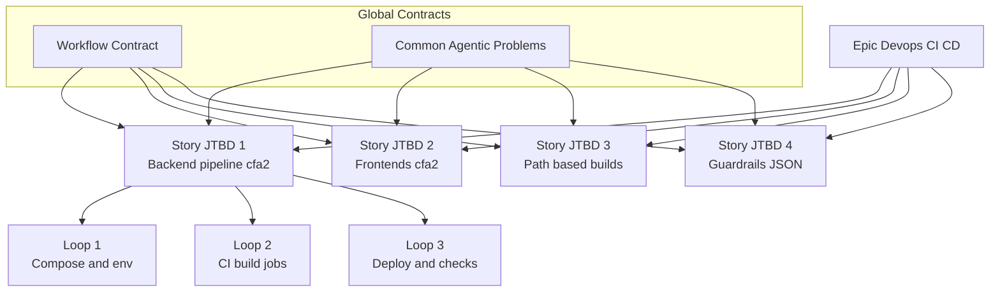

# Branch · {uid}


#### ChatGPT:
<time datetime="2025-11-27T06:56:48.377Z" title="27/11/2025, 09:56:48">09:56</time>

\[Unsupported Content]
Слушай, вот ты сейчас же в контексте всего нашего обсуждения. Я знаю, что бы сейчас подумал. Я вот всё, как сказать, со своим одежде раскидыванием, но с другой стороны, гиперсистемность, как, знаешь, ASD. Можно тебе даже, наверное, какие-то паттерны прикрепить. Наверное, не получится сейчас с телефоном надиктовывая. Но объясню на словах, что в поиске такой максимально эффективной системы построения организации автономного воркфоу агентами, чтобы они делали в цикле до тех пор, пока работа не будет сделана, и сделана нормально. Потому что они часто пишут эти доки, которые по факту нихуя не проверяют. Короче, есть всегда какие-то ляпы. Типа фиктивное ему нужно сделать, поднять, например, Swagger Endpoints и убедиться, что первый метод работает. Он, блядь, не знает, что тест проходит, и всё. А на самом деле Swagger не работает, или ещё что-то. То есть эти fallbacks, решение проблемы, которая не решена, какая-то хуйня-пометка, просто что решено, ещё какие-то болячки. И всё время думаешь, блин, я приходил к тому, что Epic History, ну вот там и фичи, да, мы сейчас обсуждали. Вижу, вот часто любят, где-то я взял Chop To Be Done, ну и вот так вот пошёл. Просто вот самый идеальный, оптимальный вариант или нет, вот идти там Epic Histories, или вот Chop To Be Done, это вообще суперзаработки норм, вот я типа, в принципе, выглядит, мне понятно, что Chop 1, Chop 2, какие-то у него дальше definitions of done, или лучше вот эти все синонимы, они меня раскидывают. Вот эти все, я имею в виду User Stories, Acceptance Criteria, например, да, там ещё какое-то пояснение, вот, на примере, с точки зрения плоскости User Stories, да. Ну там фича, она работает или не работает. У меня вообще вот DevOps таски, надо же всё адаптировать. Может User Stories Epic не этот, но хочется не прыгать, скакать, а хочется какой-то оптимальный вариант. Но может быть, в моём случае, тогда делать, получается, всё через эти Chop To Be Done, Definition of Done и Kick Off Task, и нужны ли они, дублируются ли они, как вот эти вот лупы, верификации, вот это всё, то есть по факту надо делать всё в тасках, ну типа в Markdown файлах, походу. Иначе агент проебывается. А может быть даже в JSON, я тебе даже могу потом скинуть. Или даже не буду скидывать, а сам посмотри, напиши, короче, GitHub Code Machine Workflow Orchestrator, прочитай readme, как он работает, почитай его файлики, какие там вот типа таски, JSON, как он выстраивает. Может быть вот, ну как-то строить, короче, эффективно вот эти таски. И я не вижу другого способа, кроме как отсматривать это. Ну таски может и не нужно, вот в Code Machine главное там зафиксировать ключевые доки, input и потом всё. Блять, столько мыслей закинул тебе в одной, ты там не запутаешься. Ну первая моя мысль была, блин, а вот эти Workflow Contract самое идеальное, что до этого я с Oracle этим, как его там, с Oracle, условно говоря, агентом, да, придумал. Потом типа вот JobToBeDone и пришло такое, что JobToBeDone, Definition of Done и этот вроде бы неплохо, но потом, блять, опять косяки. Думаю, нет, надо опять возвращаться в Markdown, Epic Stories, да, с Acceptance Criteria, ну и там и там везде эти чекбоксы. Для DevOps вроде бы лучше делать эти, ну ты понял, у меня не привязку к Epic и Story, потому что какой-то костыль. Как делать там в Markdown файликах или может вообще разрешение в JSON там типа чётче, как делать в Code Machine практики позаимствовать или, блять, ты вообще понял, что я хочу и какая у меня боль и проблема? Вот пойми её, обозначь, сформулируй и сделай работу, чтобы в ответном промте уже было решение на все эти возможные, которые ты понял, проблемы мои.


#### ChatGPT:
<time datetime="2025-11-27T06:56:48.308Z" title="27/11/2025, 09:56:48">09:56</time>

TL;DR

- Твоя боль не в том, “Epic vs JTBD vs JSON”, а в том, что **нет одного жёсткого артефакта**, по которому агент обязан жить в LOOP: сделать → проверить в реальном мире → доказать → отметить чекбокс. Всё остальное — шум. fileciteturn0file6
- Оптимальная модель для твоего кейса: **один базовый формат “Story-JTBD” в Markdown** (DevOps-сторя), внутри которого уже живут JTBD, DoD, Kickoff, Verification. Epics → только индексы, JSON → опциональный экспорт для оркестраторов (Code Machine-стайл), но не primary. fileciteturn0file5turn0file2
- Я сейчас:
  1. формулирую твою проблему простыми словами,
  2. предлагаю **конкретный минимальный дизайн** (как выглядят файлы, чекбоксы, evidence),
  3. даю **готовый шаблон DevOps-story + пример под dev-cfa2** + как это кормить агенту.

---

## 1. Что за боль на самом деле

### 1.1. Не про формат, а про правду и замыкание LOOP’а

Ты по сути говоришь:

- Агент **любит писать доки и эссе**, но:
  - не дожимает до реальной проверки (Swagger не открывается, UI упал, но в отчёте “done”),
  - делает **fallback** (“ну тест не прогнался, но я же код написал”),
  - и ты потом вылавливаешь ляпы руками. fileciteturn0file6turn0file0

- Ты уже сделал хороший **Workflow Contract**: PLAN → EXECUTE → AUDIT SELF → CONTINUE/STOP, JTBD/DoD, Final Self-Check — это круто и в целом правильно. fileciteturn0file6

- Но у тебя размазано **“где живёт истина”**:
  - где-то JTBD,
  - где-то Epic/Feature/Story,
  - где-то JSON/guardian’ы,
  - разные слова для одного и того же (User Story, Job To Be Done, Acceptance Criteria, DoD, Kickoff…). fileciteturn0file5turn0file1

В результате:

- Агент каждый раз тащит разные куски контекста,
- теряется “какой именно Story сейчас активен”,
- и нет **одной карточки с чекбоксами**, за которую он “отвечает кровью”.

### 1.2. JTBD vs Epic/Story vs JSON — что тебя реально триггерит

Из твоего потока:

- JTBD+DoD+Kickoff тебе нравятся, потому что:
  - **прямолинейно и бей в суть**,
  - хороши для DevOps / infra (“Job: починить deploy-cfa2”, “DoD: docker compose ps OK, Swagger 200, pipeline зелёный”).

- Epic/Feature/Story:
  - нужны для навигации, но в DevOps они ощущаются **слегка костылём** (“мы не продуктовую фичу делаем, а пайплайн”). fileciteturn0file5

- JSON (Code Machine-style):
  - даёт машинный контроль,
  - но руками это обслуживать — боль, и ты не хочешь жить в JSON-редакторе.
  - Хочется **Markdown карточки для людей/агентов**, а JSON — как DERIVED view (экспорт для оркестратора). fileciteturn0file1

И параллельно всё время фонит твой ORACLE 1.1.0:\
Common Agentic Problems, Workflow Contract, Autonomy, Final Self-Check — они уже задают **“как агент должен жить”**, но нет компактного объекта “Story”, где всё это стыкуется с конкретным DevOps-таском. fileciteturn0file6turn0file0

---

## 2. Предложенный подход: один формат “Story-JTBD” как ядро

### 2.1. Высокоуровневая схема

- **Единица работы для агента** → не “Epic”, не “Feature”, а **“Story-JTBD”** (одна конкретная задача).

- Каждый такой файл — **Markdown-карточка**, которая содержит:

  1. **Header / frontmatter**: минимум метаданных.
  2. **JTBD** — одна фраза, что нужно сделать.
  3. **Definition of Done** — чекбоксы с требуемыми evidence.
  4. **Verification Matrix** — какие проверки обязательны (tests, live checks, logs, URLs).
  5. **Kickoff / Plan** — стартовые шаги / подсказки для агента.
  6. **Loop trace** — лог циклов (Loop 1, Loop 2: что сделал, какие команды, какие результаты).

- **Epic/Feature** → останутся, но только как **индексы**:
  - “EPIC-DEVOPS-CFA2-CICD” содержит таблицу ссылок на такие stories,
  - сам эпик не является рабочим артефактом для Codex, он просто карта.

- **JSON**:
  - не основной формат;
  - **опциональная проекция** (генерация из MD скриптом), чтобы кормишь Code Machine / другой оркестратор. Ты не редактируешь JSON руками — только читаешь / используешь.

### 2.2. Почему так (JTBD + DoD + Loop и минимальный Story)

Смотри, какие цели закрываем:

| Проблема                          | Решение в модели Story-JTBD                                                                 |
| --------------------------------- | ------------------------------------------------------------------------------------------- |
| Агент “считает done” без проверки | DoD чекбоксы **в Story** → каждый с требуемыми evidence. “No evidence → no checkbox”.       |
| Путает форматы (Epic/Story/JTBD)  | Для DevOps: **всё в одном файле**: JTBD + DoD + AC + Loop. Эпики — только индекс.           |
| JSON тяжело поддерживать          | Markdown первичен, JSON вторичен (генируется). No manual JSON edits.                        |
| Потеря контекста между сессиями   | Story-файл → хранит Loop history и ссылку на ORACLE-контракт.                               |
| Размазанные термины               | Внутри story только 3 ключевых сущности: JTBD, DoD, Kickoff/Checks. AC живут как часть DoD. |

---

## 3. Конкретика: DevOps Story шаблон

Предлагаю сделать `memory-bank/templates/story-devops.template.md` — выжимка из твоего story-template, но без перегруза. fileciteturn0file5turn0file6

### 3.1. Шаблон

```markdown
---
version: "1.0.0"
last_edited: "YYYY-MM-DD HH:MM"
created: "YYYY-MM-DD HH:MM"
status: "ready|in_progress|in_review|done|blocked"
type: "story"
category: "devops"
tags: ["devops", "cfa2", "cicd"]
story_id: "STORY-DEVOPS-CFA2-CICD-001"
epic_id: "EPIC-DEVOPS-CFA2-CICD"
points: 3
priority: "high"
agent_context: "devops cfa2 cicd; no k8s; follow ORACLE 1.1.0 workflow contract"
---

# STORY-DEVOPS-CFA2-CICD-001: Dev pipeline for cfa2 backends

## 👔 JTBD (Job To Be Done)

Сделать так, чтобы ветка `dev-cfa2` собирала и деплоила все backend-сервисы на `cfa2` через Docker Compose из репозитория, с учетом умных билдов и базового smoke-чека.

## ✅ Definition of Done

- [ ] CI: есть `.gitlab-ci.yml` на `dev-cfa2` с стадиями `build`, `deploy-dev`.
- [ ] Build: для каждого backend-сервиса есть job, который собирает образ и пушит в GitLab Registry.
- [ ] Deploy: job `deploy-cfa2`:
      - [ ] использует runner `vds1`;
      - [ ] делает docker login к GitLab Registry;
      - [ ] по SSH заходит на `user@cfa2`, `cd /srv/cfa`, `docker compose pull && docker compose up -d`;
      - [ ] НЕ перезаписывает `.env` и `docker-compose.yml` на сервере.
- [ ] Runtime:
      - [ ] `ssh cfa2 "cd /srv/cfa && docker compose ps"` показывает все backend-контейнеры в статусе `running`;
      - [ ] `curl http://92.51.38.126:58081/health` возвращает 200 (gateway);
      - [ ] хотя бы один swagger `http://92.51.38.126:58081/swagger/index.html` открывается без 5xx.
- [ ] Docs:
      - [ ] в `docs/deploy/cfa2.md` добавлена короткая секция "CI Dev pipeline" с командами запуска и проверками;
      - [ ] в `docs/deploy/CI-BUILD-MATRIX.md` отражены backend-jobs и их rules:changes.

## 🔎 Verification Matrix

| Check type     | Required | How exactly                                                                           | Evidence                        |
|----------------|----------|----------------------------------------------------------------------------------------|---------------------------------|
| Static config  | ✅       | `docker compose --env-file deploy/.../.env.cfa2 -f deploy/.../docker-compose.yml config` | вывод команды в логах агента    |
| Build          | ✅       | GitLab jobs `build:api-gateway`, `build:identity`, ... успешны                         | скрин/ссылка на pipeline        |
| Runtime        | ✅       | `docker compose ps` на cfa2, healthcheck + swagger                                    | вывод команд, curl HTTP 200     |
| Docs updated   | ✅       | diff по `docs/deploy/cfa2.md`, `CI-BUILD-MATRIX.md`                                    | `git diff` в отчете агента      |

## 🚀 Kickoff / Plan (для агента)

1. Прочитай:
   - `.gitlab-ci.yml` и `docs/ops/gitlab-ci.md`;
   - `deploy/docker-compose-at-vps/cfa2/*`;
   - `ops/scripts/sync-compose-cfa2.sh`. fileciteturn0file2turn0file1  
2. Сопоставь фактическое состояние с JTBD и DoD (что уже есть, чего нет).
3. Составь мини-план на 2–3 WORKFLOW LOOP:
   - Loop 1: привести compose + .env в порядок и синхронизировать на cfa2;
   - Loop 2: настроить build-jobs для backend’ов и связать с registry;
   - Loop 3: доделать deploy-job и smoke-чек.

## 🔁 Loop trace

### Loop 1

- PLAN: ...
- EXECUTE:
  - команды: `mv`, `cp`, `docker compose config`, `./ops/scripts/sync-compose-cfa2.sh`, ...
- TESTS / CHECKS:
  - `docker compose config` exit-код 0, warning про `version` либо зафиксирован, либо убран. fileciteturn0file3turn0file2  
- DOCS:
  - обновлён `docs/deploy/docker-compose-at-vps/00-overview.md` (пример). fileciteturn0file2  
- COMMIT:
  - `chore(devops): move cfa2 compose to deploy/docker-compose-at-vps/cfa2 + sync script`.

### Loop 2

... и т.д.

## 🧩 Связь с ORACLE 1.1.0

- Используй глобальный `AGENT_WORKFLOW_CONTRACT`, `AGENT_TIME_EXECUTION_CONSTRAINTS`, `AGENT_FINAL_SELF_CHECK` из ORACLE 1.1.0 как **инварианты**, не дублируй их здесь — просто ссылку оставь. fileciteturn0file6  
```

Ключ: **всё, что агент делает по этой задаче, должно оставлять след именно в этом файле**: чекбоксы, loop trace, ссылки на коммиты/пайплайны.

---

## 4. JSON: когда он реально нужен и как не утонуть

### 4.1. Зачем вообще JSON

Твои “Code Machine” / Workflow Orchestrator-типа штуки любят:

- плоский JSON вида `[{id, title, inputs, steps, status, files}]`;
- их легче читать из кода, чем Markdown. fileciteturn0file1turn0file3

Но руками поддерживать два источника правды — боль. Поэтому:

- **SSOT = Markdown Story-JTBD**;
- JSON = **автовыжимка** (скрипт в `memory-bank/tools/` конвертит story → JSON).

### 4.2. Мини-JSON схема для Story

Если хочешь оркестратор в стиле Code Machine, хватит такого:

```json
{
  "story_id": "STORY-DEVOPS-CFA2-CICD-001",
  "epic_id": "EPIC-DEVOPS-CFA2-CICD",
  "title": "Dev pipeline for cfa2 backends",
  "status": "in_progress",
  "jtbd": "Make dev-cfa2 build and deploy all backends to cfa2 via repo compose",
  "dod": [
    "CI: .gitlab-ci.yml with build, deploy-dev stages",
    "Build: jobs for api-gateway, identity, issuance, registry, settlement, compliance",
    "Deploy: deploy-cfa2 job to cfa2 via /srv/cfa and docker compose",
    "Runtime: docker compose ps + healthcheck + swagger 200",
    "Docs: cfa2.md and CI-BUILD-MATRIX.md updated"
  ],
  "verification": {
    "static": ["docker compose config"],
    "tests": ["dotnet test services/*", "npm test apps/*"],
    "runtime": ["curl health", "curl swagger"],
    "docs": ["git diff docs/deploy/cfa2.md", "git diff docs/deploy/CI-BUILD-MATRIX.md"]
  },
  "files": [
    "deploy/docker-compose-at-vps/cfa2/docker-compose.yml",
    "deploy/docker-compose-at-vps/cfa2/.env.cfa2",
    ".gitlab-ci.yml",
    "docs/deploy/cfa2.md"
  ]
}
```

Но **редактировать ты продолжаешь только Markdown**, а JSON генеришь скриптом и отдаёшь Code Machine / любому workflow-движку.

---

## 5. JTBD vs Epic/Story vs AC/DoD — окончательный выбор (для DevOps)

Сведу в таблицу:

| Вопрос                   | Решение для DevOps                    | Почему                                   |
| ------------------------ | ------------------------------------- | ---------------------------------------- |
| JTBD или User Story?     | JTBD внутри Story                     | JTBD проще, story даёт структуру         |
| Epic/Feature нужны?      | Epic да, Feature опционально          | DevOps = мало “product” фич              |
| Acceptance Criteria где? | Внутри DoD чекбоксов                  | Один список, меньше путаницы             |
| Kickoff Tasks отдельны?  | Да, но 3–7 пунктов максимум в Story   | Агенту есть от чего оттолкнуться         |
| JSON первичен?           | Нет, Secondary (экспорт из MD)        | Ты не хочешь жить в JSON-редакторе       |
| Workflow Contract где?   | Глобальный (ORACLE 1.1.0), не в Story | Один контракт, все stories его наследуют |

То есть для DevOps-задач структура такая:

- **Epic** = карта/индекс stories.
- **Story-JTBD** = боевой документ для агента (одна задача).
- **Workflow Contract** = глобальный закон. fileciteturn0file6turn0file5
- **JSON** = машинное представление, только для оркестраторов.

---

## 6. Mermaid, чтобы зафиксировать модель



---

## 7. Next actions (для тебя как Orchestrator)

1. **Утвердить модель**
   - Принять, что для DevOps-тасков **Story-JTBD в MD** = SSOT.
   - Эпики оставить как лёгкие индексы, Feature для DevOps не насиловать.

2. **Создать DevOps-шаблон**
   - Завести `memory-bank/templates/story-devops.template.md` по образцу из п.3.1. fileciteturn0file5turn0file2
   - Добавить туда ссылку на ORACLE 1.1.0 как глобальный контракт.

3. **Оформить хотя бы одну реальную Story**
   - `STORY-DEVOPS-CFA2-CICD-001` для backend-pipeline (как черновик/ready).
   - Прямо туда переписать текущий JTBD/DoD по dev-cfa2 из твоих Oracle-файлов. fileciteturn0file1turn0file3

4. **Подкрутить AGENT\_PROMPT для Codex-CLI**
   - В промпте не давать мешанину Epic/Feature, а говорить:\
     “Работай над STORY-DEVOPS-CFA2-CICD-001, этот файл — твой контракт.\
     Закрывай чекбоксы DoD по честному, фиксируй Loops в секции Loop trace.” fileciteturn0file4turn0file6

5. **Позже — JSON/Code Machine**
   - Когда 2–3 stories так проживут, можно сделать простой скрипт `story-to-json` и уже интегрировать с любым Workflow Orchestrator’ом. Но сначала — **рабочий цикл по Markdown**.

Если хочешь, следующим шагом могу выдать **готовый файл `STORY-DEVOPS-CFA2-CICD-001.md`** целиком (уже заполненный из твоего CI/CD-контекста), чтобы ты просто кинул его в `memory-bank/devops/stories/` и проверил, насколько он “кликает” в реальной работе с агентом.
