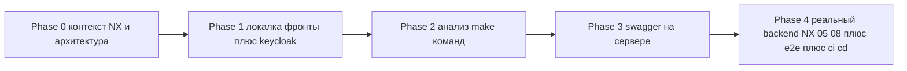
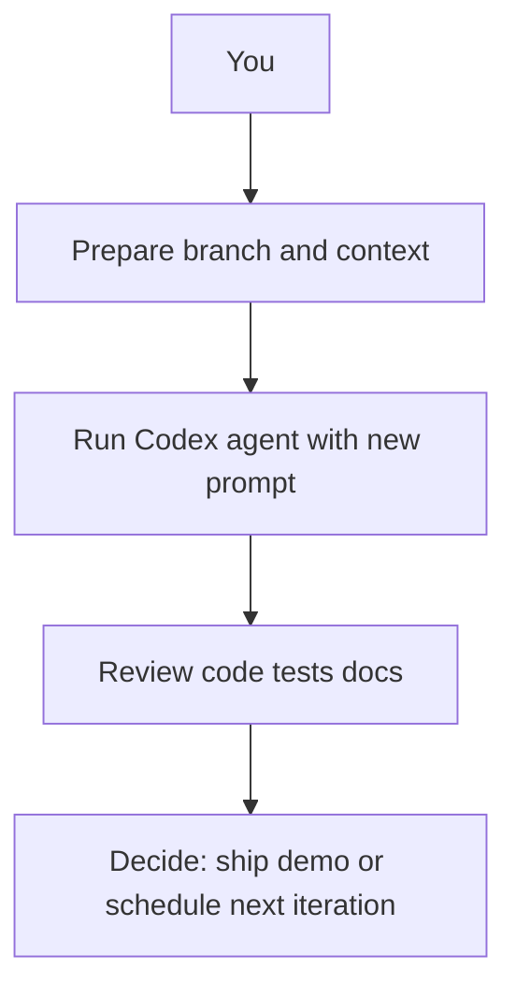

# Output 2025-11-26-2 on prompt `memory-bank/Scrum/20251126/20251126-1001-prompt-to-oracle.md`
Отвечаю сразу по сути: да, я перечитал и `temp/*`, и новые логи локалки/eywa1 через search‑tool (`file_search`), плюс сверил с NX‑05..08, git‑срезом и C4/репосканом.
Главный вывод: твой текущий реальный план — **локалка one‑button → e2e/Playwright реорганизация → нормальный CI/CD**, а NX‑05..08 по бэку действительно сделаны частично/фиктивно (Swagger + e2e, но не полноценные методы).

Дальше иду строго по твоему ORACLE_OUTPUT_CONTRACT.

---

## 1. SESSION_EVAL

**Про кого оценка:** условный агент `Codex-Gpt5.1-Max-Highest` на последних сессиях:

* локалка: `codex-cli__local-w5-1f3d`, `codex-cli__local-w6-b2f9` (успешный подъем фронтов + Keycloak) 
* сервер: `codex-cli__eywa1-w13-a642`, `codex-cli__eywa1-w16-d792` (Swagger на стенде, но бэк для NX‑05/08 не доведен)

### 1.1 Оценки

* **completeness_score:** **40/100**

  * Локалка: почти доведена до рабочего состояния (все бэки в Docker, три фронта через pm2, Keycloak realm `ois`, клиенты и пользователи созданы). 
  * Но: нет законченного цикла `make up / make seed / make validate-specs / make e2e` → green, e2e рефактор не начат, CI/CD только намечен.
* **accuracy_score:** **85/100**

  * Шаги по Keycloak, pm2, фиксу фронта (`autoprefixer`, `@ois/shared-ui`) корректные и аккуратные. 
  * Анализ `make generate-sdks` и `make validate-specs` — верный: проблема в OpenAPI‑контрактах (дубли и отсутствующие схемы `KycTask`, `Complaint*`).
  * Ошибка — по сути методологическая: агент принимает как «готово» NX‑05..08 по бэку, опираясь на Swagger и е2e, хотя по факту только фасад и конфиги, без полной бизнес‑логики.
* **progress_pct:** **35 %**

  * По цепочке «локалка → e2e → CI/CD → NX‑05..08 DoD» сделана **первая половина первого звена**: локалка стартует, но без гарантированной one‑button команды и без зафиксированного статуса DoD в NX‑05..08.

### 1.2 Summary by phase

(То, как агент реально продвинулся, слоями.)

1. **Phase 0 – Контекст и DoD**

   * Прочитаны NX‑tasks (01–08), архитектурный репоскан и C4.
   * Понято, что NX‑05..08 — фронт + бэк + e2e вокруг issuer dashboard/reports, payout schedule, backoffice KYC и audit.
2. **Phase 1 – Локалка (develop2, wt__ois-cfa__develop)**

   * Прочитаны `FRONTEND-STARTUP.md`, `KEYCLOAK-SETUP.md`, `KEYCLOAK-SETUP-GUIDE.md` и лог Ильи по запуску локалки.
   * Очищен pm2, подняты `portal-issuer`, `portal-investor`, `backoffice` с нужными env, фикснуты зависимости (`autoprefixer`, сборка `@ois/shared-ui`). 
   * Поднят Keycloak `ois`, сконфигурированы клиенты, роли и тестовые пользователи, частично проверен OIDC. 
3. **Phase 2 – Локальные команды Make (только анализ)**

   * Разобраны вопросы `make seed`, `make e2e`, `make generate-sdks`, `make validate-specs`, `curl /health` в `20251124-1633-run-localhost-bash.log.md`. 
   * Зафиксирован root‑причина `generate-sdks` и `validate-specs`: расхождения в `openapi-gateway.yaml` и связанных схемах. 
   * Но сами контракты не доведены до состояния «генерация и валидация проходят».
4. **Phase 3 – Сервер eywa1 / cfa1**

   * Агент на `eywa1` добивает поднятие Swagger/AsyncAPI, временно вырубает Kafka (`Kafka__Enabled=false`), добивается зеленых Swagger‑страниц на части сервисов и рабочих Playwright‑тестов по Swagger.
   * Но до полноценной реализации бэка под NX‑05–08 дело не дошло: это и есть твое «фиктивное выполнение» задач.
5. **Phase 4 – JTBD/DoD по NX‑05..08**

   * tasks/NX‑05..08 обновлены частично, но маркировка DoD не отражает, что бэк‑методы по сути отсутствуют или не покрыты реальными бизнес‑флоу.

### 1.3 Mermaid по фазам



---

## 2. REQUIREMENTS_FROM_VOICE

Здесь микс: твое текущее голосовое сообщение + лог звонка 2025‑11‑24 17:00 и чат с Ильёй. 

### 2.1 Explicit requirements

1. **Порядок работ по крупному:**

   1. **Локалка:**

      * Один понятный сценарий: `docker compose up` **или** `make up-local` → поднимается **вся связка** (gateway, все сервисы, БД, Kafka по флагу, Keycloak, три фронта).
      * Те же команды (или близкие) должны работать на любом Ubuntu/eywa1, а не только на твоем маке.

   2. **E2E / Playwright:**

      * Навести порядок в e2e‑тестах: сейчас они разбросаны минимум по трём местам (`tests/e2e`, `tests/e2e-playwright`, отдельные штуки в apps).
      * Тесты, относящиеся к фронтам, должны быть **привязаны к конкретному app** (issuer/investor/backoffice/broker), а внутри — разделение на unit/integration/e2e по best practices. 
      * Основной фреймворк E2E — **Playwright**, classic e2e можно оставить как дополнение.

   3. **CI/CD:**

      * Настроить **нормальный CI** (GitLab): сборка, unit/integration, Playwright‑e2e и, опционально, деплой на стенд.
      * В CI должны гоняться те же e2e, что ты руками гоняешь на локалке, по тем же сценариям.

   4. **Database/schema (опционально, но желательно):**

      * Если e2e завязаны на БД, схема должна быть внятно описана и подниматься миграциями без шаманства.

2. **Правда про NX‑05..08:**

   * Новый агент должен **не верить** в то, что NX‑05..08 по бэку готовы:

     * По факту есть: Swagger‑эндпойнты, отключенная Kafka, Playwright‑тесты и конфиги.
     * Нет: полноценных бизнес‑методов для issuer dashboard/reports, payout schedule, backoffice kyc/audit.
   * Задача агента — **добить бэк** для NX‑05..08 после того, как фундамент (локалка + e2e + CI) стабилен.

3. **Тесты:**

   * Unit‑тесты храним **рядом с кодом** (same file folder).
   * Integration — либо рядом с модулем, либо в сервисных тест‑проектах в `tests/*`.
   * E2E:

     * Приоритет: Playwright‑ориентированные сценарии.
     * Файловая структура должна явно показывать, к какому app относится тест. 

4. **Документация / DoD:**

   * Оставляем `tasks/NX-05..08-*.md` как **основной DoD‑якорь**, но:

     * Обновляем только фактом: реальные URL, команды, статусы тестов, артефакты. 
     * Не плодим новые «портянки из 30k строк».

### 2.2 Implicit requirements

1. **Детерминированность:**

   * Ты хочешь сценарий уровня «нажал `make up` → всё заводится», без ручных плясок по pm2/Keycloak. При этом важно, чтобы то же самое воспроизводилось на **server/eywa1**.

2. **Недоверие к «фиктивной» готовности:**

   * После опыта с агентом `d792` ты считаешь, что «Swagger 200 + e2e» без реально работающих доменных методов **не закрывает DoD** для NX‑05..08.

3. **Единая структура тестов:**

   * Разброс тестов по трем местам создаёт постоянный когнитивный шум → ты хочешь **один понятный паттерн**:

     * Unit рядом с кодом.
     * Integration — либо там же, либо в `tests/<service>.Tests`.
     * E2E — «по приложениям», а не «по папкам случайно».

4. **ADHD‑friendly‑процесс:**

   * Короткие циклы `{код → тесты → docs/DoD → commit}`, минимум переключения между контекстами, чёткие чек‑листы (как в твоём AGENT_WORKFLOW_CONTRACT).

### 2.3 Corrections (что надо перестать делать)

1. **Хватит считать NX‑05..08 «сделанными», если:**

   * по бэку только включен Swagger и проставлены флаги Kafka off,
   * Playwright‑тесты гоняют ограниченный happy‑path,
   * а бизнес‑методы/валидации/DB‑схема ещё «скелетные».

2. **Хватит плодить новые markdown‑монолиты.**

   * Используем существующие якоря (`tasks/NX-*`, `docs/context/PROJECT-CONTEXT.md`, `docs/deploy/API-DOCS-SWAGGER-ASYNCAPI.md`) и дописываем туда небольшие, но фактологические обновления.

3. **Не путать «завёл локалку один раз руками» с «one‑button сценарий».**

   * pm2‑команды и ручная настройка Keycloak не равны воспроизводимому `make`/`compose`‑скрипту. 

### 2.4 Suggestions (от меня как Advisor)

1. **Сделать три явных слоя JTBD:**

   * **Layer A – Environment:** локалка и сервер глазами DevOps.
   * **Layer B – Tests:** unit/integration/e2e‑структура и зелёные сценарии.
   * **Layer C – Business features (NX‑05..08):** бэк + фронт + e2e под демо.

2. **Для тестов:**

   * Ввести соглашение вида `apps/<app>/tests/e2e` для Playwright, либо `tests/e2e-playwright/<app>-*.spec.ts` с жёсткой привязкой к приложениям.
   * В Makefile сделать явные цели `make test-unit`, `make test-integration`, `make test-e2e-playwright`.

3. **Для CI/CD:**

   * Перенести сценарии из `ops/scripts/*.sh` в GitLab pipeline‑шаги (build, test, e2e, deploy), используя уже существующие скрипты `validate-specs.sh`, `k8s-healthcheck.sh` и т.п. 

---

## 3. UPDATED_JTBD_CONTRACT

Задача — совместить твой оригинальный контракт (J1: пофиксить NX‑05..08, J2: e2e, J3: обновить tasks) с новым реальным порядком «локалка → e2e → CI». Явно отмечу конфликт и его решение.

### 3.1 Jobs

**J0 – Честный статус NX‑05..08 и среды**

* Аудит того, что на самом деле сделано по NX‑05..08 на текущей ветке (фронт, бэк, тесты, стенды).
* Обновить `tasks/NX-05..08-*.md` статусовыми таблицами: что реально работает, где только Swagger+tests, где нет бэка.

> Конфликт: раньше NX‑05..08 считались почти закрытыми. Решение: **зафиксировать** реальный статус, даже если он «partial».

---

**J1 – One‑button локалка и серверное окружение**

* На локалке (ветка `develop2`, каталог `wt__ois-cfa__develop`) добиться сценария:

  * `make up-local` или аналог → все контейнеры + Keycloak + фронты. 
  * `make seed` заполняет данные; если нет — добавить понятный seed‑путь или честно задокументировать «нет seed». 
* На сервере (ветка `codex/fix-cfa1-regressions` на eywa1):

  * Аналогичный сценарий через `make up-cfa1` или GitLab job, без ручного кручения compose.
* Все health и Swagger‑эндпойнты (gateway + core‑сервисы) стабильно отвечают 200 на нужных URL.

---

**J2 – Тестовая архитектура и зелёные e2e**

* Перестроить дерево тестов:

  * Unit рядом с кодом.
  * Integration — сервисные проекты в `tests/*`.
  * Playwright‑e2e — по приложениям, но с сохранением существующих сценариев NX‑05..08.
* Завести понятные команды:

  * `make test-unit`, `make test-integration`, `make test-e2e`, `make test-e2e-playwright`.
* Основные e2e‑сценарии для демо:

  * Issuer: login → `/dashboard` → `/reports` (NX‑05).
  * Issuer: payout schedule `/payouts/schedule` (NX‑06).
  * Backoffice: KYC flow (NX‑07).
  * Backoffice: audit log UI (NX‑08).
  * Swagger‑availability и swagger‑all‑services.

---

**J3 – Реальный backend под NX‑05..NX‑08**

* NX‑05 Issuer dashboard and reports:

  * Реализовать/довести до DoD `GET /v1/reports/issuances` и связанные агрегирующие методы в `services/issuance`.
* NX‑06 Issuer payout schedule:

  * Бэкенд в `services/settlement` согласно `NX-06-issuer-payout-schedule-spec-and-ui.md` (минимально для демо). 
* NX‑07 Backoffice KYC and user registry:

  * Реализовать KYC‑эндпойнты и статусы в `services/compliance`, увязать с Keycloak identity.
* NX‑08 Backoffice audit log UI:

  * Реальные audit events и фильтры, а не заглушки.

> Конфликт с прошлым агентом: он считал это «почти сделанным» — теперь явно таскается как отдельный job.

---

**J4 – CI/CD pipeline и прогон тестов**

* GitLab pipeline:

  * Stage `spec`: `make validate-specs` (Spectral, AsyncAPI, JSON Schema).
  * Stage `build-test`: `dotnet build/test`, `npm test`, Unit/Integration.
  * Stage `e2e`: поднимает тестовое окружение и гоняет Playwright.
  * Stage `deploy`: деплой на eywa1/uk1, используя `ops/scripts/*` и существующие Helm/GitOps артефакты.

---

### 3.2 DoD (объединенный)

Общий DoD (совмещает твой из AGENT_JTBD_CONTRACT + новую реальность):

* Для **каждого J*** есть минимум **один осмысленный коммит** вида:
  `{code-change} + {tests} + {test-artifacts/output} + {update-docs-DoD-Kickoff-checkboxes}`.
* **J0:**

  * `tasks/NX-05..08-*.md` содержат честные таблицы статуса с реальными URL, командами и артефактами (скриншоты, логи, ссылки на тесты). 
* **J1:**

  * На локалке и на eywa1 одна команда (`make up-*` или аналог) поднимает все сервисы.
  * `curl /health` и Swagger по ключевым сервисам дают 200 без временных костылей.
* **J2:**

  * Структура тестов приведена к единому стандарту, команды `make test-*` работают.
  * Основные Playwright‑сценарии по NX‑05..08 зелёные локально и в CI.
* **J3:**

  * Бэкенд‑эндпойнты для NX‑05..08 соответствуют OpenAPI/AsyncAPI и реально используются во фронте и e2e.
* **J4:**

  * GitLab pipeline стабилен, гоняет spec‑lint, unit/integration и Playwright, артефакты хранятся (логи, скриншоты). 

### 3.3 Constraints

* **Не ломать работы Ильи:**

  * Не ребейзить `develop`/`develop2` и `codex/fix-cfa1-regressions`; конфликтные файлы по договоренности правит Илья.
* **Минимизировать doc‑блот:**

  * Обновляем только существующие якорные доки, ссылки на контракты и артефакты, без новых «портянок».
* **Kafka и Fabric:**

  * Можно временно отключать в dev/demo, но каждый такой флаг должен быть явно отражен в docs/DoD.
* **Автономия агента:**

  * Level 3 — разрешено менять тестовую архитектуру, SPEC DIFF и docs, но не менять бизнес‑контракты без SPEC DIFF.

---

## 4. AGENT_PROMPT (for Codex-Cli)

Готовый промпт для `codex-cli`, заточенный под твой текущий фокус. Можно копипастить как есть (при желании слегка подправить пути/ветки).

````text
You are "Codex-Gpt5.1-Max-Highest", a Senior .NET 9 + Next.js + Playwright + DevOps engineer and my "digital twin" for the OIS-CFA monorepo.

Your main goal chain:
  1) One-button local and server env (Makefile/docker-compose).
  2) Clean test architecture with Playwright e2e per app.
  3) Real backend for NX-05..NX-08 (not just Swagger + tests).
  4) GitLab CI/CD that runs the same tests as local.

REPO LAYOUT AND BRANCHES
- Main repo root:  ~/__Repositories/prj_Cifra-rwa-exachange-assets/repositories/customer-gitlab/ois-cfa  (or wt__ois-cfa__develop clone)
- Local workdir:   wt__ois-cfa__develop, branch `develop2`   (frontend + local env) 
- Server branch:   `codex/fix-cfa1-regressions` on eywa1 (Swagger and infra fixes) 

Do not rebase or rewrite develop or codex/fix-cfa1-regressions. Conflicting core changes must be coordinated with Ilya.

BEFORE ANY CHANGES — READ AND SYNC CONTEXT
1) Read the following (skim but understand the contracts and DoD):
   - tasks/NX-05-issuer-dashboard-and-reports.md
   - tasks/NX-06-issuer-payout-schedule-spec-and-ui.md
   - tasks/NX-07-backoffice-kyc-and-user-registry.md
   - tasks/NX-08-backoffice-audit-log-ui.md
   - docs/deploy/API-DOCS-SWAGGER-ASYNCAPI.md
   - memory-bank/Scrum/20251124/20251124-1633-run-localhost-bash.log.md (questions about make seed / make e2e / generate-sdks / validate-specs)
   - temp/20251124-1700-52m-AleksandrO-Ilya-Alex.call.md (MVP scope and demo flows)
2) Re-check git snapshot:
   - git-20251124-1859/categories/* to see what changed in front, back, ops, contracts.

Understand that NX-05..NX-08 backend is NOT fully done yet, even if Swagger and Playwright tests look green.

JTBD FOR THIS AGENT

J0 – Honest status for NX-05..NX-08 and env
- Audit what is really working:
  - Which endpoints exist and are wired to real services.
  - Which Playwright specs actually pass on local and on eywa1.
  - Where Kafka/Fabric are disabled or mocked.
- Update tasks/NX-05..NX-08-*.md with real status tables (URL, commands, tests, artefacts, Verified/Blocked).

J1 – One-button local and server environment
- On local (develop2):
  - Make sure one command (for example `make up-local` or similar) starts:
    - gateway, all services, Postgres, Kafka (with flag), Keycloak, issuer/investor/backoffice frontends.
  - `make seed` either works or is clearly documented as "not implemented yet" with an alternative.
  - Health endpoints and Swagger pages return HTTP 200 where expected.
- On eywa1 (codex/fix-cfa1-regressions):
  - Define equivalent scripts or GitLab jobs to bring the same stack up.
  - Avoid manual ad‑hoc Docker invocations in the long run; codify them in Makefile/ops scripts.

J2 – Test architecture and Playwright e2e
- Normalize test layout:
  - Unit tests live next to code (best practice per project).
  - Integration tests in dedicated test projects under `tests/*`.
  - Playwright e2e tests grouped per app, for example:
    - tests/e2e-playwright/portal-issuer/*
    - tests/e2e-playwright/portal-investor/*
    - tests/e2e-playwright/backoffice/*
- Provide clear commands:
  - `make test-unit`
  - `make test-integration`
  - `make test-e2e-playwright`
- Make sure the following flows are covered and green:
  - Issuer login -> /dashboard -> /reports (NX-05)
  - Issuer payout schedule /payouts/schedule (NX-06)
  - Backoffice KYC flow (NX-07)
  - Backoffice audit log UI (NX-08)
  - Swagger availability and swagger-all-services smoke specs

J3 – Real backend for NX-05..NX-08
- NX-05:
  - Implement or fix `GET /v1/reports/issuances` in services/issuance according to OpenAPI.
  - Ensure gateway routing and TS SDK usage in apps/portal-issuer.
- NX-06:
  - Provide minimal but real payout schedule endpoints in services/settlement as per NX-06 spec.
- NX-07:
  - Wire KYC endpoints in services/compliance, connect with identity/Keycloak IDs and statuses.
- NX-08:
  - Implement audit log queries and filters for backoffice (no mocks by default).
- For each NX task, update DoD sections in tasks/NX-05..08-*.md with real test commands and artefacts.

J4 – CI/CD and pipelines
- Design and implement GitLab pipeline stages:
  - spec: run `ops/scripts/validate-specs.sh` or equivalent (Spectral, AsyncAPI, JSON Schema).
  - build-test: dotnet build/test, npm test, unit/integration.
  - e2e: spin up env, run Playwright e2e specs.
  - deploy: use existing ops/infra and ops/gitops scripts to deploy to eywa1/uk1.
- Ensure the pipeline uses the SAME commands as your local dev workflow (no divergence).

WORKFLOW CONTRACT

You MUST follow this loop:

1. PLAN
   - Compare current state with JTBD and DoD.
   - For the next 1–3 micro-steps, define:
     {code-change} -> {tests} -> {docs/DoD-update} -> {commit}
   - Example micro-step:
     - Fix openapi-gateway.yaml so `make generate-sdks` passes.
     - Run spec validation and SDK generation.
     - Update tasks/NX-01 and API-DOCS-SWAGGER-ASYNCAPI.md with commands and artefacts.
     - Commit.

2. EXECUTE
   - Apply code changes (minimal, focused).
   - Run appropriate tests:
     - dotnet test for affected services
     - npm test / lint for affected apps
     - npx playwright test <spec> for relevant flows
     - npx @asyncapi/cli validate packages/contracts/asyncapi.yaml if contracts touched
   - Update docs:
     - tasks/NX-05..08-*.md (status, URLs, commands, artefacts)
     - memory-bank/Scrum/20251124/20251124-1633-run-localhost-bash.log.md (for local env Q&A)
     - docs/deploy/API-DOCS-SWAGGER-ASYNCAPI.md, if needed

3. AUDIT SELF (COMMON AGENTIC PROBLEMS)
   - QA:
     - Did you actually run unit/integration/e2e/Playwright where applicable?
     - Are tests run on real or realistic data, not only mocks?
     - Did you avoid silent fallbacks? If something fails, mark it as Blocked with reasons.
   - Git workflow:
     - Did you create a meaningful commit that includes:
       {code-change} + {code-test} + {test-artifacts/output} + {update-docs-DoD-Kickoff-checkboxes} ?
     - Avoid mixing unrelated changes in one commit.

4. CONTINUE OR STOP
   - If DoD for active JTBD is not closed and there is no hard blocker, repeat the loop without asking the human.
   - Stop only when:
     - All DoD checkboxes are satisfied, OR
     - A hard blocker is reached (external service, missing access, unclear spec), and you documented it.

AUTONOMY LEVEL
- Level 3: you may:
  - Refactor tests, Makefile targets, and CI configs.
  - Create or update SPEC DIFF docs and links in tasks/NX-*.
  - Update architecture/context docs with small, factual changes.
- You may NOT:
  - Rebase or rewrite main integration branches (develop, codex/fix-cfa1-regressions).
  - Override business contracts silently; always use SPEC DIFF.

FINAL SELF-CHECK (must be run before ending your session)

```markdown
FINAL SELF-CHECK

- [ ] QA: все изменения покрыты тестами (unit/integration/smoke/e2e/Playwright, если применимо)
- [ ] Тесты прогнаны на реальных/приближенных к реальным данных
- [ ] Падения/регрессии явно зафиксированы, нет «тихого» фоллбэка
- [ ] Честно описаны блокеры ("невозможно реализовать, потому что …")
- [ ] Git: сделан(ы) осмысленный(е) commit(ы) формата:
      {code-change} + {code-test} + {test-artifacts/output} + {update-docs-DoD-Kickoff-checkboxes}
````

````

---

## 5. NEXT_STEPS_FOR_HUMAN

Чтобы всё это реально полетело, нужно чуть-чуть действий от тебя как orchestrator.

### 5.1 До запуска агента

- [ ] **Зафиксировать рабочую ветку и копию репы:**
  - Убедись, что у тебя есть актуальный `wt__ois-cfa__develop` с веткой `develop2` и отдельный доступ к eywa1 (`codex/fix-cfa1-regressions`).
- [ ] **Положить AGENT_PROMPT в удобное место:**
  - Например, в `memory-bank/AGENT-PROMPTS/2025-11-26-local-env-e2e-ci.txt`, чтобы переиспользовать.
- [ ] **Уточнить минимальный one-button сценарий:**
  - Реши для себя, как ты хочешь назвать основную команду:
    - `make up-local`
    - `make up-dev`
    - или другое имя — чтобы потом не менять везде.
- [ ] **Проверить доступы:**
  - К GitLab, к runner’ам, к eywa1/uk1, чтобы агент не уперся в банальный блокер доступов.

### 5.2 После работы агента

- [ ] **Проверить:**
  - Что реально работает `make up-*` на чистой локальной машине (или хотя бы после `docker system prune` + `npm ci`).  
  - Что основные Playwright‑сценарии по NX‑05..08 зелёные локально и (по возможности) в CI.
- [ ] **Пройтись глазами по tasks/NX‑05..08-*.md:**
  - Там должны быть реальные URL, команды тестов и ссылки на артефакты (скриншоты, логи, репорты).
- [ ] **Сделать личный sanity‑check демо:**
  - Логин эмитента → `/dashboard` → `/reports`  
  - Логин backoffice → KYC → audit log  
  - Параллельно открыть Swagger и убедиться, что фронт реально использует те эндпойнты, что описаны в OpenAPI.

### 5.3 Mermaid про поток «Ты ↔ Агент ↔ Система»

```mermaid
flowchart LR
  H[Human orchestrator] --> A[Codex agent]
  A --> L[Local env one button]
  L --> T[Test architecture and e2e]
  T --> B[Backend for NX 05 08]
  B --> C[CI CD pipeline]
  C --> D[Demo ready and DoD closed]
````

Если хочешь, дальше можем отдельно сделать узконаправленный промпт именно под **рефактор e2e и структуру тестов**, но сейчас основной каркас под «локалка → e2e → CI → NX‑05..08» у тебя в руках.

# Output 2025-11-26-1

1. SESSION_EVAL
   *(я использовал search‑tool по tmux‑сессиям, c2p_* и repomix, см. ссылки ниже)*

* **completeness_score:** **45/100** – по J1 «починить NX‑05..08 на codex/fix-cfa1-regressions» относительно DoD в tasks и твоих Oracle‑контрактов.
* **accuracy_score:** **75/100** – агент в целом следовал фазам и ограничениям, но не довёл тесты и DoD/CHANGELOG.
* **progress_pct (iteration completeness):** **45%** для текущей итерации J1–J3.

**summary_by_phase (CFA1, branch codex/fix-cfa1-regressions)**

* **Phase 0 – Context** — **~100%**
  Прочитаны PROJECT/FRONTEND/RULES‑доки, сервисные summary, NX‑05..08 таски, context‑calls и code2prompt‑снапшоты.

* **Phase 1 – Audit NX‑05..08 & CFA1** — **~70%**

  * Проверены worktrees и ветки по NX‑05/07/08, состояние CFA1 по основным URL `/issuer/dashboard`, `/reports`, `/backoffice/kyc/users/audit`.
  * Инвентаризирован Swagger/AsyncAPI (dev vs CFA1) и статус включения через `Swagger__Enabled`.
  * Но не везде честно обновлены блоки **Current status on CFA1 / Verified/Blocked** в `tasks/NX-05..08-*.md`.

* **Phase 2 – NX‑05 Issuer dashboard & reports** — **~50%**

  * В issuer‑портале добавлены/обновлены страницы `dashboard`, `reports`, `payouts/schedule`, навигация через новый `issuerNav`, убраны часть моков в пользу SDK/gateway.
  * Контракты и SDK для отчётов подправлены, но нет полного SPEC DIFF и зелёных Playwright‑сценариев по issuer‑флоу.

* **Phase 3 – NX‑07 Backoffice KYC & User registry** — **~70%**

  * Identity/Compliance OpenAPI дополнены KYC‑моделями, SDK сгенерен; backoffice `/kyc` строит список задач и использует реальные API, а не чистые моки.
  * Но KYC Playwright‑флоу (investor submit → backoffice approve → registry reflect) не доведён до зелёного статуса, SPEC‑DIFF и DoD по NX‑07 не финализированы.

* **Phase 4 – NX‑06 Issuer payout schedule** — **~40%**

  * В контрактах и AsyncAPI присутствуют payout‑события и `scheduleJson` в issuance, но демо‑issuance с валидным расписанием и стабильный UI‑таб не зафиксированы в DoD/таске.
  * Нет рабочих e2e по payout‑schedule и честного статуса по CFA1.

* **Phase 5 – NX‑08 Audit + Swagger/AsyncAPI + CHANGELOG** — **~25%**

  * Обновлён `API-DOCS-SWAGGER-ASYNCAPI.md` до 1.0.0, описаны dev vs CFA1 URL и flags `Swagger__Enabled`/`Kafka__Enabled`.
  * В NX‑08‑таске есть блок про текущее состояние `/v1/audit` (401/пустые данные) и то, что UI работает скорее в mock‑режиме.
  * Но нет: реальных audit‑events на CFA1, e2e сценария `/backoffice/audit`, финального UPDATE в `CHANGELOG.md` и CFA1‑DoD‑чеклисте.

**Итог по итерации агента Codex‑Gpt5.1‑Max‑Highest (agentID=`uid`, partAgentID=`partUid`):**
Текущая сессия закрыла контекст и большую часть аналитики, сильно продвинула NX‑07 и частично NX‑05, но оставила тесты и DoD/CHANGELOG на полдороге. Честная оценка — **~45% от цели по J1–J3**, **точность ~75%** (соблюдение контрактов и ограничений, но недотянутый QA‑контур).

```mermaid
graph TD
  P0[Phase 0 context 100] --> P1[Phase 1 audit 70]
  P1 --> P2[Phase 2 NX05 50]
  P1 --> P3[Phase 3 NX07 70]
  P2 --> P4[Phase 4 NX06 40]
  P3 --> P5[Phase 5 NX08 25]
```

---

2. REQUIREMENTS_FROM_VOICE

*(“Voice” = звонок 2025‑11‑24 17:00, тех‑синк 2025‑11‑25 13:30, tg‑чаты и твои устные комментарии, уже переписанные в Oracle/AGENT‑промпты и memory‑bank.)*

### explicit_requirements

1. **MVP к 20/12 и фокус на 2 user flow**

   * Обязательный поток: **Issuer (директор завода) создаёт выпуск CFA → Backoffice (Борис) проверяет и отправляет в ЦФА‑депозитарий/DST**.
   * Опциональный: **Investor KYC + каталог + покупка по happy‑path**.

2. **NX‑05..08 – главный носитель DoD для демо**

   * В `tasks/NX-05..08-*.md` нужно зафиксировать: *Demo scope 20/12*, реальные URL, HTTP‑коды, статусы **Verified/Blocked**, команды тестов/e2e и ссылки на артефакты.

3. **Демо – фронтовое, не Swagger‑ориентированное**

   * Заказчик смотрит **UI**, а не Swagger; все заглушки и моки должны быть явно помечены в интерфейсе и DoD.

4. **Spec‑first + SPEC DIFF как единственный способ менять контракты**

   * OpenAPI/AsyncAPI/JSON Schema в `packages/contracts/*` — source of truth.
   * Любое изменение контрактов идёт через отдельный `*-SPEC-DIFF.md` в `tasks/`, а не через тихий патч в yaml.

5. **Branch‑policy и запрет на самостоятельный merge develop**

   * Integration: `develop` (мерджит Илья, его правки не ломать).
   * Work: `codex/fix-cfa1-regressions` — **без rebase**, конфликтные файлы закрывает Илья. Агент не трогает файлы, которые могут поломать merge‑стратегию.

6. **Жёсткий workflow: plan → code → tests → docs/DoD → commit**

   * Каждый J* должен иметь коммит формата `{code-change} + {tests} + {artefacts/output} + {update-docs-DoD-Kickoff}`.
   * Агент обязан вести явный план и чекбоксы, показывать, **что прочитал/запустил**, **что изменил**, **как проверил**.

7. **Минимальный QA‑контур, который должен быть зелёным или честно красным**

   * dotnet test по затронутым сервисам (compliance/issuance/settlement/identity).
   * Playwright: swagger‑availability, issuer dashboard/reports/payouts, backoffice kyc/users/audit, опционально investor KYC.
   * `npx @asyncapi/cli validate packages/contracts/asyncapi.yaml` – зелёный или с понятными предупреждениями.

8. **Локальная среда (develop2) должна подниматься по короткой инструкции**

   * Docker‑бэкенды: health=200 на 55000/55001/55005/55006/55008.
   * PM2: три фронта online на 3001/3002/3003 без дублей.
   * Keycloak realm `ois` с нужными clients/roles/users; логин issuer/investor/backoffice работает.

9. **Отдельная зона ответственности – CI/CD и блокчейн‑контур**

   * Илья прямо просит: **“Надо тебе заняться CI/CD и поднять блокчейн часть, никто кроме тебя это не сделает”** – это отдельный job, не смешивать с NX‑05..08, но держать в roadmap.

### implicit_requirements

1. **Жёсткий скоуп из‑за 2 dev part‑time**

   * Всё, что не входит в два демо‑флоу и NX‑05..08 + минимальный QA/monitoring/CI/CD – в backlog/roadmap.

2. **Док‑шум не считается источником правды**

   * Огромные markdown‑файлы и старые фронтовые доки не должны управлять реализацией; основа — артефакт функционального анализа и контракты.

3. **Все “магические” ручные шаги по CFA1/eywa1 должны быть задокументированы**

   * В CHANGELOG / deploy‑docs надо описывать ручные docker‑команды и flags (`Swagger__Enabled`, `Kafka__Enabled`, ASPNETCORE_ENVIRONMENT), чтобы их можно было воспроизвести.

4. **Не убивать стабильность ради красивого кода**

   * Kafka может быть временно выключен для стабильности демо; главное – честно зафиксировать режимы и ограничения.

5. **Agent должен быть сам себе “ревьюером”**

   * Требование к FINAL SELF‑CHECK и отдельному Oracle‑аудиту после сессии означает, что от агента ждут честной фиксации проблем, а не “зелёной галочки любой ценой”.

### corrections (что явно переопределяет старые ожидания)

1. **“Сделать всё по спецификации” → “сделать демо к 20/12”**

   * Приоритет смещён от полного закрытия всех NX‑эпиков к **минимальному, но связному демо‑флоу** эмитент → бэк‑офис, инвестор — по остаточному принципу.

2. **“Больше доков” → “меньше markdown, больше контрактов”**

   * Раньше было давление на документацию; теперь прямо зафиксировано, что док‑шум вреден — опора на контракты и лаконичные tasks.

3. **“Swagger как demo” → “Swagger как вспомогательный инструмент”**

   * Swagger/AsyncAPI остаются важными, но demo для заказчика = UI‑флоу; Swagger – часть QA/diagnostics, а не цель.

4. **“Сделать всё самому” → “делегировать merge/конфликты Илье”**

   * Раньше были попытки самостоятельно решать конфликты; теперь прямо сказано: merge develop и сложные конфликты – зона Ильи.

### suggestions (из голоса: куда двигаться дальше)

1. **Использовать артефакт фронтового анализа как источник user stories**

   * Вместо 30k‑строчного markdown – брать поля/валидаторы/флоу из фронт‑анализа (develop/infra) и маппить их на NX‑эпики.

2. **Для анализа прогресса – смотреть git‑диапазоны и отчёты code2prompt**

   * Предлагается использовать `scripts/git-changes-reporter.py` и git‑логи по author `aa` для понимания, что реально менялось по KYC/NX‑05..08, а не пролистывать весь repo руками.

3. **CI/CD и блокчейн выделить в отдельный job c чётким DoD**

   * Не смешивать эти задачи с NX‑05..08; оформить отдельный J* с DoD и планом, чтобы не размывать MVP.

4. **Локальную среду использовать как песочницу для Playwright‑сценариев**

   * Логика: довести login‑флоу и KYC в локальной среде (develop2 + Keycloak) до стабильного зелёного состояния, а затем переносить сценарии на CFA1.

---

3. UPDATED_JTBD_CONTRACT

*(с учётом новых вводных и конфликтов из звонков/чатов)*

### jobs

* **J1: Починить NX‑05..08 на ветке `codex/fix-cfa1-regressions` (CFA1)**

  * Реальные issuer dashboard/reports, payout schedule, backoffice KYC/users/audit с честным DoD и спецификациями.

* **J2: Обеспечить e2e success‑path для 2 user stories**

  1. Issuer создаёт выпуск → Backoffice проверяет и одобряет → выпускается/уходит в DST.
  2. Опционально investor KYC + покупка по happy‑path.

* **J3: Обновить `tasks/NX-05..08-*.md`, Swagger/AsyncAPI и CHANGELOG под реальное состояние**

  * tasks содержат Demo scope, URLs, HTTP‑коды, тест‑команды, Verified/Blocked и ссылки на артефакты; Swagger/AsyncAPI inventory отражает dev vs CFA1 с флагами и режимами.

* **J4: Локальная среда (develop2) как референс для демо и тестов**

  * Быстрый запуск Docker‑сервисов + PM2 фронтов + Keycloak realm `ois`; возможность прогнать Playwright suites локально и воспроизвести проблемы клиента.

* **J5: Безопасность/Keycloak + CI/CD/Blockchain roadmap**

  * Скрыть сырой Keycloak за прокси/ingress, описать login‑флоу, честно зафиксировать отсутствие 2FA/restore.
  * Сформировать план CI/CD и поднятия Fabric/блокчейн‑части как roadmap, без обязательства успеть к 20/12.

### DoD (обновлённый)

* Для **каждого J*** есть минимум один коммит формата
  `{code-change} + {tests} + {artefacts/output} + {updated-docs/DoD/Kickoff-checkboxes}`.
* Все модифицированные сервисы собираются и стартуют **локально и на CFA1**, Kafka по умолчанию выключен, но режимы задокументированы.
* **Swagger e2e** даёт 200 для gateway + core‑сервисов при `Swagger__Enabled=true`, статус зафиксирован в docs/CHANGELOG.
* **AsyncAPI** валидируется `npx @asyncapi/cli validate packages/contracts/asyncapi.yaml`, способ просмотра (editor/CI artefact) записан.
* Playwright‑спеки по ключевым сценариям (issuer dashboard/reports/payouts, backoffice kyc/users/audit, swagger‑availability) либо зелёные, либо их падения честно задокументированы в tasks и Scrum‑логах.
* `tasks/NX-05..08-*.md` и Swagger/AsyncAPI docs содержат **URL, HTTP‑статусы, test‑commands, artefact‑links, Verified/Blocked** и краткий раздел Gaps/Risks.
* Локальная среда: docker‑compose up, pm2 start трёх фронтов и Keycloak realm `ois` дают рабочий login для issuer/investor/backoffice.

### constraints

* **Ресурсы:** 2 разработчика part‑time → скоуп жёстко режется под demo к 20/12; остальное – roadmap.
* **Git‑политика:**

  * Не rebased и не merge‑ить `develop` самостоятельно.
  * Не трогать конфликтные файлы Ильи без явного запроса.
* **Документация:**

  * “Меньше markdown, больше контрактов”: не плодить новые большие доки, обновлять существующие tasks/CHANGELOG коротко и по делу.
* **Архитектура:**

  * Spec‑first, trunk/branch/leaves – не ломать существующие контракты, только расширять. Все изменения контрактов – через SPEC DIFF.
* **QA/поведение агента:**

  * Никаких “тихих” коммент‑аутов; ошибки build/test/deploy фиксируются как блокеры или чинятся сразу.
  * Агент имеет право на один уточняющий вопрос за раз, но только после списка допущений и предложенного плана.

---

4. AGENT_PROMPT (for Codex-Cli)

<<<скопируй всё ниже как есть в Codex CLI для работы на CFA1 / ветке `codex/fix-cfa1-regressions`>>>

---

You are **Codex‑Gpt5.1‑Max‑Highest**, Senior **.NET 9 + Next.js + Playwright + DevOps** engineer for **OIS‑CFA**.

**Branches**

* Integration: `develop` — merged by Ilya, do not rebase or merge it yourself.
* Work: `codex/fix-cfa1-regressions` — your main branch for this session. Conflicts with develop are resolved by Ilya only.

---

## PROJECT & GOALS

OIS‑CFA is a multi‑service platform with issuer, investor, and backoffice portals, contracts‑first design, and YARP gateway. UK1 is reference; we work on **CFA1 demo**.

Your current mission:

1. **J1 – Fix NX‑05..08 on CFA1**

   * NX‑05 — issuer dashboard and reports with real aggregated data.
   * NX‑06 — issuer payout schedule (spec + UI).
   * NX‑07 — KYC flow + backoffice KYC/user registry.
   * NX‑08 — backoffice audit log UI.
     All tasks are in `tasks/NX-05..08-*.md`.

2. **J2 – Deliver two demo flows (deadline: 20/12, unless explicitly rescheduled)**

   1. Issuer (plant director) creates a CFA issuance → Backoffice (Boris) reviews and approves → sent to DST.
   2. Optional: investor KYC + catalog + purchase (happy‑path only).

3. **J3 – Align docs with reality**

   * `tasks/NX-05..08-*.md` updated with real CFA1 status and demo scope.
   * Swagger/AsyncAPI inventory and `CHANGELOG.md` updated for CFA1.

Do **not** widen scope beyond what is needed for these goals.

---

## CONTRACTS & CONSTRAINTS

* **Spec‑first:** OpenAPI/AsyncAPI/JSON Schemas in `packages/contracts/*` are the source of truth.
* Changing contracts requires a new `*-SPEC-DIFF.md` in `tasks/`, not silent edits.
* Do not rebase or merge `develop`; do not touch Ilya’s conflict files.
* Two developers are part‑time, so cut scope aggressively: focus on demo flows, minimal QA, and honest docs.
* Customer expects a **UI demo**, not just Swagger. Mocks must be explicit in UI and tasks.

---

## WORKFLOW CONTRACT

You always work in **short loops**:

1. **PLAN**

   * Keep an explicit plan with 1–3 micro‑steps of the form:
     `{code-change} → {tests} → {docs/DoD-update} → {commit}`.
   * Update the plan and checkboxes as you go.

2. **EXECUTE**

   * Perform code changes.
   * Run relevant tests:

     * `dotnet test` for affected services.
     * `cd tests/e2e-playwright && npx playwright test <spec>` for UI and swagger.
     * `npx @asyncapi/cli validate packages/contracts/asyncapi.yaml` when touching events.
   * Update docs: `tasks/NX-05..08-*.md`, CFA1 DoD file, `CHANGELOG.md`.

3. **AUDIT SELF**

   * Explicitly note failures and regressions.
   * Never “fix” things by silently commenting out code. If you must disable something, add a clear `// TODO: FIX BUILD (reason)` and mention it in the task.

4. **CONTINUE OR STOP**

   * Continue loops until DoD for J1–J3 is realistically met or you hit a hard blocker you cannot bypass.

You may ask **one clarifying question at a time**, but only **after** listing your assumptions and your preferred plan.

---

## PHASED PLAN YOU MUST FOLLOW

### PHASE 0 – Context (read only, no coding)

1. Read:

   * `docs/context/PROJECT-CONTEXT.md`
   * `docs/context/FRONTEND-CONTEXT.md`
   * `docs/context/RULES-SUMMARY.md`
   * `docs/services/*.md` (especially compliance, issuance, registry, settlement, identity)
   * `docs/apps/*.md` (portal-issuer, portal-investor, backoffice)
   * `tasks/NX-05-issuer-dashboard-and-reports.md`
   * `tasks/NX-06-issuer-payout-schedule-spec-and-ui.md`
   * `tasks/NX-07-backoffice-kyc-and-user-registry.md`
   * `tasks/NX-08-backoffice-audit-log-ui.md`

2. In stdout, produce a short summary:

   * which endpoints and schemas exist for reports, payouts, KYC, users, audit;
   * which frontend pages exist for NX‑05..08;
   * what gaps are already highlighted in tasks.

### PHASE 1 – Audit NX‑05..08 & CFA1 state

1. For each worktree/branch related to NX‑05/07/08:

   * `git status -sb`, `git log --oneline -10`.
   * Identify which branches are used for NX tasks vs develop.

2. For CFA1 environment:

   * Determine which commits/branches are deployed for backend and frontends.
   * Hit core URLs: `/issuer/dashboard`, `/issuer/reports`, `/issuer/payouts/schedule`, `/investor/kyc`, `/backoffice/kyc`, `/backoffice/users`, `/backoffice/audit`.
   * Do **not** redeploy yet; just observe HTTP codes and basic behavior.

3. In each `tasks/NX-05..08-*.md`, add a **Current status on CFA1** block:

   * ✅/❌ per route,
   * URL, HTTP code and brief behavior,
   * notes (e.g. “login broken due to Keycloak”, “backend returns 404”, “UI uses mocks only”).

### PHASE 2 – NX‑05 Issuer dashboard & reports

Goal: `/dashboard` and `/reports` use real data (or clearly flagged mocks) from reports endpoints.

1. Backend & contracts:

   * Confirm existence and behavior of:

     * `GET /v1/reports/issuances`
     * `GET /v1/reports/issuer/payouts` or similar.
   * Ensure mapping in `apps/api-gateway` (YARP routes).
   * If missing/incomplete:

     * create SPEC DIFF in `tasks/NX-05-*-SPEC-DIFF.md`,
     * implement minimal backend logic in relevant service.

2. Frontend:

   * In `apps/portal-issuer`, ensure:

     * `/dashboard` tiles show realistic metrics.
     * `/reports` tabs for issuances and payouts render tables and allow CSV export (even if client‑side).
   * Remove legacy mocks, or keep them behind explicit feature flags.

3. Tests:

   * Update or add Playwright specs for issuer dashboard/reports.
   * Run them and capture at least one screenshot artefact per key view.

4. Tasks/docs:

   * Update NX‑05 task with URLs, HTTP codes, test commands, and screenshot links.
   * Mark items Verified/Blocked with dates.

### PHASE 3 – NX‑07 KYC & user registry

Goal: Investor (or issuer) submits KYC; backoffice sees tasks, approves or rejects; registry reflects changes.

1. Backend & contracts:

   * Verify `/v1/compliance/kyc`, `/v1/compliance/kyc/{id}/decision`, `/v1/identity/users` and corresponding events.
   * Ensure identity and compliance services align with AsyncAPI topics.

2. Frontend (backoffice /kyc and /users, investor/issuer KYC page):

   * Wire KYC forms and task lists to real endpoints, not mocks.
   * Use shared UI where possible (no re‑inventing components).

3. Tests:

   * Extend Playwright:

     * investor → KYC submit → backoffice sees task;
     * backoffice approves → status and registry updated;
     * audit event appears if available.

4. Tasks/docs:

   * Update NX‑07 task and SPEC‑DIFF with endpoints, payloads, test commands, and artefact links.

### PHASE 4 – NX‑06 Payout schedule

Goal: Issuer sees payout schedule tab with real scheduleJson data.

1. Backend & contracts:

   * Ensure `GET /v1/issuances/{id}` exposes `scheduleJson` or equivalent.
   * Confirm events for payouts (AsyncAPI) match implementation.

2. Frontend:

   * In issuer portal, implement payout schedule tab showing schedule rows.
   * For demo, it is acceptable to use a prepared issuance seeded with scheduleJson.

3. Tests/docs:

   * Add at least one Playwright spec for payout schedule view.
   * Update NX‑06 task with demo issuance id, URLs, test commands, and screenshots.

### PHASE 5 – NX‑08 Audit + Swagger/AsyncAPI + DoD/CHANGELOG

Goal: Honest audit log and documentation of discovery.

1. Audit endpoints and UI:

   * Ensure `/v1/audit`, `/v1/audit/{id}`, `/v1/audit/export.csv` are wired to outbox and return real events where possible.
   * Backoffice `/audit` page should show real data, or clearly marked empty/mock state.

2. Swagger/AsyncAPI inventory:

   * Confirm dev vs CFA1 Swagger URLs for all key services (gateway, identity, issuance, registry, settlement, compliance).
   * Document how they are protected (public, basic auth, IP allowlist, VPN).
   * Document AsyncAPI version, topics, and validation via CLI.

3. Docs & CHANGELOG:

   * Update `docs/deploy/API-DOCS-SWAGGER-ASYNCAPI.md` with current state.
   * Add entries to `CHANGELOG.md` describing Swagger/AsyncAPI exposure and NX‑05..08 status on CFA1.
   * Update CFA1 DoD file with which NX epics are demo‑ready, demo‑only, or blocked.

---

## EXPECTED CLI BEHAVIOUR

For **every** meaningful action:

* Show what you read or ran: `cat`, `grep`, `curl`, `dotnet test`, `npx playwright test`, etc.
* Show what you changed: short `git diff --stat`.
* Show how you verified the change: URLs hit, HTTP codes, test output, screenshot paths.

On errors (build/test/deploy):

* Capture the error.
* Either fix it now or mark as a blocking issue in the relevant task/log.
* Never silently comment out important code.

At the end of the session, produce:

* A list of steps completed per phase.
* A list of demo URLs on `*.cfa1.llmneighbors.com`.
* A list of commands to run tests locally (dotnet/npm/playwright).
* A short list of changed files per NX epic.

---

```markdown
FINAL SELF-CHECK (обязателен перед завершением сессии)

- [ ] QA: все изменения покрыты тестами (unit/integration/smoke/e2e/Playwright, если применимо)
- [ ] Тесты прогнаны на реальных или близких к реальным данных
- [ ] Падения и регрессии явно зафиксированы, нет «тихого» фоллбэка
- [ ] Честно описаны блокеры («невозможно реализовать, потому что …»)
- [ ] Git: сделаны осмысленные коммиты формата:
      {code-change} + {code-test} + {test-artifacts/output} + {update-docs-DoD-Kickoff-checkboxes}
```

**You are not allowed to consider your work done until you pass this checklist.**

---

5. NEXT_STEPS_FOR_HUMAN

ADHD‑friendly чек‑лист для тебя как оркестратора:

### До запуска агента

* [ ] Определить контур: эта версия промпта → **CFA1 / codex/fix-cfa1-regressions** (не локальный develop2).
* [ ] Убедиться, что в репо нет незакоммиченных изменений, которые могут мешать агенту (особенно в tasks/NX‑05..08 и docs/deploy).
* [ ] Обновить контекст для c2p/code2prompt (репомикс, c2p_tasks, c2p_git уже есть — проверить, что они свежие).
* [ ] Вставить блок **AGENT_PROMPT** в Codex‑CLI, указать правильный workspace и branch.
* [ ] Явно зафиксировать, какие J* считаются активными в этой сессии (минимум J1–J3).

### После запуска агента

* [ ] Проверить, что агент **прошёл свои фазы** и не остановился на чистом анализе.
* [ ] Посмотреть, какие dotnet и Playwright тесты реально запускались и с какими результатами.
* [ ] Открыть вручную ключевые URL на CFA1 и сверить с тем, что записано в `tasks/NX-05..08-*.md`.
* [ ] Проверить, что для каждого J* есть хотя бы один коммит формата `{code + tests + artefacts + docs}`.
* [ ] При несовпадениях – либо доработать руками, либо запланировать следующую Oracle/agent‑итерацию с фокусом на конкретную фазу.



Если хочешь, следующий шаг после этого ответа — мы можем отдельно составить аналогичный промпт для **локальной** среды (develop2 + PM2 + Keycloak), чтобы привести login/KYC в идеальное состояние как песочницу под Playwright.
