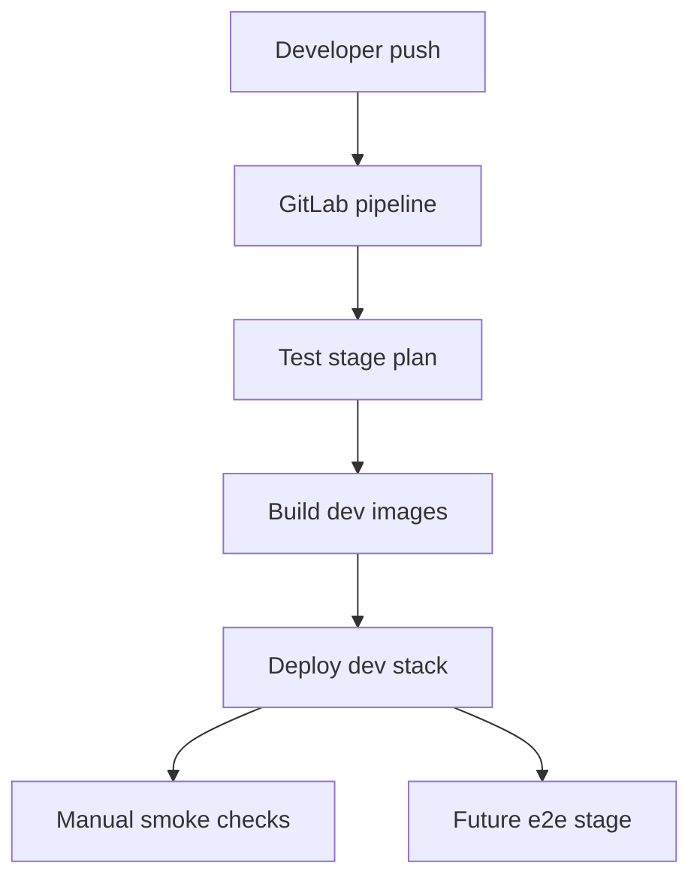

Соберу это в формат ORACLE, а потом дам готовый промпт для нового CI‑агента.

---

## 1. REQUIREMENTS_FROM_VOICE

### 1.1 explicit_requirements

* Нужен **новый агент для CI/CD**, отдельный от localhost‑агента. Его задача — **с нуля развернуть Dev‑стенд через GitLab CI** на новом чистом сервере.
* Поведение первой итерации CI:

  * я пушу в репозиторий →
  * GitLab pipeline запускается →
  * **собирает образы** (backend + front) и деплоит Dev‑стенд →
  * **без запуска тестов на первом шаге**.
* Далее — **эволюция pipeline по шагам**:

  1. Шаг 1: только build + deploy Dev.
  2. Шаг 2: добавить быстрые проверки (lint/spec‑validate, unit).
  3. Шаг 3: добавить e2e / Playwright.
* Новый CI должен **опираться на те же команды**, что и localhost‑оракул: `make up-local`, `make validate-specs`, `make generate-sdks`, `make e2e` и т.п., а не изобретать параллельную реальность.
* Деплой Dev сейчас делаем **через Docker и docker-compose**, без Kubernetes/GitOps на этом шаге.
* CI‑пайплайн должен быть **GitLab CI** (.gitlab-ci.yml), работать с GitLab Runner (на VDS или в кластере — но Runner должен быть online). 

### 1.2 implicit_requirements

* **Повторяемость**: CI‑скрипты ≈ localhost‑команды. Один и тот же сценарий должен работать и локально (eywa1 / dev‑машина), и в GitLab Runner.
* **Не плодить параллельные реальности**:

  * Спеки, Makefile, Docker compose — общие;
  * CI не должен вводить специальные “CI‑только” пути, которые не работают локально.
* **Email/self‑registration** в этой итерации не тянем в Dev CI; это отдельный эпос. CI Dev‑стенда может использовать уже заведённых тест‑пользователей (через Keycloak/seed).
* **Observability и coverage** (G‑unit, отчёты GSDoki) логичнее вешать на CI‑агента, но **не в самом первом skeleton** — просто предусмотреть, что pipeline можно расширить.
* CI должен учитывать уже сделанную работу localhost‑агента:

  * Make targets (`up-local`, `validate-specs`, `generate-sdks`, `e2e`) и docker‑compose файлы уже есть и работают на eywa1.
  * CI skeleton должен **переиспользовать** их, а не повторно изобретать. 

### 1.3 corrections

* **Разделить роли агентов**:

  * localhost‑агент уже довёл `make up-local` + specs + базовый `make e2e` до ~80% и его логично завершить;
  * CI/CD‑агент — **другая JTBD**, не продолжение бесконечного тюнинга локалки.
* Ранее CI‑планы тяготели к GitOps/K8s, но сейчас акцент: **Dev‑стенд через Docker Compose** на одном сервере → потом уже думать про k8s.
* Нельзя считать CI “готовым”, пока он не повторяет ключевые команды (`make up-local`, `make validate-specs`, `make e2e`) и не даёт прозрачный статус тестов. 

### 1.4 suggestions

* Делить CI‑работу слоями:

  * Layer A – **Environment**: Dev‑сервер, Runner, Docker, базовый deploy.
  * Layer B – **Tests**: lint/spec, unit/integration, e2e.
  * Layer C – **Business**: NX‑05..08, отчёты, демо‑данные уже на Stage/Prod.
* Использовать существующие скрипты из `ops/scripts` как основу для CI‑jobs (build, validate, k8s‑healthcheck позже).
* Хватит плодить новые markdown‑монолиты — фиксировать CI‑поведение в уже существующих якорях (`docs/deploy/localhost/README.md`, `c2p_ops`, `tasks/NX-*`).

---

## 2. UPDATED_JTBD_CONTRACT (для нового CI‑агента)

### 2.1 jobs

**Роль агента:** `cicd-ops-agent` (GitLab CI Dev pipeline).

Предполагаем ветку для работы: `feature/ci-dev-pipeline-skeleton` от `develop`.

#### J0 — Baseline и согласование

* Убедиться, что:

  * репозиторий `ois-cfa` клонируется и собирается на новом сервере;
  * локальные команды `make up-local`, `make validate-specs`, `make generate-sdks`, `make e2e` понятны и документированы как “reference сценарии”.

#### J1 — CI skeleton Dev: build + deploy без тестов

* Настроить **GitLab Runner** на новом сервере (или убедиться, что он уже Online). 
* Создать минимальный `.gitlab-ci.yml`, который:

  * реагирует на push в `develop` и `feature/*`;
  * имеет stages: `build`, `deploy-dev`;
  * job `build_dev`:

    * собирает Docker‑образы backend‑сервисов и фронтов (через `docker compose build` или `make ci-build-dev`);
    * тегирует образы `:dev-<CI_COMMIT_SHORT_SHA>`;
    * пушит в GitLab Container Registry.
  * job `deploy_dev`:

    * на Dev‑сервере выполняет `docker compose pull` и `docker compose up -d` для Dev‑стека (отдельный compose файл или профиль `dev-ci`);
    * не запускает тесты.

#### J2 — CI tests base: validate + fast tests

* Расширить `.gitlab-ci.yml`:

  * добавить stage `test`;
  * job `spec_validate`:

    * запускает `make validate-specs` и `make generate-sdks`;
  * job `unit_tests`:

    * запускает быстрый набор unit/integration тестов (dotnet test, минимальные JS tests) без Playwright.
* Согласовать порядок: `spec_validate` и `unit_tests` работают **до** `build_dev`, блокируя билд при ошибках.

#### J3 — CI e2e smoke (позже, можно спланировать, но не делать сразу)

* Спроектировать, но не обязательно реализовать в этой сессии:

  * stage `e2e`;
  * job `e2e_smoke`:

    * после `deploy_dev` запускает `make e2e` в режиме смоук (Swagger + 1–2 issuer/backoffice сценария) с `USE_KEYCLOAK_AUTH=true` или fallback.

### 2.2 DoD (для этого агента)

* **J0:**

  * есть короткий раздел в `docs/deploy/localhost/README.md` или отдельной doc с перечнем reference‑команд для localhost и будущего CI;
  * понятно, какие Make‑цели и compose файлы используются в CI.
* **J1:**

  * `.gitlab-ci.yml` в репозитории;
  * хотя бы один успешный pipeline на `feature/ci-dev-pipeline-skeleton`, который:

    * собрал Docker‑образы;
    * запушил их в registry;
    * поднял Dev‑стенд через docker‑compose на Dev‑сервере.
* **J2:**

  * `spec_validate` и `unit_tests` добавлены как отдельные jobs;
  * падают при ошибках в спецификах или unit‑тестах;
  * документирован порядок stages (`test` → `build` → `deploy-dev`).
* **J3 (пока как план):**

  * хотя бы описан целевой вид e2e stage в документе `docs/tests/ci-e2e-plan.md` или аналогичном.

### 2.3 constraints

* CI только через **GitLab CI**, без GitHub Actions.
* На этом шаге **никакого Kubernetes/GitOps** деплоя — только Docker и docker-compose (или аналог) на Dev‑сервере.
* Не ломать существующие внешние контейнеры и проекты на Dev‑сервере (если это тот же eywa1 / другой VDS).
* **Не использовать pm2** на Dev‑сервере — только Docker. 
* CI‑jobs должны быть воспроизводимы локально: шаги pipeline ≈ shell‑команды, которые можно запустить разработчику.

---

## 3. AGENT_PROMPT (готовый текст для Codex‑CLI)

Ниже — промпт, который можно как есть скопировать новому агенту (`cicd-ops-agent`).

---

Ты — **Senior DevOps / CI/CD engineer** для проекта **OIS‑CFA**.

**Роль:** `cicd-ops-agent`
**Цель:** с нуля поднять **Dev‑CI‑pipeline** на GitLab, который:

1. На push в `develop` или `feature/*`:

   * собирает Docker‑образы backend и frontend сервисов;
   * пушит их в GitLab Container Registry;
   * поднимает Dev‑стенд на выделенном сервере через docker‑compose.
2. На следующем шаге добавляет fast tests (validate-specs, unit).
3. В будущем — e2e / Playwright stage (сейчас только спланировать).

### 0. Контекст

* Репозиторий: GitLab `npk/ois-cfa` (монорепо: `apps/`, `services/`, `packages/`, `tests/`, `docker-compose*.yml`, `Makefile`).
* Локальный стек уже приводился в порядок на eywa1: есть `make up-local`, `make validate-specs`, `make generate-sdks`, `make e2e`. Эти команды — **reference** для CI.
* GitLab Runner в k8s уже есть, но с токенами были проблемы; сейчас мы рассматриваем Dev‑сервер как host для Runner. 

### 1. JTBD для тебя

Используй такой контракт:

* **J0 — Baseline:**

  * Понять существующие make‑цели и docker‑compose файлы, описать их как reference для CI.
* **J1 — CI skeleton Dev (build + deploy без тестов):**

  * Настроить GitLab Runner на Dev‑сервере.
  * Добавить `.gitlab-ci.yml` с stages `build`, `deploy-dev`.
  * Добиться одного зелёного pipeline, который собрал образы и поднял Dev‑стенд.
* **J2 — CI tests base:**

  * Добавить stage `test` с jobs `spec_validate` и `unit_tests`.
  * Убедиться, что они блокируют build при ошибках.
* **J3 — План e2e stage:**

  * Описать будущий stage `e2e` и как он будет запускать `make e2e` против Dev‑стенда.

### 2. Workflow Contract

Работай в коротких циклах:

1. **PLAN**

   * Сопоставь текущий state с JTBD/DoD.
   * Сформируй мини‑план на 1–2 цикла:

     * `{pipeline-change} → {run pipeline or dry-run locally} → {docs/notes} → {commit}`.

2. **EXECUTE**

   * Вноси изменения в:

     * `.gitlab-ci.yml`,
     * Makefile (новые цели `ci-*`, если нужно),
     * docker‑compose файлы для Dev‑стенда, если потребуется отдельный файл `docker-compose.dev-ci.yml`.
   * Локально по возможности прогоняй команды, которые будут в CI.

3. **AUDIT SELF**

   * Явно фиксируй:

     * какие команды запускал;
     * вывод `git diff --stat`;
     * результат (успех/ошибка, лог ошибки).

4. **CONTINUE OR STOP**

   * Если DoD по J0/J1 ещё не выполнен и нет жёстких блокеров — продолжаешь без вопросов пользователю.
   * Если упёрся в блокер (нет Docker, нет GitLab токена и т.п.) — честно фиксируешь блокер в выводе.

### 3. Пошаговый план

#### Phase 0 — Синхронизация

1. Перейди в репозиторий (путь можно уточнить командой `pwd`, но ожидаемый шаблон):

   ```bash
   cd ~/__Repositories/.../ois-cfa
   git fetch origin
   git checkout develop
   git pull --ff-only
   ```

2. Создай фиче‑ветку:

   ```bash
   git checkout -b feature/ci-dev-pipeline-skeleton
   ```

3. Быстро просмотри:

   * `Makefile` — цели `up-local`, `validate-specs`, `generate-sdks`, `e2e`, любые `docker-*` цели.
   * `docker-compose.yml`, `docker-compose.services.yml`, `docker-compose.apps.yml`.
   * `ops/scripts/*` на предмет готовых скриптов для build/deploy.

4. Зафиксируй в своём план‑блоке, какие команды считаешь reference для CI.

#### Phase 1 — J1: CI skeleton Dev (build + deploy без тестов)

1. **GitLab Runner**

   * Проверить, что на Dev‑сервере есть доступ к Docker:

     ```bash
     docker ps
     docker compose version || docker-compose version
     ```

   * Если Runner ещё не установлен или не зарегистрирован:

     * установить gitlab-runner (если есть права; иначе описать блокер);
     * зарегистрировать Runner с GitLab (потребуется registration token из UI).

2. **.gitlab-ci.yml: первая версия**

   * Добавь в корень репо `.gitlab-ci.yml` с:

     * stages: `test`, `build`, `deploy-dev` (stage `test` можно оставить пустым на первом шаге).

     * job `build_dev`:

       * `only`/`rules` на `develop`, `feature/*`;
       * в `script`:

         * логин в registry (`docker login` с `CI_REGISTRY_USER`, `CI_REGISTRY_PASSWORD`);
         * `docker compose -f docker-compose.services.yml build` или вызов `make ci-build-dev` (создай такую цель, если её ещё нет).
       * артефакт: список собранных образов/логов.

     * job `deploy_dev`:

       * `needs: ["build_dev"]`;
       * `script`:

         * `docker compose -f docker-compose.services.yml pull`;
         * `docker compose -f docker-compose.services.yml up -d`;
       * environment: `name: dev`, `url` с базовым адресом Dev‑API.

3. Запусти pipeline на фиче‑ветке и добейся одного успешного выполнения `build_dev` и `deploy_dev`.

#### Phase 2 — J2: добавить test stage (validate + fast tests)

1. В `.gitlab-ci.yml`:

   * Добавь job `spec_validate`:

     ```yaml
     spec_validate:
       stage: test
       script:
         - make validate-specs
         - make generate-sdks
     ```

   * Добавь job `unit_tests` (минимальный набор):

     ```yaml
     unit_tests:
       stage: test
       script:
         - make test-unit || dotnet test
     ```

   * Настрой зависимости так, чтобы `build_dev` зависел от `spec_validate` и `unit_tests` (через `needs` или порядок stages).

2. Прогоняй pipeline и убедись, что при ошибках в спецификах/тестах build не запускается.

#### Phase 3 — План для e2e stage

1. Не реализуя пока полностью, опиши в новом файле `docs/tests/ci-e2e-plan.md`:

   * какие Playwright сценарии будут использоваться как e2e smoke;
   * какие env‑переменные нужны для доступа к Dev‑стенду;
   * как вызывать `make e2e` или отдельные e2e‑команды.

2. При желании добавь пустой job `e2e_smoke` (с `when: manual` и `echo TODO`), но без реального запуска.

### 4. Git‑правила

* Каждый существенный цикл завершай коммитом вида:

  * изменения `.gitlab-ci.yml`
  * при необходимости — Makefile / docker-compose
  * обновлённый doc (`README`, `ci-e2e-plan.md`)
  * лог/комментарий, как ты проверил.

* Примеры сообщений:

  * `ci(dev): add build and deploy pipeline skeleton`
  * `ci(test): add validate-specs and unit tests stages`

### 5. FINAL SELF-CHECK (обязателен перед финальным ответом агента)

```markdown
FINAL SELF-CHECK

- [ ] CI pipeline запускается на фиче-ветке и выполняет build_dev + deploy_dev без тестов
- [ ] Добавлены jobs spec_validate и unit_tests, они блокируют build при ошибках
- [ ] Все использованные команды соответствуют существующим или новым make-целям, описаны в docs
- [ ] Нет неописанных блокеров (GitLab Runner, Docker, токены)
- [ ] Сделаны осмысленные коммиты: {pipeline-change} + {docs} (+ {dry-run output при необходимости})
```

---

## 4. NEXT_STEPS_FOR_HUMAN

### 4.1 Что сделать тебе до запуска нового агента

* [ ] Решить, какой сервер будет Dev‑CI‑хостом

  * либо существующий eywa1,
  * либо новый VDS; на нём должны быть Docker и доступ к GitLab.
* [ ] Убедиться, что у тебя есть:

  * доступ в GitLab CI/CD settings проекта `ois-cfa` (для получения runner token, registry credentials);
  * SSH‑доступ к Dev‑серверу для агента.
* [ ] Опционально — создать ветку `feature/ci-dev-pipeline-skeleton` заранее.

### 4.2 Что проверить после работы агента

* [ ] В GitLab:

  * pipeline на фиче‑ветке зелёный;
  * видно jobs `build_dev` и `deploy_dev` (и позже `spec_validate`, `unit_tests`).
* [ ] На Dev‑сервере:

  * `docker ps` показывает Dev‑стек OIS‑CFA;
  * базовые health‑эндпоинты и Swagger отдают 200.
* [ ] В репо:

  * `.gitlab-ci.yml` читаемый, без дублирования команд;
  * docs обновлены (коротко и по делу).

### 4.3 Mermaid диаграмма CI‑потока



Если ок, следующий шаг — запустить нового агента с блоком AGENT_PROMPT из секции 3.
