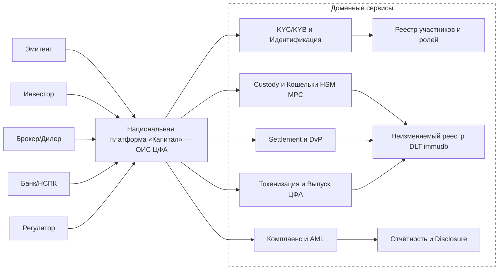
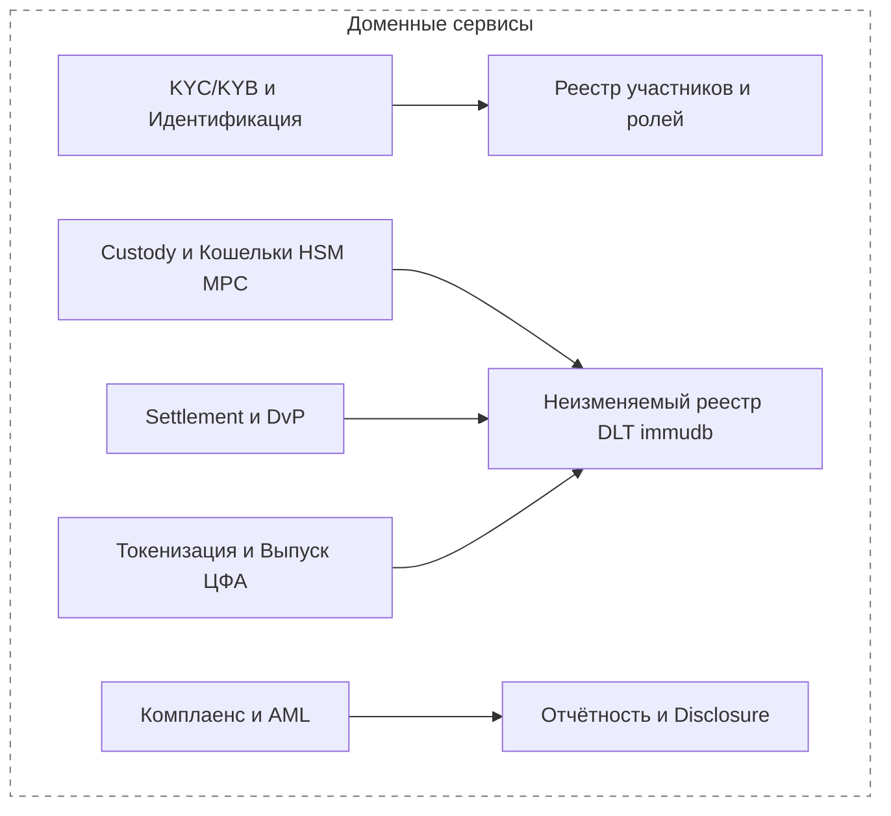

# TL;DR

* Converted your “Капитал — ОИС ЦФА” context block into **Mermaid** with a dashed **Доменные сервисы** subgraph.
* **No parentheses used** in any labels to avoid renderer issues.
* Arrows mirror the logic: участники → Платформа → доменные сервисы → реестр и отчётность.

# Steps

1. Copy the code below into any Mermaid-enabled renderer.
2. If you need bi-directional arrows, replace `-->` with `<-->`.
3. Tweak styles only if your theme hides the dashed border.

---

## Diagram 1 — Context: Участники → Платформа → Доменные сервисы

---

## Diagram 2 — Доменные сервисы только

---

## Mapping of sanitized labels

| Original label                            | Mermaid label used                         |
| ----------------------------------------- | ------------------------------------------ |
| Национальная платформа «Капитал»  ОИС ЦФА | Национальная платформа «Капитал» — ОИС ЦФА |
| Custody / Кошельки  HSM/MPC               | Custody и Кошельки HSM MPC                 |
| Неизменяемый реестр  DLT/immudb           | Неизменяемый реестр DLT immudb             |
| Брокер/Дилер                              | Брокер/Дилер                               |
| KYC/KYB и Идентификация                   | KYC/KYB и Идентификация                    |
| Settlement и DvP                          | Settlement и DvP                           |

---

## Next actions

* Нужен такой же экспорт по **большой общей диаграмме**. Если есть исходник или более чёткий снимок, дам полный Mermaid 1-в-1.
* Сказать, где нужны двунаправленные стрелки и где обязательны связи платформы с реестром напрямую — добавлю.
