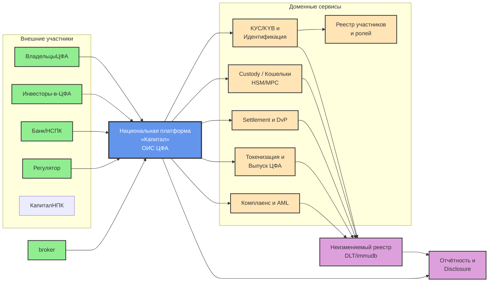
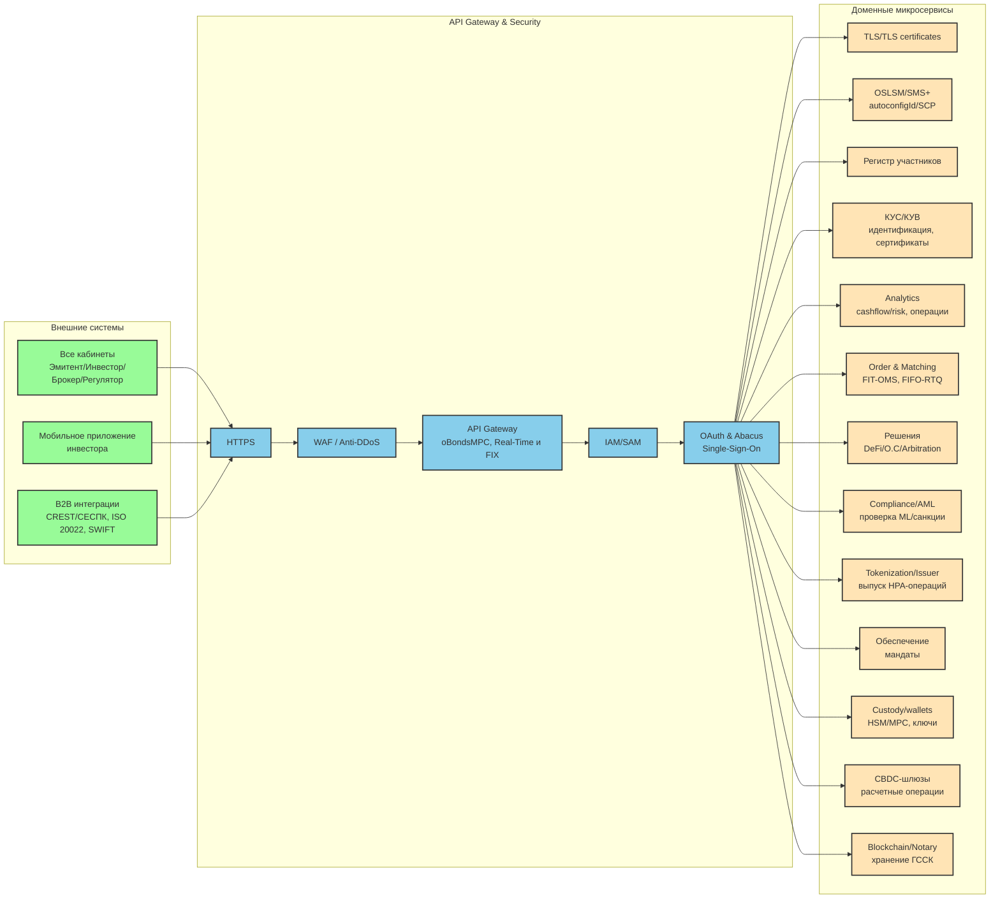
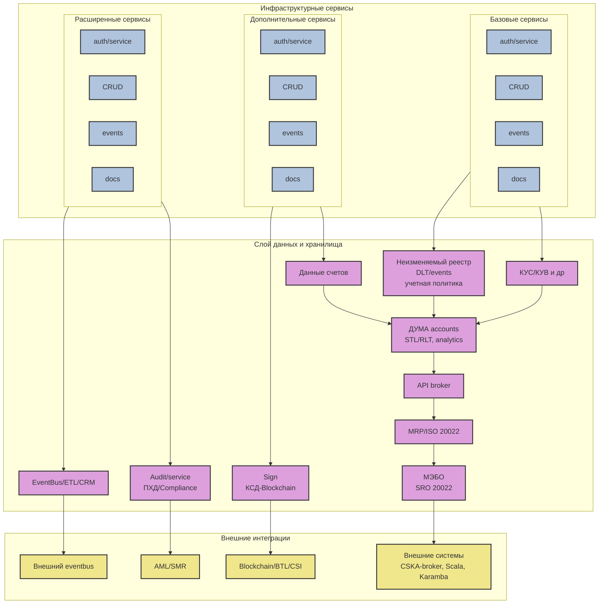

### Диаграмма 1: C4 Context - Национальная платформа «Капитал»

### Диаграмма 2: Детальная техническая архитектура платформы - Часть 1

Эта диаграмма показывает поток от внешних систем через API Gateway к доменным микросервисам:

### Диаграмма 3: Детальная техническая архитектура платформы - Часть 2

Эта диаграмма показывает инфраструктурные сервисы и слой данных:

## 📊 Пояснения к диаграммам

### Диаграмма 1 - C4 Context
Показывает высокоуровневый контекст платформы «Капитал»:
- **Внешние участники**: Эмитенты, инвесторы, брокеры, банки, регуляторы
- **Центральная платформа**: ОИС ЦФА (Оператор информационной системы цифровых финансовых активов)
- **Доменные сервисы**: KYC/KYB, Custody (HSM/MPC для ключей), Settlement (расчеты), Токенизация, Комплаенс
- **Инфраструктура**: Неизменяемый реестр на базе DLT/immudb, система отчетности

### Диаграмма 2 - Микросервисная архитектура (Frontend)
Детальная схема обработки запросов:
- **Внешние системы**: Веб-кабинеты, мобильные приложения, B2B интеграции (CREST, SWIFT, ISO 20022)
- **Security Layer**: WAF, Anti-DDoS, API Gateway с поддержкой разных протоколов
- **Аутентификация**: IAM/SAM, OAuth 2.0, Single Sign-On через Abacus
- **Доменные микросервисы**: 
  - Управление участниками и сертификатами
  - Аналитика (cashflow, риски)
  - Система торгов (Order Matching с FIFO)
  - DeFi решения и арбитраж
  - AML/Compliance с проверками санкций
  - Токенизация и выпуск активов
  - Custody с HSM/MPC
  - CBDC шлюзы для расчетов
  - Blockchain нотариат

### Диаграмма 3 - Инфраструктура и данные (Backend)
Показывает слой хранения и интеграций:
- **Инфраструктурные сервисы**: Повторяющиеся паттерны auth/CRUD/events/docs для каждого домена
- **Слой данных**:
  - Неизменяемый реестр (DLT) для аудита
  - Данные счетов и участников
  - Электронная подпись (КСД-Blockchain)
  - Audit trail для compliance
  - EventBus для асинхронной обработки
  - ДУМА (Депозитарная Учетная Микросервисная Архитектура) с STL/RTL
- **Внешние интеграции**:
  - MRP/ISO 20022 для стандартизированного обмена
  - МЭБО для межбанковских операций
  - Blockchain/BTL/CSI
  - AML/SMR системы

## 🎨 Цветовая легенда

- 🟦 **Синий**: Центральная платформа (ядро системы)
- 🟩 **Зеленый**: Внешние участники и системы
- 🟡 **Желтый/Бежевый**: Доменные микросервисы
- 🟪 **Фиолетовый**: Слой данных и хранилища
- 🔵 **Голубой**: API Gateway и security слой
- 🟨 **Золотой**: Интеграционный слой

## 📝 Технические особенности реализации

### Замена круглых скобок
Все технические детали, которые были в скобках в оригинале, представлены через:
- Переносы строк внутри узлов (` `)
- Разделители (запятая, тире)
- Контекстные пояснения без скобок

Например:
- `Custody / Кошельки (HSM/MPC)` → `Custody / Кошельки HSM/MPC`
- `Order & Matching (FIT-OMS, FIFO-RTQ)` → `Order & Matching FIT-OMS, FIFO-RTQ`

### Группировка через subgraph
Использованы именованные подграфы для логической группировки компонентов, что соответствует пунктирным контурам в оригинале.

### Стилизация
Применены CSS классы для визуального разделения типов компонентов:
- `platformStyle` - для центральной платформы
- `externalStyle` - для внешних участников
- `serviceStyle` - для микросервисов
- `dataStyle` - для хранилищ данных
- `gatewayStyle` - для API Gateway слоя
- `integrationStyle` - для интеграционных компонентов

---

**Примечание**: Диаграммы сохраняют все ключевые элементы оригиналов и могут быть отрендерены в любом markdown-редакторе с поддержкой Mermaid (Obsidian, GitHub, GitLab, VS Code и т.д.).