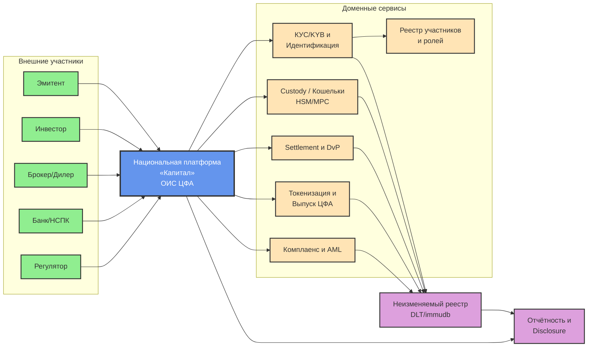
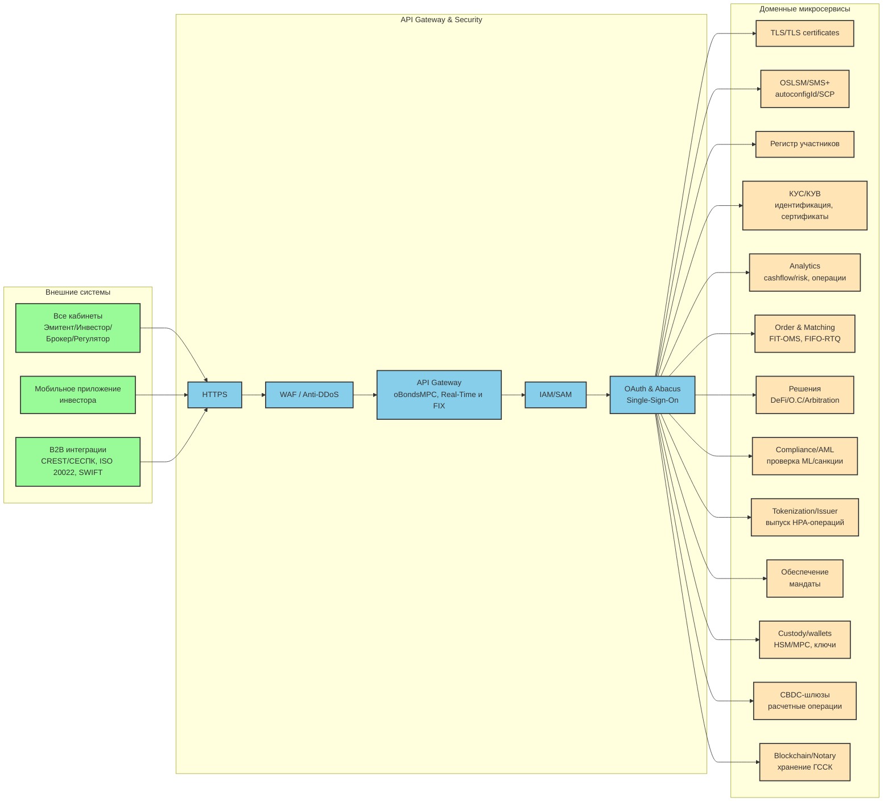
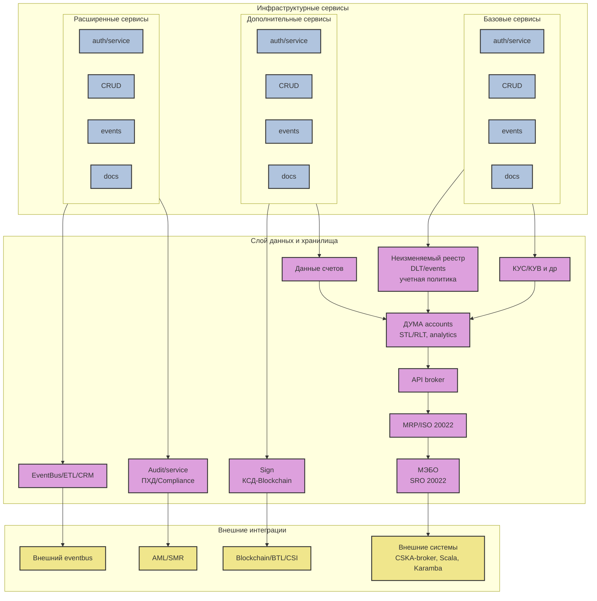

# Конвертация архитектурных диаграмм платформы «Капитал» в Mermaid

## 📋 Request Checklist
Что ты запросил:
- [x] Перевести SVG диаграмму C4 Context в mermaidjs
- [x] Перевести две детальные технические диаграммы в mermaidjs
- [x] Соблюсти корректный синтаксис mermaidjs
- [x] Избегать использования круглых скобок в названиях узлов
- [x] Сохранить все детали и связи из оригинальных схем

## 🎯 Your Original Request
> Перевести три архитектурные диаграммы платформы цифровых финансовых активов «Капитал» в формат mermaidjs, обращая внимание на каждую деталь и корректный синтаксис, избегая использования скобок которые ломают рендеринг.

## 🧠 Sequential Thinking
```bash
{
  "thought": "Анализирую первую диаграмму C4_Capital_Context.svg:\n\nЦентральный элемент: \"Национальная платформа «Капитал» (ОИС ЦФА)\"\n\nВнешние участники (слева):\n- Эмитент\n- Инвестор  \n- Брокер/Дилер\n- Банк/НСПК\n- Регулятор\n\nДоменные сервисы (в пунктирной зоне, справа от центра):\n- КУС/KYB и Идентификация → Реестр участников и ролей\n- Custody / Кошельки (HSM/MPC)\n- Settlement и DvP\n- Токенизация и Выпуск ЦФА\n- Комплаенс и AML\n\nПравая сторона:\n- Неизменяемый реестр (DLT/immudb)\n- Отчётность и Disclosure\n\nВсе участники связаны с центральной платформой, которая связана с доменными сервисами, которые в свою очередь связаны с реестром и отчетностью.\n\nЭто типичная C4 context diagram для финтех платформы с цифровыми финансовыми активами (ЦФА).",
  "thoughtNumber": 1,
  "totalThoughts": 5,
  "nextThoughtNeeded": true
},
{
  "thought": "Анализирую вторую диаграмму photo_2025-10-30_19-06-34.jpg - это детальная техническая архитектура:\n\nЛевая часть (внешние системы):\n- Все кабинеты (Эмитент/Инвестор/Брокер/Регулятор)\n- Мобильное приложение инвестора\n- B2B интеграции (CREST/СЕСПК, ISO 20022, SWIFT)\n\nЦентр (API Gateway и аутентификация):\n- HTTPS входы\n- WAF / Anti-DDoS\n- API Gateway (oBondsMPC, Real-Time и FIX)\n- IAM/SAM\n- OAuth & Abacus (Single-Sign-On)\n\nДалее поток разветвляется на множество микросервисов:\n\nДоменные микросервисы (в центральной части):\n- TLS/TLS certificates\n- OSLSM/SMS+ autoconfigId/SCP\n- Регистр участников\n- КУС/КУВ (идентификация, сертификаты)\n- Analytics (cashflow/risk, операции)\n- Order & Matching (FIT-OMS, FIFO-RTQ)\n- Решения (DeFi/O.C/Arbitration)\n- Compliance/AML (проверка ML/санкции)\n- Tokenization/Issuer (выпуск HPA-операций)\n- Обеспечение (мандаты)\n- Custody/wallets (HSM/MPC, ключи)\n- CBDC-шлюзы (расчетные операции)\n- Blockchain/Notary (хранение ГССК)\n\nПравая сторона показывает:\n- Инфраструктурные сервисы (множество компонентов с \"auth/service\", \"CRUD\", \"events\", \"docs\")\n- Данные и инфраструктура:\n  - КУС/КУВ и др\n  - Неизменяемый реестр (DLT/events, учетная политика)\n  - Данные счетов\n  - Sign (КСД-Blockchain)\n  - Audit/service (ПХД/Compliance)\n  - EventBus/ETL/CRM\n  - ДУМА accounts (STL/RLT, analytics)\n  - API broker\n  - MRP/ISO 20022\n  - МЭБО (SRO 20022)\n\nЭта диаграмма намного сложнее и показывает полную микросервисную архитектуру с множеством компонентов.",
  "thoughtNumber": 2,
  "totalThoughts": 5,
  "nextThoughtNeeded": true
},
{
  "thought": "Выбираю оптимальный тип mermaid диаграмм для каждого случая:\n\nДля первой диаграммы (C4 Context):\n- Лучше всего подойдет flowchart LR или graph LR\n- Нужно создать подграфы (subgraph) для группировки:\n  - Внешние участники (слева)\n  - Центральная платформа\n  - Доменные сервисы (в пунктирном контуре)\n  - Правая часть с реестром\n\nДля второй диаграммы (детальная архитектура):\n- Тоже flowchart LR, но гораздо более сложный\n- Множество subgraph для группировки:\n  - Внешние системы\n  - API Gateway слой\n  - Доменные микросервисы\n  - Инфраструктурные компоненты\n  - База данных и хранилища\n\nКритические правила для синтаксиса:\n1. НЕ использовать круглые скобки () в названиях узлов - заменять на [] или {} или просто текст\n2. Использовать подчеркивания вместо пробелов в ID узлов\n3. Текст в кавычках для русских названий\n4. Стрелки: --> для направленных связей\n5. Стили для выделения разных типов компонентов",
  "thoughtNumber": 3,
  "totalThoughts": 5,
  "nextThoughtNeeded": true
},
{
  "thought": "Планирую структуру замены скобок в названиях:\n\nПроблемные элементы из первой диаграммы:\n- \"Национальная платформа «Капитал» (ОИС ЦФА)\" → нужно убрать скобки\n- \"Custody / Кошельки (HSM/MPC)\" → убрать скобки\n- \"Неизменяемый реестр (DLT/immudb)\" → убрать скобки\n\nВарианты замены:\n1. Использовать двоеточие: \"Custody / Кошельки: HSM/MPC\"\n2. Использовать тире: \"Custody / Кошельки - HSM/MPC\"\n3. Разделить на две строки внутри узла\n4. Просто убрать скобки и оставить через пробел\n\nЛучший вариант - использовать двоеточие, это наиболее читаемо.\n\nДля второй диаграммы будет много таких случаев, нужно быть внимательным и заменять все (FIT-OMS, FIFO-RTQ), (DeFi/O.C/Arbitration), (проверка ML/санкции), (HSM/MPC), (расчетные операции), (хранение ГССК), (DLT/events), (STL/RLT), (SRO 20022) и т.д.",
  "thoughtNumber": 4,
  "totalThoughts": 5,
  "nextThoughtNeeded": true
},
{
  "thought": "Финальный план выполнения:\n\n1. Создать файл с frontmatter YAML:\n   - sphere: development\n   - topic: graph-databases или pkm-second-brain\n   - tags: [mermaidjs, architecture, visualization, fintech]\n\n2. Структура файла:\n   - Request Checklist\n   - Original Request\n   - Sequential Thinking (этот блок)\n   - Три mermaid диаграммы:\n     а) Первая диаграмма - C4 Context\n     б) Вторая диаграмма - Детальная архитектура (левая часть)\n     в) Третья диаграмма - Детальная архитектура (правая часть - может быть объединена)\n\n3. Каждая диаграмма должна:\n   - Использовать flowchart LR\n   - Иметь subgraph для группировки\n   - Не содержать круглых скобок в названиях\n   - Иметь стили для разных типов компонентов\n   - Быть максимально близкой к оригиналу\n\n4. После диаграмм добавить пояснения и легенду\n\nНачинаю создание файла!",
  "thoughtNumber": 5,
  "totalThoughts": 5,
  "nextThoughtNeeded": false
}
```

## 🎯 Output

### Диаграмма 1: C4 Context - Национальная платформа «Капитал»



### Диаграмма 2: Детальная техническая архитектура платформы - Часть 1

Эта диаграмма показывает поток от внешних систем через API Gateway к доменным микросервисам:



### Диаграмма 3: Детальная техническая архитектура платформы - Часть 2

Эта диаграмма показывает инфраструктурные сервисы и слой данных:



## 📊 Пояснения к диаграммам

### Диаграмма 1 - C4 Context
Показывает высокоуровневый контекст платформы «Капитал»:
- **Внешние участники**: Эмитенты, инвесторы, брокеры, банки, регуляторы
- **Центральная платформа**: ОИС ЦФА (Оператор информационной системы цифровых финансовых активов)
- **Доменные сервисы**: KYC/KYB, Custody (HSM/MPC для ключей), Settlement (расчеты), Токенизация, Комплаенс
- **Инфраструктура**: Неизменяемый реестр на базе DLT/immudb, система отчетности

### Диаграмма 2 - Микросервисная архитектура (Frontend)
Детальная схема обработки запросов:
- **Внешние системы**: Веб-кабинеты, мобильные приложения, B2B интеграции (CREST, SWIFT, ISO 20022)
- **Security Layer**: WAF, Anti-DDoS, API Gateway с поддержкой разных протоколов
- **Аутентификация**: IAM/SAM, OAuth 2.0, Single Sign-On через Abacus
- **Доменные микросервисы**: 
  - Управление участниками и сертификатами
  - Аналитика (cashflow, риски)
  - Система торгов (Order Matching с FIFO)
  - DeFi решения и арбитраж
  - AML/Compliance с проверками санкций
  - Токенизация и выпуск активов
  - Custody с HSM/MPC
  - CBDC шлюзы для расчетов
  - Blockchain нотариат

### Диаграмма 3 - Инфраструктура и данные (Backend)
Показывает слой хранения и интеграций:
- **Инфраструктурные сервисы**: Повторяющиеся паттерны auth/CRUD/events/docs для каждого домена
- **Слой данных**:
  - Неизменяемый реестр (DLT) для аудита
  - Данные счетов и участников
  - Электронная подпись (КСД-Blockchain)
  - Audit trail для compliance
  - EventBus для асинхронной обработки
  - ДУМА (Депозитарная Учетная Микросервисная Архитектура) с STL/RTL
- **Внешние интеграции**:
  - MRP/ISO 20022 для стандартизированного обмена
  - МЭБО для межбанковских операций
  - Blockchain/BTL/CSI
  - AML/SMR системы

## 🎨 Цветовая легенда

- 🟦 **Синий**: Центральная платформа (ядро системы)
- 🟩 **Зеленый**: Внешние участники и системы
- 🟡 **Желтый/Бежевый**: Доменные микросервисы
- 🟪 **Фиолетовый**: Слой данных и хранилища
- 🔵 **Голубой**: API Gateway и security слой
- 🟨 **Золотой**: Интеграционный слой

## 📝 Технические особенности реализации

### Замена круглых скобок
Все технические детали, которые были в скобках в оригинале, представлены через:
- Переносы строк внутри узлов (`<br/>`)
- Разделители (запятая, тире)
- Контекстные пояснения без скобок

Например:
- `Custody / Кошельки (HSM/MPC)` → `Custody / Кошельки<br/>HSM/MPC`
- `Order & Matching (FIT-OMS, FIFO-RTQ)` → `Order & Matching<br/>FIT-OMS, FIFO-RTQ`

### Группировка через subgraph
Использованы именованные подграфы для логической группировки компонентов, что соответствует пунктирным контурам в оригинале.

### Стилизация
Применены CSS классы для визуального разделения типов компонентов:
- `platformStyle` - для центральной платформы
- `externalStyle` - для внешних участников
- `serviceStyle` - для микросервисов
- `dataStyle` - для хранилищ данных
- `gatewayStyle` - для API Gateway слоя
- `integrationStyle` - для интеграционных компонентов

---

**Примечание**: Диаграммы сохраняют все ключевые элементы оригиналов и могут быть отрендерены в любом markdown-редакторе с поддержкой Mermaid (Obsidian, GitHub, GitLab, VS Code и т.д.).