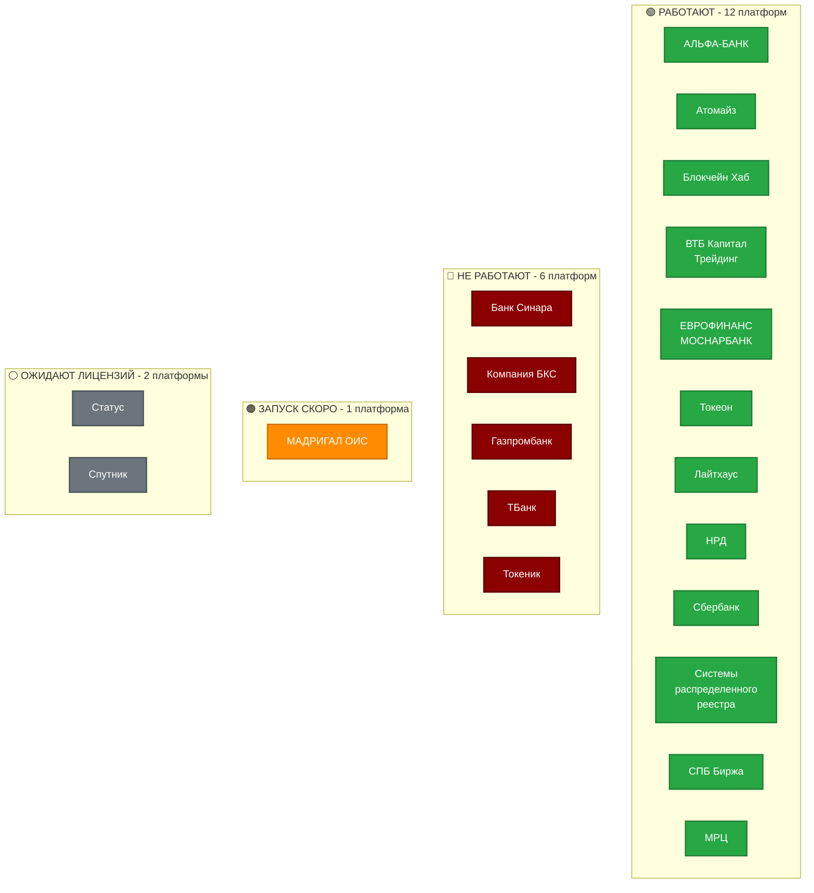
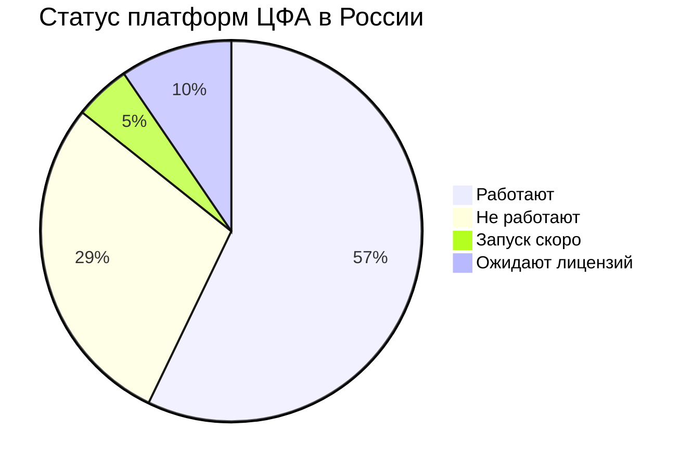
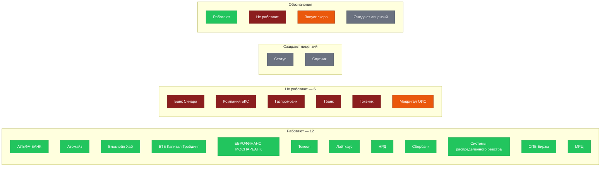

# Статус платформ ЦФА в России

## 📋 Request Checklist
Что ты запросил:
- [x] Создать mermaid диаграмму статуса платформ ЦФА
- [x] Отобразить группировку по статусам работы
- [x] Использовать цветовую кодировку: зеленый (работают), бордовый (не работают), оранжевый (запуск скоро), серый (ожидают лицензий)
- [x] Добавить контекст о переходе Ильи Хабарова
- [x] Включить таблицу с деталями

## 🎯 Your Original Request
> Конвертировать инфографику со статусами платформ ЦФА в mermaid диаграмму. Зеленая заливка - работающие платформы, бордовая - неработающие, оранжевая - скоро запустятся, серая - ожидают лицензий. Добавить контекст о переходе Ильи Хабарова из Банка Синара в БКС.

## 🧠 Sequential Thinking
```bash
{
  "thought": "Анализирую изображение статуса платформ ЦФА:\n\nСтруктура данных:\n\n**РАБОТАЮТ (12 платформ) - ЗЕЛЕНЫЕ:**\nЛевая колонка:\n1. АЛЬФА-БАНК\n2. Блокчейн Хаб\n3. ЕВРОФИНАНС МОСНАРБАНК\n4. Лайтхаус\n5. Сбербанк\n6. СПБ Биржа\n\nПравая колонка:\n7. Атомайз\n8. ВТБ Капитал Трейдинг\n9. Токеон\n10. НРД\n11. Системы распределенного реестра\n12. МРЦ\n\n**НЕ РАБОТАЮТ (6 платформ) - БОРДОВЫЕ:**\nЛевая колонка:\n1. Банк Синара\n2. Газпромбанк\n3. Токеник\n\nПравая колонка:\n4. Компания БКС\n5. ТБанк\n\n**ЗАПУСК СКОРО (1 платформа) - ОРАНЖЕВЫЙ:**\n- МАДРИГАЛ ОИС\n\n**ОЖИДАЮТ ЛИЦЕНЗИЙ (2 платформы) - СЕРЫЕ:**\n1. Статус\n2. Спутник\n\n**Источник:** ТГ-канал \"ЦФА в РФ\" (https://t.me/CFA_RF)\n\n**Контекст:** Илья Хабаров перешел из Банка Синара в БКС, что может означать скорый запуск БКС.",
  "thoughtNumber": 1,
  "totalThoughts": 4,
  "nextThoughtNeeded": true
},
{
  "thought": "Выбираю оптимальный тип mermaid диаграммы:\n\nВарианты:\n1. **Flowchart с subgraph** - группировка по статусам, применение цветовых стилей\n2. **Quadrant Chart** - требует числовых осей x/y, не подходит\n3. **Pie Chart** - покажет только пропорции, не подходит\n4. **Block Diagram** - хорош для иерархии, но без цветов\n5. **Timeline** - для временной последовательности, не подходит\n\n**Лучший выбор: Flowchart TB (top-to-bottom) с subgraph**\n\nПреимущества:\n- Можно создать отдельные subgraph для каждого статуса\n- Легко применить стили (classDef) для зеленого, бордового, оранжевого, серого\n- Читаемая структура\n- Можно добавить легенду\n\nСтруктура диаграммы:\n```\nflowchart TB\n  subgraph active \"Работают (12)\"\n    [список платформ]\n  end\n  \n  subgraph inactive \"Не работают (6)\"\n    [список платформ]\n  end\n  \n  subgraph coming \"Запуск скоро\"\n    MADRIGAL\n  end\n  \n  subgraph waiting \"Ожидают лицензий (2)\"\n    [список платформ]\n  end\n```\n\nСтили:\n- activeStyle: fill:#28a745 (зеленый)\n- inactiveStyle: fill:#8b0000 (бордовый/dark red)\n- comingStyle: fill:#ff8c00 (оранжевый)\n- waitingStyle: fill:#6c757d (серый)",
  "thoughtNumber": 2,
  "totalThoughts": 4,
  "nextThoughtNeeded": true
},
{
  "thought": "Планирую дополнительные элементы визуализации:\n\n**1. Альтернативная диаграмма - Sankey/Flow**\nМожно также создать дополнительную диаграмму типа flowchart LR, которая покажет движение статусов, например:\n- Ожидают лицензий → Запуск скоро → Работают\n- Не работают ← может перейти → Работают\n\nНо это больше для концептуальной модели, а не для текущего статуса.\n\n**2. Таблица со статистикой**\nПосле mermaid добавить markdown таблицу с:\n- Колонки: Название | Статус | Тип организации | Примечания\n- Можно добавить иконки статусов 🟢🔴🟠⚪\n\n**3. Статистика в числах**\n- Всего платформ: 21\n- Работают: 12 (57%)\n- Не работают: 6 (29%)\n- Запуск скоро: 1 (5%)\n- Ожидают лицензий: 2 (9%)\n\n**4. Временная ось (Timeline)**\nМожно добавить примерный timeline развития рынка ЦФА, но данных нет.\n\nРешение: создам основную flowchart диаграмму + таблицу + статистику в текстовом виде.",
  "thoughtNumber": 3,
  "totalThoughts": 4,
  "nextThoughtNeeded": true
},
{
  "thought": "Финальный план создания файла:\n\n**Структура файла:**\n1. Frontmatter YAML:\n   - sphere: finance или profession\n   - topic: crypto или fintech\n   - tags: [цфа, blockchain, fintech, russia, регулирование]\n\n2. Заголовок и контекст\n\n3. Request Checklist\n\n4. Your Original Request\n\n5. Sequential Thinking (текущий блок)\n\n6. Основная Mermaid диаграмма: Flowchart TB с subgraph для каждого статуса\n\n7. Дополнительная диаграмма: Pie chart с распределением статусов\n\n8. Таблица с детальной информацией по всем платформам\n\n9. Статистика и инсайты:\n   - Процентное распределение\n   - Примечание о переходе Ильи Хабарова\n   - Источник данных\n\n10. Пояснения к статусам\n\n**Критические правила для mermaid:**\n- Не использовать круглые скобки в названиях узлов\n- Использовать ID без пробелов для узлов\n- Применить стили через classDef\n- Создать легенду внизу\n\nНачинаю создание файла!",
  "thoughtNumber": 4,
  "totalThoughts": 4,
  "nextThoughtNeeded": false
}
```

## 🎯 Output

### Диаграмма 1: Статус платформ ЦФА - группировка по статусам



### Диаграмма 2: Распределение платформ по статусам - процентное соотношение



## 📊 Детальная таблица платформ

| № | Название платформы | Статус | Тип организации | Примечания |
|---|-------------------|--------|-----------------|------------|
| 1 | АЛЬФА-БАНК | 🟢 Работает | Банк | Крупный частный банк |
| 2 | Атомайз | 🟢 Работает | Технологическая компания | Blockchain-решения |
| 3 | Блокчейн Хаб | 🟢 Работает | Технологическая компания | Специализация на DLT |
| 4 | ВТБ Капитал Трейдинг | 🟢 Работает | Инвестиционная компания | Часть группы ВТБ |
| 5 | ЕВРОФИНАНС МОСНАРБАНК | 🟢 Работает | Банк | Специализированный финансовый институт |
| 6 | Токеон | 🟢 Работает | Технологическая компания | Платформа токенизации |
| 7 | Лайтхаус | 🟢 Работает | Технологическая компания | DLT-решения |
| 8 | НРД | 🟢 Работает | Депозитарий | Национальный расчетный депозитарий |
| 9 | Сбербанк | 🟢 Работает | Банк | Крупнейший банк России |
| 10 | Системы распределенного реестра | 🟢 Работает | Технологическая компания | Инфраструктурный провайдер |
| 11 | СПБ Биржа | 🟢 Работает | Биржа | Санкт-Петербургская биржа |
| 12 | МРЦ | 🟢 Работает | Инфраструктура | Московский расчетный центр |
| 13 | Банк Синара | 🔴 Не работает | Банк | Илья Хабаров ушел в БКС |
| 14 | Компания БКС | 🔴 Не работает | Брокер | Ожидается запуск после прихода И.Хабарова |
| 15 | Газпромбанк | 🔴 Не работает | Банк | О запуске информации нет |
| 16 | ТБанк | 🔴 Не работает | Банк | Бывший Тинькофф |
| 17 | Токеник | 🔴 Не работает | Технологическая компания | О запуске информации нет |
| 18 | МАДРИГАЛ ОИС | 🟠 Запуск скоро | Технологическая компания | В процессе запуска |
| 19 | Статус | ⚪ Ожидает лицензию | Технологическая компания | Подана заявка на лицензию |
| 20 | Спутник | ⚪ Ожидает лицензию | Технологическая компания | Подана заявка на лицензию |

## 📈 Статистика и инсайты

### Общая статистика

**Всего платформ:** 21

**Распределение по статусам:**
- 🟢 Работают: **12 платформ (57%)**
- 🔴 Не работают: **6 платформ (29%)**
- 🟠 Запуск скоро: **1 платформа (5%)**
- ⚪ Ожидают лицензий: **2 платформы (9%)**

### Ключевые инсайты

**1. Доминирование банковского сектора**
Среди работающих платформ значительную долю занимают крупные банки (Сбербанк, Альфа-Банк, ЕВРОФИНАНС МОСНАРБАНК) и инфраструктурные финансовые организации (НРД, МРЦ, СПБ Биржа).

**2. Технологические компании как драйверы рынка**
Специализированные blockchain и DLT компании (Атомайз, Блокчейн Хаб, Токеон, Лайтхаус) активно участвуют в формировании инфраструктуры ЦФА.

**3. Потенциал роста**
Если учесть платформы со статусами "Запуск скоро" и "Ожидают лицензий", потенциальное количество активных платформ может вырасти до **15 (71%)**.

**4. Интересный кейс: переход Ильи Хабарова**
Илья Хабаров, один из визионеров рынка ЦФА, перешел из Банка "Синара" в "БКС". Это может означать:
- Банк Синара приостанавливает развитие направления ЦФА
- БКС планирует активно входить в рынок ЦФА
- Возможный запуск платформы БКС в ближайшее время

### Зрелость рынка

**Позитивные факторы:**
- Более половины платформ уже работают (57%)
- Разнообразие участников: банки, биржи, депозитарии, технологические компании
- Наличие как крупных игроков (Сбербанк, ВТБ), так и специализированных стартапов

**Вызовы:**
- Почти треть платформ (29%) получили лицензии, но не запустились
- Неясные причины неработающих платформ (кроме Банка Синара)
- Возможны регуляторные или технологические барьеры

## 🔍 Пояснения к статусам

### 🟢 Работают
Платформы, которые получили лицензию ОИС ЦФА и активно проводят операции с цифровыми финансовыми активами. Возможно проведение:
- Выпуск ЦФА
- Учет и переход прав на ЦФА
- Обмен ЦФА

### 🔴 Не работают
Платформы, о работе которых нет публичной информации, несмотря на возможное наличие лицензии. Причины могут быть различными:
- Технологические сложности
- Бизнес-модель не запущена
- Стратегические изменения (как в случае с Банком Синара)
- Ожидание подходящего рыночного момента

### 🟠 Запуск скоро
Платформы, которые публично заявили о скором запуске операций. МАДРИГАЛ ОИС находится в финальной стадии подготовки.

### ⚪ Ожидают лицензий
Платформы, которые подали заявки на получение статуса ОИС ЦФА в Банк России, но еще не получили одобрение.

## 📚 Контекст: что такое ЦФА и ОИС

**ЦФА (Цифровые Финансовые Активы)** - это цифровые права, включающие денежные требования, возможность осуществлять права по эмиссионным ценным бумагам, права участия в капитале непубличного акционерного общества.

**ОИС ЦФА (Оператор Информационной Системы)** - организация, которая имеет лицензию Банка России на ведение реестра цифровых финансовых активов и совершение сделок с ними.

**Регулирование:** Федеральный закон от 31.07.2020 № 259-ФЗ "О цифровых финансовых активах, цифровой валюте и о внесении изменений в отдельные законодательные акты Российской Федерации".

## 📌 Источник данных

Данные получены из Telegram-канала **"ЦФА в РФ"** (https://t.me/CFA_RF) - специализированного информационного канала, отслеживающего развитие рынка цифровых финансовых активов в России.

---

**Дата актуализации:** 30 октября 2025  
**Теги:** #ЦФА #ОИС #blockchain #fintech #russia #регулирование\

# GPT5 high
# TL;DR

* Сделал Mermaid для “Состояние платформ ЦФА” с тремя колонками и легендой.
* Никаких круглых скобок — вообще.
* Мадригал помечен как soon, БКС — пунктир рамки как гипотеза.

# Steps

1. Вставь код в любой Mermaid-рендер.
2. При желании убери пунктир у БКС строкой `%% style d2 ...` ниже.
3. Обновляй списки прямо в блоке — классы ок, down, soon, license.



# Table

| Категория        | Количество | Список                                                                                                                                                           |
| ---------------- | ---------: | ---------------------------------------------------------------------------------------------------------------------------------------------------------------- |
| Работают         |         12 | АЛЬФА-БАНК, Атомайз, Блокчейн Хаб, ВТБ Капитал Трейдинг, ЕВРОФИНАНС МОСНАРБАНК, Токеон, Лайтхаус, НРД, Сбербанк, Системы распределенного реестра, СПБ Биржа, МРЦ |
| Не работают      |          6 | Банк Синара, Компания БКС, Газпромбанк, Тбанк, Токеник, Мадригал ОИС                                                                                             |
| Запуск скоро     |          1 | Мадригал ОИС                                                                                                                                                     |
| Ожидают лицензий |          2 | Статус, Спутник                                                                                                                                                  |

# Next actions

* Подтверди, оставляем ли БКС как гипотезу с пунктиром или переводим в soon.
* Нужен авто-источник данных JSON → сгенерю тот же граф из списка и классов.
