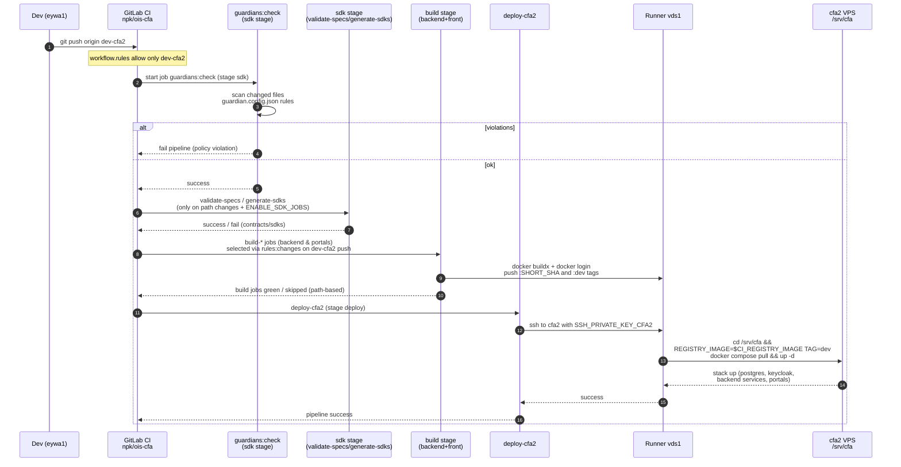
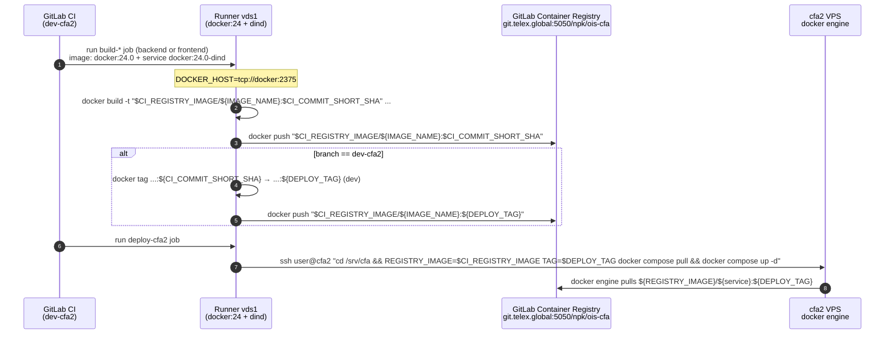
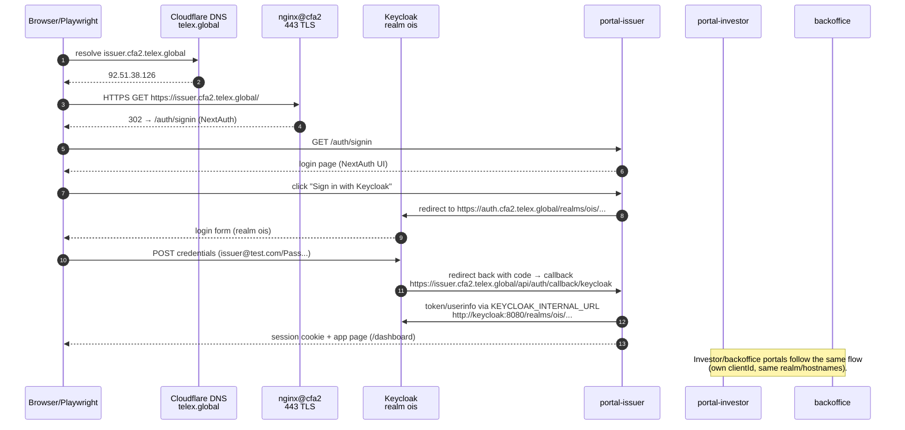

# OPS-001 · CI/CD & Ingress Architecture (dev-cfa2)

> High-level view of how commits on `dev-cfa2` flow through GitLab CI, runner `vds1`, `cfa2` docker-compose, and Cloudflare/Keycloak/portals.

## Sequence · CI/CD pipeline (dev-cfa2)



### Notes

- Path-based rules for `build-*` jobs срабатывают **только** для `CI_PIPELINE_SOURCE=="push"`; API-пайплайны с `before_sha=000...` считаются “full diff”.
- `deploy-cfa2` не переписывает compose/env на `cfa2`, он только делает `pull`/`up` уже синхронизированного бандла.
- Target runtime: все backend сервисы + три портала работают на `cfa2` (IP 92.51.38.126), а ingress по доменам `*.cfa2.telex.global` настроен через Cloudflare+nginx.

## Images & Registry flow (where images live and how they travel)



### Where images live

- **Build stage (vds1):**
  - выполняется на runner’е `vds1` в job’ах `build-*` (шаблоны `.build_backend_template` / `.build_frontend_template` в `.gitlab/gitlab-ci.dev.yml`).
  - Образы собираются через:
    - `docker build -t "$CI_REGISTRY_IMAGE/${IMAGE_NAME}:$CI_COMMIT_SHORT_SHA" -f "${DOCKERFILE}" "${BUILD_CONTEXT}"`,
    - `docker push "$CI_REGISTRY_IMAGE/${IMAGE_NAME}:$CI_COMMIT_SHORT_SHA"`,
    - при `dev-cfa2` → `docker tag ...:${CI_COMMIT_SHORT_SHA} ...:${DEPLOY_TAG}` + `docker push ...:${DEPLOY_TAG}`.
- **Registry (перманентное хранилище):**
  - `$CI_REGISTRY_IMAGE` для проекта → `git.telex.global:5050/npk/ois-cfa`.
  - Там живут:
    - “одноразовые” теги по SHA (`:${CI_COMMIT_SHORT_SHA}`),
    - стабильный тег `:dev`, на который смотрит `TAG` в compose на `cfa2`.
- **Runtime на `cfa2`:**
  - `deploy/docker-compose-at-vps/cfa2/docker-compose.yml` и `/srv/cfa/.env` используют `${REGISTRY_IMAGE}/<service>:${TAG}` (обычно `TAG=dev`).
  - job `deploy-cfa2`:
    - SSH → `cfa2`,
    - `REGISTRY_IMAGE=$CI_REGISTRY_IMAGE TAG=$DEPLOY_TAG docker compose pull && docker compose up -d`,
  - docker engine на `cfa2` подтягивает образы из GitLab Registry и перезапускает сервисы/порталы.

С точки зрения хранения:

- **Перманентно** образы лежат в GitLab Container Registry.
- На `vds1` и `cfa2` они живут только в локальном docker storage и могут быть очищены GC / очисткой.

## Sequence · HTTPS ingress & login via Keycloak (cfa2.telex.global)



### Notes

- Внешние URL **всегда** без порта: `https://auth.cfa2.telex.global` и `https://issuer|investor|backoffice.cfa2.telex.global`.
- Порт `58080` используется только как **внутренний HTTP upstream** (`KEYCLOAK_INTERNAL_URL=http://keycloak:8080` и `nginx proxy_pass http://127.0.0.1:58080`).
- Любая попытка обратиться к `https://auth.cfa2.telex.global:58080` даёт SSL error (`record length`), т.к. TLS шлётся в HTTP‑порт.

## Certificates · Paths, renewal, alerts (uk1/cfa1/cfa2)

### Where certs are stored

- **uk1 · `*.cfa.llmneighbors.com`**
  - Wildcard LE‑сертификат выпускался командой вида `certbot certonly --dns-cloudflare ... -d '*.cfa.llmneighbors.com' -d 'cfa.llmneighbors.com'`.
  - Файлы лежат на uk1 в:
    - `/etc/letsencrypt/live/cfa.llmneighbors.com/fullchain.pem`
    - `/etc/letsencrypt/live/cfa.llmneighbors.com/privkey.pem`
  - nginx-шаблоны (`nginx-cfa-portals.conf`) используют эти пути через переменную `CFA_BASE_DOMAIN`.

- **cfa1/cfa2 · llmneighbors.com**
  - Аналогично, wildcard LE для `*.cfa1.llmneighbors.com` и `*.cfa2.llmneighbors.com` хранится в:
    - `/etc/letsencrypt/live/cfa1.llmneighbors.com/{fullchain.pem,privkey.pem}`
    - `/etc/letsencrypt/live/cfa2.llmneighbors.com/{fullchain.pem,privkey.pem}`

- **cfa2 · `*.cfa2.telex.global` (наш текущий таргет)**
  - На `cfa2`:
    - `sudo certbot certonly --dns-cloudflare --dns-cloudflare-credentials /root/.secrets/cloudflare.ini --dns-cloudflare-propagation-seconds 45 -d '*.cfa2.telex.global' -d 'cfa2.telex.global' --agree-tos --email alex.ocr.ai.llm@gmail.com --non-interactive`
  - Файлы:
    - `/etc/letsencrypt/live/cfa2.telex.global/fullchain.pem`
    - `/etc/letsencrypt/live/cfa2.telex.global/privkey.pem`
  - nginx vhost `cfa2-portals.conf` использует именно эти пути в `ssl_certificate`/`ssl_certificate_key`.

### Renewal (сейчас)

- На uk1/cfa1/cfa2 certbot установлен как обычный пакет (`certbot` + `python3-certbot-dns-cloudflare`).
- Авто‑продление обычно делается:
  - через systemd‑таймер `certbot.timer` / `certbot-renew.timer`, или
  - через cron (см. соответствующие сессии uk1/cfa1, если нужно уточнить конкретный механизм).
- В этом репозитории **нет** явной конфигурации cron/systemd — это настройка на самих VPS.
- Базовые проверки на самом хосте:

```bash
ssh cfa2 "sudo certbot renew --dry-run"
ssh cfa2 "systemctl list-timers | grep certbot || echo 'no-certbot-timer'"
```

### Alerts / notifications (TLS)

- При выпуске LE‑серта для `cfa2.telex.global` используется email `alex.ocr.ai.llm@gmail.com` — Let’s Encrypt шлёт на него письма об истечении.
- GitLab / Telegram:
  - В текущих stories нет явно описанной интеграции по TLS expiry (ни GitLab alerts, ни Telegram‑бота).
  - Это кандидаты для отдельной истории (например, “OPS-001-00X: TLS expiry monitoring & Telegram alerts”), которая бы:
    - периодически гоняла `certbot renew --dry-run` или парсила даты истечения,
    - отправляла оповещения в Telegram‑бот/канал или GitLab Alert.

До тех пор основная защита — штатный auto‑renew certbot + письма LE на `alex.ocr.ai.llm@gmail.com`.

## C4-style container view (text)

```mermaid
graph LR
    subgraph GitLab
      A[.gitlab/gitlab-ci.dev.yml<br/>dev-cfa2 pipeline] --> B[guardians:check]
      B --> C[sdk stage<br/>validate-specs/generate-sdks]
      C --> D[build stage<br/>backend & portals]
      D --> E[deploy-cfa2<br/>deploy-cfa2-only]
    end

    subgraph Infra
      F[Runner vds1<br/>docker executor] --> G[cfa2 VPS<br/>/srv/cfa docker-compose]
      G --> H[Backend services<br/>api-gateway, identity, etc.]
      G --> I[Portals<br/>issuer, investor, backoffice]
      G --> J[Keycloak realm ois<br/>postgres, redis, minio]
      K[Cloudflare DNS/TLS<br/>telex.global] --> L[nginx@cfa2 443<br/>cfa2-portals.conf]
      L --> J
      L --> I
      L --> H
    end

    M[Dev/Browser/Playwright] --> K
```

### Mapping to OPS-001 stories

- **OPS-001-001 (PHASE0)** — Runner vds1 + cfa2 + GitLab/glab/vars (A ↔ F ↔ G).
- **OPS-001-002 (PHASE1)** — Backend compose/env + build/deploy (D↔E↔G↔H).
- **OPS-001-003 (PHASE2)** — Frontends + SDK + path-based CI (C↔D↔I, плюс TC1–TC3).
- **OPS-001-004 (PHASE4)** — Guardians / guardrails (B + guardian.config/check-guardians).
- **OPS-001-005 (PHASE3)** — Cloudflare ingress + Keycloak + portals login (K↔L↔J↔I + M).

> For concrete commands and step-by-step flows, see the cheatsheet: `memory-bank/tasks/ops/cicd/OPS-001-CICD-cheatsheet.md`.
