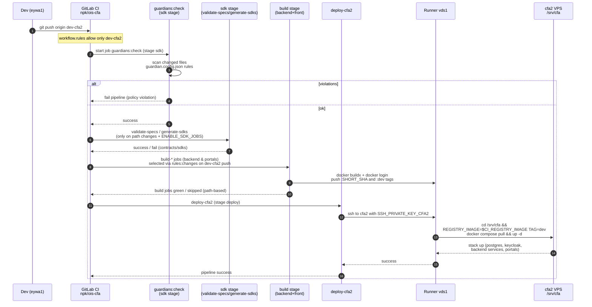
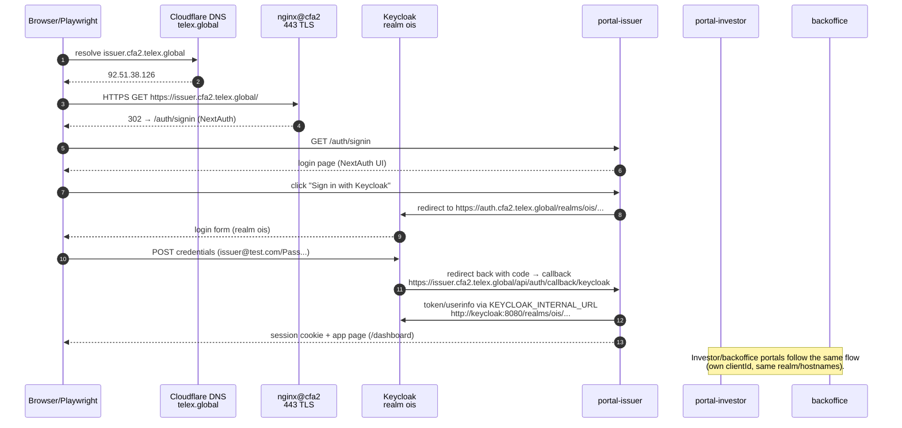

# OPS-001 · CI/CD & Ingress Architecture (dev-cfa2)

> High-level view of how commits on `dev-cfa2` flow through GitLab CI, runner `vds1`, `cfa2` docker-compose, and Cloudflare/Keycloak/portals.

## Sequence · CI/CD pipeline (dev-cfa2)



### Notes

- Path-based rules for `build-*` jobs срабатывают **только** для `CI_PIPELINE_SOURCE=="push"`; API-пайплайны с `before_sha=000...` считаются “full diff”.
- `deploy-cfa2` не переписывает compose/env на `cfa2`, он только делает `pull`/`up` уже синхронизированного бандла.
- Target runtime: все backend сервисы + три портала работают на `cfa2` (IP 92.51.38.126), а ingress по доменам `*.cfa2.telex.global` настроен через Cloudflare+nginx.

## Sequence · HTTPS ingress & login via Keycloak (cfa2.telex.global)



### Notes

- Внешние URL **всегда** без порта: `https://auth.cfa2.telex.global` и `https://issuer|investor|backoffice.cfa2.telex.global`.
- Порт `58080` используется только как **внутренний HTTP upstream** (`KEYCLOAK_INTERNAL_URL=http://keycloak:8080` и `nginx proxy_pass http://127.0.0.1:58080`).
- Любая попытка обратиться к `https://auth.cfa2.telex.global:58080` даёт SSL error (`record length`), т.к. TLS шлётся в HTTP‑порт.

## C4-style container view (text)

```mermaid
graph LR
    subgraph GitLab
      A[.gitlab/gitlab-ci.dev.yml<br/>dev-cfa2 pipeline] --> B[guardians:check]
      B --> C[sdk stage<br/>validate-specs/generate-sdks]
      C --> D[build stage<br/>backend & portals]
      D --> E[deploy-cfa2<br/>deploy-cfa2-only]
    end

    subgraph Infra
      F[Runner vds1<br/>docker executor] --> G[cfa2 VPS<br/>/srv/cfa docker-compose]
      G --> H[Backend services<br/>api-gateway, identity, etc.]
      G --> I[Portals<br/>issuer, investor, backoffice]
      G --> J[Keycloak realm ois<br/>postgres, redis, minio]
      K[Cloudflare DNS/TLS<br/>telex.global] --> L[nginx@cfa2 443<br/>cfa2-portals.conf]
      L --> J
      L --> I
      L --> H
    end

    M[Dev/Browser/Playwright] --> K
```

### Mapping to OPS-001 stories

- **OPS-001-001 (PHASE0)** — Runner vds1 + cfa2 + GitLab/glab/vars (A ↔ F ↔ G).
- **OPS-001-002 (PHASE1)** — Backend compose/env + build/deploy (D↔E↔G↔H).
- **OPS-001-003 (PHASE2)** — Frontends + SDK + path-based CI (C↔D↔I, plus rules).
- **OPS-001-004 (PHASE4)** — Guardians / guardrails (B + guardian.config/check-guardians).
- **OPS-001-005 (PHASE3)** — Cloudflare ingress + Keycloak + portals login (K↔L↔J↔I + M).

> For concrete commands and step-by-step flows, see the cheatsheet: `memory-bank/tasks/ops/cicd/OPS-001-CICD-cheatsheet.md`.

